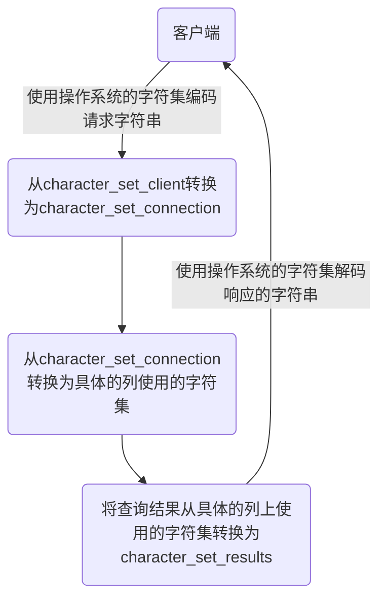

> MySQL知识及优化

<!-- more -->

相关资源：[优化视频](https://www.bilibili.com/video/BV1KW411u7vy?spm_id_from=333.337.search-card.all.click)、[官方文档](https://dev.mysql.com/doc/refman/5.7/en/)、[基础视频](https://www.bilibili.com/video/BV1iq4y1u7vj?spm_id_from=333.999.0.0)

进程：[Over](https://www.bilibili.com/video/BV1iq4y1u7vj?p=4&spm_id_from=pageDriver&vd_source=10bfbb2d4bb1646ac73508c202d5f815)

# --------------MySQL基础-------------

# 第00章_写在前面

讲师：尚硅谷-宋红康（江湖人称：康师傅）

官网：[http://www.atguigu.com](http://www.atguigu.com/)

***

## 一、MySQL数据库基础篇大纲

**MySQL数据库基础篇分为5个篇章：**

### **1. 数据库概述与MySQL安装篇**

- 第01章：数据库概述
- 第02章：MySQL环境搭建

### **2. SQL之SELECT使用篇**

- 第03章：基本的SELECT语句
- 第04章：运算符
- 第05章：排序与分页
- 第06章：多表查询
- 第07章：单行函数
- 第08章：聚合函数
- 第09章：子查询

### **3. SQL之DDL、DML、DCL使用篇**

- 第10章：创建和管理表
- 第11章：数据处理之增删改
- 第12章：MySQL数据类型精讲
- 第13章：约束

### **4. 其它数据库对象篇**

- 第14章：视图
- 第15章：存储过程与函数
- 第16章：变量、流程控制与游标
- 第17章：触发器

### **5. MySQL8 新特性篇**

- 第18章：MySQL8其它新特性


## 二、MySQL高级特性篇大纲

**MySQL高级特性分为4个篇章：**

### **1. MySQL架构篇**

- 第01章：Linux下MySQL的安装与使用
- 第02章：MySQL的数据目录
- 第03章：用户与权限管理
- 第04章：逻辑架构
- 第05章：存储引擎
- 第06章：InnoDB数据页结构

### **2. 索引及调优篇**

- 第07章：索引
- 第08章：性能分析工具的使用
- 第09章：索引优化与SQL优化
- 第10章：数据库的设计规范
- 第11章：数据库其他调优策略

### **3. 事务篇**

- 第12章：事务基础知识
- 第13章：MySQL事务日志
- 第14章：锁
- 第15章：多版本并发控制(MVCC)

### **4. 日志与备份篇**

- 第16章：其它数据库日志
- 第17章：主从复制
- 第18章：数据库备份与恢复

## 三、MySQL高手是怎样炼成的

> 针对开发工程师、DBA、运维

- mysql服务器的安装配置
- SQL编程(自定义函数、存储过程、触发器、定时任务)
- 数据库索引建立
- SQL语句优化
- 数据库内部结构和原理
- 数据库的性能监控分析与系统优化
- 各种参数常量设定
- 数据库建模优化
- 主从复制
- 分布式架构搭建、垂直切割和水平切割
- MyCat
- 数据迁移
- 容灾备份和恢复
- 对开源数据库进行二次开发

> **数据库就像一棵常青的技能树**，不管是普通开发还是首席架构、CTO 都能够从中汲取足够的技术养料。
>
> **普通开发**往往积累单点技术、比如 CRUD、锁类型、索引的数据结构…而对于**技术骨干、架构师**则往往需要对底层原理吃透，数据库事务 ACID 是如何实现的？何时命中索引、何时不能，为什么？分布式场景下数据库怎么优化才能保持高性能？
>
> 说白了，知道怎么用是一方面，知道为什么则是更为**稀缺的能力**。

很多技术专家在总结程序员核心能力的时候都会提到至关重要的一点：**精通数据库。精通意味着：**

> 第一形成知识网，更灵活地应对突发问题；
>
> 第二底层原理要懂，懂了才能更自由地应对复杂多变的业务场景。


## 四、本套课程适合人群

1、MySQL数据库初学者。建议按照顺序从套课程的“基础篇”开始学习。

2、从事后台开发(Java、Python、GO、PHP等)、MySQL开发 1~3 年的开发人员和运维人员。建议选择“基础篇”部分内容学习，或者跳过“基础篇”，直接从“高级特性篇”开始学习。

3、有资历的MySQL DBA。本课程可以作为“案头书”。在解决问题时，如果记不清某些概念或者细节比较模糊，则可以拿来参考。


## 五、希望你能获取的

先说一个笑话。这个笑话是我从万维钢的专栏里看到的。

三个逻辑学家走进酒吧，酒保问他们，三位都喝啤酒吗？
第一个逻辑学家说，我不知道。
第二个逻辑学家说，我不知道。
第三个逻辑学家说，是的。

对于知识，是需要`认真`和`讲究逻辑`的。希望这份认真、严谨你在课程的每个细节都能体会到。希望通过这套课程的系统性训练，你也能感受到这种思维方式的美，最终也能获得这种思维方式。

`具备优秀的思维能力`才是在未来可以迁移的能力，如果只是学习一些命令，则很快会过时，`思维能力`和`学习能力`的提升才是不会变的东西。

# 第01章_数据库概述

讲师：尚硅谷-宋红康（江湖人称：康师傅）

官网：[http://www.atguigu.com](http://www.atguigu.com/)

***

## 1. 为什么要使用数据库

- 持久化(persistence)：**把数据保存到可掉电式存储设备中以供之后使用**。大多数情况下，特别是企业级应用，**数据持久化意味着将内存中的数据保存到硬盘上加以”固化”**，而持久化的实现过程大多通过各种关系数据库来完成。
- 持久化的主要作用是**将内存中的数据存储在关系型数据库中**，当然也可以存储在磁盘文件、XML数据文件中。


生活中的例子：


## 2. 数据库与数据库管理系统

### 2.1 数据库的相关概念

| **DB：数据库（Database）**                                   |
| ------------------------------------------------------------ |
| 即存储数据的“仓库”，其本质是一个文件系统。它保存了一系列有组织的数据。 |
| **DBMS：数据库管理系统（Database Management System）**       |
| 是一种操纵和管理数据库的大型软件，用于建立、使用和维护数据库，对数据库进行统一管理和控制。用户通过数据库管理系统访问数据库中表内的数据。 |
| **SQL：结构化查询语言（Structured Query Language）**         |
| 专门用来与数据库通信的语言。                                 |

### 2.2 数据库与数据库管理系统的关系

数据库管理系统(DBMS)可以管理多个数据库，一般开发人员会针对每一个应用创建一个数据库。为保存应用中实体的数据，一般会在数据库创建多个表，以保存程序中实体用户的数据。 

数据库管理系统、数据库和表的关系如图所示：


### 2.3 常见的数据库管理系统排名(DBMS)

目前互联网上常见的数据库管理软件有Oracle、MySQL、MS SQL Server、DB2、PostgreSQL、Access、Sybase、Informix这几种。以下是2021年**DB-Engines Ranking** 对各数据库受欢迎程度进行调查后的统计结果：（查看数据库最新排名:https://db-engines.com/en/ranking）


。。。


对应的走势图：（https://db-engines.com/en/ranking_trend）


### 2.4 常见的数据库介绍

**Oracle**

1979 年，Oracle 2 诞生，它是第一个商用的 RDBMS（关系型数据库管理系统）。随着 Oracle 软件的名气越来越大，公司也改名叫 Oracle 公司。

2007年，总计85亿美金收购BEA Systems。

2009年，总计74亿美金收购SUN。此前的2008年，SUN以10亿美金收购MySQL。意味着Oracle 同时拥有了 MySQL 的管理权，至此 Oracle 在数据库领域中成为绝对的领导者。

2013年，甲骨文超越IBM，成为继Microsoft后全球第二大软件公司。

如今 Oracle 的年收入达到了 400 亿美金，足以证明商用（收费）数据库软件的价值。

**SQL Server**

SQL Server 是微软开发的大型商业数据库，诞生于 1989 年。C#、.net等语言常使用，与WinNT完全集成，也可以很好地与Microsoft BackOffice产品集成。

**DB2**

IBM公司的数据库产品,收费的。常应用在银行系统中。

**PostgreSQL**

PostgreSQL 的稳定性极强，最符合SQL标准，开放源码，具备商业级DBMS质量。PG对数据量大的文本以及SQL处理较快。

**SyBase**

已经淡出历史舞台。提供了一个非常专业数据建模的工具PowerDesigner。 

**SQLite**

嵌入式的小型数据库，应用在手机端。 零配置，SQlite3不用安装，不用配置，不用启动，关闭或者配置数据库实例。当系统崩溃后不用做任何恢复操作，再下次使用数据库的时候自动恢复。

**informix**

IBM公司出品，取自Information 和Unix的结合，它是第一个被移植到Linux上的商业数据库产品。仅运行于unix/linux平台，命令行操作。 性能较高，支持集群，适应于安全性要求极高的系统，尤其是银行，证券系统的应用。  

## 3. MySQL介绍


### 3.1 概述

- MySQL是一个`开放源代码的关系型数据库管理系统`，由瑞典MySQL AB（创始人Michael Widenius）公司1995年开发，迅速成为开源数据库的 No.1。
- 2008被`Sun`收购（10亿美金），2009年Sun被`Oracle`收购。`MariaDB`应运而生。（MySQL 的创造者担心 MySQL 有闭源的风险，因此创建了 MySQL 的分支项目 MariaDB）
- MySQL6.x 版本之后分为`社区版`和`商业版`。
- MySQL是一种关联数据库管理系统，将数据保存在不同的表中，而不是将所有数据放在一个大仓库内，这样就增加了速度并提高了灵活性。
- MySQL是开源的，所以你不需要支付额外的费用。
- MySQL是可以定制的，采用了`GPL（GNU General Public License）`协议，你可以修改源码来开发自己的MySQL系统。
- MySQL支持大型的数据库。可以处理拥有上千万条记录的大型数据库。
- MySQL支持大型数据库，支持5000万条记录的数据仓库，32位系统表文件最大可支持`4GB`，64位系统支持最大的表文件为`8TB`。
- MySQL使用`标准的SQL数据语言`形式。
- MySQL可以允许运行于多个系统上，并且支持多种语言。这些编程语言包括C、C++、Python、Java、Perl、PHP和Ruby等。

### 3.2 MySQL发展史重大事件

MySQL的历史就是整个互联网的发展史。互联网业务从社交领域、电商领域到金融领域的发展，推动着应用对数据库的需求提升，对传统的数据库服务能力提出了挑战。高并发、高性能、高可用、轻资源、易维护、易扩展的需求，促进了MySQL的长足发展。


### 1.4 关于MySQL 8.0

`MySQL从5.7版本直接跳跃发布了8.0版本`，可见这是一个令人兴奋的里程碑版本。MySQL 8版本在功能上做了显著的改进与增强，开发者对MySQL的源代码进行了重构，最突出的一点是多MySQL Optimizer优化器进行了改进。不仅在速度上得到了改善，还为用户带来了更好的性能和更棒的体验。

### 1.5 Why choose MySQL?


为什么如此多的厂商要选用MySQL？大概总结的原因主要有以下几点：	

1.	开放源代码，使用成本低。
2.	性能卓越，服务稳定。
3.	软件体积小，使用简单，并且易于维护。

4.	历史悠久，社区用户非常活跃，遇到问题可以寻求帮助。
5.	许多互联网公司在用，经过了时间的验证。

### 1.6 Oracle vs MySQL

Oracle 更适合大型跨国企业的使用，因为他们对费用不敏感，但是对性能要求以及安全性有更高的要求。

MySQL 由于其**体积小、速度快、总体拥有成本低，可处理上千万条记录的大型数据库，尤其是开放源码这一特点，使得很多互联网公司、中小型网站选择了MySQL作为网站数据库**（Facebook，Twitter，YouTube，阿里巴巴/蚂蚁金服，去哪儿，美团外卖，腾讯）。

## 4. RDBMS 与 非RDBMS

从排名中我们能看出来，关系型数据库绝对是 DBMS 的主流，其中使用最多的 DBMS 分别是 Oracle、MySQL 和 SQL Server。这些都是关系型数据库（RDBMS）。

### 4.1 关系型数据库(RDBMS)

#### 4.1.1 实质

- 这种类型的数据库是`最古老`的数据库类型，关系型数据库模型是把复杂的数据结构归结为简单的`二元关系`（即二维表格形式）。

  

- 关系型数据库以`行(row)`和`列(column)`的形式存储数据，以便于用户理解。这一系列的行和列被称为`表(table)`，一组表组成了一个库(database)。

- 表与表之间的数据记录有关系(relationship)。现实世界中的各种实体以及实体之间的各种联系均用`关系模型`来表示。关系型数据库，就是建立在`关系模型`基础上的数据库。

- SQL 就是关系型数据库的查询语言。


#### 4.1.2 优势

- **复杂查询**
  可以用SQL语句方便的在一个表以及多个表之间做非常复杂的数据查询。
- **事务支持**
  使得对于安全性能很高的数据访问要求得以实现。

### 4.2 非关系型数据库(非RDBMS)

#### 4.2.1 介绍

**非关系型数据库**，可看成传统关系型数据库的功能`阉割版本`，基于键值对存储数据，不需要经过SQL层的解析，`性能非常高`。同时，通过减少不常用的功能，进一步提高性能。

目前基本上大部分主流的非关系型数据库都是免费的。

#### 4.2.2 有哪些非关系型数据库

相比于 SQL，NoSQL 泛指非关系型数据库，包括了榜单上的键值型数据库、文档型数据库、搜索引擎和列存储等，除此以外还包括图形数据库。也只有用 NoSQL 一词才能将这些技术囊括进来。

**键值型数据库**

键值型数据库通过 Key-Value 键值的方式来存储数据，其中 Key 和 Value 可以是简单的对象，也可以是复杂的对象。Key 作为唯一的标识符，优点是查找速度快，在这方面明显优于关系型数据库，缺点是无法像关系型数据库一样使用条件过滤（比如 WHERE），如果你不知道去哪里找数据，就要遍历所有的键，这就会消耗大量的计算。

键值型数据库典型的使用场景是作为`内存缓存`。`Redis `是最流行的键值型数据库。


**文档型数据库**

此类数据库可存放并获取文档，可以是XML、JSON等格式。在数据库中文档作为处理信息的基本单位，一个文档就相当于一条记录。文档数据库所存放的文档，就相当于键值数据库所存放的“值”。MongoDB 是最流行的文档型数据库。此外，还有CouchDB等。

**搜索引擎数据库**

虽然关系型数据库采用了索引提升检索效率，但是针对全文索引效率却较低。搜索引擎数据库是应用在搜索引擎领域的数据存储形式，由于搜索引擎会爬取大量的数据，并以特定的格式进行存储，这样在检索的时候才能保证性能最优。核心原理是“倒排索引”。

典型产品：Solr、Elasticsearch、Splunk 等。

**列式数据库**

列式数据库是相对于行式存储的数据库，Oracle、MySQL、SQL Server 等数据库都是采用的行式存储（Row-based），而列式数据库是将数据按照列存储到数据库中，这样做的好处是可以大量降低系统的 I/O，适合于分布式文件系统，不足在于功能相对有限。典型产品：HBase等。


**图形数据库**

图形数据库，利用了图这种数据结构存储了实体（对象）之间的关系。图形数据库最典型的例子就是社交网络中人与人的关系，数据模型主要是以节点和边（关系）来实现，特点在于能高效地解决复杂的关系问题。

图形数据库顾名思义，就是一种存储图形关系的数据库。它利用了图这种数据结构存储了实体（对象）之间的关系。关系型数据用于存储明确关系的数据，但对于复杂关系的数据存储却有些力不从心。如社交网络中人物之间的关系，如果用关系型数据库则非常复杂，用图形数据库将非常简单。典型产品：Neo4J、InfoGrid等。


#### 4.2.3 NoSQL的演变

由于 SQL 一直称霸 DBMS，因此许多人在思考是否有一种数据库技术能远离 SQL，于是 NoSQL 诞生了，但是随着发展却发现越来越离不开 SQL。到目前为止 NoSQL 阵营中的 DBMS 都会有实现类似 SQL 的功能。下面是“NoSQL”这个名词在不同时期的诠释，从这些释义的变化中可以看出 `NoSQL 功能的演变`：

1970：NoSQL = We have no SQL

1980：NoSQL = Know SQL

2000：NoSQL = No SQL!

2005：NoSQL = Not only SQL

2013：NoSQL = No, SQL!

NoSQL 对 SQL 做出了很好的补充，比如实际开发中，有很多业务需求，其实并不需要完整的关系型数据库功能，非关系型数据库的功能就足够使用了。这种情况下，使用`性能更高`、`成本更低`的非关系型数据库当然是更明智的选择。比如：日志收集、排行榜、定时器等。

### 4.3 小结

NoSQL 的分类很多，即便如此，在 DBMS 排名中，还是 SQL 阵营的比重更大，影响力前 5 的 DBMS 中有 4 个是关系型数据库，而排名前 20 的 DBMS 中也有 12 个是关系型数据库。所以说，掌握 SQL 是非常有必要的。整套课程将围绕 SQL 展开。

## 5. 关系型数据库设计规则

- 关系型数据库的典型数据结构就是`数据表`，这些数据表的组成都是结构化的（Structured）。

- 将数据放到表中，表再放到库中。

- 一个数据库中可以有多个表，每个表都有一个名字，用来标识自己。表名具有唯一性。

- 表具有一些特性，这些特性定义了数据在表中如何存储，类似Java和Python中 “类”的设计。

### 5.1 表、记录、字段

- E-R（entity-relationship，实体-联系）模型中有三个主要概念是：`实体集`、`属性`、`联系集`。

- 一个实体集（class）对应于数据库中的一个表（table），一个实体（instance）则对应于数据库表中的一行（row），也称为一条记录（record）。一个属性（attribute）对应于数据库表中的一列（column），也称为一个字段（field）。


```
ORM思想 (Object Relational Mapping)体现：
数据库中的一个表  <---> Java或Python中的一个类
表中的一条数据  <---> 类中的一个对象（或实体）
表中的一个列  <----> 类中的一个字段、属性(field)
```

### 5.2 表的关联关系

- 表与表之间的数据记录有关系(relationship)。现实世界中的各种实体以及实体之间的各种联系均用关系模型来表示。

- 四种：一对一关联、一对多关联、多对多关联、自我引用

#### 5.2.1 一对一关联（one-to-one）

- 在实际的开发中应用不多，因为一对一可以创建成一张表。
- 举例：设计`学生表`：学号、姓名、手机号码、班级、系别、身份证号码、家庭住址、籍贯、紧急联系人、...
  - 拆为两个表：两个表的记录是一一对应关系。

  - `基础信息表`（常用信息）：学号、姓名、手机号码、班级、系别
  - `档案信息表`（不常用信息）：学号、身份证号码、家庭住址、籍贯、紧急联系人、...
- 两种建表原则： 
  - 外键唯一：主表的主键和从表的外键（唯一），形成主外键关系，外键唯一。 
  - 外键是主键：主表的主键和从表的主键，形成主外键关系。


#### 5.2.2 一对多关系（one-to-many）

- 常见实例场景：`客户表和订单表`，`分类表和商品表`，`部门表和员工表`。
- 举例：
  - 员工表：编号、姓名、...、所属部门

  - 部门表：编号、名称、简介
- 一对多建表原则：在从表(多方)创建一个字段，字段作为外键指向主表(一方)的主键


#### 5.2.3 多对多（many-to-many）

要表示多对多关系，必须创建第三个表，该表通常称为`联接表`，它将多对多关系划分为两个一对多关系。将这两个表的主键都插入到第三个表中。


- **举例1：学生-课程**

  - `学生信息表`：一行代表一个学生的信息（学号、姓名、手机号码、班级、系别...）

  - `课程信息表`：一行代表一个课程的信息（课程编号、授课老师、简介...）

  - `选课信息表`：一个学生可以选多门课，一门课可以被多个学生选择

    ```
    学号     课程编号  
    1        1001
    2        1001
    1        1002
    ```

- **举例2：产品-订单**

  “订单”表和“产品”表有一种多对多的关系，这种关系是通过与“订单明细”表建立两个一对多关系来定义的。一个订单可以有多个产品，每个产品可以出现在多个订单中。

  - `产品表`：“产品”表中的每条记录表示一个产品。
  - `订单表`：“订单”表中的每条记录表示一个订单。
  - `订单明细表`：每个产品可以与“订单”表中的多条记录对应，即出现在多个订单中。一个订单可以与“产品”表中的多条记录对应，即包含多个产品。


- **举例3：用户-角色**
- 多对多关系建表原则：需要创建第三张表，中间表中至少两个字段，这两个字段分别作为外键指向各自一方的主键。


#### 5.3.4 自我引用(Self reference)


## 6.回忆问答

### 1.说说你了解的常见的数据库

Oracle、MySQl、SQL Server、DB2、PGSQL；Redis、MongoDB、ES.....

### 2.谈谈你对MySQL历史、特点的理解

历史：
由瑞典的MySQL AB 公司创立，1995开发出的MySQL 2008年，MySQL被SUN公司收购
2009年，Oracle收购SUN公司，进而Oracle就获取了MySQL
2016年，MySQL8.0.0版本推出特点：
开源的、关系型的数据库
支持千万级别数据量的存储，大型的数据库

### 3.说说你对DB、DBMS、SQL的理解

DB：database，看做是数据库文件。 （类似于：.doc、.txt、.mp3、.avi、。。。）
DBMS：数据库管理系统。（类似于word工具、wps工具、记事本工具、qq影音播放器等）
MySQL数据库服务器中安装了MySQL DBMS,使用MySQL DBMS 来管理和操作DB，使用的是SQL语言。

### 4.你知道哪些非关系型数据库的类型呢？（了解）

键值型数据库：Redis
文档型数据库：MongoDB搜索引擎数据库：ES、Solr列式数据库：HBase
图形数据库：InfoGrid

### 5.表与表的记录之间存在哪些关联关系？

ORM思想。（了解）
表与表的记录之间的关系：一对一关系、一对多关系、多对多关系、自关联 （了解）

# 第02章_MySQL环境搭建

讲师：尚硅谷 宋红康（江湖人称：康师傅）

官网：[http://www.atguigu.com](http://www.atguigu.com/)

***

## 1. MySQL的卸载

### 步骤1：停止MySQL服务

在卸载之前，先停止MySQL8.0的服务。按键盘上的“Ctrl + Alt + Delete”组合键，打开“任务管理器”对话框，可以在“服务”列表找到“MySQL8.0”的服务，如果现在“正在运行”状态，可以右键单击服务，选择“停止”选项停止MySQL8.0的服务，如图所示。


### 步骤2：软件的卸载

**方式1：通过控制面板方式**

卸载MySQL8.0的程序可以和其他桌面应用程序一样直接在“控制面板”选择“卸载程序”，并在程序列表中找到MySQL8.0服务器程序，直接双击卸载即可，如图所示。这种方式删除，数据目录下的数据不会跟着删除。


**方式2：通过360或电脑管家等软件卸载**

略

**方式3：通过安装包提供的卸载功能卸载**

你也可以通过安装向导程序进行MySQL8.0服务器程序的卸载。

① 再次双击下载的mysql-installer-community-8.0.26.0.msi文件，打开安装向导。安装向导会自动检测已安装的MySQL服务器程序。

② 选择要卸载的MySQL服务器程序，单击“Remove”（移除），即可进行卸载。


③ 单击“Next”（下一步）按钮，确认卸载。


④ 弹出是否同时移除数据目录选择窗口。如果想要同时删除MySQL服务器中的数据，则勾选“Remove the data directory”，如图所示。


⑤ 执行卸载。单击“Execute”（执行）按钮进行卸载。


⑥ 完成卸载。单击“Finish”（完成）按钮即可。如果想要同时卸载MySQL8.0的安装向导程序，勾选“Yes，Uninstall MySQL Installer”即可，如图所示。


### 步骤3：残余文件的清理

如果再次安装不成功，可以卸载后对残余文件进行清理后再安装。

（1）服务目录：mysql服务的安装目录

（2）数据目录：默认在C:\ProgramData\MySQL

如果自己单独指定过数据目录，就找到自己的数据目录进行删除即可。

> 注意：请在卸载前做好数据备份
>
> 在操作完以后，需要重启计算机，然后进行安装即可。**如果仍然安装失败，需要继续操作如下步骤4。**

### 步骤4：清理注册表（选做）

如果前几步做了，再次安装还是失败，那么可以清理注册表。

如何打开注册表编辑器：在系统的搜索框中输入`regedit`

```
HKEY_LOCAL_MACHINE\SYSTEM\ControlSet001\Services\Eventlog\Application\MySQL服务 目录删除

HKEY_LOCAL_MACHINE\SYSTEM\ControlSet001\Services\MySQL服务 目录删除

HKEY_LOCAL_MACHINE\SYSTEM\ControlSet002\Services\Eventlog\Application\MySQL服务 目录删除

HKEY_LOCAL_MACHINE\SYSTEM\ControlSet002\Services\MySQL服务 目录删除

HKEY_LOCAL_MACHINE\SYSTEM\CurrentControlSet\Services\Eventlog\Application\MySQL服务目录删除

HKEY_LOCAL_MACHINE\SYSTEM\CurrentControlSet\Services\MySQL服务删除
```

> 注册表中的ControlSet001,ControlSet002,不一定是001和002,可能是ControlSet005、006之类

### 步骤5：删除环境变量配置

找到path环境变量，将其中关于mysql的环境变量删除，**切记不要全部删除。**

例如：删除  D:\develop_tools\mysql\MySQLServer8.0.26\bin;  这个部分


## 2. MySQL的下载、安装、配置

### 2.1 MySQL的4大版本

> - **MySQL Community Server 社区版本**，开源免费，自由下载，但不提供官方技术支持，适用于大多数普通用户。
>
> - **MySQL Enterprise Edition 企业版本**，需付费，不能在线下载，可以试用30天。提供了更多的功能和更完备的技术支持，更适合于对数据库的功能和可靠性要求较高的企业客户。
> - **MySQL Cluster 集群版**，开源免费。用于架设集群服务器，可将几个MySQL Server封装成一个Server。需要在社区版或企业版的基础上使用。
> - **MySQL Cluster CGE 高级集群版**，需付费。

- 目前最新版本为`8.0.27`，发布时间`2021年10月`。此前，8.0.0 在 2016.9.12日就发布了。


- 本课程中使用`8.0.26版本`。

此外，官方还提供了`MySQL Workbench`（GUITOOL）一款专为MySQL设计的`图形界面管理工具`。MySQLWorkbench又分为两个版本，分别是`社区版`（MySQL Workbench OSS）、`商用版`（MySQL WorkbenchSE）。

### 2.2 软件的下载

**1. 下载地址**

官网：[https://www.mysql.com](https://www.mysql.com/)

**2. 打开官网，点击DOWNLOADS**

然后，点击`MySQL Community(GPL) Downloads`


**3. 点击 MySQL Community Server**

 

**4. 在General Availability(GA) Releases中选择适合的版本**

Windows平台下提供两种安装文件：MySQL二进制分发版（.msi安装文件）和免安装版（.zip压缩文件）。一般来讲，应当使用二进制分发版，因为该版本提供了图形化的安装向导过程，比其他的分发版使用起来要简单，不再需要其他工具启动就可以运行MySQL。

- 这里在Windows 系统下推荐下载`MSI安装程序`；点击`Go to Download Page`进行下载即可

 

 

- Windows下的MySQL8.0安装有两种安装程序
  - `mysql-installer-web-community-8.0.26.0.msi` 下载程序大小：2.4M；安装时需要联网安装组件。
  - `mysql-installer-community-8.0.26.0.msi` 下载程序大小：450.7M；安装时离线安装即可。**推荐。**
- 如果安装MySQL5.7版本的话，选择`Archives`，接着选择MySQL5.7的相应版本即可。这里下载最近期的MySQL5.7.34版本。

 


### 2.3 MySQL8.0 版本的安装

MySQL下载完成后，找到下载文件，双击进行安装，具体操作步骤如下。

步骤1：双击下载的mysql-installer-community-8.0.26.0.msi文件，打开安装向导。

步骤2：打开“Choosing a Setup Type”（选择安装类型）窗口，在其中列出了5种安装类型，分别是Developer Default（默认安装类型）、Server only（仅作为服务器）、Client only（仅作为客户端）、Full（完全安装）、Custom（自定义安装）。这里选择“Custom（自定义安装）”类型按钮，单击“Next(下一步)”按钮。


步骤3：打开“Select Products” （选择产品）窗口，可以定制需要安装的产品清单。例如，选择“MySQL Server 8.0.26-X64”后，单击“→”添加按钮，即可选择安装MySQL服务器，如图所示。采用通用的方法，可以添加其他你需要安装的产品。


此时如果直接“Next”（下一步），则产品的安装路径是默认的。如果想要自定义安装目录，则可以选中对应的产品，然后在下面会出现“Advanced Options”（高级选项）的超链接。


单击“Advanced Options”（高级选项）则会弹出安装目录的选择窗口，如图所示，此时你可以分别设置MySQL的服务程序安装目录和数据存储目录。如果不设置，默认分别在C盘的Program Files目录和ProgramData目录（这是一个隐藏目录）。如果自定义安装目录，请避免“中文”目录。另外，建议服务目录和数据目录分开存放。


步骤4：在上一步选择好要安装的产品之后，单击“Next”（下一步）进入确认窗口，如图所示。单击“Execute”（执行）按钮开始安装。


步骤5：安装完成后在“Status”（状态）列表下将显示“Complete”（安装完成），如图所示。


### 2.4 配置MySQL8.0

MySQL安装之后，需要对服务器进行配置。具体的配置步骤如下。

步骤1：在上一个小节的最后一步，单击“Next”（下一步）按钮，就可以进入产品配置窗口。


步骤2：单击“Next”（下一步）按钮，进入MySQL服务器类型配置窗口，如图所示。端口号一般选择默认端口号3306。


其中，“Config Type”选项用于设置服务器的类型。单击该选项右侧的下三角按钮，即可查看3个选项，如图所示。


- `Development Machine（开发机器）`：该选项代表典型个人用桌面工作站。此时机器上需要运行多个应用程序，那么MySQL服务器将占用最少的系统资源。

- `Server Machine（服务器）`：该选项代表服务器，MySQL服务器可以同其他服务器应用程序一起运行，例如Web服务器等。MySQL服务器配置成适当比例的系统资源。

- `Dedicated Machine（专用服务器）`：该选项代表只运行MySQL服务的服务器。MySQL服务器配置成使用所有可用系统资源。

步骤3：单击“Next”（下一步）按钮，打开设置授权方式窗口。其中，上面的选项是MySQL8.0提供的新的授权方式，采用SHA256基础的密码加密方法；下面的选项是传统授权方法（保留5.x版本兼容性）。


步骤4：单击“Next”（下一步）按钮，打开设置服务器root超级管理员的密码窗口，如图所示，需要输入两次同样的登录密码。也可以通过“Add User”添加其他用户，添加其他用户时，需要指定用户名、允许该用户名在哪台/哪些主机上登录，还可以指定用户角色等。此处暂不添加用户，用户管理在MySQL高级特性篇中讲解。


步骤5：单击“Next”（下一步）按钮，打开设置服务器名称窗口，如图所示。该服务名会出现在Windows服务列表中，也可以在命令行窗口中使用该服务名进行启动和停止服务。本书将服务名设置为“MySQL80”。如果希望开机自启动服务，也可以勾选“Start the MySQL Server at System Startup”选项（推荐）。

下面是选择以什么方式运行服务？可以选择“Standard System Account”(标准系统用户)或者“Custom User”(自定义用户)中的一个。这里推荐前者。


步骤6：单击“Next”（下一步）按钮，打开确认设置服务器窗口，单击“Execute”（执行）按钮。


步骤7：完成配置，如图所示。单击“Finish”（完成）按钮，即可完成服务器的配置。


步骤8：如果还有其他产品需要配置，可以选择其他产品，然后继续配置。如果没有，直接选择“Next”（下一步），直接完成整个安装和配置过程。


步骤9：结束安装和配置。


### 2.5 配置MySQL8.0 环境变量

如果不配置MySQL环境变量，就不能在命令行直接输入MySQL登录命令。下面说如何配置MySQL的环境变量：

步骤1：在桌面上右击【此电脑】图标，在弹出的快捷菜单中选择【属性】菜单命令。
步骤2：打开【系统】窗口，单击【高级系统设置】链接。
步骤3：打开【系统属性】对话框，选择【高级】选项卡，然后单击【环境变量】按钮。
步骤4：打开【环境变量】对话框，在系统变量列表中选择path变量。
步骤5：单击【编辑】按钮，在【编辑环境变量】对话框中，将MySQL应用程序的bin目录（C:\Program Files\MySQL\MySQL Server 8.0\bin）添加到变量值中，用分号将其与其他路径分隔开。
步骤6：添加完成之后，单击【确定】按钮，这样就完成了配置path变量的操作，然后就可以直接输入MySQL命令来登录数据库了。

### 2.6 MySQL5.7 版本的安装、配置

- **安装**

此版本的安装过程与上述过程除了版本号不同之外，其它环节都是相同的。所以这里省略了MySQL5.7.34版本的安装截图。

- **配置**

配置环节与MySQL8.0版本确有细微不同。大部分情况下直接选择“Next”即可，不影响整理使用。

这里配置MySQL5.7时，重点强调：**与前面安装好的MySQL8.0不能使用相同的端口号。**

### 2.7 安装失败问题

MySQL的安装和配置是一件非常简单的事，但是在操作过程中也可能出现问题，特别是初学者。

**问题1：无法打开MySQL8.0软件安装包或者安装过程中失败，如何解决？**

在运行MySQL8.0软件安装包之前，用户需要确保系统中已经安装了.Net Framework相关软件，如果缺少此软件，将不能正常地安装MySQL8.0软件。


解决方案：到这个地址https://www.microsoft.com/en-us/download/details.aspx?id=42642下载Microsoft .NET Framework 4.5并安装后，再去安装MySQL。

另外，还要确保Windows Installer正常安装。windows上安装mysql8.0需要操作系统提前已安装好Microsoft Visual C++ 2015-2019。


解决方案同样是，提前到微软官网https://support.microsoft.com/en-us/topic/the-latest-supported-visual-c-downloads-2647da03-1eea-4433-9aff-95f26a218cc0，下载相应的环境。

**问题2：卸载重装MySQL失败？**

该问题通常是因为MySQL卸载时，没有完全清除相关信息导致的。

解决办法是，把以前的安装目录删除。如果之前安装并未单独指定过服务安装目录，则默认安装目录是“C:\Program Files\MySQL”，彻底删除该目录。同时删除MySQL的Data目录，如果之前安装并未单独指定过数据目录，则默认安装目录是“C:\ProgramData\MySQL”，该目录一般为隐藏目录。删除后，重新安装即可。

**问题3：如何在Windows系统删除之前的未卸载干净的MySQL服务列表？**

操作方法如下，在系统“搜索框”中输入“cmd”，按“Enter”（回车）键确认，弹出命令提示符界面。然后输入“sc delete MySQL服务名”,按“Enter”（回车）键，就能彻底删除残余的MySQL服务了。

## 3. MySQL的登录

### 3.1 服务的启动与停止

MySQL安装完毕之后，需要启动服务器进程，不然客户端无法连接数据库。

在前面的配置过程中，已经将MySQL安装为Windows服务，并且勾选当Windows启动、停止时，MySQL也自动启动、停止。

#### 方式1：使用图形界面工具

* 步骤1：打开windows服务

  * 方式1：计算机（点击鼠标右键）→ 管理（点击）→ 服务和应用程序（点击）→ 服务（点击）
  * 方式2：控制面板（点击）→ 系统和安全（点击）→ 管理工具（点击）→ 服务（点击）
  * 方式3：任务栏（点击鼠标右键）→ 启动任务管理器（点击）→ 服务（点击）
  * 方式4：单击【开始】菜单，在搜索框中输入“services.msc”，按Enter键确认 
* 步骤2：找到MySQL80（点击鼠标右键）→ 启动或停止（点击）


#### 方式2：使用命令行工具

```mysql
# 启动 MySQL 服务命令：
net start MySQL服务名

# 停止 MySQL 服务命令：
net stop MySQL服务名
```


说明：

1. start和stop后面的服务名应与之前配置时指定的服务名一致。

2. 如果当你输入命令后，提示“拒绝服务”，请以`系统管理员身份`打开命令提示符界面重新尝试。

### 3.2 自带客户端的登录与退出

当MySQL服务启动完成后，便可以通过客户端来登录MySQL数据库。注意：确认服务是开启的。

#### 登录方式1：MySQL自带客户端

开始菜单 → 所有程序 → MySQL → MySQL 8.0 Command Line Client


> 说明：仅限于root用户

#### 登录方式2：windows命令行

- 格式：

```
mysql -h 主机名 -P 端口号 -u 用户名 -p密码
```

- 举例：


```mysql
mysql -h localhost -P 3306 -u root -pabc123  # 这里我设置的root用户的密码是abc123
```


注意：

（1）-p与密码之间不能有空格，其他参数名与参数值之间可以有空格也可以没有空格。如：

```sql
mysql -hlocalhost -P3306 -uroot -pabc123
```

（2）密码建议在下一行输入，保证安全

```sql
mysql -h localhost -P 3306 -u root -p
Enter password:****
```

（3）客户端和服务器在同一台机器上，所以输入localhost或者IP地址127.0.0.1。同时，因为是连接本机：
-hlocalhost就可以省略，如果端口号没有修改：-P3306也可以省略

  简写成：

```sql
mysql -u root -p
Enter password:****
```

连接成功后，有关于MySQL Server服务版本的信息，还有第几次连接的id标识。

也可以在命令行通过以下方式获取MySQL Server服务版本的信息：

```
c:\> mysql -V
```

```
c:\> mysql --version
```

或**登录**后，通过以下方式查看当前版本信息：

```
mysql> select version();
```

#### 退出登录

```
exit
或
quit
```

## 4. MySQL演示使用

### 4.1 MySQL的使用演示

1、查看所有的数据库

```mysql
show databases;
```

> “information_schema”是 MySQL 系统自带的数据库，主要保存 MySQL 数据库服务器的系统信息，比如数据库的名称、数据表的名称、字段名称、存取权限、数据文件 所在的文件夹和系统使用的文件夹，等等
>
> “performance_schema”是 MySQL 系统自带的数据库，可以用来监控 MySQL 的各类性能指标。 
>
> “sys”数据库是 MySQL 系统自带的数据库，主要作用是以一种更容易被理解的方式展示 MySQL 数据库服务器的各类性能指标，帮助系统管理员和开发人员监控 MySQL 的技术性能。 
>
> “mysql”数据库保存了 MySQL 数据库服务器运行时需要的系统信息，比如数据文件夹、当前使用的字符集、约束检查信息，等等

为什么 Workbench 里面我们只能看到“demo”和“sys”这 2 个数据库呢？ 

这是因为，Workbench 是图形化的管理工具，主要面向开发人 员，“demo”和“sys”这 2 个数据库已经够用了。如果有特殊需求，比如，需要监控 MySQL 数据库各项性能指标、直接操作 MySQL 数据库系统文件等，可以由 DBA 通过 SQL 语句，查看其它的系统数据库。

2、创建自己的数据库

```mysql
create database 数据库名;

#创建atguigudb数据库，该名称不能与已经存在的数据库重名。
create database atguigudb;
```

3、使用自己的数据库

```mysql
use 数据库名;

#使用atguigudb数据库
use atguigudb;
```

说明：如果没有使用use语句，后面针对数据库的操作也没有加“数据名”的限定，那么会报“ERROR 1046 (3D000): No database selected”（没有选择数据库）

使用完use语句之后，如果接下来的SQL都是针对一个数据库操作的，那就不用重复use了，如果要针对另一个数据库操作，那么要重新use。

4、查看某个库的所有表格

```mysql
show tables;  #要求前面有use语句

show tables from 数据库名;
```

5、创建新的表格

```mysql
create table 表名称(
	字段名  数据类型,
	字段名 数据类型
);
```

说明：如果是最后一个字段，后面就用加逗号，因为逗号的作用是分割每个字段。

```mysql
#创建学生表
create table student(
	id int,
    name varchar(20)  #说名字最长不超过20个字符
);
```

6、查看一个表的数据

```mysql
select * from 数据库表名称;
```

```mysql
#查看学生表的数据
select * from student;
```

7、添加一条记录

```mysql
insert into 表名称 values(值列表);

#添加两条记录到student表中
insert into student values(1,'张三');
insert into student values(2,'李四');
```

报错：

```mysql
mysql> insert into student values(1,'张三');
ERROR 1366 (HY000): Incorrect string value: '\xD5\xC5\xC8\xFD' for column 'name' at row 1
mysql> insert into student values(2,'李四');
ERROR 1366 (HY000): Incorrect string value: '\xC0\xEE\xCB\xC4' for column 'name' at row 1
mysql> show create table student;
```

字符集的问题。

8、查看表的创建信息

```mysql
show create table 表名称\G


#查看student表的详细创建信息
show create table student\G
```

```mysql
#结果如下
*************************** 1. row ***************************
       Table: student
Create Table: CREATE TABLE `student` (
  `id` int(11) DEFAULT NULL,
  `name` varchar(20) DEFAULT NULL
) ENGINE=InnoDB DEFAULT CHARSET=latin1
1 row in set (0.00 sec)
```

上面的结果显示student的表格的默认字符集是“latin1”不支持中文。

9、查看数据库的创建信息

```mysql
show create database 数据库名\G

#查看atguigudb数据库的详细创建信息
show create database atguigudb\G
```

```mysql
#结果如下
*************************** 1. row ***************************
       Database: atguigudb
Create Database: CREATE DATABASE `atguigudb` /*!40100 DEFAULT CHARACTER SET latin1 */
1 row in set (0.00 sec)
```

上面的结果显示atguigudb数据库也不支持中文，字符集默认是latin1。

10、删除表格

```mysql
drop table 表名称;
```

```mysql
#删除学生表
drop table student;
```

11、删除数据库

```mysql
drop database 数据库名;
```

```mysql
#删除atguigudb数据库
drop database atguigudb;
```

### 4.2 MySQL的编码设置

#### MySQL5.7中

**问题再现：命令行操作sql乱码问题**

```mysql
mysql> INSERT INTO t_stu VALUES(1,'张三','男');
ERROR 1366 (HY000): Incorrect string value: '\xD5\xC5\xC8\xFD' for column 'sname' at row 1
```

**问题解决**

步骤1：查看编码命令

```
show variables like 'character_%';
show variables like 'collation_%';
```

步骤2：修改mysql的数据目录下的my.ini配置文件

```ini
[mysql]  #大概在63行左右，在其下添加
... 
default-character-set=utf8  #默认字符集

[mysqld]  # 大概在76行左右，在其下添加
...
character-set-server=utf8
collation-server=utf8_general_ci
```

> 注意：建议修改配置文件使用notepad++等高级文本编辑器，使用记事本等软件打开修改后可能会导致文件编码修改为“含BOM头”的编码，从而服务重启失败。

步骤3：重启服务

步骤4：查看编码命令

```sql
show variables like 'character_%';
show variables like 'collation_%';
```


* 如果是以上配置就说明对了。接着我们就可以新创建数据库、新创建数据表，接着添加包含中文的数据了。

#### MySQL8.0中

在MySQL 8.0版本之前，默认字符集为latin1，utf8字符集指向的是utf8mb3。网站开发人员在数据库设计的时候往往会将编码修改为utf8字符集。如果遗忘修改默认的编码，就会出现乱码的问题。从MySQL 8.0开始，数据库的默认编码改为`utf8mb4`，从而避免了上述的乱码问题。

## 5. MySQL图形化管理工具

MySQL图形化管理工具极大地方便了数据库的操作与管理，常用的图形化管理工具有：MySQL Workbench、phpMyAdmin、Navicat Preminum、MySQLDumper、SQLyog、dbeaver、MySQL ODBC Connector。

### 工具1. MySQL Workbench

MySQL官方提供的图形化管理工具MySQL Workbench完全支持MySQL 5.0以上的版本。MySQL Workbench分为社区版和商业版，社区版完全免费，而商业版则是按年收费。

MySQL Workbench 为数据库管理员、程序开发者和系统规划师提供可视化设计、模型建立、以及数据库管理功能。它包含了用于创建复杂的数据建模ER模型，正向和逆向数据库工程，也可以用于执行通常需要花费大量时间的、难以变更和管理的文档任务。

下载地址：http://dev.mysql.com/downloads/workbench/。

使用：

首先，我们点击 Windows 左下角的“开始”按钮，如果你是 Win10 系统，可以直接看到所有程序。接着，找到“MySQL”，点开，找到“MySQL Workbench 8.0 CE”。点击打开 Workbench，如下图所示：


左下角有个本地连接，点击，录入 Root 的密码，登录本地 MySQL 数据库服务器，如下图所示：


这是一个图形化的界面，我来给你介绍下这个界面。 

- 上方是菜单。左上方是导航栏，这里我们可以看到 MySQL 数据库服务器里面的数据 库，包括数据表、视图、存储过程和函数；左下方是信息栏，可以显示上方选中的数据 库、数据表等对象的信息。 

- 中间上方是工作区，你可以在这里写 SQL 语句，点击上方菜单栏左边的第三个运行按 钮，就可以执行工作区的 SQL 语句了。 

- 中间下方是输出区，用来显示 SQL 语句的运行情况，包括什么时间开始运行的、运行的 内容、运行的输出，以及所花费的时长等信息。

好了，下面我们就用 Workbench 实际创建一个数据库，并且导入一个 Excel 数据文件， 来生成一个数据表。数据表是存储数据的载体，有了数据表以后，我们就能对数据进行操作了。 

### 工具2. Navicat

Navicat MySQL是一个强大的MySQL数据库服务器管理和开发工具。它可以与任何3.21或以上版本的MySQL一起工作，支持触发器、存储过程、函数、事件、视图、管理用户等，对于新手来说易学易用。其精心设计的图形用户界面（GUI）可以让用户用一种安全简便的方式来快速方便地创建、组织、访问和共享信息。Navicat支持中文，有免费版本提供。
下载地址：http://www.navicat.com/。


### 工具3. SQLyog

SQLyog 是业界著名的 Webyog 公司出品的一款简洁高效、功能强大的图形化 MySQL 数据库管理工具。这款工具是使用C++语言开发的。该工具可以方便地创建数据库、表、视图和索引等，还可以方便地进行插入、更新和删除等操作，同时可以方便地进行数据库、数据表的备份和还原。该工具不仅可以通过SQL文件进行大量文件的导入和导出，还可以导入和导出XML、HTML和CSV等多种格式的数据。
下载地址：http://www.webyog.com/，读者也可以搜索中文版的下载地址。


### 工具4：dbeaver

DBeaver是一个通用的数据库管理工具和 SQL 客户端，支持所有流行的数据库：MySQL、PostgreSQL、SQLite、Oracle、DB2、SQL Server、 Sybase、MS Access、Teradata、 Firebird、Apache Hive、Phoenix、Presto等。DBeaver比大多数的SQL管理工具要轻量，而且支持中文界面。DBeaver社区版作为一个免费开源的产品，和其他类似的软件相比，在功能和易用性上都毫不逊色。

唯一需要注意是 DBeaver 是用Java编程语言开发的，所以需要拥有 JDK（Java Development ToolKit）环境。如果电脑上没有JDK，在选择安装DBeaver组件时，勾选“Include Java”即可。

下载地址：https://dbeaver.io/download/


### 可能出现连接问题：

有些图形界面工具，特别是旧版本的图形界面工具，在连接MySQL8时出现“Authentication plugin 'caching_sha2_password' cannot be loaded”错误。


出现这个原因是MySQL8之前的版本中加密规则是mysql_native_password，而在MySQL8之后，加密规则是caching_sha2_password。解决问题方法有两种，第一种是升级图形界面工具版本，第二种是把MySQL8用户登录密码加密规则还原成mysql_native_password。

第二种解决方案如下，用命令行登录MySQL数据库之后，执行如下命令修改用户密码加密规则并更新用户密码，这里修改用户名为“root@localhost”的用户密码规则为“mysql_native_password”，密码值为“123456”，如图所示。

```mysql
#使用mysql数据库
USE mysql; 

#修改'root'@'localhost'用户的密码规则和密码
ALTER USER 'root'@'localhost' IDENTIFIED WITH mysql_native_password BY 'abc123'; 

#刷新权限
FLUSH PRIVILEGES;
```


## 6. MySQL目录结构与源码

### 6.1 主要目录结构

| MySQL的目录结构                             | 说明                                 |
| ------------------------------------------- | ------------------------------------ |
| bin目录                                     | 所有MySQL的可执行文件。如：mysql.exe |
| MySQLInstanceConfig.exe                     | 数据库的配置向导，在安装时出现的内容 |
| data目录                                    | 系统数据库所在的目录                 |
| my.ini文件                                  | MySQL的主要配置文件                  |
| c:\ProgramData\MySQL\MySQL Server 8.0\data\ | 用户创建的数据库所在的目录           |

### 6.2 MySQL 源代码获取

首先，你要进入 MySQL下载界面。 这里你不要选择用默认的“Microsoft Windows”，而是要通过下拉栏，找到“Source Code”，在下面的操作系统版本里面， 选择 Windows（Architecture Independent），然后点击下载。 

接下来，把下载下来的压缩文件解压，我们就得到了 MySQL 的源代码。

MySQL 是用 C++ 开发而成的，我简单介绍一下源代码的组成。 

mysql-8.0.22 目录下的各个子目录，包含了 MySQL 各部分组件的源代码： 


- sql 子目录是 MySQL 核心代码；

- libmysql 子目录是客户端程序 API；

- mysql-test 子目录是测试工具；

- mysys 子目录是操作系统相关函数和辅助函数；

源代码可以用记事本打开查看，如果你有 C++ 的开发环境，也可以在开发环境中打开查看。 


如上图所示，源代码并不神秘，就是普通的 C++ 代码，跟你熟悉的一样，而且有很多注释，可以帮助你理解。阅读源代码就像在跟 MySQL 的开发人员对话一样，十分有趣。

## 7. 常见问题的解决(课外内容)

### 问题1：root用户密码忘记，重置的操作

1: 通过任务管理器或者服务管理，关掉mysqld(服务进程)
2: 通过命令行+特殊参数开启mysqld
mysqld --defaults-file="D:\ProgramFiles\mysql\MySQLServer5.7Data\my.ini" --skip-grant-tables

3: 此时，mysqld服务进程已经打开。并且不需要权限检查
4: mysql -uroot 无密码登陆服务器。另启动一个客户端进行
5: 修改权限表
（1） use mysql;
（2）update user set authentication_string=password('新密码') where user='root' and Host='localhost'; 
（3）flush privileges;
6: 通过任务管理器，关掉mysqld服务进程。
7: 再次通过服务管理，打开mysql服务。
8: 即可用修改后的新密码登陆。

### 问题2：mysql命令报“不是内部或外部命令”

如果输入mysql命令报“不是内部或外部命令”，把mysql安装目录的bin目录配置到环境变量path中。如下：


### 问题3：错误ERROR ：没有选择数据库就操作表格和数据

| ERROR 1046 (3D000): No database selected                     |
| ------------------------------------------------------------ |
| 解决方案一：就是使用“USE 数据库名;”语句，这样接下来的语句就默认针对这个数据库进行操作 |
| 解决方案二：就是所有的表对象前面都加上“数据库.”              |

### 问题4：命令行客户端的字符集问题

```mysql
mysql> INSERT INTO t_stu VALUES(1,'张三','男');
ERROR 1366 (HY000): Incorrect string value: '\xD5\xC5\xC8\xFD' for column 'sname' at row 1
```

原因：服务器端认为你的客户端的字符集是utf-8，而实际上你的客户端的字符集是GBK。


查看所有字符集：**SHOW VARIABLES LIKE 'character_set_%';**


解决方案，设置当前连接的客户端字符集 **“SET NAMES GBK;”**


### 问题5：修改数据库和表的字符编码

修改编码：

（1)先停止服务，（2）修改my.ini文件（3）重新启动服务

说明：

如果是在修改my.ini之前建的库和表，那么库和表的编码还是原来的Latin1，要么删了重建，要么使用alter语句修改编码。

```mysql
mysql> create database 0728db charset Latin1;
Query OK, 1 row affected (0.00 sec)
```

```
mysql> use 0728db;
Database changed
```

```mysql
mysql> create table student (id int , name varchar(20)) charset Latin1;
Query OK, 0 rows affected (0.02 sec)


mysql> show create table student\G
*************************** 1. row ***************************
       Table: student
Create Table: CREATE TABLE `student` (
  `id` int(11) NOT NULL,
  `name` varchar(20) DEFAULT NULL,
  PRIMARY KEY (`id`)
) ENGINE=InnoDB DEFAULT CHARSET=latin1
1 row in set (0.00 sec)
```

```mysql
mysql> alter table student charset utf8; #修改表字符编码为UTF8
Query OK, 0 rows affected (0.01 sec)
Records: 0  Duplicates: 0  Warnings: 0


mysql> show create table student\G
*************************** 1. row ***************************
       Table: student
Create Table: CREATE TABLE `student` (
  `id` int(11) NOT NULL,
  `name` varchar(20) CHARACTER SET latin1 DEFAULT NULL,  #字段仍然是latin1编码
  PRIMARY KEY (`id`)
) ENGINE=InnoDB DEFAULT CHARSET=utf8
1 row in set (0.00 sec)


mysql> alter table student modify name varchar(20) charset utf8; #修改字段字符编码为UTF8
Query OK, 0 rows affected (0.05 sec)
Records: 0  Duplicates: 0  Warnings: 0


mysql> show create table student\G
*************************** 1. row ***************************
       Table: student
Create Table: CREATE TABLE `student` (
  `id` int(11) NOT NULL,
  `name` varchar(20) DEFAULT NULL,
  PRIMARY KEY (`id`)
) ENGINE=InnoDB DEFAULT CHARSET=utf8
1 row in set (0.00 sec)
```

```mysql
mysql> show create database 0728db;;
+--------+-----------------------------------------------------------------+
|Database| Create Database                                                 |
+------+-------------------------------------------------------------------+
|0728db| CREATE DATABASE `0728db` /*!40100 DEFAULT CHARACTER SET latin1 */ |
+------+-------------------------------------------------------------------+
1 row in set (0.00 sec)


mysql> alter database 0728db charset utf8; #修改数据库的字符编码为utf8
Query OK, 1 row affected (0.00 sec)


mysql> show create database 0728db;
+--------+-----------------------------------------------------------------+
|Database| Create Database                                                 |
+--------+-----------------------------------------------------------------+
| 0728db | CREATE DATABASE `0728db` /*!40100 DEFAULT CHARACTER SET utf8 */ |
+--------+-----------------------------------------------------------------+
1 row in set (0.00 sec)
```

## 8.回忆问答

### 1.安装好MySQL之后在windows系统中哪些位置能看到MySQL?

MySQL DBMS软件的安装位置。 D:\develop_tools\MySQL\MySQL Server 8.0 MySQL 数据库文件的存放位置。 
C:\ProgramData\MySQL\MySQL Server 8.0\Data MySQL DBMS 的配置文件。  C:\ProgramData\MySQL\MySQL Server 
8.0\my.ini MySQL的服务（要想通过客户端能够访问MySQL的服务器，必须保证服务是开启状态的） MySQL的path环境变量

### 2.卸载MySQL主要卸载哪几个位置的内容？

使用控制面板的软件卸载，去卸载MySQL DBMS软件的安装位置。
D:\develop_tools\MySQL\MySQL Server 8.0
手动删除数据库文件。 C:\ProgramData\MySQL\MySQL Server 8.0\Data
MySQL的环境变量
MySQL的服务进入注册表删除。（ regedit ）务必重启电脑

### 3.能够独立完成MySQL8.0、MySQL5.7版本的下载、安装、配置 （掌握）

### 4.MySQL5.7在配置完以后，如何修改配置文件？

为什么要修改my.ini文件？ 默认的数据库使用的字符集是latin1。我们需要修改为：utf8
修改哪些信息？
修改完以后，需要重启服务。

### 5.熟悉常用的数据库管理和操作的工具

方式1：windows自带的cmd
方式2：mysql数据库自带的命令行窗口
方式3：图形化管理工具：Navicat、SQLyog、dbeaver等。
[mysql]  #大概在63行左右，在其下添加
...
default-character-set=utf8  #默认字符集

[mysqld]  # 大概在76行左右，在其下添加
...
character-set-server=utf8 collation-server=utf8_general_ci
net stop mysql服务名; net start mysql服务名;

# 第03章_基本的SELECT语句

讲师：尚硅谷-宋红康（江湖人称：康师傅）

官网：[http://www.atguigu.com](http://www.atguigu.com/)

***

## 1. SQL概述

### 1.1 SQL背景知识

- 1946 年，世界上第一台电脑诞生，如今，借由这台电脑发展起来的互联网已经自成江湖。在这几十年里，无数的技术、产业在这片江湖里沉浮，有的方兴未艾，有的已经几幕兴衰。但在这片浩荡的波动里，有一门技术从未消失，甚至“老当益壮”，那就是 SQL。
  - 45 年前，也就是 1974 年，IBM 研究员发布了一篇揭开数据库技术的论文《SEQUEL：一门结构化的英语查询语言》，直到今天这门结构化的查询语言并没有太大的变化，相比于其他语言，`SQL 的半衰期可以说是非常长`了。

- 不论是前端工程师，还是后端算法工程师，都一定会和数据打交道，都需要了解如何又快又准确地提取自己想要的数据。更别提数据分析师了，他们的工作就是和数据打交道，整理不同的报告，以便指导业务决策。

- SQL（Structured Query Language，结构化查询语言）是使用关系模型的数据库应用语言，`与数据直接打交道`，由`IBM`上世纪70年代开发出来。后由美国国家标准局（ANSI）开始着手制定SQL标准，先后有`SQL-86`，`SQL-89`，`SQL-92`，`SQL-99`等标准。
  - SQL 有两个重要的标准，分别是 SQL92 和 SQL99，它们分别代表了 92 年和 99 年颁布的 SQL 标准，我们今天使用的 SQL 语言依然遵循这些标准。

- 不同的数据库生产厂商都支持SQL语句，但都有特有内容。


### 1.2 SQL语言排行榜

自从 SQL 加入了 TIOBE 编程语言排行榜，就一直保持在 Top 10。


### 1.3 SQL 分类

SQL语言在功能上主要分为如下3大类：

- **DDL（Data Definition Languages、数据定义语言）**，这些语句定义了不同的数据库、表、视图、索引等**数据库对象**，还可以用来创建、删除、修改数据库和数据表的**结构**。
  - 主要的语句关键字包括`CREATE`、`DROP`、`ALTER`等。

- **DML（Data Manipulation Language、数据操作语言）**，用于添加、删除、更新和查询数据库记录，并检查数据完整性。
  - 主要的语句关键字包括`INSERT`、`DELETE`、`UPDATE`、`SELECT`等。
  - **SELECT是SQL语言的基础，最为重要。**

- **DCL（Data Control Language、数据控制语言）**，用于定义数据库、表、字段、用户的访问权限和安全级别。
  - 主要的语句关键字包括`GRANT`、`REVOKE`、`COMMIT`、`ROLLBACK`、`SAVEPOINT`等。

> 因为查询语句使用的非常的频繁，所以很多人把查询语句单拎出来一类：DQL（数据查询语言）。
>
> 还有单独将`COMMIT`、`ROLLBACK` 取出来称为TCL （Transaction Control Language，事务控制语言）。

## 2. SQL语言的规则与规范

### 2.1 基本规则

- SQL 可以写在一行或者多行。为了提高可读性，各子句分行写，必要时使用缩进
- 每条命令以 ; 或 \g 或 \G 结束
- 关键字不能被缩写也不能分行
- 关于标点符号
  - 必须保证所有的()、单引号、双引号是成对结束的
  - 必须使用英文状态下的半角输入方式
  - 字符串型和日期时间类型的数据可以使用单引号（' '）表示
  - 列的别名，尽量使用双引号（" "），而且不建议省略as

### 2.2 SQL大小写规范 （建议遵守）

- **MySQL 在 Windows 环境下是大小写不敏感的**
- **MySQL 在 Linux 环境下是大小写敏感的**
  - 数据库名、表名、表的别名、变量名是严格区分大小写的
  - 关键字、函数名、列名(或字段名)、列的别名(字段的别名) 是忽略大小写的。
- **推荐采用统一的书写规范：**
  - 数据库名、表名、表别名、字段名、字段别名等都小写
  - SQL 关键字、函数名、绑定变量等都大写

### 2.3 注 释

可以使用如下格式的注释结构

```mysql
单行注释：#注释文字(MySQL特有的方式)
单行注释：-- 注释文字(--后面必须包含一个空格。)
多行注释：/* 注释文字  */
```

### 2.4 命名规则（暂时了解）

- 数据库、表名不得超过30个字符，变量名限制为29个
- 必须只能包含 A–Z, a–z, 0–9, _共63个字符
- 数据库名、表名、字段名等对象名中间不要包含空格
- 同一个MySQL软件中，数据库不能同名；同一个库中，表不能重名；同一个表中，字段不能重名
- 必须保证你的字段没有和保留字、数据库系统或常用方法冲突。如果坚持使用，请在SQL语句中使用`（着重号）引起来
- 保持字段名和类型的一致性，在命名字段并为其指定数据类型的时候一定要保证一致性。假如数据类型在一个表里是整数，那在另一个表里可就别变成字符型了

举例：

```mysql
#以下两句是一样的，不区分大小写
show databases;
SHOW DATABASES;

#创建表格
#create table student info(...); #表名错误，因为表名有空格
create table student_info(...); 

#其中order使用``飘号，因为order和系统关键字或系统函数名等预定义标识符重名了
CREATE TABLE `order`(
    id INT,
    lname VARCHAR(20)
);

select id as "编号", `name` as "姓名" from t_stu; #起别名时，as都可以省略
select id as 编号, `name` as 姓名 from t_stu; #如果字段别名中没有空格，那么可以省略""
select id as 编 号, `name` as 姓 名 from t_stu; #错误，如果字段别名中有空格，那么不能省略""
```


### 2.5 数据导入指令

在命令行客户端登录mysql，使用source指令导入

```mysql
mysql> source d:\mysqldb.sql
```

```mysql
mysql> desc employees;
+----------------+-------------+------+-----+---------+-------+
| Field          | Type        | Null | Key | Default | Extra |
+----------------+-------------+------+-----+---------+-------+
| employee_id    | int(6)      | NO   | PRI | 0       |       |
| first_name     | varchar(20) | YES  |     | NULL    |       |
| last_name      | varchar(25) | NO   |     | NULL    |       |
| email          | varchar(25) | NO   | UNI | NULL    |       |
| phone_number   | varchar(20) | YES  |     | NULL    |       |
| hire_date      | date        | NO   |     | NULL    |       |
| job_id         | varchar(10) | NO   | MUL | NULL    |       |
| salary         | double(8,2) | YES  |     | NULL    |       |
| commission_pct | double(2,2) | YES  |     | NULL    |       |
| manager_id     | int(6)      | YES  | MUL | NULL    |       |
| department_id  | int(4)      | YES  | MUL | NULL    |       |
+----------------+-------------+------+-----+---------+-------+
11 rows in set (0.00 sec)
```

## 3. 基本的SELECT语句

### 3.0 SELECT...

```mysql
SELECT 1; #没有任何子句
SELECT 9/2; #没有任何子句
```

### 3.1 SELECT ... FROM

- 语法：

```sql
SELECT   标识选择哪些列
FROM     标识从哪个表中选择
```

- 选择全部列：

```sql
SELECT *
FROM   departments;
```


> 一般情况下，除非需要使用表中所有的字段数据，最好不要使用通配符‘*’。使用通配符虽然可以节省输入查询语句的时间，但是获取不需要的列数据通常会降低查询和所使用的应用程序的效率。通配符的优势是，当不知道所需要的列的名称时，可以通过它获取它们。
>
> 在生产环境下，不推荐你直接使用`SELECT *`进行查询。

- 选择特定的列：

```sql
SELECT department_id, location_id
FROM   departments;
```


> MySQL中的SQL语句是不区分大小写的，因此SELECT和select的作用是相同的，但是，许多开发人员习惯将关键字大写、数据列和表名小写，读者也应该养成一个良好的编程习惯，这样写出来的代码更容易阅读和维护。

### 3.2 列的别名

- 重命名一个列

- 便于计算

- 紧跟列名，也可以**在列名和别名之间加入关键字AS，别名使用双引号**，以便在别名中包含空格或特殊的字符并区分大小写。

- MySQL中的单双引号检查不是很严谨，不会报错但是不推荐不符合规范的使用。

- AS 可以省略

- 建议别名简短，见名知意

- 举例

  ```mysql
  SELECT last_name AS name, commission_pct comm
  FROM   employees;
  ```

  

  

  

  ```mysql
  SELECT last_name "Name", salary*12 "Annual Salary"
  FROM   employees;
  ```


### 3.3 去除重复行

默认情况下，查询会返回全部行，包括重复行。

```sql
SELECT department_id
FROM   employees;
```


**在SELECT语句中使用关键字DISTINCT去除重复行**

```sql
SELECT DISTINCT department_id
FROM   employees;
```


针对于：

```mysql
SELECT DISTINCT department_id,salary 
FROM employees;
```

这里有两点需要注意：

1. DISTINCT 需要放到所有列名的前面，如果写成`SELECT salary, DISTINCT department_id FROM employees`会报错。
2. DISTINCT 其实是对后面所有列名的组合进行去重，你能看到最后的结果是 74 条，因为这 74 个部门id不同，都有 salary 这个属性值。如果你想要看都有哪些不同的部门（department_id），只需要写`DISTINCT department_id`即可，后面不需要再加其他的列名了。

### 3.4 空值参与运算

- 所有运算符或列值遇到null值，运算的结果都为null

```sql
SELECT employee_id,salary,commission_pct,
12 * salary * (1 + commission_pct) "annual_sal"
FROM employees;
```

这里你一定要注意，在 MySQL 里面， 空值不等于空字符串。一个空字符串的长度是 0，而一个空值的长度是空。而且，在 MySQL 里面，空值是占用空间的。

### 3.5 着重号

- 错误的

```mysql
mysql> SELECT * FROM ORDER;
ERROR 1064 (42000): You have an error in your SQL syntax; check the manual that corresponds to your MySQL server version for the right syntax to use near 'ORDER' at line 1
```

- 正确的

```mysql
mysql> SELECT * FROM `ORDER`;
+----------+------------+
| order_id | order_name |
+----------+------------+
|        1 | shkstart   |
|        2 | tomcat     |
|        3 | dubbo      |
+----------+------------+
3 rows in set (0.00 sec)

mysql> SELECT * FROM `order`;
+----------+------------+
| order_id | order_name |
+----------+------------+
|        1 | shkstart   |
|        2 | tomcat     |
|        3 | dubbo      |
+----------+------------+
3 rows in set (0.00 sec)
```

- 结论

我们需要保证表中的字段、表名等没有和保留字、数据库系统或常用方法冲突。如果真的相同，无法更改，请在SQL语句中使用一对``（着重号）引起来。

### 3.6 5、查询常数

SELECT 查询还可以对常数进行查询。对的，就是在 SELECT 查询结果中增加一列固定的常数列。这列的取值是我们指定的，而不是从数据表中动态取出的。

你可能会问为什么我们还要对常数进行查询呢？

SQL 中的 SELECT 语法的确提供了这个功能，一般来说我们只从一个表中查询数据，通常不需要增加一个固定的常数列，但如果我们想整合不同的数据源，用常数列作为这个表的标记，就需要查询常数。

比如说，我们想对 employees 数据表中的员工姓名进行查询，同时增加一列字段`corporation`，这个字段固定值为“尚硅谷”，可以这样写：

```mysql
SELECT '尚硅谷' as corporation, last_name FROM employees;
```


## 4. 显示表结构

使用DESCRIBE 或 DESC 命令，表示表结构。

```mysql
DESCRIBE employees;
或
DESC employees;
```

```mysql
mysql> desc employees;
+----------------+-------------+------+-----+---------+-------+
| Field          | Type        | Null | Key | Default | Extra |
+----------------+-------------+------+-----+---------+-------+
| employee_id    | int(6)      | NO   | PRI | 0       |       |
| first_name     | varchar(20) | YES  |     | NULL    |       |
| last_name      | varchar(25) | NO   |     | NULL    |       |
| email          | varchar(25) | NO   | UNI | NULL    |       |
| phone_number   | varchar(20) | YES  |     | NULL    |       |
| hire_date      | date        | NO   |     | NULL    |       |
| job_id         | varchar(10) | NO   | MUL | NULL    |       |
| salary         | double(8,2) | YES  |     | NULL    |       |
| commission_pct | double(2,2) | YES  |     | NULL    |       |
| manager_id     | int(6)      | YES  | MUL | NULL    |       |
| department_id  | int(4)      | YES  | MUL | NULL    |       |
+----------------+-------------+------+-----+---------+-------+
11 rows in set (0.00 sec)
```

其中，各个字段的含义分别解释如下：

- Field：表示字段名称。 
- Type：表示字段类型，这里 barcode、goodsname 是文本型的，price 是整数类型的。
- Null：表示该列是否可以存储NULL值。
- Key：表示该列是否已编制索引。PRI表示该列是表主键的一部分；UNI表示该列是UNIQUE索引的一部分；MUL表示在列中某个给定值允许出现多次。
- Default：表示该列是否有默认值，如果有，那么值是多少。
- Extra：表示可以获取的与给定列有关的附加信息，例如AUTO_INCREMENT等。


## 5. 过滤数据

- 背景：


- 语法：

  ```mysql
  SELECT 字段1,字段2
  FROM 表名
  WHERE 过滤条件
  ```

  - 使用WHERE 子句，将不满足条件的行过滤掉
  - **WHERE子句紧随 FROM子句**

- 举例


```sql
SELECT employee_id, last_name, job_id, department_id
FROM   employees
WHERE  department_id = 90 ;
```


# 第04章_运算符

讲师：尚硅谷-宋红康（江湖人称：康师傅）

官网：[http://www.atguigu.com](http://www.atguigu.com/)

***

## 1. 算术运算符

算术运算符主要用于数学运算，其可以连接运算符前后的两个数值或表达式，对数值或表达式进行加（+）、减（-）、乘（*）、除（/）和取模（%）运算。


**1．加法与减法运算符**

```mysql
mysql> SELECT 100, 100 + 0, 100 - 0, 100 + 50, 100 + 50 -30, 100 + 35.5, 100 - 35.5 FROM dual;
+-----+---------+---------+----------+--------------+------------+------------+
| 100 | 100 + 0 | 100 - 0 | 100 + 50 | 100 + 50 -30 | 100 + 35.5 | 100 - 35.5 |
+-----+---------+---------+----------+--------------+------------+------------+
| 100 |     100 |     100 |      150 |          120 |      135.5 |       64.5 |
+-----+---------+---------+----------+--------------+------------+------------+
1 row in set (0.00 sec)
```

由运算结果可以得出如下结论：

> - 一个整数类型的值对整数进行加法和减法操作，结果还是一个整数；
> - 一个整数类型的值对浮点数进行加法和减法操作，结果是一个浮点数；
> - 加法和减法的优先级相同，进行先加后减操作与进行先减后加操作的结果是一样的；
> - 在Java中，+的左右两边如果有字符串，那么表示字符串的拼接。但是在MySQL中+只表示数值相加。如果遇到非数值类型，先尝试转成数值，如果转失败，就按0计算。（补充：MySQL中字符串拼接要使用字符串函数CONCAT()实现）

**2．乘法与除法运算符**

```mysql
mysql> SELECT 100, 100 * 1, 100 * 1.0, 100 / 1.0, 100 / 2,100 + 2 * 5 / 2,100 /3, 100 DIV 0 FROM dual;
+-----+---------+-----------+-----------+---------+-----------------+---------+-----------+
| 100 | 100 * 1 | 100 * 1.0 | 100 / 1.0 | 100 / 2 | 100 + 2 * 5 / 2 | 100 /3  | 100 DIV 0 |
+-----+---------+-----------+-----------+---------+-----------------+---------+-----------+
| 100 |     100 |     100.0 |  100.0000 | 50.0000 |        105.0000 | 33.3333 |      NULL |
+-----+---------+-----------+-----------+---------+-----------------+---------+-----------+
1 row in set (0.00 sec)
```

```mysql
#计算出员工的年基本工资
SELECT employee_id,salary,salary * 12 annual_sal 
FROM employees;
```

由运算结果可以得出如下结论：

> - 一个数乘以整数1和除以整数1后仍得原数；
> - 一个数乘以浮点数1和除以浮点数1后变成浮点数，数值与原数相等；
> - 一个数除以整数后，不管是否能除尽，结果都为一个浮点数；
> - 一个数除以另一个数，除不尽时，结果为一个浮点数，并保留到小数点后4位；
> - 乘法和除法的优先级相同，进行先乘后除操作与先除后乘操作，得出的结果相同。
> - 在数学运算中，0不能用作除数，在MySQL中，一个数除以0为NULL。

**3．求模（求余）运算符**
将t22表中的字段i对3和5进行求模（求余）运算。

```mysql
mysql> SELECT 12 % 3, 12 MOD 5 FROM dual;
+--------+----------+
| 12 % 3 | 12 MOD 5 |
+--------+----------+
|      0 |        2 |
+--------+----------+
1 row in set (0.00 sec)
```

```mysql
#筛选出employee_id是偶数的员工
SELECT * FROM employees
WHERE employee_id MOD 2 = 0;
```

可以看到，100对3求模后的结果为3，对5求模后的结果为0。

## 2. 比较运算符

比较运算符用来对表达式左边的操作数和右边的操作数进行比较，比较的结果为真则返回1，比较的结果为假则返回0，其他情况则返回NULL。

比较运算符经常被用来作为SELECT查询语句的条件来使用，返回符合条件的结果记录。


**1．等号运算符**

- 等号运算符（=）判断等号两边的值、字符串或表达式是否相等，如果相等则返回1，不相等则返回0。

- 在使用等号运算符时，遵循如下规则：
  - 如果等号两边的值、字符串或表达式都为字符串，则MySQL会按照字符串进行比较，其比较的是每个字符串中字符的ANSI编码是否相等。
  - 如果等号两边的值都是整数，则MySQL会按照整数来比较两个值的大小。
  - 如果等号两边的值一个是整数，另一个是字符串，则MySQL会将字符串转化为数字进行比较。
  - 如果等号两边的值、字符串或表达式中有一个为NULL，则比较结果为NULL。

- 对比：SQL中赋值符号使用 := 

```mysql
mysql> SELECT 1 = 1, 1 = '1', 1 = 0, 'a' = 'a', (5 + 3) = (2 + 6), '' = NULL , NULL = NULL; 
+-------+---------+-------+-----------+-------------------+-----------+-------------+
| 1 = 1 | 1 = '1' | 1 = 0 | 'a' = 'a' | (5 + 3) = (2 + 6) | '' = NULL | NULL = NULL |
+-------+---------+-------+-----------+-------------------+-----------+-------------+
|    1  |     1   |   0   |      1    |             1     |    NULL   |        NULL  |
+-------+---------+-------+-----------+-------------------+-----------+-------------+
1 row in set (0.00 sec)
```

```mysql
mysql> SELECT 1 = 2, 0 = 'abc', 1 = 'abc' FROM dual;
+-------+-----------+-----------+
| 1 = 2 | 0 = 'abc' | 1 = 'abc' |
+-------+-----------+-----------+
|     0 |         1 |         0 |
+-------+-----------+-----------+
1 row in set, 2 warnings (0.00 sec)
```

```mysql
#查询salary=10000，注意在Java中比较是==
SELECT employee_id,salary FROM employees WHERE salary = 10000;
```

**2．安全等于运算符**
安全等于运算符（<=>）与等于运算符（=）的作用是相似的，`唯一的区别`是‘<=>’可以用来对NULL进行判断。在两个操作数均为NULL时，其返回值为1，而不为NULL；当一个操作数为NULL时，其返回值为0，而不为NULL。

```mysql
mysql> SELECT 1 <=> '1', 1 <=> 0, 'a' <=> 'a', (5 + 3) <=> (2 + 6), '' <=> NULL,NULL <=> NULL FROM dual;
+-----------+---------+-------------+---------------------+-------------+---------------+
| 1 <=> '1' | 1 <=> 0 | 'a' <=> 'a' | (5 + 3) <=> (2 + 6) | '' <=> NULL | NULL <=> NULL |
+-----------+---------+-------------+---------------------+-------------+---------------+
|         1 |       0 |           1 |                   1 |           0 |             1 |
+-----------+---------+-------------+---------------------+-------------+---------------+
1 row in set (0.00 sec)
```

```mysql
#查询commission_pct等于0.40
SELECT employee_id,commission_pct FROM employees WHERE commission_pct = 0.40;

SELECT employee_id,commission_pct FROM employees WHERE commission_pct <=> 0.40;

#如果把0.40改成 NULL 呢？
```

可以看到，使用安全等于运算符时，两边的操作数的值都为NULL时，返回的结果为1而不是NULL，其他返回结果与等于运算符相同。

**3．不等于运算符**
不等于运算符（<>和!=）用于判断两边的数字、字符串或者表达式的值是否不相等，如果不相等则返回1，相等则返回0。不等于运算符不能判断NULL值。如果两边的值有任意一个为NULL，或两边都为NULL，则结果为NULL。
SQL语句示例如下：

```mysql
mysql> SELECT 1 <> 1, 1 != 2, 'a' != 'b', (3+4) <> (2+6), 'a' != NULL, NULL <> NULL; 
+--------+--------+------------+----------------+-------------+--------------+
| 1 <> 1 | 1 != 2 | 'a' != 'b' | (3+4) <> (2+6) | 'a' != NULL | NULL <> NULL |
+--------+--------+------------+----------------+-------------+--------------+
|      0 |   1    |       1    |            1   |     NULL    |         NULL |
+--------+--------+------------+----------------+-------------+--------------+
1 row in set (0.00 sec)
```

此外，还有非符号类型的运算符：


**4. 空运算符**
空运算符（IS NULL或者ISNULL）判断一个值是否为NULL，如果为NULL则返回1，否则返回0。
SQL语句示例如下：

```mysql
mysql> SELECT NULL IS NULL, ISNULL(NULL), ISNULL('a'), 1 IS NULL;
+--------------+--------------+-------------+-----------+
| NULL IS NULL | ISNULL(NULL) | ISNULL('a') | 1 IS NULL |
+--------------+--------------+-------------+-----------+
|            1 |            1 |           0 |         0 |
+--------------+--------------+-------------+-----------+
1 row in set (0.00 sec)
```

```mysql
#查询commission_pct等于NULL。比较如下的四种写法
SELECT employee_id,commission_pct FROM employees WHERE commission_pct IS NULL;
SELECT employee_id,commission_pct FROM employees WHERE commission_pct <=> NULL;
SELECT employee_id,commission_pct FROM employees WHERE ISNULL(commission_pct);
SELECT employee_id,commission_pct FROM employees WHERE commission_pct = NULL;
```

```mysql
SELECT last_name, manager_id
FROM   employees
WHERE  manager_id IS NULL;
```

**5. 非空运算符**
非空运算符（IS NOT NULL）判断一个值是否不为NULL，如果不为NULL则返回1，否则返回0。
SQL语句示例如下：

```mysql
mysql> SELECT NULL IS NOT NULL, 'a' IS NOT NULL,  1 IS NOT NULL; 
+------------------+-----------------+---------------+
| NULL IS NOT NULL | 'a' IS NOT NULL | 1 IS NOT NULL |
+------------------+-----------------+---------------+
|                0 |               1 |             1 |
+------------------+-----------------+---------------+
1 row in set (0.01 sec)
```

```mysql
#查询commission_pct不等于NULL
SELECT employee_id,commission_pct FROM employees WHERE commission_pct IS NOT NULL;
SELECT employee_id,commission_pct FROM employees WHERE NOT commission_pct <=> NULL;
SELECT employee_id,commission_pct FROM employees WHERE NOT ISNULL(commission_pct);
```

**6. 最小值运算符**
语法格式为：LEAST(值1，值2，...，值n)。其中，“值n”表示参数列表中有n个值。在有两个或多个参数的情况下，返回最小值。

```mysql
mysql> SELECT LEAST (1,0,2), LEAST('b','a','c'), LEAST(1,NULL,2);
+---------------+--------------------+-----------------+
| LEAST (1,0,2) | LEAST('b','a','c') | LEAST(1,NULL,2) |
+---------------+--------------------+-----------------+
|       0       |        a           |      NULL       |
+---------------+--------------------+-----------------+
1 row in set (0.00 sec)
```

由结果可以看到，当参数是整数或者浮点数时，LEAST将返回其中最小的值；当参数为字符串时，返回字母表中顺序最靠前的字符；当比较值列表中有NULL时，不能判断大小，返回值为NULL。

**7. 最大值运算符**
语法格式为：GREATEST(值1，值2，...，值n)。其中，n表示参数列表中有n个值。当有两个或多个参数时，返回值为最大值。假如任意一个自变量为NULL，则GREATEST()的返回值为NULL。

```mysql
mysql> SELECT GREATEST(1,0,2), GREATEST('b','a','c'), GREATEST(1,NULL,2);
+-----------------+-----------------------+--------------------+
| GREATEST(1,0,2) | GREATEST('b','a','c') | GREATEST(1,NULL,2) |
+-----------------+-----------------------+--------------------+
|               2 | c                     |               NULL |
+-----------------+-----------------------+--------------------+
1 row in set (0.00 sec)
```

由结果可以看到，当参数中是整数或者浮点数时，GREATEST将返回其中最大的值；当参数为字符串时，返回字母表中顺序最靠后的字符；当比较值列表中有NULL时，不能判断大小，返回值为NULL。

**8. BETWEEN AND运算符**
BETWEEN运算符使用的格式通常为SELECT D FROM TABLE WHERE C BETWEEN A AND B，此时，当C大于或等于A，并且C小于或等于B时，结果为1，否则结果为0。

```mysql
mysql> SELECT 1 BETWEEN 0 AND 1, 10 BETWEEN 11 AND 12, 'b' BETWEEN 'a' AND 'c';
+-------------------+----------------------+-------------------------+
| 1 BETWEEN 0 AND 1 | 10 BETWEEN 11 AND 12 | 'b' BETWEEN 'a' AND 'c' |
+-------------------+----------------------+-------------------------+
|                 1 |                    0 |                       1 |
+-------------------+----------------------+-------------------------+
1 row in set (0.00 sec)
```

```mysql
SELECT last_name, salary
FROM   employees
WHERE  salary BETWEEN 2500 AND 3500;
```

**9. IN运算符**
IN运算符用于判断给定的值是否是IN列表中的一个值，如果是则返回1，否则返回0。如果给定的值为NULL，或者IN列表中存在NULL，则结果为NULL。

```mysql
mysql> SELECT 'a' IN ('a','b','c'), 1 IN (2,3), NULL IN ('a','b'), 'a' IN ('a', NULL);
+----------------------+------------+-------------------+--------------------+
| 'a' IN ('a','b','c') | 1 IN (2,3) | NULL IN ('a','b') | 'a' IN ('a', NULL) |
+----------------------+------------+-------------------+--------------------+
|            1         |        0   |         NULL      |         1          |
+----------------------+------------+-------------------+--------------------+
1 row in set (0.00 sec)
```

```mysql
SELECT employee_id, last_name, salary, manager_id
FROM   employees
WHERE  manager_id IN (100, 101, 201);
```

**10. NOT IN运算符**
NOT IN运算符用于判断给定的值是否不是IN列表中的一个值，如果不是IN列表中的一个值，则返回1，否则返回0。

```mysql
mysql> SELECT 'a' NOT IN ('a','b','c'), 1 NOT IN (2,3);
+--------------------------+----------------+
| 'a' NOT IN ('a','b','c') | 1 NOT IN (2,3) |
+--------------------------+----------------+
|                 0        |            1   |
+--------------------------+----------------+
1 row in set (0.00 sec)
```

**11. LIKE运算符**
LIKE运算符主要用来匹配字符串，通常用于模糊匹配，如果满足条件则返回1，否则返回0。如果给定的值或者匹配条件为NULL，则返回结果为NULL。

LIKE运算符通常使用如下通配符：

```mysql
“%”：匹配0个或多个字符。
“_”：只能匹配一个字符。
```

SQL语句示例如下：

```mysql
mysql> SELECT NULL LIKE 'abc', 'abc' LIKE NULL;  
+-----------------+-----------------+
| NULL LIKE 'abc' | 'abc' LIKE NULL |
+-----------------+-----------------+
|          NULL   |          NULL   |
+-----------------+-----------------+
1 row in set (0.00 sec)
```

```mysql
SELECT	first_name
FROM 	employees
WHERE	first_name LIKE 'S%';
```

```mysql
SELECT last_name
FROM   employees
WHERE  last_name LIKE '_o%';
```

**ESCAPE**

- 回避特殊符号的：**使用转义符**。例如：将[%]转为[$%]、[]转为[$]，然后再加上[ESCAPE‘$’]即可。

```mysql
SELECT job_id
FROM   jobs
WHERE  job_id LIKE ‘IT\_%‘;
```

- 如果使用\表示转义，要省略ESCAPE。如果不是\，则要加上ESCAPE。


```mysql
SELECT job_id
FROM   jobs
WHERE  job_id LIKE ‘IT$_%‘ escape ‘$‘;
```

**12. REGEXP运算符**

REGEXP运算符用来匹配字符串，语法格式为：`expr REGEXP 匹配条件`。如果expr满足匹配条件，返回1；如果不满足，则返回0。若expr或匹配条件任意一个为NULL，则结果为NULL。

REGEXP运算符在进行匹配时，常用的有下面几种通配符：

```
（1）‘^’匹配以该字符后面的字符开头的字符串。
（2）‘$’匹配以该字符前面的字符结尾的字符串。
（3）‘.’匹配任何一个单字符。
（4）“[...]”匹配在方括号内的任何字符。例如，“[abc]”匹配“a”或“b”或“c”。为了命名字符的范围，使用一个‘-’。“[a-z]”匹配任何字母，而“[0-9]”匹配任何数字。
（5）‘*’匹配零个或多个在它前面的字符。例如，“x*”匹配任何数量的‘x’字符，“[0-9]*”匹配任何数量的数字，而“*”匹配任何数量的任何字符。
```

SQL语句示例如下：

```mysql
mysql> SELECT 'shkstart' REGEXP '^s', 'shkstart' REGEXP 't$', 'shkstart' REGEXP 'hk';
+------------------------+------------------------+-------------------------+
| 'shkstart' REGEXP '^s' | 'shkstart' REGEXP 't$' | 'shkstart' REGEXP 'hk'  |
+------------------------+------------------------+-------------------------+
|                      1 |                      1 |                       1 |
+------------------------+------------------------+-------------------------+
1 row in set (0.01 sec)
```

```mysql
mysql> SELECT 'atguigu' REGEXP 'gu.gu', 'atguigu' REGEXP '[ab]';
+--------------------------+-------------------------+
| 'atguigu' REGEXP 'gu.gu' | 'atguigu' REGEXP '[ab]' |
+--------------------------+-------------------------+
|                        1 |                       1 |
+--------------------------+-------------------------+
1 row in set (0.00 sec)
```

## 3. 逻辑运算符

逻辑运算符主要用来判断表达式的真假，在MySQL中，逻辑运算符的返回结果为1、0或者NULL。

MySQL中支持4种逻辑运算符如下：


**1．逻辑非运算符**
逻辑非（NOT或!）运算符表示当给定的值为0时返回1；当给定的值为非0值时返回0；当给定的值为NULL时，返回NULL。

```mysql
mysql> SELECT NOT 1, NOT 0, NOT(1+1), NOT !1, NOT NULL;    
+-------+-------+----------+--------+----------+
| NOT 1 | NOT 0 | NOT(1+1) | NOT !1 | NOT NULL |
+-------+-------+----------+--------+----------+
|     0 |     1 |        0 |      1 |     NULL |
+-------+-------+----------+--------+----------+
1 row in set, 1 warning (0.00 sec)
```

```mysql
SELECT last_name, job_id
FROM   employees
WHERE  job_id NOT IN ('IT_PROG', 'ST_CLERK', 'SA_REP');
```

**2．逻辑与运算符**
逻辑与（AND或&&）运算符是当给定的所有值均为非0值，并且都不为NULL时，返回1；当给定的一个值或者多个值为0时则返回0；否则返回NULL。

```mysql
mysql> SELECT 1 AND -1, 0 AND 1, 0 AND NULL, 1 AND NULL;
+----------+---------+------------+------------+
| 1 AND -1 | 0 AND 1 | 0 AND NULL | 1 AND NULL |
+----------+---------+------------+------------+
|        1 |       0 |          0 |       NULL |
+----------+---------+------------+------------+
1 row in set (0.00 sec)
```

```mysql
SELECT employee_id, last_name, job_id, salary
FROM   employees
WHERE  salary >=10000
AND    job_id LIKE '%MAN%';
```

**3．逻辑或运算符**
逻辑或（OR或||）运算符是当给定的值都不为NULL，并且任何一个值为非0值时，则返回1，否则返回0；当一个值为NULL，并且另一个值为非0值时，返回1，否则返回NULL；当两个值都为NULL时，返回NULL。

```mysql
mysql> SELECT 1 OR -1, 1 OR 0, 1 OR NULL, 0 || NULL, NULL || NULL;     
+---------+--------+-----------+-----------+--------------+
| 1 OR -1 | 1 OR 0 | 1 OR NULL | 0 || NULL | NULL || NULL |
+---------+--------+-----------+-----------+--------------+
|       1 |      1 |         1 |    NULL   |       NULL   |
+---------+--------+-----------+-----------+--------------+
1 row in set, 2 warnings (0.00 sec)
```

```mysql
#查询基本薪资不在9000-12000之间的员工编号和基本薪资
SELECT employee_id,salary FROM employees 
WHERE NOT (salary >= 9000 AND salary <= 12000);

SELECT employee_id,salary FROM employees 
WHERE salary <9000 OR salary > 12000;

SELECT employee_id,salary FROM employees 
WHERE salary NOT BETWEEN 9000 AND 12000;
```

```mysql
SELECT employee_id, last_name, job_id, salary
FROM   employees
WHERE  salary >= 10000
OR     job_id LIKE '%MAN%';
```

> 注意：
>
> OR可以和AND一起使用，但是在使用时要注意两者的优先级，由于**AND的优先级高于OR**，因此先对AND两边的操作数进行操作，再与OR中的操作数结合。

**4．逻辑异或运算符**
逻辑异或（XOR）运算符是当给定的值中任意一个值为NULL时，则返回NULL；如果两个非NULL的值都是0或者都不等于0时，则返回0；如果一个值为0，另一个值不为0时，则返回1。

```mysql
mysql> SELECT 1 XOR -1, 1 XOR 0, 0 XOR 0, 1 XOR NULL, 1 XOR 1 XOR 1, 0 XOR 0 XOR 0;
+----------+---------+---------+------------+---------------+---------------+
| 1 XOR -1 | 1 XOR 0 | 0 XOR 0 | 1 XOR NULL | 1 XOR 1 XOR 1 | 0 XOR 0 XOR 0 |
+----------+---------+---------+------------+---------------+---------------+
|        0 |       1 |       0 |       NULL |             1 |             0 |
+----------+---------+---------+------------+---------------+---------------+
1 row in set (0.00 sec)
```

```mysql
select last_name,department_id,salary 
from employees
where department_id in (10,20) XOR salary > 8000;
```

## 4. 位运算符

位运算符是在二进制数上进行计算的运算符。位运算符会先将操作数变成二进制数，然后进行位运算，最后将计算结果从二进制变回十进制数。

MySQL支持的位运算符如下：


**1．按位与运算符**
按位与（&）运算符将给定值对应的二进制数逐位进行逻辑与运算。当给定值对应的二进制位的数值都为1时，则该位返回1，否则返回0。

```mysql
mysql> SELECT 1 & 10, 20 & 30;
+--------+---------+
| 1 & 10 | 20 & 30 |
+--------+---------+
|      0 |      20 |
+--------+---------+
1 row in set (0.00 sec)
```

1的二进制数为0001，10的二进制数为1010，所以1 & 10的结果为0000，对应的十进制数为0。20的二进制数为10100，30的二进制数为11110，所以20 & 30的结果为10100，对应的十进制数为20。

**2. 按位或运算符**
按位或（|）运算符将给定的值对应的二进制数逐位进行逻辑或运算。当给定值对应的二进制位的数值有一个或两个为1时，则该位返回1，否则返回0。

```mysql
mysql> SELECT 1 | 10, 20 | 30; 
+--------+---------+
| 1 | 10 | 20 | 30 |
+--------+---------+
|     11 |      30 |
+--------+---------+
1 row in set (0.00 sec)
```

1的二进制数为0001，10的二进制数为1010，所以1 | 10的结果为1011，对应的十进制数为11。20的二进制数为10100，30的二进制数为11110，所以20 | 30的结果为11110，对应的十进制数为30。

**3. 按位异或运算符**
按位异或（^）运算符将给定的值对应的二进制数逐位进行逻辑异或运算。当给定值对应的二进制位的数值不同时，则该位返回1，否则返回0。

```mysql
mysql> SELECT 1 ^ 10, 20 ^ 30; 
+--------+---------+
| 1 ^ 10 | 20 ^ 30 |
+--------+---------+
|     11 |      10 |
+--------+---------+
1 row in set (0.00 sec)
```

1的二进制数为0001，10的二进制数为1010，所以1 ^ 10的结果为1011，对应的十进制数为11。20的二进制数为10100，30的二进制数为11110，所以20 ^ 30的结果为01010，对应的十进制数为10。

再举例：

```mysql
mysql> SELECT 12 & 5, 12 | 5,12 ^ 5 FROM DUAL;
+--------+--------+--------+
| 12 & 5 | 12 | 5 | 12 ^ 5 |
+--------+--------+--------+
|      4 |     13 |      9 |
+--------+--------+--------+
1 row in set (0.00 sec)
```


**4. 按位取反运算符**
按位取反（~）运算符将给定的值的二进制数逐位进行取反操作，即将1变为0，将0变为1。

```mysql
mysql> SELECT 10 & ~1;
+---------+
| 10 & ~1 |
+---------+
|      10 |
+---------+
1 row in set (0.00 sec)
```

由于按位取反（~）运算符的优先级高于按位与（&）运算符的优先级，所以10 & ~1，首先，对数字1进行按位取反操作，结果除了最低位为0，其他位都为1，然后与10进行按位与操作，结果为10。

**5. 按位右移运算符**
按位右移（>>）运算符将给定的值的二进制数的所有位右移指定的位数。右移指定的位数后，右边低位的数值被移出并丢弃，左边高位空出的位置用0补齐。

```mysql
mysql> SELECT 1 >> 2, 4 >> 2;
+--------+--------+
| 1 >> 2 | 4 >> 2 |
+--------+--------+
|      0 |      1 |
+--------+--------+
1 row in set (0.00 sec)
```

1的二进制数为0000 0001，右移2位为0000 0000，对应的十进制数为0。4的二进制数为0000 0100，右移2位为0000 0001，对应的十进制数为1。

**6. 按位左移运算符**
按位左移（<<）运算符将给定的值的二进制数的所有位左移指定的位数。左移指定的位数后，左边高位的数值被移出并丢弃，右边低位空出的位置用0补齐。

```mysql
mysql> SELECT 1 << 2, 4 << 2;  
+--------+--------+
| 1 << 2 | 4 << 2 |
+--------+--------+
|      4 |     16 |
+--------+--------+
1 row in set (0.00 sec)
```

1的二进制数为0000 0001，左移两位为0000 0100，对应的十进制数为4。4的二进制数为0000 0100，左移两位为0001 0000，对应的十进制数为16。

## 5. 运算符的优先级


数字编号越大，优先级越高，优先级高的运算符先进行计算。可以看到，赋值运算符的优先级最低，使用“()”括起来的表达式的优先级最高。


## 拓展：使用正则表达式查询

正则表达式通常被用来检索或替换那些符合某个模式的文本内容，根据指定的匹配模式匹配文本中符合要求的特殊字符串。例如，从一个文本文件中提取电话号码，查找一篇文章中重复的单词或者替换用户输入的某些敏感词语等，这些地方都可以使用正则表达式。正则表达式强大而且灵活，可以应用于非常复杂的查询。

MySQL中使用REGEXP关键字指定正则表达式的字符匹配模式。下表列出了REGEXP操作符中常用字符匹配列表。


**1. 查询以特定字符或字符串开头的记录**
字符‘^’匹配以特定字符或者字符串开头的文本。

在fruits表中，查询f_name字段以字母‘b’开头的记录，SQL语句如下：

```mysql
mysql> SELECT * FROM fruits WHERE f_name REGEXP '^b';
```

**2. 查询以特定字符或字符串结尾的记录**
字符‘$’匹配以特定字符或者字符串结尾的文本。

在fruits表中，查询f_name字段以字母‘y’结尾的记录，SQL语句如下：

```mysql
mysql> SELECT * FROM fruits WHERE f_name REGEXP 'y$';
```

**3. 用符号"."来替代字符串中的任意一个字符**
字符‘.’匹配任意一个字符。
在fruits表中，查询f_name字段值包含字母‘a’与‘g’且两个字母之间只有一个字母的记录，SQL语句如下：

```mysql
mysql> SELECT * FROM fruits WHERE f_name REGEXP 'a.g';
```

**4. 使用"*"和"+"来匹配多个字符**
星号‘*’匹配前面的字符任意多次，包括0次。加号‘+’匹配前面的字符至少一次。

在fruits表中，查询f_name字段值以字母‘b’开头且‘b’后面出现字母‘a’的记录，SQL语句如下：

```mysql
mysql> SELECT * FROM fruits WHERE f_name REGEXP '^ba*';
```

在fruits表中，查询f_name字段值以字母‘b’开头且‘b’后面出现字母‘a’至少一次的记录，SQL语句如下：

```mysql
mysql> SELECT * FROM fruits WHERE f_name REGEXP '^ba+';
```

**5. 匹配指定字符串**
正则表达式可以匹配指定字符串，只要这个字符串在查询文本中即可，如要匹配多个字符串，多个字符串之间使用分隔符‘|’隔开。

在fruits表中，查询f_name字段值包含字符串“on”的记录，SQL语句如下：

```mysql
mysql> SELECT * FROM fruits WHERE f_name REGEXP 'on';
```

在fruits表中，查询f_name字段值包含字符串“on”或者“ap”的记录，SQL语句如下：

```mysql
mysql> SELECT * FROM fruits WHERE f_name REGEXP 'on|ap';
```

之前介绍过，LIKE运算符也可以匹配指定的字符串，但与REGEXP不同，LIKE匹配的字符串如果在文本中间出现，则找不到它，相应的行也不会返回。REGEXP在文本内进行匹配，如果被匹配的字符串在文本中出现，REGEXP将会找到它，相应的行也会被返回。对比结果如下所示。

在fruits表中，使用LIKE运算符查询f_name字段值为“on”的记录，SQL语句如下：

```mysql
mysql> SELECT * FROM fruits WHERE f_name like 'on';
Empty set(0.00 sec)
```

**6. 匹配指定字符中的任意一个**
方括号“[]”指定一个字符集合，只匹配其中任何一个字符，即为所查找的文本。

在fruits表中，查找f_name字段中包含字母‘o’或者‘t’的记录，SQL语句如下：

```mysql
mysql> SELECT * FROM fruits WHERE f_name REGEXP '[ot]';
```

在fruits表中，查询s_id字段中包含4、5或者6的记录，SQL语句如下：

```mysql
mysql> SELECT * FROM fruits WHERE s_id REGEXP '[456]';
```

**7. 匹配指定字符以外的字符**
`“[^字符集合]”`匹配不在指定集合中的任何字符。

在fruits表中，查询f_id字段中包含字母a~e和数字1~2以外字符的记录，SQL语句如下：

```mysql
mysql> SELECT * FROM fruits WHERE f_id REGEXP '[^a-e1-2]';
```

**8. 使用{n,}或者{n,m}来指定字符串连续出现的次数**
“字符串{n,}”表示至少匹配n次前面的字符；“字符串{n,m}”表示匹配前面的字符串不少于n次，不多于m次。例如，a{2,}表示字母a连续出现至少2次，也可以大于2次；a{2,4}表示字母a连续出现最少2次，最多不能超过4次。

在fruits表中，查询f_name字段值出现字母‘x’至少2次的记录，SQL语句如下：

```mysql
mysql> SELECT * FROM fruits WHERE f_name REGEXP 'x{2,}';
```

在fruits表中，查询f_name字段值出现字符串“ba”最少1次、最多3次的记录，SQL语句如下：

```mysql
mysql> SELECT * FROM fruits WHERE f_name REGEXP 'ba{1,3}';
```

# 第05章_排序与分页

讲师：尚硅谷-宋红康（江湖人称：康师傅）

官网：[http://www.atguigu.com](http://www.atguigu.com/)

***

## 1. 排序数据

### 1.1 排序规则

- 使用 ORDER BY 子句排序
  - **ASC（ascend）: 升序**
  - **DESC（descend）:降序**
- **ORDER BY 子句在SELECT语句的结尾。**

### 1.2 单列排序

```mysql
SELECT   last_name, job_id, department_id, hire_date
FROM     employees
ORDER BY hire_date ;
```

 


```mysql
SELECT   last_name, job_id, department_id, hire_date
FROM     employees
ORDER BY hire_date DESC ;
```

 


```mysql
SELECT employee_id, last_name, salary*12 annsal
FROM   employees
ORDER BY annsal;
```

 


### 1.3 多列排序

```mysql
SELECT last_name, department_id, salary
FROM   employees
ORDER BY department_id, salary DESC;
```


- 可以使用不在SELECT列表中的列排序。
- 在对多列进行排序的时候，首先排序的第一列必须有相同的列值，才会对第二列进行排序。如果第一列数据中所有值都是唯一的，将不再对第二列进行排序。

## 2. 分页

### 2.1 背景

背景1：查询返回的记录太多了，查看起来很不方便，怎么样能够实现分页查询呢？

背景2：表里有 4 条数据，我们只想要显示第 2、3 条数据怎么办呢？

### 2.2 实现规则

- 分页原理

  所谓分页显示，就是将数据库中的结果集，一段一段显示出来需要的条件。

- **MySQL中使用 LIMIT 实现分页**

- 格式：

  ```mysql
  LIMIT [位置偏移量,] 行数
  ```

  第一个“位置偏移量”参数指示MySQL从哪一行开始显示，是一个可选参数，如果不指定“位置偏移量”，将会从表中的第一条记录开始（第一条记录的位置偏移量是0，第二条记录的位置偏移量是1，以此类推）；第二个参数“行数”指示返回的记录条数。

- 举例

```mysql
--前10条记录：
SELECT * FROM 表名 LIMIT 0,10;
或者
SELECT * FROM 表名 LIMIT 10;

--第11至20条记录：
SELECT * FROM 表名 LIMIT 10,10;

--第21至30条记录： 
SELECT * FROM 表名 LIMIT 20,10;
```

> MySQL 8.0中可以使用“LIMIT 3 OFFSET 4”，意思是获取从第5条记录开始后面的3条记录，和“LIMIT 4,3;”返回的结果相同。

- 分页显式公式**：（当前页数-1）*每页条数，每页条数**

```mysql
SELECT * FROM table 
LIMIT(PageNo - 1)*PageSize,PageSize;
```

- **注意：LIMIT 子句必须放在整个SELECT语句的最后！**
- 使用 LIMIT 的好处

约束返回结果的数量可以`减少数据表的网络传输量`，也可以`提升查询效率`。如果我们知道返回结果只有 1 条，就可以使用`LIMIT 1`，告诉 SELECT 语句只需要返回一条记录即可。这样的好处就是 SELECT 不需要扫描完整的表，只需要检索到一条符合条件的记录即可返回。

### 2.3 拓展

在不同的 DBMS 中使用的关键字可能不同。在 MySQL、PostgreSQL、MariaDB 和 SQLite 中使用 LIMIT 关键字，而且需要放到 SELECT 语句的最后面。

- 如果是 SQL Server 和 Access，需要使用 `TOP` 关键字，比如：

```mysql
SELECT TOP 5 name, hp_max FROM heros ORDER BY hp_max DESC
```

- 如果是 DB2，使用`FETCH FIRST 5 ROWS ONLY`这样的关键字：


```mysql
SELECT name, hp_max FROM heros ORDER BY hp_max DESC FETCH FIRST 5 ROWS ONLY
```

- 如果是 Oracle，你需要基于 `ROWNUM` 来统计行数：


```mysql
SELECT rownum,last_name,salary FROM employees WHERE rownum < 5 ORDER BY salary DESC;
```

需要说明的是，这条语句是先取出来前 5 条数据行，然后再按照 hp_max 从高到低的顺序进行排序。但这样产生的结果和上述方法的并不一样。我会在后面讲到子查询，你可以使用

```mysql
SELECT rownum, last_name,salary
FROM (
    SELECT last_name,salary
    FROM employees
    ORDER BY salary DESC)
WHERE rownum < 10;
```

得到与上述方法一致的结果。

# 第06章_多表查询

讲师：尚硅谷-宋红康（江湖人称：康师傅）

官网：[http://www.atguigu.com](http://www.atguigu.com/)

***

多表查询，也称为关联查询，指两个或更多个表一起完成查询操作。

前提条件：这些一起查询的表之间是有关系的（一对一、一对多），它们之间一定是有关联字段，这个关联字段可能建立了外键，也可能没有建立外键。比如：员工表和部门表，这两个表依靠“部门编号”进行关联。

## 1. 一个案例引发的多表连接

### 1.1 案例说明


从多个表中获取数据：


```mysql
#案例：查询员工的姓名及其部门名称
SELECT last_name, department_name
FROM employees, departments;
```


查询结果：

```mysql
+-----------+----------------------+
| last_name | department_name      |
+-----------+----------------------+
| King      | Administration       |
| King      | Marketing            |
| King      | Purchasing           |
| King      | Human Resources      |
| King      | Shipping             |
| King      | IT                   |
| King      | Public Relations     |
| King      | Sales                |
| King      | Executive            |
| King      | Finance              |
| King      | Accounting           |
| King      | Treasury             |
...
| Gietz     | IT Support           |
| Gietz     | NOC                  |
| Gietz     | IT Helpdesk          |
| Gietz     | Government Sales     |
| Gietz     | Retail Sales         |
| Gietz     | Recruiting           |
| Gietz     | Payroll              |
+-----------+----------------------+
2889 rows in set (0.01 sec)
```

**分析错误情况：**

```mysql
SELECT COUNT(employee_id) FROM employees;
#输出107行

SELECT COUNT(department_id)FROM departments;
#输出27行

SELECT 107*27 FROM dual;
```

我们把上述多表查询中出现的问题称为：笛卡尔积的错误。

### 1.2 笛卡尔积（或交叉连接）的理解

笛卡尔乘积是一个数学运算。假设我有两个集合 X 和 Y，那么 X 和 Y 的笛卡尔积就是 X 和 Y 的所有可能组合，也就是第一个对象来自于 X，第二个对象来自于 Y 的所有可能。组合的个数即为两个集合中元素个数的乘积数。


SQL92中，笛卡尔积也称为`交叉连接`，英文是 `CROSS JOIN`。在 SQL99 中也是使用 CROSS JOIN表示交叉连接。它的作用就是可以把任意表进行连接，即使这两张表不相关。在MySQL中如下情况会出现笛卡尔积：

```mysql
#查询员工姓名和所在部门名称
SELECT last_name,department_name FROM employees,departments;
SELECT last_name,department_name FROM employees CROSS JOIN departments;
SELECT last_name,department_name FROM employees INNER JOIN departments;
SELECT last_name,department_name FROM employees JOIN departments;
```

### 1.3 案例分析与问题解决

- **笛卡尔积的错误会在下面条件下产生**：

  - 省略多个表的连接条件（或关联条件）
  - 连接条件（或关联条件）无效
  - 所有表中的所有行互相连接

- 为了避免笛卡尔积， 可以**在 WHERE 加入有效的连接条件。**

- 加入连接条件后，查询语法：

  ```mysql
  SELECT	table1.column, table2.column
  FROM	table1, table2
  WHERE	table1.column1 = table2.column2;  #连接条件
  ```

  - **在 WHERE子句中写入连接条件。**

- 正确写法：

  ```mysql
  #案例：查询员工的姓名及其部门名称
  SELECT last_name, department_name
  FROM employees, departments
  WHERE employees.department_id = departments.department_id;
  ```

- **在表中有相同列时，在列名之前加上表名前缀。**

## 2. 多表查询分类讲解

### 分类1：等值连接 vs 非等值连接

#### 等值连接


```mysql
SELECT employees.employee_id, employees.last_name, 
       employees.department_id, departments.department_id,
       departments.location_id
FROM   employees, departments
WHERE  employees.department_id = departments.department_id;
```


**拓展1：多个连接条件与 AND 操作符** 


**拓展2：区分重复的列名**

- **多个表中有相同列时，必须在列名之前加上表名前缀。**
- 在不同表中具有相同列名的列可以用`表名`加以区分。

```mysql
SELECT employees.last_name, departments.department_name,employees.department_id
FROM employees, departments
WHERE employees.department_id = departments.department_id;
```

**拓展3：表的别名**

- 使用别名可以简化查询。

- 列名前使用表名前缀可以提高查询效率。

```mysql
SELECT e.employee_id, e.last_name, e.department_id,
       d.department_id, d.location_id
FROM   employees e , departments d
WHERE  e.department_id = d.department_id;
```

> 需要注意的是，如果我们使用了表的别名，在查询字段中、过滤条件中就只能使用别名进行代替，不能使用原有的表名，否则就会报错。

> `阿里开发规范`：
>
> 【`强制`】对于数据库中表记录的查询和变更，只要涉及多个表，都需要在列名前加表的别名（或 表名）进行限定。 
>
> `说明`：对多表进行查询记录、更新记录、删除记录时，如果对操作列没有限定表的别名（或表名），并且操作列在多个表中存在时，就会抛异常。 
>
> `正例`：select t1.name from table_first as t1 , table_second as t2 where t1.id=t2.id; 
>
> `反例`：在某业务中，由于多表关联查询语句没有加表的别名（或表名）的限制，正常运行两年后，最近在 某个表中增加一个同名字段，在预发布环境做数据库变更后，线上查询语句出现出 1052 异常：Column  'name' in field list is ambiguous。

**拓展4：连接多个表**


**总结：连接 n个表,至少需要n-1个连接条件。**比如，连接三个表，至少需要两个连接条件。

练习：查询出公司员工的 last_name,department_name, city

#### 非等值连接


```mysql
SELECT e.last_name, e.salary, j.grade_level
FROM   employees e, job_grades j
WHERE  e.salary BETWEEN j.lowest_sal AND j.highest_sal;
```


### 分类2：自连接 vs 非自连接


- 当table1和table2本质上是同一张表，只是用取别名的方式虚拟成两张表以代表不同的意义。然后两个表再进行内连接，外连接等查询。

**题目：查询employees表，返回“Xxx  works for Xxx”**

```mysql
SELECT CONCAT(worker.last_name ,' works for ' 
       , manager.last_name)
FROM   employees worker, employees manager
WHERE  worker.manager_id = manager.employee_id ;
```


练习：查询出last_name为 ‘Chen’ 的员工的 manager 的信息。

### 分类3：内连接 vs 外连接

除了查询满足条件的记录以外，外连接还可以查询某一方不满足条件的记录。


- 内连接: 合并具有同一列的两个以上的表的行, **结果集中不包含一个表与另一个表不匹配的行**

- 外连接: 两个表在连接过程中除了返回满足连接条件的行以外**还返回左（或右）表中不满足条件的行，这种连接称为左（或右） 外连接**。没有匹配的行时, 结果表中相应的列为空(NULL)。

- 如果是左外连接，则连接条件中左边的表也称为`主表`，右边的表称为`从表`。

  如果是右外连接，则连接条件中右边的表也称为`主表`，左边的表称为`从表`。

#### SQL92：使用(+)创建连接

- 在 SQL92 中采用（+）代表从表所在的位置。即左或右外连接中，(+) 表示哪个是从表。

- Oracle 对 SQL92 支持较好，而 MySQL 则不支持 SQL92 的外连接。

  ```mysql
  #左外连接
  SELECT last_name,department_name
  FROM employees ,departments
  WHERE employees.department_id = departments.department_id(+);
  
  #右外连接
  SELECT last_name,department_name
  FROM employees ,departments
  WHERE employees.department_id(+) = departments.department_id;
  ```

- 而且在 SQL92 中，只有左外连接和右外连接，没有满（或全）外连接。

## 3. SQL99语法实现多表查询

### 3.1 基本语法

- 使用JOIN...ON子句创建连接的语法结构：

  ```mysql
  SELECT table1.column, table2.column,table3.column
  FROM table1
      JOIN table2 ON table1 和 table2 的连接条件
          JOIN table3 ON table2 和 table3 的连接条件
  ```

  它的嵌套逻辑类似我们使用的 FOR 循环：

  ```mysql
  for t1 in table1:
      for t2 in table2:
         if condition1:
             for t3 in table3:
                if condition2:
                    output t1 + t2 + t3
  ```

  SQL99 采用的这种嵌套结构非常清爽、层次性更强、可读性更强，即使再多的表进行连接也都清晰可见。如果你采用 SQL92，可读性就会大打折扣。

- 语法说明：

  - **可以使用ON子句指定额外的连接条件**。
  - 这个连接条件是与其它条件分开的。
  - **ON子句使语句具有更高的易读性**。
  - 关键字 JOIN、INNER JOIN、CROSS JOIN 的含义是一样的，都表示内连接

### 3.2 内连接(INNER JOIN)的实现

- 语法：

```mysql
SELECT 字段列表
FROM A表 INNER JOIN B表
ON 关联条件
WHERE 等其他子句;
```

题目1：

```mysql
SELECT e.employee_id, e.last_name, e.department_id, 
       d.department_id, d.location_id
FROM   employees e JOIN departments d
ON     (e.department_id = d.department_id);
```


题目2：

```mysql
SELECT employee_id, city, department_name
FROM   employees e 
JOIN   departments d
ON     d.department_id = e.department_id 
JOIN   locations l
ON     d.location_id = l.location_id;
```


### 3.3 外连接(OUTER JOIN)的实现

#### 3.3.1 左外连接(LEFT OUTER JOIN)

- 语法：

```mysql
#实现查询结果是A
SELECT 字段列表
FROM A表 LEFT JOIN B表
ON 关联条件
WHERE 等其他子句;
```

- 举例：

```mysql
SELECT e.last_name, e.department_id, d.department_name
FROM   employees e
LEFT OUTER JOIN departments d
ON   (e.department_id = d.department_id) ;
```


#### 3.3.2 右外连接(RIGHT OUTER JOIN)

- 语法：

```mysql
#实现查询结果是B
SELECT 字段列表
FROM A表 RIGHT JOIN B表
ON 关联条件
WHERE 等其他子句;
```

- 举例：

```mysql
SELECT e.last_name, e.department_id, d.department_name
FROM   employees e
RIGHT OUTER JOIN departments d
ON    (e.department_id = d.department_id) ;
```


> 需要注意的是，LEFT JOIN 和 RIGHT JOIN 只存在于 SQL99 及以后的标准中，在 SQL92 中不存在，只能用 (+) 表示。

#### 3.3.3 满外连接(FULL OUTER JOIN)

- 满外连接的结果 = 左右表匹配的数据 + 左表没有匹配到的数据 + 右表没有匹配到的数据。
- SQL99是支持满外连接的。使用FULL JOIN 或 FULL OUTER JOIN来实现。
- 需要注意的是，MySQL不支持FULL JOIN，但是可以用 LEFT JOIN **UNION** RIGHT join代替。

## 4. UNION的使用

**合并查询结果**
利用UNION关键字，可以给出多条SELECT语句，并将它们的结果组合成单个结果集。合并时，两个表对应的列数和数据类型必须相同，并且相互对应。各个SELECT语句之间使用UNION或UNION ALL关键字分隔。

语法格式：

```mysql
SELECT column,... FROM table1
UNION [ALL]
SELECT column,... FROM table2
```

**UNION操作符**


UNION 操作符返回两个查询的结果集的并集，去除重复记录。

**UNION ALL操作符**


UNION ALL操作符返回两个查询的结果集的并集。对于两个结果集的重复部分，不去重。

> 注意：执行UNION ALL语句时所需要的资源比UNION语句少。如果明确知道合并数据后的结果数据不存在重复数据，或者不需要去除重复的数据，则尽量使用UNION ALL语句，以提高数据查询的效率。

举例：查询部门编号>90或邮箱包含a的员工信息

```mysql
#方式1
SELECT * FROM employees WHERE email LIKE '%a%' OR department_id>90;
```

```mysql
#方式2
SELECT * FROM employees  WHERE email LIKE '%a%'
UNION
SELECT * FROM employees  WHERE department_id>90;
```

举例：查询中国用户中男性的信息以及美国用户中年男性的用户信息

```mysql
SELECT id,cname FROM t_chinamale WHERE csex='男'
UNION ALL
SELECT id,tname FROM t_usmale WHERE tGender='male';
```

## 5. 7种SQL JOINS的实现


### 5.7.1 代码实现

```mysql
#中图：内连接 A∩B
SELECT employee_id,last_name,department_name
FROM employees e JOIN departments d
ON e.`department_id` = d.`department_id`;
```

```mysql
#左上图：左外连接
SELECT employee_id,last_name,department_name
FROM employees e LEFT JOIN departments d
ON e.`department_id` = d.`department_id`;
```

```mysql
#右上图：右外连接
SELECT employee_id,last_name,department_name
FROM employees e RIGHT JOIN departments d
ON e.`department_id` = d.`department_id`;
```

```mysql
#左中图：A - A∩B
SELECT employee_id,last_name,department_name
FROM employees e LEFT JOIN departments d
ON e.`department_id` = d.`department_id`
WHERE d.`department_id` IS NULL
```

```mysql
#右中图：B-A∩B
SELECT employee_id,last_name,department_name
FROM employees e RIGHT JOIN departments d
ON e.`department_id` = d.`department_id`
WHERE e.`department_id` IS NULL
```

```mysql
#左下图：满外连接
# 左中图 + 右上图  A∪B
SELECT employee_id,last_name,department_name
FROM employees e LEFT JOIN departments d
ON e.`department_id` = d.`department_id`
WHERE d.`department_id` IS NULL
UNION ALL  #没有去重操作，效率高
SELECT employee_id,last_name,department_name
FROM employees e RIGHT JOIN departments d
ON e.`department_id` = d.`department_id`;
```

```mysql
#右下图
#左中图 + 右中图  A ∪B- A∩B 或者 (A -  A∩B) ∪ （B - A∩B）
SELECT employee_id,last_name,department_name
FROM employees e LEFT JOIN departments d
ON e.`department_id` = d.`department_id`
WHERE d.`department_id` IS NULL
UNION ALL
SELECT employee_id,last_name,department_name
FROM employees e RIGHT JOIN departments d
ON e.`department_id` = d.`department_id`
WHERE e.`department_id` IS NULL
```

### 5.7.2 语法格式小结

- 左中图

```mysql
#实现A -  A∩B
select 字段列表
from A表 left join B表
on 关联条件
where 从表关联字段 is null and 等其他子句;
```

- 右中图

```mysql
#实现B -  A∩B
select 字段列表
from A表 right join B表
on 关联条件
where 从表关联字段 is null and 等其他子句;
```

- 左下图

```mysql
#实现查询结果是A∪B
#用左外的A，union 右外的B
select 字段列表
from A表 left join B表
on 关联条件
where 等其他子句

union 

select 字段列表
from A表 right join B表
on 关联条件
where 等其他子句;
```

- 右下图

```mysql
#实现A∪B -  A∩B  或   (A -  A∩B) ∪ （B - A∩B）
#使用左外的 (A -  A∩B)  union 右外的（B - A∩B）
select 字段列表
from A表 left join B表
on 关联条件
where 从表关联字段 is null and 等其他子句

union

select 字段列表
from A表 right join B表
on 关联条件
where 从表关联字段 is null and 等其他子句
```


## 6. SQL99语法新特性

### 6.1 自然连接

SQL99 在 SQL92 的基础上提供了一些特殊语法，比如 `NATURAL JOIN` 用来表示自然连接。我们可以把自然连接理解为 SQL92 中的等值连接。它会帮你自动查询两张连接表中`所有相同的字段`，然后进行`等值连接`。

在SQL92标准中：

```mysql
SELECT employee_id,last_name,department_name
FROM employees e JOIN departments d
ON e.`department_id` = d.`department_id`
AND e.`manager_id` = d.`manager_id`;
```

在 SQL99 中你可以写成：

```mysql
SELECT employee_id,last_name,department_name
FROM employees e NATURAL JOIN departments d;
```

### 6.2 USING连接

当我们进行连接的时候，SQL99还支持使用 USING 指定数据表里的`同名字段`进行等值连接。但是只能配合JOIN一起使用。比如：

```mysql
SELECT employee_id,last_name,department_name
FROM employees e JOIN departments d
USING (department_id);
```

你能看出与自然连接 NATURAL JOIN 不同的是，USING 指定了具体的相同的字段名称，你需要在 USING 的括号 () 中填入要指定的同名字段。同时使用 `JOIN...USING` 可以简化 JOIN ON 的等值连接。它与下面的 SQL 查询结果是相同的：

```mysql
SELECT employee_id,last_name,department_name
FROM employees e ,departments d
WHERE e.department_id = d.department_id;
```

## 7. 章节小结

表连接的约束条件可以有三种方式：WHERE, ON, USING

- WHERE：适用于所有关联查询

- `ON`：只能和JOIN一起使用，只能写关联条件。虽然关联条件可以并到WHERE中和其他条件一起写，但分开写可读性更好。

- USING：只能和JOIN一起使用，而且要求**两个**关联字段在关联表中名称一致，而且只能表示关联字段值相等

```mysql
#关联条件
#把关联条件写在where后面
SELECT last_name,department_name 
FROM employees,departments 
WHERE employees.department_id = departments.department_id;

#把关联条件写在on后面，只能和JOIN一起使用
SELECT last_name,department_name 
FROM employees INNER JOIN departments 
ON employees.department_id = departments.department_id;

SELECT last_name,department_name 
FROM employees CROSS JOIN departments 
ON employees.department_id = departments.department_id;

SELECT last_name,department_name  
FROM employees JOIN departments 
ON employees.department_id = departments.department_id;

#把关联字段写在using()中，只能和JOIN一起使用
#而且两个表中的关联字段必须名称相同，而且只能表示=
#查询员工姓名与基本工资
SELECT last_name,job_title
FROM employees INNER JOIN jobs USING(job_id);

#n张表关联，需要n-1个关联条件
#查询员工姓名，基本工资，部门名称
SELECT last_name,job_title,department_name FROM employees,departments,jobs 
WHERE employees.department_id = departments.department_id 
AND employees.job_id = jobs.job_id;

SELECT last_name,job_title,department_name 
FROM employees INNER JOIN departments INNER JOIN jobs 
ON employees.department_id = departments.department_id 
AND employees.job_id = jobs.job_id;
```

**注意：**

我们要`控制连接表的数量`。多表连接就相当于嵌套 for 循环一样，非常消耗资源，会让 SQL 查询性能下降得很严重，因此不要连接不必要的表。在许多 DBMS 中，也都会有最大连接表的限制。

> 【强制】超过三个表禁止 join。需要 join 的字段，数据类型保持绝对一致；多表关联查询时， 保证被关联的字段需要有索引。 
>
> 说明：即使双表 join 也要注意表索引、SQL 性能。
>
> 来源：阿里巴巴《Java开发手册》

## 附录：常用的 SQL 标准有哪些

在正式开始讲连接表的种类时，我们首先需要知道 SQL 存在不同版本的标准规范，因为不同规范下的表连接操作是有区别的。

SQL 有两个主要的标准，分别是 `SQL92` 和 `SQL99`。92 和 99 代表了标准提出的时间，SQL92 就是 92 年提出的标准规范。当然除了 SQL92 和 SQL99 以外，还存在 SQL-86、SQL-89、SQL:2003、SQL:2008、SQL:2011 和 SQL:2016 等其他的标准。

这么多标准，到底该学习哪个呢？**实际上最重要的 SQL 标准就是 SQL92 和 SQL99**。一般来说 SQL92 的形式更简单，但是写的 SQL 语句会比较长，可读性较差。而 SQL99 相比于 SQL92 来说，语法更加复杂，但可读性更强。我们从这两个标准发布的页数也能看出，SQL92 的标准有 500 页，而 SQL99 标准超过了 1000 页。实际上从 SQL99 之后，很少有人能掌握所有内容，因为确实太多了。就好比我们使用 Windows、Linux 和 Office 的时候，很少有人能掌握全部内容一样。我们只需要掌握一些核心的功能，满足日常工作的需求即可。

**SQL92 和 SQL99 是经典的 SQL 标准，也分别叫做 SQL-2 和 SQL-3 标准。**也正是在这两个标准发布之后，SQL 影响力越来越大，甚至超越了数据库领域。现如今 SQL 已经不仅仅是数据库领域的主流语言，还是信息领域中信息处理的主流语言。在图形检索、图像检索以及语音检索中都能看到 SQL 语言的使用。

# 第07章_单行函数

讲师：尚硅谷-宋红康（江湖人称：康师傅）

官网：[http://www.atguigu.com](http://www.atguigu.com/)

***

## 1. 函数的理解

### 1.1 什么是函数

函数在计算机语言的使用中贯穿始终，函数的作用是什么呢？它可以把我们经常使用的代码封装起来，需要的时候直接调用即可。这样既`提高了代码效率`，又`提高了可维护性`。在 SQL 中我们也可以使用函数对检索出来的数据进行函数操作。使用这些函数，可以极大地`提高用户对数据库的管理效率`。


从函数定义的角度出发，我们可以将函数分成`内置函数`和`自定义函数`。在 SQL 语言中，同样也包括了内置函数和自定义函数。内置函数是系统内置的通用函数，而自定义函数是我们根据自己的需要编写的，本章及下一章讲解的是 SQL 的内置函数。

### 1.2 不同DBMS函数的差异

我们在使用 SQL 语言的时候，不是直接和这门语言打交道，而是通过它使用不同的数据库软件，即 DBMS。**DBMS 之间的差异性很大，远大于同一个语言不同版本之间的差异。**实际上，只有很少的函数是被 DBMS 同时支持的。比如，大多数 DBMS 使用（||）或者（+）来做拼接符，而在 MySQL 中的字符串拼接函数为concat()。大部分 DBMS 会有自己特定的函数，这就意味着**采用 SQL 函数的代码可移植性是很差的**，因此在使用函数的时候需要特别注意。

### 1.3 MySQL的内置函数及分类

MySQL提供了丰富的内置函数，这些函数使得数据的维护与管理更加方便，能够更好地提供数据的分析与统计功能，在一定程度上提高了开发人员进行数据分析与统计的效率。

MySQL提供的内置函数从`实现的功能角度`可以分为数值函数、字符串函数、日期和时间函数、流程控制函数、加密与解密函数、获取MySQL信息函数、聚合函数等。这里，我将这些丰富的内置函数再分为两类：`单行函数`、`聚合函数（或分组函数）`。

**两种SQL函数**


**单行函数**

- 操作数据对象
- 接受参数返回一个结果
- **只对一行进行变换**
- **每行返回一个结果**
- 可以嵌套
- 参数可以是一列或一个值

## 2. 数值函数

### 2.1 基本函数

| 函数                | 用法                                                         |
| ------------------- | ------------------------------------------------------------ |
| ABS(x)              | 返回x的绝对值                                                |
| SIGN(X)             | 返回X的符号。正数返回1，负数返回-1，0返回0                   |
| PI()                | 返回圆周率的值                                               |
| CEIL(x)，CEILING(x) | 返回大于或等于某个值的最小整数                               |
| FLOOR(x)            | 返回小于或等于某个值的最大整数                               |
| LEAST(e1,e2,e3…)    | 返回列表中的最小值                                           |
| GREATEST(e1,e2,e3…) | 返回列表中的最大值                                           |
| MOD(x,y)            | 返回X除以Y后的余数                                           |
| RAND()              | 返回0~1的随机值                                              |
| RAND(x)             | 返回0~1的随机值，其中x的值用作种子值，相同的X值会产生相同的随机数 |
| ROUND(x)            | 返回一个对x的值进行四舍五入后，最接近于X的整数               |
| ROUND(x,y)          | 返回一个对x的值进行四舍五入后最接近X的值，并保留到小数点后面Y位 |
| TRUNCATE(x,y)       | 返回数字x截断为y位小数的结果                                 |
| SQRT(x)             | 返回x的平方根。当X的值为负数时，返回NULL                     |

举例：

```mysql
SELECT ABS(-123),ABS(32),SIGN(-23),SIGN(43),PI(),CEIL(32.32),CEILING(-43.23),FLOOR(32.32),
FLOOR(-43.23),MOD(12,5)
FROM DUAL;
```


```mysql
SELECT RAND(),RAND(),RAND(10),RAND(10),RAND(-1),RAND(-1)
FROM DUAL;
```


```mysql
SELECT ROUND(12.33),ROUND(12.343,2),ROUND(12.324,-1),TRUNCATE(12.66,1),TRUNCATE(12.66,-1)
FROM DUAL;
```


### 2.2 角度与弧度互换函数

| 函数       | 用法                                  |
| ---------- | ------------------------------------- |
| RADIANS(x) | 将角度转化为弧度，其中，参数x为角度值 |
| DEGREES(x) | 将弧度转化为角度，其中，参数x为弧度值 |

```mysql
SELECT RADIANS(30),RADIANS(60),RADIANS(90),DEGREES(2*PI()),DEGREES(RADIANS(90))
FROM DUAL;
```


### 2.3 三角函数

| 函数       | 用法                                                         |
| ---------- | ------------------------------------------------------------ |
| SIN(x)     | 返回x的正弦值，其中，参数x为弧度值                           |
| ASIN(x)    | 返回x的反正弦值，即获取正弦为x的值。如果x的值不在-1到1之间，则返回NULL |
| COS(x)     | 返回x的余弦值，其中，参数x为弧度值                           |
| ACOS(x)    | 返回x的反余弦值，即获取余弦为x的值。如果x的值不在-1到1之间，则返回NULL |
| TAN(x)     | 返回x的正切值，其中，参数x为弧度值                           |
| ATAN(x)    | 返回x的反正切值，即返回正切值为x的值                         |
| ATAN2(m,n) | 返回两个参数的反正切值                                       |
| COT(x)     | 返回x的余切值，其中，X为弧度值                               |

举例：

ATAN2(M,N)函数返回两个参数的反正切值。
与ATAN(X)函数相比，ATAN2(M,N)需要两个参数，例如有两个点point(x1,y1)和point(x2,y2)，使用ATAN(X)函数计算反正切值为ATAN((y2-y1)/(x2-x1))，使用ATAN2(M,N)计算反正切值则为ATAN2(y2-y1,x2-x1)。由使用方式可以看出，当x2-x1等于0时，ATAN(X)函数会报错，而ATAN2(M,N)函数则仍然可以计算。

ATAN2(M,N)函数的使用示例如下：

```mysql
SELECT SIN(RADIANS(30)),DEGREES(ASIN(1)),TAN(RADIANS(45)),DEGREES(ATAN(1)),DEGREES(ATAN2(1,1))
FROM DUAL;
```


### 2.4 指数与对数

| 函数                 | 用法                                                 |
| -------------------- | ---------------------------------------------------- |
| POW(x,y)，POWER(X,Y) | 返回x的y次方                                         |
| EXP(X)               | 返回e的X次方，其中e是一个常数，2.718281828459045     |
| LN(X)，LOG(X)        | 返回以e为底的X的对数，当X <= 0 时，返回的结果为NULL  |
| LOG10(X)             | 返回以10为底的X的对数，当X <= 0 时，返回的结果为NULL |
| LOG2(X)              | 返回以2为底的X的对数，当X <= 0 时，返回NULL          |

```mysql
mysql> SELECT POW(2,5),POWER(2,4),EXP(2),LN(10),LOG10(10),LOG2(4)
    -> FROM DUAL;
+----------+------------+------------------+-------------------+-----------+---------+
| POW(2,5) | POWER(2,4) | EXP(2)           | LN(10)            | LOG10(10) | LOG2(4) |
+----------+------------+------------------+-------------------+-----------+---------+
|       32 |         16 | 7.38905609893065 | 2.302585092994046 |         1 |       2 |
+----------+------------+------------------+-------------------+-----------+---------+
1 row in set (0.00 sec)
```

### 2.5 进制间的转换

| 函数          | 用法                     |
| ------------- | ------------------------ |
| BIN(x)        | 返回x的二进制编码        |
| HEX(x)        | 返回x的十六进制编码      |
| OCT(x)        | 返回x的八进制编码        |
| CONV(x,f1,f2) | 返回f1进制数变成f2进制数 |

```mysql
mysql> SELECT BIN(10),HEX(10),OCT(10),CONV(10,2,8)
    -> FROM DUAL;
+---------+---------+---------+--------------+
| BIN(10) | HEX(10) | OCT(10) | CONV(10,2,8) |
+---------+---------+---------+--------------+
| 1010    | A       | 12      | 2            |
+---------+---------+---------+--------------+
1 row in set (0.00 sec)
```

## 3. 字符串函数

| 函数                              | 用法                                                         |
| --------------------------------- | ------------------------------------------------------------ |
| ASCII(S)                          | 返回字符串S中的第一个字符的ASCII码值                         |
| CHAR_LENGTH(s)                    | 返回字符串s的字符数。作用与CHARACTER_LENGTH(s)相同           |
| LENGTH(s)                         | 返回字符串s的字节数，和字符集有关                            |
| CONCAT(s1,s2,......,sn)           | 连接s1,s2,......,sn为一个字符串                              |
| CONCAT_WS(x, s1,s2,......,sn)     | 同CONCAT(s1,s2,...)函数，但是每个字符串之间要加上x           |
| INSERT(str, idx, len, replacestr) | 将字符串str从第idx位置开始，len个字符长的子串替换为字符串replacestr |
| REPLACE(str, a, b)                | 用字符串b替换字符串str中所有出现的字符串a                    |
| UPPER(s) 或 UCASE(s)              | 将字符串s的所有字母转成大写字母                              |
| LOWER(s)  或LCASE(s)              | 将字符串s的所有字母转成小写字母                              |
| LEFT(str,n)                       | 返回字符串str最左边的n个字符                                 |
| RIGHT(str,n)                      | 返回字符串str最右边的n个字符                                 |
| LPAD(str, len, pad)               | 用字符串pad对str最左边进行填充，直到str的长度为len个字符     |
| RPAD(str ,len, pad)               | 用字符串pad对str最右边进行填充，直到str的长度为len个字符     |
| LTRIM(s)                          | 去掉字符串s左侧的空格                                        |
| RTRIM(s)                          | 去掉字符串s右侧的空格                                        |
| TRIM(s)                           | 去掉字符串s开始与结尾的空格                                  |
| TRIM(s1 FROM s)                   | 去掉字符串s开始与结尾的s1                                    |
| TRIM(LEADING s1 FROM s)           | 去掉字符串s开始处的s1                                        |
| TRIM(TRAILING s1 FROM s)          | 去掉字符串s结尾处的s1                                        |
| REPEAT(str, n)                    | 返回str重复n次的结果                                         |
| SPACE(n)                          | 返回n个空格                                                  |
| STRCMP(s1,s2)                     | 比较字符串s1,s2的ASCII码值的大小                             |
| SUBSTR(s,index,len)               | 返回从字符串s的index位置其len个字符，作用与SUBSTRING(s,n,len)、MID(s,n,len)相同 |
| LOCATE(substr,str)                | 返回字符串substr在字符串str中首次出现的位置，作用于POSITION(substr IN str)、INSTR(str,substr)相同。未找到，返回0 |
| ELT(m,s1,s2,…,sn)                 | 返回指定位置的字符串，如果m=1，则返回s1，如果m=2，则返回s2，如果m=n，则返回sn |
| FIELD(s,s1,s2,…,sn)               | 返回字符串s在字符串列表中第一次出现的位置                    |
| FIND_IN_SET(s1,s2)                | 返回字符串s1在字符串s2中出现的位置。其中，字符串s2是一个以逗号分隔的字符串 |
| REVERSE(s)                        | 返回s反转后的字符串                                          |
| NULLIF(value1,value2)             | 比较两个字符串，如果value1与value2相等，则返回NULL，否则返回value1 |

> 注意：MySQL中，字符串的位置是从1开始的。

举例：

```mysql
mysql> SELECT FIELD('mm','hello','msm','amma'),FIND_IN_SET('mm','hello,mm,amma')
    -> FROM DUAL;
+----------------------------------+-----------------------------------+
| FIELD('mm','hello','msm','amma') | FIND_IN_SET('mm','hello,mm,amma') |
+----------------------------------+-----------------------------------+
|                                0 |                                 2 |
+----------------------------------+-----------------------------------+
1 row in set (0.00 sec)
```

```mysql
mysql> SELECT NULLIF('mysql','mysql'),NULLIF('mysql', '');
+-------------------------+---------------------+
| NULLIF('mysql','mysql') | NULLIF('mysql', '') |
+-------------------------+---------------------+
| NULL                    | mysql               |
+-------------------------+---------------------+
1 row in set (0.00 sec)
```

## 4. 日期和时间函数

### 4.1 获取日期、时间

| 函数                                                         | 用法                           |
| ------------------------------------------------------------ | ------------------------------ |
| **CURDATE()** ，CURRENT_DATE()                               | 返回当前日期，只包含年、月、日 |
| **CURTIME()** ， CURRENT_TIME()                              | 返回当前时间，只包含时、分、秒 |
| **NOW()** / SYSDATE() / CURRENT_TIMESTAMP() / LOCALTIME() / LOCALTIMESTAMP() | 返回当前系统日期和时间         |
| UTC_DATE()                                                   | 返回UTC（世界标准时间）日期    |
| UTC_TIME()                                                   | 返回UTC（世界标准时间）时间    |

举例：

```mysql
SELECT CURDATE(),CURTIME(),NOW(),SYSDATE()+0,UTC_DATE(),UTC_DATE()+0,UTC_TIME(),UTC_TIME()+0
FROM DUAL;
```


### 4.2 日期与时间戳的转换

| 函数                     | 用法                                                         |
| ------------------------ | ------------------------------------------------------------ |
| UNIX_TIMESTAMP()         | 以UNIX时间戳的形式返回当前时间。SELECT UNIX_TIMESTAMP() ->1634348884 |
| UNIX_TIMESTAMP(date)     | 将时间date以UNIX时间戳的形式返回。                           |
| FROM_UNIXTIME(timestamp) | 将UNIX时间戳的时间转换为普通格式的时间                       |

举例：

```mysql
mysql> SELECT UNIX_TIMESTAMP(now());
+-----------------------+
| UNIX_TIMESTAMP(now()) |
+-----------------------+
|            1576380910 |
+-----------------------+
1 row in set (0.01 sec)

mysql> SELECT UNIX_TIMESTAMP(CURDATE());
+---------------------------+
| UNIX_TIMESTAMP(CURDATE()) |
+---------------------------+
|                1576339200 |
+---------------------------+
1 row in set (0.00 sec)

mysql> SELECT UNIX_TIMESTAMP(CURTIME());
+---------------------------+
| UNIX_TIMESTAMP(CURTIME()) |
+---------------------------+
|                1576380969 |
+---------------------------+
1 row in set (0.00 sec)

mysql> SELECT UNIX_TIMESTAMP('2011-11-11 11:11:11')
+---------------------------------------+
| UNIX_TIMESTAMP('2011-11-11 11:11:11') |
+---------------------------------------+
|                            1320981071 |
+---------------------------------------+
1 row in set (0.00 sec)
```

```mysql
mysql> SELECT FROM_UNIXTIME(1576380910);
+---------------------------+
| FROM_UNIXTIME(1576380910) |
+---------------------------+
| 2019-12-15 11:35:10       |
+---------------------------+
1 row in set (0.00 sec)
```

### 4.3 获取月份、星期、星期数、天数等函数

| 函数                                     | 用法                                            |
| ---------------------------------------- | ----------------------------------------------- |
| YEAR(date) / MONTH(date) / DAY(date)     | 返回具体的日期值                                |
| HOUR(time) / MINUTE(time) / SECOND(time) | 返回具体的时间值                                |
| MONTHNAME(date)                          | 返回月份：January，...                          |
| DAYNAME(date)                            | 返回星期几：MONDAY，TUESDAY.....SUNDAY          |
| WEEKDAY(date)                            | 返回周几，注意，周1是0，周2是1，。。。周日是6   |
| QUARTER(date)                            | 返回日期对应的季度，范围为1～4                  |
| WEEK(date) ， WEEKOFYEAR(date)           | 返回一年中的第几周                              |
| DAYOFYEAR(date)                          | 返回日期是一年中的第几天                        |
| DAYOFMONTH(date)                         | 返回日期位于所在月份的第几天                    |
| DAYOFWEEK(date)                          | 返回周几，注意：周日是1，周一是2，。。。周六是7 |

举例：

```mysql
SELECT YEAR(CURDATE()),MONTH(CURDATE()),DAY(CURDATE()),
HOUR(CURTIME()),MINUTE(NOW()),SECOND(SYSDATE())
FROM DUAL;
```


```mysql
SELECT MONTHNAME('2021-10-26'),DAYNAME('2021-10-26'),WEEKDAY('2021-10-26'),
QUARTER(CURDATE()),WEEK(CURDATE()),DAYOFYEAR(NOW()),
DAYOFMONTH(NOW()),DAYOFWEEK(NOW())
FROM DUAL;
```


### 4.4 日期的操作函数

| 函数                    | 用法                                       |
| ----------------------- | ------------------------------------------ |
| EXTRACT(type FROM date) | 返回指定日期中特定的部分，type指定返回的值 |

EXTRACT(type FROM date)函数中type的取值与含义：


```mysql
SELECT EXTRACT(MINUTE FROM NOW()),EXTRACT( WEEK FROM NOW()),
EXTRACT( QUARTER FROM NOW()),EXTRACT( MINUTE_SECOND FROM NOW())
FROM DUAL;
```

### 4.5 时间和秒钟转换的函数


| 函数                 | 用法                                                         |
| -------------------- | ------------------------------------------------------------ |
| TIME_TO_SEC(time)    | 将 time 转化为秒并返回结果值。转化的公式为：`小时*3600+分钟*60+秒` |
| SEC_TO_TIME(seconds) | 将 seconds 描述转化为包含小时、分钟和秒的时间                |

举例：

```mysql
mysql> SELECT TIME_TO_SEC(NOW());
+--------------------+
| TIME_TO_SEC(NOW()) |
+--------------------+
|               78774 |
+--------------------+
1 row in set (0.00 sec)
```

```mysql
mysql> SELECT SEC_TO_TIME(78774);
+--------------------+
| SEC_TO_TIME(78774) |
+--------------------+
| 21:52:54            |
+--------------------+
1 row in set (0.12 sec)
```

### 4.6 计算日期和时间的函数

**第1组：**

| 函数                                                         | 用法                                           |
| ------------------------------------------------------------ | ---------------------------------------------- |
| DATE_ADD(datetime, INTERVAL  expr type)，ADDDATE(date,INTERVAL expr type) | 返回与给定日期时间相差INTERVAL时间段的日期时间 |
| DATE_SUB(date,INTERVAL expr type)，SUBDATE(date,INTERVAL expr type) | 返回与date相差INTERVAL时间间隔的日期           |

上述函数中type的取值：


举例：

```mysql
SELECT DATE_ADD(NOW(), INTERVAL 1 DAY) AS col1,DATE_ADD('2021-10-21 23:32:12',INTERVAL 1 SECOND) AS col2,
ADDDATE('2021-10-21 23:32:12',INTERVAL 1 SECOND) AS col3,
DATE_ADD('2021-10-21 23:32:12',INTERVAL '1_1' MINUTE_SECOND) AS col4,
DATE_ADD(NOW(), INTERVAL -1 YEAR) AS col5, #可以是负数
DATE_ADD(NOW(), INTERVAL '1_1' YEAR_MONTH) AS col6 #需要单引号
FROM DUAL;
```

```mysql
SELECT DATE_SUB('2021-01-21',INTERVAL 31 DAY) AS col1,
SUBDATE('2021-01-21',INTERVAL 31 DAY) AS col2,
DATE_SUB('2021-01-21 02:01:01',INTERVAL '1 1' DAY_HOUR) AS col3
FROM DUAL;
```

**第2组：**

| 函数                         | 用法                                                         |
| ---------------------------- | ------------------------------------------------------------ |
| ADDTIME(time1,time2)         | 返回time1加上time2的时间。当time2为一个数字时，代表的是`秒`，可以为负数 |
| SUBTIME(time1,time2)         | 返回time1减去time2后的时间。当time2为一个数字时，代表的是`秒`，可以为负数 |
| DATEDIFF(date1,date2)        | 返回date1 - date2的日期间隔天数                              |
| TIMEDIFF(time1, time2)       | 返回time1 - time2的时间间隔                                  |
| FROM_DAYS(N)                 | 返回从0000年1月1日起，N天以后的日期                          |
| TO_DAYS(date)                | 返回日期date距离0000年1月1日的天数                           |
| LAST_DAY(date)               | 返回date所在月份的最后一天的日期                             |
| MAKEDATE(year,n)             | 针对给定年份与所在年份中的天数返回一个日期                   |
| MAKETIME(hour,minute,second) | 将给定的小时、分钟和秒组合成时间并返回                       |
| PERIOD_ADD(time,n)           | 返回time加上n后的时间                                        |

举例：

```mysql
SELECT ADDTIME(NOW(),20),SUBTIME(NOW(),30),SUBTIME(NOW(),'1:1:3'),DATEDIFF(NOW(),'2021-10-01'),
TIMEDIFF(NOW(),'2021-10-25 22:10:10'),FROM_DAYS(366),TO_DAYS('0000-12-25'),
LAST_DAY(NOW()),MAKEDATE(YEAR(NOW()),12),MAKETIME(10,21,23),PERIOD_ADD(20200101010101,10)
FROM DUAL;
```

```mysql
mysql> SELECT ADDTIME(NOW(), 50);
+---------------------+
| ADDTIME(NOW(), 50)  |
+---------------------+
| 2019-12-15 22:17:47 |
+---------------------+
1 row in set (0.00 sec)

mysql> SELECT ADDTIME(NOW(), '1:1:1');
+-------------------------+
| ADDTIME(NOW(), '1:1:1') |
+-------------------------+
| 2019-12-15 23:18:46     |
+-------------------------+
1 row in set (0.00 sec)
```

```mysql
mysql> SELECT SUBTIME(NOW(), '1:1:1');
+-------------------------+
| SUBTIME(NOW(), '1:1:1') |
+-------------------------+
| 2019-12-15 21:23:50     |
+-------------------------+
1 row in set (0.00 sec)

mysql> SELECT SUBTIME(NOW(), '-1:-1:-1'); 
+----------------------------+
| SUBTIME(NOW(), '-1:-1:-1') |
+----------------------------+
| 2019-12-15 22:25:11        |
+----------------------------+
1 row in set, 1 warning (0.00 sec)
```

```mysql
mysql> SELECT FROM_DAYS(366);
+----------------+
| FROM_DAYS(366) |
+----------------+
| 0001-01-01     |
+----------------+
1 row in set (0.00 sec)
```

```mysql
mysql> SELECT MAKEDATE(2020,1);
+------------------+
| MAKEDATE(2020,1) |
+------------------+
| 2020-01-01       |
+------------------+
1 row in set (0.00 sec)

mysql> SELECT MAKEDATE(2020,32);
+-------------------+
| MAKEDATE(2020,32) |
+-------------------+
| 2020-02-01        |
+-------------------+
1 row in set (0.00 sec)
```

```mysql
mysql> SELECT MAKETIME(1,1,1);
+-----------------+
| MAKETIME(1,1,1) |
+-----------------+
| 01:01:01        |
+-----------------+
1 row in set (0.00 sec)
```

```mysql
mysql> SELECT PERIOD_ADD(20200101010101,1);
+------------------------------+
| PERIOD_ADD(20200101010101,1) |
+------------------------------+
|               20200101010102 |
+------------------------------+
1 row in set (0.00 sec)
```

```mysql
mysql> SELECT TO_DAYS(NOW());
+----------------+
| TO_DAYS(NOW()) |
+----------------+
|          737773 |
+----------------+
1 row in set (0.00 sec)
```

举例：查询 7 天内的新增用户数有多少？

```mysql
SELECT COUNT(*) as num FROM new_user WHERE TO_DAYS(NOW())-TO_DAYS(regist_time)<=7
```

### 4.7 日期的格式化与解析

| 函数                              | 用法                                       |
| --------------------------------- | ------------------------------------------ |
| DATE_FORMAT(date,fmt)             | 按照字符串fmt格式化日期date值              |
| TIME_FORMAT(time,fmt)             | 按照字符串fmt格式化时间time值              |
| GET_FORMAT(date_type,format_type) | 返回日期字符串的显示格式                   |
| STR_TO_DATE(str, fmt)             | 按照字符串fmt对str进行解析，解析为一个日期 |

上述`非GET_FORMAT`函数中fmt参数常用的格式符：

| 格式符 | 说明                                                        | 格式符 | 说明                                                        |
| ------ | ----------------------------------------------------------- | ------ | ----------------------------------------------------------- |
| %Y     | 4位数字表示年份                                             | %y     | 表示两位数字表示年份                                        |
| %M     | 月名表示月份（January,....）                                | %m     | 两位数字表示月份（01,02,03。。。）                          |
| %b     | 缩写的月名（Jan.，Feb.，....）                              | %c     | 数字表示月份（1,2,3,...）                                   |
| %D     | 英文后缀表示月中的天数（1st,2nd,3rd,...）                   | %d     | 两位数字表示月中的天数(01,02...)                            |
| %e     | 数字形式表示月中的天数（1,2,3,4,5.....）                    |        |                                                             |
| %H     | 两位数字表示小数，24小时制（01,02..）                       | %h和%I | 两位数字表示小时，12小时制（01,02..）                       |
| %k     | 数字形式的小时，24小时制(1,2,3)                             | %l     | 数字形式表示小时，12小时制（1,2,3,4....）                   |
| %i     | 两位数字表示分钟（00,01,02）                                | %S和%s | 两位数字表示秒(00,01,02...)                                 |
| %W     | 一周中的星期名称（Sunday...）                               | %a     | 一周中的星期缩写（Sun.，Mon.,Tues.，..）                    |
| %w     | 以数字表示周中的天数(0=Sunday,1=Monday....)                 |        |                                                             |
| %j     | 以3位数字表示年中的天数(001,002...)                         | %U     | 以数字表示年中的第几周，（1,2,3。。）其中Sunday为周中第一天 |
| %u     | 以数字表示年中的第几周，（1,2,3。。）其中Monday为周中第一天 |        |                                                             |
| %T     | 24小时制                                                    | %r     | 12小时制                                                    |
| %p     | AM或PM                                                      | %%     | 表示%                                                       |

GET_FORMAT函数中date_type和format_type参数取值如下：


举例：

```mysql
mysql> SELECT DATE_FORMAT(NOW(), '%H:%i:%s');
+--------------------------------+
| DATE_FORMAT(NOW(), '%H:%i:%s') |
+--------------------------------+
| 22:57:34                        |
+--------------------------------+
1 row in set (0.00 sec)
```

```mysql
SELECT STR_TO_DATE('09/01/2009','%m/%d/%Y')
FROM DUAL;

SELECT STR_TO_DATE('20140422154706','%Y%m%d%H%i%s')
FROM DUAL;

SELECT STR_TO_DATE('2014-04-22 15:47:06','%Y-%m-%d %H:%i:%s')
FROM DUAL;
```

```mysql
mysql> SELECT GET_FORMAT(DATE, 'USA');
+-------------------------+
| GET_FORMAT(DATE, 'USA') |
+-------------------------+
| %m.%d.%Y                |
+-------------------------+
1 row in set (0.00 sec)

SELECT DATE_FORMAT(NOW(),GET_FORMAT(DATE,'USA')),
FROM DUAL;
```

```mysql
mysql> SELECT STR_TO_DATE('2020-01-01 00:00:00','%Y-%m-%d'); 
+-----------------------------------------------+
| STR_TO_DATE('2020-01-01 00:00:00','%Y-%m-%d') |
+-----------------------------------------------+
| 2020-01-01                                    |
+-----------------------------------------------+
1 row in set, 1 warning (0.00 sec)
```

## 5. 流程控制函数

流程处理函数可以根据不同的条件，执行不同的处理流程，可以在SQL语句中实现不同的条件选择。MySQL中的流程处理函数主要包括IF()、IFNULL()和CASE()函数。

| 函数                                                         | 用法                                            |
| ------------------------------------------------------------ | ----------------------------------------------- |
| IF(value,value1,value2)                                      | 如果value的值为TRUE，返回value1，否则返回value2 |
| IFNULL(value1, value2)                                       | 如果value1不为NULL，返回value1，否则返回value2  |
| CASE WHEN 条件1 THEN 结果1 WHEN 条件2 THEN 结果2 .... [ELSE resultn] END | 相当于Java的if...else if...else...              |
| CASE  expr WHEN 常量值1 THEN 值1 WHEN 常量值1 THEN 值1 .... [ELSE 值n] END | 相当于Java的switch...case...                    |

```mysql
SELECT IF(1 > 0,'正确','错误')    
->正确
```

```mysql
SELECT IFNULL(null,'Hello Word')
->Hello Word
```

```mysql
SELECT CASE 
　　WHEN 1 > 0
　　THEN '1 > 0'
　　WHEN 2 > 0
　　THEN '2 > 0'
　　ELSE '3 > 0'
　　END
->1 > 0
```

```mysql
SELECT CASE 1 
　　WHEN 1 THEN '我是1'
　　WHEN 2 THEN '我是2'
ELSE '你是谁'
```

```mysql
SELECT employee_id,salary, CASE WHEN salary>=15000 THEN '高薪' 
				  WHEN salary>=10000 THEN '潜力股'  
				  WHEN salary>=8000 THEN '屌丝' 
				  ELSE '草根' END  "描述"
FROM employees; 
```

```mysql
SELECT oid,`status`, CASE `status` WHEN 1 THEN '未付款' 
								   WHEN 2 THEN '已付款' 
								   WHEN 3 THEN '已发货'  
								   WHEN 4 THEN '确认收货'  
								   ELSE '无效订单' END 
FROM t_order;
```

```mysql
mysql> SELECT CASE WHEN 1 > 0 THEN 'yes' WHEN 1 <= 0 THEN 'no' ELSE 'unknown' END;
+---------------------------------------------------------------------+
| CASE WHEN 1 > 0 THEN 'yes' WHEN 1 <= 0 THEN 'no' ELSE 'unknown' END |
+---------------------------------------------------------------------+
| yes                                                                  |
+---------------------------------------------------------------------+
1 row in set (0.00 sec)

mysql> SELECT CASE WHEN 1 < 0 THEN 'yes' WHEN 1 = 0 THEN 'no' ELSE 'unknown' END;  
+--------------------------------------------------------------------+
| CASE WHEN 1 < 0 THEN 'yes' WHEN 1 = 0 THEN 'no' ELSE 'unknown' END |
+--------------------------------------------------------------------+
| unknown                                                             |
+--------------------------------------------------------------------+
1 row in set (0.00 sec)
```

```mysql
mysql> SELECT CASE 1 WHEN 0 THEN 0 WHEN 1 THEN 1 ELSE -1 END;
+------------------------------------------------+
| CASE 1 WHEN 0 THEN 0 WHEN 1 THEN 1 ELSE -1 END |
+------------------------------------------------+
|                                               1 |
+------------------------------------------------+
1 row in set (0.00 sec)

mysql> SELECT CASE -1 WHEN 0 THEN 0 WHEN 1 THEN 1 ELSE -1 END;
+-------------------------------------------------+
| CASE -1 WHEN 0 THEN 0 WHEN 1 THEN 1 ELSE -1 END |
+-------------------------------------------------+
|                                               -1 |
+-------------------------------------------------+
1 row in set (0.00 sec)
```

```mysql
SELECT employee_id,12 * salary * (1 + IFNULL(commission_pct,0))
FROM employees;
```

```mysql
SELECT last_name, job_id, salary,
       CASE job_id WHEN 'IT_PROG'  THEN  1.10*salary
                   WHEN 'ST_CLERK' THEN  1.15*salary
                   WHEN 'SA_REP'   THEN  1.20*salary
       			   ELSE      salary END     "REVISED_SALARY"
FROM   employees;
```


**练习：查询部门号为 10,20, 30 的员工信息, 若部门号为 10, 则打印其工资的 1.1 倍, 20 号部门, 则打印其工资的 1.2 倍, 30 号部门打印其工资的 1.3 倍数。**

## 6. 加密与解密函数

加密与解密函数主要用于对数据库中的数据进行加密和解密处理，以防止数据被他人窃取。这些函数在保证数据库安全时非常有用。

| 函数                        | 用法                                                         |
| --------------------------- | ------------------------------------------------------------ |
| PASSWORD(str)               | 返回字符串str的加密版本，41位长的字符串。加密结果`不可逆`，常用于用户的密码加密 |
| MD5(str)                    | 返回字符串str的md5加密后的值，也是一种加密方式。若参数为NULL，则会返回NULL |
| SHA(str)                    | 从原明文密码str计算并返回加密后的密码字符串，当参数为NULL时，返回NULL。`SHA加密算法比MD5更加安全`。 |
| ENCODE(value,password_seed) | 返回使用password_seed作为加密密码加密value                   |
| DECODE(value,password_seed) | 返回使用password_seed作为加密密码解密value                   |

可以看到，ENCODE(value,password_seed)函数与DECODE(value,password_seed)函数互为反函数。

举例：

```mysql
mysql> SELECT PASSWORD('mysql'), PASSWORD(NULL);
+-------------------------------------------+----------------+
| PASSWORD('mysql')                         | PASSWORD(NULL) |
+-------------------------------------------+----------------+
| *E74858DB86EBA20BC33D0AECAE8A8108C56B17FA |                |
+-------------------------------------------+----------------+
1 row in set, 1 warning (0.00 sec)
```

```mysql
SELECT md5('123')
->202cb962ac59075b964b07152d234b70
```

```mysql
SELECT SHA('Tom123')
->c7c506980abc31cc390a2438c90861d0f1216d50
```

```mysql
mysql> SELECT ENCODE('mysql', 'mysql');
+--------------------------+
| ENCODE('mysql', 'mysql') |
+--------------------------+
| íg　¼　ìÉ                  |
+--------------------------+
1 row in set, 1 warning (0.01 sec)
```

```mysql
mysql> SELECT DECODE(ENCODE('mysql','mysql'),'mysql');
+-----------------------------------------+
| DECODE(ENCODE('mysql','mysql'),'mysql') |
+-----------------------------------------+
| mysql                                   |
+-----------------------------------------+
1 row in set, 2 warnings (0.00 sec)
```

## 7. MySQL信息函数

MySQL中内置了一些可以查询MySQL信息的函数，这些函数主要用于帮助数据库开发或运维人员更好地对数据库进行维护工作。

| 函数                                                  | 用法                                                     |
| ----------------------------------------------------- | -------------------------------------------------------- |
| VERSION()                                             | 返回当前MySQL的版本号                                    |
| CONNECTION_ID()                                       | 返回当前MySQL服务器的连接数                              |
| DATABASE()，SCHEMA()                                  | 返回MySQL命令行当前所在的数据库                          |
| USER()，CURRENT_USER()、SYSTEM_USER()，SESSION_USER() | 返回当前连接MySQL的用户名，返回结果格式为“主机名@用户名” |
| CHARSET(value)                                        | 返回字符串value自变量的字符集                            |
| COLLATION(value)                                      | 返回字符串value的比较规则                                |

举例：

```mysql
mysql> SELECT DATABASE();
+------------+
| DATABASE() |
+------------+
| test       |
+------------+
1 row in set (0.00 sec)

mysql> SELECT DATABASE();
+------------+
| DATABASE() |
+------------+
| test       |
+------------+
1 row in set (0.00 sec)
```

```mysql
mysql> SELECT USER(), CURRENT_USER(), SYSTEM_USER(),SESSION_USER();
+----------------+----------------+----------------+----------------+
| USER()         | CURRENT_USER() | SYSTEM_USER()  | SESSION_USER() |
+----------------+----------------+----------------+----------------+
| root@localhost | root@localhost | root@localhost | root@localhost |
+----------------+----------------+----------------+----------------+

```

```mysql
mysql> SELECT CHARSET('ABC');
+----------------+
| CHARSET('ABC') |
+----------------+
| utf8mb4        |
+----------------+
1 row in set (0.00 sec)
```

```mysql
mysql> SELECT COLLATION('ABC');
+--------------------+
| COLLATION('ABC')   |
+--------------------+
| utf8mb4_general_ci |
+--------------------+
1 row in set (0.00 sec)
```

## 8. 其他函数

MySQL中有些函数无法对其进行具体的分类，但是这些函数在MySQL的开发和运维过程中也是不容忽视的。

| 函数                           | 用法                                                         |
| ------------------------------ | ------------------------------------------------------------ |
| FORMAT(value,n)                | 返回对数字value进行格式化后的结果数据。n表示`四舍五入`后保留到小数点后n位 |
| CONV(value,from,to)            | 将value的值进行不同进制之间的转换                            |
| INET_ATON(ipvalue)             | 将以点分隔的IP地址转化为一个数字                             |
| INET_NTOA(value)               | 将数字形式的IP地址转化为以点分隔的IP地址                     |
| BENCHMARK(n,expr)              | 将表达式expr重复执行n次。用于测试MySQL处理expr表达式所耗费的时间 |
| CONVERT(value USING char_code) | 将value所使用的字符编码修改为char_code                       |

举例：

```mysql
# 如果n的值小于或者等于0，则只保留整数部分
mysql> SELECT FORMAT(123.123, 2), FORMAT(123.523, 0), FORMAT(123.123, -2); 
+--------------------+--------------------+---------------------+
| FORMAT(123.123, 2) | FORMAT(123.523, 0) | FORMAT(123.123, -2) |
+--------------------+--------------------+---------------------+
| 123.12             | 124                | 123                 |
+--------------------+--------------------+---------------------+
1 row in set (0.00 sec)
```

```mysql
mysql> SELECT CONV(16, 10, 2), CONV(8888,10,16), CONV(NULL, 10, 2);
+-----------------+------------------+-------------------+
| CONV(16, 10, 2) | CONV(8888,10,16) | CONV(NULL, 10, 2) |
+-----------------+------------------+-------------------+
| 10000           | 22B8             | NULL              |
+-----------------+------------------+-------------------+
1 row in set (0.00 sec)
```

```mysql
mysql> SELECT INET_ATON('192.168.1.100');
+----------------------------+
| INET_ATON('192.168.1.100') |
+----------------------------+
|                 3232235876 |
+----------------------------+
1 row in set (0.00 sec)

# 以“192.168.1.100”为例，计算方式为192乘以256的3次方，加上168乘以256的2次方，加上1乘以256，再加上100。
```

```mysql
mysql> SELECT INET_NTOA(3232235876);
+-----------------------+
| INET_NTOA(3232235876) |
+-----------------------+
| 192.168.1.100         |
+-----------------------+
1 row in set (0.00 sec)
```

```mysql
mysql> SELECT BENCHMARK(1, MD5('mysql'));
+----------------------------+
| BENCHMARK(1, MD5('mysql')) |
+----------------------------+
|                          0 |
+----------------------------+
1 row in set (0.00 sec)

mysql> SELECT BENCHMARK(1000000, MD5('mysql')); 
+----------------------------------+
| BENCHMARK(1000000, MD5('mysql')) |
+----------------------------------+
|                                0 |
+----------------------------------+
1 row in set (0.20 sec)
```

```mysql
mysql> SELECT CHARSET('mysql'), CHARSET(CONVERT('mysql' USING 'utf8'));
+------------------+----------------------------------------+
| CHARSET('mysql') | CHARSET(CONVERT('mysql' USING 'utf8')) |
+------------------+----------------------------------------+
| utf8mb4          | utf8                                   |
+------------------+----------------------------------------+
1 row in set, 1 warning (0.00 sec)
```

# 第08章_聚合函数

讲师：尚硅谷-宋红康（江湖人称：康师傅）

官网：[http://www.atguigu.com](http://www.atguigu.com/)

***

我们上一章讲到了 SQL 单行函数。实际上 SQL 函数还有一类，叫做聚合（或聚集、分组）函数，它是对一组数据进行汇总的函数，输入的是一组数据的集合，输出的是单个值。

## 1. 聚合函数介绍

- **什么是聚合函数**

聚合函数作用于一组数据，并对一组数据返回一个值。


- **聚合函数类型**
  - **AVG()** 
  - **SUM()**
  - **MAX()** 
  - **MIN()** 
  - **COUNT() **

- 聚合函数语法


- 聚合函数不能嵌套调用。比如不能出现类似“AVG(SUM(字段名称))”形式的调用。

### 1.1 AVG和SUM函数

可以对**数值型数据**使用AVG 和 SUM 函数。

```sql
SELECT AVG(salary), MAX(salary),MIN(salary), SUM(salary)
FROM   employees
WHERE  job_id LIKE '%REP%';
```


### 1.2 MIN和MAX函数

可以对**任意数据类型**的数据使用 MIN 和 MAX 函数。

```sql
SELECT MIN(hire_date), MAX(hire_date)
FROM	  employees;
```


### 1.3 COUNT函数

- COUNT(*)返回表中记录总数，适用于**任意数据类型**。


```sql
SELECT COUNT(*)
FROM	  employees
WHERE  department_id = 50;
```


- COUNT(expr) 返回**expr不为空**的记录总数。


```sql
SELECT COUNT(commission_pct)
FROM   employees
WHERE  department_id = 50;
```


- **问题：用count(*)，count(1)，count(列名)谁好呢?**

  其实，对于MyISAM引擎的表是没有区别的。这种引擎内部有一计数器在维护着行数。

  Innodb引擎的表用count(*),count(1)直接读行数，复杂度是O(n)，因为innodb真的要去数一遍。但好于具体的count(列名)。

- **问题：能不能使用count(列名)替换count(*)?**

  不要使用 count(列名)来替代 `count(*)`，`count(*)`是 SQL92 定义的标准统计行数的语法，跟数据库无关，跟 NULL 和非 NULL 无关。 

  说明：count(*)会统计值为 NULL 的行，而 count(列名)不会统计此列为 NULL 值的行。

## 2. GROUP BY

### 2.1 基本使用


**可以使用GROUP BY子句将表中的数据分成若干组**

```sql
SELECT column, group_function(column)
FROM table
[WHERE	condition]
[GROUP BY	group_by_expression]
[ORDER BY	column];
```

> **明确：WHERE一定放在FROM后面**

**在SELECT列表中所有未包含在组函数中的列都应该包含在 GROUP BY子句中**

```sql
SELECT   department_id, AVG(salary)
FROM     employees
GROUP BY department_id ;
```


包含在 GROUP BY 子句中的列不必包含在SELECT 列表中

```sql
SELECT   AVG(salary)
FROM     employees
GROUP BY department_id ;
```


### 2.2 使用多个列分组


```sql
SELECT   department_id dept_id, job_id, SUM(salary)
FROM     employees
GROUP BY department_id, job_id ;
```


### 2.3 GROUP BY中使用WITH ROLLUP

使用`WITH ROLLUP`关键字之后，在所有查询出的分组记录之后增加一条记录，该记录计算查询出的所有记录的总和，即统计记录数量。

```mysql
SELECT department_id,AVG(salary)
FROM employees
WHERE department_id > 80
GROUP BY department_id WITH ROLLUP;
```

> 注意：
>
> 当使用ROLLUP时，不能同时使用ORDER BY子句进行结果排序，即ROLLUP和ORDER BY是互相排斥的。

## 3. HAVING

### 3.1 基本使用


**过滤分组：HAVING子句**

1. 行已经被分组。
2. 使用了聚合函数。
3. 满足HAVING 子句中条件的分组将被显示。
4. HAVING 不能单独使用，必须要跟 GROUP BY 一起使用。


```sql
SELECT   department_id, MAX(salary)
FROM     employees
GROUP BY department_id
HAVING   MAX(salary)>10000 ;
```


- **非法使用聚合函数 ： 不能在 WHERE 子句中使用聚合函数。**如下：

```sql
SELECT   department_id, AVG(salary)
FROM     employees
WHERE    AVG(salary) > 8000
GROUP BY department_id;
```

 

### 3.2 WHERE和HAVING的对比

**区别1：WHERE 可以直接使用表中的字段作为筛选条件，但不能使用分组中的计算函数作为筛选条件；HAVING 必须要与 GROUP BY 配合使用，可以把分组计算的函数和分组字段作为筛选条件。** 

这决定了，在需要对数据进行分组统计的时候，HAVING 可以完成 WHERE 不能完成的任务。这是因为，在查询语法结构中，WHERE 在 GROUP BY 之前，所以无法对分组结果进行筛选。HAVING 在 GROUP BY 之后，可以使用分组字段和分组中的计算函数，对分组的结果集进行筛选，这个功能是 WHERE 无法完成的。另外，WHERE排除的记录不再包括在分组中。

**区别2：如果需要通过连接从关联表中获取需要的数据，WHERE 是先筛选后连接，而 HAVING 是先连接后筛选。** 这一点，就决定了在关联查询中，WHERE 比 HAVING 更高效。因为 WHERE 可以先筛选，用一个筛选后的较小数据集和关联表进行连接，这样占用的资源比较少，执行效率也比较高。HAVING 则需要先把结果集准备好，也就是用未被筛选的数据集进行关联，然后对这个大的数据集进行筛选，这样占用的资源就比较多，执行效率也较低。 

小结如下：

|        | 优点                         | 缺点                                   |
| ------ | ---------------------------- | -------------------------------------- |
| WHERE  | 先筛选数据再关联，执行效率高 | 不能使用分组中的计算函数进行筛选       |
| HAVING | 可以使用分组中的计算函数     | 在最后的结果集中进行筛选，执行效率较低 |

**开发中的选择：**

WHERE 和 HAVING 也不是互相排斥的，我们可以在一个查询里面同时使用 WHERE 和 HAVING。包含分组统计函数的条件用 HAVING，普通条件用 WHERE。这样，我们就既利用了 WHERE 条件的高效快速，又发挥了 HAVING 可以使用包含分组统计函数的查询条件的优点。当数据量特别大的时候，运行效率会有很大的差别。

## 4. SELECT的执行过程

### 4.1 查询的结构

```mysql
#方式1：
SELECT ...,....,...
FROM ...,...,....
WHERE 多表的连接条件
AND 不包含组函数的过滤条件
GROUP BY ...,...
HAVING 包含组函数的过滤条件
ORDER BY ... ASC/DESC
LIMIT ...,...

#方式2：
SELECT ...,....,...
FROM ... JOIN ... 
ON 多表的连接条件
JOIN ...
ON ...
WHERE 不包含组函数的过滤条件
AND/OR 不包含组函数的过滤条件
GROUP BY ...,...
HAVING 包含组函数的过滤条件
ORDER BY ... ASC/DESC
LIMIT ...,...

#其中：
#（1）from：从哪些表中筛选
#（2）on：关联多表查询时，去除笛卡尔积
#（3）where：从表中筛选的条件
#（4）group by：分组依据
#（5）having：在统计结果中再次筛选
#（6）order by：排序
#（7）limit：分页
```

### 4.2 SELECT执行顺序

你需要记住 SELECT 查询时的两个顺序：

**1. 关键字的顺序是不能颠倒的：**

```
SELECT ... FROM ... WHERE ... GROUP BY ... HAVING ... ORDER BY ... LIMIT...
```

**2.SELECT 语句的执行顺序**（在 MySQL 和 Oracle 中，SELECT 执行顺序基本相同）：

```
FROM -> WHERE -> GROUP BY -> HAVING -> SELECT 的字段 -> DISTINCT -> ORDER BY -> LIMIT
```


比如你写了一个 SQL 语句，那么它的关键字顺序和执行顺序是下面这样的：

```mysql
SELECT DISTINCT player_id, player_name, count(*) as num # 顺序 5
FROM player JOIN team ON player.team_id = team.team_id # 顺序 1
WHERE height > 1.80 # 顺序 2
GROUP BY player.team_id # 顺序 3
HAVING num > 2 # 顺序 4
ORDER BY num DESC # 顺序 6
LIMIT 2 # 顺序 7
```

在 SELECT 语句执行这些步骤的时候，每个步骤都会产生一个`虚拟表`，然后将这个虚拟表传入下一个步骤中作为输入。需要注意的是，这些步骤隐含在 SQL 的执行过程中，对于我们来说是不可见的。

### 4.3 SQL 的执行原理

SELECT 是先执行 FROM 这一步的。在这个阶段，如果是多张表联查，还会经历下面的几个步骤：

1. 首先先通过 CROSS JOIN 求笛卡尔积，相当于得到虚拟表 vt（virtual table）1-1；
2. 通过 ON 进行筛选，在虚拟表 vt1-1 的基础上进行筛选，得到虚拟表 vt1-2；
3. 添加外部行。如果我们使用的是左连接、右链接或者全连接，就会涉及到外部行，也就是在虚拟表 vt1-2 的基础上增加外部行，得到虚拟表 vt1-3。

当然如果我们操作的是两张以上的表，还会重复上面的步骤，直到所有表都被处理完为止。这个过程得到是我们的原始数据。

当我们拿到了查询数据表的原始数据，也就是最终的虚拟表 `vt1`，就可以在此基础上再进行 `WHERE 阶段`。在这个阶段中，会根据 vt1 表的结果进行筛选过滤，得到虚拟表 `vt2`。

然后进入第三步和第四步，也就是 `GROUP 和 HAVING 阶段`。在这个阶段中，实际上是在虚拟表 vt2 的基础上进行分组和分组过滤，得到中间的虚拟表 `vt3` 和 `vt4`。

当我们完成了条件筛选部分之后，就可以筛选表中提取的字段，也就是进入到 `SELECT 和 DISTINCT 阶段`。

首先在 SELECT 阶段会提取想要的字段，然后在 DISTINCT 阶段过滤掉重复的行，分别得到中间的虚拟表 `vt5-1` 和 `vt5-2`。

当我们提取了想要的字段数据之后，就可以按照指定的字段进行排序，也就是 `ORDER BY 阶段`，得到虚拟表 `vt6`。

最后在 vt6 的基础上，取出指定行的记录，也就是 `LIMIT 阶段`，得到最终的结果，对应的是虚拟表 `vt7`。

当然我们在写 SELECT 语句的时候，不一定存在所有的关键字，相应的阶段就会省略。

同时因为 SQL 是一门类似英语的结构化查询语言，所以我们在写 SELECT 语句的时候，还要注意相应的关键字顺序，**所谓底层运行的原理，就是我们刚才讲到的执行顺序。**

# 第09章_子查询

讲师：尚硅谷-宋红康（江湖人称：康师傅）

官网：[http://www.atguigu.com](http://www.atguigu.com/)

***

子查询指一个查询语句嵌套在另一个查询语句内部的查询，这个特性从MySQL 4.1开始引入。

SQL 中子查询的使用大大增强了 SELECT 查询的能力，因为很多时候查询需要从结果集中获取数据，或者需要从同一个表中先计算得出一个数据结果，然后与这个数据结果（可能是某个标量，也可能是某个集合）进行比较。

子查询的编写技巧（或步骤）：① 从里往外写  ② 从外往里写

如何选择？
① 如果子查询相对较简单，建议从外往里写。一旦子查询结构较复杂，则建议从里往外写
② 如果是相关子查询的话，通常都是从外往里写。

## 1. 需求分析与问题解决

### 1.1 实际问题


现有解决方式：

```mysql
#方式一：
SELECT salary
FROM employees
WHERE last_name = 'Abel';

SELECT last_name,salary
FROM employees
WHERE salary > 11000;

#方式二：自连接
SELECT e2.last_name,e2.salary
FROM employees e1,employees e2
WHERE e1.last_name = 'Abel'
AND e1.`salary` < e2.`salary`
```

```mysql
#方式三：子查询
SELECT last_name,salary
FROM employees
WHERE salary > (
		SELECT salary
		FROM employees
		WHERE last_name = 'Abel'
		);
```

 

### 1.2 子查询的基本使用

- 子查询的基本语法结构：

 

- 子查询（内查询）在主查询之前一次执行完成。
- 子查询的结果被主查询（外查询）使用 。
- **注意事项**
  - 子查询要包含在括号内
  - 将子查询放在比较条件的右侧
  - 单行操作符对应单行子查询，多行操作符对应多行子查询

### 1.3 子查询的分类

**分类方式1：**

我们按内查询的结果返回一条还是多条记录，将子查询分为`单行子查询`、`多行子查询`。

- 单行子查询

  

- 多行子查询


**分类方式2：**

我们按内查询是否被执行多次，将子查询划分为`相关(或关联)子查询`和`不相关(或非关联)子查询`。

子查询从数据表中查询了数据结果，如果这个数据结果只执行一次，然后这个数据结果作为主查询的条件进行执行，那么这样的子查询叫做不相关子查询。

同样，如果子查询需要执行多次，即采用循环的方式，先从外部查询开始，每次都传入子查询进行查询，然后再将结果反馈给外部，这种嵌套的执行方式就称为相关子查询。

## 2. 单行子查询

### 2.1 单行比较操作符

| 操作符 | 含义                     |
| ------ | ------------------------ |
| =      | equal to                 |
| >      | greater than             |
| >=     | greater than or equal to |
| <      | less than                |
| <=     | less than or equal to    |
| <>     | not equal to             |

### 2.2 代码示例

**题目：查询工资大于149号员工工资的员工的信息**

 

 

**题目：返回job_id与141号员工相同，salary比143号员工多的员工姓名，job_id和工资**

```sql
SELECT last_name, job_id, salary
FROM   employees
WHERE  job_id =  
                (SELECT job_id
                 FROM   employees
                 WHERE  employee_id = 141)
AND    salary >
                (SELECT salary
                 FROM   employees
                 WHERE  employee_id = 143);
```


**题目：返回公司工资最少的员工的last_name,job_id和salary**

```sql
SELECT last_name, job_id, salary
FROM   employees
WHERE  salary = 
                (SELECT MIN(salary)
                 FROM   employees);
```


**题目：查询与141号或174号员工的manager_id和department_id相同的其他员工的employee_id，manager_id，department_id**

实现方式1：不成对比较

```
SELECT  employee_id, manager_id, department_id
FROM    employees
WHERE   manager_id IN
		  (SELECT  manager_id
                   FROM    employees
                   WHERE   employee_id IN (174,141))
AND     department_id IN 
		  (SELECT  department_id
                   FROM    employees
                   WHERE   employee_id IN (174,141))
AND	employee_id NOT IN(174,141);
```

实现方式2：成对比较

```
SELECT	employee_id, manager_id, department_id
FROM	employees
WHERE  (manager_id, department_id) IN
                      (SELECT manager_id, department_id
                       FROM   employees
                       WHERE  employee_id IN (141,174))
AND	employee_id NOT IN (141,174);
```

### 2.3 HAVING 中的子查询

- 首先执行子查询。
- 向主查询中的HAVING 子句返回结果。

**题目：查询最低工资大于50号部门最低工资的部门id和其最低工资**

```sql
SELECT   department_id, MIN(salary)
FROM     employees
GROUP BY department_id
HAVING   MIN(salary) >
                       (SELECT MIN(salary)
                        FROM   employees
                        WHERE  department_id = 50);
```

### 2.4 CASE中的子查询

在CASE表达式中使用单列子查询：

**题目：显式员工的employee_id,last_name和location。其中，若员工department_id与location_id为1800的department_id相同，则location为’Canada’，其余则为’USA’。**

```
SELECT employee_id, last_name,
       (CASE department_id
        WHEN
             (SELECT department_id FROM departments
	      WHERE location_id = 1800)           
        THEN 'Canada' ELSE 'USA' END) location
FROM   employees;
```

### 2.5 子查询中的空值问题

```sql
SELECT last_name, job_id
FROM   employees
WHERE  job_id =
                (SELECT job_id
                 FROM   employees
                 WHERE  last_name = 'Haas');
```


> **子查询不返回任何行**

### 2.5 非法使用子查询

```sql
SELECT employee_id, last_name
FROM   employees
WHERE  salary =
                (SELECT   MIN(salary)
                 FROM     employees
                 GROUP BY department_id);
```


> **多行子查询使用单行比较符**

## 3. 多行子查询

- 也称为集合比较子查询
- 内查询返回多行
- 使用多行比较操作符

### 3.1 多行比较操作符

| 操作符 | 含义                                                         |
| ------ | ------------------------------------------------------------ |
| IN     | 等于列表中的**任意一个**                                     |
| ANY    | 需要和单行比较操作符一起使用，和子查询返回的**某一个**值比较 |
| ALL    | 需要和单行比较操作符一起使用，和子查询返回的**所有**值比较   |
| SOME   | 实际上是ANY的别名，作用相同，一般常使用ANY                   |

> 体会 ANY 和 ALL 的区别

### 3.2 代码示例

**题目：返回其它job_id中比job_id为‘IT_PROG’部门任一工资低的员工的员工号、姓名、job_id 以及salary**


**题目：返回其它job_id中比job_id为‘IT_PROG’部门所有工资都低的员工的员工号、姓名、job_id以及salary**


**题目：查询平均工资最低的部门id**

```mysql
#方式1：
SELECT department_id
FROM employees
GROUP BY department_id
HAVING AVG(salary) = (
			SELECT MIN(avg_sal)
			FROM (
				SELECT AVG(salary) avg_sal
				FROM employees
				GROUP BY department_id
				) dept_avg_sal
			)
```

```mysql
#方式2：
SELECT department_id
FROM employees
GROUP BY department_id
HAVING AVG(salary) <= ALL (
				SELECT AVG(salary) avg_sal
				FROM employees
				GROUP BY department_id
)
```

### 3.3 空值问题

```mysql
SELECT last_name
FROM employees
WHERE employee_id NOT IN (
			SELECT manager_id
			FROM employees
			);
```

 

## 4. 相关子查询

### 4.1 相关子查询执行流程

如果子查询的执行依赖于外部查询，通常情况下都是因为子查询中的表用到了外部的表，并进行了条件关联，因此每执行一次外部查询，子查询都要重新计算一次，这样的子查询就称之为`关联子查询`。

相关子查询按照一行接一行的顺序执行，主查询的每一行都执行一次子查询。


说明：**子查询中使用主查询中的列**

### 4.2 代码示例

**题目：查询员工中工资大于本部门平均工资的员工的last_name,salary和其department_id**

**方式一：相关子查询**


**方式二：在 FROM 中使用子查询**

```sql
SELECT last_name,salary,e1.department_id
FROM employees e1,(SELECT department_id,AVG(salary) dept_avg_sal FROM employees GROUP BY department_id) e2
WHERE e1.`department_id` = e2.department_id
AND e2.dept_avg_sal < e1.`salary`;
```

> from型的子查询：子查询是作为from的一部分，子查询要用()引起来，并且要给这个子查询取别名，
> 把它当成一张“临时的虚拟的表”来使用。

在ORDER BY 中使用子查询：

**题目：查询员工的id,salary,按照department_name 排序**

```sql
SELECT employee_id,salary
FROM employees e
ORDER BY (
	  SELECT department_name
	  FROM departments d
	  WHERE e.`department_id` = d.`department_id`
	);
```

**题目：若employees表中employee_id与job_history表中employee_id相同的数目不小于2，输出这些相同id的员工的employee_id,last_name和其job_id**

```
SELECT e.employee_id, last_name,e.job_id
FROM   employees e 
WHERE  2 <= (SELECT COUNT(*)
             FROM   job_history 
             WHERE  employee_id = e.employee_id);
```

### 4.3 EXISTS 与 NOT EXISTS关键字

- 关联子查询通常也会和 EXISTS操作符一起来使用，用来检查在子查询中是否存在满足条件的行。
- **如果在子查询中不存在满足条件的行：**
  - 条件返回 FALSE
  - 继续在子查询中查找
- **如果在子查询中存在满足条件的行：**
  - 不在子查询中继续查找
  - 条件返回 TRUE
- NOT EXISTS关键字表示如果不存在某种条件，则返回TRUE，否则返回FALSE。

**题目：查询公司管理者的employee_id，last_name，job_id，department_id信息**

方式一：

```sql
SELECT employee_id, last_name, job_id, department_id
FROM   employees e1
WHERE  EXISTS ( SELECT *
                 FROM   employees e2
                 WHERE  e2.manager_id = 
                        e1.employee_id);
```

方式二：自连接

```sql
SELECT DISTINCT e1.employee_id, e1.last_name, e1.job_id, e1.department_id
FROM   employees e1 JOIN employees e2
WHERE e1.employee_id = e2.manager_id;
```

方式三：

```sql
SELECT employee_id,last_name,job_id,department_id
FROM employees
WHERE employee_id IN (
		     SELECT DISTINCT manager_id
		     FROM employees
		     
		     );
```

**题目：查询departments表中，不存在于employees表中的部门的department_id和department_name**

```sql
SELECT department_id, department_name
FROM departments d
WHERE NOT EXISTS (SELECT 'X'
                  FROM   employees
                  WHERE  department_id = d.department_id);
```


### 4.4 相关更新

```sql
UPDATE table1 alias1
SET    column = (SELECT expression
                 FROM   table2 alias2
                 WHERE  alias1.column = alias2.column);
```

使用相关子查询依据一个表中的数据更新另一个表的数据。

**题目：在employees中增加一个department_name字段，数据为员工对应的部门名称**

```mysql
# 1）
ALTER TABLE employees
ADD(department_name VARCHAR2(14));

# 2）
UPDATE employees e
SET department_name =  (SELECT department_name 
	                       FROM   departments d
	                       WHERE  e.department_id = d.department_id);

```

### 4.4 相关删除

```sql
 DELETE FROM table1 alias1
 WHERE column operator (SELECT expression
                        FROM   table2 alias2
                        WHERE  alias1.column = alias2.column);
```

使用相关子查询依据一个表中的数据删除另一个表的数据。

**题目：删除表employees中，其与emp_history表皆有的数据**

```sql
DELETE FROM employees e
WHERE employee_id in  
           (SELECT employee_id
            FROM   emp_history 
            WHERE  employee_id = e.employee_id);
```

## 5. 抛一个思考题

**问题：**谁的工资比Abel的高？

**解答：**

```mysql
#方式1：自连接
SELECT e2.last_name,e2.salary
FROM employees e1,employees e2
WHERE e1.last_name = 'Abel'
AND e1.`salary` < e2.`salary`
```

```mysql
#方式2：子查询
SELECT last_name,salary
FROM employees
WHERE salary > (
		SELECT salary
		FROM employees
		WHERE last_name = 'Abel'
		);
```

**问题：**以上两种方式有好坏之分吗？

**解答：**自连接方式好！

题目中可以使用子查询，也可以使用自连接。一般情况建议你使用自连接，因为在许多 DBMS 的处理过程中，对于自连接的处理速度要比子查询快得多。

可以这样理解：子查询实际上是通过未知表进行查询后的条件判断，而自连接是通过已知的自身数据表进行条件判断，因此在大部分 DBMS 中都对自连接处理进行了优化。

# 第10章_创建和管理表

讲师：尚硅谷-宋红康（江湖人称：康师傅）

官网：[http://www.atguigu.com](http://www.atguigu.com/)

***

## 1. 基础知识

### 1.1 一条数据存储的过程

`存储数据是处理数据的第一步`。只有正确地把数据存储起来，我们才能进行有效的处理和分析。否则，只能是一团乱麻，无从下手。

那么，怎样才能把用户各种经营相关的、纷繁复杂的数据，有序、高效地存储起来呢？ 在 MySQL 中，一个完整的数据存储过程总共有 4 步，分别是创建数据库、确认字段、创建数据表、插入数据。


我们要先创建一个数据库，而不是直接创建数据表呢？ 

因为从系统架构的层次上看，MySQL 数据库系统从大到小依次是`数据库服务器`、`数据库`、`数据表`、数据表的`行与列`。 

MySQL 数据库服务器之前已经安装。所以，我们就从创建数据库开始。

### 1.2 标识符命名规则

- 数据库名、表名不得超过30个字符，变量名限制为29个
- 必须只能包含 A–Z, a–z, 0–9, _共63个字符
- 数据库名、表名、字段名等对象名中间不要包含空格
- 同一个MySQL软件中，数据库不能同名；同一个库中，表不能重名；同一个表中，字段不能重名
- 必须保证你的字段没有和保留字、数据库系统或常用方法冲突。如果坚持使用，请在SQL语句中使用`（着重号）引起来
- 保持字段名和类型的一致性：在命名字段并为其指定数据类型的时候一定要保证一致性，假如数据类型在一个表里是整数，那在另一个表里可就别变成字符型了

### 1.3 MySQL中的数据类型

| 类型             | 类型举例                                                     |
| ---------------- | ------------------------------------------------------------ |
| 整数类型         | TINYINT、SMALLINT、MEDIUMINT、**INT(或INTEGER)**、BIGINT     |
| 浮点类型         | FLOAT、DOUBLE                                                |
| 定点数类型       | **DECIMAL**                                                  |
| 位类型           | BIT                                                          |
| 日期时间类型     | YEAR、TIME、**DATE**、DATETIME、TIMESTAMP                    |
| 文本字符串类型   | CHAR、**VARCHAR**、TINYTEXT、TEXT、MEDIUMTEXT、LONGTEXT      |
| 枚举类型         | ENUM                                                         |
| 集合类型         | SET                                                          |
| 二进制字符串类型 | BINARY、VARBINARY、TINYBLOB、BLOB、MEDIUMBLOB、LONGBLOB      |
| JSON类型         | JSON对象、JSON数组                                           |
| 空间数据类型     | 单值：GEOMETRY、POINT、LINESTRING、POLYGON；<br/>集合：MULTIPOINT、MULTILINESTRING、MULTIPOLYGON、GEOMETRYCOLLECTION |

其中，常用的几类类型介绍如下：

| 数据类型      | 描述                                                         |
| ------------- | ------------------------------------------------------------ |
| INT           | 从-2^31到2^31-1的整型数据。存储大小为 4个字节                |
| CHAR(size)    | 定长字符数据。若未指定，默认为1个字符，最大长度255           |
| VARCHAR(size) | 可变长字符数据，根据字符串实际长度保存，**必须指定长度**     |
| FLOAT(M,D)    | 单精度，占用4个字节，M=整数位+小数位，D=小数位。 D<=M<=255,0<=D<=30，默认M+D<=6 |
| DOUBLE(M,D)   | 双精度，占用8个字节，D<=M<=255,0<=D<=30，默认M+D<=15         |
| DECIMAL(M,D)  | 高精度小数，占用M+2个字节，D<=M<=65，0<=D<=30，最大取值范围与DOUBLE相同。 |
| DATE          | 日期型数据，格式'YYYY-MM-DD'                                 |
| BLOB          | 二进制形式的长文本数据，最大可达4G                           |
| TEXT          | 长文本数据，最大可达4G                                       |

## 2. 创建和管理数据库

### 2.1 创建数据库

- 方式1：创建数据库

```mysql
CREATE DATABASE 数据库名; 
```

- 方式2：创建数据库并指定字符集

```mysql
CREATE DATABASE 数据库名 CHARACTER SET 字符集;
```

- 方式3：判断数据库是否已经存在，不存在则创建数据库（`推荐`）

```mysql
CREATE DATABASE IF NOT EXISTS 数据库名; 
```

如果MySQL中已经存在相关的数据库，则忽略创建语句，不再创建数据库。

> 注意：DATABASE 不能改名。一些可视化工具可以改名，它是建新库，把所有表复制到新库，再删旧库完成的。

### 2.2 使用数据库

- 查看当前所有的数据库

```mysql
SHOW DATABASES; #有一个S，代表多个数据库
```

- 查看当前正在使用的数据库

```mysql
SELECT DATABASE();  #使用的一个 mysql 中的全局函数
```

- 查看指定库下所有的表

```mysql
SHOW TABLES FROM 数据库名;
```

- 查看数据库的创建信息

```mysql
SHOW CREATE DATABASE 数据库名;
或者：
SHOW CREATE DATABASE 数据库名\G
```

- 使用/切换数据库

```mysql
USE 数据库名;
```

> 注意：要操作表格和数据之前必须先说明是对哪个数据库进行操作，否则就要对所有对象加上“数据库名.”。

### 2.3 修改数据库

- 更改数据库字符集

```mysql
ALTER DATABASE 数据库名 CHARACTER SET 字符集;  #比如：gbk、utf8等
```

### 2.4 删除数据库

- 方式1：删除指定的数据库

```mysql
DROP DATABASE 数据库名;
```

- 方式2：删除指定的数据库（`推荐`）

```mysql
DROP DATABASE IF EXISTS 数据库名;
```

## 3. 创建表

### 3.1 创建方式1

- **必须具备：**
  - CREATE TABLE权限
  - 存储空间
- **语法格式：**

```mysql
CREATE TABLE [IF NOT EXISTS] 表名(
	字段1, 数据类型 [约束条件] [默认值],
	字段2, 数据类型 [约束条件] [默认值],
	字段3, 数据类型 [约束条件] [默认值],
	……
	[表约束条件]
);
```

> 加上了IF NOT EXISTS关键字，则表示：如果当前数据库中不存在要创建的数据表，则创建数据表；如果当前数据库中已经存在要创建的数据表，则忽略建表语句，不再创建数据表。

- **必须指定：**
  - 表名
  - 列名(或字段名)，数据类型，**长度**
- **可选指定：**
  - 约束条件
  - 默认值
- 创建表举例1：

```mysql
-- 创建表
CREATE TABLE emp (
  -- int类型
  emp_id INT,
  -- 最多保存20个中英文字符
  emp_name VARCHAR(20),
  -- 总位数不超过15位
  salary DOUBLE,
  -- 日期类型
  birthday DATE
);
```

```mysql
DESC emp;
```

 

MySQL在执行建表语句时，将id字段的类型设置为int(11)，这里的11实际上是int类型指定的显示宽度，默认的显示宽度为11。也可以在创建数据表的时候指定数据的显示宽度。

- 创建表举例2：

```mysql
CREATE TABLE dept(
    -- int类型，自增
	deptno INT(2) AUTO_INCREMENT,
	dname VARCHAR(14),
	loc VARCHAR(13),
    -- 主键
    PRIMARY KEY (deptno)
);
```

```mysql
DESCRIBE dept;
```


> 在MySQL 8.x版本中，不再推荐为INT类型指定显示长度，并在未来的版本中可能去掉这样的语法。

### 3.2 创建方式2

- 使用 AS subquery 选项，**将创建表和插入数据结合起来**

  

- 指定的列和子查询中的列要一一对应

- 通过列名和默认值定义列

```mysql
CREATE TABLE emp1 AS SELECT * FROM employees;

CREATE TABLE emp2 AS SELECT * FROM employees WHERE 1=2; -- 创建的emp2是空表
```

```mysql
CREATE TABLE dept80
AS 
SELECT  employee_id, last_name, salary*12 ANNSAL, hire_date
FROM    employees
WHERE   department_id = 80;

```

```mysql
DESCRIBE dept80;
```

 

 

### 3.3 查看数据表结构

在MySQL中创建好数据表之后，可以查看数据表的结构。MySQL支持使用`DESCRIBE/DESC`语句查看数据表结构，也支持使用`SHOW CREATE TABLE`语句查看数据表结构。

语法格式如下：

```mysql
SHOW CREATE TABLE 表名\G
```

使用SHOW CREATE TABLE语句不仅可以查看表创建时的详细语句，还可以查看存储引擎和字符编码。

## 4. 修改表

修改表指的是修改数据库中已经存在的数据表的结构。

**使用 ALTER TABLE 语句可以实现：**

- 向已有的表中添加列

- 修改现有表中的列

- 删除现有表中的列

- 重命名现有表中的列

### 4.1 追加一个列

语法格式如下：

```mysql
ALTER TABLE 表名 ADD 【COLUMN】 字段名 字段类型 【FIRST|AFTER 字段名】;
```

举例：

```mysql
ALTER TABLE dept80 
ADD job_id varchar(15);
```


### 4.2 修改一个列

- 可以修改列的数据类型，长度、默认值和位置

- 修改字段数据类型、长度、默认值、位置的语法格式如下：

```mysql
ALTER TABLE 表名 MODIFY 【COLUMN】 字段名1 字段类型 【DEFAULT 默认值】【FIRST|AFTER 字段名2】;
```

- 举例：

```mysql
ALTER TABLE	dept80
MODIFY last_name VARCHAR(30);
```

```mysql
ALTER TABLE	dept80
MODIFY salary double(9,2) default 1000;
```

- 对默认值的修改只影响今后对表的修改
- 此外，还可以通过此种方式修改列的约束。这里暂先不讲。

### 4.3 重命名一个列

使用 CHANGE old_column  new_column  dataType子句重命名列。语法格式如下：

```mysql
ALTER TABLE 表名 CHANGE 【column】 列名 新列名 新数据类型;
```

举例：

```mysql
ALTER TABLE  dept80
CHANGE department_name dept_name varchar(15); 
```

### 4.4 删除一个列

删除表中某个字段的语法格式如下：

```mysql
ALTER TABLE 表名 DROP 【COLUMN】字段名
```

举例：

```mysql
ALTER TABLE  dept80
DROP COLUMN  job_id; 
```

## 5. 重命名表

- 方式一：使用RENAME

```mysql
RENAME TABLE emp
TO myemp;
```

- 方式二：

```mysql
ALTER table dept
RENAME [TO] detail_dept;  -- [TO]可以省略
```

- 必须是对象的拥有者

## 6. 删除表

- 在MySQL中，当一张数据表`没有与其他任何数据表形成关联关系`时，可以将当前数据表直接删除。

- 数据和结构都被删除
- 所有正在运行的相关事务被提交
- 所有相关索引被删除
- 语法格式：

```mysql
DROP TABLE [IF EXISTS] 数据表1 [, 数据表2, …, 数据表n];
```

`IF EXISTS`的含义为：如果当前数据库中存在相应的数据表，则删除数据表；如果当前数据库中不存在相应的数据表，则忽略删除语句，不再执行删除数据表的操作。

- 举例：

```mysql
DROP TABLE dept80;
```

- DROP TABLE 语句不能回滚

## 7. 清空表

- TRUNCATE TABLE语句：
  - 删除表中所有的数据
  - 释放表的存储空间

- 举例：

```mysql
TRUNCATE TABLE detail_dept;
```

- TRUNCATE语句**不能回滚**，而使用 DELETE 语句删除数据，可以回滚

- 对比：

```mysql
SET autocommit = FALSE;
  
DELETE FROM emp2; 
#TRUNCATE TABLE emp2;
  
SELECT * FROM emp2;
  
ROLLBACK;
  
SELECT * FROM emp2;
```

> 阿里开发规范：
>
> 【参考】TRUNCATE TABLE 比 DELETE 速度快，且使用的系统和事务日志资源少，但 TRUNCATE 无事务且不触发 TRIGGER，有可能造成事故，故不建议在开发代码中使用此语句。 
>
> 说明：TRUNCATE TABLE 在功能上与不带 WHERE 子句的 DELETE 语句相同。

## 8. 内容拓展

### 拓展1：阿里巴巴《Java开发手册》之MySQL字段命名

- 【`强制`】表名、字段名必须使用小写字母或数字，禁止出现数字开头，禁止两个下划线中间只出现数字。数据库字段名的修改代价很大，因为无法进行预发布，所以字段名称需要慎重考虑。

  - 正例：aliyun_admin，rdc_config，level3_name 
  - 反例：AliyunAdmin，rdcConfig，level_3_name

- 【`强制`】禁用保留字，如 desc、range、match、delayed 等，请参考 MySQL 官方保留字。

- 【`强制`】表必备三字段：id, gmt_create, gmt_modified。 

  - 说明：其中 id 必为主键，类型为BIGINT UNSIGNED、单表时自增、步长为 1。gmt_create, gmt_modified 的类型均为 DATETIME 类型，前者现在时表示主动式创建，后者过去分词表示被动式更新

- 【`推荐`】表的命名最好是遵循 “业务名称_表的作用”。 

  - 正例：alipay_task 、 force_project、 trade_config

- 【`推荐`】库名与应用名称尽量一致。

- 【参考】合适的字符存储长度，不但节约数据库表空间、节约索引存储，更重要的是提升检索速度。 

  - 正例：无符号值可以避免误存负数，且扩大了表示范围。

  

### 拓展2：如何理解清空表、删除表等操作需谨慎？！

`表删除`操作将把表的定义和表中的数据一起删除，并且MySQL在执行删除操作时，不会有任何的确认信息提示，因此执行删除操时应当慎重。在删除表前，最好对表中的数据进行`备份`，这样当操作失误时可以对数据进行恢复，以免造成无法挽回的后果。

同样的，在使用 `ALTER TABLE` 进行表的基本修改操作时，在执行操作过程之前，也应该确保对数据进行完整的`备份`，因为数据库的改变是`无法撤销`的，如果添加了一个不需要的字段，可以将其删除；相同的，如果删除了一个需要的列，该列下面的所有数据都将会丢失。

### 拓展3：MySQL8新特性—DDL的原子化

在MySQL 8.0版本中，InnoDB表的DDL支持事务完整性，即`DDL操作要么成功要么回滚`。DDL操作回滚日志写入到data dictionary数据字典表mysql.innodb_ddl_log（该表是隐藏的表，通过show tables无法看到）中，用于回滚操作。通过设置参数，可将DDL操作日志打印输出到MySQL错误日志中。

分别在MySQL 5.7版本和MySQL 8.0版本中创建数据库和数据表，结果如下：

```mysql
CREATE DATABASE mytest;

USE mytest;

CREATE TABLE book1(
book_id INT ,
book_name VARCHAR(255)
);

SHOW TABLES;
```

（1）在MySQL 5.7版本中，测试步骤如下：
删除数据表book1和数据表book2，结果如下：

```mysql
mysql> DROP TABLE book1,book2;
ERROR 1051 (42S02): Unknown table 'mytest.book2'
```

再次查询数据库中的数据表名称，结果如下：

```mysql
mysql> SHOW TABLES;
Empty set (0.00 sec)
```

从结果可以看出，虽然删除操作时报错了，但是仍然删除了数据表book1。

（2）在MySQL 8.0版本中，测试步骤如下：
删除数据表book1和数据表book2，结果如下：

```mysql
mysql> DROP TABLE book1,book2;
ERROR 1051 (42S02): Unknown table 'mytest.book2'
```

再次查询数据库中的数据表名称，结果如下：

```mysql
mysql> show tables;
+------------------+
| Tables_in_mytest |
+------------------+
| book1            |
+------------------+
1 row in set (0.00 sec)
```

从结果可以看出，数据表book1并没有被删除。

# 第11章_数据处理之增删改

讲师：尚硅谷-宋红康（江湖人称：康师傅）

官网：[http://www.atguigu.com](http://www.atguigu.com/)

***

## 1. 插入数据

### 1.1 实际问题


解决方式：使用 INSERT 语句向表中插入数据。

###  1.2 方式1：VALUES的方式添加

使用这种语法一次只能向表中插入**一条**数据。

**情况1：为表的所有字段按默认顺序插入数据**

```
INSERT INTO 表名
VALUES (value1,value2,....);
```

值列表中需要为表的每一个字段指定值，并且值的顺序必须和数据表中字段定义时的顺序相同。

举例：

```mysql
INSERT INTO departments
VALUES (70, 'Pub', 100, 1700);
```

```mysql
INSERT INTO	departments
VALUES		(100, 'Finance', NULL, NULL);
```

**情况2：为表的指定字段插入数据**

```mysql
INSERT INTO 表名(column1 [, column2, …, columnn]) 
VALUES (value1 [,value2, …, valuen]);
```

为表的指定字段插入数据，就是在INSERT语句中只向部分字段中插入值，而其他字段的值为表定义时的默认值。

在 INSERT 子句中随意列出列名，但是一旦列出，VALUES中要插入的value1,....valuen需要与column1,...columnn列一一对应。如果类型不同，将无法插入，并且MySQL会产生错误。

举例：

```mysql
INSERT INTO departments(department_id, department_name)
VALUES (80, 'IT');
```

 **情况3：同时插入多条记录**

INSERT语句可以同时向数据表中插入多条记录，插入时指定多个值列表，每个值列表之间用逗号分隔开，基本语法格式如下：

```mysql
INSERT INTO table_name 
VALUES 
(value1 [,value2, …, valuen]),
(value1 [,value2, …, valuen]),
……
(value1 [,value2, …, valuen]);
```

或者

```mysql
INSERT INTO table_name(column1 [, column2, …, columnn]) 
VALUES 
(value1 [,value2, …, valuen]),
(value1 [,value2, …, valuen]),
……
(value1 [,value2, …, valuen]);
```

举例：

```mysql
mysql> INSERT INTO emp(emp_id,emp_name)
    -> VALUES (1001,'shkstart'),
    -> (1002,'atguigu'),
    -> (1003,'Tom');
Query OK, 3 rows affected (0.00 sec)
Records: 3  Duplicates: 0  Warnings: 0
```

使用INSERT同时插入多条记录时，MySQL会返回一些在执行单行插入时没有的额外信息，这些信息的含义如下：
●　Records：表明插入的记录条数。
●　Duplicates：表明插入时被忽略的记录，原因可能是这些记录包含了重复的主键值。
●　Warnings：表明有问题的数据值，例如发生数据类型转换。

> 一个同时插入多行记录的INSERT语句等同于多个单行插入的INSERT语句，但是多行的INSERT语句在处理过程中`效率更高`。因为MySQL执行单条INSERT语句插入多行数据比使用多条INSERT语句快，所以在插入多条记录时最好选择使用单条INSERT语句的方式插入。

**小结：**

- `VALUES`也可以写成`VALUE`，但是VALUES是标准写法。


- 字符和日期型数据应包含在单引号中。


### 1.3 方式2：将查询结果插入到表中

INSERT还可以将SELECT语句查询的结果插入到表中，此时不需要把每一条记录的值一个一个输入，只需要使用一条INSERT语句和一条SELECT语句组成的组合语句即可快速地从一个或多个表中向一个表中插入多行。

基本语法格式如下：

```mysql
INSERT INTO 目标表名
(tar_column1 [, tar_column2, …, tar_columnn])
SELECT
(src_column1 [, src_column2, …, src_columnn])
FROM 源表名
[WHERE condition]
```

- 在 INSERT 语句中加入子查询。 
- **不必书写VALUES子句。** 
- 子查询中的值列表应与 INSERT 子句中的列名对应。

举例：

```sql
INSERT INTO emp2 
SELECT * 
FROM employees
WHERE department_id = 90;
```

```sql
INSERT INTO sales_reps(id, name, salary, commission_pct)
SELECT employee_id, last_name, salary, commission_pct
FROM   employees
WHERE  job_id LIKE '%REP%';
```

## 2. 更新数据


- 使用 UPDATE 语句更新数据。语法如下：

```
UPDATE table_name
SET column1=value1, column2=value2, … , column=valuen
[WHERE condition]
```

- 可以一次更新**多条**数据。

- 如果需要回滚数据，需要保证在DML前，进行设置：**SET AUTOCOMMIT = FALSE;**

***

- 使用 **WHERE** 子句指定需要更新的数据。

```sql
UPDATE employees
SET    department_id = 70
WHERE  employee_id = 113;
```

- 如果省略 WHERE 子句，则表中的所有数据都将被更新。

```sql
UPDATE 	copy_emp
SET    	department_id = 110;
```

- **更新中的数据完整性错误**

```sql
UPDATE employees
SET    department_id = 55
WHERE  department_id = 110;
```

 

> 说明：不存在 55 号部门

## 3. 删除数据


- 使用 DELETE 语句从表中删除数据


```mysql
DELETE FROM table_name [WHERE <condition>];
```

table_name指定要执行删除操作的表；“[WHERE \<condition>]”为可选参数，指定删除条件，如果没有WHERE子句，DELETE语句将删除表中的所有记录。

- 使用 WHERE 子句删除指定的记录。

```sql
DELETE FROM departments
WHERE  department_name = 'Finance';
```

- 如果省略 WHERE 子句，则表中的全部数据将被删除

```sql
DELETE FROM  copy_emp;
```

- **删除中的数据完整性错误**

```sql
DELETE FROM departments
WHERE       department_id = 60;
```

 

> 说明：You cannot delete a row that contains a primary key that is used as a foreign key in another table.

## 4. MySQL8新特性：计算列

什么叫计算列呢？简单来说就是某一列的值是通过别的列计算得来的。例如，a列值为1、b列值为2，c列不需要手动插入，定义a+b的结果为c的值，那么c就是计算列，是通过别的列计算得来的。

在MySQL 8.0中，CREATE TABLE 和 ALTER TABLE 中都支持增加计算列。下面以CREATE TABLE为例进行讲解。

举例：定义数据表tb1，然后定义字段id、字段a、字段b和字段c，其中字段c为计算列，用于计算a+b的值。
首先创建测试表tb1，语句如下：

```mysql
CREATE TABLE tb1(
id INT,
a INT,
b INT,
c INT GENERATED ALWAYS AS (a + b) VIRTUAL
);
```

插入演示数据，语句如下：

```mysql
INSERT INTO tb1(a,b) VALUES (100,200);
```

查询数据表tb1中的数据，结果如下：

```mysql
mysql> SELECT * FROM tb1;
+------+------+------+------+
| id   | a    | b    | c    |
+------+------+------+------+
| NULL |  100 |  200 |  300 |
+------+------+------+------+
1 row in set (0.00 sec)
```

更新数据中的数据，语句如下：

```mysql
mysql> UPDATE tb1 SET a = 500;
Query OK, 0 rows affected (0.00 sec)
Rows matched: 1  Changed: 0  Warnings: 0
```

## 5. 综合案例

```mysql
# 1、创建数据库test01_library

# 2、创建表 books，表结构如下：
```

| 字段名  | 字段说明 | 数据类型     |
| ------- | -------- | ------------ |
| id      | 书编号   | INT          |
| name    | 书名     | VARCHAR(50)  |
| authors | 作者     | VARCHAR(100) |
| price   | 价格     | FLOAT        |
| pubdate | 出版日期 | YEAR         |
| note    | 说明     | VARCHAR(100) |
| num     | 库存     | INT          |

```mysql
# 3、向books表中插入记录

# 1）不指定字段名称，插入第一条记录
# 2）指定所有字段名称，插入第二记录
# 3）同时插入多条记录（剩下的所有记录）
```

| id   | name          | authors         | price | pubdate | note     | num  |
| ---- | ------------- | --------------- | ----- | ------- | -------- | ---- |
| 1    | Tal of AAA    | Dickes          | 23    | 1995    | novel    | 11   |
| 2    | EmmaT         | Jane lura       | 35    | 1993    | joke     | 22   |
| 3    | Story of Jane | Jane Tim        | 40    | 2001    | novel    | 0    |
| 4    | Lovey Day     | George Byron    | 20    | 2005    | novel    | 30   |
| 5    | Old land      | Honore Blade    | 30    | 2010    | law      | 0    |
| 6    | The Battle    | Upton Sara      | 30    | 1999    | medicine | 40   |
| 7    | Rose Hood     | Richard haggard | 28    | 2008    | cartoon  | 28   |

```mysql
# 4、将小说类型(novel)的书的价格都增加5。

# 5、将名称为EmmaT的书的价格改为40，并将说明改为drama。

# 6、删除库存为0的记录。
```

```mysql
# 7、统计书名中包含a字母的书

# 8、统计书名中包含a字母的书的数量和库存总量

# 9、找出“novel”类型的书，按照价格降序排列

# 10、查询图书信息，按照库存量降序排列，如果库存量相同的按照note升序排列

# 11、按照note分类统计书的数量

# 12、按照note分类统计书的库存量，显示库存量超过30本的

# 13、查询所有图书，每页显示5本，显示第二页

# 14、按照note分类统计书的库存量，显示库存量最多的

# 15、查询书名达到10个字符的书，不包括里面的空格

# 16、查询书名和类型，其中note值为novel显示小说，law显示法律，medicine显示医药，cartoon显示卡通，joke显示笑话

# 17、查询书名、库存，其中num值超过30本的，显示滞销，大于0并低于10的，显示畅销，为0的显示需要无货

# 18、统计每一种note的库存量，并合计总量

# 19、统计每一种note的数量，并合计总量

# 20、统计库存量前三名的图书

# 21、找出最早出版的一本书

# 22、找出novel中价格最高的一本书

# 23、找出书名中字数最多的一本书，不含空格
```

答案：

```mysql
#1、创建数据库test01_library
CREATE DATABASE IF NOT EXISTS test01_library CHARACTER SET 'utf8';

#指定使用哪个数据库
USE test01_library;

#2、创建表 books
CREATE TABLE books(
	id INT,
	name VARCHAR(50),
	`authors` VARCHAR(100) ,
	price FLOAT,
	pubdate YEAR ,
	note VARCHAR(100),
	num INT
);

#3、向books表中插入记录
# 1）不指定字段名称，插入第一条记录
INSERT INTO books 
VALUES(1,'Tal of AAA','Dickes',23,1995,'novel',11);
# 2）指定所有字段名称，插入第二记录
INSERT INTO books (id,name,`authors`,price,pubdate,note,num)
VALUES(2,'EmmaT','Jane lura',35,1993,'Joke',22);
# 3）同时插入多条记录（剩下的所有记录）
INSERT INTO books (id,name,`authors`,price,pubdate,note,num) VALUES
(3,'Story of Jane','Jane Tim',40,2001,'novel',0),
(4,'Lovey Day','George Byron',20,2005,'novel',30),
(5,'Old land','Honore Blade',30,2010,'Law',0),
(6,'The Battle','Upton Sara',30,1999,'medicine',40),
(7,'Rose Hood','Richard haggard',28,2008,'cartoon',28);

# 4、将小说类型(novel)的书的价格都增加5。
UPDATE books SET price=price+5 WHERE note = 'novel';

# 5、将名称为EmmaT的书的价格改为40，并将说明改为drama。
UPDATE books SET price=40,note='drama' WHERE name='EmmaT';

# 6、删除库存为0的记录。
DELETE FROM books WHERE num=0;
```

```mysql
# 7、统计书名中包含a字母的书
SELECT * FROM books WHERE name LIKE '%a%';

# 8、统计书名中包含a字母的书的数量和库存总量
SELECT COUNT(*),SUM(num) FROM books WHERE name LIKE '%a%';

# 9、找出“novel”类型的书，按照价格降序排列
SELECT * FROM books WHERE note = 'novel' ORDER BY price DESC;

# 10、查询图书信息，按照库存量降序排列，如果库存量相同的按照note升序排列
SELECT * FROM books ORDER BY num DESC,note ASC;

# 11、按照note分类统计书的数量
SELECT note,COUNT(*) FROM books GROUP BY note;

# 12、按照note分类统计书的库存量，显示库存量超过30本的
SELECT note,SUM(num) FROM books GROUP BY note HAVING SUM(num)>30;

# 13、查询所有图书，每页显示5本，显示第二页
SELECT * FROM books LIMIT 5,5;

# 14、按照note分类统计书的库存量，显示库存量最多的
SELECT note,SUM(num) sum_num FROM books GROUP BY note ORDER BY sum_num DESC LIMIT 0,1;

# 15、查询书名达到10个字符的书，不包括里面的空格
SELECT * FROM books WHERE CHAR_LENGTH(REPLACE(name,' ',''))>=10;

/*
16、查询书名和类型，
 其中note值为 novel显示小说，law显示法律，medicine显示医药，cartoon显示卡通，joke显示笑话
*/
SELECT name AS "书名" ,note, CASE note 
 WHEN 'novel' THEN '小说'
 WHEN 'law' THEN '法律'
 WHEN 'medicine' THEN '医药'
 WHEN 'cartoon' THEN '卡通'
 WHEN 'joke' THEN '笑话'
 END AS "类型"
FROM books;


# 17、查询书名、库存，其中num值超过30本的，显示滞销，大于0并低于10的，显示畅销，为0的显示需要无货
SELECT name,num,CASE 
  WHEN num>30 THEN '滞销'
  WHEN num>0 AND num<10 THEN '畅销'
  WHEN num=0 THEN '无货'
  ELSE '正常'
  END AS "库存状态"
FROM books;

# 18、统计每一种note的库存量，并合计总量
SELECT IFNULL(note,'合计总库存量') AS note,SUM(num) FROM books GROUP BY note WITH ROLLUP;

# 19、统计每一种note的数量，并合计总量
SELECT IFNULL(note,'合计总数') AS note,COUNT(*) FROM books GROUP BY note WITH ROLLUP;

# 20、统计库存量前三名的图书
SELECT * FROM books ORDER BY num DESC LIMIT 0,3;

# 21、找出最早出版的一本书
SELECT * FROM books ORDER BY pubdate ASC LIMIT 0,1;

# 22、找出novel中价格最高的一本书
SELECT * FROM books WHERE note = 'novel' ORDER BY price DESC LIMIT 0,1;

# 23、找出书名中字数最多的一本书，不含空格
SELECT * FROM books ORDER BY CHAR_LENGTH(REPLACE(name,' ','')) DESC LIMIT 0,1;
```

# 第12章_MySQL数据类型精讲

讲师：尚硅谷-宋红康（江湖人称：康师傅）

官网：[http://www.atguigu.com](http://www.atguigu.com/)

***

## 1. MySQL中的数据类型

| 类型             | 类型举例                                                     |
| ---------------- | ------------------------------------------------------------ |
| 整数类型         | TINYINT、SMALLINT、MEDIUMINT、INT(或INTEGER)、BIGINT         |
| 浮点类型         | FLOAT、DOUBLE                                                |
| 定点数类型       | DECIMAL                                                      |
| 位类型           | BIT                                                          |
| 日期时间类型     | YEAR、TIME、DATE、DATETIME、TIMESTAMP                        |
| 文本字符串类型   | CHAR、VARCHAR、TINYTEXT、TEXT、MEDIUMTEXT、LONGTEXT          |
| 枚举类型         | ENUM                                                         |
| 集合类型         | SET                                                          |
| 二进制字符串类型 | BINARY、VARBINARY、TINYBLOB、BLOB、MEDIUMBLOB、LONGBLOB      |
| JSON类型         | JSON对象、JSON数组                                           |
| 空间数据类型     | 单值类型：GEOMETRY、POINT、LINESTRING、POLYGON；<br/>集合类型：MULTIPOINT、MULTILINESTRING、MULTIPOLYGON、GEOMETRYCOLLECTION |

常见数据类型的属性，如下：

| MySQL关键字        | 含义                     |
| ------------------ | ------------------------ |
| NULL               | 数据列可包含NULL值       |
| NOT NULL           | 数据列不允许包含NULL值   |
| DEFAULT            | 默认值                   |
| PRIMARY KEY        | 主键                     |
| AUTO_INCREMENT     | 自动递增，适用于整数类型 |
| UNSIGNED           | 无符号                   |
| CHARACTER SET name | 指定一个字符集           |

##  2. 整数类型

### 2.1 类型介绍

整数类型一共有 5 种，包括 TINYINT、SMALLINT、MEDIUMINT、INT（INTEGER）和 BIGINT。

它们的区别如下表所示：

| **整数类型** | **字节** | 有符号数取值范围                         | UNSIGNED无符号数取值范围 |
| ------------ | -------- | ---------------------------------------- | ------------------------ |
| TINYINT      | 1        | -128~127                                 | 0~255                    |
| SMALLINT     | 2        | -32768~32767                             | 0~65535                  |
| MEDIUMINT    | 3        | -8388608~8388607                         | 0~16777215               |
| INT、INTEGER | 4        | -2147483648~2147483647                   | 0~4294967295             |
| BIGINT       | 8        | -9223372036854775808~9223372036854775807 | 0~18446744073709551615   |

### 2.2 可选属性

**整数类型的可选属性有三个：**

#### 2.2.1 M

`M`: 表示显示宽度，M的取值范围是(0, 255)。例如，int(5)：当数据宽度小于5位的时候在数字前面需要用字符填满宽度。该项功能需要配合“`ZEROFILL`”使用，表示用“0”填满宽度，否则指定显示宽度无效。

如果设置了显示宽度，那么插入的数据宽度超过显示宽度限制，会不会截断或插入失败？

答案：不会对插入的数据有任何影响，还是按照类型的实际宽度进行保存，即`显示宽度与类型可以存储的值范围无关`。**从MySQL 8.0.17开始，整数数据类型不推荐使用显示宽度属性。**

整型数据类型可以在定义表结构时指定所需要的显示宽度，如果不指定，则系统为每一种类型指定默认的宽度值。

举例：

```mysql
CREATE TABLE test_int1 ( x TINYINT,　y SMALLINT,　z MEDIUMINT,　m INT,　n BIGINT );
```

查看表结构 （MySQL5.7中显式如下，MySQL8中不再显式范围）

```mysql
mysql> desc test_int1;
+-------+--------------+------+-----+---------+-------+
| Field | Type         | Null | Key | Default | Extra |
+-------+--------------+------+-----+---------+-------+
|   x   | tinyint(4)   | YES  |     | NULL    |       |
| 　y   | smallint(6)  | YES  |     | NULL    |       |
| 　z   | mediumint(9) | YES  |     | NULL    |       |
| 　m   | int(11)      | YES  |     | NULL    |       |
| 　n   | bigint(20)   | YES  |     | NULL    |       |
+-------+--------------+------+-----+---------+-------+
5 rows in set (0.00 sec)
```

TINYINT有符号数和无符号数的取值范围分别为-128~127和0~255，由于负号占了一个数字位，因此TINYINT默认的显示宽度为4。同理，其他整数类型的默认显示宽度与其有符号数的最小值的宽度相同。

举例：

```mysql
CREATE TABLE test_int2(
f1 INT,
f2 INT(5),
f3 INT(5) ZEROFILL
)

DESC test_int2;

INSERT INTO test_int2(f1,f2,f3)
VALUES(1,123,123);

INSERT INTO test_int2(f1,f2)
VALUES(123456,123456);

INSERT INTO test_int2(f1,f2,f3)
VALUES(123456,123456,123456);
```

```mysql
mysql> SELECT * FROM test_int2;
+--------+--------+--------+
| f1     | f2     | f3     |
+--------+--------+--------+
|      1 |    123 |  00123 |
| 123456 | 123456 |   NULL |
| 123456 | 123456 | 123456 |
+--------+--------+--------+
3 rows in set (0.00 sec)
```

#### 2.2.2 UNSIGNED

`UNSIGNED`: 无符号类型（非负），所有的整数类型都有一个可选的属性UNSIGNED（无符号属性），无符号整数类型的最小取值为0。所以，如果需要在MySQL数据库中保存非负整数值时，可以将整数类型设置为无符号类型。

int类型默认显示宽度为int(11)，无符号int类型默认显示宽度为int(10)。

```mysql
CREATE TABLE test_int3(
f1 INT UNSIGNED
);

mysql> desc test_int3;
+-------+------------------+------+-----+---------+-------+
| Field | Type             | Null | Key | Default | Extra |
+-------+------------------+------+-----+---------+-------+
| f1    | int(10) unsigned | YES  |     | NULL    |       |
+-------+------------------+------+-----+---------+-------+
1 row in set (0.00 sec)
```

#### 2.2.3 ZEROFILL

`ZEROFILL`: 0填充,（如果某列是ZEROFILL，那么MySQL会自动为当前列添加UNSIGNED属性），如果指定了ZEROFILL只是表示不够M位时，用0在左边填充，如果超过M位，只要不超过数据存储范围即可。

原来，在 int(M) 中，M 的值跟 int(M) 所占多少存储空间并无任何关系。 int(3)、int(4)、int(8) 在磁盘上都是占用 4 bytes 的存储空间。也就是说，**int(M)，必须和UNSIGNED ZEROFILL一起使用才有意义。**如果整数值超过M位，就按照实际位数存储。只是无须再用字符 0 进行填充。

### 2.3 适用场景

`TINYINT`：一般用于**枚举**数据，比如系统设定取值范围很小且固定的场景。

`SMALLINT`：可以用于**较小范围的统计数据**，比如统计工厂的固定资产库存数量等。

`MEDIUMINT`：用于**较大整数**的计算，比如车站每日的客流量等。

`INT、INTEGER`：取值范围足够大，一般情况下不用考虑超限问题，用得最多。比如商品编号。

`BIGINT`：只有当你处理特别**巨大的整数**时才会用到。比如双十一的交易量、大型门户网站点击量、证券公司衍生产品持仓等。

### 2.4 如何选择？

在评估用哪种整数类型的时候，你需要考虑`存储空间`和`可靠性`的平衡问题：一方 面，用占用字节数少的整数类型可以节省存储空间；另一方面，要是为了节省存储空间， 使用的整数类型取值范围太小，一旦遇到超出取值范围的情况，就可能引起`系统错误`，影响可靠性。 

举个例子，商品编号采用的数据类型是 INT。原因就在于，客户门店中流通的商品种类较多，而且，每天都有旧商品下架，新商品上架，这样不断迭代，日积月累。

如果使用 SMALLINT 类型，虽然占用字节数比 INT 类型的整数少，但是却不能保证数据不会超出范围 65535。相反，使用 INT，就能确保有足够大的取值范围，不用担心数据超出范围影响可靠性的问题。 

你要注意的是，在实际工作中，**系统故障产生的成本远远超过增加几个字段存储空间所产生的成本**。因此，我建议你首先确保数据不会超过取值范围，在这个前提之下，再去考虑如何节省存储空间。

## 3. 浮点类型

### 3.1 类型介绍

浮点数和定点数类型的特点是可以`处理小数`，你可以把整数看成小数的一个特例。因此，浮点数和定点数的使用场景，比整数大多了。 MySQL支持的浮点数类型，分别是 FLOAT、DOUBLE、REAL。

- FLOAT 表示单精度浮点数；
- DOUBLE 表示双精度浮点数；


- REAL默认就是 DOUBLE。如果你把 SQL 模式设定为启用“`REAL_AS_FLOAT`”，那 么，MySQL 就认为 REAL 是 FLOAT。如果要启用“REAL_AS_FLOAT”，可以通过以下 SQL 语句实现：

  ```mysql
  SET sql_mode = “REAL_AS_FLOAT”;
  ```

**问题1：**FLOAT 和 DOUBLE 这两种数据类型的区别是啥呢？

FLOAT 占用字节数少，取值范围小；DOUBLE 占用字节数多，取值范围也大。

**问题2：**为什么浮点数类型的无符号数取值范围，只相当于有符号数取值范围的一半，也就是只相当于有符号数取值范围大于等于零的部分呢？ 

MySQL 存储浮点数的格式为：`符号(S)`、`尾数(M)`和 `阶码(E)`。因此，无论有没有符号，MySQL 的浮点数都会存储表示符号的部分。因此， 所谓的无符号数取值范围，其实就是有符号数取值范围大于等于零的部分。

### 3.2 数据精度说明

对于浮点类型，在MySQL中单精度值使用`4`个字节，双精度值使用`8`个字节。

- MySQL允许使用`非标准语法`（其他数据库未必支持，因此如果涉及到数据迁移，则最好不要这么用）：`FLOAT(M,D)`或`DOUBLE(M,D)`。这里，M称为`精度`，D称为`标度`。(M,D)中 M=整数位+小数位，D=小数位。 D<=M<=255，0<=D<=30。

  例如，定义为FLOAT(5,2)的一个列可以显示为-999.99-999.99。如果超过这个范围会报错。


- FLOAT和DOUBLE类型在不指定(M,D)时，默认会按照实际的精度（由实际的硬件和操作系统决定）来显示。
- 说明：浮点类型，也可以加`UNSIGNED`，但是不会改变数据范围，例如：FLOAT(3,2) UNSIGNED仍然只能表示0-9.99的范围。


- 不管是否显式设置了精度(M,D)，这里MySQL的处理方案如下：

  - 如果存储时，整数部分超出了范围，MySQL就会报错，不允许存这样的值
  - 如果存储时，小数点部分若超出范围，就分以下情况：

    - 若四舍五入后，整数部分没有超出范围，则只警告，**但能成功操作并四舍五入删除多余的小数位后保存**。例如在FLOAT(5,2)列内插入999.009，近似结果是999.01。
    - 若四舍五入后，整数部分超出范围，则MySQL报错，并拒绝处理。如FLOAT(5,2)列内插入999.995和-999.995都会报错。

- **从MySQL 8.0.17开始，FLOAT(M,D) 和DOUBLE(M,D)用法在官方文档中已经明确不推荐使用**，将来可能被移除。另外，关于浮点型FLOAT和DOUBLE的UNSIGNED也不推荐使用了，将来也可能被移除。

- 举例

  ```mysql
  CREATE TABLE test_double1(
  f1 FLOAT,
  f2 FLOAT(5,2),
  f3 DOUBLE,
  f4 DOUBLE(5,2)
  );
  
  DESC test_double1;
  
  INSERT INTO test_double1
  VALUES(123.456,123.456,123.4567,123.45);
  
  #Out of range value for column 'f2' at row 1
  INSERT INTO test_double1
  VALUES(123.456,1234.456,123.4567,123.45); 
  
  SELECT * FROM test_double1;
  ```

### 3.3 精度误差说明

浮点数类型有个缺陷，就是不精准。下面我来重点解释一下为什么 MySQL 的浮点数不够精准。比如，我们设计一个表，有f1这个字段，插入值分别为0.47,0.44,0.19，我们期待的运行结果是：0.47 + 0.44 + 0.19 = 1.1。而使用sum之后查询：

```mysql
CREATE TABLE test_double2(
f1 DOUBLE
);

INSERT INTO test_double2
VALUES(0.47),(0.44),(0.19);
```

```mysql
mysql> SELECT SUM(f1)
    -> FROM test_double2;
+--------------------+
| SUM(f1)            |
+--------------------+
| 1.0999999999999999 |
+--------------------+
1 row in set (0.00 sec)
```

```mysql
mysql> SELECT SUM(f1) = 1.1,1.1 = 1.1
    -> FROM test_double2;
+---------------+-----------+
| SUM(f1) = 1.1 | 1.1 = 1.1 |
+---------------+-----------+
|             0 |         1 |
+---------------+-----------+
1 row in set (0.00 sec)
```

查询结果是 1.0999999999999999。看到了吗？虽然误差很小，但确实有误差。 你也可以尝试把数据类型改成 FLOAT，然后运行求和查询，得到的是， 1.0999999940395355。显然，误差更大了。

那么，为什么会存在这样的误差呢？问题还是出在 MySQL 对浮点类型数据的存储方式上。 

MySQL 用 4 个字节存储 FLOAT 类型数据，用 8 个字节来存储 DOUBLE 类型数据。无论哪个，都是采用二进制的方式来进行存储的。比如 9.625，用二进制来表达，就是 1001.101，或者表达成 1.001101×2^3。如果尾数不是 0 或 5（比如 9.624），你就无法用一个二进制数来精确表达。进而，就只好在取值允许的范围内进行四舍五入。 

在编程中，如果用到浮点数，要特别注意误差问题，**因为浮点数是不准确的，所以我们要避免使用“=”来判断两个数是否相等。**同时，在一些对精确度要求较高的项目中，千万不要使用浮点数，不然会导致结果错误，甚至是造成不可挽回的损失。那么，MySQL 有没有精准的数据类型呢？当然有，这就是定点数类型：`DECIMAL`。

## 4. 定点数类型

### 4.1 类型介绍

- MySQL中的定点数类型只有 DECIMAL 一种类型。

  | 数据类型                 | 字节数  | 含义               |
  | ------------------------ | ------- | ------------------ |
  | DECIMAL(M,D),DEC,NUMERIC | M+2字节 | 有效范围由M和D决定 |

  使用 DECIMAL(M,D) 的方式表示高精度小数。其中，M被称为精度，D被称为标度。0<=M<=65，0<=D<=30，D<M。例如，定义DECIMAL（5,2）的类型，表示该列取值范围是-999.99~999.99。

- **DECIMAL(M,D)的最大取值范围与DOUBLE类型一样**，但是有效的数据范围是由M和D决定的。DECIMAL 的存储空间并不是固定的，由精度值M决定，总共占用的存储空间为M+2个字节。也就是说，在一些对精度要求不高的场景下，比起占用同样字节长度的定点数，浮点数表达的数值范围可以更大一些。

- 定点数在MySQL内部是以`字符串`的形式进行存储，这就决定了它一定是精准的。

- 当DECIMAL类型不指定精度和标度时，其默认为DECIMAL(10,0)。当数据的精度超出了定点数类型的精度范围时，则MySQL同样会进行四舍五入处理。

- **浮点数 vs 定点数**

  - 浮点数相对于定点数的优点是在长度一定的情况下，浮点类型取值范围大，但是不精准，**适用于需要取值范围大，又可以容忍微小误差**的科学计算场景（比如计算化学、分子建模、流体动力学等）
  - 定点数类型取值范围相对小，但是精准，没有误差，**适合于对精度要求极高的场景** （比如涉及金额计算的场景）

- 举例

  ```mysql
  CREATE TABLE test_decimal1(
  f1 DECIMAL,
  f2 DECIMAL(5,2)
  );
  
  DESC test_decimal1;
  
  INSERT INTO test_decimal1(f1,f2)
  VALUES(123.123,123.456);
  
  #Out of range value for column 'f2' at row 1
  INSERT INTO test_decimal1(f2)
  VALUES(1234.34);
  ```

  ```mysql
  mysql> SELECT * FROM test_decimal1;
  +------+--------+
  | f1   | f2     |
  +------+--------+
  |  123 | 123.46 |
  +------+--------+
  1 row in set (0.00 sec)
  ```

- 举例

  我们运行下面的语句，把test_double2表中字段“f1”的数据类型修改为 DECIMAL(5,2)：

  ```mysql
  ALTER TABLE test_double2
  MODIFY f1 DECIMAL(5,2);
  ```

  然后，我们再一次运行求和语句：

  ```mysql
  mysql> SELECT SUM(f1)
      -> FROM test_double2;
  +---------+
  | SUM(f1) |
  +---------+
  |    1.10 |
  +---------+
  1 row in set (0.00 sec)
  ```

  ```mysql
  mysql> SELECT SUM(f1) = 1.1
      -> FROM test_double2;
  +---------------+
  | SUM(f1) = 1.1 |
  +---------------+
  |             1 |
  +---------------+
  1 row in set (0.00 sec)
  ```

### 4.2 开发中经验

> “由于 DECIMAL 数据类型的精准性，在我们的项目中，除了极少数（比如商品编号）用到整数类型外，其他的数值都用的是 DECIMAL，原因就是这个项目所处的零售行业，要求精准，一分钱也不能差。 ” ——来自某项目经理

## 5. 位类型：BIT

BIT类型中存储的是二进制值，类似010110。

| 二进制字符串类型 | 长度 | 长度范围     | 占用空间            |
| ---------------- | ---- | ------------ | ------------------- |
| BIT(M)           | M    | 1 <= M <= 64 | 约为(M + 7)/8个字节 |

BIT类型，如果没有指定(M)，默认是1位。这个1位，表示只能存1位的二进制值。这里(M)是表示二进制的位数，位数最小值为1，最大值为64。

```mysql
CREATE TABLE test_bit1(
f1 BIT,
f2 BIT(5),
f3 BIT(64)
);

INSERT INTO test_bit1(f1)
VALUES(1);

#Data too long for column 'f1' at row 1
INSERT INTO test_bit1(f1)
VALUES(2);

INSERT INTO test_bit1(f2)
VALUES(23);
```

注意：在向BIT类型的字段中插入数据时，一定要确保插入的数据在BIT类型支持的范围内。

使用SELECT命令查询位字段时，可以用`BIN()`或`HEX()`函数进行读取。

```mysql
mysql> SELECT * FROM test_bit1;
+------------+------------+------------+
| f1         | f2         | f3         |
+------------+------------+------------+
| 0x01       | NULL       | NULL       |
| NULL       | 0x17       | NULL       |
+------------+------------+------------+
2 rows in set (0.00 sec)
```

```mysql
mysql> SELECT BIN(f2),HEX(f2)
    -> FROM test_bit1;
+---------+---------+
| BIN(f2) | HEX(f2) |
+---------+---------+
| NULL    | NULL    |
| 10111   | 17      |
+---------+---------+
2 rows in set (0.00 sec)
```

```mysql
mysql> SELECT f2 + 0
    -> FROM test_bit1;
+--------+
| f2 + 0 |
+--------+
|   NULL |
|     23 |
+--------+
2 rows in set (0.00 sec)
```

可以看到，使用b+0查询数据时，可以直接查询出存储的十进制数据的值。

## 6. 日期与时间类型

日期与时间是重要的信息，在我们的系统中，几乎所有的数据表都用得到。原因是客户需要知道数据的时间标签，从而进行数据查询、统计和处理。 

MySQL有多种表示日期和时间的数据类型，不同的版本可能有所差异，MySQL8.0版本支持的日期和时间类型主要有：YEAR类型、TIME类型、DATE类型、DATETIME类型和TIMESTAMP类型。

- `YEAR`类型通常用来表示年
- `DATE`类型通常用来表示年、月、日
- `TIME`类型通常用来表示时、分、秒
- `DATETIME`类型通常用来表示年、月、日、时、分、秒
- `TIMESTAMP`类型通常用来表示带时区的年、月、日、时、分、秒

| 类型      | 名称     | 字节 | 日期格式            | 最小值                  | 最大值                 |
| --------- | -------- | ---- | ------------------- | ----------------------- | ---------------------- |
| YEAR      | 年       | 1    | YYYY或YY            | 1901                    | 2155                   |
| TIME      | 时间     | 3    | HH:MM:SS            | -838:59:59              | 838:59:59              |
| DATE      | 日期     | 3    | YYYY-MM-DD          | 1000-01-01              | 9999-12-03             |
| DATETIME  | 日期时间 | 8    | YYYY-MM-DD HH:MM:SS | 1000-01-01 00:00:00     | 9999-12-31 23:59:59    |
| TIMESTAMP | 日期时间 | 4    | YYYY-MM-DD HH:MM:SS | 1970-01-01 00:00:00 UTC | 2038-01-19 03:14:07UTC |

可以看到，不同数据类型表示的时间内容不同、取值范围不同，而且占用的字节数也不一样，你要根据实际需要灵活选取。

为什么时间类型 TIME 的取值范围不是 -23:59:59～23:59:59 呢？原因是 MySQL 设计的 TIME 类型，不光表示一天之内的时间，而且可以用来表示一个时间间隔，这个时间间隔可以超过 24 小时。

### 6.1 YEAR类型

YEAR类型用来表示年份，在所有的日期时间类型中所占用的存储空间最小，只需要**1个字节**的存储空间。

在MySQL中，YEAR有以下几种存储格式：

- 以4位字符串或数字格式表示YEAR类型，其格式为YYYY，最小值为1901，最大值为2155。
- 以2位字符串格式表示YEAR类型，最小值为00，最大值为99。
  - 当取值为01到69时，表示2001到2069；
  - 当取值为70到99时，表示1970到1999；
  - 当取值整数的0或00添加的话，那么是0000年；
  - 当取值是日期/字符串的'0'添加的话，是2000年。

**从MySQL5.5.27开始，2位格式的YEAR已经不推荐使用**。YEAR默认格式就是“YYYY”，没必要写成YEAR(4)，从MySQL 8.0.19开始，不推荐使用指定显示宽度的YEAR(4)数据类型。

```mysql
CREATE TABLE test_year(
f1 YEAR,
f2 YEAR(4)
);
```

```mysql
mysql> DESC test_year;
+-------+---------+------+-----+---------+-------+
| Field | Type    | Null | Key | Default | Extra |
+-------+---------+------+-----+---------+-------+
| f1    | year(4) | YES  |     | NULL    |       |
| f2    | year(4) | YES  |     | NULL    |       |
+-------+---------+------+-----+---------+-------+
2 rows in set (0.00 sec)
```

```mysql
INSERT INTO test_year
VALUES('2020','2021');

mysql> SELECT * FROM test_year;
+------+------+
| f1   | f2   |
+------+------+
| 2020 | 2021 |
+------+------+
1 rows in set (0.00 sec)
```

```mysql
INSERT INTO test_year
VALUES('45','71');

INSERT INTO test_year
VALUES(0,'0');

mysql> SELECT * FROM test_year;
+------+------+
| f1   | f2   |
+------+------+
| 2020 | 2021 |
| 2045 | 1971 |
| 0000 | 2000 |
+------+------+
3 rows in set (0.00 sec)
```

### 6.2 DATE类型

DATE类型表示日期，没有时间部分，格式为`YYYY-MM-DD`，其中，YYYY表示年份，MM表示月份，DD表示日期。需要**3个字节**的存储空间。在向DATE类型的字段插入数据时，同样需要满足一定的格式条件。

- 以`YYYY-MM-DD`格式或者`YYYYMMDD`格式表示的字符串日期，其最小取值为1000-01-01，最大取值为9999-12-03。YYYYMMDD格式会被转化为YYYY-MM-DD格式。
- 以`YY-MM-DD`格式或者`YYMMDD`格式表示的字符串日期，此格式中，年份为两位数值或字符串满足YEAR类型的格式条件为：当年份取值为00到69时，会被转化为2000到2069；当年份取值为70到99时，会被转化为1970到1999。
- 使用`CURRENT_DATE()`或者`NOW()`函数，会插入当前系统的日期。

**举例：**

创建数据表，表中只包含一个DATE类型的字段f1。

```mysql
CREATE TABLE test_date1(
f1 DATE
);
Query OK, 0 rows affected (0.13 sec)
```

插入数据：

```mysql
INSERT INTO test_date1
VALUES ('2020-10-01'), ('20201001'),(20201001);

INSERT INTO test_date1
VALUES ('00-01-01'), ('000101'), ('69-10-01'), ('691001'), ('70-01-01'), ('700101'), ('99-01-01'), ('990101');

INSERT INTO test_date1
VALUES (000301), (690301), (700301), (990301); #存在隐式转换

INSERT INTO test_date1
VALUES (CURDATE()),(CURRENT_DATE()), (NOW());

SELECT *
FROM test_date1;
```

### 6.3 TIME类型

TIME类型用来表示时间，不包含日期部分。在MySQL中，需要**3个字节**的存储空间来存储TIME类型的数据，可以使用“HH:MM:SS”格式来表示TIME类型，其中，HH表示小时，MM表示分钟，SS表示秒。

在MySQL中，向TIME类型的字段插入数据时，也可以使用几种不同的格式。
（1）可以使用带有冒号的字符串，比如'`D HH:MM:SS'`、'`HH:MM:SS`'、'`HH:MM`'、'`D HH:MM`'、'`D HH`'或'`SS`'格式，都能被正确地插入TIME类型的字段中。其中D表示天，其最小值为0，最大值为34。如果使用带有D格式的字符串插入TIME类型的字段时，D会被转化为小时，计算格式为D*24+HH。当使用带有冒号并且不带D的字符串表示时间时，表示当天的时间，比如12:10表示12:10:00，而不是00:12:10。
（2）可以使用不带有冒号的字符串或者数字，格式为'`HHMMSS`'或者`HHMMSS`。如果插入一个不合法的字符串或者数字，MySQL在存储数据时，会将其自动转化为00:00:00进行存储。比如1210，MySQL会将最右边的两位解析成秒，表示00:12:10，而不是12:10:00。
（3）使用`CURRENT_TIME()`或者`NOW()`，会插入当前系统的时间。

**举例：**

创建数据表，表中包含一个TIME类型的字段f1。

```mysql
CREATE TABLE test_time1(
f1 TIME
);
Query OK, 0 rows affected (0.02 sec)
```

```mysql
INSERT INTO test_time1
VALUES('2 12:30:29'), ('12:35:29'), ('12:40'), ('2 12:40'),('1 05'), ('45');

INSERT INTO test_time1
VALUES ('123520'), (124011),(1210);

INSERT INTO test_time1
VALUES (NOW()), (CURRENT_TIME()), (CURTIME());

SELECT * FROM test_time1;
```

### 6.4 DATETIME类型

DATETIME类型在所有的日期时间类型中占用的存储空间最大，总共需要**8个字节**的存储空间。在格式上为DATE类型和TIME类型的组合，可以表示为`YYYY-MM-DD HH:MM:SS`，其中YYYY表示年份，MM表示月份，DD表示日期，HH表示小时，MM表示分钟，SS表示秒。

在向DATETIME类型的字段插入数据时，同样需要满足一定的格式条件。

- 以`YYYY-MM-DD HH:MM:SS`格式或者`YYYYMMDDHHMMSS`格式的字符串插入DATETIME类型的字段时，最小值为1000-01-01 00:00:00，最大值为9999-12-03 23:59:59。
  - 以YYYYMMDDHHMMSS格式的数字插入DATETIME类型的字段时，会被转化为YYYY-MM-DD HH:MM:SS格式。
- 以`YY-MM-DD HH:MM:SS`格式或者`YYMMDDHHMMSS`格式的字符串插入DATETIME类型的字段时，两位数的年份规则符合YEAR类型的规则，00到69表示2000到2069；70到99表示1970到1999。
- 使用函数`CURRENT_TIMESTAMP()`和`NOW()`，可以向DATETIME类型的字段插入系统的当前日期和时间。

**举例：**

创建数据表，表中包含一个DATETIME类型的字段dt。

```mysql
CREATE TABLE test_datetime1(
dt DATETIME
);
Query OK, 0 rows affected (0.02 sec)
```

插入数据：

```mysql
INSERT INTO test_datetime1
VALUES ('2021-01-01 06:50:30'), ('20210101065030');

INSERT INTO test_datetime1
VALUES ('99-01-01 00:00:00'), ('990101000000'), ('20-01-01 00:00:00'), ('200101000000');

INSERT INTO test_datetime1
VALUES (20200101000000), (200101000000), (19990101000000), (990101000000);
 
INSERT INTO test_datetime1
VALUES (CURRENT_TIMESTAMP()), (NOW()), (SYSDATE());
```

### 6.5 TIMESTAMP类型

TIMESTAMP类型也可以表示日期时间，其显示格式与DATETIME类型相同，都是`YYYY-MM-DD HH:MM:SS`，需要**4个字节**的存储空间。但是TIMESTAMP存储的时间范围比DATETIME要小很多，只能存储“1970-01-01 00:00:01 UTC”到“2038-01-19 03:14:07 UTC”之间的时间。其中，UTC表示世界统一时间，也叫作世界标准时间。

- **存储数据的时候需要对当前时间所在的时区进行转换，查询数据的时候再将时间转换回当前的时区。因此，使用TIMESTAMP存储的同一个时间值，在不同的时区查询时会显示不同的时间。**

向TIMESTAMP类型的字段插入数据时，当插入的数据格式满足YY-MM-DD HH:MM:SS和YYMMDDHHMMSS时，两位数值的年份同样符合YEAR类型的规则条件，只不过表示的时间范围要小很多。

如果向TIMESTAMP类型的字段插入的时间超出了TIMESTAMP类型的范围，则MySQL会抛出错误信息。

**举例：**

创建数据表，表中包含一个TIMESTAMP类型的字段ts。

```mysql
CREATE TABLE test_timestamp1(
ts TIMESTAMP
);
```

插入数据：

```mysql
INSERT INTO test_timestamp1
VALUES ('1999-01-01 03:04:50'), ('19990101030405'), ('99-01-01 03:04:05'), ('990101030405');

INSERT INTO test_timestamp1
VALUES ('2020@01@01@00@00@00'), ('20@01@01@00@00@00');

INSERT INTO test_timestamp1
VALUES (CURRENT_TIMESTAMP()), (NOW());

#Incorrect datetime value
INSERT INTO test_timestamp1
VALUES ('2038-01-20 03:14:07');
```

**TIMESTAMP和DATETIME的区别：**

- TIMESTAMP存储空间比较小，表示的日期时间范围也比较小

- 底层存储方式不同，TIMESTAMP底层存储的是毫秒值，距离1970-1-1 0:0:0 0毫秒的毫秒值。

- 两个日期比较大小或日期计算时，TIMESTAMP更方便、更快。

- TIMESTAMP和时区有关。TIMESTAMP会根据用户的时区不同，显示不同的结果。而DATETIME则只能反映出插入时当地的时区，其他时区的人查看数据必然会有误差的。

  ```mysql
  CREATE TABLE temp_time(
  d1 DATETIME,
  d2 TIMESTAMP
  );
  ```

  ```mysql
  INSERT INTO temp_time VALUES('2021-9-2 14:45:52','2021-9-2 14:45:52');
  
  INSERT INTO temp_time VALUES(NOW(),NOW());
  ```

  ```mysql
  mysql> SELECT * FROM temp_time;
  +---------------------+---------------------+
  | d1                  | d2                  |
  +---------------------+---------------------+
  | 2021-09-02 14:45:52 | 2021-09-02 14:45:52 |
  | 2021-11-03 17:38:17 | 2021-11-03 17:38:17 |
  +---------------------+---------------------+
  2 rows in set (0.00 sec)
  ```

  ```mysql
  #修改当前的时区
  SET time_zone = '+9:00';
  ```

  ```mysql
  mysql> SELECT * FROM temp_time;
  +---------------------+---------------------+
  | d1                  | d2                  |
  +---------------------+---------------------+
  | 2021-09-02 14:45:52 | 2021-09-02 15:45:52 |
  | 2021-11-03 17:38:17 | 2021-11-03 18:38:17 |
  +---------------------+---------------------+
  2 rows in set (0.00 sec)
  ```


### 6.6 开发中经验

用得最多的日期时间类型，就是 `DATETIME`。虽然 MySQL 也支持 YEAR（年）、 TIME（时间）、DATE（日期），以及 TIMESTAMP 类型，但是在实际项目中，尽量用 DATETIME 类型。因为这个数据类型包括了完整的日期和时间信息，取值范围也最大，使用起来比较方便。毕竟，如果日期时间信息分散在好几个字段，很不容易记，而且查询的时候，SQL 语句也会更加复杂。 

此外，一般存注册时间、商品发布时间等，不建议使用DATETIME存储，而是使用`时间戳`，因为DATETIME虽然直观，但不便于计算。

```mysql
mysql> SELECT UNIX_TIMESTAMP();
+------------------+
| UNIX_TIMESTAMP() |
+------------------+
|       1635932762 |
+------------------+
1 row in set (0.00 sec)
```

## 7. 文本字符串类型

在实际的项目中，我们还经常遇到一种数据，就是字符串数据。

MySQL中，文本字符串总体上分为`CHAR`、`VARCHAR`、`TINYTEXT`、`TEXT`、`MEDIUMTEXT`、`LONGTEXT`、`ENUM`、`SET`等类型。


### 7.1 CHAR与VARCHAR类型

CHAR和VARCHAR类型都可以存储比较短的字符串。

| 字符串(文本)类型 | 特点         | 长度 | 长度范围（字节） | 占用的存储空间        |
| ---------------- | ------------ | ---- | ---------------- | --------------------- |
| CHAR(M)          | 固定长度     | M    | 0 <= M <= 255    | M个字节               |
| VARCHAR(M)       | **可变**长度 | M    | 0 <= M <= 65535  | (实际长度 + 1) 个字节 |

**CHAR类型：**

- CHAR(M) 类型一般需要预先定义字符串长度。如果不指定(M)，则表示**长度默认是1个字符**。
- 如果保存时，数据的实际长度比CHAR类型声明的长度小，则会在`右侧填充`空格以达到指定的长度。当MySQL检索CHAR类型的数据时，CHAR类型的字段会去除尾部的空格。
- 定义CHAR类型字段时，声明的字段长度即为CHAR类型字段所占的存储空间的字节数。

```mysql
CREATE TABLE test_char1(
c1 CHAR,
c2 CHAR(5)
);

DESC test_char1;
```

```mysql
INSERT INTO test_char1
VALUES('a','Tom');

SELECT c1,CONCAT(c2,'***') FROM test_char1;
```

```mysql
INSERT INTO test_char1(c2)
VALUES('a  ');

SELECT CHAR_LENGTH(c2)
FROM test_char1;
```

**VARCHAR类型：**

- VARCHAR(M) 定义时，`必须指定`长度M，否则报错。
- MySQL4.0版本以下，varchar(20)：指的是20字节，如果存放UTF8汉字时，只能存6个（每个汉字3字节） ；MySQL5.0版本以上，varchar(20)：指的是20**字符。**
- 检索VARCHAR类型的字段数据时，会保留数据尾部的空格。VARCHAR类型的字段所占用的存储空间为字符串实际长度加1个字节。

```mysql
CREATE TABLE test_varchar1(
NAME VARCHAR  #错误
);
```

```mysql
#Column length too big for column 'NAME' (max = 21845);
CREATE TABLE test_varchar2(
NAME VARCHAR(65535)  #错误
);
```

```mysql
CREATE TABLE test_varchar3(
NAME VARCHAR(5)
);

INSERT INTO test_varchar3
VALUES('尚硅谷'),('尚硅谷教育');

#Data too long for column 'NAME' at row 1
INSERT INTO test_varchar3
VALUES('尚硅谷IT教育');
```

**哪些情况使用 CHAR 或 VARCHAR 更好**

| 类型       | 特点     | 空间上       | 时间上 | 适用场景             |
| ---------- | -------- | ------------ | ------ | -------------------- |
| CHAR(M)    | 固定长度 | 浪费存储空间 | 效率高 | 存储不大，速度要求高 |
| VARCHAR(M) | 可变长度 | 节省存储空间 | 效率低 | 非CHAR的情况         |

情况1：存储很短的信息。比如门牌号码101，201……这样很短的信息应该用char，因为varchar还要占个byte用于存储信息长度，本来打算节约存储的，结果得不偿失。

情况2：固定长度的。比如使用uuid作为主键，那用char应该更合适。因为他固定长度，varchar动态根据长度的特性就消失了，而且还要占个长度信息。

情况3：十分频繁改变的column。因为varchar每次存储都要有额外的计算，得到长度等工作，如果一个非常频繁改变的，那就要有很多的精力用于计算，而这些对于char来说是不需要的。

情况4：具体存储引擎中的情况：

- `MyISAM` 数据存储引擎和数据列：MyISAM数据表，最好使用固定长度(CHAR)的数据列代替可变长度(VARCHAR)的数据列。这样使得整个表静态化，从而使`数据检索更快`，用空间换时间。

- `MEMORY` 存储引擎和数据列：MEMORY数据表目前都使用固定长度的数据行存储，因此无论使用CHAR或VARCHAR列都没有关系，两者都是作为CHAR类型处理的。
- `InnoDB`存储引擎，**建议使用VARCHAR类型**。因为对于InnoDB数据表，内部的行存储格式并没有区分固定长度和可变长度列（所有数据行都使用指向数据列值的头指针），而且**主要影响性能的因素是数据行使用的存储总量**，由于char平均占用的空间多于varchar，所以除了简短并且固定长度的，其他考虑varchar。这样节省空间，对磁盘I/O和数据存储总量比较好。

### 7.2 TEXT类型

在MySQL中，TEXT用来保存文本类型的字符串，总共包含4种类型，分别为TINYTEXT、TEXT、MEDIUMTEXT 和 LONGTEXT 类型。

在向TEXT类型的字段保存和查询数据时，系统自动按照实际长度存储，不需要预先定义长度。这一点和 VARCHAR类型相同。

每种TEXT类型保存的数据长度和所占用的存储空间不同，如下：

| 文本字符串类型 | 特点               | 长度 | 长度范围                         | 占用的存储空间 |
| -------------- | ------------------ | ---- | -------------------------------- | -------------- |
| TINYTEXT       | 小文本、可变长度   | L    | 0 <= L <= 255                    | L + 2 个字节   |
| TEXT           | 文本、可变长度     | L    | 0 <= L <= 65535                  | L + 2 个字节   |
| MEDIUMTEXT     | 中等文本、可变长度 | L    | 0 <= L <= 16777215               | L + 3 个字节   |
| LONGTEXT       | 大文本、可变长度   | L    | 0 <= L<= 4294967295（相当于4GB） | L + 4 个字节   |

**由于实际存储的长度不确定，MySQL 不允许 TEXT 类型的字段做主键**。遇到这种情况，你只能采用 CHAR(M)，或者 VARCHAR(M)。

**举例：**

创建数据表：

```mysql
CREATE TABLE test_text(
tx TEXT
);
```

```mysql
INSERT INTO test_text
VALUES('atguigu   ');

SELECT CHAR_LENGTH(tx)
FROM test_text; #10
```

说明在保存和查询数据时，并没有删除TEXT类型的数据尾部的空格。

**开发中经验：**

TEXT文本类型，可以存比较大的文本段，搜索速度稍慢，因此如果不是特别大的内容，建议使用CHAR，VARCHAR来代替。还有TEXT类型不用加默认值，加了也没用。而且text和blob类型的数据删除后容易导致“空洞”，使得文件碎片比较多，所以频繁使用的表不建议包含TEXT类型字段，建议单独分出去，单独用一个表。

## 8. ENUM类型

ENUM类型也叫作枚举类型，ENUM类型的取值范围需要在定义字段时进行指定。设置字段值时，ENUM类型只允许从成员中选取单个值，不能一次选取多个值。

其所需要的存储空间由定义ENUM类型时指定的成员个数决定。

| 文本字符串类型 | 长度 | 长度范围        | 占用的存储空间 |
| -------------- | ---- | --------------- | -------------- |
| ENUM           | L    | 1 <= L <= 65535 | 1或2个字节     |

- 当ENUM类型包含1～255个成员时，需要1个字节的存储空间；

- 当ENUM类型包含256～65535个成员时，需要2个字节的存储空间。
- ENUM类型的成员个数的上限为65535个。

举例：

创建表如下：

```mysql
CREATE TABLE test_enum(
season ENUM('春','夏','秋','冬','unknow')
);
```

添加数据：

```mysql
INSERT INTO test_enum
VALUES('春'),('秋');

# 忽略大小写
INSERT INTO test_enum
VALUES('UNKNOW');

# 允许按照角标的方式获取指定索引位置的枚举值
INSERT INTO test_enum
VALUES('1'),(3);

# Data truncated for column 'season' at row 1
INSERT INTO test_enum
VALUES('ab');

# 当ENUM类型的字段没有声明为NOT NULL时，插入NULL也是有效的
INSERT INTO test_enum
VALUES(NULL);
```

## 9. SET类型

SET表示一个字符串对象，可以包含0个或多个成员，但成员个数的上限为`64`。设置字段值时，可以取取值范围内的 0 个或多个值。

当SET类型包含的成员个数不同时，其所占用的存储空间也是不同的，具体如下：

| 成员个数范围（L表示实际成员个数） | 占用的存储空间 |
| --------------------------------- | -------------- |
| 1 <= L <= 8                       | 1个字节        |
| 9 <= L <= 16                      | 2个字节        |
| 17 <= L <= 24                     | 3个字节        |
| 25 <= L <= 32                     | 4个字节        |
| 33 <= L <= 64                     | 8个字节        |

SET类型在存储数据时成员个数越多，其占用的存储空间越大。注意：SET类型在选取成员时，可以一次选择多个成员，这一点与ENUM类型不同。

举例：

创建表：

```mysql
CREATE TABLE test_set(
s SET ('A', 'B', 'C')
);
```

向表中插入数据：

```mysql
INSERT INTO test_set (s) VALUES ('A'), ('A,B');

#插入重复的SET类型成员时，MySQL会自动删除重复的成员
INSERT INTO test_set (s) VALUES ('A,B,C,A');

#向SET类型的字段插入SET成员中不存在的值时，MySQL会抛出错误。
INSERT INTO test_set (s) VALUES ('A,B,C,D');

SELECT *
FROM test_set;
```

举例：

```mysql
CREATE TABLE temp_mul(
gender ENUM('男','女'),
hobby SET('吃饭','睡觉','打豆豆','写代码')
);
```

```mysql
INSERT INTO temp_mul VALUES('男','睡觉,打豆豆'); #成功

# Data truncated for column 'gender' at row 1
INSERT INTO temp_mul VALUES('男,女','睡觉,写代码'); #失败

# Data truncated for column 'gender' at row 1
INSERT INTO temp_mul VALUES('妖','睡觉,写代码');#失败


INSERT INTO temp_mul VALUES('男','睡觉,写代码,吃饭'); #成功
```

## 10. 二进制字符串类型

MySQL中的二进制字符串类型主要存储一些二进制数据，比如可以存储图片、音频和视频等二进制数据。

MySQL中支持的二进制字符串类型主要包括BINARY、VARBINARY、TINYBLOB、BLOB、MEDIUMBLOB 和 LONGBLOB类型。

#### BINARY与VARBINARY类型

BINARY和VARBINARY类似于CHAR和VARCHAR，只是它们存储的是二进制字符串。

BINARY (M)为固定长度的二进制字符串，M表示最多能存储的字节数，取值范围是0~255个字符。**如果未指定(M)，表示只能存储`1个字节`**。例如BINARY (8)，表示最多能存储8个字节，如果字段值不足(M)个字节，将在右边填充'\0'以补齐指定长度。

VARBINARY (M)为可变长度的二进制字符串，M表示最多能存储的字节数，总字节数不能超过行的字节长度限制65535，另外还要考虑额外字节开销，VARBINARY类型的数据除了存储数据本身外，还需要1或2个字节来存储数据的字节数。VARBINARY类型`必须指定(M)`，否则报错。

| 二进制字符串类型 | 特点     | 值的长度             | 占用空间  |
| ---------------- | -------- | -------------------- | --------- |
| BINARY(M)        | 固定长度 | M （0 <= M <= 255）  | M个字节   |
| VARBINARY(M)     | 可变长度 | M（0 <= M <= 65535） | M+1个字节 |

举例：

创建表：

```mysql
CREATE TABLE test_binary1(
f1 BINARY,
f2 BINARY(3),
# f3 VARBINARY,必须指定(M)
f4 VARBINARY(10)
);
```

添加数据：

```mysql
INSERT INTO test_binary1(f1,f2)
VALUES('a','a');

INSERT INTO test_binary1(f1,f2)
VALUES('尚','尚');#失败
```

```mysql
INSERT INTO test_binary1(f2,f4)
VALUES('ab','ab');

mysql> SELECT LENGTH(f2),LENGTH(f4)
    -> FROM test_binary1;
+------------+------------+
| LENGTH(f2) | LENGTH(f4) |
+------------+------------+
|          3 |       NULL |
|          3 |          2 |
+------------+------------+
2 rows in set (0.00 sec)
```

#### BLOB类型

BLOB是一个`二进制大对象`，可以容纳可变数量的数据。

MySQL中的BLOB类型包括TINYBLOB、BLOB、MEDIUMBLOB和LONGBLOB 4种类型，它们可容纳值的最大长度不同。可以存储一个二进制的大对象，比如`图片`、`音频`和`视频`等。

需要注意的是，在实际工作中，往往不会在MySQL数据库中使用BLOB类型存储大对象数据，通常会将图片、音频和视频文件存储到`服务器的磁盘上`，并将图片、音频和视频的访问路径存储到MySQL中。

| 二进制字符串类型 | 值的长度 | 长度范围                          | 占用空间     |
| ---------------- | -------- | --------------------------------- | ------------ |
| TINYBLOB         | L        | 0 <= L <= 255                     | L + 1 个字节 |
| BLOB             | L        | 0 <= L <= 65535（相当于64KB）     | L + 2 个字节 |
| MEDIUMBLOB       | L        | 0 <= L <= 16777215 （相当于16MB） | L + 3 个字节 |
| LONGBLOB         | L        | 0 <= L <= 4294967295（相当于4GB） | L + 4 个字节 |

举例：

```mysql
CREATE TABLE test_blob1(
id INT,
img MEDIUMBLOB
);
```

**TEXT和BLOB的使用注意事项：**

在使用text和blob字段类型时要注意以下几点，以便更好的发挥数据库的性能。

① BLOB和TEXT值也会引起自己的一些问题，特别是执行了大量的删除或更新操作的时候。删除这种值会在数据表中留下很大的"`空洞`"，以后填入这些"空洞"的记录可能长度不同。为了提高性能，建议定期使用 OPTIMIZE TABLE 功能对这类表进行`碎片整理`。

② 如果需要对大文本字段进行模糊查询，MySQL 提供了`前缀索引`。但是仍然要在不必要的时候避免检索大型的BLOB或TEXT值。例如，SELECT * 查询就不是很好的想法，除非你能够确定作为约束条件的WHERE子句只会找到所需要的数据行。否则，你可能毫无目的地在网络上传输大量的值。

③ 把BLOB或TEXT列`分离到单独的表`中。在某些环境中，如果把这些数据列移动到第二张数据表中，可以让你把原数据表中的数据列转换为固定长度的数据行格式，那么它就是有意义的。这会`减少主表中的碎片`，使你得到固定长度数据行的性能优势。它还使你在主数据表上运行 SELECT * 查询的时候不会通过网络传输大量的BLOB或TEXT值。

## 11. JSON 类型

JSON（JavaScript Object Notation）是一种轻量级的`数据交换格式`。简洁和清晰的层次结构使得 JSON 成为理想的数据交换语言。它易于人阅读和编写，同时也易于机器解析和生成，并有效地提升网络传输效率。**JSON 可以将 JavaScript 对象中表示的一组数据转换为字符串，然后就可以在网络或者程序之间轻松地传递这个字符串，并在需要的时候将它还原为各编程语言所支持的数据格式。**

在MySQL 5.7中，就已经支持JSON数据类型。在MySQL 8.x版本中，JSON类型提供了可以进行自动验证的JSON文档和优化的存储结构，使得在MySQL中存储和读取JSON类型的数据更加方便和高效。
创建数据表，表中包含一个JSON类型的字段 js 。

```mysql
CREATE TABLE test_json(
js json

);
```

向表中插入JSON数据。

```mysql
INSERT INTO test_json (js) 
VALUES ('{"name":"songhk", "age":18, "address":{"province":"beijing", "city":"beijing"}}');
```

查询t19表中的数据。

```mysql
mysql> SELECT *
    -> FROM test_json;
```


当需要检索JSON类型的字段中数据的某个具体值时，可以使用“->”和“->>”符号。

```mysql
mysql> SELECT js -> '$.name' AS NAME,js -> '$.age' AS age ,js -> '$.address.province' AS province, js -> '$.address.city' AS city
    -> FROM test_json;
+----------+------+-----------+-----------+
| NAME     | age  | province  | city      |
+----------+------+-----------+-----------+
| "songhk" | 18   | "beijing" | "beijing" |
+----------+------+-----------+-----------+
1 row in set (0.00 sec)
```

通过“->”和“->>”符号，从JSON字段中正确查询出了指定的JSON数据的值。

## 12. 空间类型

MySQL 空间类型扩展支持地理特征的生成、存储和分析。这里的地理特征表示世界上具有位置的任何东西，可以是一个实体，例如一座山；可以是空间，例如一座办公楼；也可以是一个可定义的位置，例如一个十字路口等等。MySQL中使用`Geometry（几何）`来表示所有地理特征。Geometry指一个点或点的集合，代表世界上任何具有位置的事物。

MySQL的空间数据类型（Spatial Data Type）对应于OpenGIS类，包括单值类型：GEOMETRY、POINT、LINESTRING、POLYGON以及集合类型：MULTIPOINT、MULTILINESTRING、MULTIPOLYGON、GEOMETRYCOLLECTION 。

- Geometry是所有空间集合类型的基类，其他类型如POINT、LINESTRING、POLYGON都是Geometry的子类。
  - Point，顾名思义就是点，有一个坐标值。例如POINT(121.213342 31.234532)，POINT(30 10)，坐标值支持DECIMAL类型，经度（longitude）在前，维度（latitude）在后，用空格分隔。
  - LineString，线，由一系列点连接而成。如果线从头至尾没有交叉，那就是简单的（simple）；如果起点和终点重叠，那就是封闭的（closed）。例如LINESTRING(30 10,10 30,40 40)，点与点之间用逗号分隔，一个点中的经纬度用空格分隔，与POINT格式一致。
  - Polygon，多边形。可以是一个实心平面形，即没有内部边界，也可以有空洞，类似纽扣。最简单的就是只有一个外边界的情况，例如POLYGON((0 0,10 0,10 10, 0 10))。

下面展示几种常见的几何图形元素：


- MultiPoint、MultiLineString、MultiPolygon、GeometryCollection 这4种类型都是集合类，是多个Point、LineString或Polygon组合而成。

下面展示的是多个同类或异类几何图形元素的组合：


## 13. 小结及选择建议

在定义数据类型时，如果确定是`整数`，就用` INT`； 如果是`小数`，一定用定点数类型 `DECIMAL(M,D)`； 如果是日期与时间，就用 `DATETIME`。 

这样做的好处是，首先确保你的系统不会因为数据类型定义出错。不过，凡事都是有两面的，可靠性好，并不意味着高效。比如，TEXT 虽然使用方便，但是效率不如 CHAR(M) 和 VARCHAR(M)。

关于字符串的选择，建议参考如下阿里巴巴的《Java开发手册》规范：

**阿里巴巴《Java开发手册》之MySQL数据库：**

- 任何字段如果为非负数，必须是 UNSIGNED
- 【`强制`】小数类型为 DECIMAL，禁止使用 FLOAT 和 DOUBLE。 
  - 说明：在存储的时候，FLOAT 和 DOUBLE 都存在精度损失的问题，很可能在比较值的时候，得到不正确的结果。如果存储的数据范围超过 DECIMAL 的范围，建议将数据拆成整数和小数并分开存储。
- 【`强制`】如果存储的字符串长度几乎相等，使用 CHAR 定长字符串类型。 
- 【`强制`】VARCHAR 是可变长字符串，不预先分配存储空间，长度不要超过 5000。如果存储长度大于此值，定义字段类型为 TEXT，独立出来一张表，用主键来对应，避免影响其它字段索引效率。

# 第13章_约束

讲师：尚硅谷-宋红康（江湖人称：康师傅）

官网：[http://www.atguigu.com](http://www.atguigu.com/)

***

## 1. 约束(constraint)概述

### 1.1 为什么需要约束

数据完整性（Data Integrity）是指数据的精确性（Accuracy）和可靠性（Reliability）。它是防止数据库中存在不符合语义规定的数据和防止因错误信息的输入输出造成无效操作或错误信息而提出的。

为了保证数据的完整性，SQL规范以约束的方式对**表数据进行额外的条件限制**。从以下四个方面考虑：

- `实体完整性（Entity Integrity）`：例如，同一个表中，不能存在两条完全相同无法区分的记录
- `域完整性（Domain Integrity）`：例如：年龄范围0-120，性别范围“男/女”
- `引用完整性（Referential Integrity）`：例如：员工所在部门，在部门表中要能找到这个部门
- `用户自定义完整性（User-defined Integrity）`：例如：用户名唯一、密码不能为空等，本部门经理的工资不得高于本部门职工的平均工资的5倍。

### 1.2 什么是约束

约束是表级的强制规定。

可以在**创建表时规定约束（通过 CREATE TABLE 语句）**，或者在**表创建之后通过 ALTER TABLE 语句规定约束**。

### 1.3 约束的分类

- **根据约束数据列的限制，**约束可分为：
  - **单列约束**：每个约束只约束一列
  - **多列约束**：每个约束可约束多列数据
- **根据约束的作用范围**，约束可分为：
  - **列级约束**：只能作用在一个列上，跟在列的定义后面
  - **表级约束**：可以作用在多个列上，不与列一起，而是单独定义

```
			位置			支持的约束类型					是否可以起约束名
列级约束：	列的后面		语法都支持，但外键没有效果		不可以
表级约束：	所有列的下面	   默认和非空不支持，其他支持	   可以（主键没有效果）
```

- **根据约束起的作用**，约束可分为：
  - **NOT NULL非空约束，规定某个字段不能为空**
  - **UNIQUE**  **唯一约束**，**规定某个字段在整个表中是唯一的**
  - **PRIMARY KEY  主键(非空且唯一)约束**
  - **FOREIGN KEY**  **外键约束**
  - **CHECK**  **检查约束**
  - **DEFAULT**  **默认值约束**

> 注意： MySQL不支持check约束，但可以使用check约束，而没有任何效果

- 查看某个表已有的约束

```mysql
#information_schema数据库名（系统库）
#table_constraints表名称（专门存储各个表的约束）
SELECT * FROM information_schema.table_constraints 
WHERE table_name = '表名称';
```


## 2. 非空约束

### 2.1 作用

限定某个字段/某列的值不允许为空


### 2.2 关键字

NOT NULL

### 2.3 特点

- 默认，所有的类型的值都可以是NULL，包括INT、FLOAT等数据类型
- 非空约束只能出现在表对象的列上，只能某个列单独限定非空，不能组合非空

- 一个表可以有很多列都分别限定了非空

- 空字符串''不等于NULL，0也不等于NULL

### 2.4 添加非空约束

（1）建表时

```mysql
CREATE TABLE 表名称(
	字段名  数据类型,
    字段名  数据类型 NOT NULL,  
    字段名  数据类型 NOT NULL
);
```

举例：

```mysql
CREATE TABLE emp(
id INT(10) NOT NULL,
NAME VARCHAR(20) NOT NULL,
sex CHAR NULL
);
```

```mysql
CREATE TABLE student(
	sid int,
    sname varchar(20) not null,
    tel char(11) ,
    cardid char(18) not null
);
```

```mysql
insert into student values(1,'张三','13710011002','110222198912032545'); #成功

insert into student values(2,'李四','13710011002',null);#身份证号为空
ERROR 1048 (23000): Column 'cardid' cannot be null

insert into student values(2,'李四',null,'110222198912032546');#成功，tel允许为空

insert into student values(3,null,null,'110222198912032547');#失败
ERROR 1048 (23000): Column 'sname' cannot be null
```

（2）建表后

```mysql
alter table 表名称 modify 字段名 数据类型 not null;
```

举例：

```mysql
ALTER TABLE emp
MODIFY sex VARCHAR(30) NOT NULL;
```

```mysql
alter table student modify sname varchar(20) not null;
```

### 2.5 删除非空约束

```mysql
alter table 表名称 modify 字段名 数据类型 NULL;#去掉not null，相当于修改某个非注解字段，该字段允许为空

或 

alter table 表名称 modify 字段名 数据类型;#去掉not null，相当于修改某个非注解字段，该字段允许为空
```

举例：

```mysql
ALTER TABLE emp
MODIFY sex VARCHAR(30) NULL;
```

```mysql
ALTER TABLE emp
MODIFY NAME VARCHAR(15) DEFAULT 'abc' NULL;
```

## 3. 唯一性约束

### 3.1 作用

用来限制某个字段/某列的值不能重复。

 

### 3.2 关键字

UNIQUE

### 3.3 特点

- 同一个表可以有多个唯一约束。
- 唯一约束可以是某一个列的值唯一，也可以多个列组合的值唯一。
- 唯一性约束允许列值为空。
- 在创建唯一约束的时候，如果不给唯一约束命名，就默认和列名相同。
- **MySQL会给唯一约束的列上默认创建一个唯一索引。**

### 3.4 添加唯一约束

（1）建表时

```mysql
create table 表名称(
	字段名  数据类型,
    字段名  数据类型  unique,  
    字段名  数据类型  unique key,
    字段名  数据类型
);
create table 表名称(
	字段名  数据类型,
    字段名  数据类型,  
    字段名  数据类型,
    [constraint 约束名] unique key(字段名)
);
```

举例：

```mysql
create table student(
	sid int,
    sname varchar(20),
    tel char(11) unique,
    cardid char(18) unique key
);
```

```mysql
CREATE TABLE t_course(
	cid INT UNIQUE,
	cname VARCHAR(100) UNIQUE,
	description VARCHAR(200)
);

```

```mysql
CREATE TABLE USER(
 id INT NOT NULL,
 NAME VARCHAR(25),
 PASSWORD VARCHAR(16),
 -- 使用表级约束语法
 CONSTRAINT uk_name_pwd UNIQUE(NAME,PASSWORD)
);
```

> 表示用户名和密码组合不能重复

```mysql
insert into student values(1,'张三','13710011002','101223199012015623');
insert into student values(2,'李四','13710011003','101223199012015624');
```

```mysql
mysql> select * from student;
+-----+-------+-------------+--------------------+
| sid | sname | tel         | cardid             |
+-----+-------+-------------+--------------------+
|   1 | 张三  | 13710011002 | 101223199012015623 |
|   2 | 李四  | 13710011003 | 101223199012015624 |
+-----+-------+-------------+--------------------+
2 rows in set (0.00 sec)
```

```mysql
insert into student values(3,'王五','13710011004','101223199012015624'); #身份证号重复
ERROR 1062 (23000): Duplicate entry '101223199012015624' for key 'cardid'

insert into student values(3,'王五','13710011003','101223199012015625'); 
ERROR 1062 (23000): Duplicate entry '13710011003' for key 'tel'
```

（2）建表后指定唯一键约束

```mysql
#字段列表中如果是一个字段，表示该列的值唯一。如果是两个或更多个字段，那么复合唯一，即多个字段的组合是唯一的
#方式1：
alter table 表名称 add unique key(字段列表); 
```

```mysql
#方式2：
alter table 表名称 modify 字段名 字段类型 unique;
```

举例：

```mysql
ALTER TABLE USER 
ADD UNIQUE(NAME,PASSWORD);
```

```mysql
ALTER TABLE USER 
ADD CONSTRAINT uk_name_pwd UNIQUE(NAME,PASSWORD);
```

```mysql
ALTER TABLE USER 
MODIFY NAME VARCHAR(20) UNIQUE;
```

举例：

```mysql
create table student(
	sid int primary key,
    sname varchar(20),
    tel char(11) ,
    cardid char(18) 
);
```

```mysql
alter table student add unique key(tel);
alter table student add unique key(cardid);
```

### 3.5 关于复合唯一约束

```mysql
create table 表名称(
	字段名  数据类型,
    字段名  数据类型,  
    字段名  数据类型,
    unique key(字段列表) #字段列表中写的是多个字段名，多个字段名用逗号分隔，表示那么是复合唯一，即多个字段的组合是唯一的
);
```

```mysql
#学生表
create table student(
	sid int,	#学号
    sname varchar(20),			#姓名
    tel char(11) unique key,  #电话
    cardid char(18) unique key #身份证号
);

#课程表
create table course(
	cid int,  #课程编号
    cname varchar(20)     #课程名称
);

#选课表
create table student_course(
    id int,
	sid int,
    cid int,
    score int,
    unique key(sid,cid)  #复合唯一
);
```

```mysql
insert into student values(1,'张三','13710011002','101223199012015623');#成功
insert into student values(2,'李四','13710011003','101223199012015624');#成功
insert into course values(1001,'Java'),(1002,'MySQL');#成功
```

```mysql
mysql> select * from student;
+-----+-------+-------------+--------------------+
| sid | sname | tel         | cardid             |
+-----+-------+-------------+--------------------+
|   1 | 张三  | 13710011002 | 101223199012015623 |
|   2 | 李四  | 13710011003 | 101223199012015624 |
+-----+-------+-------------+--------------------+
2 rows in set (0.00 sec)

mysql> select * from course;
+------+-------+
| cid  | cname |
+------+-------+
| 1001 | Java  |
| 1002 | MySQL |
+------+-------+
2 rows in set (0.00 sec)
```

```mysql
insert into student_course values
(1, 1, 1001, 89),
(2, 1, 1002, 90),
(3, 2, 1001, 88),
(4, 2, 1002, 56);#成功
```

```mysql
mysql> select * from student_course;
+----+------+------+-------+
| id | sid  | cid  | score |
+----+------+------+-------+
|  1 |    1 | 1001 |    89 |
|  2 |    1 | 1002 |    90 |
|  3 |    2 | 1001 |    88 |
|  4 |    2 | 1002 |    56 |
+----+------+------+-------+
4 rows in set (0.00 sec)
```

```mysql
insert into student_course values (5, 1, 1001, 88);#失败

#ERROR 1062 (23000): Duplicate entry '1-1001' for key 'sid'   违反sid-cid的复合唯一
```

### 3.5 删除唯一约束

- 添加唯一性约束的列上也会自动创建唯一索引。
- 删除唯一约束只能通过删除唯一索引的方式删除。
- 删除时需要指定唯一索引名，唯一索引名就和唯一约束名一样。
- 如果创建唯一约束时未指定名称，如果是单列，就默认和列名相同；如果是组合列，那么默认和()中排在第一个的列名相同。也可以自定义唯一性约束名。

```mysql
SELECT * FROM information_schema.table_constraints WHERE table_name = '表名'; #查看都有哪些约束
```

```mysql
ALTER TABLE USER 
DROP INDEX uk_name_pwd;
```

> 注意：可以通过 `show index from 表名称; `查看表的索引

## 4. PRIMARY KEY 约束

### 4.1 作用

用来唯一标识表中的一行记录。

### 4.2 关键字

primary key

### 4.3 特点

- 主键约束相当于**唯一约束+非空约束的组合**，主键约束列不允许重复，也不允许出现空值。


- 一个表最多只能有一个主键约束，建立主键约束可以在列级别创建，也可以在表级别上创建。


- 主键约束对应着表中的一列或者多列（复合主键）
- 如果是多列组合的复合主键约束，那么这些列都不允许为空值，并且组合的值不允许重复。
- **MySQL的主键名总是PRIMARY**，就算自己命名了主键约束名也没用。

- 当创建主键约束时，系统默认会在所在的列或列组合上建立对应的**主键索引**（能够根据主键查询的，就根据主键查询，效率更高）。如果删除主键约束了，主键约束对应的索引就自动删除了。


- 需要注意的一点是，不要修改主键字段的值。因为主键是数据记录的唯一标识，如果修改了主键的值，就有可能会破坏数据的完整性。

### 4.4 添加主键约束

（1）建表时指定主键约束

```mysql
create table 表名称(
	字段名  数据类型  primary key, #列级模式
    字段名  数据类型,  
    字段名  数据类型  
);
create table 表名称(
	字段名  数据类型,
    字段名  数据类型,  
    字段名  数据类型,
    [constraint 约束名] primary key(字段名) #表级模式
);
```

举例：

```mysql
create table temp(
	id int primary key,
    name varchar(20)
);
```

```mysql
mysql> desc temp;
+-------+-------------+------+-----+---------+-------+
| Field | Type        | Null | Key | Default | Extra |
+-------+-------------+------+-----+---------+-------+
| id    | int(11)     | NO   | PRI | NULL    |       |
| name  | varchar(20) | YES  |     | NULL    |       |
+-------+-------------+------+-----+---------+-------+
2 rows in set (0.00 sec)
```

```mysql
insert into temp values(1,'张三');#成功
insert into temp values(2,'李四');#成功
```

```mysql
mysql> select * from temp;
+----+------+
| id | name |
+----+------+
|  1 | 张三 |
|  2 | 李四 |
+----+------+
2 rows in set (0.00 sec)
```

```mysql
insert into temp values(1,'张三');#失败
ERROR 1062 (23000): Duplicate（重复） entry（键入，输入） '1' for key 'PRIMARY'


insert into temp values(1,'王五');#失败
ERROR 1062 (23000): Duplicate entry '1' for key 'PRIMARY'

insert into temp values(3,'张三');#成功
```

```mysql
mysql> select * from temp;
+----+------+
| id | name |
+----+------+
|  1 | 张三 |
|  2 | 李四 |
|  3 | 张三 |
+----+------+
3 rows in set (0.00 sec)
```

```mysql
insert into temp values(4,null);#成功


insert into temp values(null,'李琦');#失败
ERROR 1048 (23000): Column 'id' cannot be null
```

```mysql
mysql> select * from temp;
+----+------+
| id | name |
+----+------+
|  1 | 张三 |
|  2 | 李四 |
|  3 | 张三 |
|  4 | NULL |
+----+------+
4 rows in set (0.00 sec)
```

```mysql
#演示一个表建立两个主键约束
create table temp(
	id int primary key,
    name varchar(20) primary key
);
ERROR 1068 (42000): Multiple（多重的） primary key defined（定义）
```

再举例：

- 列级约束

```mysql
CREATE TABLE emp4(
id INT PRIMARY KEY AUTO_INCREMENT ,
NAME VARCHAR(20)
);
```

- 表级约束

```mysql
CREATE TABLE emp5(
id INT NOT NULL AUTO_INCREMENT,
NAME VARCHAR(20),
pwd VARCHAR(15),
CONSTRAINT emp5_id_pk PRIMARY KEY(id)
);
```

（2）建表后增加主键约束

```mysql
ALTER TABLE 表名称 ADD PRIMARY KEY(字段列表); #字段列表可以是一个字段，也可以是多个字段，如果是多个字段的话，是复合主键
```

```mysql
ALTER TABLE student ADD PRIMARY KEY (sid);
```

```mysql
ALTER TABLE emp5 ADD PRIMARY KEY(NAME,pwd);
```

### 4.5 关于复合主键

```mysql
create table 表名称(
	字段名  数据类型,
    字段名  数据类型,  
    字段名  数据类型,
    primary key(字段名1,字段名2)  #表示字段1和字段2的组合是唯一的，也可以有更多个字段
);
```

```mysql
#学生表
create table student(
	sid int primary key,  #学号
    sname varchar(20)     #学生姓名
);

#课程表
create table course(
	cid int primary key,  #课程编号
    cname varchar(20)     #课程名称
);

#选课表
create table student_course(
	sid int,
    cid int,
    score int,
    primary key(sid,cid)  #复合主键
);
```

```mysql
insert into student values(1,'张三'),(2,'李四');
insert into course values(1001,'Java'),(1002,'MySQL');
```

```mysql
mysql> select * from student;
+-----+-------+
| sid | sname |
+-----+-------+
|   1 | 张三  |
|   2 | 李四  |
+-----+-------+
2 rows in set (0.00 sec)

mysql> select * from course;
+------+-------+
| cid  | cname |
+------+-------+
| 1001 | Java  |
| 1002 | MySQL |
+------+-------+
2 rows in set (0.00 sec)
```

```mysql
insert into student_course values(1, 1001, 89),(1,1002,90),(2,1001,88),(2,1002,56);
```

```mysql
mysql> select * from student_course;
+-----+------+-------+
| sid | cid  | score |
+-----+------+-------+
|   1 | 1001 |    89 |
|   1 | 1002 |    90 |
|   2 | 1001 |    88 |
|   2 | 1002 |    56 |
+-----+------+-------+
4 rows in set (0.00 sec)
```

```mysql
insert into student_course values(1, 1001, 100);
ERROR 1062 (23000): Duplicate entry '1-1001' for key 'PRIMARY'
```

```mysql
mysql> desc student_course;
+-------+---------+------+-----+---------+-------+
| Field | Type    | Null | Key | Default | Extra |
+-------+---------+------+-----+---------+-------+
| sid   | int(11) | NO   | PRI | NULL    |       |
| cid   | int(11) | NO   | PRI | NULL    |       |
| score | int(11) | YES  |     | NULL    |       |
+-------+---------+------+-----+---------+-------+
3 rows in set (0.00 sec)
```

- 再举例

```mysql
CREATE TABLE emp6(
id INT NOT NULL,
NAME VARCHAR(20),
pwd VARCHAR(15),
CONSTRAINT emp7_pk PRIMARY KEY(NAME,pwd)
);
```

### 4.6 删除主键约束

```mysql
alter table 表名称 drop primary key;
```

举例：

```mysql
ALTER TABLE student DROP PRIMARY KEY;
```

```mysql
ALTER TABLE emp5 DROP PRIMARY KEY;
```

> 说明：删除主键约束，不需要指定主键名，因为一个表只有一个主键，删除主键约束后，非空还存在。

## 5. 自增列：AUTO_INCREMENT

### 5.1 作用

某个字段的值自增

### 5.2 关键字

auto_increment

### 5.3 特点和要求

（1）一个表最多只能有一个自增长列

（2）当需要产生唯一标识符或顺序值时，可设置自增长

（3）自增长列约束的列必须是键列（主键列，唯一键列）

（4）自增约束的列的数据类型必须是整数类型

（5）如果自增列指定了 0 和 null，会在当前最大值的基础上自增；如果自增列手动指定了具体值，直接赋值为具体值。

错误演示：

```mysql
create table employee(
	eid int auto_increment,
    ename varchar(20)
);
# ERROR 1075 (42000): Incorrect table definition; there can be only one auto column and it must be defined as a key   
```

```mysql
create table employee(
	eid int primary key,
    ename varchar(20) unique key auto_increment
);
# ERROR 1063 (42000): Incorrect column specifier for column 'ename'  因为ename不是整数类型
```

### 5.4 如何指定自增约束

**（1）建表时**

```mysql
create table 表名称(
	字段名  数据类型  primary key auto_increment,
    字段名  数据类型  unique key not null,  
    字段名  数据类型  unique key,
    字段名  数据类型  not null default 默认值, 
);
create table 表名称(
	字段名  数据类型 default 默认值 ,
    字段名  数据类型 unique key auto_increment,  
    字段名  数据类型 not null default 默认值,,
    primary key(字段名)
);
```

```mysql
create table employee(
	eid int primary key auto_increment,
    ename varchar(20)
);
```

```mysql
mysql> desc employee;
+-------+-------------+------+-----+---------+----------------+
| Field | Type        | Null | Key | Default | Extra          |
+-------+-------------+------+-----+---------+----------------+
| eid   | int(11)     | NO   | PRI | NULL    | auto_increment |
| ename | varchar(20) | YES  |     | NULL    |                |
+-------+-------------+------+-----+---------+----------------+
2 rows in set (0.00 sec)
```

**（2）建表后**

```mysql
alter table 表名称 modify 字段名 数据类型 auto_increment;
```

例如：

```mysql
create table employee(
	eid int primary key ,
    ename varchar(20)
);
```

```mysql
alter table employee modify eid int auto_increment;
```

```mysql
mysql> desc employee;
+-------+-------------+------+-----+---------+----------------+
| Field | Type        | Null | Key | Default | Extra          |
+-------+-------------+------+-----+---------+----------------+
| eid   | int(11)     | NO   | PRI | NULL    | auto_increment |
| ename | varchar(20) | YES  |     | NULL    |                |
+-------+-------------+------+-----+---------+----------------+
2 rows in set (0.00 sec)
```

### 5.5 如何删除自增约束

```mysql
#alter table 表名称 modify 字段名 数据类型 auto_increment;#给这个字段增加自增约束

alter table 表名称 modify 字段名 数据类型; #去掉auto_increment相当于删除
```

```mysql
alter table employee modify eid int;
```

```mysql
mysql> desc employee;
+-------+-------------+------+-----+---------+-------+
| Field | Type        | Null | Key | Default | Extra |
+-------+-------------+------+-----+---------+-------+
| eid   | int(11)     | NO   | PRI | NULL    |       |
| ename | varchar(20) | YES  |     | NULL    |       |
+-------+-------------+------+-----+---------+-------+
2 rows in set (0.00 sec)
```

### 5.6 MySQL 8.0新特性—自增变量的持久化

在MySQL 8.0之前，自增主键AUTO_INCREMENT的值如果大于max(primary key)+1，在MySQL重启后，会重置AUTO_INCREMENT=max(primary key)+1，这种现象在某些情况下会导致业务主键冲突或者其他难以发现的问题。
下面通过案例来对比不同的版本中自增变量是否持久化。
在MySQL 5.7版本中，测试步骤如下：
创建的数据表中包含自增主键的id字段，语句如下：

```mysql
CREATE TABLE test1(
id INT PRIMARY KEY AUTO_INCREMENT
);
```

插入4个空值，执行如下：

```mysql
INSERT INTO test1
VALUES(0),(0),(0),(0);
```

查询数据表test1中的数据，结果如下：

```mysql
mysql> SELECT * FROM test1;
+----+
| id |
+----+
|  1 |
|  2 |
|  3 |
|  4 |
+----+
4 rows in set (0.00 sec)
```

删除id为4的记录，语句如下：

```mysql
DELETE FROM test1 WHERE id = 4;
```

再次插入一个空值，语句如下：

```mysql
INSERT INTO test1 VALUES(0);
```

查询此时数据表test1中的数据，结果如下：

```mysql
mysql> SELECT * FROM test1;
+----+
| id |
+----+
|  1 |
|  2 |
|  3 |
|  5 |
+----+
4 rows in set (0.00 sec)
```

从结果可以看出，虽然删除了id为4的记录，但是再次插入空值时，并没有重用被删除的4，而是分配了5。
删除id为5的记录，结果如下：

```mysql
DELETE FROM test1 where id=5;
```

**重启数据库**，重新插入一个空值。

```mysql
INSERT INTO test1 values(0);
```

再次查询数据表test1中的数据，结果如下：

```mysql
mysql> SELECT * FROM test1;
+----+
| id |
+----+
|  1 |
|  2 |
|  3 |
|  4 |
+----+
4 rows in set (0.00 sec)
```

从结果可以看出，新插入的0值分配的是4，按照重启前的操作逻辑，此处应该分配6。出现上述结果的主要原因是自增主键没有持久化。
在MySQL 5.7系统中，对于自增主键的分配规则，是由InnoDB数据字典内部一个`计数器`来决定的，而该计数器只在`内存中维护`，并不会持久化到磁盘中。当数据库重启时，该计数器会被初始化。

在MySQL 8.0版本中，上述测试步骤最后一步的结果如下：

```mysql
mysql> SELECT * FROM test1;
+----+
| id |
+----+
|  1 |
|  2 |
|  3 |
|  6 |
+----+
4 rows in set (0.00 sec)
```

从结果可以看出，自增变量已经持久化了。

MySQL 8.0将自增主键的计数器持久化到`重做日志`中。每次计数器发生改变，都会将其写入重做日志中。如果数据库重启，InnoDB会根据重做日志中的信息来初始化计数器的内存值。

## 6. FOREIGN KEY 约束

### 6.1 作用

限定某个表的某个字段的引用完整性。

比如：员工表的员工所在部门的选择，必须在部门表能找到对应的部分。


### 6.2 关键字

FOREIGN KEY

### 6.3 主表和从表/父表和子表

主表（父表）：被引用的表，被参考的表

从表（子表）：引用别人的表，参考别人的表

例如：员工表的员工所在部门这个字段的值要参考部门表：部门表是主表，员工表是从表。

例如：学生表、课程表、选课表：选课表的学生和课程要分别参考学生表和课程表，学生表和课程表是主表，选课表是从表。

### 6.4 特点

（1）从表的外键列，必须引用/参考主表的主键或唯一约束的列

​          为什么？因为被依赖/被参考的值必须是唯一的

（2）在创建外键约束时，如果不给外键约束命名，**默认名不是列名，而是自动产生一个外键名**（例如 student_ibfk_1;），也可以指定外键约束名。

（3）创建(CREATE)表时就指定外键约束的话，先创建主表，再创建从表

（4）删表时，先删从表（或先删除外键约束），再删除主表

（5）当主表的记录被从表参照时，主表的记录将不允许删除，如果要删除数据，需要先删除从表中依赖该记录的数据，然后才可以删除主表的数据

（6）在“从表”中指定外键约束，并且一个表可以建立多个外键约束

（7）从表的外键列与主表被参照的列名字可以不相同，但是数据类型必须一样，逻辑意义一致。如果类型不一样，创建子表时，就会出现错误“ERROR 1005 (HY000): Can't create table'database.tablename'(errno: 150)”。

​          例如：都是表示部门编号，都是int类型。

（8）**当创建外键约束时，系统默认会在所在的列上建立对应的普通索引**。但是索引名是外键的约束名。（根据外键查询效率很高）

（9）删除外键约束后，必须`手动`删除对应的索引

### 6.5 添加外键约束

（1）建表时

```mysql
#先主【被引用的】后从
create table 主表名称(
	字段1  数据类型  primary key,
    字段2  数据类型
);

create table 从表名称(
	字段1  数据类型  primary key,
    字段2  数据类型,
    [CONSTRAINT <外键约束名称>] FOREIGN KEY（从表的某个字段) references 主表名(被参考字段)
);
#(从表的某个字段)的数据类型必须与主表名(被参考字段)的数据类型一致，逻辑意义也一样
#(从表的某个字段)的字段名可以与主表名(被参考字段)的字段名一样，也可以不一样

-- FOREIGN KEY: 在表级指定子表中的列
-- REFERENCES: 标示在父表中的列
```

```mysql
create table dept( #主表
	did int primary key,		#部门编号
    dname varchar(50)			#部门名称
);

create table emp(#从表
	eid int primary key,  #员工编号
    ename varchar(5),     #员工姓名
    deptid int,				#员工所在的部门
    foreign key (deptid) references dept(did)   #在从表中指定外键约束
    #emp表的deptid和和dept表的did的数据类型一致，意义都是表示部门的编号
);

说明：
（1）主表dept必须先创建成功，然后才能创建emp表，指定外键成功。
（2）删除表时，先删除从表emp，再删除主表dept
```

（2）建表后

一般情况下，表与表的关联都是提前设计好了的，因此，会在创建表的时候就把外键约束定义好。不过，如果需要修改表的设计（比如添加新的字段，增加新的关联关系），但没有预先定义外键约束，那么，就要用修改表的方式来补充定义。

格式：

```mysql
ALTER TABLE 从表名 ADD [CONSTRAINT 约束名] FOREIGN KEY (从表的字段) REFERENCES 主表名(被引用字段) [on update xx][on delete xx];
```

举例：

```mysql
ALTER TABLE emp1
ADD [CONSTRAINT emp_dept_id_fk] FOREIGN KEY(dept_id) REFERENCES dept(dept_id);
```

举例：

```mysql
create table dept(
	did int primary key,		#部门编号
    dname varchar(50)			#部门名称
);

create table emp(
	eid int primary key,  #员工编号
    ename varchar(5),     #员工姓名
    deptid int				#员工所在的部门
);
#这两个表创建时，没有指定外键的话，那么创建顺序是随意
```

```mysql
alter table emp add foreign key (deptid) references dept(did);
```

### 6.6 演示问题

（1）失败：不是键列

```mysql
create table dept(
	did int ,		#部门编号
    dname varchar(50)			#部门名称
);

create table emp(
	eid int primary key,  #员工编号
    ename varchar(5),     #员工姓名
    deptid int,				#员工所在的部门
    foreign key (deptid) references dept(did)
);
#ERROR 1215 (HY000): Cannot add foreign key constraint  原因是dept的did不是键列
```

（2）失败：数据类型不一致

```mysql
create table dept(
	did int primary key,		#部门编号
    dname varchar(50)			#部门名称
);

create table emp(
	eid int primary key,  #员工编号
    ename varchar(5),     #员工姓名
    deptid char,				#员工所在的部门
    foreign key (deptid) references dept(did)
);
#ERROR 1215 (HY000): Cannot add foreign key constraint  原因是从表的deptid字段和主表的did字段的数据类型不一致，并且要它俩的逻辑意义一致
```

（3）成功，两个表字段名一样

```mysql
create table dept(
	did int primary key,		#部门编号
    dname varchar(50)			#部门名称
);

create table emp(
	eid int primary key,  #员工编号
    ename varchar(5),     #员工姓名
    did int,				#员工所在的部门
    foreign key (did) references dept(did)  
    #emp表的deptid和和dept表的did的数据类型一致，意义都是表示部门的编号
    #是否重名没问题，因为两个did在不同的表中
);
```

（4）添加、删除、修改问题

```mysql
create table dept(
	did int primary key,		#部门编号
    dname varchar(50)			#部门名称
);

create table emp(
	eid int primary key,  #员工编号
    ename varchar(5),     #员工姓名
    deptid int,				#员工所在的部门
    foreign key (deptid) references dept(did)  
    #emp表的deptid和和dept表的did的数据类型一致，意义都是表示部门的编号
);
```

```mysql
insert into dept values(1001,'教学部');
insert into dept values(1003, '财务部');

insert into emp values(1,'张三',1001); #添加从表记录成功，在添加这条记录时，要求部门表有1001部门

insert into emp values(2,'李四',1005);#添加从表记录失败
ERROR 1452 (23000): Cannot add（添加） or update（修改） a child row: a foreign key constraint fails (`atguigudb`.`emp`, CONSTRAINT `emp_ibfk_1` FOREIGN KEY (`deptid`) REFERENCES `dept` (`did`)) 从表emp添加记录失败，因为主表dept没有1005部门
```

```mysql
mysql> select * from dept;
+------+--------+
| did  | dname  |
+------+--------+
| 1001 | 教学部  |
| 1003 | 财务部  |
+------+--------+
2 rows in set (0.00 sec)

mysql> select * from emp;
+-----+-------+--------+
| eid | ename | deptid |
+-----+-------+--------+
|   1 | 张三   |   1001 |
+-----+-------+--------+
1 row in set (0.00 sec)
```

```mysql
update emp set deptid = 1002 where eid = 1;#修改从表失败 
ERROR 1452 (23000): Cannot add（添加） or update（修改） a child row（子表的记录）: a foreign key constraint fails（外键约束失败） (`atguigudb`.`emp`, CONSTRAINT `emp_ibfk_1` FOREIGN KEY (`deptid`) REFERENCES `dept` (`did`))  #部门表did字段现在没有1002的值，所以员工表中不能修改员工所在部门deptid为1002

update dept set did = 1002 where did = 1001;#修改主表失败
ERROR 1451 (23000): Cannot delete（删除） or update（修改） a parent row（父表的记录）: a foreign key constraint fails (`atguigudb`.`emp`, CONSTRAINT `emp_ibfk_1` FOREIGN KEY (`deptid`) REFERENCES `dept` (`did`)) #部门表did的1001字段已经被emp引用了，所以部门表的1001字段就不能修改了。

update dept set did = 1002 where did = 1003;#修改主表成功  因为部门表的1003部门没有被emp表引用，所以可以修改
```

```mysql
delete from dept where did=1001; #删除主表失败
ERROR 1451 (23000): Cannot delete（删除） or update（修改） a parent row（父表记录）: a foreign key constraint fails (`atguigudb`.`emp`, CONSTRAINT `emp_ibfk_1` FOREIGN KEY (`deptid`) REFERENCES `dept` (`did`))  #因为部门表did的1001字段已经被emp引用了，所以部门表的1001字段对应的记录就不能被删除
```

总结：约束关系是针对双方的

* 添加了外键约束后，主表的修改和删除数据受约束

* 添加了外键约束后，从表的添加和修改数据受约束
* 在从表上建立外键，要求主表必须存在
* 删除主表时，要求从表从表先删除，或将从表中外键引用该主表的关系先删除

### 6.7 约束等级

* `Cascade方式`：在父表上update/delete记录时，同步update/delete掉子表的匹配记录 

* `Set null方式`：在父表上update/delete记录时，将子表上匹配记录的列设为null，但是要注意子表的外键列不能为not null  

* `No action方式`：如果子表中有匹配的记录，则不允许对父表对应候选键进行update/delete操作  

* `Restrict方式`：同no action， 都是立即检查外键约束

* `Set default方式`（在可视化工具SQLyog中可能显示空白）：父表有变更时，子表将外键列设置成一个默认的值，但Innodb不能识别

如果没有指定等级，就相当于Restrict方式。

对于外键约束，最好是采用: `ON UPDATE CASCADE ON DELETE RESTRICT` 的方式。

（1）演示1：on update cascade on delete set null

```mysql
create table dept(
	did int primary key,		#部门编号
    dname varchar(50)			#部门名称
);

create table emp(
	eid int primary key,  #员工编号
    ename varchar(5),     #员工姓名
    deptid int,				#员工所在的部门
    foreign key (deptid) references dept(did)  on update cascade on delete set null
    #把修改操作设置为级联修改等级，把删除操作设置为set null等级
);
```

```mysql
insert into dept values(1001,'教学部');
insert into dept values(1002, '财务部');
insert into dept values(1003, '咨询部');


insert into emp values(1,'张三',1001); #在添加这条记录时，要求部门表有1001部门
insert into emp values(2,'李四',1001);
insert into emp values(3,'王五',1002);

```

```mysql
mysql> select * from dept;

mysql> select * from emp;

```

```mysql
#修改主表成功，从表也跟着修改，修改了主表被引用的字段1002为1004，从表的引用字段就跟着修改为1004了
mysql> update dept set did = 1004 where did = 1002;
Query OK, 1 row affected (0.00 sec)
Rows matched: 1  Changed: 1  Warnings: 0

mysql> select * from dept;
+------+--------+
| did  | dname  |
+------+--------+
| 1001 | 教学部 |
| 1003 | 咨询部 |
| 1004 | 财务部 | #原来是1002，修改为1004
+------+--------+
3 rows in set (0.00 sec)

mysql> select * from emp;
+-----+-------+--------+
| eid | ename | deptid |
+-----+-------+--------+
|   1 | 张三  |   1001 |
|   2 | 李四  |   1001 |
|   3 | 王五  |   1004 | #原来是1002，跟着修改为1004
+-----+-------+--------+
3 rows in set (0.00 sec)
```

```mysql
#删除主表的记录成功，从表对应的字段的值被修改为null
mysql> delete from dept where did = 1001;
Query OK, 1 row affected (0.01 sec)

mysql> select * from dept;
+------+--------+
| did  | dname  | #记录1001部门被删除了
+------+--------+
| 1003 | 咨询部  |
| 1004 | 财务部  |
+------+--------+
2 rows in set (0.00 sec)

mysql> select * from emp;
+-----+-------+--------+
| eid | ename | deptid |
+-----+-------+--------+
|   1 | 张三  |   NULL | #原来引用1001部门的员工，deptid字段变为null
|   2 | 李四  |   NULL |
|   3 | 王五  |   1004 |
+-----+-------+--------+
3 rows in set (0.00 sec)
```

（2）演示2：on update set null on delete cascade

```mysql
create table dept(
	did int primary key,		#部门编号
    dname varchar(50)			#部门名称
);

create table emp(
	eid int primary key,  #员工编号
    ename varchar(5),     #员工姓名
    deptid int,				#员工所在的部门
    foreign key (deptid) references dept(did)  on update set null on delete cascade
    #把修改操作设置为set null等级，把删除操作设置为级联删除等级
);
```

```mysql
insert into dept values(1001,'教学部');
insert into dept values(1002, '财务部');
insert into dept values(1003, '咨询部');

insert into emp values(1,'张三',1001); #在添加这条记录时，要求部门表有1001部门
insert into emp values(2,'李四',1001);
insert into emp values(3,'王五',1002);
```

```mysql
mysql> select * from dept;
+------+--------+
| did  | dname  |
+------+--------+
| 1001 | 教学部 |
| 1002 | 财务部 |
| 1003 | 咨询部 |
+------+--------+
3 rows in set (0.00 sec)

mysql> select * from emp;
+-----+-------+--------+
| eid | ename | deptid |
+-----+-------+--------+
|   1 | 张三  |   1001 |
|   2 | 李四  |   1001 |
|   3 | 王五  |   1002 |
+-----+-------+--------+
3 rows in set (0.00 sec)
```

```mysql
#修改主表，从表对应的字段设置为null
mysql> update dept set did = 1004 where did = 1002;
Query OK, 1 row affected (0.00 sec)
Rows matched: 1  Changed: 1  Warnings: 0

mysql> select * from dept;
+------+--------+
| did  | dname  |
+------+--------+
| 1001 | 教学部 |
| 1003 | 咨询部 |
| 1004 | 财务部 | #原来did是1002
+------+--------+
3 rows in set (0.00 sec)

mysql> select * from emp;
+-----+-------+--------+
| eid | ename | deptid |
+-----+-------+--------+
|   1 | 张三  |   1001 |
|   2 | 李四  |   1001 |
|   3 | 王五  |   NULL | #原来deptid是1002，因为部门表1002被修改了，1002没有对应的了，就设置为null
+-----+-------+--------+
3 rows in set (0.00 sec)
```

```mysql
#删除主表的记录成功，主表的1001行被删除了，从表相应的记录也被删除了
mysql> delete from dept where did=1001;
Query OK, 1 row affected (0.00 sec)

mysql> select * from dept;
+------+--------+
| did  | dname  | #部门表中1001部门被删除
+------+--------+
| 1003 | 咨询部 |
| 1004 | 财务部 |
+------+--------+
2 rows in set (0.00 sec)

mysql> select * from emp;
+-----+-------+--------+
| eid | ename | deptid |#原来1001部门的员工也被删除了
+-----+-------+--------+
|   3 | 王五  |   NULL |
+-----+-------+--------+
1 row in set (0.00 sec)

```

（3）演示：on update cascade on delete cascade

```mysql
create table dept(
	did int primary key,		#部门编号
    dname varchar(50)			#部门名称
);

create table emp(
	eid int primary key,  #员工编号
    ename varchar(5),     #员工姓名
    deptid int,				#员工所在的部门
    foreign key (deptid) references dept(did)  on update cascade on delete cascade
    #把修改操作设置为级联修改等级，把删除操作也设置为级联删除等级
);
```

```mysql
insert into dept values(1001,'教学部');
insert into dept values(1002, '财务部');
insert into dept values(1003, '咨询部');

insert into emp values(1,'张三',1001); #在添加这条记录时，要求部门表有1001部门
insert into emp values(2,'李四',1001);
insert into emp values(3,'王五',1002);
```

```mysql
mysql> select * from dept;
+------+--------+
| did  | dname  |
+------+--------+
| 1001 | 教学部 |
| 1002 | 财务部 |
| 1003 | 咨询部 |
+------+--------+
3 rows in set (0.00 sec)

mysql> select * from emp;
+-----+-------+--------+
| eid | ename | deptid |
+-----+-------+--------+
|   1 | 张三  |   1001 |
|   2 | 李四  |   1001 |
|   3 | 王五  |   1002 |
+-----+-------+--------+
3 rows in set (0.00 sec)
```

```mysql
#修改主表，从表对应的字段自动修改
mysql> update dept set did = 1004 where did = 1002;
Query OK, 1 row affected (0.00 sec)
Rows matched: 1  Changed: 1  Warnings: 0

mysql> select * from dept;
+------+--------+
| did  | dname  |
+------+--------+
| 1001 | 教学部 |
| 1003 | 咨询部 |
| 1004 | 财务部 | #部门1002修改为1004
+------+--------+
3 rows in set (0.00 sec)

mysql> select * from emp;
+-----+-------+--------+
| eid | ename | deptid |
+-----+-------+--------+
|   1 | 张三  |   1001 |
|   2 | 李四  |   1001 |
|   3 | 王五  |   1004 | #级联修改
+-----+-------+--------+
3 rows in set (0.00 sec)
```

```mysql
#删除主表的记录成功，主表的1001行被删除了，从表相应的记录也被删除了
mysql> delete from dept where did=1001;
Query OK, 1 row affected (0.00 sec)

mysql> select * from dept;
+------+--------+
| did  | dname  | #1001部门被删除了
+------+--------+
| 1003 | 咨询部 |
| 1004 | 财务部 | 
+------+--------+
2 rows in set (0.00 sec)

mysql> select * from emp;
+-----+-------+--------+
| eid | ename | deptid |  #1001部门的员工也被删除了
+-----+-------+--------+
|   3 | 王五  |   1004 |
+-----+-------+--------+
1 row in set (0.00 sec)
```


### 6.8 删除外键约束

流程如下：

```mysql
(1)第一步先查看约束名和删除外键约束
SELECT * FROM information_schema.table_constraints WHERE table_name = '表名称';#查看某个表的约束名

ALTER TABLE 从表名 DROP FOREIGN KEY 外键约束名;

（2）第二步查看索引名和删除索引。（注意，只能手动删除）
SHOW INDEX FROM 表名称; #查看某个表的索引名

ALTER TABLE 从表名 DROP INDEX 索引名;

```

举例：

```mysql
mysql> SELECT * FROM information_schema.table_constraints WHERE table_name = 'emp';

mysql> alter table emp drop foreign key emp_ibfk_1;
Query OK, 0 rows affected (0.02 sec)
Records: 0  Duplicates: 0  Warnings: 0

```

```mysql
mysql> show index from emp;

mysql> alter table emp drop index deptid;
Query OK, 0 rows affected (0.01 sec)
Records: 0  Duplicates: 0  Warnings: 0

mysql>  show index from emp;
```

### 6.9 开发场景

**问题1：如果两个表之间有关系（一对一、一对多），比如：员工表和部门表（一对多），它们之间是否一定要建外键约束？**

答：不是的

**问题2：建和不建外键约束有什么区别？**

答：建外键约束，你的操作（创建表、删除表、添加、修改、删除）会受到限制，从语法层面受到限制。例如：在员工表中不可能添加一个员工信息，它的部门的值在部门表中找不到。

不建外键约束，你的操作（创建表、删除表、添加、修改、删除）不受限制，要保证数据的`引用完整性`，只能依`靠程序员的自觉`，或者是`在Java程序中进行限定`。例如：在员工表中，可以添加一个员工的信息，它的部门指定为一个完全不存在的部门。

**问题3：那么建和不建外键约束和查询有没有关系？**

答：没有

> 在 MySQL 里，外键约束是有成本的，需要消耗系统资源。对于大并发的 SQL 操作，有可能会不适合。比如大型网站的中央数据库，可能会`因为外键约束的系统开销而变得非常慢`。所以， MySQL 允许你不使用系统自带的外键约束，在`应用层面`完成检查数据一致性的逻辑。也就是说，即使你不用外键约束，也要想办法通过应用层面的附加逻辑，来实现外键约束的功能，确保数据的一致性。

### 6.10 阿里开发规范

【`强制`】不得使用外键与级联，一切外键概念必须在应用层解决。 

说明：（概念解释）学生表中的 student_id 是主键，那么成绩表中的 student_id 则为外键。如果更新学生表中的 student_id，同时触发成绩表中的 student_id 更新，即为级联更新。外键与级联更新适用于`单机低并发`，不适合`分布式`、`高并发集群`；级联更新是强阻塞，存在数据库`更新风暴`的风险；外键影响数据库的`插入速度`。

## 7. CHECK 约束

### 7.1 作用

检查某个字段的值是否符号xx要求，一般指的是值的范围

### 2、关键字

CHECK

### 3、说明：MySQL 5.7 不支持

MySQL5.7 可以使用check约束，但check约束对数据验证没有任何作用。添加数据时，没有任何错误或警告

但是**MySQL 8.0中可以使用check约束了**。

```mysql
create table employee(
	eid int primary key,
    ename varchar(5),
    gender char check ('男' or '女')
);
```

```mysql
insert into employee values(1,'张三','妖');
```

```mysql
mysql> select * from employee;
+-----+-------+--------+
| eid | ename | gender |
+-----+-------+--------+
|   1 | 张三   | 妖     |
+-----+-------+--------+
1 row in set (0.00 sec)
```

- 再举例

```mysql
CREATE TABLE temp(
id INT AUTO_INCREMENT,
NAME VARCHAR(20),
age INT CHECK(age > 20),
PRIMARY KEY(id)
);
```

- 再举例

```mysql
age tinyint check(age >20) 或 sex char(2) check(sex in(‘男’,’女’))
```

- 再举例

```mysql
CHECK(height>=0 AND height<3)
```

## 8. DEFAULT约束

### 8.1 作用

给某个字段/某列指定默认值，一旦设置默认值，在插入数据时，如果此字段没有显式赋值，则赋值为默认值。

### 8.2 关键字

DEFAULT

### 8.3 如何给字段加默认值

（1）建表时

```mysql
create table 表名称(
	字段名  数据类型  primary key,
    字段名  数据类型  unique key not null,  
    字段名  数据类型  unique key,
    字段名  数据类型  not null default 默认值, 
);
create table 表名称(
	字段名  数据类型 default 默认值 ,
    字段名  数据类型 not null default 默认值,  
    字段名  数据类型 not null default 默认值,
    primary key(字段名),
    unique key(字段名)
);

说明：默认值约束一般不在唯一键和主键列上加
```

```mysql
create table employee(
	eid int primary key,
    ename varchar(20) not null,
    gender char default '男',
    tel char(11) not null default '' #默认是空字符串
);
```

```mysql
mysql> desc employee;
+--------+-------------+------+-----+---------+-------+
| Field  | Type        | Null | Key | Default | Extra |
+--------+-------------+------+-----+---------+-------+
| eid    | int(11)     | NO   | PRI | NULL    |       |
| ename  | varchar(20) | NO   |     | NULL    |       |
| gender | char(1)     | YES  |     | 男      |       |
| tel    | char(11)    | NO   |     |         |       |
+--------+-------------+------+-----+---------+-------+
4 rows in set (0.00 sec)
```

```mysql
insert into employee values(1,'汪飞','男','13700102535'); #成功
```

```mysql
mysql> select * from employee;
+-----+-------+--------+-------------+
| eid | ename | gender | tel         |
+-----+-------+--------+-------------+
|   1 | 汪飞  | 男     | 13700102535 |
+-----+-------+--------+-------------+
1 row in set (0.00 sec)
```

```mysql
insert into employee(eid,ename) values(2,'天琪'); #成功
```

```mysql
mysql> select * from employee;
+-----+-------+--------+-------------+
| eid | ename | gender | tel         |
+-----+-------+--------+-------------+
|   1 | 汪飞  | 男     | 13700102535 |
|   2 | 天琪  | 男     |             |
+-----+-------+--------+-------------+
2 rows in set (0.00 sec)
```

```mysql
insert into employee(eid,ename) values(3,'二虎');
#ERROR 1062 (23000): Duplicate entry '' for key 'tel'  
#如果tel有唯一性约束的话会报错，如果tel没有唯一性约束，可以添加成功
```

再举例：

```mysql
CREATE TABLE myemp(
id INT AUTO_INCREMENT PRIMARY KEY,
NAME VARCHAR(15),
salary DOUBLE(10,2) DEFAULT 2000
);
```

（2）建表后

```mysql
alter table 表名称 modify 字段名 数据类型 default 默认值;

#如果这个字段原来有非空约束，你还保留非空约束，那么在加默认值约束时，还得保留非空约束，否则非空约束就被删除了
#同理，在给某个字段加非空约束也一样，如果这个字段原来有默认值约束，你想保留，也要在modify语句中保留默认值约束，否则就删除了
alter table 表名称 modify 字段名 数据类型 default 默认值 not null;
```

```mysql
create table employee(
	eid int primary key,
    ename varchar(20),
    gender char,
    tel char(11) not null
);
```

```mysql
mysql> desc employee;
+--------+-------------+------+-----+---------+-------+
| Field  | Type        | Null | Key | Default | Extra |
+--------+-------------+------+-----+---------+-------+
| eid    | int(11)     | NO   | PRI | NULL    |       |
| ename  | varchar(20) | YES  |     | NULL    |       |
| gender | char(1)     | YES  |     | NULL    |       |
| tel    | char(11)    | NO   |     | NULL    |       |
+--------+-------------+------+-----+---------+-------+
4 rows in set (0.00 sec)
```

```mysql
alter table employee modify gender char default '男';  #给gender字段增加默认值约束
alter table employee modify tel char(11) default ''; #给tel字段增加默认值约束
```

```mysql
mysql> desc employee;
+--------+-------------+------+-----+---------+-------+
| Field  | Type        | Null | Key | Default | Extra |
+--------+-------------+------+-----+---------+-------+
| eid    | int(11)     | NO   | PRI | NULL    |       |
| ename  | varchar(20) | YES  |     | NULL    |       |
| gender | char(1)     | YES  |     | 男      |       |
| tel    | char(11)    | YES  |     |         |       |
+--------+-------------+------+-----+---------+-------+
4 rows in set (0.00 sec)
```

```mysql
alter table employee modify tel char(11) default ''  not null;#给tel字段增加默认值约束，并保留非空约束
```

```mysql
mysql> desc employee;
+--------+-------------+------+-----+---------+-------+
| Field  | Type        | Null | Key | Default | Extra |
+--------+-------------+------+-----+---------+-------+
| eid    | int(11)     | NO   | PRI | NULL    |       |
| ename  | varchar(20) | YES  |     | NULL    |       |
| gender | char(1)     | YES  |     | 男      |       |
| tel    | char(11)    | NO   |     |         |       |
+--------+-------------+------+-----+---------+-------+
4 rows in set (0.00 sec)
```

### 8.4 如何删除默认值约束

```mysql
alter table 表名称 modify 字段名 数据类型 ;#删除默认值约束，也不保留非空约束

alter table 表名称 modify 字段名 数据类型  not null; #删除默认值约束，保留非空约束
```

```mysql
alter table employee modify gender char; #删除gender字段默认值约束，如果有非空约束，也一并删除
alter table employee modify tel char(11)  not null;#删除tel字段默认值约束，保留非空约束
```

```mysql
mysql> desc employee;
+--------+-------------+------+-----+---------+-------+
| Field  | Type        | Null | Key | Default | Extra |
+--------+-------------+------+-----+---------+-------+
| eid    | int(11)     | NO   | PRI | NULL    |       |
| ename  | varchar(20) | YES  |     | NULL    |       |
| gender | char(1)     | YES  |     | NULL    |       |
| tel    | char(11)    | NO   |     | NULL    |       |
+--------+-------------+------+-----+---------+-------+
4 rows in set (0.00 sec)
```

## 9. 面试

**面试1、为什么建表时，加 not null default '' 或 default 0**

答：不想让表中出现null值。

**面试2、为什么不想要 null 的值**

答:（1）不好比较。null是一种特殊值，比较时只能用专门的is null 和 is not null来比较。碰到运算符，通常返回null。

​     （2）效率不高。影响提高索引效果。因此，我们往往在建表时 not null default '' 或 default 0

**面试3、带AUTO_INCREMENT约束的字段值是从1开始的吗？**
在MySQL中，默认AUTO_INCREMENT的初始值是1，每新增一条记录，字段值自动加1。设置自增属性（AUTO_INCREMENT）的时候，还可以指定第一条插入记录的自增字段的值，这样新插入的记录的自增字段值从初始值开始递增，如在表中插入第一条记录，同时指定id值为5，则以后插入的记录的id值就会从6开始往上增加。添加主键约束时，往往需要设置字段自动增加属性。

**面试4、并不是每个表都可以任意选择存储引擎？**
外键约束（FOREIGN KEY）不能跨引擎使用。

MySQL支持多种存储引擎，每一个表都可以指定一个不同的存储引擎，需要注意的是：外键约束是用来保证数据的参照完整性的，如果表之间需要关联外键，却指定了不同的存储引擎，那么这些表之间是不能创建外键约束的。所以说，存储引擎的选择也不完全是随意的。

# 第14章_视图

讲师：尚硅谷-宋红康（江湖人称：康师傅）

官网：[http://www.atguigu.com](http://www.atguigu.com/)

***

## 1. 常见的数据库对象

| 对象                | 描述                                                         |
| ------------------- | ------------------------------------------------------------ |
| 表(TABLE)           | 表是存储数据的逻辑单元，以行和列的形式存在，列就是字段，行就是记录 |
| 数据字典            | 就是系统表，存放数据库相关信息的表。系统表的数据通常由数据库系统维护，程序员通常不应该修改，只可查看 |
| 约束(CONSTRAINT)    | 执行数据校验的规则，用于保证数据完整性的规则                 |
| 视图(VIEW)          | 一个或者多个数据表里的数据的逻辑显示，视图并不存储数据       |
| 索引(INDEX)         | 用于提高查询性能，相当于书的目录                             |
| 存储过程(PROCEDURE) | 用于完成一次完整的业务处理，没有返回值，但可通过传出参数将多个值传给调用环境 |
| 存储函数(FUNCTION)  | 用于完成一次特定的计算，具有一个返回值                       |
| 触发器(TRIGGER)     | 相当于一个事件监听器，当数据库发生特定事件后，触发器被触发，完成相应的处理 |

## 2. 视图概述


### 2.1 为什么使用视图？

视图一方面可以帮我们使用表的一部分而不是所有的表，另一方面也可以针对不同的用户制定不同的查询视图。比如，针对一个公司的销售人员，我们只想给他看部分数据，而某些特殊的数据，比如采购的价格，则不会提供给他。再比如，人员薪酬是个敏感的字段，那么只给某个级别以上的人员开放，其他人的查询视图中则不提供这个字段。

刚才讲的只是视图的一个使用场景，实际上视图还有很多作用。最后，我们总结视图的优点。

### 2.2 视图的理解

- 视图是一种`虚拟表`，本身是`不具有数据`的，占用很少的内存空间，它是 SQL 中的一个重要概念。

- **视图建立在已有表的基础上**, 视图赖以建立的这些表称为**基表**。

  

- 视图的创建和删除只影响视图本身，不影响对应的基表。但是当对视图中的数据进行增加、删除和修改操作时，数据表中的数据会相应地发生变化，反之亦然。

- 向视图提供数据内容的语句为 SELECT 语句, 可以将视图理解为**存储起来的SELECT语句** 

  - 在数据库中，视图不会保存数据，数据真正保存在数据表中。当对视图中的数据进行增加、删除和修改操作时，数据表中的数据会相应地发生变化；反之亦然。

- 视图，是向用户提供基表数据的另一种表现形式。通常情况下，小型项目的数据库可以不使用视图，但是在大型项目中，以及数据表比较复杂的情况下，视图的价值就凸显出来了，它可以帮助我们把经常查询的结果集放到虚拟表中，提升使用效率。理解和使用起来都非常方便。

## 3. 创建视图

- **在CREATE VIEW语句中嵌入子查询**

```mysql
CREATE [OR REPLACE] 
[ALGORITHM = {UNDEFINED | MERGE | TEMPTABLE}] 
VIEW 视图名称 [(字段列表)]
AS 查询语句
[WITH [CASCADED|LOCAL] CHECK OPTION]
```

- 精简版

```mysql
CREATE VIEW 视图名称 
AS 查询语句
```

### 3.1 创建单表视图

举例：

```mysql
CREATE VIEW empvu80
AS 
SELECT  employee_id, last_name, salary
FROM    employees
WHERE   department_id = 80;
```

查询视图：

```
SELECT *
FROM	salvu80;
```


举例：

```mysql
CREATE VIEW emp_year_salary (ename,year_salary)
AS 
SELECT ename,salary*12*(1+IFNULL(commission_pct,0))
FROM t_employee;
```

举例：

```mysql
CREATE VIEW salvu50
AS 
SELECT  employee_id ID_NUMBER, last_name NAME,salary*12 ANN_SALARY
FROM    employees
WHERE   department_id = 50;
```

说明1：实际上就是我们在 SQL 查询语句的基础上封装了视图 VIEW，这样就会基于 SQL 语句的结果集形成一张虚拟表。

说明2：在创建视图时，没有在视图名后面指定字段列表，则视图中字段列表默认和SELECT语句中的字段列表一致。如果SELECT语句中给字段取了别名，那么视图中的字段名和别名相同。

### 3.2 创建多表联合视图

举例：

```mysql
CREATE VIEW empview 
AS 
SELECT employee_id emp_id,last_name NAME,department_name
FROM employees e,departments d
WHERE e.department_id = d.department_id;
```

```mysql
CREATE VIEW emp_dept
AS 
SELECT ename,dname
FROM t_employee LEFT JOIN t_department
ON t_employee.did = t_department.did;
```

```mysql
CREATE VIEW	dept_sum_vu
(name, minsal, maxsal, avgsal)
AS 
SELECT d.department_name, MIN(e.salary), MAX(e.salary),AVG(e.salary)
FROM employees e, departments d
WHERE e.department_id = d.department_id 
GROUP BY  d.department_name;
```

- **利用视图对数据进行格式化**

我们经常需要输出某个格式的内容，比如我们想输出员工姓名和对应的部门名，对应格式为 emp_name(department_name)，就可以使用视图来完成数据格式化的操作：

```mysql
CREATE VIEW emp_depart
AS
SELECT CONCAT(last_name,'(',department_name,')') AS emp_dept
FROM employees e JOIN departments d
WHERE e.department_id = d.department_id
```

### 3.3 基于视图创建视图

当我们创建好一张视图之后，还可以在它的基础上继续创建视图。

举例：联合“emp_dept”视图和“emp_year_salary”视图查询员工姓名、部门名称、年薪信息创建 “emp_dept_ysalary”视图。

```mysql
CREATE VIEW emp_dept_ysalary
AS 
SELECT emp_dept.ename,dname,year_salary
FROM emp_dept INNER JOIN emp_year_salary
ON emp_dept.ename = emp_year_salary.ename;
```

## 4. 查看视图

语法1：查看数据库的表对象、视图对象

```mysql
SHOW TABLES;
```

语法2：查看视图的结构

```mysql
DESC / DESCRIBE 视图名称;
```

语法3：查看视图的属性信息

```mysql
# 查看视图信息（显示数据表的存储引擎、版本、数据行数和数据大小等）
SHOW TABLE STATUS LIKE '视图名称'\G
```

执行结果显示，注释Comment为VIEW，说明该表为视图，其他的信息为NULL，说明这是一个虚表。

语法4：查看视图的详细定义信息

```mysql
SHOW CREATE VIEW 视图名称;
```

## 5. 更新视图的数据

### 5.1 一般情况

MySQL支持使用INSERT、UPDATE和DELETE语句对视图中的数据进行插入、更新和删除操作。当视图中的数据发生变化时，数据表中的数据也会发生变化，反之亦然。

举例：UPDATE操作

```mysql
mysql> SELECT ename,tel FROM emp_tel WHERE ename = '孙洪亮';
+---------+-------------+
| ename   | tel         |
+---------+-------------+
| 孙洪亮 	| 13789098765 |
+---------+-------------+
1 row in set (0.01 sec)

mysql> UPDATE emp_tel SET tel = '13789091234' WHERE ename = '孙洪亮';
Query OK, 1 row affected (0.01 sec)
Rows matched: 1  Changed: 1  Warnings: 0

mysql> SELECT ename,tel FROM emp_tel WHERE ename = '孙洪亮';
+---------+-------------+
| ename	  | tel         |
+---------+-------------+
| 	孙洪亮 | 13789091234 |
+---------+-------------+
1 row in set (0.00 sec)

mysql> SELECT ename,tel FROM t_employee WHERE ename = '孙洪亮';
+---------+-------------+
| ename   | tel         |
+---------+-------------+
| 孙洪亮 	| 13789091234 |
+---------+-------------+
1 row in set (0.00 sec)

```

举例：DELETE操作

```mysql
mysql> SELECT ename,tel FROM emp_tel WHERE ename = '孙洪亮';
+---------+-------------+
| ename  	| tel           |
+---------+-------------+
| 孙洪亮 	| 13789091234 |
+---------+-------------+
1 row in set (0.00 sec)

mysql> DELETE FROM emp_tel  WHERE ename = '孙洪亮';
Query OK, 1 row affected (0.01 sec)

mysql> SELECT ename,tel FROM emp_tel WHERE ename = '孙洪亮';
Empty set (0.00 sec)

mysql> SELECT ename,tel FROM t_employee WHERE ename = '孙洪亮';
Empty set (0.00 sec)

```

### 5.2 不可更新的视图

要使视图可更新，视图中的行和底层基本表中的行之间必须存在`一对一`的关系。另外当视图定义出现如下情况时，视图不支持更新操作：

- 在定义视图的时候指定了“ALGORITHM = TEMPTABLE”，视图将不支持INSERT和DELETE操作；
- 视图中不包含基表中所有被定义为非空又未指定默认值的列，视图将不支持INSERT操作；
- 在定义视图的SELECT语句中使用了`JOIN联合查询`，视图将不支持INSERT和DELETE操作；
- 在定义视图的SELECT语句后的字段列表中使用了`数学表达式`或`子查询`，视图将不支持INSERT，也不支持UPDATE使用了数学表达式、子查询的字段值；
- 在定义视图的SELECT语句后的字段列表中使用`DISTINCT`、`聚合函数`、`GROUP BY`、`HAVING`、`UNION`等，视图将不支持INSERT、UPDATE、DELETE；
- 在定义视图的SELECT语句中包含了子查询，而子查询中引用了FROM后面的表，视图将不支持INSERT、UPDATE、DELETE；
- 视图定义基于一个`不可更新视图`；
- 常量视图。

举例：

```mysql
mysql> CREATE OR REPLACE VIEW emp_dept
    -> (ename,salary,birthday,tel,email,hiredate,dname)
    -> AS SELECT ename,salary,birthday,tel,email,hiredate,dname
    -> FROM t_employee INNER JOIN t_department
    -> ON t_employee.did = t_department.did ;
Query OK, 0 rows affected (0.01 sec)

```

```mysql
mysql> INSERT INTO emp_dept(ename,salary,birthday,tel,email,hiredate,dname)
    -> VALUES('张三',15000,'1995-01-08','18201587896',
    -> 'zs@atguigu.com','2022-02-14','新部门');
    
#ERROR 1393 (HY000): Can not modify more than one base table through a join view 'atguigu_chapter9.emp_dept'

```

从上面的SQL执行结果可以看出，在定义视图的SELECT语句中使用了JOIN联合查询，视图将不支持更新操作。

> 虽然可以更新视图数据，但总的来说，视图作为`虚拟表`，主要用于`方便查询`，不建议更新视图的数据。**对视图数据的更改，都是通过对实际数据表里数据的操作来完成的。**

## 6. 修改、删除视图

### 6.1 修改视图

方式1：使用CREATE **OR REPLACE** VIEW 子句**修改视图**

```mysql
CREATE OR REPLACE VIEW empvu80
(id_number, name, sal, department_id)
AS 
SELECT  employee_id, first_name || ' ' || last_name, salary, department_id
FROM employees
WHERE department_id = 80;
```

> 说明：CREATE VIEW 子句中各列的别名应和子查询中各列相对应。

方式2：ALTER VIEW

修改视图的语法是：

```mysql
ALTER VIEW 视图名称 
AS
查询语句
```

### 6.2 删除视图

- 删除视图只是删除视图的定义，并不会删除基表的数据。

- 删除视图的语法是：

  ```mysql
  DROP VIEW IF EXISTS 视图名称;
  ```

  ```mysql
  DROP VIEW IF EXISTS 视图名称1,视图名称2,视图名称3,...;
  ```

- 举例：

  ```mysql
  DROP VIEW empvu80;
  ```

- 说明：基于视图a、b创建了新的视图c，如果将视图a或者视图b删除，会导致视图c的查询失败。这样的视图c需要手动删除或修改，否则影响使用。

## 7. 总结

### 7.1 视图优点

**1. 操作简单**

将经常使用的查询操作定义为视图，可以使开发人员不需要关心视图对应的数据表的结构、表与表之间的关联关系，也不需要关心数据表之间的业务逻辑和查询条件，而只需要简单地操作视图即可，极大简化了开发人员对数据库的操作。

**2. 减少数据冗余**

视图跟实际数据表不一样，它存储的是查询语句。所以，在使用的时候，我们要通过定义视图的查询语句来获取结果集。而视图本身不存储数据，不占用数据存储的资源，减少了数据冗余。

**3. 数据安全**

MySQL将用户对数据的`访问限制`在某些数据的结果集上，而这些数据的结果集可以使用视图来实现。用户不必直接查询或操作数据表。这也可以理解为视图具有`隔离性`。视图相当于在用户和实际的数据表之间加了一层虚拟表。


同时，MySQL可以根据权限将用户对数据的访问限制在某些视图上，**用户不需要查询数据表，可以直接通过视图获取数据表中的信息**。这在一定程度上保障了数据表中数据的安全性。

**4. 适应灵活多变的需求**
当业务系统的需求发生变化后，如果需要改动数据表的结构，则工作量相对较大，可以使用视图来减少改动的工作量。这种方式在实际工作中使用得比较多。

**5. 能够分解复杂的查询逻辑**
数据库中如果存在复杂的查询逻辑，则可以将问题进行分解，创建多个视图获取数据，再将创建的多个视图结合起来，完成复杂的查询逻辑。

### 7.2 视图不足

如果我们在实际数据表的基础上创建了视图，那么，**如果实际数据表的结构变更了，我们就需要及时对相关的视图进行相应的维护**。特别是嵌套的视图（就是在视图的基础上创建视图），维护会变得比较复杂，`可读性不好`，容易变成系统的潜在隐患。因为创建视图的 SQL 查询可能会对字段重命名，也可能包含复杂的逻辑，这些都会增加维护的成本。

实际项目中，如果视图过多，会导致数据库维护成本的问题。

所以，在创建视图的时候，你要结合实际项目需求，综合考虑视图的优点和不足，这样才能正确使用视图，使系统整体达到最优。

# 第15章_存储过程与函数

讲师：尚硅谷-宋红康（江湖人称：康师傅）

官网：[http://www.atguigu.com](http://www.atguigu.com/)

***

MySQL从5.0版本开始支持存储过程和函数。存储过程和函数能够将复杂的SQL逻辑封装在一起，应用程序无须关注存储过程和函数内部复杂的SQL逻辑，而只需要简单地调用存储过程和函数即可。

## 1. 存储过程概述

### 1.1 理解

**含义**：存储过程的英文是 `Stored Procedure`。它的思想很简单，就是一组经过`预先编译`的 SQL 语句的封装。

执行过程：存储过程预先存储在 MySQL 服务器上，需要执行的时候，客户端只需要向服务器端发出调用存储过程的命令，服务器端就可以把预先存储好的这一系列 SQL 语句全部执行。

**好处**：

1、简化操作，提高了sql语句的重用性，减少了开发程序员的压力
2、减少操作过程中的失误，提高效率
3、减少网络传输量（客户端不需要把所有的 SQL 语句通过网络发给服务器）
4、减少了 SQL 语句暴露在网上的风险，也提高了数据查询的安全性

**和视图、函数的对比**：

它和视图有着同样的优点，清晰、安全，还可以减少网络传输量。不过它和视图不同，视图是`虚拟表`，通常不对底层数据表直接操作，而存储过程是程序化的 SQL，可以`直接操作底层数据表`，相比于面向集合的操作方式，能够实现一些更复杂的数据处理。

一旦存储过程被创建出来，使用它就像使用函数一样简单，我们直接通过调用存储过程名即可。相较于函数，存储过程是`没有返回值`的。

### 1.2 分类

存储过程的参数类型可以是IN、OUT和INOUT。根据这点分类如下：

1、没有参数（无参数无返回）
2、仅仅带 IN 类型（有参数无返回）
3、仅仅带 OUT 类型（无参数有返回）
4、既带 IN 又带 OUT（有参数有返回）
5、带 INOUT（有参数有返回）

注意：IN、OUT、INOUT 都可以在一个存储过程中带多个。

## 2. 创建存储过程

### 2.1 语法分析

语法：

```mysql
CREATE PROCEDURE 存储过程名(IN|OUT|INOUT 参数名 参数类型,...)
[characteristics ...]
BEGIN
	存储过程体

END
```

类似于Java中的方法：

```mysql
修饰符 返回类型 方法名(参数类型 参数名,...){

	方法体;
}
```

说明：

1、参数前面的符号的意思

- `IN`：当前参数为输入参数，也就是表示入参；

  存储过程只是读取这个参数的值。如果没有定义参数种类，`默认就是 IN`，表示输入参数。

- `OUT`：当前参数为输出参数，也就是表示出参；

  执行完成之后，调用这个存储过程的客户端或者应用程序就可以读取这个参数返回的值了。

- `INOUT`：当前参数既可以为输入参数，也可以为输出参数。

2、形参类型可以是 MySQL数据库中的任意类型。

3、`characteristics` 表示创建存储过程时指定的对存储过程的约束条件，其取值信息如下：

```mysql
LANGUAGE SQL
| [NOT] DETERMINISTIC
| { CONTAINS SQL | NO SQL | READS SQL DATA | MODIFIES SQL DATA }
| SQL SECURITY { DEFINER | INVOKER }
| COMMENT 'string'
```

- `LANGUAGE SQL`：说明存储过程执行体是由SQL语句组成的，当前系统支持的语言为SQL。
- `[NOT] DETERMINISTIC`：指明存储过程执行的结果是否确定。DETERMINISTIC表示结果是确定的。每次执行存储过程时，相同的输入会得到相同的输出。NOT DETERMINISTIC表示结果是不确定的，相同的输入可能得到不同的输出。如果没有指定任意一个值，默认为NOT DETERMINISTIC。
- `{ CONTAINS SQL | NO SQL | READS SQL DATA | MODIFIES SQL DATA }`：指明子程序使用SQL语句的限制。
  - CONTAINS SQL表示当前存储过程的子程序包含SQL语句，但是并不包含读写数据的SQL语句；
  - NO SQL表示当前存储过程的子程序中不包含任何SQL语句；
  - READS SQL DATA表示当前存储过程的子程序中包含读数据的SQL语句；
  - MODIFIES SQL DATA表示当前存储过程的子程序中包含写数据的SQL语句。
  - 默认情况下，系统会指定为CONTAINS SQL。
- `SQL SECURITY { DEFINER | INVOKER }`：执行当前存储过程的权限，即指明哪些用户能够执行当前存储过程。
  - `DEFINER`表示只有当前存储过程的创建者或者定义者才能执行当前存储过程；
  - `INVOKER`表示拥有当前存储过程的访问权限的用户能够执行当前存储过程。
  - 如果没有设置相关的值，则MySQL默认指定值为DEFINER。
- `COMMENT 'string'`：注释信息，可以用来描述存储过程。

4、存储过程体中可以有多条 SQL 语句，如果仅仅一条SQL 语句，则可以省略 BEGIN 和 END

编写存储过程并不是一件简单的事情，可能存储过程中需要复杂的 SQL 语句。

```mysql
1. BEGIN…END：BEGIN…END 中间包含了多个语句，每个语句都以（;）号为结束符。
2. DECLARE：DECLARE 用来声明变量，使用的位置在于 BEGIN…END 语句中间，而且需要在其他语句使用之前进行变量的声明。
3. SET：赋值语句，用于对变量进行赋值。
4. SELECT… INTO：把从数据表中查询的结果存放到变量中，也就是为变量赋值。
```

5、需要设置新的结束标记

```mysql
DELIMITER 新的结束标记
```

因为MySQL默认的语句结束符号为分号‘;’。为了避免与存储过程中SQL语句结束符相冲突，需要使用DELIMITER改变存储过程的结束符。

比如：“DELIMITER //”语句的作用是将MySQL的结束符设置为//，并以“END //”结束存储过程。存储过程定义完毕之后再使用“DELIMITER ;”恢复默认结束符。DELIMITER也可以指定其他符号作为结束符。

当使用DELIMITER命令时，应该避免使用反斜杠（‘\’）字符，因为反斜线是MySQL的转义字符。

示例：

```mysql
DELIMITER $

CREATE PROCEDURE 存储过程名(IN|OUT|INOUT 参数名  参数类型,...)
[characteristics ...]
BEGIN
	sql语句1;
	sql语句2;

END $
```

### 2.2 代码举例

举例1：创建存储过程select_all_data()，查看 emps 表的所有数据

```mysql
DELIMITER $

CREATE PROCEDURE select_all_data()
BEGIN
	SELECT * FROM emps;
	
END $

DELIMITER ;
```

举例2：创建存储过程avg_employee_salary()，返回所有员工的平均工资

```mysql
DELIMITER //

CREATE PROCEDURE avg_employee_salary ()
BEGIN
	SELECT AVG(salary) AS avg_salary FROM emps;
END //

DELIMITER ;
```

举例3：创建存储过程show_max_salary()，用来查看“emps”表的最高薪资值。

```mysql
CREATE PROCEDURE show_max_salary()
	LANGUAGE SQL
	NOT DETERMINISTIC
	CONTAINS SQL
	SQL SECURITY DEFINER
	COMMENT '查看最高薪资'
	BEGIN
		SELECT MAX(salary) FROM emps;
	END //

DELIMITER ;
```

举例4：创建存储过程show_min_salary()，查看“emps”表的最低薪资值。并将最低薪资通过OUT参数“ms”输出

```mysql
DELIMITER //

CREATE PROCEDURE show_min_salary(OUT ms DOUBLE)
	BEGIN
		SELECT MIN(salary) INTO ms FROM emps;
	END //

DELIMITER ;
```

举例5：创建存储过程show_someone_salary()，查看“emps”表的某个员工的薪资，并用IN参数empname输入员工姓名。

```mysql
DELIMITER //

CREATE PROCEDURE show_someone_salary(IN empname VARCHAR(20))
	BEGIN
		SELECT salary FROM emps WHERE ename = empname;
	END //

DELIMITER ;
```

举例6：创建存储过程show_someone_salary2()，查看“emps”表的某个员工的薪资，并用IN参数empname输入员工姓名，用OUT参数empsalary输出员工薪资。

```mysql
DELIMITER //

CREATE PROCEDURE show_someone_salary2(IN empname VARCHAR(20),OUT empsalary DOUBLE)
	BEGIN
		SELECT salary INTO empsalary FROM emps WHERE ename = empname;
	END //

DELIMITER ;
```

举例7：创建存储过程show_mgr_name()，查询某个员工领导的姓名，并用INOUT参数“empname”输入员工姓名，输出领导的姓名。

```mysql
DELIMITER //

CREATE PROCEDURE show_mgr_name(INOUT empname VARCHAR(20))
	BEGIN
		SELECT ename INTO empname FROM emps
		WHERE eid = (SELECT MID FROM emps WHERE ename=empname);
	END //

DELIMITER ;
```

## 3. 调用存储过程

### 3.1 调用格式

存储过程有多种调用方法。存储过程必须使用CALL语句调用，并且存储过程和数据库相关，如果要执行其他数据库中的存储过程，需要指定数据库名称，例如CALL dbname.procname。

```mysql
CALL 存储过程名(实参列表)
```

**格式：**

1、调用in模式的参数：

```mysql
CALL sp1('值');
```

2、调用out模式的参数：

```mysql
SET @name;
CALL sp1(@name);
SELECT @name;
```

3、调用inout模式的参数：

```mysql
SET @name=值;
CALL sp1(@name);
SELECT @name;
```

### 3.2 代码举例

**举例1：**

```mysql
DELIMITER //

CREATE PROCEDURE CountProc(IN sid INT,OUT num INT)
BEGIN
	SELECT COUNT(*) INTO num FROM fruits 
	WHERE s_id = sid;
END //

DELIMITER ;
```

调用存储过程：

```mysql
mysql> CALL CountProc (101, @num);
Query OK, 1 row affected (0.00 sec)
```

查看返回结果：

```mysql
mysql> SELECT @num;
```

该存储过程返回了指定 s_id=101 的水果商提供的水果种类，返回值存储在num变量中，使用SELECT查看，返回结果为3。

**举例2：**创建存储过程，实现累加运算，计算 1+2+…+n 等于多少。具体的代码如下：

```mysql
DELIMITER //
CREATE PROCEDURE `add_num`(IN n INT)
BEGIN
       DECLARE i INT;
       DECLARE sum INT;
       
       SET i = 1;
       SET sum = 0;
       WHILE i <= n DO
              SET sum = sum + i;
              SET i = i +1;
       END WHILE;
       SELECT sum;
END //
DELIMITER ;
```

如果你用的是 Navicat 工具，那么在编写存储过程的时候，Navicat 会自动设置 DELIMITER 为其他符号，我们不需要再进行 DELIMITER 的操作。

直接使用 `CALL add_num(50);`即可。这里我传入的参数为 50，也就是统计 1+2+…+50 的积累之和。

### 3.3 如何调试

在 MySQL 中，存储过程不像普通的编程语言（比如 VC++、Java 等）那样有专门的集成开发环境。因此，你可以通过 SELECT 语句，把程序执行的中间结果查询出来，来调试一个 SQL 语句的正确性。调试成功之后，把 SELECT 语句后移到下一个 SQL 语句之后，再调试下一个 SQL 语句。这样`逐步推进`，就可以完成对存储过程中所有操作的调试了。当然，你也可以把存储过程中的 SQL 语句复制出来，逐段单独调试。

## 4. 存储函数的使用

前面学习了很多函数，使用这些函数可以对数据进行的各种处理操作，极大地提高用户对数据库的管理效率。MySQL支持自定义函数，定义好之后，调用方式与调用MySQL预定义的系统函数一样。

### 4.1 语法分析

学过的函数：LENGTH、SUBSTR、CONCAT等

语法格式：

```mysql
CREATE FUNCTION 函数名(参数名 参数类型,...) 
RETURNS 返回值类型
[characteristics ...]
BEGIN
	函数体   #函数体中肯定有 RETURN 语句

END
```

说明：

1、参数列表：指定参数为IN、OUT或INOUT只对PROCEDURE是合法的，FUNCTION中总是默认为IN参数。

2、RETURNS type 语句表示函数返回数据的类型；

RETURNS子句只能对FUNCTION做指定，对函数而言这是`强制`的。它用来指定函数的返回类型，而且函数体必须包含一个`RETURN value`语句。

3、characteristic 创建函数时指定的对函数的约束。取值与创建存储过程时相同，这里不再赘述。

4、函数体也可以用BEGIN…END来表示SQL代码的开始和结束。如果函数体只有一条语句，也可以省略BEGIN…END。

### 4.2 调用存储函数

在MySQL中，存储函数的使用方法与MySQL内部函数的使用方法是一样的。换言之，用户自己定义的存储函数与MySQL内部函数是一个性质的。区别在于，存储函数是`用户自己定义`的，而内部函数是MySQL的`开发者定义`的。

```mysql
SELECT 函数名(实参列表)
```

### 4.3 代码举例

**举例1：**

创建存储函数，名称为email_by_name()，参数定义为空，该函数查询Abel的email，并返回，数据类型为字符串型。

```mysql
DELIMITER //

CREATE FUNCTION email_by_name()
RETURNS VARCHAR(25)
DETERMINISTIC
CONTAINS SQL
BEGIN
	RETURN (SELECT email FROM employees WHERE last_name = 'Abel');
END //

DELIMITER ;
```

调用：

```mysql
SELECT email_by_name();
```

**举例2：**

创建存储函数，名称为email_by_id()，参数传入emp_id，该函数查询emp_id的email，并返回，数据类型为字符串型。

```mysql
DELIMITER //

CREATE FUNCTION email_by_id(emp_id INT)
RETURNS VARCHAR(25)
DETERMINISTIC
CONTAINS SQL
BEGIN
	RETURN (SELECT email FROM employees WHERE employee_id = emp_id);
END //

DELIMITER ;
```

调用：

```mysql
SET @emp_id = 102;
SELECT email_by_id(102);
```

**举例3：**

创建存储函数count_by_id()，参数传入dept_id，该函数查询dept_id部门的员工人数，并返回，数据类型为整型。

```mysql
DELIMITER //

CREATE FUNCTION count_by_id(dept_id INT)
RETURNS INT
	LANGUAGE SQL
	NOT DETERMINISTIC
	READS SQL DATA
	SQL SECURITY DEFINER
	COMMENT '查询部门平均工资'
BEGIN
	RETURN (SELECT COUNT(*) FROM employees WHERE department_id = dept_id);
	
END //

DELIMITER ;
```

调用：

```mysql
SET @dept_id = 50;
SELECT count_by_id(@dept_id);
```

**注意：**

若在创建存储函数中报错“`you might want to use the less safe log_bin_trust_function_creators variable`”，有两种处理方法：

- 方式1：加上必要的函数特性“[NOT] DETERMINISTIC”和“{CONTAINS SQL | NO SQL | READS SQL DATA | MODIFIES SQL DATA}”


- 方式2：


```mysql
mysql> SET GLOBAL log_bin_trust_function_creators = 1;
```

### 4.4 对比存储函数和存储过程

|          | 关键字    | 调用语法        | 返回值            | 应用场景                         |
| -------- | --------- | --------------- | ----------------- | -------------------------------- |
| 存储过程 | PROCEDURE | CALL 存储过程() | 理解为有0个或多个 | 一般用于更新                     |
| 存储函数 | FUNCTION  | SELECT 函数()   | 只能是一个        | 一般用于查询结果为一个值并返回时 |

此外，**存储函数可以放在查询语句中使用，存储过程不行**。反之，存储过程的功能更加强大，包括能够执行对表的操作（比如创建表，删除表等）和事务操作，这些功能是存储函数不具备的。

## 5. 存储过程和函数的查看、修改、删除

### 5.1 查看

创建完之后，怎么知道我们创建的存储过程、存储函数是否成功了呢？

MySQL存储了存储过程和函数的状态信息，用户可以使用SHOW STATUS语句或SHOW CREATE语句来查看，也可直接从系统的information_schema数据库中查询。这里介绍3种方法。

**1. 使用SHOW CREATE语句查看存储过程和函数的创建信息**

基本语法结构如下：

```mysql
SHOW CREATE {PROCEDURE | FUNCTION} 存储过程名或函数名
```

举例：

```mysql
SHOW CREATE FUNCTION test_db.CountProc \G
```

**2. 使用SHOW STATUS语句查看存储过程和函数的状态信息**

基本语法结构如下：

```mysql
SHOW {PROCEDURE | FUNCTION} STATUS [LIKE 'pattern']
```

这个语句返回子程序的特征，如数据库、名字、类型、创建者及创建和修改日期。

[LIKE 'pattern']：匹配存储过程或函数的名称，可以省略。当省略不写时，会列出MySQL数据库中存在的所有存储过程或函数的信息。
举例：SHOW STATUS语句示例，代码如下：

```mysql
mysql> SHOW PROCEDURE STATUS LIKE 'SELECT%' \G 
*************************** 1. row ***************************
                  Db: test_db
                Name: SelectAllData
                Type: PROCEDURE
             Definer: root@localhost
            Modified: 2021-10-16 15:55:07
             Created: 2021-10-16 15:55:07
       Security_type: DEFINER
             Comment: 
character_set_client: utf8mb4
collation_connection: utf8mb4_general_ci
  Database Collation: utf8mb4_general_ci
1 row in set (0.00 sec)
```

**3. 从information_schema.Routines表中查看存储过程和函数的信息**

MySQL中存储过程和函数的信息存储在information_schema数据库下的Routines表中。可以通过查询该表的记录来查询存储过程和函数的信息。其基本语法形式如下：

```mysql
SELECT * FROM information_schema.Routines
WHERE ROUTINE_NAME='存储过程或函数的名' [AND ROUTINE_TYPE = {'PROCEDURE|FUNCTION'}];
```

说明：如果在MySQL数据库中存在存储过程和函数名称相同的情况，最好指定ROUTINE_TYPE查询条件来指明查询的是存储过程还是函数。

举例：从Routines表中查询名称为CountProc的存储函数的信息，代码如下：

```mysql
SELECT * FROM information_schema.Routines
WHERE ROUTINE_NAME='count_by_id'　AND　ROUTINE_TYPE = 'FUNCTION' \G
```

### 5.2 修改

修改存储过程或函数，不影响存储过程或函数功能，只是修改相关特性。使用ALTER语句实现。

```mysql
ALTER {PROCEDURE | FUNCTION} 存储过程或函数的名 [characteristic ...]
```

其中，characteristic指定存储过程或函数的特性，其取值信息与创建存储过程、函数时的取值信息略有不同。

```mysql
{ CONTAINS SQL | NO SQL | READS SQL DATA | MODIFIES SQL DATA }
| SQL SECURITY { DEFINER | INVOKER }
| COMMENT 'string'
```

- `CONTAINS SQL`，表示子程序包含SQL语句，但不包含读或写数据的语句。
- `NO SQL`，表示子程序中不包含SQL语句。
- `READS SQL DATA`，表示子程序中包含读数据的语句。
- `MODIFIES SQL DATA`，表示子程序中包含写数据的语句。
- `SQL SECURITY { DEFINER | INVOKER }`，指明谁有权限来执行。
  - `DEFINER`，表示只有定义者自己才能够执行。
  - `INVOKER`，表示调用者可以执行。
- `COMMENT 'string'`，表示注释信息。

> 修改存储过程使用ALTER PROCEDURE语句，修改存储函数使用ALTER FUNCTION语句。但是，这两个语句的结构是一样的，语句中的所有参数也是一样的。


**举例1：**

修改存储过程CountProc的定义。将读写权限改为MODIFIES SQL DATA，并指明调用者可以执行，代码如下：

```mysql
ALTER　PROCEDURE　CountProc
MODIFIES SQL DATA
SQL SECURITY INVOKER ;
```

查询修改后的信息：

```mysql
SELECT specific_name,sql_data_access,security_type
FROM information_schema.`ROUTINES`
WHERE routine_name = 'CountProc' AND routine_type = 'PROCEDURE';
```

结果显示，存储过程修改成功。从查询的结果可以看出，访问数据的权限（SQL_DATA_ ACCESS）已经变成MODIFIES SQL DATA，安全类型（SECURITY_TYPE）已经变成INVOKER。

**举例2：**

修改存储函数CountProc的定义。将读写权限改为READS SQL DATA，并加上注释信息“FIND NAME”，代码如下：

```mysql
ALTER　FUNCTION　CountProc
READS SQL DATA
COMMENT 'FIND NAME' ;
```

存储函数修改成功。从查询的结果可以看出，访问数据的权限（SQL_DATA_ACCESS）已经变成READS SQL DATA，函数注释（ROUTINE_COMMENT）已经变成FIND NAME。

### 5.3 删除

删除存储过程和函数，可以使用DROP语句，其语法结构如下：

```mysql
DROP {PROCEDURE | FUNCTION} [IF EXISTS] 存储过程或函数的名
```

IF EXISTS：如果程序或函数不存储，它可以防止发生错误，产生一个用SHOW WARNINGS查看的警告。

举例：

```mysql
DROP PROCEDURE CountProc;
```

```mysql
DROP FUNCTION CountProc;
```

## 6. 关于存储过程使用的争议

尽管存储过程有诸多优点，但是对于存储过程的使用，**一直都存在着很多争议**，比如有些公司对于大型项目要求使用存储过程，而有些公司在手册中明确禁止使用存储过程，为什么这些公司对存储过程的使用需求差别这么大呢？

### 6.1 优点

**1、存储过程可以一次编译多次使用。**存储过程只在创建时进行编译，之后的使用都不需要重新编译，这就提升了 SQL 的执行效率。

**2、可以减少开发工作量。**将代码`封装`成模块，实际上是编程的核心思想之一，这样可以把复杂的问题拆解成不同的模块，然后模块之间可以`重复使用`，在减少开发工作量的同时，还能保证代码的结构清晰。

**3、存储过程的安全性强。**我们在设定存储过程的时候可以`设置对用户的使用权限`，这样就和视图一样具有较强的安全性。

**4、可以减少网络传输量。**因为代码封装到存储过程中，每次使用只需要调用存储过程即可，这样就减少了网络传输量。

**5、良好的封装性。**在进行相对复杂的数据库操作时，原本需要使用一条一条的 SQL 语句，可能要连接多次数据库才能完成的操作，现在变成了一次存储过程，只需要`连接一次即可`。

### 6.2 缺点

基于上面这些优点，不少大公司都要求大型项目使用存储过程，比如微软、IBM 等公司。但是国内的阿里并不推荐开发人员使用存储过程，这是为什么呢？

> #### 阿里开发规范
>
> 【强制】禁止使用存储过程，存储过程难以调试和扩展，更没有移植性。

存储过程虽然有诸如上面的好处，但缺点也是很明显的。

**1、可移植性差。**存储过程不能跨数据库移植，比如在 MySQL、Oracle 和 SQL Server 里编写的存储过程，在换成其他数据库时都需要重新编写。

**2、调试困难。**只有少数 DBMS 支持存储过程的调试。对于复杂的存储过程来说，开发和维护都不容易。虽然也有一些第三方工具可以对存储过程进行调试，但要收费。

**3、存储过程的版本管理很困难。**比如数据表索引发生变化了，可能会导致存储过程失效。我们在开发软件的时候往往需要进行版本管理，但是存储过程本身没有版本控制，版本迭代更新的时候很麻烦。

**4、它不适合高并发的场景。**高并发的场景需要减少数据库的压力，有时数据库会采用分库分表的方式，而且对可扩展性要求很高，在这种情况下，存储过程会变得难以维护，`增加数据库的压力`，显然就不适用了。

小结：

存储过程既方便，又有局限性。尽管不同的公司对存储过程的态度不一，但是对于我们开发人员来说，不论怎样，掌握存储过程都是必备的技能之一。

# 第16章_变量、流程控制与游标

讲师：尚硅谷-宋红康（江湖人称：康师傅）

官网：[http://www.atguigu.com](http://www.atguigu.com/)

***

## 1. 变量

在MySQL数据库的存储过程和函数中，可以使用变量来存储查询或计算的中间结果数据，或者输出最终的结果数据。

在 MySQL 数据库中，变量分为`系统变量`以及`用户自定义变量`。

### 1.1 系统变量

#### 1.1.1 系统变量分类

变量由系统定义，不是用户定义，属于`服务器`层面。启动MySQL服务，生成MySQL服务实例期间，MySQL将为MySQL服务器内存中的系统变量赋值，这些系统变量定义了当前MySQL服务实例的属性、特征。这些系统变量的值要么是`编译MySQL时参数`的默认值，要么是`配置文件`（例如my.ini等）中的参数值。大家可以通过网址 `https://dev.mysql.com/doc/refman/8.0/en/server-system-variables.html` 查看MySQL文档的系统变量。

系统变量分为全局系统变量（需要添加`global` 关键字）以及会话系统变量（需要添加 `session` 关键字），有时也把全局系统变量简称为全局变量，有时也把会话系统变量称为local变量。**如果不写，默认会话级别。**静态变量（在 MySQL 服务实例运行期间它们的值不能使用 set 动态修改）属于特殊的全局系统变量。

每一个MySQL客户机成功连接MySQL服务器后，都会产生与之对应的会话。会话期间，MySQL服务实例会在MySQL服务器内存中生成与该会话对应的会话系统变量，这些会话系统变量的初始值是全局系统变量值的复制。如下图：


- 全局系统变量针对于所有会话（连接）有效，但`不能跨重启`
- 会话系统变量仅针对于当前会话（连接）有效。会话期间，当前会话对某个会话系统变量值的修改，不会影响其他会话同一个会话系统变量的值。
- 会话1对某个全局系统变量值的修改会导致会话2中同一个全局系统变量值的修改。

在MySQL中有些系统变量只能是全局的，例如 max_connections 用于限制服务器的最大连接数；有些系统变量作用域既可以是全局又可以是会话，例如 character_set_client 用于设置客户端的字符集；有些系统变量的作用域只能是当前会话，例如 pseudo_thread_id 用于标记当前会话的 MySQL 连接 ID。

#### 1.1.2 查看系统变量

- **查看所有或部分系统变量**

```mysql
#查看所有全局变量
SHOW GLOBAL VARIABLES;

#查看所有会话变量
SHOW SESSION VARIABLES;
或
SHOW VARIABLES;
```

```mysql
#查看满足条件的部分系统变量。
SHOW GLOBAL VARIABLES LIKE '%标识符%';

#查看满足条件的部分会话变量
SHOW SESSION VARIABLES LIKE '%标识符%';
```

举例：

```mysql
SHOW GLOBAL VARIABLES LIKE 'admin_%';
```

- **查看指定系统变量**

作为 MySQL 编码规范，MySQL 中的系统变量以`两个“@”`开头，其中“@@global”仅用于标记全局系统变量，“@@session”仅用于标记会话系统变量。“@@”首先标记会话系统变量，如果会话系统变量不存在，则标记全局系统变量。

```mysql
#查看指定的系统变量的值
SELECT @@global.变量名;

#查看指定的会话变量的值
SELECT @@session.变量名;
#或者
SELECT @@变量名;
```

- **修改系统变量的值**

有些时候，数据库管理员需要修改系统变量的默认值，以便修改当前会话或者MySQL服务实例的属性、特征。具体方法：

方式1：修改MySQL`配置文件`，继而修改MySQL系统变量的值（该方法需要重启MySQL服务）

方式2：在MySQL服务运行期间，使用“set”命令重新设置系统变量的值

```mysql
#为某个系统变量赋值
#方式1：
SET @@global.变量名=变量值;
#方式2：
SET GLOBAL 变量名=变量值;


#为某个会话变量赋值
#方式1：
SET @@session.变量名=变量值;
#方式2：
SET SESSION 变量名=变量值;
```

举例：

```mysql
SELECT @@global.autocommit;
SET GLOBAL autocommit=0;
```

```mysql
SELECT @@session.tx_isolation;
SET @@session.tx_isolation='read-uncommitted';
```

```mysql
SET GLOBAL max_connections = 1000;
SELECT @@global.max_connections;
```


### 1.2 用户变量

#### 1.2.1 用户变量分类

用户变量是用户自己定义的，作为 MySQL 编码规范，MySQL 中的用户变量以`一个“@”`开头。根据作用范围不同，又分为`会话用户变量`和`局部变量`。

- 会话用户变量：作用域和会话变量一样，只对`当前连接`会话有效。

- 局部变量：只在 BEGIN 和 END 语句块中有效。局部变量只能在`存储过程和函数`中使用。

#### 1.2.2 会话用户变量

- 变量的定义

```mysql
#方式1：“=”或“:=”
SET @用户变量 = 值;
SET @用户变量 := 值;

#方式2：“:=” 或 INTO关键字
SELECT @用户变量 := 表达式 [FROM 等子句];
SELECT 表达式 INTO @用户变量  [FROM 等子句];

```

- 查看用户变量的值 （查看、比较、运算等）

```mysql
SELECT @用户变量
```

- 举例

```mysql
SET @a = 1;

SELECT @a;
```

```mysql
SELECT @num := COUNT(*) FROM employees;

SELECT @num;
```

```mysql
SELECT AVG(salary) INTO @avgsalary FROM employees;

SELECT @avgsalary;
```

```mysql
SELECT @big;  #查看某个未声明的变量时，将得到NULL值
```

#### 1.2.3 局部变量

定义：可以使用`DECLARE`语句定义一个局部变量

作用域：仅仅在定义它的 BEGIN ... END 中有效

位置：只能放在 BEGIN ... END 中，而且只能放在第一句

```mysql
BEGIN
	#声明局部变量
	DECLARE 变量名1 变量数据类型 [DEFAULT 变量默认值];
	DECLARE 变量名2,变量名3,... 变量数据类型 [DEFAULT 变量默认值];

	#为局部变量赋值
	SET 变量名1 = 值;
	SELECT 值 INTO 变量名2 [FROM 子句];

	#查看局部变量的值
	SELECT 变量1,变量2,变量3;
END

```

**1.定义变量**

```mysql
DECLARE 变量名 类型 [default 值];  # 如果没有DEFAULT子句，初始值为NULL
```

举例：

```mysql
DECLARE　myparam　INT　DEFAULT 100;
```

**2.变量赋值**

方式1：一般用于赋简单的值

```mysql
SET 变量名=值;
SET 变量名:=值;
```

方式2：一般用于赋表中的字段值


```mysql
SELECT 字段名或表达式 INTO 变量名 FROM 表;
```

**3.使用变量**（查看、比较、运算等）

```mysql
SELECT 局部变量名;
```

举例1：声明局部变量，并分别赋值为employees表中employee_id为102的last_name和salary

```mysql
DELIMITER //

CREATE PROCEDURE set_value()
BEGIN
	DECLARE emp_name VARCHAR(25);
	DECLARE sal DOUBLE(10,2);
	
	SELECT last_name,salary INTO emp_name,sal
	FROM employees 
	WHERE employee_id = 102;
	
	SELECT emp_name,sal;
END //

DELIMITER ;
```

举例2：声明两个变量，求和并打印 （分别使用会话用户变量、局部变量的方式实现）

```mysql
#方式1：使用用户变量
SET @m=1;
SET @n=1;
SET @sum=@m+@n;

SELECT @sum;
```

```mysql
#方式2：使用局部变量
DELIMITER //

CREATE PROCEDURE add_value()
BEGIN
	#局部变量
	DECLARE m INT DEFAULT 1;
	DECLARE n INT DEFAULT 3;
	DECLARE SUM INT;
	
	SET SUM = m+n;
	SELECT SUM;
END //

DELIMITER ;
```

举例3：创建存储过程“different_salary”查询某员工和他领导的薪资差距，并用IN参数emp_id接收员工id，用OUT参数dif_salary输出薪资差距结果。

```mysql
#声明
DELIMITER //

CREATE PROCEDURE different_salary(IN emp_id INT,OUT dif_salary DOUBLE)
BEGIN
	#声明局部变量
	DECLARE emp_sal,mgr_sal DOUBLE DEFAULT 0.0;
	DECLARE mgr_id INT;
	
	SELECT salary INTO emp_sal FROM employees WHERE employee_id = emp_id;
	SELECT manager_id INTO mgr_id FROM employees WHERE employee_id = emp_id;
	SELECT salary INTO mgr_sal FROM employees WHERE employee_id = mgr_id;
	SET dif_salary = mgr_sal - emp_sal;

END //

DELIMITER ;

#调用
SET @emp_id = 102;
CALL different_salary(@emp_id,@diff_sal);


#查看
SELECT @diff_sal;
```

#### 1.2.4 对比会话用户变量与局部变量

```
			  作用域					定义位置				  语法
会话用户变量	  当前会话				   会话的任何地方				加@符号，不用指定类型
局部变量	   定义它的BEGIN END中 		BEGIN END的第一句话		  一般不用加@,需要指定类型
```

## 2. 定义条件与处理程序

`定义条件`是事先定义程序执行过程中可能遇到的问题，`处理程序`定义了在遇到问题时应当采取的处理方式，并且保证存储过程或函数在遇到警告或错误时能继续执行。这样可以增强存储程序处理问题的能力，避免程序异常停止运行。

说明：定义条件和处理程序在存储过程、存储函数中都是支持的。

### 2.1 案例分析

**案例分析：**创建一个名称为“UpdateDataNoCondition”的存储过程。代码如下：

```mysql
DELIMITER //

CREATE PROCEDURE UpdateDataNoCondition()
	BEGIN
		SET @x = 1;
		UPDATE employees SET email = NULL WHERE last_name = 'Abel';
		SET @x = 2;
		UPDATE employees SET email = 'aabbel' WHERE last_name = 'Abel';
		SET @x = 3;
	END //

DELIMITER ;
```

调用存储过程：

```mysql
mysql> CALL UpdateDataNoCondition();
ERROR 1048 (23000): Column 'email' cannot be null

mysql> SELECT @x;
+------+
| @x   |
+------+
|   1  |
+------+
1 row in set (0.00 sec)

```

可以看到，此时@x变量的值为1。结合创建存储过程的SQL语句代码可以得出：在存储过程中未定义条件和处理程序，且当存储过程中执行的SQL语句报错时，MySQL数据库会抛出错误，并退出当前SQL逻辑，不再向下继续执行。

### 2.2 定义条件

定义条件就是给MySQL中的错误码命名，这有助于存储的程序代码更清晰。它将一个`错误名字`和`指定的错误条件`关联起来。这个名字可以随后被用在定义处理程序的`DECLARE HANDLER`语句中。

定义条件使用DECLARE语句，语法格式如下：

```mysql
DECLARE 错误名称 CONDITION FOR 错误码（或错误条件）
```

错误码的说明：

- `MySQL_error_code`和`sqlstate_value`都可以表示MySQL的错误。
  - MySQL_error_code是数值类型错误代码。
  - sqlstate_value是长度为5的字符串类型错误代码。
- 例如，在ERROR 1418 (HY000)中，1418是MySQL_error_code，'HY000'是sqlstate_value。
- 例如，在ERROR 1142（42000）中，1142是MySQL_error_code，'42000'是sqlstate_value。

**举例1：**定义“Field_Not_Be_NULL”错误名与MySQL中违反非空约束的错误类型是“ERROR 1048 (23000)”对应。

```mysql
#使用MySQL_error_code
DECLARE Field_Not_Be_NULL CONDITION FOR 1048;

#使用sqlstate_value
DECLARE Field_Not_Be_NULL CONDITION FOR SQLSTATE '23000';
```

**举例2：**定义"ERROR 1148(42000)"错误，名称为command_not_allowed。

```mysql
#使用MySQL_error_code
DECLARE command_not_allowed CONDITION FOR 1148;

#使用sqlstate_value
DECLARE command_not_allowed CONDITION FOR SQLSTATE '42000';
```

### 2.3 定义处理程序

可以为SQL执行过程中发生的某种类型的错误定义特殊的处理程序。定义处理程序时，使用DECLARE语句的语法如下：

```mysql
DECLARE 处理方式 HANDLER FOR 错误类型 处理语句
```

- **处理方式**：处理方式有3个取值：CONTINUE、EXIT、UNDO。
  - `CONTINUE`：表示遇到错误不处理，继续执行。
  - `EXIT`：表示遇到错误马上退出。
  - `UNDO`：表示遇到错误后撤回之前的操作。MySQL中暂时不支持这样的操作。
- **错误类型**（即条件）可以有如下取值：
  - `SQLSTATE '字符串错误码'`：表示长度为5的sqlstate_value类型的错误代码；
  - `MySQL_error_code`：匹配数值类型错误代码；
  - `错误名称`：表示DECLARE ... CONDITION定义的错误条件名称。
  - `SQLWARNING`：匹配所有以01开头的SQLSTATE错误代码；
  - `NOT FOUND`：匹配所有以02开头的SQLSTATE错误代码；
  - `SQLEXCEPTION`：匹配所有没有被SQLWARNING或NOT FOUND捕获的SQLSTATE错误代码；
- **处理语句**：如果出现上述条件之一，则采用对应的处理方式，并执行指定的处理语句。语句可以是像“`SET 变量 = 值`”这样的简单语句，也可以是使用`BEGIN ... END`编写的复合语句。

定义处理程序的几种方式，代码如下：

```mysql
#方法1：捕获sqlstate_value
DECLARE CONTINUE HANDLER FOR SQLSTATE '42S02' SET @info = 'NO_SUCH_TABLE';

#方法2：捕获mysql_error_value
DECLARE CONTINUE HANDLER FOR 1146 SET @info = 'NO_SUCH_TABLE';

#方法3：先定义条件，再调用
DECLARE no_such_table CONDITION FOR 1146;
DECLARE CONTINUE HANDLER FOR NO_SUCH_TABLE SET @info = 'NO_SUCH_TABLE';

#方法4：使用SQLWARNING
DECLARE EXIT HANDLER FOR SQLWARNING SET @info = 'ERROR';

#方法5：使用NOT FOUND
DECLARE EXIT HANDLER FOR NOT FOUND SET @info = 'NO_SUCH_TABLE';

#方法6：使用SQLEXCEPTION
DECLARE EXIT HANDLER FOR SQLEXCEPTION SET @info = 'ERROR';
```

### 2.4 案例解决

在存储过程中，定义处理程序，捕获sqlstate_value值，当遇到MySQL_error_code值为1048时，执行CONTINUE操作，并且将@proc_value的值设置为-1。

```mysql
DELIMITER //

CREATE PROCEDURE UpdateDataNoCondition()
	BEGIN
		#定义处理程序
		DECLARE CONTINUE HANDLER FOR 1048 SET @proc_value = -1;
		
		SET @x = 1;
		UPDATE employees SET email = NULL WHERE last_name = 'Abel';
		SET @x = 2;
		UPDATE employees SET email = 'aabbel' WHERE last_name = 'Abel';
		SET @x = 3;
	END //

DELIMITER ;
```

调用过程：

```mysql
mysql> CALL UpdateDataWithCondition();
Query OK, 0 rows affected (0.01 sec)

mysql> SELECT @x,@proc_value;
+------+-------------+
| @x   | @proc_value |
+------+-------------+
|    3 |       	 -1  |
+------+-------------+
1 row in set (0.00 sec)

```

**举例：**

创建一个名称为“InsertDataWithCondition”的存储过程，代码如下。

在存储过程中，定义处理程序，捕获sqlstate_value值，当遇到sqlstate_value值为23000时，执行EXIT操作，并且将@proc_value的值设置为-1。

```mysql
#准备工作
CREATE TABLE departments
AS
SELECT * FROM atguigudb.`departments`;

ALTER TABLE departments
ADD CONSTRAINT uk_dept_name UNIQUE(department_id);
```

```mysql
DELIMITER //

CREATE PROCEDURE InsertDataWithCondition()
	BEGIN
		DECLARE duplicate_entry CONDITION FOR SQLSTATE '23000' ;
		DECLARE EXIT HANDLER FOR duplicate_entry SET @proc_value = -1;
		
		SET @x = 1;
		INSERT INTO departments(department_name) VALUES('测试');
		SET @x = 2;
		INSERT INTO departments(department_name) VALUES('测试');
		SET @x = 3;
	END //

DELIMITER ;
```

调用存储过程：

```mysql
mysql> CALL InsertDataWithCondition();
Query OK, 0 rows affected (0.01 sec)

mysql> SELECT @x,@proc_value;
+------+-------------+
| @x   | @proc_value |
+------+-------------+
|    2 |       	 -1  |
+------+-------------+
1 row in set (0.00 sec)

```

## 3. 流程控制

解决复杂问题不可能通过一个 SQL 语句完成，我们需要执行多个 SQL 操作。流程控制语句的作用就是控制存储过程中 SQL 语句的执行顺序，是我们完成复杂操作必不可少的一部分。只要是执行的程序，流程就分为三大类：

- `顺序结构`：程序从上往下依次执行
- `分支结构`：程序按条件进行选择执行，从两条或多条路径中选择一条执行
- `循环结构`：程序满足一定条件下，重复执行一组语句

针对于MySQL 的流程控制语句主要有 3 类。注意：只能用于存储程序。

- `条件判断语句`：IF 语句和 CASE 语句
- `循环语句`：LOOP、WHILE 和 REPEAT 语句
- `跳转语句`：ITERATE 和 LEAVE 语句

### 3.1 分支结构之 IF

- IF 语句的语法结构是：


```mysql
IF 表达式1 THEN 操作1
[ELSEIF 表达式2 THEN 操作2]……
[ELSE 操作N]
END IF
```

根据表达式的结果为TRUE或FALSE执行相应的语句。这里“[]”中的内容是可选的。

- 特点：① 不同的表达式对应不同的操作 ② 使用在begin end中

- **举例1：**

  ```mysql
  IF val IS NULL 
  	THEN SELECT 'val is null';
  ELSE SELECT 'val is not null';
  
  END IF;
  ```

- **举例2：**声明存储过程“update_salary_by_eid1”，定义IN参数emp_id，输入员工编号。判断该员工薪资如果低于8000元并且入职时间超过5年，就涨薪500元；否则就不变。

  ```mysql
  DELIMITER //
  
  CREATE PROCEDURE update_salary_by_eid1(IN emp_id INT)
  BEGIN
  	DECLARE emp_salary DOUBLE;
  	DECLARE hire_year DOUBLE;
  
  	SELECT salary INTO emp_salary FROM employees WHERE employee_id = emp_id;
  
  	SELECT DATEDIFF(CURDATE(),hire_date)/365 INTO hire_year
  	FROM employees WHERE employee_id = emp_id;
  
  	IF emp_salary < 8000 AND hire_year > 5
  	THEN UPDATE employees SET salary = salary + 500 WHERE employee_id = emp_id;
  	END IF;
  END //
  
  
  DELIMITER ;
  ```

- **举例3：**声明存储过程“update_salary_by_eid2”，定义IN参数emp_id，输入员工编号。判断该员工薪资如果低于9000元并且入职时间超过5年，就涨薪500元；否则就涨薪100元。

  ```mysql
  DELIMITER //
  
  CREATE PROCEDURE update_salary_by_eid2(IN emp_id INT)
  BEGIN
  	DECLARE emp_salary DOUBLE;
  	DECLARE hire_year DOUBLE;
  
  	SELECT salary INTO emp_salary FROM employees WHERE employee_id = emp_id;
  
  	SELECT DATEDIFF(CURDATE(),hire_date)/365 INTO hire_year
  	FROM employees WHERE employee_id = emp_id;
  
  	IF emp_salary < 8000 AND hire_year > 5
  		THEN UPDATE employees SET salary = salary + 500 WHERE employee_id = emp_id;
  	ELSE 
  		UPDATE employees SET salary = salary + 100 WHERE employee_id = emp_id;
  	END IF;
  END //
  
  
  DELIMITER ;
  ```

- **举例4：**声明存储过程“update_salary_by_eid3”，定义IN参数emp_id，输入员工编号。判断该员工薪资如果低于9000元，就更新薪资为9000元；薪资如果大于等于9000元且低于10000的，但是奖金比例为NULL的，就更新奖金比例为0.01；其他的涨薪100元。

  ```mysql
  DELIMITER //
  
  CREATE PROCEDURE update_salary_by_eid3(IN emp_id INT)
  BEGIN
  	DECLARE emp_salary DOUBLE;
  	DECLARE bonus DECIMAL(3,2);
  
  	SELECT salary INTO emp_salary FROM employees WHERE employee_id = emp_id;
  	SELECT commission_pct INTO bonus FROM employees WHERE employee_id = emp_id;
  
  	IF emp_salary < 9000
  		THEN UPDATE employees SET salary = 9000 WHERE employee_id = emp_id;
  	ELSEIF emp_salary < 10000 AND bonus IS NULL
  		THEN UPDATE employees SET commission_pct = 0.01 WHERE employee_id = emp_id;
  	ELSE
  		UPDATE employees SET salary = salary + 100 WHERE employee_id = emp_id;
  	END IF;
  END //
  
  DELIMITER ;
  ```


### 3.2 分支结构之 CASE

CASE 语句的语法结构1：

```mysql
#情况一：类似于switch
CASE 表达式
WHEN 值1 THEN 结果1或语句1(如果是语句，需要加分号) 
WHEN 值2 THEN 结果2或语句2(如果是语句，需要加分号)
...
ELSE 结果n或语句n(如果是语句，需要加分号)
END [case]（如果是放在begin end中需要加上case，如果放在select后面不需要）
```

CASE 语句的语法结构2：

```mysql
#情况二：类似于多重if
CASE 
WHEN 条件1 THEN 结果1或语句1(如果是语句，需要加分号) 
WHEN 条件2 THEN 结果2或语句2(如果是语句，需要加分号)
...
ELSE 结果n或语句n(如果是语句，需要加分号)
END [case]（如果是放在begin end中需要加上case，如果放在select后面不需要）
```

- **举例1：**

使用CASE流程控制语句的第1种格式，判断val值等于1、等于2，或者两者都不等。

```mysql
CASE val
　　　WHEN 1 THEN SELECT 'val is 1';
　　　WHEN 2 THEN SELECT 'val is 2';
　　　ELSE SELECT 'val is not 1 or 2';
END CASE;
```

- **举例2：**

使用CASE流程控制语句的第2种格式，判断val是否为空、小于0、大于0或者等于0。

```mysql
CASE
	WHEN val IS NULL THEN SELECT 'val is null';
	WHEN val < 0 THEN SELECT 'val is less than 0';
	WHEN val > 0 THEN SELECT 'val is greater than 0';
	ELSE SELECT 'val is 0';
END CASE;
```

- **举例3：**声明存储过程“update_salary_by_eid4”，定义IN参数emp_id，输入员工编号。判断该员工薪资如果低于9000元，就更新薪资为9000元；薪资大于等于9000元且低于10000的，但是奖金比例为NULL的，就更新奖金比例为0.01；其他的涨薪100元。

```mysql
DELIMITER //

CREATE PROCEDURE update_salary_by_eid4(IN emp_id INT)
BEGIN
	DECLARE emp_sal DOUBLE;
	DECLARE bonus DECIMAL(3,2);

	SELECT salary INTO emp_sal FROM employees WHERE employee_id = emp_id;
	SELECT commission_pct INTO bonus FROM employees WHERE employee_id = emp_id;

	CASE
	WHEN emp_sal<9000
		THEN UPDATE employees SET salary=9000 WHERE employee_id = emp_id;
	WHEN emp_sal<10000 AND bonus IS NULL
		THEN UPDATE employees SET commission_pct=0.01 WHERE employee_id = emp_id;
	ELSE
		UPDATE employees SET salary=salary+100 WHERE employee_id = emp_id;
	END CASE;
END //

DELIMITER ;
```

- 举例4：声明存储过程update_salary_by_eid5，定义IN参数emp_id，输入员工编号。判断该员工的入职年限，如果是0年，薪资涨50；如果是1年，薪资涨100；如果是2年，薪资涨200；如果是3年，薪资涨300；如果是4年，薪资涨400；其他的涨薪500。

```mysql
DELIMITER //

CREATE PROCEDURE update_salary_by_eid5(IN emp_id INT)
BEGIN
	DECLARE emp_sal DOUBLE;
	DECLARE hire_year DOUBLE;

	SELECT salary INTO emp_sal FROM employees WHERE employee_id = emp_id;
	
	SELECT ROUND(DATEDIFF(CURDATE(),hire_date)/365) INTO hire_year FROM employees WHERE employee_id = emp_id;

	CASE hire_year
		WHEN 0 THEN UPDATE employees SET salary=salary+50 WHERE employee_id = emp_id;
		WHEN 1 THEN UPDATE employees SET salary=salary+100 WHERE employee_id = emp_id;
		WHEN 2 THEN UPDATE employees SET salary=salary+200 WHERE employee_id = emp_id;
		WHEN 3 THEN UPDATE employees SET salary=salary+300 WHERE employee_id = emp_id;
		WHEN 4 THEN UPDATE employees SET salary=salary+400 WHERE employee_id = emp_id;
		ELSE UPDATE employees SET salary=salary+500 WHERE employee_id = emp_id;
	END CASE;
END //

DELIMITER ;
```


### 3.3 循环结构之LOOP

LOOP循环语句用来重复执行某些语句。LOOP内的语句一直重复执行直到循环被退出（使用LEAVE子句），跳出循环过程。

LOOP语句的基本格式如下：

```mysql
[loop_label:] LOOP
	循环执行的语句
END LOOP [loop_label]
```

其中，loop_label表示LOOP语句的标注名称，该参数可以省略。

**举例1：**

使用LOOP语句进行循环操作，id值小于10时将重复执行循环过程。

```mysql
DECLARE id INT DEFAULT 0;
add_loop:LOOP
	SET id = id +1;
	IF id >= 10 THEN LEAVE add_loop;
	END IF;

END LOOP add_loop;
```

**举例2：**当市场环境变好时，公司为了奖励大家，决定给大家涨工资。声明存储过程“update_salary_loop()”，声明OUT参数num，输出循环次数。存储过程中实现循环给大家涨薪，薪资涨为原来的1.1倍。直到全公司的平均薪资达到12000结束。并统计循环次数。

```mysql
DELIMITER //

CREATE PROCEDURE update_salary_loop(OUT num INT)
BEGIN
	DECLARE avg_salary DOUBLE;
	DECLARE loop_count INT DEFAULT 0;
	
	SELECT AVG(salary) INTO avg_salary FROM employees;
	
	label_loop:LOOP
		IF avg_salary >= 12000 THEN LEAVE label_loop;
		END IF;
		
		UPDATE employees SET salary = salary * 1.1;
		SET loop_count = loop_count + 1;
		SELECT AVG(salary) INTO avg_salary FROM employees;
	END LOOP label_loop;
	
	SET num = loop_count;

END //

DELIMITER ;
```

### 3.4 循环结构之WHILE

WHILE语句创建一个带条件判断的循环过程。WHILE在执行语句执行时，先对指定的表达式进行判断，如果为真，就执行循环内的语句，否则退出循环。WHILE语句的基本格式如下：

```mysql
[while_label:] WHILE 循环条件  DO
	循环体
END WHILE [while_label];
```

while_label为WHILE语句的标注名称；如果循环条件结果为真，WHILE语句内的语句或语句群被执行，直至循环条件为假，退出循环。

**举例1：**

WHILE语句示例，i值小于10时，将重复执行循环过程，代码如下：

```mysql
DELIMITER //

CREATE PROCEDURE test_while()
BEGIN	
	DECLARE i INT DEFAULT 0;
	
	WHILE i < 10 DO
		SET i = i + 1;
	END WHILE;
	
	SELECT i;
END //

DELIMITER ;
#调用
CALL test_while();
```

**举例2：**市场环境不好时，公司为了渡过难关，决定暂时降低大家的薪资。声明存储过程“update_salary_while()”，声明OUT参数num，输出循环次数。存储过程中实现循环给大家降薪，薪资降为原来的90%。直到全公司的平均薪资达到5000结束。并统计循环次数。

```mysql
DELIMITER //

CREATE PROCEDURE update_salary_while(OUT num INT)
BEGIN
	DECLARE avg_sal DOUBLE ;
	DECLARE while_count INT DEFAULT 0;
	
	SELECT AVG(salary) INTO avg_sal FROM employees;
	
	WHILE avg_sal > 5000 DO
		UPDATE employees SET salary = salary * 0.9;
		
		SET while_count = while_count + 1;
		
		SELECT AVG(salary) INTO avg_sal FROM employees;
	END WHILE;
	
	SET num = while_count;

END //

DELIMITER ;
```


### 3.5 循环结构之REPEAT

REPEAT语句创建一个带条件判断的循环过程。与WHILE循环不同的是，REPEAT 循环首先会执行一次循环，然后在 UNTIL 中进行表达式的判断，如果满足条件就退出，即 END REPEAT；如果条件不满足，则会就继续执行循环，直到满足退出条件为止。

REPEAT语句的基本格式如下：

```mysql
[repeat_label:] REPEAT
　　　　循环体的语句
UNTIL 结束循环的条件表达式
END REPEAT [repeat_label]
```

repeat_label为REPEAT语句的标注名称，该参数可以省略；REPEAT语句内的语句或语句群被重复，直至expr_condition为真。

**举例1：**

```mysql
DELIMITER //

CREATE PROCEDURE test_repeat()
BEGIN	
	DECLARE i INT DEFAULT 0;
	
	REPEAT 
		SET i = i + 1;
	UNTIL i >= 10
	END REPEAT;
	
	SELECT i;
END //

DELIMITER ;
```

**举例2：**当市场环境变好时，公司为了奖励大家，决定给大家涨工资。声明存储过程“update_salary_repeat()”，声明OUT参数num，输出循环次数。存储过程中实现循环给大家涨薪，薪资涨为原来的1.15倍。直到全公司的平均薪资达到13000结束。并统计循环次数。

```mysql
DELIMITER //

CREATE PROCEDURE update_salary_repeat(OUT num INT)
BEGIN
	DECLARE avg_sal DOUBLE ;
	DECLARE repeat_count INT DEFAULT 0;
	
	SELECT AVG(salary) INTO avg_sal FROM employees;
	
	REPEAT
		UPDATE employees SET salary = salary * 1.15;
		
		SET repeat_count = repeat_count + 1;
		
		SELECT AVG(salary) INTO avg_sal FROM employees;
	UNTIL avg_sal >= 13000
	END REPEAT;
	
	SET num = repeat_count;
		
END //

DELIMITER ;
```

**对比三种循环结构：**

1、这三种循环都可以省略名称，但如果循环中添加了循环控制语句（LEAVE或ITERATE）则必须添加名称。
2、
LOOP：一般用于实现简单的"死"循环
WHILE：先判断后执行
REPEAT：先执行后判断，无条件至少执行一次

### 3.6 跳转语句之LEAVE语句

LEAVE语句：可以用在循环语句内，或者以 BEGIN 和 END 包裹起来的程序体内，表示跳出循环或者跳出程序体的操作。如果你有面向过程的编程语言的使用经验，你可以把 LEAVE 理解为 break。

基本格式如下：

```mysql
LEAVE 标记名
```

其中，label参数表示循环的标志。LEAVE和BEGIN ... END或循环一起被使用。

**举例1：**创建存储过程 “leave_begin()”，声明INT类型的IN参数num。给BEGIN...END加标记名，并在BEGIN...END中使用IF语句判断num参数的值。

- 如果num<=0，则使用LEAVE语句退出BEGIN...END；
- 如果num=1，则查询“employees”表的平均薪资；
- 如果num=2，则查询“employees”表的最低薪资；
- 如果num>2，则查询“employees”表的最高薪资。

IF语句结束后查询“employees”表的总人数。

```mysql
DELIMITER //

CREATE PROCEDURE leave_begin(IN num INT)

	begin_label: BEGIN
		IF num<=0 
			THEN LEAVE begin_label;
		ELSEIF num=1 
			THEN SELECT AVG(salary) FROM employees;
		ELSEIF num=2 
			THEN SELECT MIN(salary) FROM employees;
		ELSE 
			SELECT MAX(salary) FROM employees;
		END IF;
		
		SELECT COUNT(*) FROM employees;
	END //


DELIMITER ;
```

**举例2：**

当市场环境不好时，公司为了渡过难关，决定暂时降低大家的薪资。声明存储过程“leave_while()”，声明OUT参数num，输出循环次数，存储过程中使用WHILE循环给大家降低薪资为原来薪资的90%，直到全公司的平均薪资小于等于10000，并统计循环次数。

```mysql
DELIMITER //
CREATE PROCEDURE leave_while(OUT num INT)

BEGIN 
	#
	DECLARE avg_sal DOUBLE;#记录平均工资
	DECLARE while_count INT DEFAULT 0; #记录循环次数
	
	SELECT AVG(salary) INTO avg_sal FROM employees; #① 初始化条件
	
	while_label:WHILE TRUE DO  #② 循环条件
		
		#③ 循环体
		IF avg_sal <= 10000 THEN
			LEAVE while_label;
		END IF;
		
		UPDATE employees SET salary  = salary * 0.9;
		SET while_count = while_count + 1;
		
		#④ 迭代条件
		SELECT AVG(salary) INTO avg_sal FROM employees;
	
	END WHILE;
	
	#赋值
	SET num = while_count;

END //

DELIMITER ;
```


### 3.7 跳转语句之ITERATE语句

ITERATE语句：只能用在循环语句（LOOP、REPEAT和WHILE语句）内，表示重新开始循环，将执行顺序转到语句段开头处。如果你有面向过程的编程语言的使用经验，你可以把 ITERATE 理解为 continue，意思为“再次循环”。

语句基本格式如下：

```mysql
ITERATE label
```

label参数表示循环的标志。ITERATE语句必须跟在循环标志前面。

**举例：**  定义局部变量num，初始值为0。循环结构中执行num + 1操作。

- 如果num < 10，则继续执行循环；
- 如果num > 15，则退出循环结构；

```mysql
DELIMITER //

CREATE PROCEDURE test_iterate()

BEGIN
	DECLARE num INT DEFAULT 0;
	
	my_loop:LOOP
		SET num = num + 1;
	
		IF num < 10 
			THEN ITERATE my_loop;
		ELSEIF num > 15 
			THEN LEAVE my_loop;
		END IF;
	
		SELECT '尚硅谷：让天下没有难学的技术';
	
	END LOOP my_loop;

END //

DELIMITER ;
```

## 4. 游标

### 4.1 什么是游标（或光标）

虽然我们也可以通过筛选条件 WHERE 和 HAVING，或者是限定返回记录的关键字 LIMIT 返回一条记录，但是，却无法在结果集中像指针一样，向前定位一条记录、向后定位一条记录，或者是`随意定位到某一条记录`，并对记录的数据进行处理。

这个时候，就可以用到游标。游标，提供了一种灵活的操作方式，让我们能够对结果集中的每一条记录进行定位，并对指向的记录中的数据进行操作的数据结构。**游标让 SQL 这种面向集合的语言有了面向过程开发的能力。**

在 SQL 中，游标是一种临时的数据库对象，可以指向存储在数据库表中的数据行指针。这里游标`充当了指针的作用`，我们可以通过操作游标来对数据行进行操作。

MySQL中游标可以在存储过程和函数中使用。

比如，我们查询了 employees 数据表中工资高于15000的员工都有哪些：

```mysql
SELECT employee_id,last_name,salary FROM employees
WHERE salary > 15000;
```

 

这里我们就可以通过游标来操作数据行，如图所示此时游标所在的行是“108”的记录，我们也可以在结果集上滚动游标，指向结果集中的任意一行。

### 4.2 使用游标步骤

游标必须在声明处理程序之前被声明，并且变量和条件还必须在声明游标或处理程序之前被声明。

如果我们想要使用游标，一般需要经历四个步骤。不同的 DBMS 中，使用游标的语法可能略有不同。

**第一步，声明游标**

在MySQL中，使用DECLARE关键字来声明游标，其语法的基本形式如下：

```mysql
DECLARE cursor_name CURSOR FOR select_statement; 
```

这个语法适用于 MySQL，SQL Server，DB2 和 MariaDB。如果是用 Oracle 或者 PostgreSQL，需要写成：

```mysql
DECLARE cursor_name CURSOR IS select_statement;
```

要使用 SELECT 语句来获取数据结果集，而此时还没有开始遍历数据，这里 select_statement 代表的是 SELECT 语句，返回一个用于创建游标的结果集。

比如：

```mysql
DECLARE cur_emp CURSOR FOR 
SELECT employee_id,salary FROM employees;
```

```mysql
DECLARE cursor_fruit CURSOR FOR 
SELECT f_name, f_price FROM fruits ;
```

**第二步，打开游标**

打开游标的语法如下：

```mysql
OPEN cursor_name
```

当我们定义好游标之后，如果想要使用游标，必须先打开游标。打开游标的时候 SELECT 语句的查询结果集就会送到游标工作区，为后面游标的`逐条读取`结果集中的记录做准备。

```mysql
OPEN　cur_emp ;
```

**第三步，使用游标（从游标中取得数据）**

语法如下：

```mysql
FETCH cursor_name INTO var_name [, var_name] ...
```

这句的作用是使用 cursor_name 这个游标来读取当前行，并且将数据保存到 var_name 这个变量中，游标指针指到下一行。如果游标读取的数据行有多个列名，则在 INTO 关键字后面赋值给多个变量名即可。

注意：var_name必须在声明游标之前就定义好。

```mysql
FETCH　cur_emp INTO emp_id, emp_sal ;
```

注意：**游标的查询结果集中的字段数，必须跟 INTO 后面的变量数一致**，否则，在存储过程执行的时候，MySQL 会提示错误。

**第四步，关闭游标**

```mysql
CLOSE cursor_name
```

有 OPEN 就会有 CLOSE，也就是打开和关闭游标。当我们使用完游标后需要关闭掉该游标。因为游标会`占用系统资源`，如果不及时关闭，**游标会一直保持到存储过程结束**，影响系统运行的效率。而关闭游标的操作，会释放游标占用的系统资源。

关闭游标之后，我们就不能再检索查询结果中的数据行，如果需要检索只能再次打开游标。

```mysql
CLOSE　cur_emp;
```

### 4.3 举例

创建存储过程“get_count_by_limit_total_salary()”，声明IN参数 limit_total_salary，DOUBLE类型；声明OUT参数total_count，INT类型。函数的功能可以实现累加薪资最高的几个员工的薪资值，直到薪资总和达到limit_total_salary参数的值，返回累加的人数给total_count。

```mysql
DELIMITER //

CREATE PROCEDURE get_count_by_limit_total_salary(IN limit_total_salary DOUBLE,OUT total_count INT)

BEGIN
	DECLARE sum_salary DOUBLE DEFAULT 0;  #记录累加的总工资
	DECLARE cursor_salary DOUBLE DEFAULT 0; #记录某一个工资值
	DECLARE emp_count INT DEFAULT 0; #记录循环个数
	#定义游标
	DECLARE emp_cursor CURSOR FOR SELECT salary FROM employees ORDER BY salary DESC;
	#打开游标
	OPEN emp_cursor;
	
	REPEAT
		#使用游标（从游标中获取数据）
		FETCH emp_cursor INTO cursor_salary;
		
		SET sum_salary = sum_salary + cursor_salary;
		SET emp_count = emp_count + 1;
		
		UNTIL sum_salary >= limit_total_salary
	END REPEAT;
	
	SET total_count = emp_count;
	#关闭游标
	CLOSE emp_cursor;
	
END //

DELIMITER ;
```

### 4.5 小结

游标是 MySQL 的一个重要的功能，为`逐条读取`结果集中的数据，提供了完美的解决方案。跟在应用层面实现相同的功能相比，游标可以在存储程序中使用，效率高，程序也更加简洁。

但同时也会带来一些性能问题，比如在使用游标的过程中，会对数据行进行`加锁`，这样在业务并发量大的时候，不仅会影响业务之间的效率，还会`消耗系统资源`，造成内存不足，这是因为游标是在内存中进行的处理。

建议：养成用完之后就关闭的习惯，这样才能提高系统的整体效率。


## 补充：MySQL 8.0的新特性—全局变量的持久化

在MySQL数据库中，全局变量可以通过SET GLOBAL语句来设置。例如，设置服务器语句超时的限制，可以通过设置系统变量max_execution_time来实现：

```mysql
SET GLOBAL MAX_EXECUTION_TIME=2000;
```

使用SET GLOBAL语句设置的变量值只会`临时生效`。`数据库重启`后，服务器又会从MySQL配置文件中读取变量的默认值。
MySQL 8.0版本新增了`SET PERSIST`命令。例如，设置服务器的最大连接数为1000：

```mysql
SET PERSIST global max_connections = 1000;
```

MySQL会将该命令的配置保存到数据目录下的`mysqld-auto.cnf`文件中，下次启动时会读取该文件，用其中的配置来覆盖默认的配置文件。

举例：

查看全局变量max_connections的值，结果如下：

```mysql
mysql> show variables like '%max_connections%';
+------------------------+-------+
| Variable_name          | Value |
+------------------------+-------+
| max_connections        | 151   |
| mysqlx_max_connections | 100   |
+------------------------+-------+
2 rows in set, 1 warning (0.00 sec)
```

设置全局变量max_connections的值：

```mysql
mysql> set persist max_connections=1000;
Query OK, 0 rows affected (0.00 sec)
```

`重启MySQL服务器`，再次查询max_connections的值：

```mysql
mysql> show variables like '%max_connections%';
+------------------------+-------+
| Variable_name          | Value |
+------------------------+-------+
| max_connections        | 1000  |
| mysqlx_max_connections | 100   |
+------------------------+-------+
2 rows in set, 1 warning (0.00 sec)
```

# 第17章_触发器

讲师：尚硅谷-宋红康（江湖人称：康师傅）

官网：[http://www.atguigu.com](http://www.atguigu.com/)

***

在实际开发中，我们经常会遇到这样的情况：有 2 个或者多个相互关联的表，如`商品信息`和`库存信息`分别存放在 2 个不同的数据表中，我们在添加一条新商品记录的时候，为了保证数据的完整性，必须同时在库存表中添加一条库存记录。

这样一来，我们就必须把这两个关联的操作步骤写到程序里面，而且要用`事务`包裹起来，确保这两个操作成为一个`原子操作`，要么全部执行，要么全部不执行。要是遇到特殊情况，可能还需要对数据进行手动维护，这样就很`容易忘记其中的一步`，导致数据缺失。

这个时候，咱们可以使用触发器。**你可以创建一个触发器，让商品信息数据的插入操作自动触发库存数据的插入操作。**这样一来，就不用担心因为忘记添加库存数据而导致的数据缺失了。

## 1. 触发器概述

MySQL从`5.0.2`版本开始支持触发器。MySQL的触发器和存储过程一样，都是嵌入到MySQL服务器的一段程序。

触发器是由`事件来触发`某个操作，这些事件包括`INSERT`、`UPDATE`、`DELETE`事件。所谓事件就是指用户的动作或者触发某项行为。如果定义了触发程序，当数据库执行这些语句时候，就相当于事件发生了，就会`自动`激发触发器执行相应的操作。

当对数据表中的数据执行插入、更新和删除操作，需要自动执行一些数据库逻辑时，可以使用触发器来实现。

## 2. 触发器的创建

### 2.1 创建触发器语法

创建触发器的语法结构是：

```mysql
CREATE TRIGGER 触发器名称 
{BEFORE|AFTER} {INSERT|UPDATE|DELETE} ON 表名 
FOR EACH ROW 
触发器执行的语句块;
```

说明：

- `表名`：表示触发器监控的对象。
- `BEFORE|AFTER`：表示触发的时间。BEFORE 表示在事件之前触发；AFTER 表示在事件之后触发。
- `INSERT|UPDATE|DELETE`：表示触发的事件。
  - INSERT 表示插入记录时触发；
  - UPDATE 表示更新记录时触发；
  - DELETE 表示删除记录时触发。


- `触发器执行的语句块`：可以是单条SQL语句，也可以是由BEGIN…END结构组成的复合语句块。


### 2.2 代码举例

**举例1：**

1、创建数据表：

```mysql
CREATE TABLE test_trigger (
id INT PRIMARY KEY AUTO_INCREMENT,
t_note VARCHAR(30)
);


CREATE TABLE test_trigger_log (
id INT PRIMARY KEY AUTO_INCREMENT,
t_log VARCHAR(30)
);
```

2、创建触发器：创建名称为before_insert的触发器，向test_trigger数据表插入数据之前，向test_trigger_log数据表中插入before_insert的日志信息。

```mysql
DELIMITER //

CREATE TRIGGER before_insert
BEFORE INSERT ON test_trigger 
FOR EACH ROW
BEGIN
	INSERT INTO test_trigger_log (t_log)
	VALUES('before_insert');

END //

DELIMITER ;
```

3、向test_trigger数据表中插入数据

```mysql
INSERT INTO test_trigger (t_note) VALUES ('测试 BEFORE INSERT 触发器');
```

4、查看test_trigger_log数据表中的数据

```mysql
mysql> SELECT * FROM test_trigger_log;
+----+---------------+
| id | t_log         |
+----+---------------+
|  1 | before_insert |
+----+---------------+
1 row in set (0.00 sec)
```

**举例2：**

1、创建名称为after_insert的触发器，向test_trigger数据表插入数据之后，向test_trigger_log数据表中插入after_insert的日志信息。

```mysql
DELIMITER //

CREATE TRIGGER after_insert
AFTER INSERT ON test_trigger
FOR EACH ROW
BEGIN
	INSERT INTO test_trigger_log (t_log)
	VALUES('after_insert');
END //

DELIMITER ;
```

2、向test_trigger数据表中插入数据。

```mysql
INSERT INTO test_trigger (t_note) VALUES ('测试 AFTER INSERT 触发器');
```

3、查看test_trigger_log数据表中的数据

```mysql
mysql> SELECT * FROM test_trigger_log;
+----+---------------+
| id | t_log         |
+----+---------------+
|  1 | before_insert |
|  2 | before_insert |
|  3 | after_insert  |
+----+---------------+
3 rows in set (0.00 sec)
```

**举例3：**定义触发器“salary_check_trigger”，基于员工表“employees”的INSERT事件，在INSERT之前检查将要添加的新员工薪资是否大于他领导的薪资，如果大于领导薪资，则报sqlstate_value为'HY000'的错误，从而使得添加失败。

```mysql
DELIMITER //

CREATE TRIGGER salary_check_trigger
BEFORE INSERT ON employees FOR EACH ROW
BEGIN
	DECLARE mgrsalary DOUBLE;
	SELECT salary INTO mgrsalary FROM employees WHERE employee_id = NEW.manager_id;

	IF NEW.salary > mgrsalary THEN
		SIGNAL SQLSTATE 'HY000' SET MESSAGE_TEXT = '薪资高于领导薪资错误';
	END IF;
END //

DELIMITER ;
```

上面触发器声明过程中的NEW关键字代表INSERT添加语句的新记录。

## 3. 查看、删除触发器

### 3.1 查看触发器

查看触发器是查看数据库中已经存在的触发器的定义、状态和语法信息等。

方式1：查看当前数据库的所有触发器的定义

```mysql
SHOW TRIGGERS\G
```

方式2：查看当前数据库中某个触发器的定义

```mysql
SHOW CREATE TRIGGER 触发器名
```

方式3：从系统库information_schema的TRIGGERS表中查询“salary_check_trigger”触发器的信息。

```mysql
SELECT * FROM information_schema.TRIGGERS;
```

### 3.2 删除触发器

触发器也是数据库对象，删除触发器也用DROP语句，语法格式如下：

```mysql
DROP TRIGGER  IF EXISTS 触发器名称;
```


## 4. 触发器的优缺点

### 4.1 优点

**1、触发器可以确保数据的完整性**。

假设我们用`进货单头表`（demo.importhead）来保存进货单的总体信息，包括进货单编号、供货商编号、仓库编号、总计进货数量、总计进货金额和验收日期。

 

用`进货单明细表`（demo.importdetails）来保存进货商品的明细，包括进货单编号、商品编号、进货数量、进货价格和进货金额。

 

每当我们录入、删除和修改一条进货单明细数据的时候，进货单明细表里的数据就会发生变动。这个时候，在进货单头表中的总计数量和总计金额就必须重新计算，否则，进货单头表中的总计数量和总计金额就不等于进货单明细表中数量合计和金额合计了，这就是数据不一致。

为了解决这个问题，我们就可以使用触发器，**规定每当进货单明细表有数据插入、修改和删除的操作时，自动触发 2 步操作：**

1）重新计算进货单明细表中的数量合计和金额合计；

2）用第一步中计算出来的值更新进货单头表中的合计数量与合计金额。

这样一来，进货单头表中的合计数量与合计金额的值，就始终与进货单明细表中计算出来的合计数量与合计金额的值相同，数据就是一致的，不会互相矛盾。

**2、触发器可以帮助我们记录操作日志。**

利用触发器，可以具体记录什么时间发生了什么。比如，记录修改会员储值金额的触发器，就是一个很好的例子。这对我们还原操作执行时的具体场景，更好地定位问题原因很有帮助。

**3、触发器还可以用在操作数据前，对数据进行合法性检查。**

比如，超市进货的时候，需要库管录入进货价格。但是，人为操作很容易犯错误，比如说在录入数量的时候，把条形码扫进去了；录入金额的时候，看串了行，录入的价格远超售价，导致账面上的巨亏……这些都可以通过触发器，在实际插入或者更新操作之前，对相应的数据进行检查，及时提示错误，防止错误数据进入系统。

### 4.2 缺点

**1、触发器最大的一个问题就是可读性差。**

因为触发器存储在数据库中，并且由事件驱动，这就意味着触发器有可能`不受应用层的控制`。这对系统维护是非常有挑战的。

比如，创建触发器用于修改会员储值操作。如果触发器中的操作出了问题，会导致会员储值金额更新失败。我用下面的代码演示一下：

```mysql
mysql> update demo.membermaster set memberdeposit=20 where memberid = 2;
ERROR 1054 (42S22): Unknown column 'aa' in 'field list'
```

结果显示，系统提示错误，字段“aa”不存在。

这是因为，触发器中的数据插入操作多了一个字段，系统提示错误。可是，如果你不了解这个触发器，很可能会认为是更新语句本身的问题，或者是会员信息表的结构出了问题。说不定你还会给会员信息表添加一个叫“aa”的字段，试图解决这个问题，结果只能是白费力。

**2、相关数据的变更，可能会导致触发器出错。**

特别是数据表结构的变更，都可能会导致触发器出错，进而影响数据操作的正常运行。这些都会由于触发器本身的隐蔽性，影响到应用中错误原因排查的效率。

### 4.3 注意点

注意，如果在子表中定义了外键约束，并且外键指定了ON UPDATE/DELETE CASCADE/SET NULL子句，此时修改父表被引用的键值或删除父表被引用的记录行时，也会引起子表的修改和删除操作，此时基于子表的UPDATE和DELETE语句定义的触发器并不会被激活。

例如：基于子表员工表（t_employee）的DELETE语句定义了触发器t1，而子表的部门编号（did）字段定义了外键约束引用了父表部门表（t_department）的主键列部门编号（did），并且该外键加了“ON DELETE SET NULL”子句，那么如果此时删除父表部门表（t_department）在子表员工表（t_employee）有匹配记录的部门记录时，会引起子表员工表（t_employee）匹配记录的部门编号（did）修改为NULL，但是此时不会激活触发器t1。只有直接对子表员工表（t_employee）执行DELETE语句时才会激活触发器t1。

# 第18章_MySQL8其它新特性

讲师：尚硅谷-宋红康（江湖人称：康师傅）

官网：[http://www.atguigu.com](http://www.atguigu.com/)

***

## 1. MySQL8新特性概述

`MySQL从5.7版本直接跳跃发布了8.0版本`，可见这是一个令人兴奋的里程碑版本。MySQL 8版本在功能上做了显著的改进与增强，开发者对MySQL的源代码进行了重构，最突出的一点是多MySQL Optimizer优化器进行了改进。不仅在速度上得到了改善，还为用户带来了更好的性能和更棒的体验。

### 1.1 MySQL8.0 新增特性

**1. 更简便的NoSQL支持**
NoSQL泛指非关系型数据库和数据存储。随着互联网平台的规模飞速发展，传统的关系型数据库已经越来越不能满足需求。从5.6版本开始，MySQL就开始支持简单的NoSQL存储功能。MySQL 8对这一功能做了优化，以更灵活的方式实现NoSQL功能，不再依赖模式（schema）。

**2. 更好的索引**
在查询中，正确地使用索引可以提高查询的效率。MySQL 8中新增了`隐藏索引`和`降序索引`。隐藏索引可以用来测试去掉索引对查询性能的影响。在查询中混合存在多列索引时，使用降序索引可以提高查询的性能。

**3.更完善的JSON支持**
MySQL从5.7开始支持原生JSON数据的存储，MySQL 8对这一功能做了优化，增加了聚合函数`JSON_ARRAYAGG()`和`JSON_OBJECTAGG()`，将参数聚合为JSON数组或对象，新增了行内操作符 ->>，是列路径运算符 ->的增强，对JSON排序做了提升，并优化了JSON的更新操作。

**4.安全和账户管理**
MySQL 8中新增了`caching_sha2_password` 授权插件、角色、密码历史记录和FIPS模式支持，这些特性提高了数据库的安全性和性能，使数据库管理员能够更灵活地进行账户管理工作。

**5.InnoDB的变化**
`InnoDB是MySQL默认的存储引擎`，是事务型数据库的首选引擎，支持事务安全表（ACID），支持行锁定和外键。在MySQL 8 版本中，InnoDB在自增、索引、加密、死锁、共享锁等方面做了大量的`改进和优化`，并且支持原子数据定义语言（DDL），提高了数据安全性，对事务提供更好的支持。

**6.数据字典**
在之前的MySQL版本中，字典数据都存储在元数据文件和非事务表中。从MySQL 8开始新增了事务数据字典，在这个字典里存储着数据库对象信息，这些数据字典存储在内部事务表中。

**7. 原子数据定义语句**
MySQL 8开始支持原子数据定义语句（Automic DDL），即`原子DDL`。目前，只有InnoDB存储引擎支持原子DDL。原子数据定义语句（DDL）将与DDL操作相关的数据字典更新、存储引擎操作、二进制日志写入结合到一个单独的原子事务中，这使得即使服务器崩溃，事务也会提交或回滚。
使用支持原子操作的存储引擎所创建的表，在执行DROP TABLE、CREATE TABLE、ALTER TABLE、 RENAME TABLE、TRUNCATE TABLE、CREATE TABLESPACE、DROP TABLESPACE等操作时，都支持原子操作，即事务要么完全操作成功，要么失败后回滚，不再进行部分提交。
对于从MySQL 5.7复制到MySQL 8 版本中的语句，可以添加`IF EXISTS`或`IF NOT EXISTS`语句来避免发生错误。

**8.资源管理**
MySQL 8开始支持创建和管理资源组，允许将服务器内运行的线程分配给特定的分组，以便线程根据组内可用资源执行。组属性能够控制组内资源，启用或限制组内资源消耗。数据库管理员能够根据不同的工作负载适当地更改这些属性。
目前，CPU时间是可控资源，由“虚拟CPU”这个概念来表示，此术语包含CPU的核心数，超线程，硬件线程等等。服务器在启动时确定可用的虚拟CPU数量。拥有对应权限的数据库管理员可以将这些CPU与资源组关联，并为资源组分配线程。
资源组组件为MySQL中的资源组管理提供了SQL接口。资源组的属性用于定义资源组。MySQL中存在两个默认组，系统组和用户组，默认的组不能被删除，其属性也不能被更改。对于用户自定义的组，资源组创建时可初始化所有的属性，除去名字和类型，其他属性都可在创建之后进行更改。
在一些平台下，或进行了某些MySQL的配置时，资源管理的功能将受到限制，甚至不可用。例如，如果安装了线程池插件，或者使用的是macOS系统，资源管理将处于不可用状态。在FreeBSD和Solaris系统中，资源线程优先级将失效。在Linux系统中，只有配置了CAP_SYS_NICE属性，资源管理优先级才能发挥作用。

**9.字符集支持**
MySQL 8中默认的字符集由`latin1`更改为`utf8mb4`，并首次增加了日语所特定使用的集合，utf8mb4_ja_0900_as_cs。

**10.优化器增强**
MySQL优化器开始支持隐藏索引和降序索引。隐藏索引不会被优化器使用，验证索引的必要性时不需要删除索引，先将索引隐藏，如果优化器性能无影响就可以真正地删除索引。降序索引允许优化器对多个列进行排序，并且允许排序顺序不一致。

**11.公用表表达式**
公用表表达式（Common Table Expressions）简称为CTE，MySQL现在支持递归和非递归两种形式的CTE。CTE通过在SELECT语句或其他特定语句前`使用WITH语句对临时结果集`进行命名。

基础语法如下：

```
WITH cte_name (col_name1,col_name2 ...) AS (Subquery)
SELECT * FROM cte_name;
```

Subquery代表子查询，子查询前使用WITH语句将结果集命名为cte_name，在后续的查询中即可使用cte_name进行查询。

**12.窗口函数**
MySQL 8开始支持窗口函数。在之前的版本中已存在的大部分`聚合函数`在MySQL 8中也可以作为窗口函数来使用。


**13.正则表达式支持**
MySQL在8.0.4以后的版本中采用支持Unicode的国际化组件库实现正则表达式操作，这种方式不仅能提供完全的Unicode支持，而且是多字节安全编码。MySQL增加了REGEXP_LIKE()、EGEXP_INSTR()、REGEXP_REPLACE()和 REGEXP_SUBSTR()等函数来提升性能。另外，regexp_stack_limit和regexp_time_limit 系统变量能够通过匹配引擎来控制资源消耗。

**14.内部临时表**
`TempTable存储引擎取代MEMORY存储引擎成为内部临时表的默认存储引擎`。TempTable存储引擎为VARCHAR和VARBINARY列提供高效存储。internal_tmp_mem_storage_engine会话变量定义了内部临时表的存储引擎，可选的值有两个，TempTable和MEMORY，其中TempTable为默认的存储引擎。temptable_max_ram系统配置项定义了TempTable存储引擎可使用的最大内存数量。

**15.日志记录**
在MySQL 8中错误日志子系统由一系列MySQL组件构成。这些组件的构成由系统变量log_error_services来配置，能够实现日志事件的过滤和写入。

**16.备份锁**
新的备份锁允许在线备份期间执行数据操作语句，同时阻止可能造成快照不一致的操作。新备份锁由 LOCK INSTANCE FOR BACKUP 和 UNLOCK INSTANCE 语法提供支持，执行这些操作需要备份管理员特权。

**17.增强的MySQL复制**
MySQL 8复制支持对`JSON文档`进行部分更新的`二进制日志记录`，该记录`使用紧凑的二进制格式`，从而节省记录完整JSON文档的空间。当使用基于语句的日志记录时，这种紧凑的日志记录会自动完成，并且可以通过将新的binlog_row_value_options系统变量值设置为PARTIAL_JSON来启用。

### 1.2 MySQL8.0移除的旧特性

在MySQL 5.7版本上开发的应用程序如果使用了MySQL8.0 移除的特性，语句可能会失败，或者产生不同的执行结果。为了避免这些问题，对于使用了移除特性的应用，应当尽力修正避免使用这些特性，并尽可能使用替代方法。

**1. 查询缓存**
`查询缓存已被移除`，删除的项有：
**（1）语句：**FLUSH QUERY CACHE和RESET QUERY CACHE。
**（2）系统变量：**query_cache_limit、query_cache_min_res_unit、query_cache_size、query_cache_type、query_cache_wlock_invalidate。
**（3）状态变量：**Qcache_free_blocks、Qcache_free_memory、Qcache_hits、Qcache_inserts、Qcache_lowmem_prunes、Qcache_not_cached、Qcache_queries_in_cache、Qcache_total_blocks。
**（4）线程状态：**checking privileges on cached query、checking query cache for query、invalidating query cache entries、sending cached result to client、storing result in query cache、waiting for query cache lock。

**2.加密相关**
删除的加密相关的内容有：ENCODE()、DECODE()、ENCRYPT()、DES_ENCRYPT()和DES_DECRYPT()函数，配置项des-key-file，系统变量have_crypt，FLUSH语句的DES_KEY_FILE选项，HAVE_CRYPT CMake选项。
对于移除的ENCRYPT()函数，考虑使用SHA2()替代，对于其他移除的函数，使用AES_ENCRYPT()和AES_DECRYPT()替代。

**3.空间函数相关**
在MySQL 5.7版本中，多个空间函数已被标记为过时。这些过时函数在MySQL 8中都已被移除，只保留了对应的ST_和MBR函数。

**4.\N和NULL**
在SQL语句中，解析器不再将\N视为NULL，所以在SQL语句中应使用NULL代替\N。这项变化不会影响使用LOAD DATA INFILE或者SELECT...INTO OUTFILE操作文件的导入和导出。在这类操作中，NULL仍等同于\N。

**5. mysql_install_db**
在MySQL分布中，已移除了mysql_install_db程序，数据字典初始化需要调用带着--initialize或者--initialize-insecure选项的mysqld来代替实现。另外，--bootstrap和INSTALL_SCRIPTDIR CMake也已被删除。

**6.通用分区处理程序**
通用分区处理程序已从MySQL服务中被移除。为了实现给定表分区，表所使用的存储引擎需要自有的分区处理程序。
提供本地分区支持的MySQL存储引擎有两个，即InnoDB和NDB，而在MySQL 8中只支持InnoDB。

**7.系统和状态变量信息**
在INFORMATION_SCHEMA数据库中，对系统和状态变量信息不再进行维护。GLOBAL_VARIABLES、SESSION_VARIABLES、GLOBAL_STATUS、SESSION_STATUS表都已被删除。另外，系统变量show_compatibility_56也已被删除。被删除的状态变量有Slave_heartbeat_period、Slave_last_heartbeat,Slave_received_heartbeats、Slave_retried_transactions、Slave_running。以上被删除的内容都可使用性能模式中对应的内容进行替代。

**8.mysql_plugin工具**
mysql_plugin工具用来配置MySQL服务器插件，现已被删除，可使用--plugin-load或--plugin-load-add选项在服务器启动时加载插件或者在运行时使用INSTALL PLUGIN语句加载插件来替代该工具。


## 2. 新特性1：窗口函数

### 2.1 使用窗口函数前后对比

假设我现在有这样一个数据表，它显示了某购物网站在每个城市每个区的销售额：

```mysql
CREATE TABLE sales(
id INT PRIMARY KEY AUTO_INCREMENT,
city VARCHAR(15),
county VARCHAR(15),
sales_value DECIMAL

);

INSERT INTO sales(city,county,sales_value)
VALUES
('北京','海淀',10.00),
('北京','朝阳',20.00),
('上海','黄埔',30.00),
('上海','长宁',10.00);
```

查询：

```mysql
mysql> SELECT * FROM sales;
+----+------+--------+-------------+
| id | city | county | sales_value |
+----+------+--------+-------------+
|  1 | 北京 | 海淀    |          10 |
|  2 | 北京 | 朝阳    |          20 |
|  3 | 上海 | 黄埔    |          30 |
|  4 | 上海 | 长宁    |          10 |
+----+------+--------+-------------+
4 rows in set (0.00 sec)
```

**需求：**现在计算这个网站在每个城市的销售总额、在全国的销售总额、每个区的销售额占所在城市销售额中的比率，以及占总销售额中的比率。

如果用分组和聚合函数，就需要分好几步来计算。

第一步，计算总销售金额，并存入临时表 a：

```mysql
CREATE TEMPORARY TABLE a       -- 创建临时表
SELECT SUM(sales_value) AS sales_value -- 计算总计金额
FROM sales;
```

查看一下临时表 a ：

```mysql
mysql> SELECT * FROM a;
+-------------+
| sales_value |
+-------------+
|          70 |
+-------------+
1 row in set (0.00 sec)
```

第二步，计算每个城市的销售总额并存入临时表 b：

```mysql
CREATE TEMPORARY TABLE b    -- 创建临时表
SELECT city,SUM(sales_value) AS sales_value  -- 计算城市销售合计
FROM sales
GROUP BY city;
```

查看临时表 b ：

```mysql
mysql> SELECT * FROM b;
+------+-------------+
| city | sales_value |
+------+-------------+
| 北京 |          30 |
| 上海 |          40 |
+------+-------------+
2 rows in set (0.00 sec)
```

第三步，计算各区的销售占所在城市的总计金额的比例，和占全部销售总计金额的比例。我们可以通过下面的连接查询获得需要的结果：

```mysql
mysql> SELECT s.city AS 城市,s.county AS 区,s.sales_value AS 区销售额,
    -> b.sales_value AS 市销售额,s.sales_value/b.sales_value AS 市比率,
    -> a.sales_value AS 总销售额,s.sales_value/a.sales_value AS 总比率
    -> FROM sales s
    -> JOIN b ON (s.city=b.city) -- 连接市统计结果临时表
    -> JOIN a                   -- 连接总计金额临时表
    -> ORDER BY s.city,s.county;
+------+------+----------+----------+--------+----------+--------+
| 城市  | 区   | 区销售额  | 市销售额   | 市比率  | 总销售额  | 总比率  |
+------+------+----------+----------+--------+----------+--------+
| 上海  | 长宁 |       10 |       40 | 0.2500 |       70 | 0.1429 |
| 上海  | 黄埔 |       30 |       40 | 0.7500 |       70 | 0.4286 |
| 北京  | 朝阳 |       20 |       30 | 0.6667 |       70 | 0.2857 |
| 北京  | 海淀 |       10 |       30 | 0.3333 |       70 | 0.1429 |
+------+------+----------+----------+--------+----------+--------+
4 rows in set (0.00 sec)
```

结果显示：市销售金额、市销售占比、总销售金额、总销售占比都计算出来了。

同样的查询，如果用窗口函数，就简单多了。我们可以用下面的代码来实现：

```mysql
mysql> SELECT city AS 城市,county AS 区,sales_value AS 区销售额,
    -> SUM(sales_value) OVER(PARTITION BY city) AS 市销售额,  -- 计算市销售额
    -> sales_value/SUM(sales_value) OVER(PARTITION BY city) AS 市比率,
    -> SUM(sales_value) OVER() AS 总销售额,   -- 计算总销售额
    -> sales_value/SUM(sales_value) OVER() AS 总比率
    -> FROM sales
    -> ORDER BY city,county;
+------+------+----------+----------+--------+----------+--------+
| 城市  | 区   | 区销售额  | 市销售额   | 市比率  | 总销售额  | 总比率  |
+------+------+----------+----------+--------+----------+--------+
| 上海  | 长宁 |       10 |       40  | 0.2500 |       70 | 0.1429 |
| 上海  | 黄埔 |       30 |       40  | 0.7500 |       70 | 0.4286 |
| 北京  | 朝阳 |       20 |       30  | 0.6667 |       70 | 0.2857 |
| 北京  | 海淀 |       10 |       30  | 0.3333 |       70 | 0.1429 |
+------+------+----------+-----------+--------+----------+--------+
4 rows in set (0.00 sec)
```

结果显示，我们得到了与上面那种查询同样的结果。

使用窗口函数，只用了一步就完成了查询。而且，由于没有用到临时表，执行的效率也更高了。很显然，**在这种需要用到分组统计的结果对每一条记录进行计算的场景下，使用窗口函数更好**。

### 2.2 窗口函数分类

MySQL从8.0版本开始支持窗口函数。窗口函数的作用类似于在查询中对数据进行分组，不同的是，分组操作会把分组的结果聚合成一条记录，而窗口函数是将结果置于每一条数据记录中。

窗口函数可以分为`静态窗口函数`和`动态窗口函数`。

- 静态窗口函数的窗口大小是固定的，不会因为记录的不同而不同；
- 动态窗口函数的窗口大小会随着记录的不同而变化。

MySQL官方网站窗口函数的网址为https://dev.mysql.com/doc/refman/8.0/en/window-function-descriptions.html#function_row-number。

窗口函数总体上可以分为序号函数、分布函数、前后函数、首尾函数和其他函数，如下表：


### 2.3 语法结构

窗口函数的语法结构是：

```mysql
函数 OVER（[PARTITION BY 字段名 ORDER BY 字段名 ASC|DESC]）
```

或者是：

```mysql
函数 OVER 窗口名 … WINDOW 窗口名 AS （[PARTITION BY 字段名 ORDER BY 字段名 ASC|DESC]）
```

- OVER 关键字指定函数窗口的范围。
  - 如果省略后面括号中的内容，则窗口会包含满足WHERE条件的所有记录，窗口函数会基于所有满足WHERE条件的记录进行计算。
  - 如果OVER关键字后面的括号不为空，则可以使用如下语法设置窗口。
- 窗口名：为窗口设置一个别名，用来标识窗口。
- PARTITION BY子句：指定窗口函数按照哪些字段进行分组。分组后，窗口函数可以在每个分组中分别执行。
- ORDER BY子句：指定窗口函数按照哪些字段进行排序。执行排序操作使窗口函数按照排序后的数据记录的顺序进行编号。
- FRAME子句：为分区中的某个子集定义规则，可以用来作为滑动窗口使用。

### 2.4 分类讲解

创建表：

```mysql
CREATE TABLE goods(
id INT PRIMARY KEY AUTO_INCREMENT,
category_id INT,
category VARCHAR(15),
NAME VARCHAR(30),
price DECIMAL(10,2),
stock INT,
upper_time DATETIME

);
```

添加数据：

```mysql
INSERT INTO goods(category_id,category,NAME,price,stock,upper_time)
VALUES
(1, '女装/女士精品', 'T恤', 39.90, 1000, '2020-11-10 00:00:00'),
(1, '女装/女士精品', '连衣裙', 79.90, 2500, '2020-11-10 00:00:00'),
(1, '女装/女士精品', '卫衣', 89.90, 1500, '2020-11-10 00:00:00'),
(1, '女装/女士精品', '牛仔裤', 89.90, 3500, '2020-11-10 00:00:00'),
(1, '女装/女士精品', '百褶裙', 29.90, 500, '2020-11-10 00:00:00'),
(1, '女装/女士精品', '呢绒外套', 399.90, 1200, '2020-11-10 00:00:00'),
(2, '户外运动', '自行车', 399.90, 1000, '2020-11-10 00:00:00'),
(2, '户外运动', '山地自行车', 1399.90, 2500, '2020-11-10 00:00:00'),
(2, '户外运动', '登山杖', 59.90, 1500, '2020-11-10 00:00:00'),
(2, '户外运动', '骑行装备', 399.90, 3500, '2020-11-10 00:00:00'),
(2, '户外运动', '运动外套', 799.90, 500, '2020-11-10 00:00:00'),
(2, '户外运动', '滑板', 499.90, 1200, '2020-11-10 00:00:00');
```

下面针对goods表中的数据来验证每个窗口函数的功能。

#### 1. 序号函数

**1．ROW_NUMBER()函数**

ROW_NUMBER()函数能够对数据中的序号进行顺序显示。

举例：查询 goods 数据表中每个商品分类下价格降序排列的各个商品信息。

```mysql
mysql> SELECT ROW_NUMBER() OVER(PARTITION BY category_id ORDER BY price DESC) AS row_num,
    -> id, category_id, category, NAME, price, stock
    -> FROM goods;
+---------+----+-------------+---------------+------------+---------+-------+
| row_num | id | category_id | category      | NAME       | price   | stock |
+---------+----+-------------+---------------+------------+---------+-------+
|       1 |  6 |           1 | 女装/女士精品   | 呢绒外套    |  399.90 |  1200 |
|       2 |  3 |           1 | 女装/女士精品   | 卫衣        |   89.90 |  1500 |
|       3 |  4 |           1 | 女装/女士精品   | 牛仔裤      |   89.90 |  3500 |
|       4 |  2 |           1 | 女装/女士精品   | 连衣裙      |   79.90 |  2500 |
|       5 |  1 |           1 | 女装/女士精品   | T恤        |   39.90 |  1000 |
|       6 |  5 |           1 | 女装/女士精品   | 百褶裙      |   29.90 |   500 |
|       1 |  8 |           2 | 户外运动       | 山地自行车   | 1399.90 |  2500 |
|       2 | 11 |           2 | 户外运动       | 运动外套     |  799.90 |   500 |
|       3 | 12 |           2 | 户外运动       | 滑板        |  499.90 |  1200 |
|       4 |  7 |           2 | 户外运动       | 自行车      |  399.90 |  1000 |
|       5 | 10 |           2 | 户外运动       | 骑行装备    |  399.90 |  3500 |
|       6 |  9 |           2 | 户外运动       | 登山杖      |   59.90 |  1500 |
+---------+----+-------------+---------------+------------+---------+-------+
12 rows in set (0.00 sec)
```

举例：查询 goods 数据表中每个商品分类下价格最高的3种商品信息。

```mysql
mysql> SELECT *
    -> FROM (
    ->  SELECT ROW_NUMBER() OVER(PARTITION BY category_id ORDER BY price DESC) AS row_num,
    ->  id, category_id, category, NAME, price, stock
    ->  FROM goods) t
    -> WHERE row_num <= 3;
+---------+----+-------------+---------------+------------+---------+-------+
| row_num | id | category_id | category      | NAME       | price   | stock |
+---------+----+-------------+---------------+------------+---------+-------+
|       1 |  6 |           1 | 女装/女士精品   | 呢绒外套    |  399.90  |  1200 |
|       2 |  3 |           1 | 女装/女士精品   | 卫衣        |   89.90 |  1500 |
|       3 |  4 |           1 | 女装/女士精品   | 牛仔裤      |   89.90  |  3500 |
|       1 |  8 |           2 | 户外运动       | 山地自行车   | 1399.90  |  2500 |
|       2 | 11 |           2 | 户外运动       | 运动外套     |  799.90  |   500 |
|       3 | 12 |           2 | 户外运动       | 滑板        |  499.90  |  1200 |
+---------+----+-------------+---------------+------------+----------+-------+
6 rows in set (0.00 sec)
```

在名称为“女装/女士精品”的商品类别中，有两款商品的价格为89.90元，分别是卫衣和牛仔裤。两款商品的序号都应该为2，而不是一个为2，另一个为3。此时，可以使用RANK()函数和DENSE_RANK()函数解决。

**2．RANK()函数**

使用RANK()函数能够对序号进行并列排序，并且会跳过重复的序号，比如序号为1、1、3。

举例：使用RANK()函数获取 goods 数据表中各类别的价格从高到低排序的各商品信息。

```
mysql> SELECT RANK() OVER(PARTITION BY category_id ORDER BY price DESC) AS row_num,
    -> id, category_id, category, NAME, price, stock
    -> FROM goods;
+---------+----+-------------+---------------+------------+---------+-------+
| row_num | id | category_id | category      | NAME       | price   | stock |
+---------+----+-------------+---------------+------------+---------+-------+
|       1 |  6 |           1 | 女装/女士精品   | 呢绒外套    |  399.90 |  1200 |
|       2 |  3 |           1 | 女装/女士精品   | 卫衣        |   89.90 |  1500 |
|       2 |  4 |           1 | 女装/女士精品   | 牛仔裤      |   89.90 |  3500 |
|       4 |  2 |           1 | 女装/女士精品   | 连衣裙      |   79.90 |  2500 |
|       5 |  1 |           1 | 女装/女士精品   | T恤         |   39.90 |  1000 |
|       6 |  5 |           1 | 女装/女士精品   | 百褶裙      |   29.90 |   500 |
|       1 |  8 |           2 | 户外运动       | 山地自行车   | 1399.90 |  2500 |
|       2 | 11 |           2 | 户外运动       | 运动外套     |  799.90 |   500 |
|       3 | 12 |           2 | 户外运动       | 滑板        |  499.90 |  1200 |
|       4 |  7 |           2 | 户外运动       | 自行车      |  399.90 |  1000 |
|       4 | 10 |           2 | 户外运动       | 骑行装备    |  399.90 |  3500 |
|       6 |  9 |           2 | 户外运动       | 登山杖      |   59.90 |  1500 |
+---------+----+-------------+---------------+------------+---------+-------+
12 rows in set (0.00 sec)
```

举例：使用RANK()函数获取 goods 数据表中类别为“女装/女士精品”的价格最高的4款商品信息。

```mysql
mysql> SELECT *
    -> FROM(
    ->  SELECT RANK() OVER(PARTITION BY category_id ORDER BY price DESC) AS row_num,
    ->  id, category_id, category, NAME, price, stock
    ->  FROM goods) t
    -> WHERE category_id = 1 AND row_num <= 4;
+---------+----+-------------+---------------+----------+--------+-------+
| row_num | id | category_id | category      | NAME     | price  | stock |
+---------+----+-------------+---------------+----------+--------+-------+
|       1 |  6 |           1 | 女装/女士精品   | 呢绒外套  | 399.90 |  1200 |
|       2 |  3 |           1 | 女装/女士精品   | 卫衣      |  89.90 |  1500 |
|       2 |  4 |           1 | 女装/女士精品   | 牛仔裤    |  89.90 |  3500 |
|       4 |  2 |           1 | 女装/女士精品   | 连衣裙    |  79.90 |  2500 |
+---------+----+-------------+---------------+----------+--------+-------+
4 rows in set (0.00 sec)
```

可以看到，使用RANK()函数得出的序号为1、2、2、4，相同价格的商品序号相同，后面的商品序号是不连续的，跳过了重复的序号。

**3．DENSE_RANK()函数**

DENSE_RANK()函数对序号进行并列排序，并且不会跳过重复的序号，比如序号为1、1、2。

举例：使用DENSE_RANK()函数获取 goods 数据表中各类别的价格从高到低排序的各商品信息。

```
mysql> SELECT DENSE_RANK() OVER(PARTITION BY category_id ORDER BY price DESC) AS row_num,
    -> id, category_id, category, NAME, price, stock
    -> FROM goods;
+---------+----+-------------+---------------+------------+---------+-------+
| row_num | id | category_id | category      | NAME       | price   | stock |
+---------+----+-------------+---------------+------------+---------+-------+
|       1 |  6 |           1 | 女装/女士精品   | 呢绒外套    |  399.90 |  1200 |
|       2 |  3 |           1 | 女装/女士精品   | 卫衣        |   89.90 |  1500 |
|       2 |  4 |           1 | 女装/女士精品   | 牛仔裤      |   89.90 |  3500 |
|       3 |  2 |           1 | 女装/女士精品   | 连衣裙      |   79.90 |  2500 |
|       4 |  1 |           1 | 女装/女士精品   | T恤        |   39.90 |  1000 |
|       5 |  5 |           1 | 女装/女士精品   | 百褶裙      |   29.90 |   500 |
|       1 |  8 |           2 | 户外运动       | 山地自行车   | 1399.90 |  2500 |
|       2 | 11 |           2 | 户外运动       | 运动外套     |  799.90 |   500 |
|       3 | 12 |           2 | 户外运动       | 滑板        |  499.90 |  1200 |
|       4 |  7 |           2 | 户外运动       | 自行车       |  399.90 |  1000 |
|       4 | 10 |           2 | 户外运动       | 骑行装备     |  399.90 |  3500 |
|       5 |  9 |           2 | 户外运动       | 登山杖       |   59.90 |  1500 |
+---------+----+-------------+---------------+------------+---------+-------+
12 rows in set (0.00 sec)
```

举例：使用DENSE_RANK()函数获取 goods 数据表中类别为“女装/女士精品”的价格最高的4款商品信息。

```mysql
mysql> SELECT *
    -> FROM(
    ->  SELECT DENSE_RANK() OVER(PARTITION BY category_id ORDER BY price DESC) AS row_num,
    ->  id, category_id, category, NAME, price, stock
    ->  FROM goods) t
    -> WHERE category_id = 1 AND row_num <= 3;
+---------+----+-------------+---------------+----------+--------+-------+
| row_num | id | category_id | category      | NAME     | price  | stock |
+---------+----+-------------+---------------+----------+--------+-------+
|       1 |  6 |           1 | 女装/女士精品   | 呢绒外套  | 399.90 |  1200 |
|       2 |  3 |           1 | 女装/女士精品   | 卫衣     |  89.90  |  1500 |
|       2 |  4 |           1 | 女装/女士精品   | 牛仔裤    |  89.90 |  3500 |
|       3 |  2 |           1 | 女装/女士精品   | 连衣裙    |  79.90 |  2500 |
+---------+----+-------------+---------------+----------+--------+-------+
4 rows in set (0.00 sec)
```

可以看到，使用DENSE_RANK()函数得出的行号为1、2、2、3，相同价格的商品序号相同，后面的商品序号是连续的，并且没有跳过重复的序号。

#### 2. 分布函数

**1．PERCENT_RANK()函数**

PERCENT_RANK()函数是等级值百分比函数。按照如下方式进行计算。

```mysql
 (rank - 1) / (rows - 1)
```

其中，rank的值为使用RANK()函数产生的序号，rows的值为当前窗口的总记录数。

举例：计算 goods 数据表中名称为“女装/女士精品”的类别下的商品的PERCENT_RANK值。

```mysql
#写法一：
SELECT RANK() OVER (PARTITION BY category_id ORDER BY price DESC) AS r,
PERCENT_RANK() OVER (PARTITION BY category_id ORDER BY price DESC) AS pr,
id, category_id, category, NAME, price, stock
FROM goods
WHERE category_id = 1;

#写法二：
mysql> SELECT RANK() OVER w AS r,
    -> PERCENT_RANK() OVER w AS pr,
    -> id, category_id, category, NAME, price, stock
    -> FROM goods
    -> WHERE category_id = 1 WINDOW w AS (PARTITION BY category_id ORDER BY price DESC);
+---+-----+----+-------------+---------------+----------+--------+-------+
| r | pr  | id | category_id | category      | NAME     | price  | stock |
+---+-----+----+-------------+---------------+----------+--------+-------+
| 1 |   0 |  6 |           1 | 女装/女士精品   | 呢绒外套  | 399.90 |  1200 |
| 2 | 0.2 |  3 |           1 | 女装/女士精品   | 卫衣     |  89.90 |  1500 |
| 2 | 0.2 |  4 |           1 | 女装/女士精品   | 牛仔裤   |  89.90 |  3500  |
| 4 | 0.6 |  2 |           1 | 女装/女士精品   | 连衣裙   |  79.90 |  2500  |
| 5 | 0.8 |  1 |           1 | 女装/女士精品   | T恤      |  39.90 |  1000 |
| 6 |   1 |  5 |           1 | 女装/女士精品   | 百褶裙   |  29.90  |   500 |
+---+-----+----+-------------+---------------+----------+--------+-------+
6 rows in set (0.00 sec)
```

**2．CUME_DIST()函数**

CUME_DIST()函数主要用于查询小于或等于某个值的比例。

举例：查询goods数据表中小于或等于当前价格的比例。

```mysql
mysql> SELECT CUME_DIST() OVER(PARTITION BY category_id ORDER BY price ASC) AS cd,
    -> id, category, NAME, price
    -> FROM goods;
+---------------------+----+---------------+------------+---------+
| cd                  | id | category      | NAME       | price   |
+---------------------+----+---------------+------------+---------+
| 0.16666666666666666 |  5 | 女装/女士精品   | 百褶裙      |   29.90 |
|  0.3333333333333333 |  1 | 女装/女士精品   | T恤        |   39.90 |
|                 0.5 |  2 | 女装/女士精品   | 连衣裙      |   79.90 |
|  0.8333333333333334 |  3 | 女装/女士精品   | 卫衣        |   89.90 |
|  0.8333333333333334 |  4 | 女装/女士精品   | 牛仔裤      |   89.90 |
|                   1 |  6 | 女装/女士精品   | 呢绒外套    |  399.90 |
| 0.16666666666666666 |  9 | 户外运动       | 登山杖      |   59.90 |
|                 0.5 |  7 | 户外运动       | 自行车      |  399.90 |
|                 0.5 | 10 | 户外运动       | 骑行装备     |  399.90 |
|  0.6666666666666666 | 12 | 户外运动       | 滑板        |  499.90 |
|  0.8333333333333334 | 11 | 户外运动       | 运动外套    |  799.90 |
|                   1 |  8 | 户外运动       | 山地自行车   | 1399.90 |
+---------------------+----+---------------+------------+---------+
12 rows in set (0.00 sec)
```

#### 3. 前后函数

**1．LAG(expr,n)函数**

LAG(expr,n)函数返回当前行的前n行的expr的值。

举例：查询goods数据表中前一个商品价格与当前商品价格的差值。

```mysql
mysql> SELECT id, category, NAME, price, pre_price, price - pre_price AS diff_price
    -> FROM (
    ->  SELECT  id, category, NAME, price,LAG(price,1) OVER w AS pre_price
    ->  FROM goods
    ->  WINDOW w AS (PARTITION BY category_id ORDER BY price)) t;
+----+---------------+------------+---------+-----------+------------+
| id | category      | NAME       | price   | pre_price | diff_price |
+----+---------------+------------+---------+-----------+------------+
|  5 | 女装/女士精品   | 百褶裙      |   29.90 |      NULL |       NULL |
|  1 | 女装/女士精品   | T恤        |   39.90 |     29.90 |      10.00 |
|  2 | 女装/女士精品   | 连衣裙      |   79.90 |     39.90 |      40.00 |
|  3 | 女装/女士精品   | 卫衣       |   89.90 |     79.90 |      10.00 |
|  4 | 女装/女士精品   | 牛仔裤      |   89.90 |     89.90 |       0.00 |
|  6 | 女装/女士精品   | 呢绒外套    |  399.90 |     89.90 |     310.00 |
|  9 | 户外运动       | 登山杖      |   59.90 |      NULL |       NULL |
|  7 | 户外运动       | 自行车      |  399.90 |     59.90 |     340.00 |
| 10 | 户外运动       | 骑行装备    |  399.90 |    399.90 |       0.00 |
| 12 | 户外运动       | 滑板       |  499.90 |    399.90 |     100.00 |
| 11 | 户外运动       | 运动外套    |  799.90 |    499.90 |     300.00 |
|  8 | 户外运动       | 山地自行车  | 1399.90 |    799.90 |     600.00 |
+----+---------------+------------+---------+-----------+------------+
12 rows in set (0.00 sec)
```

**2．LEAD(expr,n)函数**

LEAD(expr,n)函数返回当前行的后n行的expr的值。

举例：查询goods数据表中后一个商品价格与当前商品价格的差值。

```mysql
mysql> SELECT id, category, NAME, behind_price, price,behind_price - price AS diff_price
    -> FROM(
    ->  SELECT id, category, NAME, price,LEAD(price, 1) OVER w AS behind_price
    ->  FROM goods WINDOW w AS (PARTITION BY category_id ORDER BY price)) t;
+----+---------------+------------+--------------+---------+------------+
| id | category      | NAME       | behind_price | price   | diff_price |
+----+---------------+------------+--------------+---------+------------+
|  5 | 女装/女士精品   | 百褶裙      |        39.90 |   29.90 |      10.00 |
|  1 | 女装/女士精品   | T恤        |        79.90 |   39.90 |      40.00 |
|  2 | 女装/女士精品   | 连衣裙      |        89.90 |   79.90 |      10.00 |
|  3 | 女装/女士精品   | 卫衣        |        89.90 |   89.90 |       0.00 |
|  4 | 女装/女士精品   | 牛仔裤      |       399.90 |   89.90 |     310.00 |
|  6 | 女装/女士精品   | 呢绒外套     |         NULL |  399.90 |       NULL |
|  9 | 户外运动       | 登山杖       |       399.90 |   59.90 |     340.00 |
|  7 | 户外运动       | 自行车       |       399.90 |  399.90 |       0.00 |
| 10 | 户外运动       | 骑行装备     |       499.90 |  399.90 |     100.00 |
| 12 | 户外运动       | 滑板        |       799.90 |  499.90 |     300.00 |
| 11 | 户外运动       | 运动外套     |      1399.90 |  799.90 |     600.00 |
|  8 | 户外运动       | 山地自行车   |         NULL | 1399.90 |       NULL |
+----+---------------+------------+--------------+---------+------------+
12 rows in set (0.00 sec)
```

#### 4. 首尾函数

**1．FIRST_VALUE(expr)函数**

FIRST_VALUE(expr)函数返回第一个expr的值。

举例：按照价格排序，查询第1个商品的价格信息。

```mysql
mysql> SELECT id, category, NAME, price, stock,FIRST_VALUE(price) OVER w AS first_price
    -> FROM goods WINDOW w AS (PARTITION BY category_id ORDER BY price);
+----+---------------+------------+---------+-------+-------------+
| id | category      | NAME       | price   | stock | first_price |
+----+---------------+------------+---------+-------+-------------+
|  5 | 女装/女士精品   | 百褶裙      |   29.90 |   500 |       29.90 |
|  1 | 女装/女士精品   | T恤        |   39.90 |  1000 |       29.90 |
|  2 | 女装/女士精品   | 连衣裙      |   79.90 |  2500 |       29.90 |
|  3 | 女装/女士精品   | 卫衣       |   89.90 |  1500 |       29.90 |
|  4 | 女装/女士精品   | 牛仔裤      |   89.90 |  3500 |       29.90 |
|  6 | 女装/女士精品   | 呢绒外套    |  399.90 |  1200 |       29.90 |
|  9 | 户外运动       | 登山杖      |   59.90 |  1500 |       59.90 |
|  7 | 户外运动       | 自行车      |  399.90 |  1000 |       59.90 |
| 10 | 户外运动       | 骑行装备    |  399.90 |  3500 |       59.90 |
| 12 | 户外运动       | 滑板       |  499.90 |  1200 |       59.90 |
| 11 | 户外运动       | 运动外套    |  799.90 |   500 |       59.90 |
|  8 | 户外运动       | 山地自行车  | 1399.90 |  2500 |       59.90 |
+----+---------------+------------+---------+-------+-------------+
12 rows in set (0.00 sec)
```

**2．LAST_VALUE(expr)函数**

LAST_VALUE(expr)函数返回最后一个expr的值。

举例：按照价格排序，查询最后一个商品的价格信息。

```mysql
mysql> SELECT id, category, NAME, price, stock,LAST_VALUE(price) OVER w AS last_price
    -> FROM goods WINDOW w AS (PARTITION BY category_id ORDER BY price);
+----+---------------+------------+---------+-------+------------+
| id | category      | NAME       | price   | stock | last_price |
+----+---------------+------------+---------+-------+------------+
|  5 | 女装/女士精品   | 百褶裙     |   29.90 |   500 |      29.90 |
|  1 | 女装/女士精品   | T恤        |   39.90 |  1000 |      39.90 |
|  2 | 女装/女士精品   | 连衣裙     |   79.90 |  2500 |      79.90 |
|  3 | 女装/女士精品   | 卫衣       |   89.90 |  1500 |      89.90 |
|  4 | 女装/女士精品   | 牛仔裤     |   89.90 |  3500 |      89.90 |
|  6 | 女装/女士精品   | 呢绒外套   |  399.90 |  1200 |     399.90 |
|  9 | 户外运动       | 登山杖     |   59.90 |  1500 |      59.90 |
|  7 | 户外运动       | 自行车     |  399.90 |  1000 |     399.90 |
| 10 | 户外运动       | 骑行装备   |  399.90 |  3500 |     399.90 |
| 12 | 户外运动       | 滑板       |  499.90 |  1200 |     499.90 |
| 11 | 户外运动       | 运动外套   |  799.90 |   500 |     799.90 |
|  8 | 户外运动       | 山地自行车 | 1399.90 |  2500 |    1399.90 |
+----+---------------+------------+---------+-------+------------+
12 rows in set (0.00 sec)
```

#### 5. 其他函数

**1．NTH_VALUE(expr,n)函数**

NTH_VALUE(expr,n)函数返回第n个expr的值。

举例：查询goods数据表中排名第2和第3的价格信息。

```mysql
mysql> SELECT id, category, NAME, price,NTH_VALUE(price,2) OVER w AS second_price,
    -> NTH_VALUE(price,3) OVER w AS third_price
    -> FROM goods WINDOW w AS (PARTITION BY category_id ORDER BY price);
+----+---------------+------------+---------+--------------+-------------+
| id | category      | NAME       | price   | second_price | third_price |
+----+---------------+------------+---------+--------------+-------------+
|  5 | 女装/女士精品   | 百褶裙     |   29.90 |         NULL |        NULL |
|  1 | 女装/女士精品   | T恤        |   39.90 |        39.90 |        NULL |
|  2 | 女装/女士精品   | 连衣裙     |   79.90 |        39.90 |       79.90 |
|  3 | 女装/女士精品   | 卫衣       |   89.90 |        39.90 |       79.90 |
|  4 | 女装/女士精品   | 牛仔裤     |   89.90 |        39.90 |       79.90 |
|  6 | 女装/女士精品   | 呢绒外套   |  399.90 |        39.90 |       79.90 |
|  9 | 户外运动       | 登山杖     |   59.90 |         NULL |        NULL |
|  7 | 户外运动       | 自行车     |  399.90 |       399.90 |      399.90 |
| 10 | 户外运动       | 骑行装备   |  399.90 |       399.90 |      399.90 |
| 12 | 户外运动       | 滑板       |  499.90 |       399.90 |      399.90 |
| 11 | 户外运动       | 运动外套   |  799.90 |       399.90 |      399.90 |
|  8 | 户外运动       | 山地自行车 | 1399.90 |       399.90 |      399.90 |
+----+---------------+------------+---------+--------------+-------------+
12 rows in set (0.00 sec)
```

**2．NTILE(n)函数**

NTILE(n)函数将分区中的有序数据分为n个桶，记录桶编号。

举例：将goods表中的商品按照价格分为3组。

```mysql
mysql> SELECT NTILE(3) OVER w AS nt,id, category, NAME, price
    -> FROM goods WINDOW w AS (PARTITION BY category_id ORDER BY price);
+----+----+---------------+------------+---------+
| nt | id | category      | NAME       | price   |
+----+----+---------------+------------+---------+
|  1 |  5 | 女装/女士精品 | 百褶裙     |   29.90 |
|  1 |  1 | 女装/女士精品 | T恤        |   39.90 |
|  2 |  2 | 女装/女士精品 | 连衣裙     |   79.90 |
|  2 |  3 | 女装/女士精品 | 卫衣       |   89.90 |
|  3 |  4 | 女装/女士精品 | 牛仔裤     |   89.90 |
|  3 |  6 | 女装/女士精品 | 呢绒外套   |  399.90 |
|  1 |  9 | 户外运动      | 登山杖     |   59.90 |
|  1 |  7 | 户外运动      | 自行车     |  399.90 |
|  2 | 10 | 户外运动      | 骑行装备   |  399.90 |
|  2 | 12 | 户外运动      | 滑板       |  499.90 |
|  3 | 11 | 户外运动      | 运动外套   |  799.90 |
|  3 |  8 | 户外运动      | 山地自行车 | 1399.90 |
+----+----+---------------+------------+---------+
12 rows in set (0.00 sec)
```

### 2.5 小 结

窗口函数的特点是可以分组，而且可以在分组内排序。另外，窗口函数不会因为分组而减少原表中的行数，这对我们在原表数据的基础上进行统计和排序非常有用。

## 3. 新特性2：公用表表达式

公用表表达式（或通用表表达式）简称为CTE（Common Table Expressions）。CTE是一个命名的临时结果集，作用范围是当前语句。CTE可以理解成一个可以复用的子查询，当然跟子查询还是有点区别的，CTE可以引用其他CTE，但子查询不能引用其他子查询。所以，可以考虑代替子查询。

依据语法结构和执行方式的不同，公用表表达式分为`普通公用表表达式`和`递归公用表表达式` 2 种。

### 3.1 普通公用表表达式

普通公用表表达式的语法结构是：

```mysql
WITH CTE名称 
AS （子查询）
SELECT|DELETE|UPDATE 语句;
```

普通公用表表达式类似于子查询，不过，跟子查询不同的是，它可以被多次引用，而且可以被其他的普通公用表表达式所引用。

举例：查询员工所在的部门的详细信息。

```mysql
mysql> SELECT * FROM departments
    -> WHERE department_id IN (
    ->                  SELECT DISTINCT department_id
    ->                  FROM employees
    ->                  );
+---------------+------------------+------------+-------------+
| department_id | department_name  | manager_id | location_id |
+---------------+------------------+------------+-------------+
|            10 | Administration   |        200 |        1700 |
|            20 | Marketing        |        201 |        1800 |
|            30 | Purchasing       |        114 |        1700 |
|            40 | Human Resources  |        203 |        2400 |
|            50 | Shipping         |        121 |        1500 |
|            60 | IT               |        103 |        1400 |
|            70 | Public Relations |        204 |        2700 |
|            80 | Sales            |        145 |        2500 |
|            90 | Executive        |        100 |        1700 |
|           100 | Finance          |        108 |        1700 |
|           110 | Accounting       |        205 |        1700 |
+---------------+------------------+------------+-------------+
11 rows in set (0.00 sec)
```

这个查询也可以用普通公用表表达式的方式完成：

```mysql
mysql> WITH emp_dept_id
    -> AS (SELECT DISTINCT department_id FROM employees)
    -> SELECT *
    -> FROM departments d JOIN emp_dept_id e
    -> ON d.department_id = e.department_id;
+---------------+------------------+------------+-------------+---------------+
| department_id | department_name  | manager_id | location_id | department_id |
+---------------+------------------+------------+-------------+---------------+
|            90 | Executive        |        100 |        1700 |            90 |
|            60 | IT               |        103 |        1400 |            60 |
|           100 | Finance          |        108 |        1700 |           100 |
|            30 | Purchasing       |        114 |        1700 |            30 |
|            50 | Shipping         |        121 |        1500 |            50 |
|            80 | Sales            |        145 |        2500 |            80 |
|            10 | Administration   |        200 |        1700 |            10 |
|            20 | Marketing        |        201 |        1800 |            20 |
|            40 | Human Resources  |        203 |        2400 |            40 |
|            70 | Public Relations |        204 |        2700 |            70 |
|           110 | Accounting       |        205 |        1700 |           110 |
+---------------+------------------+------------+-------------+---------------+
11 rows in set (0.00 sec)
```

例子说明，公用表表达式可以起到子查询的作用。以后如果遇到需要使用子查询的场景，你可以在查询之前，先定义公用表表达式，然后在查询中用它来代替子查询。而且，跟子查询相比，公用表表达式有一个优点，就是定义过公用表表达式之后的查询，可以像一个表一样多次引用公用表表达式，而子查询则不能。

### 3.2 递归公用表表达式

递归公用表表达式也是一种公用表表达式，只不过，除了普通公用表表达式的特点以外，它还有自己的特点，就是**可以调用自己**。它的语法结构是：

```mysql
WITH RECURSIVE
CTE名称 AS （子查询）
SELECT|DELETE|UPDATE 语句;
```

递归公用表表达式由 2 部分组成，分别是种子查询和递归查询，中间通过关键字 UNION  [ALL]进行连接。这里的**种子查询，意思就是获得递归的初始值**。这个查询只会运行一次，以创建初始数据集，之后递归查询会一直执行，直到没有任何新的查询数据产生，递归返回。

**案例：**针对于我们常用的employees表，包含employee_id，last_name和manager_id三个字段。如果a是b的管理者，那么，我们可以把b叫做a的下属，如果同时b又是c的管理者，那么c就是b的下属，是a的下下属。

下面我们尝试用查询语句列出所有具有下下属身份的人员信息。

如果用我们之前学过的知识来解决，会比较复杂，至少要进行 4 次查询才能搞定：

- 第一步，先找出初代管理者，就是不以任何别人为管理者的人，把结果存入临时表；

- 第二步，找出所有以初代管理者为管理者的人，得到一个下属集，把结果存入临时表；

- 第三步，找出所有以下属为管理者的人，得到一个下下属集，把结果存入临时表。

- 第四步，找出所有以下下属为管理者的人，得到一个结果集。

如果第四步的结果集为空，则计算结束，第三步的结果集就是我们需要的下下属集了，否则就必须继续进行第四步，一直到结果集为空为止。比如上面的这个数据表，就需要到第五步，才能得到空结果集。而且，最后还要进行第六步：把第三步和第四步的结果集合并，这样才能最终获得我们需要的结果集。

如果用递归公用表表达式，就非常简单了。我介绍下具体的思路。

- 用递归公用表表达式中的种子查询，找出初代管理者。字段 n 表示代次，初始值为 1，表示是第一代管理者。

- 用递归公用表表达式中的递归查询，查出以这个递归公用表表达式中的人为管理者的人，并且代次的值加 1。直到没有人以这个递归公用表表达式中的人为管理者了，递归返回。

- 在最后的查询中，选出所有代次大于等于 3 的人，他们肯定是第三代及以上代次的下属了，也就是下下属了。这样就得到了我们需要的结果集。

这里看似也是 3 步，实际上是一个查询的 3 个部分，只需要执行一次就可以了。而且也不需要用临时表保存中间结果，比刚刚的方法简单多了。

**代码实现：**

```mysql
WITH RECURSIVE cte 
AS 
(
SELECT employee_id,last_name,manager_id,1 AS n FROM employees WHERE employee_id = 100 -- 种子查询，找到第一代领导
UNION ALL
SELECT a.employee_id,a.last_name,a.manager_id,n+1 FROM employees AS a JOIN cte
ON (a.manager_id = cte.employee_id) -- 递归查询，找出以递归公用表表达式的人为领导的人
)
SELECT employee_id,last_name FROM cte WHERE n >= 3; 
```

总之，递归公用表表达式对于查询一个有共同的根节点的树形结构数据，非常有用。它可以不受层级的限制，轻松查出所有节点的数据。如果用其他的查询方式，就比较复杂了。

### 3.3 小 结

公用表表达式的作用是可以替代子查询，而且可以被多次引用。递归公用表表达式对查询有一个共同根节点的树形结构数据非常高效，可以轻松搞定其他查询方式难以处理的查询。

# --------------MySQL优化------------

### 环境准备

***\*Linux虚拟机的克隆\****

vmware中的完整克隆是基于指定的虚拟机克隆出相同的一份出来，不必再安装。

但是我们要保证几个地方不能一样，一个是主机名称（hostname），一个是虚拟网卡设备mac地址，还有就是是ip地址和UUID。

所以我们在克隆后要对这四个地方进行修改。

 

这里以centos为例

1.首先进行完全克隆，注意（要克隆的虚拟机在克隆前是需要处于关闭状态）选择要克隆的虚拟机右键，选择管理，然后选择克隆

 

然后直到这一步选择完整克隆，注意：链接克隆是指在一些资源上两个虚拟机会共用，这里不做详细介绍，完整克隆是完全独立出来的一个新虚拟机。

 

然后下一步，虚拟机名称输入你想要的名称就完成了。

 

注意，克隆完之后所有信息与原虚拟机一样，所以下面我们进行一些信息的修改

 

2.开机前修改mac地址（注意：如果是动态生成IP地址，请在启动前先启动被克隆的虚拟机，以保证原来虚拟机的ip不会变，否则原来虚拟机ip会变，克隆后的虚拟机ip是原来的虚拟机ip）

点击编辑虚拟机设置,选择网络适配器，点击右下角高级然后下边就是mac地址，这个mac地址和被克隆的是一样的，我们点击生成，重新生成一个新的：

 

然后mac地址就修改完了。

 

3.开机后修改主机名称***\*(\*******\*这步不用改也可以\*******\*)\****

修改主机名可能不同linux版本不同，修改方法也不同。centos7就是**vim /etc/hostname** 命令来编辑主机名。

需要重启。（**reboot**）

 

4.修改IP地址 

此处需要注意的是：如果虚拟机使用的是动态ip分配，那么不需要更改ip，如果想改为静态ip，请修改：

vim /etc/sysconfig/network-scripts/ifcfg-ens33

```bash
TYPE=“Ethernet”
PROXY_METHOD=“none”
BROWSER_ONLY=“no”
BOOTPROTO=“static”
DEFROUTE=“yes”
IPV4_FAILURE_FATAL=“no”
IPV6INIT=“yes”
IPV6_AUTOCONF=“yes”
IPV6_DEFROUTE=“yes”
IPV6_FAILURE_FATAL=“no”
IPV6_ADDR_GEN_MODE=“stable-privacy”
NAME=“ens33”
UUID=“98ea4251-0011-4a49-a6db-df1a1b3ce1ba”
DEVICE=“ens33”
ONBOOT=“yes”

IPADDR=192.168.1.150
NETMASK=255.255.255.0
#网关(与NAT设置中网关一致)
GATEWAY=192.168.1.2
#域名解析器
DNS1=192.168.1.2
```

service network restart//重启服务器


\5. 修改UUID

同样在修改IP地址的路径中修改即可

 

systemctl restart network

### 第01章 Linux下MySQL的安装与使用

#### **1.安装前说明**

##### **1.1查看是否安装过MySQL**

- 如果你是用rpm安装, 检查一下RPM PACKAGE：

```shell
rpm -qa | grep -i mysql # -i 忽略大小写
```

- 检查mysql service：

```shell
systemctl status mysqld.service
```

##### **1.2 MySQL的卸载**

**1.关闭mysql服务**

```shell
systemctl stop mysqld.service
```

**2.查看当前mysql安装状况**

```shell
rpm -qa | grep -i mysql
# 或
yum list installed | grep mysql
```

**3.卸载上述命令查询出的已安装程序**

```shell
yum remove mysql-xxx mysql-xxx mysql-xxx mysqk-xxxx
```

务必卸载干净，反复执行`rpm -qa | grep -i mysql`确认是否有卸载残留

**4.删除mysql相关文件**

- 查找相关文件

```shell
find / -name mysql
```

- 删除上述命令查找出的相关文件

```shell
rm -rf xxx
```

**5.删除 my.cnf**

```shell
rm -rf /etc/my.cnf
```

#### **2. MySQL的Linux版安装**

##### **2.1 CentOS7下检查MySQL依赖** 

**1.检查/tmp临时目录权限（必不可少）**

由于mysql安装过程中，会通过mysql用户在/tmp目录下新建tmp_db文件，所以请给/tmp较大的权限。执行 ：

```shell
chmod -R 777 /tmp
```

**2.安装前，检查依赖**

```shell
rpm -qa|grep libaio
rpm -qa|grep net-tools
```

##### **2.2 CentOS7下MySQL安装过程** 

**1.将安装程序拷贝到/opt目录下**

在mysql的安装文件目录下执行：（必须按照顺序执行）

```shell
rpm -ivh mysql-community-common-8.0.25-1.el7.x86_64.rpm 
rpm -ivh mysql-community-client-plugins-8.0.25-1.el7.x86_64.rpm 
rpm -ivh mysql-community-libs-8.0.25-1.el7.x86_64.rpm 
rpm -ivh mysql-community-client-8.0.25-1.el7.x86_64.rpm 
rpm -ivh mysql-community-server-8.0.25-1.el7.x86_64.rpm
```

- `rpm`是Redhat Package Manage缩写，通过RPM的管理，用户可以把源代码包装成以rpm为扩展名的文件形式，易于安装。
- `-i`, --install 安装软件包
- `-v`, --verbose 提供更多的详细信息输出
- `-h`, --hash 软件包安装的时候列出哈希标记 (和 -v 一起使用效果更好)，展示进度条

> 若存在mariadb-libs问题，则执行**yum remove mysql-libs**即可

##### **2.3查看MySQL版本**

```shell
mysql --version 
#或
mysqladmin --version
```

##### **2.4服务的初始化**

为了保证数据库目录与文件的所有者为 mysql 登录用户，如果你是以 root 身份运行 mysql 服务，需要执行下面的命令初始化：

```shell
mysqld --initialize --user=mysql
```

说明： --initialize 选项默认以“安全”模式来初始化，则会为 root 用户生成一个密码并将`该密码标记为过期`，登录后你需要设置一个新的密码。生成的`临时密码`会往日志中记录一份。

查看密码：

```shell
cat /var/log/mysqld.log
```

root@localhost: 后面就是初始化的密码

##### **2.5启动MySQL，查看状态** 

```shell
#加不加.service后缀都可以 
启动：systemctl start mysqld.service 
关闭：systemctl stop mysqld.service 
重启：systemctl restart mysqld.service 
查看状态：systemctl status mysqld.service
```

##### **2.6查看MySQL服务是否自启动**

```shell
systemctl list-unit-files|grep mysqld.service
```

- 如不是enabled可以运行如下命令设置自启动

```shell
systemctl enable mysqld.service
```

- 如果希望不进行自启动，运行如下命令设置

```shell
systemctl disable mysqld.service
```

#### **3. MySQL登录**

##### **3.1首次登录**

通过`mysql -hlocalhost -P3306 -uroot -p`进行登录，在Enter password：录入初始化密码

##### **3.2修改密码**

```mysql
ALTER USER 'root'@'localhost' IDENTIFIED BY 'new_password';
```

##### **3.3设置远程登录**

**1.确认网络** 

1.在远程机器上使用ping ip地址`保证网络畅通`

2.在远程机器上使用telnet命令`保证端口号开放`访问

**2.关闭防火墙或开放端口**

**方式一：关闭防火墙**

- CentOS6 ：

```shell
service iptables stop
```

- CentOS7：

```shell
#开启防火墙
systemctl start firewalld.service
#查看防火墙状态
systemctl status firewalld.service
#关闭防火墙
systemctl stop firewalld.service
#设置开机启用防火墙 
systemctl enable firewalld.service 
#设置开机禁用防火墙 
systemctl disable firewalld.service
```

**方式二：开放端口**

- 查看开放的端口号

```shell
firewall-cmd --list-all
```

- 设置开放的端口号

```shell
firewall-cmd --add-service=http --permanent
firewall-cmd --add-port=3306/tcp --permanent
```

- 重启防火墙

```shell
firewall-cmd --reload
```

#### **4. Linux下修改配置**

- 修改允许远程登陆

```mysql
use mysql;
select Host,User from user;
update user set host = '%' where user ='root';
flush privileges;
```

> `%`是个 通配符 ，如果Host=192.168.1.%，那么就表示只要是IP地址前缀为“192.168.1.”的客户端都可以连接。如果`Host=%`，表示所有IP都有连接权限。
>
> 注意：在生产环境下不能为了省事将host设置为%，这样做会存在安全问题，具体的设置可以根据生产环境的IP进行设置。

配置新连接报错：错误号码 2058，分析是 mysql 密码加密方法变了。

**解决方法一：**升级远程连接工具版本

**解决方法二：**

```mysql
ALTER USER 'root'@'%' IDENTIFIED WITH mysql_native_password BY 'abc123';
```

#### **5.字符集的相关操作**

##### **5.1各级别的字符集**

```mysql
show variables like 'character%';
```

- character_set_server：服务器级别的字符集
- character_set_database：当前数据库的字符集
- character_set_client：服务器解码请求时使用的字符集
- character_set_connection：服务器处理请求时会把请求字符串从character_set_client转为character_set_connection 
- character_set_results：服务器向客户端返回数据时使用的字符集

**小结**

- 如果`创建或修改列`时没有显式的指定字符集和比较规则，则该列`默认用表的`字符集和比较规则
- 如果`创建表时`没有显式的指定字符集和比较规则，则该表`默认用数据库的`字符集和比较规则
- 如果`创建数据库时`没有显式的指定字符集和比较规则，则该数据库`默认用服务器的`字符集和比较规则

##### **5.2请求到响应过程中字符集的变化**



#### 6. SQL大小写规范

##### 6.1 Windows和Linux平台区别

> MySQL在Linux下数据库名、表名、列名、别名大小写规则是这样的：
> 1、数据库名、表名、表的别名、变量名是严格区分大小写的；
> 2、关键字、函数名称在 SQL 中不区分大小写；
> 3、列名（或字段名）与列的别名（或字段别名）在所有的情况下均是忽略大小写的；
> MySQL在Windows的环境下全部不区分大小写

##### 6.2 Linux下大小写规则设置

当想设置为大小写不敏感时，要在my.cnf 这个配置文件 [mysqld] 中加入
lower_case_table_names=1 ，然后重启服务器。
但是要在重启数据库实例之前就需要将原来的数据库和表转换为小写，否则将找不到数据库名。
SHOW VARIABLES LIKE '%lower_case_table_names%'
此参数适用于MySQL5.7。在MySQL 8下禁止在重新启动 MySQL 服务时将
lower_case_table_names 设置成不同于初始化 MySQL 服务时设置的
lower_case_table_names 值。如果非要将MySQL8设置为大小写不敏感，具体步骤为：

##### 6.3 SQL编写建议

如果你的变量名命名规范没有统一，就可能产生错误。这里有一个有关命名规范的建议：

1. 关键字和函数名称全部大写；
2. 数据库名、表名、表别名、字段名、字段别名等全部小写；
3. SQL 语句必须以分号结尾。
数据库名、表名和字段名在 Linux MySQL 环境下是区分大小写的，因此建议你统一这些字段的命名规
则，比如全部采用小写的方式。
虽然关键字和函数名称在 SQL 中不区分大小写，也就是如果小写的话同样可以执行。但是同时将关键词
和函数名称全部大写，以便于区分数据库名、表名、字段名。


#### 7.sql_mode的合理设置

##### 7.1 宽松模式 vs 严格模式

###### 宽松模式：

如果设置的是宽松模式，那么我们在插入数据的时候，即便是给了一个错误的数据，也可能会被接受，
并且不报错。
举例：我在创建一个表时，该表中有一个字段为name，给name设置的字段类型时char(10) ，如果我
在插入数据的时候，其中name这个字段对应的有一条数据的长度超过了10 ，例如'1234567890abc'，超
过了设定的字段长度10，那么不会报错，并且取前10个字符存上，也就是说你这个数据被存为
了'1234567890'，而'abc'就没有了。但是，我们给的这条数据是错误的，因为超过了字段长度，但是并没
有报错，并且mysql自行处理并接受了，这就是宽松模式的效果。
应用场景：通过设置sql mode为宽松模式，来保证大多数sql符合标准的sql语法，这样应用在不同数据
库之间进行迁移时，则不需要对业务sql 进行较大的修改。

###### 严格模式：

出现上面宽松模式的错误，应该报错才对，所以MySQL5.7版本就将sql_mode默认值改为了严格模式。所
以在生产等环境中，我们必须采用的是严格模式，进而开发、测试环境的数据库也必须要设置，这样在
开发测试阶段就可以发现问题。并且我们即便是用的MySQL5.6，也应该自行将其改为严格模式。
开发经验：MySQL等数据库总想把关于数据的所有操作都自己包揽下来，包括数据的校验，其实开发
中，我们应该在自己开发的项目程序级别将这些校验给做了，虽然写项目的时候麻烦了一些步骤，但是这
样做之后，我们在进行数据库迁移或者在项目的迁移时，就会方便很多。
改为严格模式后可能会存在的问题：
1、停止MySQL服务
2、删除数据目录，即删除 /var/lib/mysql 目录
3、在MySQL配置文件（ /etc/my.cnf ）中添加 lower_case_table_names=1
4、启动MySQL服务
若设置模式中包含了NO_ZERO_DATE ，那么MySQL数据库不允许插入零日期，插入零日期会抛出错误而
不是警告。例如，表中含字段TIMESTAMP列（如果未声明为NULL或显示DEFAULT子句）将自动分配
DEFAULT '0000-00-00 00:00:00'（零时间戳），这显然是不满足sql_mode中的NO_ZERO_DATE而报错。

##### 7.3 模式查看和设置

查看当前的sql_mode
**临时设置方式：设置当前窗口中设置sql_mode**
举例：

```
select @@session.sql_mode
select @@global.sql_mode
#或者
show variables like 'sql_mode';
```

**临时设置方式：设置当前窗口中设置sql_mode**

```
SET GLOBAL sql_mode = 'modes...'; #全局
SET SESSION sql_mode = 'modes...'; #当前会话
```

举例：

```
#改为严格模式。此方法只在当前会话中生效，关闭当前会话就不生效了。
set SESSION sql_mode='STRICT_TRANS_TABLES';
#改为严格模式。此方法在当前服务中生效，重启MySQL服务后失效。
set GLOBAL sql_mode='STRICT_TRANS_TABLES';
```

永久设置方式：在/etc/my.cnf中配置sql_mode
在my.cnf文件(windows系统是my.ini文件)，新增：

```
[mysqld]
sql_mode=ONLY_FULL_GROUP_BY,STRICT_TRANS_TABLES,NO_ZERO_IN_DATE,NO_ZERO_DATE,ERROR_FOR
_DIVISION_BY_ZERO,NO_ENGINE_SUBSTITUTION
```

然后重启MySQL 。
当然生产环境上是禁止重启MySQL服务的，所以采用临时设置方式 + 永久设置方式来解决线上的问题，
那么即便是有一天真的重启了MySQL服务，也会永久生效了。

### 第02章 MySQL的数据目录

#### **1. MySQL8的主要目录结构**

```shell
find / -name mysql
```

##### **1.1数据库文件的存放路径** 

```mysql
show variables like 'datadir'; # /var/lib/mysql/
```

##### **1.2相关命令目录**

相关命令目录：/usr/bin 和/usr/sbin。

##### **1.3配置文件目录**

配置文件目录：/usr/share/mysql-8.0（命令及配置文件），/etc/mysql（如my.cnf）

#### **2.数据库和文件系统的关系**

##### 2.1**查看默认数据库**

```
SHOW DATABASES;
```

可以看到有4个数据库是属于MySQL自带的系统数据库。
**mysql**
MySQL 系统自带的核心数据库，它存储了MySQL的用户账户和权限信息，一些存储过程、事件的定
义信息，一些运行过程中产生的日志信息，一些帮助信息以及时区信息等。
**information_schema**
MySQL 系统自带的数据库，这个数据库保存着MySQL服务器维护的所有其他数据库的信息，比如有
哪些表、哪些视图、哪些触发器、哪些列、哪些索引。这些信息并不是真实的用户数据，而是一些
描述性信息，有时候也称之为元数据。在系统数据库information_schema 中提供了一些以
innodb_sys 开头的表，用于表示内部系统表。
mysql> SHOW DATABASES;
mysql> USE information_schema;
Database changed
mysql> SHOW TABLES LIKE 'innodb_sys%';
+--------------------------------------------+
| Tables_in_information_schema (innodb_sys%) |
**performance_schema**
MySQL 系统自带的数据库，这个数据库里主要保存MySQL服务器运行过程中的一些状态信息，可以
用来监控 MySQL 服务的各类性能指标。包括统计最近执行了哪些语句，在执行过程的每个阶段都
花费了多长时间，内存的使用情况等信息。
**sys**
MySQL 系统自带的数据库，这个数据库主要是通过视图的形式把information_schema 和
performance_schema 结合起来，帮助系统管理员和开发人员监控 MySQL 的技术性能。
2.2 数据库在文件系统中的表示
看一下我的计算机上的数据目录下的内容：
+--------------------------------------------+
| INNODB_SYS_DATAFILES |
| INNODB_SYS_VIRTUAL |
| INNODB_SYS_INDEXES |
| INNODB_SYS_TABLES |
| INNODB_SYS_FIELDS |
| INNODB_SYS_TABLESPACES |
| INNODB_SYS_FOREIGN_COLS |
| INNODB_SYS_COLUMNS |
| INNODB_SYS_FOREIGN |
| INNODB_SYS_TABLESTATS |
+--------------------------------------------+
10 rows in set (0.00 sec)

performance_schema
MySQL 系统自带的数据库，这个数据库里主要保存MySQL服务器运行过程中的一些状态信息，可以
用来监控 MySQL 服务的各类性能指标。包括统计最近执行了哪些语句，在执行过程的每个阶段都
花费了多长时间，内存的使用情况等信息。
sys
MySQL 系统自带的数据库，这个数据库主要是通过视图的形式把information_schema 和
performance_schema 结合起来，帮助系统管理员和开发人员监控 MySQL 的技术性能。

##### **2.2数据库在文件系统中的表示** 

```
cd /var/lib/mysql
```

2.3**表在文件系统中的表示** 

###### 2.3.1. **InnoDB** 存储引擎模式

**1.表结构**

为了保存表结构，`InnoDB`在`数据目录`下对应的数据库子目录下创建了一个专门用于**描述表结构**的**.frm**文件

```
表名.frm
```

**2.表中数据和索引**

**① 系统表空间（system tablespace）**

默认情况下，InnoDB会在数据目录下创建一个名为`ibdata1`、大小为`12M`的`自拓展`文件，这个文件就是对应的`系统表空间`在文件系统上的表示。

**② 独立表空间(file-per-table tablespace)** 

在MySQL**5.6.6以及**之后的版本中，InnoDB并不会默认的把各个表的数据存储到系统表空间中，而是为`每一个表建立一个独立表空间`，也就是说我们创建了多少个表，就有多少个独立表空间。使用`独立表空间`来存储表数据的话，会在该表所属数据库对应的子目录下创建一个表示该独立表空间的文件，文件名和表名相同。

```
表名.ibd
```

> MySQL8.0中不再单独提供`表名.frm`，而是合并在`表名.ibd`文件中。

将ibd转换为txt 以查看内容

```
ibd2sdi --dump-file=emp1.txt emp1.ibd
```


**③ 系统表空间与独立表空间的设置**

我们可以自己指定使用`系统表空间`还是`独立表空间`来存储数据，这个功能由启动参数`innodb_file_per_table`控制

```ini
[server] 
innodb_file_per_table=0 # 0：代表使用系统表空间； 1：代表使用独立表空间
```

**④ 其他类型的表空间**

随着MySQL的发展，除了上述两种老牌表空间之外，现在还新提出了一些不同类型的表空间，比如通用表空间（general tablespace）、临时表空间（temporary tablespace）等。

###### 2.3.2 **MyISAM** 存储引擎模式

**1.表结构**

在存储表结构方面， MyISAM 和 InnoDB 一样，也是在`数据目录`下对应的数据库子目录下创建了一个专门用于描述表结构的文件

```
表名.frm
```

**2.表中数据和索引**

在MyISAM中的索引全部都是`二级索引`，该存储引擎的`数据和索引是分开存放`的。所以在文件系统中也是使用不同的文件来存储数据文件和索引文件，同时表数据都存放在对应的数据库子目录下。

```
test.frm 存储表结构 #MySQL8.0 改为了 b.xxx.sdi
test.MYD 存储数据 (MYData) 
test.MYI 存储索引 (MYIndex)
```

##### 2.3小结

举例： 数据库a ， 表b 。
1、如果表b采用InnoDB ，data\a中会产生1个或者2个文件：
b.frm ：描述表结构文件，字段长度等
如果采用系统表空间模式的，数据信息和索引信息都存储在ibdata1 中
如果采用独立表空间存储模式，data\a中还会产生b.ibd 文件（存储数据信息和索引信息）
此外：
① MySQL5.7 中会在data/a的目录下生成db.opt 文件用于保存数据库的相关配置。比如：字符集、比较
规则。而MySQL8.0不再提供db.opt文件。
② MySQL8.0中不再单独提供b.frm，而是合并在b.ibd文件中。
2、如果表b采用MyISAM ，data\a中会产生3个文件：
MySQL5.7 中： b.frm ：描述表结构文件，字段长度等。
MySQL8.0 中 b.xxx.sdi ：描述表结构文件，字段长度等
b.MYD (MYData)：数据信息文件，存储数据信息(如果采用独立表存储模式)
b.MYI (MYIndex)：存放索引信息文件

### 第03章 用户与权限管理

#### **1.用户管理**

##### **1.1登录MySQL服务器**

启动MySQL服务后，可以通过mysql命令来登录MySQL服务器，命令如下：

```mysql
mysql –h hostname|hostIP –P port –u username –p DatabaseName –e "SQL语句"
```

- `-h参数`后面接主机名或者主机IP，hostname为主机，hostIP为主机IP。 
- `-P参数`后面接MySQL服务的端口，通过该参数连接到指定的端口。MySQL服务的默认端口是3306，不使用该参数时自动连接到3306端口，port为连接的端口号。
- `-u参数`后面接用户名，username为用户名。
- `-p参数`会提示输入密码。
- `DatabaseName参数`指明登录到哪一个数据库中。如果没有该参数，就会直接登录到MySQL数据库中，然后可以使用USE命令来选择数据库。
- `-e参数`后面可以直接加SQL语句。登录MySQL服务器以后即可执行这个SQL语句，然后退出MySQL服务器。

```mysql
mysql -uroot -p -hlocalhost -P3306 mysql -e "select host,user from user"
```

##### **1.2创建用户**

```mysql
CREATE USER 用户名 [IDENTIFIED BY '密码'][,用户名 [IDENTIFIED BY '密码']];
```

举例：

```mysql
CREATE USER zhang3 IDENTIFIED BY '123123'; # 默认host是 %
CREATE USER 'kangshifu'@'localhost' IDENTIFIED BY '123456';
```

##### **1.3修改用户**

```mysql
UPDATE mysql.user SET USER='li4' WHERE USER='wang5'; 
FLUSH PRIVILEGES; #刷新权限
```

##### **1.4删除用户**

**方式1：使用DROP方式删除（推荐）**

```mysql
DROP USER user[,user]…;
```

举例：

```mysql
DROP USER li4 ; # 默认删除host为%的用户
DROP USER 'kangshifu'@'localhost';
```

**方式2：使用DELETE方式删除（不推荐，有残留信息）**

```mysql
DELETE FROM mysql.user WHERE Host=’hostname’ AND User=’username’;
FLUSH PRIVILEGES;
```

##### **1.5设置当前用户密码**

**1.使用ALTER USER命令来修改当前用户密码**

```mysql
ALTER USER USER() IDENTIFIED BY 'new_password';
```

**2.使用SET语句来修改当前用户密码**

```mysql
SET PASSWORD='new_password';
```

##### **1.6修改其它用户密码** 

**1.使用ALTER语句来修改普通用户的密码，下次会话生效**

```mysql
ALTER USER user [IDENTIFIED BY '新密码'] 
[,user[IDENTIFIED BY '新密码']]…;
```

**2.使用SET命令来修改普通用户的密码**

```mysql
SET PASSWORD FOR 'username'@'hostname'='new_password';
```

#### **2.权限管理**

##### **2.1权限列表**

```mysql
show privileges;
```

- `CREATE和DROP权限`，可以创建新的数据库和表，或删除（移掉）已有的数据库和表。如果将MySQL数据库中的DROP权限授予某用户，用户就可以删除MySQL访问权限保存的数据库。
- `SELECT、INSERT、UPDATE和DELETE权限`允许在一个数据库现有的表上实施操作。
- `SELECT权限`只有在它们真正从一个表中检索行时才被用到。
- `INDEX权限`允许创建或删除索引，INDEX适用于已有的表。如果具有某个表的CREATE权限，就可以在CREATE TABLE语句中包括索引定义。
- `ALTER权限`可以使用ALTER TABLE来更改表的结构和重新命名表。
- `CREATE ROUTINE权限`用来创建保存的程序（函数和程序），`ALTER ROUTINE权限`用来更改和删除保存的程序，`EXECUTE权限`用来执行保存的程序。
- `GRANT权限`允许授权给其他用户，可用于数据库、表和保存的程序。
- `FILE权限`使用户可以使用LOAD DATA INFILE和SELECT ... INTO OUTFILE语句读或写服务器上的文件，任何被授予FILE权限的用户都能读或写MySQL服务器上的任何文件（说明用户可以读任何数据库目录下的文件，因为服务器可以访问这些文件）。

##### **2.2授予权限的原则**

权限控制主要是出于安全因素，因此需要遵循以下几个`经验原则`：

1、只授予能`满足需要的最小权限`，防止用户干坏事。比如用户只是需要查询，那就只给select权限就可以了，不要给用户赋予update、insert或者delete权限。

2、创建用户的时候`限制用户的登录主机`，一般是限制成指定IP或者内网IP段。

3、为每个用户`设置满足密码复杂度的密码`。 

4、`定期清理不需要的用户`，回收权限或者删除用户。

##### **2.3授予权限**

```mysql
GRANT 权限1,权限2,…权限n ON 数据库名称.表名称 TO 用户名@用户地址 [IDENTIFIED BY ‘密码口令’];
```

- 该权限如果发现没有该用户，则会直接新建一个用户。
- 给li4用户用本地命令行方式，授予atguigudb这个库下的所有表的插删改查的权限。

```mysql
GRANT SELECT,INSERT,DELETE,UPDATE ON atguigudb.* TO li4@localhost;
```

- 授予通过网络方式登录的joe用户 ，对所有库所有表的全部权限，密码设为123。注意这里唯独不包括grant的权限

```mysql
GRANT ALL PRIVILEGES ON *.* TO joe@'%' IDENTIFIED BY '123';
```

##### **2.4查看权限**

- 查看当前用户权限

```mysql
SHOW GRANTS; 
# 或 
SHOW GRANTS FOR CURRENT_USER; 
# 或 
SHOW GRANTS FOR CURRENT_USER();
```

- 查看某用户的全局权限

```mysql
SHOW GRANTS FOR 'user'@'主机地址';
```

##### **2.5收回权限**

**注意：在将用户账户从user表删除之前，应该收回相应用户的所有权限。**

- 收回权限命令

```mysql
REVOKE 权限1,权限2,…权限n ON 数据库名称.表名称 FROM 用户名@用户地址;
```

- 举例

```mysql
#收回全库全表的所有权限 
REVOKE ALL PRIVILEGES ON *.* FROM joe@'%'; 
#收回mysql库下的所有表的插删改查权限 
REVOKE SELECT,INSERT,UPDATE,DELETE ON mysql.* FROM joe@localhost;
```

- 注意：`须用户重新登录后才能生效` 

#### **3.角色管理**

##### **3.1创建角色**

```mysql
CREATE ROLE 'role_name'[@'host_name'] [,'role_name'[@'host_name']]...
```

角色名称的命名规则和用户名类似。如果`host_name省略，默认为%`，`role_name不可省略`，不可为空。

##### **3.2给角色赋予权限**

```mysql
GRANT privileges ON table_name TO 'role_name'[@'host_name'];
```

上述语句中privileges代表权限的名称，多个权限以逗号隔开。可使用SHOW语句查询权限名称

```mysql
SHOW PRIVILEGES\G
```

##### **3.3查看角色的权限**

```mysql
SHOW GRANTS FOR 'role_name';
```

只要你创建了一个角色，系统就会自动给你一个“`USAGE`”权限，意思是`连接登录数据库的权限`。

##### **3.4回收角色的权限**

```mysql
REVOKE privileges ON tablename FROM 'rolename';
```

##### **3.5删除角色**

```mysql
DROP ROLE role [,role2]...
```

注意，`如果你删除了角色，那么用户也就失去了通过这个角色所获得的所有权限`。

##### **3.6给用户赋予角色**

角色创建并授权后，要赋给用户并处于`激活状态`才能发挥作用。

```mysql
GRANT role [,role2,...] TO user [,user2,...];
```

查询当前已激活的角色

```mysql
SELECT CURRENT_ROLE();
```

##### **3.7激活角色**

**方式1：使用set default role 命令激活角色**

```mysql
SET DEFAULT ROLE ALL TO 'kangshifu'@'localhost';
```

**方式2：将activate_all_roles_on_login设置为ON**

```mysql
SET GLOBAL activate_all_roles_on_login=ON;
```

这条 SQL 语句的意思是，对`所有角色永久激活`。

##### **3.8撤销用户的角色**

```mysql
REVOKE role FROM user;
```

##### **3.9设置强制角色(mandatory role)**

方式1：服务启动前设置

```ini
[mysqld] 
mandatory_roles='role1,role2@localhost,r3@%.atguigu.com'
```

方式2：运行时设置

```mysql
SET PERSIST mandatory_roles = 'role1,role2@localhost,r3@%.example.com'; #系统重启后仍然有效
SET GLOBAL mandatory_roles = 'role1,role2@localhost,r3@%.example.com'; #系统重启后失效
```


### 第04章 逻辑架构

#### **1.逻辑架构剖析**

首先MySQL是典型的C/S架构，即Client/Server架构，服务器端程序使用的mysqld.
不论客户端进程和服务器进程是采用哪种方式进行通信，最后实现的效果都是：客户端进程向服务器进程发送一
段文本(SQL语句)，服务器进程处理后再向客户端进程发送一段文本（处理结果）。
那服务器进程对客户端进程发送的请求做了什么处理，才能产生最后的处理结果呢？这里以查询请求为例展示：


##### **1.1第1层：连接层**

系统（客户端）访问`MySQL`服务器前，做的第一件事就是建立`TCP`连接。

经过三次握手建立连接成功后，`MySQL`服务器对`TCP`传输过来的账号密码做身份认证、权限获取。

- **用户名或密码不对，会收到一个Access denied for user错误，客户端程序结束执行**
- **用户名密码认证通过，会从权限表查出账号拥有的权限与连接关联，之后的权限判断逻辑，都将依赖于此时读到的权限**

`TCP`连接收到请求后，必须要分配给一个线程专门与这个客户端的交互。所以还会有个线程池，去走后面的流程。每一个连接从线程池中获取线程，省去了创建和销毁线程的开销。

##### **1.2第2层：服务层**

- **SQL Interface: SQL接口**

  - 接收用户的SQL命令，并且返回用户需要查询的结果。比如SELECT ... FROM就是调用SQL Interface 
  - MySQL支持DML（数据操作语言）、DDL（数据定义语言）、存储过程、视图、触发器、自定义函数等多种SQL语言接口

- **Parser:解析器**

  - 在解析器中对 SQL 语句进行语法分析、语义分析。将SQL语句分解成数据结构，并将这个结构传递到后续步骤，以后SQL语句的传递和处理就是基于这个结构的。如果在分解构成中遇到错误，那么就说明这个SQL语句是不合理的。
  - 在SQL命令传递到解析器的时候会被解析器验证和解析，并为其创建`语法树`，并根据数据字典丰富查询语法树，会`验证该客户端是否具有执行该查询的权限`。创建好语法树后，MySQL还会对SQL查询进行语法上的优化，进行查询重写。

- **Optimizer:查询优化器**

  - SQL语句在语法解析之后、查询之前会使用查询优化器确定 SQL 语句的执行路径，生成一个`执行计划`。
  - 这个执行计划表明应该`使用哪些索引`进行查询（全表检索还是使用索引检索），表之间的连接顺序如何，最后会按照执行计划中的步骤调用存储引擎提供的方法来真正的执行查询，并将查询结果返回给用户。
  - 它使用“`选取-投影-连接`”策略进行查询。例如：

  ```mysql
  SELECT id,name FROM student WHERE gender = '女';
  ```

  这个SELECT查询先根据WHERE语句进行`选取`，而不是将表全部查询出来以后再进行gender过滤。 这个SELECT查询先根据id和name进行属性`投影`，而不是将属性全部取出以后再进行过滤，将这两个查询条件`连接`起来生成最终查询结果。

- **Caches & Buffers： 查询缓存组件**

  - MySQL内部维持着一些Cache和Buffer，比如Query Cache用来缓存一条SELECT语句的执行结果，如果能够在其中找到对应的查询结果，那么就不必再进行查询解析、优化和执行的整个过程了，直接将结果反馈给客户端。
  - 这个缓存机制是由一系列小缓存组成的。比如表缓存，记录缓存，key缓存，权限缓存等 。
  - 这个查询缓存可以在`不同客户端之间共享`。 
  - 从MySQL 5.7.20开始，不推荐使用查询缓存，并在`MySQL 8.0中删除`。

##### **1.3第3层：引擎层**

插件式存储引擎层（ Storage Engines），**真正的负责了MySQL中数据的存储和提取，对物理服务器级别维护的底层数据执行操作**，服务层通过API与存储引擎进行通信。

##### **1.4小结**


简化为三层结构：

1. 连接层：客户端和服务器端建立连接，客户端发送 SQL 至服务器端；

2. SQL 层（服务层）：对 SQL 语句进行查询处理；与数据库文件的存储方式无关；

3. 存储引擎层：与数据库文件打交道，负责数据的存储和读取。

#### **2. SQL执行流程**

##### **2.1 MySQL中的SQL执行流程**


**MySQL的查询流程：**

**1.查询缓存**：Server 如果在查询缓存中发现了这条 SQL 语句，就会直接将结果返回给客户端；如果没有，就进入到解析器阶段。需要说明的是，因为查询缓存往往效率不高，所以在 MySQL8.0 之后就抛弃了这个功能。

查询缓存是提前把查询结果缓存起来，这样下次不需要执行就可以直接拿到结果。需要说明的是，在MySQL 中的查询缓存，不是缓存查询计划，而是查询对应的结果。这就意味着查询匹配的`鲁棒性大大降低`，只有`相同的查询操作才会命中查询缓存`。两个查询请求在任何字符上的不同（例如：空格、注释、大小写），都会导致缓存不会命中。因此 MySQL 的 **查询缓存命中率不高 。**

同时，如果查询请求中包含某些系统函数、用户自定义变量和函数、一些系统表，如 mysql、 information_schema、 performance_schema 数据库中的表，那这个请求就不会被缓存。

此外，既然是缓存，那就有它`缓存失效的时候`。MySQL的缓存系统会监测涉及到的每张表，只要该表的结构或者数据被修改，如对该表使用了`INSERT`、`UPDATE`、`DELETE`、`TRUNCATE TABLE`、`ALTER TABLE`、`DROP TABLE`或`DROP DATABASE`语句，那使用该表的所有高速缓存查询都将变为无效并从高速缓存中删除！对于`更新压力大的数据库`来说，查询缓存的命中率会非常低。

**2.解析器**：在解析器中对 SQL 语句进行语法分析、语义分析。


分析器先做“`词法分析`”。你输入的是由多个字符串和空格组成的一条 SQL 语句，MySQL 需要识别出里面的字符串分别是什么，代表什么。 MySQL 从你输入的"select"这个关键字识别出来，这是一个查询语句。它也要把字符串“T”识别成“表名 T”，把字符串“ID”识别成“列 ID”。

接着，要做“`语法分析`”。根据词法分析的结果，语法分析器（比如：Bison）会根据语法规则，判断你输入的这个 SQL 语句是否`满足 MySQL 语法`。如果SQL语句正确，则会生成一个语法树。


**3.优化器**：在优化器中会确定 SQL 语句的执行路径，比如是根据`全表检索`，还是根据`索引检索`等。在查询优化器中，可以分为`逻辑查询`优化阶段和`物理查询`优化阶段。

```
select * from test1 join test2 using(ID)
where test1.name='zhangwei' and test2.name='mysql高级课程';
方案1：可以先从表 test1 里面取出 name='zhangwei'的记录的 ID 值，再根据 ID 值关联到表 test2，再判
断 test2 里面 name的值是否等于 'mysql高级课程'。
方案2：可以先从表 test2 里面取出 name='mysql高级课程' 的记录的 ID 值，再根据 ID 值关联到 test1，
再判断 test1 里面 name的值是否等于 zhangwei。
这两种执行方法的逻辑结果是一样的，但是执行的效率会有不同，而优化器的作用就是决定选择使用哪一个方案。优化
器阶段完成后，这个语句的执行方案就确定下来了，然后进入执行器阶段。
如果你还有一些疑问，比如优化器是怎么选择索引的，有没有可能选择错等。后面讲到索引我们再谈。
```

**4.执行器**：在执行之前需要判断该用户是否`具备权限`。如果没有，就会返回权限错误。如果具备权限，就执行 SQL查询并返回结果。在 MySQL8.0 以下的版本，如果设置了查询缓存，这时会将查询结果进行缓存。


SQL 语句在 MySQL 中的流程是： SQL语句→查询缓存→解析器→优化器→执行器 。


##### **2.2、MySQL8中SQL执行原理**

1. 确认profiling SQL执行过程是否开启

   ```mysql
   mysql> select @@profiling;
   mysql> show variables like 'profiling';
   #profiling=0 代表关闭记录SQL执行过程，我们需要把 profiling 打开，即设置为 1：
   mysql> set profiling=1;
   ```

2. 多次执行相同SQL查询
   然后我们执行一个 SQL 查询（你可以执行任何一个 SQL 查询）：

   ```mysql
   select * from employees;
   ```

3. 查看profiles

  ```mysql
   show profiles; # 显示最近的几次查询
   show profile for query 7;#查询指定ID SQL
   show profile cpu,block io for query 6;#更丰富的内容
  ```

##### 2.3 MySQL5.7中SQL执行原理

上述操作在MySQL5.7中测试，发现前后两次相同的sql语句，执行的查询过程仍然是相同的。不是会使用
缓存吗？这里我们需要显式开启查询缓存模式。在MySQL5.7中如下设置：

1. 配置文件中开启查询缓存
    在 /etc/my.cnf 中新增一行：

  query_cache_type=1

2. 重启mysql服务

   systemctl restart mysqld

3. 开启查询执行计划
    由于重启过服务，需要重新执行如下指令，开启profiling。

  mysql> set profiling=1;

4. 执行语句两次：

   mysql> select * from locations;
   mysql> select * from locations;

5. 查看profiles
    show profiles;


结论不言而喻。执行编号2时，比执行编号1时少了很多信息，从截图中可以看出查询语句直接从缓存中
获取数据。

##### 2.4 SQL语法顺序

随着Mysql版本的更新换代，其优化器也在不断的升级，优化器会分析不同执行顺序产生的性能消耗不同
而动态调整执行顺序。
需求：查询每个部门年龄高于20岁的人数且高于20岁人数不能少于2人，显示人数最多的第一名部门信息
下面是经常出现的查询顺序：


#### **3.数据库缓冲池(buffer pool)**

`InnoDB`存储引擎是以页为单位来管理存储空间的，我们进行的增删改查操作其实本质上都是在访问页面（包括读页面、写页面、创建新页面等操作）。而磁盘 I/O 需要消耗的时间很多，而在内存中进行操作，效率则会高很多，为了能让数据表或者索引中的数据随时被我们所用，DBMS 会申请`占用内存来作为数据缓冲池`，在真正访问页面之前，需要把在磁盘上的页缓存到内存中的`Buffer Pool`之后才可以访问。

这样做的好处是可以让磁盘活动最小化，从而`减少与磁盘直接进行 I/O 的时间`。要知道，这种策略对提升 SQL 语句的查询性能来说至关重要。如果索引的数据在缓冲池里，那么访问的成本就会降低很多。

##### **3.1缓冲池vs查询缓存**

**1.缓冲池（Buffer Pool）**


从图中，你能看到 InnoDB 缓冲池包括了数据页、索引页、插入缓冲、锁信息、自适应 Hash 和数据字典信息等。

**缓存原则：**

`位置 * 频次`这个原则，可以帮我们对 I/O 访问效率进行优化。

首先，位置决定效率，提供缓冲池就是为了在内存中可以直接访问数据。

其次，频次决定优先级顺序。因为缓冲池的大小是有限的，比如磁盘有 200G，但是内存只有 16G，缓冲池大小只有 1G，就无法将所有数据都加载到缓冲池里，这时就涉及到优先级顺序，会`优先对使用频次高的热数据进行加载`。

**2.查询缓存**

查询缓存是提前把`查询结果缓存`起来，这样下次不需要执行就可以直接拿到结果。需要说明的是，在MySQL 中的查询缓存，不是缓存查询计划，而是查询对应的结果。因为命中条件苛刻，而且只要数据表发生变化，查询缓存就会失效，因此命中率低。

##### **3.2缓冲池如何读取数据**

缓冲池管理器会尽量将经常使用的数据保存起来，在数据库进行页面读操作的时候，首先会判断该页面是否在缓冲池中，如果存在就直接读取，如果不存在，就会通过内存或磁盘将页面存放到缓冲池中再进行读取。


如果我们执行 SQL 语句的时候更新了缓存池中的数据，那么这些数据会马上同步到磁盘上吗？

实际上，当我们对数据库中的记录进行修改的时候，首先会修改缓冲池中页里面的记录信息，然后数据库`会以一
定的频率`刷新到磁盘上。注意并不是每次发生更新操作，都会立刻进行磁盘回写。缓冲池会采用一种叫做
checkpoint 的机制将数据回写到磁盘上，这样做的好处就是提升了数据库的整体性能。
比如，`当缓冲池不够用时，需要释放掉一些不常用的页`，此时就可以强行采用checkpoint的方式，将不常用的脏
页回写到磁盘上，然后再从缓冲池中将这些页释放掉。这里脏页 （dirtypage）指的是缓冲池中被修改过的页，与
磁盘上的数据页不一致。

##### **3.3查看/设置缓冲池的大小**

查看缓冲池的大小

```mysql
show variables like 'innodb_buffer_pool_size';
```

设置缓冲池的大小

```mysql
set global innodb_buffer_pool_size = 268435456;
```

或者

```ini
[server] 
innodb_buffer_pool_size = 268435456
```

##### **3.4多个Buffer Pool实例**

Buffer Pool本质是 InnoDB 向操作系统申请的一块`连续的内存空间`，在多线程环境下，访问Buffer Pool中的数据都需
要`加锁`处理。在Buffer Pool特别大而且多线程并发访问特别高的情况下，单一的Buffer Pool可能会影响请求的处
理速度。所以在Buffer Pool特别大的时候，我们可以把它们`拆分成若干个小的Buffer Pool`，每个Buffer Pool都称
为一个`实例`，它们都是独立的，独立的去申请内存空间，独立的管理各种链表。所以在多线程并发访问时并不会
相互影响，从而提高并发处理能力
我们可以在服务器启动的时候通过设置`innodb_buffer-pool_instances`的值来修改Buffer Pool实例的个数
比方说这样： 

```ini
[server] 
innodb_buffer_pool_instances = 2
```

何查看缓冲池的个数

```mysql
show variables like 'innodb_buffer_pool_instances';
```

每个`Buffer Pool`实例实际占内存空间

```
innodb_buffer_pool_size/innodb_buffer_pool_instances
```

##### **3.5 引申问题**

Buffer Pool是MySQL内存结构中十分核心的一个组成，你可以先把它想象成一个黑盒子。
黑盒下的更新数据流程

当我们查询数据的时候，会先去BufferPool中查询。如果BufferPool中不存在，存储引擎会先将数据从磁盘加载到
BufferPool中，然后将数据返回给客户端； 同理，当我们更新某个数据的时候，如果这个数据不存在于Bufer
Pool， 同样会先数据加载进来，然后修改修改内存的数据。被修改过的数据会在之后统一刷入磁盘。


这个过程看似没啥问题，实则是有问题的。假设我们修改Buffer Pool中的数据成功，但是还没来得及将数据刷入
磁盘 MySQL 就挂了怎么办？按照上图的逻辑，此时更新之后的数据只存在于Buffer Pool中，如果此时 MySQL 宕机
了，这部分数据将会永久地丢失：
再者，我更新到一半突然发生错误了，想要回滚到更新之前的版本，该怎么办？连数据持久化的保证、事务回滚
都做不到还谈什么崩溃恢复？
答案：`Redo Log & Undo Log`

### 第05章 存储引擎

为了管理方便，人们把`连接管理、查询缓存、语法解析、查询优化`这些并不涉及真实数据存储的功能划分为
MySQL server的功能，把真实存取数据的功能划分为`存储引擎`的功能。所以在MySQL server完成了查询优化
后，只需按照生成的执行计划调用底层存储引擎提供的PI,获取到数据后返回给客户端就好了。
MySQL中提到了存储引擎的概念。简而言之，存储引擎就是指表的类型。其实存储引擎以前叫做表处理器，后来
改名为存储引擎，它的功能就是接收上层传下来的指令，然后对表中的数据进行提取或写入操作。

#### **1.查看存储引擎**

```mysql
show engines;
# 或
show engines\G
```

#### **2.设置系统默认的存储引擎**

- 查看默认的存储引擎：

```mysql
show variables like '%storage_engine%'; 
#或
SELECT @@default_storage_engine;
```

- 修改默认的存储引擎

如果在创建表的语句中没有显式指定表的存储引擎的话，那就会默认使用`InnoDB`作为表的存储引擎。

```mysql
SET DEFAULT_STORAGE_ENGINE=MyISAM;
```

或者修改`my.cnf`文件：

```ini
default-storage-engine=MyISAM 
```

```shell
# 重启服务 
systemctl restart mysqld.service
```

#### **3.设置表的存储引擎**

存储引擎是负责对表中的数据进行提取和写入工作的，我们可以为`不同的表设置不同的存储引擎`，也就是说不同的表可以有不同的物理存储结构，不同的提取和写入方式。

##### **3.1创建表时指定存储引擎**

```mysql
CREATE TABLE 表名(
    建表语句; 
) ENGINE = 存储引擎名称;
```

##### **3.2修改表的存储引擎**

```mysql
ALTER TABLE 表名 ENGINE = 存储引擎名称;
```

#### **4.引擎介绍**

##### **4.1 InnoDB引擎：具备外键支持功能的事务存储引擎**

- MySQL从3.23.34a开始就包含InnoDB存储引擎。`大于等于5.5之后，默认采用InnoDB引擎`。 
- InnoDB是MySQL的`默认事务型引擎`，它被设计用来处理大量的短期(short-lived)事务。可以确保事务的完整提交(Commit)和回滚(Rollback)。
- 除了增加和查询外，还需要更新、删除操作，那么，应优先选择InnoDB存储引擎。
- **除非有非常特别的原因需要使用其他的存储引擎，否则应该优先考虑InnoDB引擎。**
- 数据文件结构：
  - 表名.frm 存储表结构（MySQL8.0时，合并在表名.ibd中）
  - 表名.ibd 存储数据和索引
- InnoDB是`为处理巨大数据量的最大性能设计`。
  - 在以前的版本中，字典数据以元数据文件、非事务表等来存储。现在这些元数据文件被删除了。比如：`.frm`，`.par`，`.trn`，`.isl`，`.db.opt`等都在MySQL8.0中不存在了。
- 对比MyISAM的存储引擎，`InnoDB写的处理效率差一些`，并且会占用更多的磁盘空间以保存数据和索引。
- MyISAM只缓存索引，不缓存真实数据；InnoDB不仅缓存索引还要缓存真实数据，`对内存要求较高`，而且内存大小对性能有决定性的影响。

##### **4.2 MyISAM引擎：主要的非事务处理存储引擎**

- MyISAM提供了大量的特性，包括全文索引、压缩、空间函数(GIS)等，但MyISAM`不支持事务、行级锁、外键`，有一个毫无疑问的缺陷就是`崩溃后无法安全恢复`。 
- `5.5之前默认的存储引擎`
- 优势是访问的`速度快`，对事务完整性没有要求或者以SELECT、INSERT为主的应用
- 针对数据统计有额外的常数存储。故而 count(*) 的查询效率很高
- 数据文件结构：
  - 表名.frm 存储表结构
  - 表名.MYD 存储数据 (MYData)
  - 表名.MYI 存储索引 (MYIndex)
- 应用场景：只读应用或者以读为主的业务

##### 4.3其他引擎

- #####  Archive 引擎：用于数据存档，插入速度高

- #####  Blackhole 引擎：丢弃写操作，读操作会返回空内容 

- #####  CSV 引擎：CSV文件存储数据，以逗号分隔各个数据项

- #####  Memory 引擎：数据置于内存，表结构以frm文件存储，数据长度固定

- ##### Federated 引擎：访问远程表 

- #####  Merge引擎：管理多个MyISAM表构成的表集合 

- ##### NDB引擎：MySQL集群专用存储引擎


#### **5. MyISAM VS InnoDB**

| 对比项         | **MyISAM**                                               | **InnoDB**                                                   |
| -------------- | -------------------------------------------------------- | ------------------------------------------------------------ |
| 外键           | 不支持                                                   | 支持                                                         |
| 事务           | 不支持                                                   | 支持                                                         |
| 行表锁         | 表锁，即使操作一条记录也会锁住整个表，不适合高并发的操作 | 行锁，操作时只锁某一行，不对其它行有影响，适合高并发的操作   |
| 缓存           | 只缓存索引，不缓存真实数据                               | 不仅缓存索引还要缓存真实数据，对内存要求较高，而且内存大小对性能有决定性的影响 |
| 自带系统表使用 | Y                                                        | N                                                            |
| 关注点         | 性能：节省资源、消耗少、简单业务                         | 事务：并发写、事务、更大资源                                 |
| 默认安装       | Y                                                        | Y                                                            |
| 默认使用       | N                                                        | Y                                                            |

### 第06章 索引的数据结构

#### **1.索引及其优缺点**

##### **1.1索引概述**

MySQL官方对索引的定义为：**索引（Index）是帮助MySQL高效获取数据的数据结构**。

**索引的本质：**索引是数据结构。你可以简单理解为“排好序的快速查找数据结构”，满足特定查找算法。这些数据结构以某种方式指向数据， 这样就可以在这些数据结构的基础上实现`高级查找算法`。

##### **1.2优点**

（1）类似大学图书馆建书目索引，提高数据检索的效率，降低`数据库的I/O成本`，这也是创建索引最主要的原因。

（2）通过创建唯一索引，可以保证数据库表中每一行`数据的唯一性`。

（3）在实现数据的参考完整性方面，可以`加速表和表之间的连接`。换句话说，对于有依赖关系的子表和父表联合查询时，可以提高查询速度。

（4）在使用分组和排序子句进行数据查询时，可以显著`减少查询中分组和排序的时间`，降低了CPU的消耗。

##### **1.3缺点**

（1）创建索引和维护索引要`耗费时间`，并且随着数据量的增加，所耗费的时间也会增加。

（2）索引需要占`磁盘空间`，除了数据表占数据空间之外，每一个索引还要占一定的物理空间`存储在磁盘上`，如果有大量的索引，索引文件就可能比数据文件更快达到最大文件尺寸。

（3）虽然索引大大提高了查询速度，同时却会`降低更新表的速度`。当对表中的数据进行增加、删除和修改的时候，索引也要动态地维护，这样就降低了数据的维护速度。

#### **2. InnoDB中索引的推演**

##### **2.1索引之前的查找**

```mysql
SELECT [列名列表] FROM 表名 WHERE 列名 = xxx;
```

**1.在一个页中的查找**

假设目前表中的记录比较少，所有的记录都可以被存放在一个页中，在查找记录的时候可以根据搜索条件的不同分为两种情况：

- 以主键为搜索条件
  - 可以在页目录中使用`二分法`快速定位到对应的槽，然后再遍历该槽对应分组中的记录即可快速找到指定的记录。 
- 以其他列作为搜索条件
  - 因为在数据页中并没有对非主键建立所谓的页目录，所以我们无法通过二分法快速定位相应的槽。这种情况下只能从最小记录开始依次遍历单链表中的每条记录，然后对比每条记录是不是符合搜索条件。很显然，这种查找的效率是非常低的。

**2.在很多页中查找**

大部分情况下我们表中存放的记录都是非常多的，需要好多的数据页来存储这些记录。在很多页中查找记录的话可以分为两个步骤：

1. 定位到记录所在的页。
2. 从所在的页内查找相应的记录。

在没有索引的情况下，不论是根据主键列或者其他列的值进行查找，由于我们并不能快速的定位到记录所在的页，所以只能`从第一个页`沿着`双向链表`一直往下找，在每一个页中根据我们上面的查找方式去查找指定的记录。因为要遍历所有的数据页，所以这种方式显然是`超级耗时`的。

##### **2.2设计索引**

```mysql
mysql> CREATE TABLE index_demo(
    -> c1 INT,
    -> c2 INT,
    -> c3 CHAR(1),
    -> PRIMARY KEY(c1)
    -> ) ROW_FORMAT = Compact;
```

这个新建的`index_demo`表中有2个INT类型的列，1个CHAR(1)类型的列，而且我们规定了c1列为主键，这个表使用`Compact`行格式来实际存储记录的。这里我们简化了index_demo表的行格式示意图：


- `record_type`：记录头信息的一项属性，表示记录的类型，`0`表示普通记录、`1`表示目录项记录、`2`表示最小记录、`3`表示最大记录。
- `next_record`：记录头信息的一项属性，表示下一条地址相对于本条记录的地址偏移量，我们用箭头来表明下一条记录是谁。
- `各个列的值`：这里只记录在`index_demo`表中的三个列，分别是`c1`、`c2`和`c3`。 
- `其他信息`：除了上述3种信息以外的所有信息，包括其他隐藏列的值以及记录的额外信息。1

将记录格式示意图的其他信息项暂时去掉并把它竖起来的效果就是这样：


把一些记录放到页里的示意图就是：


**1.一个简单的索引设计方案**

我们在根据某个搜索条件查找一些记录时为什么要遍历所有的数据页呢？因为各个页中的记录并没有规律，我们并不知道我们的搜索条件匹配哪些页中的记录，所以不得不依次遍历所有的数据页。所以如果我们`想快速的定位到需要查找的记录在哪些数据页`中该咋办？我们可以为快速定位记录所在的数据页而`建立一个目录`，建这个目录必须完成下边这些事：

- 下一个数据页中用户记录的主键值必须大于上一个页中用户记录的主键值。这个过程表明了在对页中的记录进行增删改操作的过程中，我们必须通过一些诸如`记录移动`的操作来始终保证这个状态一直成立：下一个数据页中用户记录的主键值必须大于上一个页中用户记录的主键值。这个过程我们称为`页分裂`。
- **给所有的页建立一个目录项。**


以`页28`为例，它对应`目录项2`，这个目录项中包含着该页的页号`28`以及该页中用户记录的最小主键值`5`。我们只需要把几个目录项在物理存储器上连续存储（比如：数组），就可以实现根据主键值快速查找某条记录的功能了。比如：查找主键值为`20`的记录，具体查找过程分两步：

1. 先从目录项中根据`二分法`快速确定出主键值为`20`的记录在`目录项3`中（因为 12 < 20 < 209 ），它对应的页是`页9`。 

2. 再根据前边说的在页中查找记录的方式去`页9`中定位具体的记录。

至此，针对数据页做的简易目录就搞定了。这个目录有一个别名，称为`索引`。

**2. InnoDB中的索引方案** 

**① 迭代1次：目录项纪录的页**

我们把前边使用到的目录项放到数据页中的样子就是这样：


从图中可以看出来，我们新分配了一个编号为30的页来专门存储目录项记录。这里再次强调`目录项记录`和普通的`用户记录`的**不同点**：

- `目录项记录`的`record_type`值是1，而`普通用户记录`的`record_type`值是0。
- 目录项记录只有`主键值和页的编号`两个列，而普通的用户记录的列是用户自己定义的，可能包含`很多列`，另外还有InnoDB自己添加的隐藏列。
- 了解：记录头信息里还有一个叫`min_rec_mask`的属性，只有在存储`目录项记录`的页中的主键值最小的`目录项记录`的`min_rec_mask`值为`1`，其他别的记录的`min_rec_mask`值都是`0`。

**相同点：**两者用的是一样的数据页，都会为主键值生成`Page Directory`（页目录），从而在按照主键值进行查找时可以使用`二分法`来加快查询速度。

现在以查找主键为`20`的记录为例，根据某个主键值去查找记录的步骤就可以大致拆分成下边两步：

1. 先到存储`目录项记录`的页，也就是页30中通过`二分法`快速定位到对应目录项，因为 12 < 20 < 209 ，所以定位到对应的记录所在的页就是页9。 

2. 再到存储用户记录的页9中根据`二分法`快速定位到主键值为`20`的用户记录。

**② 迭代2次：多个目录项纪录的页**


从图中可以看出，我们插入了一条主键值为320的用户记录之后需要两个新的数据页：

- 为存储该用户记录而新生成了`页31`。
- 因为原先存储目录项记录的`页30的容量已满`（我们前边假设只能存储4条目录项记录），所以不得不需要一个新的`页32`来存放`页31`对应的目录项。

现在因为存储目录项记录的页不止一个，所以如果我们想根据主键值查找一条用户记录大致需要3个步骤，以查找主键值为`20`的记录为例：

1. 确定`目录项记录页`我们现在的存储目录项记录的页有两个，即`页30`和`页32`，又因为页30表示的目录项的主键值的范围是 [1, 320) ，页32表示的目录项的主键值不小于 320 ，所以主键值为`20`的记录对应的目录项记录在`页30`中。

2. 通过目录项记录页`确定用户记录真实所在的页`。在一个存储`目录项记录`的页中通过主键值定位一条目录项记录的方式说过了。

3. 在真实存储用户记录的页中定位到具体的记录。

**③ 迭代3次：目录项记录页的目录页**


如图，我们生成了一个存储更高级目录项的`页33`，这个页中的两条记录分别代表页30和页32，如果用户记录的主键值在`[1, 320)`之间，则到页30中查找更详细的目录项记录，如果主键值`不小于320`的话，就到页32中查找更详细的目录项记录。

我们可以用下边这个图来描述它：


这个数据结构，它的名称是`B+树`。 

**④B+Tree**

一个B+树的节点其实可以分成好多层，规定最下边的那层，也就是存放我们用户记录的那层为第`0`层，之后依次往上加。之前我们做了一个非常极端的假设：存放用户记录的页`最多存放3条记录`，存放目录项记录的页`最多存放4条记录`。其实真实环境中一个页存放的记录数量是非常大的，假设所有存放用户记录的叶子节点代表的数据页可以存放`100条用户记录`，所有存放目录项记录的内节点代表的数据页可以存放`1000条目录项记录`，那么：

- 如果B+树只有1层，也就是只有1个用于存放用户记录的节点，最多能存放`100`条记录。
- 如果B+树有2层，最多能存放`1000×100=10,0000`条记录。
- 如果B+树有3层，最多能存放`1000×1000×100=1,0000,0000`条记录。
- 如果B+树有4层，最多能存放`1000×1000×1000×100=1000,0000,0000`条记录。相当多的记录！！！

你的表里能存放`100000000000`条记录吗？所以一般情况下，我们`用到的B+树都不会超过4层`，那我们通过主键值去查找某条记录最多只需要做4个页面内的查找（查找3个目录项页和一个用户记录页），又因为在每个页面内有所谓的`Page Directory`（页目录），所以在页面内也可以通过`二分法`实现快速定位记录。

##### **2.3常见索引概念**

**1.聚簇索引**

索引按照物理实现方式，索引可以分为 2 种：聚簇（聚集）和非聚簇（非聚集）索引。我们也把非聚集索引称为二级索引或者辅助索引。

**特点：**

1. 使用记录主键值的大小进行记录和页的排序，这包括三个方面的含义：

   - `页内`的记录是按照主键的大小顺序排成一个`单向链表`。

   - 各个存放`用户记录的页`也是根据页中用户记录的主键大小顺序排成一个`双向链表`。
   - 存放`目录项记录的页`分为不同的层次，在同一层次中的页也是根据页中目录项记录的主键大小顺序排成一个`双向链表`。 

2. B+树的`叶子节点`存储的是完整的用户记录。

   所谓完整的用户记录，就是指这个记录中存储了所有列的值（包括隐藏列）。

我们把具有这两种特性的B+树称为`聚族索引` 所有完整的用户记录都存放在这个聚族索引的叶子节点处。这种聚
族索引并不需要我们在MySQL语句中显式的使用INDEX语句去创建， `InnoDB`存储引擎会`自动`的为我们创建聚族
索引

**优点：**

- `数据访问更快`，因为聚簇索引将索引和数据保存在同一个B+树中，因此从聚簇索引中获取数据比非聚簇索引更快
- 聚簇索引对于主键的`排序查找`和`范围查找`速度非常快
- 按照聚簇索引排列顺序，查询显示一定范围数据的时候，由于数据都是紧密相连，数据库不用从多个数据块中提取数据，所以`节省了大量的io操作`。

**缺点：**

- `插入速度严重依赖于插入顺序`，按照主键的顺序插入是最快的方式，否则将会出现页分裂，严重影响性能。因此，对于InnoDB表，我们一般都会定义一个**自增ID列为主键**
- `更新主键的代价很高`，因为将会导致被更新的行移动。因此，对于InnoDB表，我们一般定义**主键为不可更新**
- `二级索引访问需要两次索引查找`，第一次找到主键值，第二次根据主键值找到行数据

**2.二级索引（辅助索引、非聚簇索引）**


**概念：回表** 我们根据这个以c2列大小排序的B+树只能确定我们要查找记录的主键值，所以如果我们想根据c2列的值查找到完整的用户记录的话，仍然需要到`聚簇索引`中再查一遍，这个过程称为`回表`。也就是根据c2列的值查询一条完整的用户记录需要使用到`2`棵B+树！

**问题**：为什么我们还需要一次回表操作呢？直接把完整的用户记录放到叶子节点不OK吗？


**小结**：聚簇索引与非聚簇索引的原理不同，在使用上也有一些区别：
1,聚簇索引的叶子节点存储的就是我们的数据记录，非聚簇索引的叶子节点存储的是数据位置。非聚簇索引不会影响数据表的物理存储顺序。
2.一个表只能有一个聚簇索引，因为只能有一种排序存储的方式，但可以有多个非聚簇索引，也就是多个索引目录提供数据检索。
3.使用**聚簇索引**的时候，数据的**查询效率高**，但如果对数据进行插入，删除，更新等操作，效率会比非聚簇索引低。

**3.联合索引**


我们也可以同时以多个列的大小作为排序规则，也就是同时为多个列建立索引，比方说我们想让B+树按照`c2和c3列`的大小进行排序，这个包含两层含义：

- 先把各个记录和页按照c2列进行排序。

- 在记录的c2列相同的情况下，采用c3列进行排序

注意一点，以c2和c3列的大小为排序规则建立的B+树称为`联合索引`，本质上也是一个二级索引。它的意思与分别为c2和c3列分别建立索引的表述是不同的，不同点如下：

- 建立`联合索引`只会建立如上图一样的1棵B+树。

- 为c2和c3列分别建立索引会分别以c2和c3列的大小为排序规则建立2棵B+树。

##### **2.4 InnoDB的B+树索引的注意事项** 

**1.根页面位置万年不动** 

我们前边介绍B+索引的时候，为了大家理解上的方便，先把存储用户记录的叶子节点都画出来，然后接着画存储目录项记录的内节点，实际上B+树的形成过程是这样的：

- 每当为某个表创建一个B+树索引（聚簇索引不是人为创建的，默认就有）的时候，都会为这个索引创建一个`根节点`页面。最开始表中没有数据的时候，每个B+树索引对应的`根节点`中既没有用户记录，也没有目录项记录。
- 随后向表中插入用户记录时，先把用户记录存储到这个`根节点`中。
- 当根节点中的可用`空间用完时`继续插入记录，此时会将根节点中的所有记录复制到一个新分配的页，比如`页a`中，然后对这个新页进行`页分裂`的操作，得到另一个新页，比如`页b`。这时新插入的记录根据键值（也就是聚簇索引中的主键值，二级索引中对应的索引列的值）的大小就会被分配到`页a`或者`页b`中，而`根节点`便升级为存储目录项记录的页。

这个过程特别注意的是：一个B+树索引的根节点自诞生之日起，便不会再移动。这样只要我们对某个表建立一个索引，那么它的根节点的页号便会被记录到某个地方，然后凡是`InnoDB`存储引擎需要用到这个索引的时候，都会从那个固定的地方取出根节点的页号，从而来访问这个索引。

**2.内节点中目录项记录的唯一性** 

我们知道B+树索引的内节点中目录项记录的内容是`索引列+页号`的搭配，但是这个搭配对于二级索引来说有点不严谨。还拿`index_demo`表为例，假设这个表中的数据是这样的：

| c1   | c2   | c3   |
| ---- | ---- | ---- |
| 1    | 1    | 'u'  |
| 3    | 1    | 'd'  |
| 5    | 1    | 'y'  |
| 7    | 1    | 'a'  |

如果二级索引中目录项的内容只是`索引号+页号`的搭配的话，那么为`c2`列建立索引后的B+树应该长这样：


如果我们想要新插入一行记录，其中`c1`、`c2`、`c3`的值分别是：`9`、`1`、`c`，那么在修改这个为c2列建立的二级索引对应的B+树时便碰到了个大问题：由于`页3`中存储的目录项记录是由`c2列+页号`的值构成的，`页3`中的两条目录项记录对应的c2列的值都是`1`，那么我们这条新插入的记录到底应该放在`页4`中，还是应该放在`页5`中啊？答案是：对不起，懵了。

为了让新插入记录能找到自己在哪个页里，我们需要**保证在B+树的同一层内节点的目录项记录除页号这个字段以外是唯一的。**所以对于二级索引的内节点的目录项记录的内容实际上是由三个部分构成的：

- 索引列的值
- 主键值
- 页号

也就是我们把主键值也添加到二级索引内节点中的目录项记录了，这样就能保证B+树每一层节点中各条目录项记录除页号这个字段外是唯一的，所以我们为c2列建立二级索引后的示意图实际上应该是这样子的：


这样我们再插入记录`(9, 1, 'c')`时，由于`页3`中存储的目录项记录是由`c2列+主键+页号`的值构成的，可以先把新记录的`c2`列的值和`页3`中各目录项记录的`c2`列的值作比较，如果`c2`列的值相同的话，可以接着比较主键值，因为B+树同一层中不同目录项记录的`c2列+主键`的值肯定是不一样的，所以最后肯定能定位唯一的一条目录项记录，在本例中最后确定新记录应该被插入到`页5`中。

**3.一个页面最少可以存储2条记录**

一个B+树只需要很少的层级就可以轻松存储数亿条记录，查询速度相当不错！这是因为B+树本质上就是一个大的多层级目录，每经过一个目录时都会过滤掉许多无效的子目录，直到最后访问的存储真实数据的目录。那如果一个大的目录中只存放一个子目录是个啥效果呢？那就是目录层级非常非常非常多，而且最后的那个存放真实数据的目录中存放一条记录。费了半天劲只能存放一条真实的用户记录？所以`InnoDB的一个数据页至少可以存放两条记录`

#### **3. MyISAM中的索引方案**

**B树索引适用存储引擎如表所示：**

| 索引/存储引擎 | MyISAM | InnoDB | Memory |
| ------------- | ------ | ------ | ------ |
| B-Tree索引    | 支持   | 支持   | 支持   |

即使多个存储引擎支持同一种类型的索引，但是他们的实现原理也是不同的。Innodb和MyISAM默认的索引是Btree索引；而Memory默认的索引是Hash索引。

MyISAM引擎使用`B+Tree`作为索引结构，叶子节点的data域存放的是`数据记录的地址`。

##### **3.1 MyISAM索引的原理**

我们知道InnoDB中索引即数据，也就是聚簇索引的那棵B+树的叶子节点中已经把所有完整的用户记录都包含了，而MyISAM的索引方案虽然也使用树形结构，但是却`将索引和数据分开存储`：
	将表中的记录`按照记录的插入顺序`单独存储在一个文件中，称之为数据文件。这个文件并不划分为若干个数据页，有多少记录就往这个文件中塞多少记录就成了。由于在插入数据的时候并没有刻意按照主键大小排序，所以我们并不能在这些数据上使用二分法进行查找。
	使用MyISAM存储引擎的表会把索引信息另外存储到一个称为`索引文件`的另一个文件中。MyISAM会单独为表的主键创建一个索引，只不过在索引的叶子节点中存储的不是完整的用户记录，而是`主键值+数据记录地址`的组合。


这里设表一共有三列，假设我们以col1为主键，上图是一个MyISAM表的主索引(Primary key)示意。可以看出
MyISAM的索引文件仅仅保存数据记录的地址。在MyISAM中，主键索引和二级索引(Secondary key)在结构上没有任何区别，只是主键索引要求ky是唯一的，而二级索引的ky可以重复。


##### **3.2 MyISAM与InnoDB对比**

**MyISAM的索引方式都是“非聚簇”的，与InnoDB包含1个聚簇索引是不同的。**

**小结两种引擎中索引的区别：**

① 在InnoDB存储引擎中，我们只需要根据主键值对`聚簇索引`进行一次查找就能找到对应的记录，而在`MyISAM`中却需要进行一次`回表`操作，意味着MyISAM中建立的索引相当于全部都是`二级索引`。 

② InnoDB的数据文件本身就是索引文件，而MyISAM索引文件和数据文件是`分离的`，索引文件仅保存数据记录的地址。

③ InnoDB的非聚簇索引data域存储相应记录`主键的值`，而MyISAM索引记录的是`地址`。换句话说，InnoDB的所有非聚簇索引都引用主键作为data域。

④ MyISAM的回表操作是十分`快速`的，因为是拿着地址偏移量直接到文件中取数据的，反观InnoDB是通过获取主键之后再去聚簇索引里找记录，虽然说也不慢，但还是比不上直接用地址去访问。

⑤ InnoDB要求表`必须有主键`（`MyISAM可以没有`）。如果没有显式指定，则MySQL系统会自动选择一个可以非空且唯一标识数据记录的列作为主键。如果不存在这种列，则MySQL自动为InnoDB表生成一个隐含字段作为主键，这个字段长度为6个字节，类型为长整型。

#### **4.索引的代价**

索引是个好东西，可不能乱建，它在空间和时间上都会有消耗：

- **空间上的代价**

每建立一个索引都要为它建立一棵B+树，每一棵B+树的每一个节点都是一个数据页，一个页默认会占用`16KB`的存储空间，一棵很大的B+树由许多数据页组成，那就是很大的一片存储空间。

- **时间上的代价**

每次对表中的数据进行`增、删、改`操作时，都需要去修改各个B+树索引。而且我们讲过，B+树每层节点都是按照索引列的值`从小到大的顺序排序`而组成了`双向链表`。不论是叶子节点中的记录，还是内节点中的记录（也就是不论是用户记录还是目录项记录）都是按照索引列的值从小到大的顺序而形成了一个单向链表。而增、删、改操作可能会对节点和记录的排序造成破坏，所以存储引擎需要额外的时间进行一些`记录移位`，`页面分裂`、`页面回收`等操作来维护好节点和记录的排序。如果我们建了许多索引，每个索引对应的B+树都要进行相关的维护操作，会给性能拖后腿。

#### **5. MySQL数据结构选择的合理性**

从MySQL的角度讲，不得不考虑一个现实问题就是磁盘IO。如果我们能让索引的数据结构尽量减少硬盘的IO操作，所消耗的时间也就越小。可以说，磁盘的IO操作次数对索引的使用效率至关重要。
查找都是索引操作，一般来说索引非常大，尤其是关系型数据库，当数据量比较大的时候，索引的大小有可能几
个G甚至更多，为了减少索引在内存的占用，数据库索引是存储在外部磁盘上的。当我们利用索引查询的时候，
不可能把整个索引全部加载到内存，只能逐一加载，那么MySQL衡量查询效率的标准就是磁盘IO次数。

##### **5.1二叉搜索树**

如果我们利用二叉树作为索引结构，那么磁盘的IO次数和索引树的高度是相关的。

###### 1.二叉搜索树的特点

·一个节点只能有两个子节点，也就是一个节点度不能超过2
·左子节点<本节点：右子节点>=本节点，比我大的向右，比我小的向左

###### 2.查找规则

我们先来看下最基础的二叉搜索树(Binary Search Tree),搜索某个节点和插入节点的规侧一样，我们假设搜索插入的数值为key:
1.如果key大于根节点，则在右子树中进行查找：
2.如果ky小于根节点，则在左子树中进行查找：
3.如果ky等于根节点，也就是找到了这个节点，返回根节点即可。
举个例子，我们对数列(34,22,89,5,23,77,91)创造出来的二分查找树如下图所示：


特殊深度非常大的情况：


上面第二棵树也属于二分查找树，但是性能上已经退化成了一条链表，查找数据的时间复杂度变成了O(n)。你能看出来第一个树的深度是3，也就是说最多只需3次比较，就可以找到节点，而第二个树的深度是7，最多需要7次比较才能找到节点。

为了提高查询效率，就需要`减少磁盘IO数`。为了减少磁盘IO的次数，就需要尽量`降低树的高度`，需要把原来“瘦高”的树结构变的“矮胖”，树的每层的分叉越多越好。

##### **5.2 AVL树**

为了解决上面二叉查找树退化成链表的问题，人们提出了平衡二叉搜索树(Balanced BinaryTree),又称为AVL树（有别于AVL算法），它在二叉搜索树的基础上增加了约束，具有以下性质：
**它是一棵空树或它的左右两个子树的高度差的绝对值不超过1，并且左右两个子树都是一棵平衡二叉树。**
这里说一下，常见的平衡二叉树有很多种，包括了平衡二叉搜索树、红黑树、数堆、伸展树。平衡二叉搜索树是最早提出来的自平衡二叉搜索树，当我们提到平衡二叉树时一般指的就是平衡二叉搜索树。事实上，第一棵树就属于平衡二叉搜索树，搜索时间复杂度就是0(log2n)。
数据查询的时间主要依赖于磁盘IO的次数，如果我们采用二叉树的形式，即使通过平衡二叉搜索树进行了改进，树的深度也是O(log2),当n比较大时，深度也是比较高的，比如下图的情况：

如果我们利用二叉树作为索引结构，那么磁盘的IO次数和索引树的高度是相关的。


每访问一次节点就需要进行一次磁盘I/0操作，对于上面的树来说，我们需要进行5次/O操作。虽然平衡二叉树的效率高，但是树的深度也同样高，这就意味着磁盘IO操作次数多，会影响整体数据查询的效率。针对同样的数据，如果我们把二叉树改成`M 叉树`（M>2）呢？当 M=3 时，同样的 31 个节点可以由下面的三叉树来进行存储：


你能看到此时树的高度降低了，当数据量N大的时候，以及树的分叉数M大的时候，M叉树的高度会远小于二叉
树的高度(M>2)。所以，我们需要把树从“瘦高”变“矮胖”。

##### **5.3 B-Tree** 

B树的英文是Balance Tree,也就是`多路平衡查找树`。简写为B-Tree(注意横杠表示这两个单词连起来的意思，不
是减号）。它的高度远小于平衡二叉树的高度。B 树的结构如下图所示：


B树作为多路平衡查找树，它的每一个节点最多可以包括M个子节点，`M称为B树的阶`。每个磁盘块中包括
了关键字和子节点的指针。如果一个磁盘块中包括了x个关键字，那么指针数就是x+1。对于一个100阶的B树
来说，如果有3层的话最多可以存储约100万的索引数据。对于大量的索引数据来说，采用B树的结构是非常适
合的，因为树的高度要远小于二叉树的高度。

一个 M 阶的 B 树（M>2）有以下的特性：

1. 根节点的儿子数的范围是 [2,M]。 

2. 每个中间节点包含 k-1 个关键字和 k 个孩子，孩子的数量 = 关键字的数量 +1，k 的取值范围为[ceil(M/2), M]。 

3. 叶子节点包括 k-1 个关键字（叶子节点没有孩子），k 的取值范围为 [ceil(M/2), M]。 

4. 假设中间节点节点的关键字为：Key[1], Key[2], …, Key[k-1]，且关键字按照升序排序，即 Key[i] <Key[i+1]。此时 k-1 个关键字相当于划分了 k 个范围，也就是对应着 k 个指针，即为：P[1], P[2], …,P[k]，其中 P[1] 指向关键字小于 Key[1] 的子树，P[i] 指向关键字属于 (Key[i-1], Key[i]) 的子树，P[k]指向关键字大于 Key[k-1] 的子树。

5. 所有叶子节点位于同一层。

上面那张图所表示的 B 树就是一棵 3 阶的 B 树。我们可以看下磁盘块 2，里面的关键字为（8，12），它有 3 个孩子 (3，5)，(9，10) 和 (13，15)，你能看到 (3，5) 小于 8，(9，10) 在 8 和 12 之间，而 (13，15)大于 12，刚好符合刚才我们给出的特征。

然后我们来看下如何用 B 树进行查找。假设我们想要`查找的关键字是 9`，那么步骤可以分为以下几步：

1. 我们与根节点的关键字 (17，35）进行比较，9 小于 17 那么得到指针 P1； 

2. 按照指针 P1 找到磁盘块 2，关键字为（8，12），因为 9 在 8 和 12 之间，所以我们得到指针 P2； 

3. 按照指针 P2 找到磁盘块 6，关键字为（9，10），然后我们找到了关键字 9。

你能看出来在 B 树的搜索过程中，我们比较的次数并不少，但如果把数据读取出来然后在内存中进行比较，这个时间就是可以忽略不计的。而读取磁盘块本身需要进行 I/O 操作，消耗的时间比在内存中进行比较所需要的时间要多，是数据查找用时的重要因素。`B 树相比于平衡二叉树来说磁盘 I/O 操作要少`，在数据查询中比平衡二叉树效率要高。所以`只要树的高度足够低，IO次数足够少，就可以提高查询性能`。

**小结：**
1.B树在插入和删除节点的时候如果导致树不平衡，就通过自动调整节点的位置来保持树的自平衡。
2.关键字集合分布在整棵树中，即叶子节点和非叶子节点都存放数据。搜索有可能在非叶子节点结束
3.其搜索性能等价于在关键字全集内做一次二分查找。

**再举例1：**


##### **5.4 B+Tree** 

B+树也是一种多路搜索树，基于B树做出了改进，主流的DBMS都支持B+树的索引方式，比如MySQL。相比
于B-Tree,`B+Tree适合文件索引系统`。

**B+ 树和 B 树的差异：**

1. 有 k 个孩子的节点就有 k 个关键字。也就是孩子数量 = 关键字数，而 B 树中，孩子数量 = 关键字数+1。

2. 非叶子节点的关键字也会同时存在在子节点中，并且是在子节点中所有关键字的最大（或最小）。

3. 非叶子节点仅用于索引，不保存数据记录，跟记录有关的信息都放在叶子节点中。而 B 树中， `非叶子节点既保存索引，也保存数据记录`。 

4. 所有关键字都在叶子节点出现，叶子节点构成一个有序链表，而且叶子节点本身按照关键字的大小从小到大顺序链接。

> B 树和 B+ 树都可以作为索引的数据结构，在 MySQL 中采用的是 B+ 树。
>
> 但B树和B+树各有自己的应用场景，不能说B+树完全比B树好，反之亦然。

**思考题：为了减少IO，索引树会一次性加载吗？**

> 1、数据库索引是存储在磁盘上的，如果数据量很大，必然导致索引的大小也会很大，超过几个G。
>
> 2、当我们利用索引查询时候，是不可能将全部几个G的索引都加载进内存的，我们能做的只能是：逐一加载每一个磁盘页，因为磁盘页对应着索引树的节点。

**思考题：B+树的存储能力如何？为何说一般查找行记录，最多只需1~3次磁盘IO**

> InnoDB存储引擎中页的大小为16KB，一般表的主键类型为INT(占用4个字节)或BIGINT(占用8个字节)，指针类型也一般为4或8个字节，也就是说一个页（B+Tree中的一个节点）中大概存储16KB/(8B+8B)=1K个键值，因为是估算，为了方便计算，这里的K取值为10^3。也就是说一个深度为3的B+Tree索引可以维护10^3 * 10^3 * 10^3 = 10亿条记录。（这里假定一个数据页也存储10^3条行记录数据了）
>
> 实际情况中每个节点可能不能填充满，因此在数据库中，`B+Tree的高度一般都在2~4层`。MySQL的InnoDB存储引擎在设计时是将根节点常驻内存的，也就是说查找某一键值的行记录时最多只需要1~3次磁盘I/O操作

**思考题：为什么说B+树比B-树更适合实际应用中操作系统的文件索引和数据库索引？**

> 1.B+树的磁盘读写代价更低
>
> B+树的内部结点并没有指向关键字具体信息的指针。因此其内部结点相对于B树更小。如果把所有同一内部结点的关键字存放在同一盘块中，那么盘块所能容纳的关键字数量也越多。一次性读入内存中的需要查找的关键字也就越多。相对来说IO读写次数也就降低了。
>
> 2、B+树的查询效率更加稳定
>
> 由于非终结点并不是最终指向文件内容的节点，而只是叶子结点中关键字的索引。所有任何关键字的查找必须走一条从根结点到叶子结点的路。所有关键字查询的路径长度相同，导致每一个数据的查询效率相当。

**思考题：Hash索引与B+树索引的区别**

> 1、Hash索引`不能进行范围查询`，而B+树可以。这是因为Hash索引指向的数据是无序的，而B+树的叶子节点是个有序的链表。
>
> 2、Hash索引`不支持联合索引的最左侧原则`（即联合索引的部分索引无法使用），而B+树可以。对于联合索引来说，Hash索引在计算Hash值的时候是将索引键合并后再一起计算Hash值，所以不会针对每个索引单独计算Hash值。因此如果用到联合索引的一个或者几个索引时，联合索引无法被利用。
>
> 3、Hash索引`不支持 ORDER BY 排序`，因为Hash索引指向的数据是无序的，因此无法起到排序优化的作用，而B+树索引数据是有序的，可以起到对该字段ORDER BY 排序优化的作用。同理，我们也无法用Hash索引进行`模糊查询`，而B+树使用LIKE进行模糊查询的时候，LIKE后面后模糊查询（比如%结尾）的话就可以起到优化作用。
>
> 4、`InnoDB不支持哈希索引`

##### **5.5 Hash结构**

Hash本身是一个函数，又被称为散列函数，它可以帮助我们大幅提升检索数据的效率。
Hash算法是通过某种确定性的算法（比如MD5、SHA1、SHA2、SHA3)将输入转变为输出。相同的输入永远可以得到相同的输出，假设输入内容有微小偏差，在输出中通常会有不同的结果。
举例：如果你想要验证两个文件是否相同，那么你不需要把两份文件直接拿来比对，只需要让对方把Hash函数计算得到的结果告诉你即可，然后在本地同样对文件进行Hash函数的运算，最后通过比较这两个Hash函数的结果是否相同，就可以知道这两个文件是否相同。
加速查找速度的数据结构，常见的有两类：
(1)树，例如平衡二叉搜索树，查询/插入/修改/删除的平均时间复杂度都是0(log2N);
(2)哈希，例如HashMap,查询/插入/修改/删除的平均时间复杂度都是0(1)；


采用Hash进行检索效率非常高，基本上一次检索就可以找到数据，而B+树需要自顶向下依次查找，多次访问节点才能找到数据，中间需要多次I/O操作，从效率来说Hash比B+树更快。
在哈希的方式下，一个元素k处于h(k)中，即利用哈希函数h,根据关键字k计算出槽的位置。函数h将关键字域映射到哈希表T[0...m-1]的槽位上。


上图中哈希函数h有可能将两个不同的关键字映射到相同的位置，这叫做`碰撞`，在数据库中一般采用`链`
`接法`来解决。在链接法中，将散列到同一槽位的元素放在一个链表中，如下图所示：


Hash结构效率高，那为什么索引结构要设计成树型呢？
原因1：Hash索引仅能满足(=)(<>)和IN查询。如果进行`范围查询`，哈希型的索引，时间复杂度会退化为O(n);而树型的“有序”特性，依然能够保持0(log2N)的高效率。
原因2：Hash索引还有一个缺陷，数据的存储是`没有顺序`的，在ORDER BY的情况下，使用Hash索引还需要对数据重新排序。
原因3：对于联合索引的情况，Hash值是将联合索引键合并后一起来计算的，无法对单独的一个键或者几个索引键进行查询。
原因4：对于等值查询来说，通常Hash索引的效率更高，不过也存在一种情况，就是`索引列的重复值如果很多，效率就会降低`。这是因为遇到Hash冲突时，需要遍历桶中的行指针来进行比较，找到查询的关键字，非常耗时。所以，Hash索引通常不会用到重复值多的列上，比如列为性别、年龄的情况等。

Hash索引存在着很多限制，相比之下在数据库中B 树索引的使用面会更广，不过也有一些场景采用Hash索l效率更高，比如在键值型(Key-Value)数据库中，`Redis存储的核心就是Hash表。`
MySQL中的Memory存储引擎支持Hash存储，如果我们需要用到查询的临时表时，就可以选择Memory存储引l擎，把某个字段设置为Hash索引，比如字符串类型的字段，进行Hash计算之后长度可以缩短到几个字节。当字段的重复度低，而且经常需要进行`等值查询`的时候，采用Hsh索引是个不错的选择。
另外，InnoDB本身不支持Hash索引，但是提供`自适应Hash索引`(Adaptive Hash Index)。什么情况下才会使用自适应Hsh索引呢？如果某个数据经常被访问，当满足一定条件的时候，就会将这个数据页的地址存放到
Hash表中。这样下次查询的时候，就可以直接找到这个页面的所在位置。这样让B+树也具备了Hash索引的优点。


采用自适应 Hash 索引目的是方便根据 SQL 的查询条件加速定位到叶子节点，特别是当 B+ 树比较深的时候，通过自适应 Hash 索引可以明显提高数据的检索效率。
我们可以通过innodb_adaptive_hash_index 变量来查看是否开启了自适应 Hash，比如：

```mysql
show variables like '%adaptive_hash_index';
```

##### **5.6 R树**

R-Tree在MySQL很少使用，仅支持geometry数据类型，支持该类型的存储引擎只有myisam、bdb、innodb、ndb、archive几种。举个R树在现实领域中能够解决的例子：查找20英里以内所有的餐厅。如果没有R树你会怎么解决？一般情况下我们会把餐厅的坐标(x,y)分为两个字段存放在数据库中，一个字段记录经度，另一个字段记录纬度。这样的话我们就需要遍历所有的餐厅获取其位置信息，然后计算是否满足要求。如果一个地区有100家餐厅的话，我们就要进行100次位置计算操作了，如果应用到谷歌、百度地图这种超大数据库中，这种方法便必定不可行了。R树就很好的解决了这种高维空间搜索问题。它把B树的思想很好的扩展到了多维空间，采用了B树分割空间的思想，并在添加、删除操作时采用合并、分解结点的方法，保证树的平衡性。因此，R树就是一棵用来存储高维数据的平衡树。相对于B-Tree，R-Tree的优势在于范围查找。


附录：算法的时间复杂度
同一问题可用不同算法解决，而一个算法的质量优劣将影响到算法乃至程序的效率。算法分析的目的在于选择合适算法和改进算法。


##### **5.7小结**

使用索引可以帮助我们从海量的数据中快速定位想要查找的数据，不过索引也存在一些不足，比如占用存储空间、降低数据库写操作的性能等，如果有多个索引还会增加索引选择的时间。当我们使用索引时，需要平衡索引的利（提升查询效率）和弊（维护索引所需的代价）。
在实际工作中，我们还需要基于需求和数据本身的分布情况来确定是否使用索引，尽管索引不是万能的，但数据量大的时候不使用索引是不可想象的，毕竟索引的本质，是帮助我们提升数据检索的效率。

### 第07章 InnoDB数据存储结构

#### 1. 数据库的存储结构：页

索引结构给我们提供了高效的索引方式，不过索引信息以及数据记录都保存在文件上的，确切说是存储在页结构中。另一方面，索引是在存储引擎中实现的，MySQL服务器上的`存储引擎`负责对表中数据的读取和写入工作。不同存储引擎中`存放的格式`一般不同的，甚至有的存储引擎比如Memory都不用磁盘来存储数据。

由于`InnoDB`是MySQL的`默认存储引擎`，所以本章剖析InooDB存储引擎的数据存储结构。

##### 1.1 磁盘与内存交互基本单位：页

InnoDB将数据划分为若干个页，InnoDB中页的大小默认为`16KB`。

以`页`作为磁盘和内存之间交互的基本单位，也就是一次最少从磁盘中读取16KB的内容到内存中，一次最少把内存中的16KB内容刷新到磁盘中。也就是说，**在数据库中，不论读一行，还是读多行，都是将这些行所在的页进行加载。也就是说，数据库管理存储空间的基本单位是页（Page），数据库I/O操作的最小单位是页。**一个页中可以存储多个行记录。

> 记录是按照行来存储的，但是数据库的读取并不以行为单位，否则一次读取（也就是一次I/O操作）只能处理一行数据，效率会非常低。


##### 1.2 页结构概述

页a、页b、页c...页n这些页可以`不在物理结构上相连`，只要通过`双向链表`相关联即可。每个数据页中的记录会按照主键值从小到大的顺序组成一个`单向链表`，每个数据页都会为存储在它里边的记录生成一个`页目录`，在通过主键查找某条记录的时候可以在页目录中`使用二分法`快速定位到对应的槽，然后再遍历该槽对应的分组中的记录即可快速找到指定的记录。

##### 1.3页的大小

不同的数据库管理系统(简称DBMS)的页大小不同。比如在MySQL的InnoDB存储引擎中，默认页的大小是`16KB`,我们可以通过下面的命令来进行查看：

```mysql
show variables like '%innodb_page_size%';
```

SQL Server中页的大小为8KB,而在Oracle中我们用术语“块”(Block)来代表“页”，Oralce支持的块大小为2KB,4KB,8KB,16KB,32KB和64KB。

##### 1.4页的上层结构


区（Extent）是比页大一级的存储结构，在InnoDB存储引擎中，一个区会分配`64个连续的页`。因为InnoDB中的页大小默认是16KB，所以一个区的大小是64*16KB=`1MB`。

段（Segment）由一个或多个区组成，区在文件系统是一个连续分配的空间（在InnoDB中是连续的64个页），不过在段中不要求区与区之间是相邻的。`段是数据库中的分配单位，不同类型的数据库对象以不同的段形式存在。`当我们创建数据表、索引的时候，就会相应创建对应的段，比如创建一张表时会创建一个表段，创建一个索引时会创建一个索引段。

表空间（Tablespace）是一个逻辑容器，表空间存储的对象是段，在一个表空间中可以有一个或多个段，但是一个段只能属于一个表空间。数据库由一个或多个表空间组成，表空间从管理上可以划分为`系统表空间`、`用户表空间`、`撤销表空间`、`临时表空间`等。

#### 2. 页的内部结构

页如果按类型划分的话，常见的有、数据页（保存B 树节点）`、系统页、Undo页和事务数据页等。数据页是我们最常使用的页。
数据页的16KB大小的存储空间被划分为七个部分，分别是文件头(File Header)、页头(Page Header)、最大最小记录(Infimum supremum)、用户记录(User Records)、空闲空间(Free Space)、页目录(Page Directory)和文件尾(File Tailer),
页结构的示意图如下所示：


##### 2.1 第1部分：文件头部和文件尾部

###### 2.1.1 File Header（文件头部）（38字节）

**作用**：
描述各种页的通用信息。（比如页的编号、其上一页、下一页是谁等）

**大小**：38字节

| 名称                               | 占用空间大小 | 描述                                                         |
| ---------------------------------- | ------------ | ------------------------------------------------------------ |
| `FIL_PAGE_SPACE_OR_CHKSUM`         | `4`字节      | 页的校验和（checksum值）                                     |
| `FIL_PAGE_OFFSET`                  | `4`字节      | 页号                                                         |
| `FIL_PAGE_PREV`                    | `4`字节      | 上一个页的页号                                               |
| `FIL_PAGE_NEXT`                    | `4`字节      | 下一个页的页号                                               |
| FIL_PAGE_LSN                       | `8`字节      | 页面被最后修改时对应的日志序列位置                           |
| `FIL_PAGE_TYPE`                    | `2`字节      | 该页的类型                                                   |
| FIL_PAGE_FILE_FLUSH_LSN            | `8`字节      | 仅在系统表空间的一个页中定义，代表文件至少被刷新到了对应的LSN值 |
| `FIL_PAGE_ARCH_LOG_NO_OR_SPACE_ID` | `4`字节      | 页属于哪个表空间                                             |

- `FIL_PAGE_OFFSET（4字节）`：每一个页都有一个单独的页号，就跟你的身份证号码一样，InnoDB通过页号可以唯一定位一个页。
- `FIL_PAGE_TYPE（2字节）`：这个代表当前页的类型。

| 类型名称                | 十六进制 | 描述                             |
| ----------------------- | -------- | -------------------------------- |
| FIL_PAGE_TYPE_ALLOCATED | 0x0000   | 最新分配，还没有使用             |
| `FIL_PAGE_UNDO_LOG`     | 0x0002   | Undo日志页                       |
| FIL_PAGE_INODE          | 0x0003   | 段信息节点                       |
| FIL_PAGE_IBUF_FREE_LIST | 0x0004   | Insert Buffer空闲列表            |
| FIL_PAGE_IBUF_BITMAP    | 0x0005   | Insert Buffer位图                |
| `FIL_PAGE_TYPE_SYS`     | 0x0006   | 系统页                           |
| FIL_PAGE_TYPE_TRX_SYS   | 0x0007   | 事务系统数据                     |
| FIL_PAGE_TYPE_FSP_HDR   | 0x0008   | 表空间头部信息                   |
| FIL_PAGE_TYPE_XDES      | 0x0009   | 扩展描述页                       |
| FIL_PAGE_TYPE_BLOB      | 0x000A   | 溢出页                           |
| `FIL_PAGE_INDEX`        | 0x45BF   | 索引页，也就是我们所说的`数据页` |

- `FIL_PAGE_PREV（4字节）和FIL_PAGE_NEXT（4字节）`：InnoDB都是以页为单位存放数据的，如果数据分散到多个不连续的页中存储的话需要把这些页关联起来，FIL_PAGE_PREV和FIL_PAGE_NEXT就分别代表本页的上一个和下一个页的页号。这样通过建立一个双向链表把许许多多的页就都串联起来了，保证这些页之间**不需要是物理上的连续，而是逻辑上的连续。**
- `FIL_PAGE_SPACE_OR_CHKSUM（4字节）`：代表当前页面的校验和（checksum）。文件头部和文件尾部都有属性：FIL_PAGE_SPACE_OR_CHKSUM

**作用：**

InnoDB存储引擎以页为单位把数据加载到内存中处理，如果该页中的数据在内存中被修改了，那么`在修改后的某个时间需要把数据同步到磁盘中。`但是在同步了一半的时候断电了，造成了该页传输的不完整。

为了检测一个页是否完整（也就是在同步的时候有没有发生只同步一半的尴尬情况），这时可以通过文件尾的校验和（checksum 值）与文件头的校验和做比对，如果两个值不相等则证明页的传输有问题，需要重新进行传输，否则认为页的传输已经完成。

- `FIL_PAGE_LSN（8字节）`：页面被最后修改时对应的日志序列位置（英文名是：Log Sequence Number）

###### 2.1.2 File Trailer（文件尾部）（8字节）

- 前4个字节代表页的校验和：这个部分是和File Header中的校验和相对应的。
- 后4个字节代表页面被最后修改时对应的日志序列位置（LSN）：这个部分也是为了校验页的完整性的，如果首部和尾部的LSN值校验不成功的话，就说明同步过程出现了问题。

##### 2.2 第2部分：空闲空间、用户记录和最小最大记录

###### 2.2.1 Free Space (空闲空间)

我们自己存储的记录会按照指定的`行格式`存储到`User Records`部分。但是在一开始生成页的时候，其实并没有User Records这个部分，`每当我们插入一条记录，都会从Free Space部分，也就是尚未使用的存储空间中申请一个记录大小的空间划分到User Records部分`，当Free Space部分的空间全部被User Records部分替代掉之后，也就意味着这个页使用完了，如果还有新的记录插入的话，就需要去`申请新的页`了。


###### 2.2.2 User Records (用户记录)

User Records中的这些记录按照`指定的行格式`一条一条摆在User Records部分，相互之间形成`单链表`。

###### 2.2.3 Infimum + Supremum（最小最大记录）

**记录可以比较大小吗**？
是的，记录可以比大小，对于一条完整的记录来说，比较记录的大小就是`比较主键`的大小。比方说我们插入的4行记录的主键值分别是：1、2、3、4，这也就意味着这4条记录是从小到大依次递增。

InnoDB规定的最小记录与最大记录这两条记录的构造十分简单，都是由5字节大小的记录头信息和8字节大小的一个固定的部分组成的。


这两条记录`不是我们自己定义的记录`，所以它们并不存放在页的User Records部分，他们被单独放在一个称为Infimum + Supremum的部分


##### 2.3 第3部分：页目录和页面头部

###### 2.3.1 Page Directory（页目录）

**为什么需要页目录**？
在页中，记录是以`单向链表`的形式进行存储的。单向链表的特点就是插入、删除非常方便，但是`检索效率不高`，最差的情况下需要遍历链表上的所有节点才能完成检索。因此在页结构中专门设计了页目录这个模块，`专门给记录做一个目录`，通过`二分查找法`的方式进行检索，提升效率。

**页目录，二分法查找**

1. 将所有的记录`分成几个组`，这些记录包括最小记录和最大记录，但不包括标记为“已删除”的记录。

2. 第 1 组，也就是最小记录所在的分组只有 1 个记录；
   最后一组，就是最大记录所在的分组，会有 1-8 条记录；
   其余的组记录数量在 4-8 条之间。
   这样做的好处是，除了第 1 组（最小记录所在组）以外，其余组的记录数会`尽量平分`。
   
3. 在每个组中最后一条记录的头信息中会存储该组一共有多少条记录，作为 n_owned 字段。

4. `页目录用来存储每组最后一条记录的地址偏移量`，这些地址偏移量会按照`先后顺序存储`起来，每组的地址偏移量也被称之为`槽（slot）`，每个槽相当于指针指向了不同组的最后一个记录。

   

**举例：**

现在的page_demo表中正常的记录共有6条，InnoDB会把它们分成两组，第一组中只有一个最小记录，第二组中是剩余的5条记录。如下图：


从这个图中我们需要注意这么几点：

- 现在页目录部分中有两个槽，也就意味着我们的记录被分成了两个组，槽1中的值是112，代表最大记录的地址偏移量（就是从页面的0字节开始数，数112个字节）；槽0中的值是99，代表最小记录的地址偏移量。
- 注意最小和最大记录的头信息中的n_owned属性
  - 最小记录的n_owned值为1，这就代表着以最小记录结尾的这个分组中只有1条记录，也就是最小记录本身。
  - 最大记录的n_owned值为5，这就代表着以最大记录结尾的这个分组中只有5条记录，包括最大记录本身还有我们自己插入的4条记录。

用箭头指向的方式替代数字，这样更易于我们理解，修改后如下


**为什么最小记录的n_owned值为1，而最大记录的n_owned值为5呢？**

InnoDB规定：对于最小记录所在的分组只能有1条记录，最大记录所在的分组拥有的记录条数只能在1~8条之间，剩下的分组中记录的条数范围只能在是 4~8 条之间。

分组是按照下边的步骤进行的：

- 初始情况下一个数据页里只有最小记录和最大记录两条记录，它们分属于两个分组。
- 之后每插入一条记录，都会从页目录中找到主键值比本记录的主键值大并且差值最小的槽，然后把该槽对应的记录的n_owned值加1，表示本组内又添加了一条记录，直到该组中的记录数等于8个。
- 在一个组中的记录数等于8个后再插入一条记录时，会将组中的记录拆分成两个组，一个组中4条记录，另一个5条记录。这个过程会在页目录中新增一个槽来记录这个新增分组中最大的那条记录的偏移量。

###### 2.3.2 Page Header（页面头部）

为了能得到一个数据页中存储的记录的状态信息，比如本页中已经存储了多少条记录，第一条记录的地址是什么，页目录中存储了多少个槽等等，特意在页中定义了一个叫Page Header的部分，这个部分占用固定的56个字节，专门存储各种状态信息。

| 名称              | 占用空间大小 | 描述                                                         |
| ----------------- | ------------ | ------------------------------------------------------------ |
| PAGE_N_DIR_SLOTS  | 2字节        | 在页目录中的槽数量                                           |
| PAGE_HEAP_TOP     | 2字节        | 还未使用的空间最小地址，也就是说从该地址之后就是`Free Space` |
| PAGE_N_HEAP       | 2字节        | 本页中的记录的数量（包括最小和最大记录以及标记为删除的记录） |
| PAGE_FREE         | 2字节        | 第一个已经标记为删除的记录的记录地址（各个已删除的记录通过`next_record`也会组成一个单链表，这个单链表中的记录可以被重新利用） |
| PAGE_GARBAGE      | 2字节        | 已删除记录占用的字节数                                       |
| PAGE_LAST_INSERT  | 2字节        | 最后插入记录的位置                                           |
| PAGE_DIRECTION    | 2字节        | 记录插入的方向                                               |
| PAGE_N_DIRECTION  | 2字节        | 一个方向连续插入的记录数量                                   |
| PAGE_N_RECS       | 2字节        | 该页中记录的数量（不包括最小和最大记录以及被标记为删除的记录） |
| PAGE_MAX_TRX_ID   | 8字节        | 修改当前页的最大事务ID，该值仅在二级索引中定义               |
| PAGE_LEVEL        | 2字节        | 当前页在B+树中所处的层级                                     |
| PAGE_INDEX_ID     | 8字节        | 索引ID，表示当前页属于哪个索引                               |
| PAGE_BTR_SEG_LEAF | 10字节       | B+树叶子段的头部信息，仅在B+树的Root页定义                   |
| PAGE_BTR_SEG_TOP  | 10字节       | B+树非叶子段的头部信息，仅在B+树的Root页定义                 |

##### 2.4从数据页的角度看B+树如何查询

一棵B+树按照节点类型可以分成两部分：

1. 叶子节点，B+树最底层的节点，节点的高度为0，存储行记录。

2. 非叶子节点，节点的高度大于0，存储索引键和页面指针，并不存储行记录本身。

   

当我们从页结构来理解B 树的结构的时候，可以帮我们理解一些通过索引进行检索的原理：
**1.B 树是如何进行记录检索的？**
如果通过B+树的索引查询行记录，首先是从B+树的根开始，逐层检索，直到找到叶子节点，也就是找到对应的数据页为止，将数据页加载到内存中，页目录中的槽（slot）采用二分查找的方式先找到一个粗略的记录分组，然后再在分组中通过链表遍历的方式查找记录
**2.普通索引和唯一索引在查询效率上有什么不同？**
我们创建索引的时候可以是普通索引，也可以是唯一索引，那么这两个索引在查询效率上有什么不同呢？唯一索引就是在普通索引上增加了约束性，也新是关键字唯一，找到了关键字就停止检索。而普通索引，可能会存在用户记录中的关键字相同的情况，根据页结构的原理，当我们读取一条记录的时候，不是单独将这条记录从磁盘中读出去，而是将这个记录所在的页加载到内存中进行读取。InnoDB存储引擎的页大小为16KB，在一个页中可能存储着上千个记录，因此在普通索引的字段上进行查找也就是在内存中多几次“判断下一条记录的操作，对于CPU来说，这些操作所消耗的时间是可以忽略不计的。所以对一个索引字段进行检索，采用普通索引还是唯一索引在检索效率上基本上没有差别。

#### 3. InnoDB行格式（或记录格式）

##### 3.1 指定行格式的语法

```mysql
CREATE TABLE 表名 (列的信息) ROW_FORMAT=行格式名称
```

```mysql
ALTER TABLE 表名 ROW_FORMAT=行格式名称
```

```mysql
show table status like '表名'\G
```


##### 3.2 COMPACT行格式

在MySQL 5.1版本中，默认设置为Compact行格式。一条完整的记录其实可以被分为记录的额外信息和记录的真实数据两大部分。


###### 3.2.1 变长字段长度列表

MySQL支持一些变长的数据类型，比如VARCHAR(M)、VARBINARY(M)、TEXT类型，BLOB类型，这些数据类型修饰列称为`变长字段`，变长字段中存储多少字节的数据不是固定的，所以我们在存储真实数据的时候需要顺便把这些数据占用的字节数也存起来。`在Compact行格式中，把所有变长字段的真实数据占用的字节长度都存放在记录的开头部位，从而形成一个变长字段长度列表。`

>  注意：这里面存储的变长长度和字段顺序是反过来的。比如两个varchar字段在表结构的顺序是a(10)，b(15)。那么在变长字段长度列表中存储的长度顺序就是15，10，是反过来的。

以record_test_table表中的第一条记录举例：因为record_test_table表的col1、col2、col4列都是VARCHAR(8)类型的，所以这三个列的值的长度都需要保存在记录开头处，注意record_test_table表中的各个列都使用的是ascii字符集（每个字符只需要1个字节来进行编码）。


又因为这些长度值需要按照列的逆序存放，所以最后变长字段长度列表的字节串用十六进制表示的效果就是（各个字节之间实际上没有空格，用空格隔开只是方便理解）：
06 04 08 

把这个字节串组成的变长字段长度列表填入上边的示意图中的效果就是：


###### 3.2.2 NULL值列表

Compact行格式会把可以为NULL的列统一管理起来，存在一个标记为NULL值列表中。如果表中没有允许存储 NULL 的列，则 NULL值列表也不存在了。
**为什么定义NULL值列表？**
之所以要存储NULL是因为数据都是需要对齐的，如果`没有标注出来NULL值的位置`，就有可能在查询数据的时候`出现混乱`。如果使用`一个特定的符号`放到相应的数据位表示空置的话，虽然能达到效果，但是这样很浪费空间，所以直接就在行数据得头部开辟出一块空间专门用来记录该行数据哪些是非空数据，哪些是空数据，格式如下：

1. 二进制位的值为1时，代表该列的值为NULL。
2. 二进制位的值为0时，代表该列的值不为NULL。

例如：字段 a、b、c，其中a是主键，在某一行中存储的数依次是 a=1、b=null、c=2。那么Compact行格式中的NULL值列表中存储：01。第一个0表示c不为null，第二个1表示b是null。这里之所以没有a是因为数据库会自动跳过主键，因为主键肯定是非NULL且唯一的，在NULL值列表的数据中就会自动跳过主键。

record_test_table的两条记录的NULL值列表就如下：

第一条记录：


第二条记录：


> 注意：同样顺序也是反过来存放的

###### 3.2.3 记录头信息（5字节）


| 名称            | 大小（单位：bit） | 描述                                                         |
| --------------- | ----------------- | ------------------------------------------------------------ |
| `预留位1`       | 1                 | 没有使用                                                     |
| `预留位2`       | 1                 | 没有使用                                                     |
| `delete_mask`   | 1                 | 标记该记录是否被删除                                         |
| `mini_rec_mask` | 1                 | B+树的每层非叶子节点中的最小记录都会添加该标记               |
| `n_owned`       | 4                 | 表示当前记录拥有的记录数                                     |
| `heap_no`       | 13                | 表示当前记录在记录堆的位置信息                               |
| `record_type`   | 3                 | 表示当前记录的类型，`0`表示普通记录，`1`表示B+树非叶子节点记录，`2`表示最小记录，`3`表示最大记录 |
| `next_record`   | 16                | 表示下一条记录的相对位置                                     |

- `delete_mask`：这个属性标记着当前记录是否被删除，占用1个二进制位。
  - 值为0：代表记录并没有被删除
  - 值为1：代表记录被删除掉了

**被删除的记录为什么还在页中存储呢？**
你以为它删除了，可它还在真实的磁盘上。这些被删除的记录之所以不立即从磁盘上移除，是因为移除它们之后其他的记录在磁盘上需要`重新排列，导致性能消耗`。所以只是打一个删除标记而已，所有被删除掉的记录都会组成一个所谓的`垃圾链表`，在这个链表中的记录占用的空间称之为`可重用空间`，之后如果有新记录插入到表中的话，可能把这些被删除的记录占用的存储空间覆盖掉。

- `min_rec_mask`：B+树的每层非叶子节点中的最小记录都会添加该标记，min_rec_mask值为1。我们自己插入的四条记录的min_rec_mask值都是0，意味着它们都不是B+树的非叶子节点中的最小记录。
- `record_type`：这个属性表示当前记录的类型，一共有4种类型的记录：
  - 0：表示普通记录
  - 1：表示B+树非叶节点记录
  - 2：表示最小记录
  - 3：表示最大记录
- `heap_no`：这个属性表示当前记录在本页中的位置。

**怎么不见heap_no值为0和1的记录呢**？
MySQL会自动给每个页里加了两个记录，由于这两个记录并不是我们自己插入的，所以有时候也称为`伪记录`或者`虚拟记录`。这两个伪记录一个代表`最小记录`，一个代表`最大记录`。最小记录和最大记录的heap_no值分别是0和1，也就是说它们的位置最靠前

- `n_owned`：页目录中每个组中最后一条记录的头信息中会存储该组一共有多少条记录，作为 n_owned 字段
- `next_record`：记录头信息里该属性非常重要，它表示从当前记录的真实数据到下一条记录的真实数据的`地址偏移量`。

###### 3.2.4 记录的真实数据

| 列名           | 是否必须 | 占用空间 | 描述                   |
| -------------- | -------- | -------- | ---------------------- |
| row_id         | 否       | 6字节    | 行ID，唯一标识一条记录 |
| transaction_id | 是       | 6字节    | 事务ID                 |
| roll_pointer   | 是       | 7字节    | 回滚指针               |

一个表没有手动定义主键，则会选取一个Unique键作为主键，如果连Unique键都没有定义的话，则会为表默认添加一个名为row_id的隐藏列作为主键。所以row_id是在没有自定义主键以及Unique键的情况下才会存在的。

##### 3.3 Dynamic和Compressed行格式

我们可以知道一个页的大小一般是16KB，也就是16384字节，而一个VARCHAR(M)类型的列就最多可以存储65533个字节，这样就可能出现一个页存放不了一条记录，这种现象称为`行溢出`

在Compact和Reduntant行格式中，对于占用存储空间非常大的列，在记录的真实数据处只会存储该列的一部分数据，把剩余的数据分散存储在几个其他的页中进行`分页存储`，然后记录的真实数据处用20个字节存储指向这些页的地址（当然这20个字节中还包括这些分散在其他页面中的数据的占用的字节数），从而可以找到剩余数据所在的页。这称为`页的扩展`。

在MySQL 8.0中，默认行格式就是Dynamic，Dynamic、Compressed行格式和Compact行格式挺像，只不过在处理行溢出数据时有分歧

- Compressed和Dynamic两种记录格式对于存放在BLOB中的数据采用了完全的行溢出的方式。如图，在数据页中只存放20个字节的指针（溢出页的地址），实际的数据都存放在Off Page（溢出页）中。
- Compact和Redundant两种格式会在记录的真实数据处存储一部分数据（存放768个前缀字节）。

#### 4. 区、段和碎片区

##### 4.1 为什么要有区？

`B+`树的每一层中的页都会形成一个双向链表，如果是以`页为单位`来分配存储空间的话，双向链表相邻的两个页之间的`物理位置可能离得非常远`。我们介绍B+树索引的使用场景的时候特别提到范围查询只需要定位到最左边的记录和最右边的记录，然后沿着双向链表一直扫描就可以了，而如果链表中相邻的两个页物理位置离得非常远，就是所谓的`随机I/O`。再一次强调，磁盘的速度和内存的速度差了好几个数量级，`随机I/O是非常慢`的，所以我们应该尽量让链表中相邻的页的物理位置也相邻，这样进行范围查询的时候才可以使用所谓的`顺序I/O`。

引入`区`的概念，一个区就是物理位置上连续的`64个页`。因为InnoDB中的页的大小默认是16KB，所以一个区的大小是64*16KB=`1MB`。在表中`数据量大`的时候，为某个索引分配空间的时候就不再按照页的单位分配了，而是按照`区为单位分配`，甚至在表中的数据特别多的时候，可以一次性分配多个连续的区。虽然可能造成`一点点空间的浪费`（数据不足以填充满整个区），但是从性能角度看，可以消除很多的随机I/O，`功大于过`！

##### 4.2 为什么要有段？

对于范围查询，其实是对B+树叶子节点中的记录进行顺序扫描，而如果不区分叶子节点和非叶子节点，统统把节点代表的页面放到申请到的区中的话，进行范围扫描的效果就大打折扣了。所以InnoDB对B+树的`叶子节点`和`非叶子节点`进行了区别对待，也就是说叶子节点有自己独有的区，非叶子节点也有自己独有的区。存放叶子节点的区的集合就算是一个`段（segment）`，存放非叶子节点的区的集合也算是一个段。也就是说一个索引会生成2个段，一个`叶子节点段`，一个`非叶子节点段`。

除了索引的叶子节点段和非叶子节点段之外，InnoDB中还有为存储一些特殊的数据而定义的段，比如回滚段。所以，常见的段有`数据段`、`索引段`、`回滚段`。数据段即为B+树的叶子节点，索引段即为B+树的非叶子节点。

在InnoDB存储引擎中，对段的管理都是由引擎自身所完成，DBA不能也没有必要对其进行控制。这从一定程度上简化了DBA对于段的管理。

段其实不对应表空间中的某一个连续的物理区域，而是一个逻辑上的概念，由若干个零散的页面以及一些完整的区组成。

##### 4.3 为什么要有碎片区？

默认情况下，一个使用InnoDB存储引擎的表只有一个聚簇索引，一个索引会生成2个段，而段是以区为单位申请存储空间的，一个区默认占用1M（64*16KB=1024KB）存储空间，所以**默认情况下一个只存在几条记录的小表也需要2M的存储空间么？**以后每次添加一个索引都要多申请2M的存储空间么？这对于存储记录比较少的表简直是天大的浪费。这个问题的症结在于到现在为止我们介绍的区都是非常`纯粹`的，也就是一个区被整个分配给某一个段，或者说区中的所有页面都是为了存储同一个段的数据而存在的，即使段的数据填不满区中所有的页面，那余下的页面也不能挪作他用。

为了考虑以完整的区为单位分配给某个段对于`数据量较小`的表太浪费存储空间的这种情况，InnoDB提出了一个`碎片（fragment）区`的概念。在一个碎片区中，并不是所有的页都是为了存储同一个段的数据而存在的，而是碎片区中的页可以用于不同的目的，比如有些页面用于段A，有些页面用于段B，有些页甚至哪个段都不属于。`碎片区直属于表空间`，并不属于任何一个段。

所以此后为某个段分配存储空间的策略是这样的： 

- 在刚开始向表中插入数据的时候，段是从某个碎片区以单个页面为单位来分配存储空间的。
- 当某个段已经占用了`32个碎片区`页面之后，就会申请以完整的区为单位来分配存储空间。

所以现在段不能仅定义为是某些区的集合，更精确的应该是`某些零散的页面`已经`一些完整的区`的集合。

##### 4.4 区的分类

区大体上可以分为4种类型：

- `空闲的区(FREE)`：现在还没有用到这个区中的任何页面。
- `有剩余空间的碎片区(FREE_FRAG)`：表示碎片区中还有可用的页面。
- `没有剩余空间的碎片区(FULL_FRAG)`：表示碎片区中的所有页面都被使用，没有空闲页面。
- `附属于某个段的区(FSEG)`：每一索引都可以分为叶子节点段和非叶子节点段。

处于`FREE`、`FREE_FRAG`以及`FULL_FRAG`这三种状态的区都是独立的，直属于表空间。而处于`FSEG`状态的区是附属于某个段的。

#### 5.表空间

表空间可以看做是InnoDB存储引擎逻辑结构的最高层，所有的数据都存放在表空间中。
表空间是一个逻辑容器，表空间存储的对象是段，在一个表空间中可以有一个或多个段，但是一个段只能属于一个表空间。表空间数据库由一个或多个表空间组成，表空间从管理上可以划分为系统表空间（System tablespace）、独立表空间（File-per-tabletablespace）、撤销表空间（UndoTablespace）和临时表空间（TemporaryTablespace）等。

##### 5.1独立表空间

独立表空间，即每张表有一个独立的表空间，也就是数据和索引信息都会保存在自己的表空间中。独立的表空间(即：单表)可以在不同的数据库之间进行迁移。
空间可以回收(DROP TABLE操作可自动回收表空间；其他情况，表空间不能自己回收)。如果对于统计分析或是日志表，删除大量数据后可以通过：alter table TableName engine=innodb;回收不用的空间。对于使用独立表空间的表，不管怎么删除，表空间的碎片不会太严重的影响性能，而且还有机会处理。
**独立表空间结构**
独立表空间由段、区、页组成。前面已经讲解过了。
**真实表空间对应的文件大小**
我们到数据目录里看，会发现一个新建的表对应的.ibd文件只占用了96K,才6个页面大小(MySQL5.7中)，这是因为一开始表空间占用的空间很小，因为表里边都没有数据。不过别忘了这些.d文件是自扩展的，随着表中数据的增多，表空间对应的文件也逐渐增大。
**查看InnoDB的表空间类型：**

```mysql
show variables like innodb_file_per_table';
```

5.2系统表空间
系统表空间的结构和独立表空间基本类似，只不过由于整个MySQLi进程只有一个系统表空间，在系统表空间中会额外记录一些有关整个系统信息的页面，这部分是独立表空间中没有的。
**InnoDB数据字典**
每当我们向一个表中插入一条记录的时候，MySQL校验过程如下：
先要校验一下插入语句对应的表存不存在，插入的列和表中的列是否符合，如果语法没有问题的话，还需要知道该表的聚簇索引和所有二级索引对应的根页面是哪个表空间的哪个页面，然后把记录插入对应索引的B 树中。所以说，MySQL除了保存着我们插入的用户数据之外，还需要保存许多额外的信息，比方说：

- 某个表属于哪个表空间，表里边有多少列
- 表对应的每一个列的类型是什么
- 该表有多少索引，每个索引对应哪几个字段，该索引对应的根页面在哪个表空间的哪个页面
- 该表有哪些外键，外键对应哪个表的哪些列
- 某个表空间对应文件系统上文件路径是什么

上述这些数据并不是我们使用INSERT语句插入的用户数据，实际上是为了更好的管理我们这些用户数据而不得已引入的一些额外数据，这些数据也称为元数据。InnoDB存储引擎特意定义了一些列的内部系统表（internal system table)来记录这些这些元数据：


### 第08章 索引的创建与设计原则

#### **1.索引的声明与使用**

##### **1.1索引的分类**

- 从`功能逻辑`上说，索引主要有 4 种，分别是普通索引、唯一索引、主键索引、全文索引。
- 按照`物理实现方式`，索引可以分为 2 种：聚簇索引和非聚簇索引。
- 按照`作用字段个数`进行划分，分成单列索引和联合索引。

**1.普通索引**
在创建普通索时，不附加任何限制条件，只是用于提高查询效率。这类索引可以创建在`任何数据类型`中，其值是否唯一和非空，要由字段本身的完整性约束条件决定。建立索引以后，可以通过索引进行查询。例如，在表student的字段name上建立一个普通索引，查询记录时就可以根据该索引进行查询。
**2.唯一性索引**
使用`UNIQUE参数`可以设置索引为唯一性索弱引，在创建唯一性索引时，限制该索的值必须是唯一的，但允许有空值。在一张数据表里可以有多个唯一索引。
例如，在表student的字段email中创建唯一性索引，那么字段email的值就必须是唯一的。通过唯一性索引，可以更快速地确定某条记录。

**3.主键索引**
主键索引就是一种特殊的唯一性索引，在唯一索引的基础上增加了不为空的约束，也就是NOT NULL UNIQUE,一张表里最多只有一个主键索引。
Why？这是由主键索引的物理实现方式决定的，因为数据存储在文件中只能按照一种顺序进行存储。
**4.单列索引**
在表中的单个字段上创建索引。单列索引只根据该字段进行索引。单列索引可以是普通索引，也可以是唯一性索引，还可以是全文索引。只要保证该索引只对应一个字段即可。一个表可以有多个单列索引。

**5.多列组合、联合)索引**
多列索引是在表的`多个字段组合`上创建一个索引。该索引指向创建时对应的多个字段，可以通过这几个字段进行查询，但是只有查询条件中使用了这些字段中的第一个字段时才会被使用。例如，在表中的字段id、name和gender_上建立一个多列索引 `idx_id_name_gender,`只有在查询条件中使用了字段id时该索引才会被使用。使用组合索时遵循`最左前缀集合`。
**6.全文索引**
全文索引（也称全文检索）是目前`搜索引擎`使用的一种关键技术。它能够利用【`分词技术`】等多种算法智能分析出文本文字中关键词的频率和重要性，然后按照一定的算法规则智能地筛选出我们想要的搜索结果。全文索引非常适合大型数据集，对于小的数据集，它的用处比较小。
使用参数FULLTEXT可以设置索引为全文索引。在定义索引的列上支持值的全文查找，允许在这些索引列中插入重复值和空值。全文索引只能创建在`CHAR、VARCHAR或TEXT类型及其系列类型的字段`上，`查询数据量较大的字符串类型的字段时，使用全文索引可以提高查询速度`。例如，表student的字段information是TEXT类型，该字段包含了很多文字信息。在字段information.上建立全文索引后，可以提高查询字段information的速度。

全文索引典型的有两种类型：自然语言的全文索引和布尔全文索引。
自然语言搜索引擎将计算每一个文档对象和查询的相关度。这里，相关度是基于匹配的关键词的个数，以及关键词在文档中出现的次数。`在整个索引中出现次数越少的词语，匹配时的相关度就越高`。相反，非常常见的单词将不会被搜索，如果一个词语的在超过50%的记录中都出现了，那么自然语言的搜索将不会搜索这类词语。

MySQL数据库从3.23.23版开始支持全文索引，但MySQL5.6.4以前只有`Myisam支持`，5.6.4版本以后innodb才支持，但是官方版本不支持中文分词，需要第三方分词插件。在5.7.6版本，MySQL内置了ng ram全文解析器，用来支持亚洲语种的分词。测试或使用全文索引时，要先看一下自己的MySQL版本、存储引擎和数据类型是否支持全文索引。
随着大数据时代的到来，关系型数据库应对全文索引的需求已力不从心，逐渐被solr、ElasticSearch等专门的搜索引擎所替代。
**7.补充：空间索引**
使用`参数SPATIAL`可以设置索引为`空间索引`。空间索引只能建立在空间数据类型上，这样可以提高系统获取空间
数据的效率。MySQL中的空间数据类型包括`GEOMETRY、POINT、LINESTRING和POLYGON`等。目前只有MyISAM存储引擎支持空间检索，而且索引的字段不能为空值。对于初学者来说，这类索引很少会用到。
**小结：不同的存储引擎支持的索引类型也不一样**
InnoDB:支持B-tree、Full-text等索引，不支持Hash索引；
MyISAM:支持B-tree、Full-text等索引，不支持Hash索l:
Memory:支持B-tree、Hash等索引，不支持Full-text索引；NDB:支持Hash索引，不支持B-tree、Full-text等索引；
Archive:不支持B-tree、Hash、Full-text等索l;

##### **1.2创建索引**

```mysql
CREATE TABLE table_name [col_name data_type] 
[UNIQUE | FULLTEXT | SPATIAL] [INDEX | KEY] [index_name] (col_name [length]) [ASC | DESC]

#查看索引
SHOW INDEX FROM 表名 \G 
SHOW CREATE TABLE 表名 \G 
```

- `UNIQUE`、`FULLTEXT`和`SPATIAL`为可选参数，分别表示唯一索引、全文索引和空间索引；
- `INDEX`与`KEY`为同义词，两者的作用相同，用来指定创建索引；
- `index_name`指定索引的名称，为可选参数，如果不指定，那么MySQL默认col_name为索引名；
- `col_name`为需要创建索引的字段列，该列必须从数据表中定义的多个列中选择；
- `length`为可选参数，表示索引的长度，只有字符串类型的字段才能指定索引长度；
- `ASC`或`DESC`指定升序或者降序的索引值存储。

**1.创建普通索引**

```mysql
CREATE TABLE book( 
    book_id INT , 
    book_name VARCHAR(100), 
    authors VARCHAR(100), 
    info VARCHAR(100) , 
    comment VARCHAR(100), 
    year_publication YEAR, 
    INDEX(year_publication) 
);
```

**2.创建唯一索引**

```mysql
CREATE TABLE test1( 
    id INT NOT NULL, 
    name varchar(30) NOT NULL, 
    UNIQUE INDEX uk_idx_id(id) 
);
```

**3.主键索引**

```mysql
CREATE TABLE student ( 
    id INT(10) UNSIGNED AUTO_INCREMENT, 
    student_no VARCHAR(200),
    student_name VARCHAR(200), 
    PRIMARY KEY(id) 
);
```

```mysql
# 删除主键索引
ALTER TABLE student drop PRIMARY KEY ;
```

**4.创建单列索引**

```mysql
CREATE TABLE test2( 
    id INT NOT NULL, 
    name CHAR(50) NULL, 
    INDEX single_idx_name(name(20)) 
);
```

**5.创建组合索引**

```mysql
CREATE TABLE test3( 
    id INT(11) NOT NULL, 
    name CHAR(30) NOT NULL, 
    age INT(11) NOT NULL, 
    info VARCHAR(255), 
    INDEX multi_idx(id,name,age) 
);
```

**6.创建全文索引**

```mysql
CREATE TABLE `papers` ( 
    id` int(10) unsigned NOT NULL AUTO_INCREMENT, 
    `title` varchar(200) DEFAULT NULL, 
    `content` text, PRIMARY KEY (`id`), 
    FULLTEXT KEY `title` (`title`,`content`) 
) ENGINE=MyISAM DEFAULT CHARSET=utf8;
```

```mysql
SELECT * FROM papers WHERE MATCH(title,content) AGAINST (‘查询字符串’);
```

**7.创建空间索引**

```mysql
CREATE TABLE test5( 
    geo GEOMETRY NOT NULL, 
    SPATIAL INDEX spa_idx_geo(geo) 
) ENGINE=MyISAM;
```

**2.在已经存在的表上创建索引**

**1.使用ALTER TABLE语句创建索引**

```mysql
ALTER TABLE table_name 
ADD [UNIQUE | FULLTEXT | SPATIAL] [INDEX | KEY] [index_name] (col_name[length],...) [ASC | DESC]
```

**2.使用CREATE INDEX创建索引**

```mysql
CREATE [UNIQUE | FULLTEXT | SPATIAL] INDEX index_name 
ON table_name (col_name[length],...) [ASC | DESC]
```

##### **1.3删除索引**

删除表中的列时，如果要删除的列为索引的组成部分，则该列也会从索引中删除。如果组成索引的所有列都被删除，则整个索引将被删除。

**1.使用ALTER TABLE删除索引**

```mysql
ALTER TABLE table_name DROP INDEX index_name;
```

**2.使用DROP INDEX语句删除索引**

```mysql
DROP INDEX index_name ON table_name;
```

#### **2. MySQL8.0索引新特性**

##### **2.1支持降序索引**

```mysql
CREATE TABLE ts1(a int,b int,index idx_a_b(a,b desc));
```

##### **2.2隐藏索引**

从MySQL 8.x开始支持`隐藏索引（invisible indexes）`，只需要将待删除的索引设置为隐藏索引，使查询优化器不再使用这个索引（即使使用force index（强制使用索引），优化器也不会使用该索引），确认将索引设置为隐藏索引后系统不受任何响应，就可以彻底删除索引。`这种通过先将索引设置为隐藏索引，再删除索引的方式就是软删除`。

同时，如果你想验证某个索引删除之后的查询性能影响，就可以暂时先隐藏该索引。
注意：
主键不能被设置为隐藏索引。当表中没有显式主键时，表中第一个唯一非空索引会成为隐式主键，也不能设置为隐藏索引。
索引默认是可见的，在使用CREATE TABLE,CREATE INDEX或者ALTER TABLES等语句时可以通过VISIBLE或者INVISIBLE关键词设置索的可见性。

当索引被隐藏时，它的`内容仍然是和正常索引一样实时更新`的。如果一个索引需要长期被隐藏，那么可以将其删除，因为索引的存在会影响插入、更新和删除的性能。

**1.创建表时直接创建** 

```mysql
CREATE TABLE tablename( 
    propname1 type1[CONSTRAINT1], 
    propname2 type2[CONSTRAINT2], 
    ……
    propnamen typen, 
    INDEX [indexname](propname1 [(length)]) INVISIBLE 
);
```

**2.在已经存在的表上创建**

```mysql
CREATE INDEX indexname 
ON tablename(propname[(length)]) INVISIBLE;
```

**3.通过ALTER TABLE语句创建**

```mysql
ALTER TABLE tablename 
ADD INDEX indexname (propname [(length)]) INVISIBLE;
```

**4.切换索引可见状态**

```mysql
ALTER TABLE tablename ALTER INDEX index_name INVISIBLE; #切换成隐藏索引 
ALTER TABLE tablename ALTER INDEX index_name VISIBLE; #切换成非隐藏索引
```

#### **3.索引的设计原则**

##### **3.1哪些情况适合创建索引** 

###### **1.字段的数值有唯一性的限制**

索引本身可以起到约束的作用，比如唯一索引、主键索引都可以起到唯一性约束的，因此在我们的数据表中，如果`某个字段是唯一的`，就可以直接`创建唯一性索引`，或者`主键索引`。这样可以更快速地通过该索引来确定某条记录。

> 业务上具有唯一特性的字段，即使是组合字段，也必须建成唯一索引。（来源：Alibaba）
>
> 说明：不要以为唯一索引影响了insert速度，这个速度损耗可以忽略，但提高查找速度是明显的。

###### **2.频繁作为WHERE查询条件的字段**

某个字段在SELECT语句的 WHERE 条件中经常被使用到，那么就需要给这个字段创建索引了。尤其是在数据量大的情况下，创建普通索引就可以大幅提升数据查询的效率。

###### **3.经常GROUP BY和ORDER BY的列**

索引就是让数据按照某种顺序进行存储或检索，因此当我们使用 GROUP BY 对数据进行分组查询，或者使用 ORDER BY 对数据进行排序的时候，就需要`对分组或者排序的字段进行索引`。如果待排序的列有多个，那么可以在这些列上建立`组合索引`。

###### **4. UPDATE、DELETE的WHERE条件列**

对数据按照某个条件进行查询后再进行 UPDATE 或 DELETE 的操作，如果对 WHERE 字段创建了索引，就能大幅提升效率。原理是因为我们需要先根据 WHERE 条件列检索出来这条记录，然后再对它进行更新或删除。**如果进行更新的时候，更新的字段是非索引字段，提升的效率会更明显，这是因为非索引字段更新不需要对索引进行维护。**

**5.DISTINCT字段需要创建索引**

有时候我们需要对某个字段进行去重，使用 DISTINCT，那么对这个字段创建索引，也会提升查询效率。

###### **6.多表JOIN连接操作时，创建索引注意事项**

首先，`连接表的数量尽量不要超过 3 张`，因为每增加一张表就相当于增加了一次嵌套的循环，数量级增长会非常快，严重影响查询的效率。

其次，`对 WHERE 条件创建索引`，因为 WHERE 才是对数据条件的过滤。如果在数据量非常大的情况下，没有 WHERE 条件过滤是非常可怕的。

最后，`对用于连接的字段创建索引`，并且该字段在多张表中的`类型必须一致`。

###### **7.使用列的类型小的创建索引** 

我们这里所说的`类型大小`指的就是该类型表示的数据范围的大小。

- 数据类型越小，在查询时进行的比较操作越快
- 数据类型越小，索引占用的存储空间就越少，在一个数据页内就可以`放下更多的记录`，从而减少磁盘`I/O`带来的性能损耗，也就意味着可以把更多的数据页缓存在内存中，从而加快读写效率。

这个建议对于表的`主键来说更加适用`，因为不仅是聚簇索引中会存储主键值，其他所有的二级索引的节点处都会存储一份记录的主键值，如果主键使用更小的数据类型，也就意味着节省更多的存储空间和更高效的I/O。

###### **8.使用字符串前缀创建索引**

区分度计算公式：

```mysql
count(distinct left(列名, 索引长度))/count(*)
```

**拓展：Alibaba《Java开发手册》**

【`强制`】在 varchar 字段上建立索引时，必须指定索引长度，没必要对全字段建立索引，根据实际文本区分度决定索引长度。

说明：索引的长度与区分度是一对矛盾体，一般对字符串类型数据，长度为 20 的索引，区分度会`高达 90% 以上`。

###### **9.区分度高(散列性高)的列适合作为索引**

`列的基数`指的是某一列中不重复数据的个数，比方说某个列包含值`2,5,8,2,5,8,2,5,8`，虽然有`9`条记录，但该列的基数却是`3`。也就是说，**在记录行数一定的情况下，列的基数越大，该列中的值越分散；列的基数越小，该列中的值越集中。**这个列的基数指标非常重要，直接影响我们是否能有效的利用索引。最好为列的基数大的列建立索引，为基数太小的列建立索引效果可能不好。

可以使用公式`select count(distinct a)/count(*) from t1`计算区分度，越接近1越好，一般超过`33%`就算是比较高效的索引了。

拓展：联合索引把区分度高（散列性高）的列放在前面。

###### **10.使用最频繁的列放到联合索引的左侧**

###### **11.在多个字段都要创建索引的情况下，联合索引优于单值索引**

##### **3.2限制索引的数目** 

在实际工作中，我们也需要注意平衡，索引的数目不是越多越好。我们需要限制每张表上的索引数量，建议单张表索引数量`不超过6个`。原因：

- 每个索引都需要占用`磁盘空间`，索引越多，需要的磁盘空间就越大。
- 索引会影响`INSERT、DELETE、UPDATE等语句的性能`，因为表中的数据更改的同时，索引也会进行调整和更新，会造成负担。
- 优化器在选择如何优化查询时，会根据统一信息，对每一个可以用到的`索引来进行评估`，以生成出一个最好的执行计划，如果同时有很多个索引都可以用于查询，会增加MySQL优化器生成执行计划时间，降低查询性能。

##### **3.3哪些情况不适合创建索引**

**1.在where中使用不到的字段，不要设置索引**

**2.数据量小的表最好不要使用索引**

**3.有大量重复数据的列上不要建立索引**

**4.避免对经常更新的表创建过多的索引** 

**5.不建议用无序的值作为索引**

例如身份证、UUID(在索引比较时需要转为ASCII，并且插入时可能造成页分裂)、MD5、HASH、无序长字符串等。

**6.删除不再使用或者很少使用的索引**

**7.不要定义冗余或重复的索引**

### 第09章 性能分析工具的使用

#### **1.数据库服务器的优化步骤**

当我们遇到数据库调优问题的时候，该如何思考呢？这里把思考的流程整理成下面这张图。整个流程划分成了观察（Show status） 和行动（Action） 两个部分。字母 S 的部分代表观察（会使用相应的分析工具），字母 A 代表的部分是行动（对应分析可以采取的行动）。


#### **2.查看系统性能参数**

在MySQL中，可以使用SHOW STATUS 语句查询一些MySQL数据库服务器的性能参数、执行频率。
SHOW STATUS语句语法如下：

```mysql
SHOW [GLOBAL|SESSION] STATUS LIKE '参数';
```

一些常用的性能参数如下：

```
•　Connections：连接MySQL服务器的次数。 
•　Uptime：MySQL服务器的上线时间。 
•　Slow_queries：慢查询的次数。 
•　Innodb_rows_read：Select查询返回的行数 
•　Innodb_rows_inserted：执行INSERT操作插入的行数 
•　Innodb_rows_updated：执行UPDATE操作更新的行数 
•　Innodb_rows_deleted：执行DELETE操作删除的行数 
•　Com_select：查询操作的次数。 
•　Com_insert：插入操作的次数。对于批量插入的 INSERT 操作，只累加一次。
•　Com_update：更新操作的次数。 
•　Com_delete：删除操作的次数。
```

 

#### **3.统计SQL的查询成本：last_query_cost**

```mysql
SHOW STATUS LIKE 'last_query_cost';
```

使用场景：它对于比较开销是非常有用的，特别是我们有好几种查询方式可选的时候。

> SQL 查询是一个动态的过程，从页加载的角度来看，我们可以得到以下两点结论：
>
> 1. `位置决定效率`。如果页就在数据库`缓冲池`中，那么效率是最高的，否则还需要从`内存`或者`磁盘`中进行读取，当然针对单个页的读取来说，如果页存在于内存中，会比在磁盘中读取效率高很多。
> 2. `批量决定效率`。如果我们从磁盘中对单一页进行随机读，那么效率是很低的（差不多10ms），而采用顺序读取的方式，批量对页进行读取，平均一页的读取效率就会提升很多，甚至要快于单个页面在内存中的随机读取。
>
> 所以说，遇到I/O并不用担心，方法找对了，效率还是很高的。我们首先要考虑数据存放的位置，如果是经常使用的数据就要尽量放到`缓冲池`中，其次我们可以充分利用磁盘的吞吐能力，一次性批量读取数据，这样单个页的读取效率也就得到了提升。

#### **4.定位执行慢的SQL：慢查询日志**

MySQL的慢查询日志，用来记录在MySQL中`响应时间超过阈值`的语句，具体指运行时间超过`long_query_time`的值的SQL，则会被记录到慢查询日志中。long_query_time的默认值为`10`，意思是运行10秒以上（不含10秒）的语句，认为是超出了我们的最大忍耐时间值。

默认情况下，MySQL数据库`没有开启慢查询日志`，需要我们手动来设置这个参数。`如果不是调优需要的话，一般不建议启动该参数`，因为开启慢查询日志会或多或少带来一定的性能影响。

##### **4.1开启慢查询日志参数**

**1.开启slow_query_log**

```mysql
set global slow_query_log='ON';
```

查看下慢查询日志是否开启，以及慢查询日志文件的位置：

```mysql
show variables like `%slow_query_log%`;
```

**2.修改long_query_time阈值**

```mysql
show variables like '%long_query_time%';
```

```mysql
#测试发现：设置global的方式对当前session的long_query_time失效。对新连接的客户端有效。所以可以一并 执行下述语句 
mysql > set global long_query_time = 1; 
mysql> show global variables like '%long_query_time%'; 

mysql> set long_query_time=1; 
mysql> show variables like '%long_query_time%';
```

##### **4.2查看慢查询数目**

```mysql
SHOW GLOBAL STATUS LIKE '%Slow_queries%';
```

##### **4.3慢查询日志分析工具：mysqldumpslow**

```shell
#得到返回记录集最多的10个SQL 
mysqldumpslow -s r -t 10 /var/lib/mysql/atguigu-slow.log 
#得到访问次数最多的10个SQL 
mysqldumpslow -s c -t 10 /var/lib/mysql/atguigu-slow.log
#得到按照时间排序的前10条里面含有左连接的查询语句 
mysqldumpslow -s t -t 10 -g "left join" /var/lib/mysql/atguigu-slow.log 
#另外建议在使用这些命令时结合 | 和more 使用 ，否则有可能出现爆屏情况 
mysqldumpslow -s r -t 10 /var/lib/mysql/atguigu-slow.log | more
```

##### **4.4关闭慢查询日志**

**方式1：永久性方式**

```ini
[mysqld] 
slow_query_log=OFF
#或
[mysqld] 
#slow_query_log =OFF
```

**方式2：临时性方式**

```mysql
SET GLOBAL slow_query_log=off;
```

##### **4.5 删除慢查询日志**

```mysql
#查询日志所在目录等相关信息
SHOW VARIABLES LIKE '%slow_query_log%'; 
# 手动删除  或以下命令删除重建日志文件
mysqladmin -uroot -p flush-logs slow;
```

#### **5.查看 SQL执行成本：SHOW PROFILE**

```mysql
show variables like 'profiling';
#开启
set profiling = 'ON';
#执行SQL
#查看最近SQL执行情况
show profiles;
show profile cpu,block io for query 2;
```

**show profilel的常用查询参数：**
①ALL:显示所有的开销信息。
②BLOCK IO:显示块IO开销。
③CONTEXT SWITCHES:上下文切换开销。
④CPU:显示CPU开销信息。
⑤IPC:显示发送和接收开销信息。
⑥MEMORY:显示内存开销信息。
⑦PAGE FAULTS:显示页面错误开销信息。
⑧SOURCE:显示和Source_function,Source_file,Source_.line相关的开销信息。
⑨SWAPS:显示交换次数开销信息。
**日常开发需注意的结论：**
①converting HEAP to MyISAM:查询结果太大，内存不够，数据往磁盘上搬了。
②Creating tmp table：创建临时表。先拷贝数据到临时表，用完后再删除临时表。
③Copying to tmp table on disk:把内存中临时表复制到磁盘上，警惕！
④locked。
如果在show profilei诊断结果中出现了以上4条结果中的任何一条，则sql语句需要优化。
注意：
不过SHOW PROFILE命令将被弃用，我们可以从information_schema中的profiling数据表进行查看。

#### **6. 分析查询语句：EXPLAIN**

explain 用于查看SQL的执行计划，执行时并不会真正执行后面的SQL语句。

##### **6.1基本语法**

```mysql
EXPLAIN SELECT select_options 
#或者
DESCRIBE SELECT select_options
```

EXPLAIN 语句输出的各个列的作用如下：

| 列名          | 描述                                                     |
| ------------- | -------------------------------------------------------- |
| id            | 在一个大的查询语句中每个SELECT关键字都对应一个`唯一的id` |
| select_type   | SELECT关键字对应的那个查询的类型                         |
| table         | 表名                                                     |
| partitions    | 匹配的分区信息                                           |
| type          | 针对单表的访问方法                                       |
| possible_keys | 可能用到的索引                                           |
| key           | 实际上使用的索引                                         |
| key_len       | 实际使用到的索引长度                                     |
| ref           | 当使用索引列等值查询时，与索引列进行等值匹配的对象信息   |
| rows          | 预估的需要读取的记录条数                                 |
| filtered      | 某个表经过搜索条件过滤后剩余记录条数的百分比，越高越好   |
| Extra         | 一些额外的信息                                           |

##### **6.2 EXPLAIN各列作用**

###### **1. table**

不论我们的查询语句有多复杂，包含了多少个表 ，到最后也是需要对每个表进行`单表访问`的，所以MySQL规定**EXPLAIN语句输出的每条记录都对应着某个单表的访问方法**，该条记录的table列代表着该表的表名（有时不是真实的表名字，可能是简称）。

###### **2. id**

- id如果相同，可以认为是一组，从上往下顺序执行
- 在所有组中，`id值越大，优先级越高，越先执行`
- 关注点：id号每个号码，表示一趟独立的查询,一个sql的查询趟数越少越好

###### **3. select_type**

###### **4. partitions**

###### **5. type（重点）**

**结果值从最好到最坏依次是：** 

**system > const > eq_ref > ref> fulltext > ref_or_null > index_merge > unique_subquery > index_subquery >range > index > ALL** 

**SQL性能优化的目标：至少要达到 range级别，要求是ref级别，最好是consts级别。（阿里巴巴开发手册要求）**

###### **6. possible_keys和key**

###### **7. key_len（重点）**

**key_len的长度计算公式：**

```
varchar(10)变长字段且允许NULL = 10 * ( character set： utf8=3,gbk=2,latin1=1)+1(NULL)+2(变长字段) 

varchar(10)变长字段且不允许NULL = 10 * ( character set：utf8=3,gbk=2,latin1=1)+2(变长字段)

char(10)固定字段且允许NULL = 10 * ( character set：utf8=3,gbk=2,latin1=1)+1(NULL) 

char(10)固定字段且不允许NULL = 10 * ( character set：utf8=3,gbk=2,latin1=1)
```

###### **8. ref** 

###### **9. rows（重点）**

预估的需要读取的记录条数，越小越好

###### **10. filtered**

###### **11. Extra（重点）****

#### **7. EXPLAIN的进一步使用**

##### **7.1 EXPLAIN四种输出格式**

这里谈谈EXPLAIN的输出格式。EXPLAIN可以输出四种格式：`传统格式`，`JSON格式`，`TREE格式`以及`可视化输出`。用户可以根据需要选择适用于自己的格式。

**1.传统格式**

**2. JSON格式** 

JSON格式：在EXPLAIN单词和真正的查询语句中间加上`FORMAT=JSON`。用于查看最详细的信息，可查看执行成本`cost_info`

```
"cost_info": {
"read_cost": "1840.84",
"eval_cost": "193.76",
"prefix_cost": "2034.60",
"data_read_per_join": "1M"
}
```

`read_cost` ：IO 成本 + 检测rows × (1 - filter) 条记录的CPU 成本
`eval_cost` ：检测 rows × filter 条记录的成本。
`prefix_cost` 就是单独查询s1 表的成本，也就是：read_cost + eval_cost
`data_read_per_join` 表示在此次查询中需要读取的数据量。

**3. TREE格式**

TREE格式是8.0.16版本之后引入的新格式，主要根据查询的`各个部分之间的关系`和`各部分的执行顺序`来描述如何查询。

**4.可视化输出**

可视化输出，可以通过MySQL Workbench可视化查看MySQL的执行计划。

##### **5.2 SHOW WARNINGS的使用** 

```mysql
mysql> EXPLAIN SELECT s1.key1, s2.key1 FROM s1 LEFT JOIN s2 ON s1.key1 = s2.key1 WHERE s2.common_field IS NOT NULL;
# 查看优化后的执行语句
mysql> SHOW WARNINGS\G
```

#### **8.分析优化器执行计划：trace**

OPTIMIZER_TRACE是 MySQL 5.6引入的一项跟踪功能，它可以跟踪优化器做出的各种决策（比如访问表的方法、
各种开销计算、各种转换等)，并将跟踪结果记录到INFORMATION_SCHEMA.OPTIMIZER_TRACE表中。
此功能默认关闭。开启trace,并设置格式为JSON,同时设置trace最大能够使用的内存大小，避免解析过程中因为默认内存过小而不能够完整展示。

```mysql
# 开启
SET optimizer_trace="enabled=on",end_markers_in_json=on; 
# 设置大小,避免分析结果json在内存不足时不完全显示
set optimizer_trace_max_mem_size=1000000;
# 使用
select * from student where id < 10;
select * from information_schema.optimizer_trace\G
```

```json
*************************** 1. row ***************************
//第1部分：查询语句
QUERY: select * from student where id < 10
//第2部分：QUERY字段对应语句的跟踪信息
TRACE: {
"steps": [
{
"join_preparation": { //预备工作
"select#": 1,
"steps": [
{
"expanded_query": "/* select#1 */ select `student`.`id` AS
`id`,`student`.`stuno` AS `stuno`,`student`.`name` AS `name`,`student`.`age` AS
`age`,`student`.`classId` AS `classId` from `student` where (`student`.`id` < 10)"
}
] /* steps */
} /* join_preparation */
},
{
"join_optimization": { //进行优化
"select#": 1,
"steps": [
{
"condition_processing": { //条件处理
"condition": "WHERE",
"original_condition": "(`student`.`id` < 10)",
"steps": [
{
"transformation": "equality_propagation",
"resulting_condition": "(`student`.`id` < 10)"
},
{
"transformation": "constant_propagation",
"resulting_condition": "(`student`.`id` < 10)"
},
{
"transformation": "trivial_condition_removal",
"resulting_condition": "(`student`.`id` < 10)"
}
] /* steps */
} /* condition_processing */
},
{
"substitute_generated_columns": { //替换生成的列
} /* substitute_generated_columns */
},
{
"table_dependencies": [ //表的依赖关系
{
"table": "`student`",
"row_may_be_null": false,
"map_bit": 0,
"depends_on_map_bits": [
] /* depends_on_map_bits */
}
] /* table_dependencies */
},
{
"ref_optimizer_key_uses": [ //使用键
] /* ref_optimizer_key_uses */
},
{
"rows_estimation": [ //行判断
{
"table": "`student`",
"range_analysis": {
"table_scan": {
"rows": 3973767,
"cost": 408558
} /* table_scan */, //扫描表
"potential_range_indexes": [ //潜在的范围索引
{
"index": "PRIMARY",
"usable": true,
"key_parts": [
"id"
] /* key_parts */
}
] /* potential_range_indexes */,
"setup_range_conditions": [ //设置范围条件
] /* setup_range_conditions */,
"group_index_range": {
"chosen": false,
"cause": "not_group_by_or_distinct"
} /* group_index_range */,
"skip_scan_range": {
"potential_skip_scan_indexes": [
{
"index": "PRIMARY",
"usable": false,
"cause": "query_references_nonkey_column"
}
] /* potential_skip_scan_indexes */
} /* skip_scan_range */,
"analyzing_range_alternatives": { //分析范围选项
"range_scan_alternatives": [
{
"index": "PRIMARY",
"ranges": [
"id < 10"
] /* ranges */,
"index_dives_for_eq_ranges": true,
"rowid_ordered": true,
"using_mrr": false,
"index_only": false,
"rows": 9,
"cost": 1.91986,
"chosen": true
}
] /* range_scan_alternatives */,
"analyzing_roworder_intersect": {
"usable": false,
"cause": "too_few_roworder_scans"
} /* analyzing_roworder_intersect */
} /* analyzing_range_alternatives */,
"chosen_range_access_summary": { //选择范围访问摘要
"range_access_plan": {
"type": "range_scan",
"index": "PRIMARY",
"rows": 9,
"ranges": [
"id < 10"
] /* ranges */
} /* range_access_plan */,
"rows_for_plan": 9,
"cost_for_plan": 1.91986,
"chosen": true
} /* chosen_range_access_summary */
} /* range_analysis */
}
] /* rows_estimation */
},
{
"considered_execution_plans": [ //考虑执行计划
{
"plan_prefix": [
] /* plan_prefix */,
"table": "`student`",
"best_access_path": { //最佳访问路径
"considered_access_paths": [
{
"rows_to_scan": 9,
"access_type": "range",
"range_details": {
"used_index": "PRIMARY"
} /* range_details */,
"resulting_rows": 9,
"cost": 2.81986,
"chosen": true
}
] /* considered_access_paths */
} /* best_access_path */,
"condition_filtering_pct": 100, //行过滤百分比
"rows_for_plan": 9,
"cost_for_plan": 2.81986,
9. MySQL监控分析视图-sys schema
"chosen": true
}
] /* considered_execution_plans */
},
{
"attaching_conditions_to_tables": { //将条件附加到表上
"original_condition": "(`student`.`id` < 10)",
"attached_conditions_computation": [
] /* attached_conditions_computation */,
"attached_conditions_summary": [ //附加条件概要
{
"table": "`student`",
"attached": "(`student`.`id` < 10)"
}
] /* attached_conditions_summary */
} /* attaching_conditions_to_tables */
},
{
"finalizing_table_conditions": [
{
"table": "`student`",
"original_table_condition": "(`student`.`id` < 10)",
"final_table_condition ": "(`student`.`id` < 10)"
}
] /* finalizing_table_conditions */
},
{
"refine_plan": [ //精简计划
{
"table": "`student`"
}
] /* refine_plan */
}
] /* steps */
} /* join_optimization */
},
{
"join_execution": { //执行
"select#": 1,
"steps": [
] /* steps */
} /* join_execution */
}
] /* steps */
}
//第3部分：跟踪信息过长时，被截断的跟踪信息的字节数。
MISSING_BYTES_BEYOND_MAX_MEM_SIZE: 0 //丢失的超出最大容量的字节
//第4部分：执行跟踪语句的用户是否有查看对象的权限。当不具有权限时，该列信息为1且TRACE字段为空，一般在
调用带有SQL SECURITY DEFINER的视图或者是存储过程的情况下，会出现此问题。
INSUFFICIENT_PRIVILEGES: 0 //缺失权限
1 row in set (0.00 sec)
```


#### **9. MySQL监控分析视图-sys schema** 

1. 主机相关：以host_summary开头，主要汇总了IO延迟的信息。
2. Innodb相关：以innodb开头，汇总了innodb buffer信息和事务等待innodb锁的信息。
3. I/o相关：以io开头，汇总了等待I/O、I/O使用量情况。
4. 内存使用情况：以memory开头，从主机、线程、事件等角度展示内存的使用情况
5. 连接与会话信息：processlist和session相关视图，总结了会话相关信息。
6. 表相关：以schema_table开头的视图，展示了表的统计信息。
7. 索引信息：统计了索引的使用情况，包含冗余索引和未使用的索引情况。
8. 语句相关：以statement开头，包含执行全表扫描、使用临时表、排序等的语句信息。
9. 用户相关：以user开头的视图，统计了用户使用的文件I/O、执行语句统计信息。
10. 等待事件相关信息：以wait开头，展示等待事件的延迟情况。

**9.1 Sys schema视图使用场景**

**索引情况**

```mysql
#1. 查询冗余索引 
select * from sys.schema_redundant_indexes; 
#2. 查询未使用过的索引 
select * from sys.schema_unused_indexes; 
#3. 查询索引的使用情况 
select index_name,rows_selected,rows_inserted,rows_updated,rows_deleted from sys.schema_index_statistics where table_schema='dbname' ;
```

**表相关**

```mysql
# 1. 查询表的访问量 
select table_schema,table_name,sum(io_read_requests+io_write_requests) as io from sys.schema_table_statistics group by table_schema,table_name order by io desc; 
# 2. 查询占用bufferpool较多的表 
select object_schema,object_name,allocated,data
from sys.innodb_buffer_stats_by_table order by allocated limit 10; 
# 3. 查看表的全表扫描情况 
select * from sys.statements_with_full_table_scans where db='dbname';
```

**语句相关**

```mysql
#1. 监控SQL执行的频率 
select db,exec_count,query from sys.statement_analysis order by exec_count desc; 
#2. 监控使用了排序的SQL 
select db,exec_count,first_seen,last_seen,query
from sys.statements_with_sorting limit 1; 
#3. 监控使用了临时表或者磁盘临时表的SQL 
select db,exec_count,tmp_tables,tmp_disk_tables,query
from sys.statement_analysis where tmp_tables>0 or tmp_disk_tables >0 order by (tmp_tables+tmp_disk_tables) desc;
```

**IO相关**

```mysql
#1. 查看消耗磁盘IO的文件 
select file,avg_read,avg_write,avg_read+avg_write as avg_io
from sys.io_global_by_file_by_bytes order by avg_read limit 10;
```

**Innodb相关**

```mysql
#1. 行锁阻塞情况 
select * from sys.innodb_lock_waits;
```

### 第10章 索引优化与查询优化

都有哪些维度可以进行数据库调优？简言之：

- 索引失效、没有充分利用到索引一一索引建立

- 关联查询太多JON（设计缺陷或不得已的需求）一-SQL优化

- 服务器调优及各个参数设置(缓冲、线程数等)--调整my.cnf

- 数据过多一一分库分表

关于数据库调优的知识点非常分散。不同的DBMS,不同的公司，不同的职位，不同的项目遇到的问题都不尽相同。虽然SQL查询优化的技术有很多，但是大方向上完全可以分成物理查询优化和逻辑查询优化两大块。
- 物理查询优化是通过索引和表连接方式等技术来进行优化，这里重点需要掌握索引的使用。
- 逻辑查询优化就是通过SQL等价变换提升查询效率，直白一点就是说，换一种查询写法执行效率可能更高。

#### **1.索引失效案例**

MySQL中`提高性能`的一个最有效的方式是对数据表`设计合理的索引`。索引提供了访问高效数据的方法，并且加快查询的速度，因此索引对查询的速度有着至关重要的影响。

- 使用索引可以`快速地定位`表中的某条记录，从而提高数据库查询的速度，提高数据库的性能。
- 如果查询时没有使用索引，查询语句就会`扫描表中的所有记录`。在数据量大的情况下，这样查询的速度会很慢。

大多数情况下都（默认）采用`B+树`来构建索引。只是空间列类型的索引使用`R-树`，并且MEMORY表还支持`hash索引`。

其实，用不用索引，最终都是优化器说了算。优化器是基于什么的优化器？基于`cost开销(CostBaseOptimizer)`，它不是基于`规则(Rule-BasedOptimizer)`，也不是基于`语义`。怎么样开销小就怎么来。另外，**SQL语句是否使用索引，跟数据库版本、数据量、数据选择度都有关系。**

##### **1.1全值匹配我最爱** 

等值匹配多个条件创建多个条件的联合索引。

##### **1.2最佳左前缀法则**

在MySQL建立联合索引时会遵守最佳左前缀匹配原则，即最左优先，在检索数据时从联合索引的最左边开始匹配。

结论：MySQL可以为多个字段创建索引，一个索引可以包括16个字段。对于多列索引，**过滤条件要使用索引必须按照索引建立时的顺序，依次满足，一旦跳过某个字段，索引后面的字段都无法被使用。**如果查询条件中没有使用这些字段中第1个字段时，多列（或联合）索引不会被使用。

##### **1.3主键插入顺序**

对于一个使用`InnoDB`存储引擎的表来说，在我们没有显示的创建索引时，表中的数据实际上都是存储在`聚簇索引`的叶子节点的。而记录又存储在数据页中的，数据页和记录又是按照记录`主键值从小到大`的顺序进行排序，所以如果我们`插入`的记录的`主键值是依次增大`的话，那我们每插满一个数据页就换到下一个数据页继续插，而如果我们插入的`主键值忽小忽大`的话，则可能会造成`页面分裂`和`记录移位`。

##### **1.4计算、函数、类型转换(自动或手动)导致索引失效**

##### **1.5类型转换导致索引失效**

字符串加引号

##### **1.6范围条件右边的列索引失效**

索引字段右边

> 应用开发中范围查询，例如：金额查询，日期查询往往都是范围查询。应将查询条件放置where语句最后。（创建的联合索引中，务必把范围涉及到的字段写在最后）

##### **1.7不等于(!= 或者<>)索引失效** 

##### **1.8 is null可以使用索引，is not null无法使用索引**

> 结论：最好在设计数据表的时候就将`字段设置为 NOT NULL 约束`，比如你可以将INT类型的字段，默认值设置为0。将字符类型的默认值设置为空字符串('')
>
> 拓展：同理，在查询中使用`not like`也无法使用索引，导致全表扫描

##### **1.9 like以通配符%开头索引失效**

> 拓展：Alibaba《Java开发手册》
>
> 【强制】页面搜索严禁左模糊或者全模糊，如果需要请走搜索引擎来解决。

##### **1.10 OR前后存在非索引的列，索引失效**

在WHERE子句中，如果在OR前的条件列进行了索引，而在OR后的条件列没有进行索引，那么索引会失效。也就是说，**OR前后的两个条件中的列都是索引时，查询中才使用索引。**

##### **1.11数据库和表的字符集统一使用utf8mb4**

统一使用utf8mb4( 5.5.3版本以上支持)兼容性更好，统一字符集可以避免由于字符集转换产生的乱码。不同的`字符集`进行比较前需要进行`转换`会造成索引失效。

一般性建议：

- 对于单列索引，尽量选择针对当前queryi过滤性更好的索引

- 在选择组合索引的时候，当前qury中过滤性最好的字段在索引字段顺序中，位置越靠前越好。

- 在选择组合索引的时候，尽量选择能够包含当前queryr中的where-子句中更多字段的索引。

- 在选择组合索引的时候，如果某个字段可能出现范围查询时，尽量把这个字段放在索引次序的最后面。

  总之，书写SQL语句时，尽量避免造成索引失效的情况。

#### **2.关联查询优化**

> 结论1：对于内连接来说，查询优化器可以决定谁来作为驱动表（explain第一条），谁作为被驱动表出现
>
> 结论2：对于内连接来讲，如果表的连接条件中只能有一个字段有索引，则有索引的字段所在的表会被作为被驱动表
>
> 结论3：对于内连接来说，在两个表的连接条件都存在索引的情况下，会选择小表作为驱动表。`小表驱动大表`

##### 2.1 Index Nested-Loop Join（索引嵌套循环连接）  

Index Nested-Loop Join其优化的思路主要是为了`减少内层表数据的匹配次数`，所以要求被驱动表上必须`有索引`才行。


##### 2.2 Block Nested-Loop Join（块嵌套循环连接）

如果存在索引，那么会使用index的方式进行join，如果join的列没有索引，被驱动表要扫描的次数太多了。每次访问被驱动表，其表中的记录都会被加载到内存中，然后再从驱动表中取一条与其匹配，匹配结束后清除内存，然后再从驱动表中加载一条记录，然后把被驱动表的记录再加载到内存匹配，这样周而复始，大大增加了IO的次数。为了减少被驱动表的IO次数，就出现了Block Nested-Loop Join的方式。

不再是逐条获取驱动表的数据，而是一块一块的获取，引入了`join buffer缓冲区`，将驱动表join相关的部分数据列（大小受join buffer的限制）缓存到join buffer中，然后全表扫描被驱动表，被驱动表的每一条记录一次性和join buffer中的所有驱动表记录进行匹配（内存中操作），将简单嵌套循环中的多次比较合并成一次，降低了被驱动表的访问频率。

> 注意：
> 这里缓存的不只是关联表的列，select后面的列也会缓存起来。
> 在一个有N个join关联的sql中会分配N-1个join buffer。.所以查询的时候尽量减少不必要的字段，可以让join buffer中可以存放更多的列。


##### 2.3 Hash Join

**从MySQL的8.0.20版本开始将废弃BNLJ，因为从MySQL8.0.18版本开始就加入了hash join默认都会使用hash join**

- Nested Loop：对于被连接的数据子集较小的情况下，Nested Loop是个较好的选择。
- Hash Join是做`大数据集连接`时的常用方式，优化器使用两个表中较小（相对较小）的表利用Join Key在内存中建立`散列值`，然后扫描较大的表并探测散列值，找出与Hash表匹配的行。
  - 这种方式适用于较小的表完全可以放入内存中的情况，这样总成本就是访问两个表的成本之和。
  - 在表很大的情况下并不能完全放入内存，这时优化器会将它分割成`若干不同的分区`，不能放入内存的部分就把该分区写入磁盘的临时段，此时要求有较大的临时段从而尽量提高I/O的性能。
  - 它能够很好的工作于没有索引的大表和并行查询的环境中，并提供最好的性能。Hash Join只能应用于等值连接，这是由Hash的特点决定的。

##### 2.4Simple Nested-Loop Join （简单嵌套循环连接）

算法相当简单，从表A中取出一条数据1，遍历表B，将匹配到的数据放到result..以此类推，驱动表A中的每一条记录与被驱动表B的记录进行判断：


##### 2.5小结

保证被驱动表的JOIN字段已经创建了索引
需要JOIN 的字段，数据类型保持绝对一致。
LEFT JOIN 时，选择小表作为驱动表， 大表作为被驱动表。减少外层循环的次数。
INNER JOIN 时，MySQL会自动将小结果集的表选为驱动表。选择相信MySQL优化策略。
能够直接多表关联的尽量直接关联，不用子查询。(减少查询的趟数)
不建议使用子查询，建议将子查询SQL拆开结合程序多次查询，或使用 JOIN 来代替子查询。
衍生表建不了索引

#### **3.子查询优化**

**子查询是MySQL的一项重要的功能，可以帮助我们通过一个SQL语句实现比较复杂的查询。但是，子查询的执行效率不高。**原因：

① 执行子查询时，MySQL需要为内层查询语句的查询结果`建立一个临时表`，然后外层查询语句从临时表中查询记录。查询完毕后，再`撤销这些临时表`。这样会消耗过多的CPU和IO资源，产生大量的慢查询。

② 子查询的结果集存储的临时表，不论是内存临时表还是磁盘临时表都`不会存在索引`，所以查询性能会受到一定的影响。

③ 对于返回结果集比较大的子查询，其对查询性能的影响也就越大。

**在MySQL中，可以使用连接（JOIN）查询来替代子查询。**连接查询`不需要建立临时表`，其`速度比子查询要快`，如果查询中使用索引的话，性能就会更好。

> 结论：尽量不要使用NOT IN 或者 NOT EXISTS，用LEFT JOIN xxx ON xx WHERE xx IS NULL替代

#### **4.排序优化**

1. SQL 中，可以在 WHERE 子句和 ORDER BY 子句中使用索引，目的是在 WHERE 子句中 `避免全表扫描`，在 ORDER BY 子句`避免使用 FileSort 排序`。当然，某些情况下全表扫描，或者 FileSort 排序不一定比索引慢。但总的来说，我们还是要避免，以提高查询效率。

2. 尽量使用 Index 完成 ORDER BY 排序。如果 WHERE 和 ORDER BY 后面是相同的列就使用单索引列；如果不同就使用联合索引。

3. 无法使用 Index 时，需要对 FileSort 方式进行调优。

#### **5. GROUP BY优化**

- group by 使用索引的原则几乎跟order by一致 ，group by 即使没有过滤条件用到索引，也可以直接使用索引。
- group by 先排序再分组，遵照索引建的最佳左前缀法则
- 当无法使用索引列，可以增大`max_length_for_sort_data`和`sort_buffer_size`参数的设置
- where效率高于having，能写在where限定的条件就不要写在having中了
- 减少使用order by，和业务沟通能不排序就不排序，或将排序放到程序端去做。Order by、group by、distinct这些语句较为耗费CPU，数据库的CPU资源是极其宝贵的。
- 包含了order by、group by、distinct这些查询的语句，where条件过滤出来的结果集请保持在1000行以内，否则SQL会很慢。

#### **6.优化分页查询**

**优化思路一**

在索引上完成排序分页操作，最后根据主键关联回原表查询所需要的其他列内容。

```mysql
EXPLAIN SELECT * FROM student t,(SELECT id FROM student ORDER BY id LIMIT 2000000,10) a
WHERE t.id = a.id;
```

**优化思路二**

该方案适用于主键自增的表，可以把Limit 查询转换成某个位置的查询。

```mysql
EXPLAIN SELECT * FROM student WHERE id > 2000000 LIMIT 10;
```

#### **7.优先考虑覆盖索引**

##### **7.1什么是覆盖索引？**

**理解方式一**：索引是高效找到行的一个方法，但是一般数据库也能使用索引找到一个列的数据，因此它不必读取整个行。毕竟索引叶子节点存储了它们索引的数据；当能通过读取索引就可以得到想要的数据，那就不需要读取行了。**一个索引包含了满足查询结果的数据就叫做覆盖索引。**

**理解方式二**：非聚簇复合索引的一种形式，它包括在查询里的SELECT、JOIN和WHERE子句用到的所有列（即建索引的字段正好是覆盖查询条件中所涉及的字段）。

简单说就是，`索引列+主键`包含`SELECT 到 FROM之间查询的列`。

##### **7.2覆盖索引的利弊**

**好处：**

1. 避免Innodb表进行索引的二次查询（回表）

2. 可以把随机IO变成顺序IO加快查询效率

**弊端：**

`索引字段的维护`总是有代价的。因此，在建立冗余索引来支持覆盖索引时就需要权衡考虑了。这是业务DBA，或者称为业务数据架构师的工作。

#### **8.索引条件下推**

##### **8.1使用前后的扫描过程**

**在不使用ICP索引扫描的过程：**

storage层：只将满足index key条件的索引记录对应的整行记录取出，返回给server层 

server 层：对返回的数据，使用后面的where条件过滤，直至返回最后一行。

**使用ICP扫描的过程：**

storage层：首先将index key条件满足的索引记录区间确定，然后在索引上使用index filter进行过滤。将满足的index filter条件的索引记录才去回表取出整行记录返回server层。不满足index filter条件的索引记录丢弃，不回表、也不会返回server层。

server 层：对返回的数据，使用table filter条件做最后的过滤。

#### **9.其它查询优化策略**

##### **9.1 EXISTS和IN的区分**

索引是个前提，其实选择与否还会要看表的大小。你可以将选择的标准理解为`小表驱动大表`。

##### **9.2 COUNT(\*)与COUNT(具体字段)效率**

**环节1：**`COUNT(*)`和`COUNT(1)`都是对所有结果进行`COUNT`，`COUNT(*)`和`COUNT(1)`本质上并没有区别（二者执行时间可能略有差别，不过你还是可以把它俩的执行效率看成是相等的）。如果有WHERE子句，则是对所有符合筛选条件的数据行进行统计；如果没有WHERE子句，则是对数据表的数据行数进行统计。

**环节2：**如果是MyISAM存储引擎，统计数据表的行数只需要`O(1)`的复杂度，这是因为每张MyISAM的数据表都有一个meta信息存储了`row_count`值，而一致性则是由表级锁来保证的。

如果是InnoDB存储引擎，因为InnoDB支持事务，采用行级锁和MVCC机制，所以无法像MyISAM一样，维护一个row_count变量，因此需要采用`扫描全表`，是`O(n)`的复杂度，进行循环+计数的方式来完成统计。

**环节3：**在InnoDB引擎中，如果采用`COUNT(具体字段)`来统计数据行数，要尽量采用二级索引。因为主键采用的索引是聚簇索引，聚簇索引包含的信息多，明显会大于二级索引（非聚簇索引）。对于`COUNT(*)`和`COUNT(1)`来说，它们不需要查找具体的行，只是统计行数，系统会`自动`采用占用空间更小的二级索引来进行统计。

如果有多个二级索引，会使用key_len小的二级索引进行扫描。当没有二级索引的时候，才会采用主键索引来进行统计。

##### **9.3关于SELECT(\*)**

在表查询中，`建议明确字段`，不要使用 * 作为查询的字段列表，推荐使用SELECT <字段列表> 查询。原因：

① MySQL 在解析的过程中，会通过`查询数据字典`将"*"按序转换成所有列名，这会大大的耗费资源和时间。

② 无法使用`覆盖索引`

##### **9.4 LIMIT 1对优化的影响**

针对的是会扫描全表的 SQL 语句，如果你可以确定结果集只有一条，那么加上`LIMIT 1`的时候，当找到一条结果的时候就不会继续扫描了，这样会加快查询速度。

如果数据表已经对字段建立了唯一索引，那么可以通过索引进行查询，不会全表扫描的话，就不需要加上`LIMIT 1`了。

##### **9.5多使用COMMIT**

只要有可能，在程序中尽量多使用 COMMIT，这样程序的性能得到提高，需求也会因为 COMMIT 所释放的资源而减少。

COMMIT 所释放的资源：

- 回滚段上用于恢复数据的信息
- 被程序语句获得的锁
- redo / undo log buffer 中的空间
- 管理上述 3 种资源中的内部花费

#### **10.淘宝数据库，主键如何设计的？**

主键需要在数据库和业务两个角度思考，自增和8字节的BIGINT 可不一定满足先代业务需求，主键更改的成本非常高，需谨慎确定。

##### **10.1自增ID的问题**

自增ID做主键，简单易懂，几乎所有数据库都支持自增类型，只是实现上各自有所不同而已。自增ID除

了简单，其他都是缺点，总体来看存在以下几方面的问题：

###### **1.可靠性不高**

存在自增ID回溯的问题，这个问题直到最新版本的MySQL 8.0才修复。

###### **2.安全性不高**

对外暴露的接口可以非常容易猜测对应的信息。比如：/User/1/这样的接口，可以非常容易猜测用户ID的

值为多少，总用户数量有多少，也可以非常容易地通过接口进行数据的爬取。

###### **3.性能差**

自增ID的性能较差，需要在数据库服务器端生成。

###### **4.交互多**

业务还需要额外执行一次类似 last_insert_id() 的函数才能知道刚才插入的自增值，这需要多一次的

网络交互。在海量并发的系统中，多1条SQL，就多一次性能上的开销。

###### **5.局部唯一性**

最重要的一点，自增ID是局部唯一，只在当前数据库实例中唯一，而不是全局唯一，在任意服务器间都

是唯一的。对于目前分布式系统来说，这简直就是噩梦。

##### **10.2业务字段做主键**

考虑实际业务，比如会员卡号的重复使用情况，手机号运营商回收换人使用，身份证的隐私问题，可能会造成无法预测的因为业务造成的重复问题 。

##### **10.3 淘宝的主键设计**

订单ID = 时间 + 去重字段 + 用户ID后6位尾号

##### **10.4推荐的主键设计**

非核心业务 ：对应表的主键自增ID，如告警、日志、监控等信息。

核心业务 ：**主键设计至少应该是全局唯一且是单调递增**。全局唯一保证在各系统之间都是唯一的，单调

递增是希望插入时不影响数据库性能。

这里推荐最简单的一种主键设计：UUID。

**UUID的特点：**

全局唯一，占用36字节，数据无序，插入性能差。

**认识UUID：**

为什么UUID是全局唯一的？

为什么UUID占用36个字节？

为什么UUID是无序的？

MySQL数据库的UUID组成如下所示：

UUID = 时间+UUID版本（16字节）- 时钟序列（4字节） - MAC地址（12字节）

我们以UUID值e0ea12d4-6473-11eb-943c-00155dbaa39d举例


`为什么UUID是全局唯一的？`

在UUID中时间部分占用60位，存储的类似TIMESTAMP的时间戳，但表示的是从1582-10-15 00：00：00.00

到现在的100ns的计数。可以看到UUID存储的时间精度比TIMESTAMPE更高，时间维度发生重复的概率降低到1/100ns。

时钟序列是为了避免时钟被回拨导致产生时间重复的可能性。MAC地址用于全局唯一。

为什么UUID占用36个字节？

UUID根据字符串进行存储，设计时还带有无用"-"字符串，因此总共需要36个字节。

为什么UUID是随机无序的呢？

因为UUID的设计中，将时间低位放在最前面，而这部分的数据是一直在变化的，并且是无序。

**改造UUID**

若将时间高低位互换，则时间就是单调递增的了，也就变得单调递增了。MySQL 8.0可以更换时间低位和时间高位的存储方式，这样UUID就是有序的UUID了。

MySQL 8.0还解决了UUID存在的空间占用的问题，除去了UUID字符串中无意义的"-"字符串，并且将字符串用二进制类型保存，这样存储空间降低为了16字节。

可以通过MySQL8.0提供的uuid_to_bin函数实现上述功能，同样的，MySQL也提供了bin_to_uuid函数进行

转化：

SET @uuid = UUID();

SELECT @uuid,uuid_to_bin(@uuid),uuid_to_bin(@uuid,TRUE);


**通过函数uuid_to_bin(@uuid,true)将UUID转化为有序UUID**了。全局唯一 + 单调递增，这不就是我们想要的主键！

**4、有序UUID性能测试**

16字节的有序UUID，相比之前8字节的自增ID，性能和存储空间对比究竟如何呢？

我们来做一个测试，插入1亿条数据，每条数据占用500字节，含有3个二级索引，最终的结果如下所示：


从上图可以看到插入1亿条数据有序UUID是最快的，而且在实际业务使用中有序UUID在 业务端就可以生成 。还可以进一步减少SQL的交互次数。另外，虽然有序UUID相比自增ID多了8个字节，但实际只增大了3G的存储空间，还可以接受。

在当今的互联网环境中，非常不推荐自增ID作为主键的数据库设计。更推荐类似有序UUID的全局唯一的实现。另外在真实的业务系统中，主键还可以加入业务和系统属性，如用户的尾号，机房的信息等。这样的主键设计就更为考验架构师的水平了。

**如果不是MySQL8.0 肿么办？**

手动赋值字段做主键！

比如，设计各个分店的会员表的主键，因为如果每台机器各自产生的数据需要合并，就可能会出现主键重复的问题。可以在总部 MySQL 数据库中，有一个管理信息表，在这个表中添加一个字段，专门用来记录当前会员编号的最大值。

门店在添加会员的时候，先到总部 MySQL 数据库中获取这个最大值，在这个基础上加 1，然后用这个值作为新会员的“id”，同时，更新总部 MySQL 数据库管理信息表中的当 前会员编号的最大值。这样一来，各个门店添加会员的时候，都对同一个总部 MySQL 数据库中的数据表字段进 行操作，就解决了各门店添加会员时会员编号冲突的问题。

### 第11章 数据库的设计规范

#### **1.范 式** 

##### **1.1范式简介**

**在关系型数据库中，关于数据表设计的基本原则、规则就称为范式。**可以理解为，一张数据表的设计结构需要满足的某种设计标准的`级别`。要想设计一个结构合理的关系型数据库，必须满足一定的范式。

##### **1.2 范式都包括哪些**

目前关系型数据库有六种常见范式，按照范式级别，从低到高分别是：**第一范式（1NF）、第二范式（2NF）、第三范式（3NF）、巴斯-科德范式（BCNF）、第四范式(4NF）和第五范式（5NF，又称完美范式）**。


##### **1.3键和相关属性的概念**

这里有两个表：

`球员表(player)`：球员编号 | 姓名 | 身份证号 | 年龄 | 球队编号

`球队表(team)`：球队编号 | 主教练 | 球队所在地

- `超键`：对于球员表来说，超键就是包括球员编号或者身份证号的任意组合，比如（球员编号）（球员编号，姓名）（身份证号，年龄）等。
- `候选键`：就是最小的超键，对于球员表来说，候选键就是（球员编号）或者（身份证号）。
- `主键`：我们自己选定，也就是从候选键中选择一个，比如（球员编号）。
- `外键`：另外一个表的主键，球员表中的球队编号。
- `主属性`、`非主属性`：在球员表中，主属性是（球员编号）（身份证号），其他的属性（姓名）（年龄）（球队编号）都是非主属性。

##### **1.4第一范式(1st NF)**

第一范式主要是确保数据表中每个字段的值必须具有`原子性`，也就是说数据表中每个字段的值为`不可再次拆分`的最小数据单位。

##### **1.5第二范式(2nd NF)**

第二范式要求，在满足第一范式的基础上，还要**满足数据表里的每一条数据记录，都是可唯一标识的。而且所有非主键字段，都必须完全依赖主键，不能只依赖主键的一部分。**如果知道主键的所有属性的值，就可以检索到任何元组（行）的任何属性的任何值。简而言之，一张表表达一个意思，如果实体属性不完全依赖主键，那么属性应该分离出来一个新的实体，新实体与元实体是一对多的关系。

##### **1.6第三范式(3rd NF)**

第三范式是在第二范式的基础上，确保数据表中的每一个非主键字段都和主键字段直接相关，也就是说，**要求数据表中的所有非主键字段不能依赖于其他非主键字段。**（即，不能存在非主属性A依赖于非主属性B，非主属性B依赖于主键C的情况，即存在"A-->B-->C"的决定关系）通俗地讲，该规则的意思是所有`非主键属性`之间不能有依赖关系，必须`相互独立`。

##### 1.7 小结

关于数据表的设计，有三个范式要遵循。

（1）第一范式（1NF），确保每列保持`原子性`

数据库的每一列都是不可分割的原子数据项，不可再分的最小数据单元，而不能是集合、数组、记录等非原子数据项。

（2）第二范式（2NF），确保每列都和主键`完全依赖`

尤其在复合主键的情况向下，非主键部分不应该依赖于部分主键。

（3）第三范式（3NF），确保每列都和主键`直接相关`，而不是间接相关

**范式的优点：**数据的标准化有助于消除数据库中的`数据冗余`，第三范式（3NF）通常被认为在性能、拓展性和数据完整性方面达到了最好的平衡。

**范式的缺点：**范式的使用，可能`降低查询的效率`。因为范式等级越高，设计出来的数据表就越多、越精细，数据的冗余度就越低，进行数据查询的时候就可能需要`关联多张表`，这不但代价昂贵，也可能使一些`索引策略无效`。

范式只是提出了设计的标准，实际上设计数据表时，未必一定要符合这些标准。开发中，我们会出现为了性能和读取效率违反范式化的原则，通过`增加少量的冗余`或重复的数据来提高数据库的`读性能`，减少关联查询，join表的次数，实现`空间换取时间`的目的。因此在实际的设计过程中要理论结合实际，灵活运用。

> 范式本身没有优劣之分，只有适用场景不同，没有完美的设计，只有合适的设计，我们在数据表的设计中，还需要根据需求将范式和反范式混合使用。

#### **2.反范式化**

##### **2.1概述**

**规范化vs性能**

1. 为满足某种商业目标 , 数据库性能比规范化数据库更重要

2. 在数据规范化的同时 , 要综合考虑数据库的性能

3. 通过在给定的表中添加额外的字段，以大量减少需要从中搜索信息所需的时间

4. 通过在给定的表中插入计算列，以方便查询

##### **2.2反范式的新问题**

- 存储`空间变大`了
- 一个表中字段做了修改，另一个表中冗余的字段也需要做同步修改，否则`数据不一致`
- 若采用存储过程来支持数据的更新、删除等额外操作，如果更新频繁，会非常`消耗系统资源`
- 在`数据量小`的情况下，反范式不能体现性能的优势，可能还会让数据库的设计更加`复杂`

##### **2.3反范式的适用场景**

当冗余信息有价值或者能`大幅度提高查询效率`的时候，我们才会采取反范式的优化。

**1.增加冗余字段的建议** 

1）这个冗余字段`不需要经常进行修改`

2）这个冗余字段`查询的时候不可或缺`

**2.历史快照、历史数据的需要**

在现实生活中，我们经常需要一些冗余信息，比如订单中的收货人信息，包括姓名、电话和地址等。每次发生的`订单收货信息`都属于`历史快照`，需要进行保存，但用户可以随时修改自己的信息，这时保存这些冗余信息是非常有必要的。

反范式优化也常用在`数据仓库`的设计中，因为数据仓库通常`存储历史数据`，对增删改的实时性要求不强，对历史数据的分析需求强。这时适当允许数据的冗余度，更方便进行数据分析。

#### **3. BCNF(巴斯范式)** 

主属性（仓库名）对于候选键（管理员，物品名）是部分依赖的关系，这样就有可能导致异常情况。因此引入BCNF，**它在3NF的基础上消除了主属性对候选键的部分依赖或者传递依赖关系**。

如果在关系R中，U为主键，A属性是主键的一个属性，若存在A->Y，Y为主属性，则该关系不属于BCNF。

#### **4. ER模型**

ER模型也叫做`实体关系模型`，是用来描述现实生活中客观存在的事物、事物的属性，以及事物之间关系的一种数据模型。**在开发基于数据库的信息系统的设计阶段，通常使用ER模型来描述信息需要和信息特性，帮助我们理清业务逻辑，从而设计出优秀的数据库。**

##### 4.1 ER 模型包括那些要素？

**ER模型中有三个要素，分别是实体、属性和关系**。 

`实体`，可以看做是数据对象，往往对应于现实生活中的真实存在的个体。在 ER 模型中，用`矩形`来表示。实体分为两类，分别是`强实体`和`弱实体`。强实体是指不依赖于其他实体的实体；弱实体是指对另一个实体有很强的依赖关系的实体。

`属性`，则是指实体的特性。比如超市的地址、联系电话、员工数等。在 ER 模型中用`椭圆形`来表示。

`关系`，则是指实体之间的联系。比如超市把商品卖给顾客，就是一种超市与顾客之间的联系。在 ER 模型中用`菱形`来表示。

注意：实体和属性不容易区分。这里提供一个原则：我们要从系统整体的角度出发去看，**可以独立存在的是实体，不可再分的是属性**。也就是说，属性不能包含其他属性。

##### **4.2关系的类型** 

在 ER 模型的 3 个要素中，关系又可以分为 3 种类型，分别是 一对一、一对多、多对多。

`一对一`：指实体之间的关系是一一对应的

`一对多`：指一边的实体通过关系，可以对应多个另外一边的实体。相反，另外一边的实体通过这个关系，则只能对应唯一的一边的实体

`多对多`：指关系两边的实体都可以通过关系对应多个对方的实体


##### 4.3 PowerDesigner

两者在 PowerDesigner 工具中可相互转换，但是名字需要有区别（比如教师姓名和学生姓名不能都是姓名 name）

###### ConceptualDataModel

分叉一方为多


###### PhysucalDataModel

箭头起点为多


#### **5. 数据表的设计原则**

数据表设计的一般原则："三少一多" 

1. 数据**表**的个数越**少**越好 

2. 数据表中的**字段**个数越**少**越好

3.数据表中**联合主键**的字段个数越**少**越好

4. 使用**主键和外键**越**多**越好

> 注意：这个原则并不是绝对的，有时候我们需要牺牲数据的冗余度来换取数据处理的效率。

#### **6. 数据库对象编写建议**

##### **6.1 关于库** 

1. 【强制】库的名称必须控制在32个字符以内，只能使用英文字母、数字和下划线，建议以英文字母开头。

2. 【强制】库名中英文`一律小写`，不同单词采用`下划线`分割。须见名知意。

3. 【强制】库的名称格式：业务系统名称_子系统名。

4. 【强制】库名禁止使用关键字（如type,order等）。

5. 【强制】创建数据库时必须`显式指定字符集`，并且字符集只能是utf8或者utf8mb4。创建数据库SQL举例：CREATE DATABASE crm_fund `DEFAULT CHARACTER SET 'utf8'`; 

6. 【建议】对于程序连接数据库账号，遵循`权限最小原则`。使用数据库账号只能在一个DB下使用，不准跨库。程序使用的账号`原则上不准有drop权限`。 

7. 【建议】临时库以`tmp_`为前缀，并以日期为后缀；备份库以`bak_`为前缀，并以日期为后缀。

##### **6.2关于表、列**

1. 【强制】表和列的名称必须控制在32个字符以内，表名只能使用英文字母、数字和下划线，建议以`英文字母开头`。 

2. 【强制】 `表名、列名一律小写`，不同单词采用下划线分割。须见名知意。

3. 【强制】表名要求有模块名强相关，同一模块的表名尽量使用`统一前缀`。比如：crm_fund_item 

4. 【强制】创建表时必须`显式指定字符集`为utf8或utf8mb4。 

5. 【强制】表名、列名禁止使用关键字（如type,order等）。

6. 【强制】创建表时必须`显式指定表存储引擎`类型。如无特殊需求，一律为InnoDB。 

7. 【强制】建表必须有comment。 

8. 【强制】字段命名应尽可能使用表达实际含义的英文单词或`缩写`。如：公司 ID，不要使用 corporation_id, 而用corp_id 即可。

9. 【强制】布尔值类型的字段命名为`is_描述`。如member表上表示是否为enabled的会员的字段命名为 is_enabled。 

10. 【强制】禁止在数据库中存储图片、文件等大的二进制数据。通常文件很大，短时间内造成数据量快速增长，数据库进行数据库读取时，通常会进行大量的随机IO操作，文件很大时，IO操作很耗时。通常存储于文件服务器，数据库只存储文件地址信息。

11. 【建议】建表时关于主键：`表必须有主键 `(1)强制要求主键为id，类型为int或bigint，且为auto_increment 建议使用unsigned无符号型。 (2)标识表里每一行主体的字段不要设为主键，建议设为其他字段如user_id，order_id等，并建立unique key索引。因为如果设为主键且主键值为随机插入，则会导致innodb内部页分裂和大量随机I/O，性能下降。

12. 【建议】核心表（如用户表）必须有行数据的`创建时间字段`（create_time）和`最后更新时间字段`（update_time），便于查问题。

13. 【建议】表中所有字段尽量都是`NOT NULL`属性，业务可以根据需要定义`DEFAULT值`。 因为使用NULL值会存在每一行都会占用额外存储空间、数据迁移容易出错、聚合函数计算结果偏差等问题。

14. 【建议】所有存储相同数据的`列名和列类型必须一致`（一般作为关联列，如果查询时关联列类型不一致会自动进行数据类型隐式转换，会造成列上的索引失效，导致查询效率降低）。

15. 【建议】中间表（或临时表）用于保留中间结果集，名称以`tmp_`开头。备份表用于备份或抓取源表快照，名称以`bak_`开头。中间表和备份表定期清理。

16. 【示范】一个较为规范的建表语句：

```mysql
CREATE TABLE user_info ( 
    `id` int unsigned NOT NULL AUTO_INCREMENT COMMENT '自增主键', 
    `user_id` bigint(11) NOT NULL COMMENT '用户id', 
    `username` varchar(45) NOT NULL COMMENT '真实姓名', 
    `email` varchar(30) NOT NULL COMMENT '用户邮箱', 
    `nickname` varchar(45) NOT NULL COMMENT '昵称', 
    `birthday` date NOT NULL COMMENT '生日', 
    `sex` tinyint(4) DEFAULT '0' COMMENT '性别', 
    `short_introduce` varchar(150) DEFAULT NULL COMMENT '一句话介绍自己，最多50个汉字', 
    `user_resume` varchar(300) NOT NULL COMMENT '用户提交的简历存放地址', 
    `user_register_ip` int NOT NULL COMMENT '用户注册时的源ip', 
    `create_time` timestamp NOT NULL DEFAULT CURRENT_TIMESTAMP COMMENT '创建时间', 
    `update_time` timestamp NOT NULL DEFAULT CURRENT_TIMESTAMP ON UPDATE CURRENT_TIMESTAMP COMMENT '修改时间', 
    `user_review_status` tinyint NOT NULL COMMENT '用户资料审核状态，1为通过，2为审核中，3为未 通过，4为还未提交审核',
    PRIMARY KEY (`id`), 
    UNIQUE KEY `uniq_user_id` (`user_id`), 
    KEY `idx_username`(`username`), 
    KEY `idx_create_time_status`(`create_time`,`user_review_status`) 
) ENGINE=InnoDB DEFAULT CHARSET=utf8 COMMENT='网站用户基本信息'
```

17. 【建议】创建表时，可以使用可视化工具。这样可以确保表、字段相关的约定都能设置上。实际上，我们通常很少自己写 DDL 语句，可以使用一些可视化工具来创建和操作数据库和数据表。可视化工具除了方便，还能直接帮我们将数据库的结构定义转化成 SQL 语言，方便数据库和数据表结构的导出和导入。

##### **6.3关于索引** 

1. 【强制】InnoDB表必须主键为id int/bigint auto_increment，且主键值`禁止被更新`。 

2. 【强制】InnoDB和MyISAM存储引擎表，索引类型必须为`BTREE`。 

3. 【建议】主键的名称以`pk_`开头，唯一键以`uni_`或`uk_`开头，普通索引以`idx_`开头，一律使用小写格式，以字段的名称或缩写作为后缀。

4. 【建议】多单词组成的columnname，取前几个单词首字母，加末单词组成column_name。如: sample 表 member_id 上的索引：idx_sample_mid。 

5. 【建议】单个表上的索引个数`不能超过6个`。 

6. 【建议】在建立索引时，多考虑建立`联合索引`，并把区分度最高的字段放在最前面。

7. 【建议】在多表 JOIN 的SQL里，保证被驱动表的连接列上有索引，这样JOIN 执行效率最高。

8. 【建议】建表或加索引时，保证表里互相不存在`冗余索引`。 比如：如果表里已经存在key(a,b)， 则key(a)为冗余索引，需要删除。

##### **6.4 SQL编写** 

1. 【强制】程序端SELECT语句必须指定具体字段名称，禁止写成 *。 

2. 【建议】程序端insert语句指定具体字段名称，不要写成INSERT INTO t1 VALUES(…)。 

3. 【建议】除静态表或小表（100行以内），DML语句必须有WHERE条件，且使用索引查找。

4. 【建议】INSERT INTO…VALUES(XX),(XX),(XX).. 这里XX的值不要超过5000个。 值过多虽然上线很快，但会引起主从同步延迟。

5. 【建议】SELECT语句不要使用UNION，推荐使用UNION ALL，并且UNION子句个数限制在5个以内。

6. 【建议】线上环境，多表 JOIN 不要超过5个表。

7. 【建议】减少使用ORDER BY，和业务沟通能不排序就不排序，或将排序放到程序端去做。ORDER BY、GROUP BY、DISTINCT 这些语句较为耗费CPU，数据库的CPU资源是极其宝贵的。

8. 【建议】包含了ORDER BY、GROUP BY、DISTINCT 这些查询的语句，WHERE 条件过滤出来的结果集请保持在1000行以内，否则SQL会很慢。

9. 【建议】对单表的多次alter操作必须合并为一次。对于超过100W行的大表进行alter table，必须经过DBA审核，并在业务低峰期执行，多个alter需整合在一起。 因为alter table会产生`表锁`，期间阻塞对于该表的所有写入，对于业务可能会产生极大影响。

10. 【建议】批量操作数据时，需要控制事务处理间隔时间，进行必要的sleep。 

11. 【建议】事务里包含SQL不超过5个。因为过长的事务会导致锁数据较久，MySQL内部缓存、连接消耗过多等问题。

12. 【建议】事务里更新语句尽量基于主键或UNIQUE KEY，如UPDATE… WHERE id=XX;否则会产生间隙锁，内部扩大锁定范围，导致系统性能下降，产生死锁。

### 第12章 数据库其它调优策略

#### **1.数据库调优的措施**

##### **1.1调优的目标**

- 尽可能`节省系统资源`，以便系统可以提供更大负荷的服务。（吞吐量更大）
- 合理的结构设计和参数调整，以提高用户操` 响应的速度`。（响应速度更快）
- 减少系统的瓶颈，提高MySQL数据库整体的性能。

##### **1.2如何定位调优问题**

- 用户的反馈（主要）
- 日志分析（主要）
- 服务器资源使用监控
- 数据库内部状况监控
- 其它

##### **1.3调优的维度和步骤**

###### 第1步：选择适合的 DBMS

###### 第2步：优化表设计

遵循三范式——》查询量大时的多表联查可进行反范式——》字段数据类型设计合理

###### 第3步：优化逻辑查询

SQL查询优化，可以分为逻辑查询优化和物理查询优化。逻辑查询优化就是通过改变SQL语句的内容让SQL执行效率更高效，采用的方式是对SQL语句进行等价变换，对查询进行重写。
SQL的查询重写包括了子查询优化、等价谓词重写、视图重写、条件简化、连接消除和嵌套连接消除等。

###### 第4步：优化物理查询

物理查询优化是在确定了逻辑查询优化之后，采用物理优化技术（比如索引等），通过计算代价模型对各种可能的访问路径进行估算，从而找到执行方式中代价最小的作为执行计划。

###### 第5步：使用Redis或 Memcached 作为缓存

###### 第6步：库级优化

**1、读写分离**


**2、数据分片**


#### **2.优化MySQL服务器**

##### **2.1优化服务器硬件**

**服务器的硬件性能直接决定着MySQL数据库的性能。**硬件的性能瓶颈直接决定MySQL数据库的运行速度和效率。针对性能瓶颈提高硬件配置，可以提高MySQL数据库查询、更新的速度。 

（1）`配置较大的内存`（2）`配置高速磁盘系统`（3）`合理分布磁盘I/O`（4）`配置多处理器`

##### **2.2优化MySQL的参数**

MySQL服务的配置参数都在 my.cnf 或者 my.ini 文件的 [mysqld] 组中。配置完参数以后，需要重新启动MySQL服务才会生效。

- `innodb_buffer_pool_size`：这个参数是 Mysql 数据库最重要的参数之一，表示 InnoDB 类型的`表和索引的最大缓存`。它不仅仅缓存`索引数据`，还会缓存`表的数据`。这个值越大，查询的速度就会越快。但是这个值太大会影响操作系统的性能。
- `key_buffer_size`：表示`索引缓冲区的大小`。索引缓冲区是所有的`线程共享`。增加索引缓冲区可以得到更好处理的索引（对所有读和多重写）。当然，这个值不是越大越好，它的大小取决于内存的大小。如果这个值太大，就会导致操作系统频繁换页，也会降低系统性能。对于内存在`4GB`左右的服务器该参数可设置为`256M`或`384M`。
- `table_cache`：表示`同时打开的表的个数`。这个值越大，能够同时打开的表的个数越多。物理内存越大，设置就越大。默认为2402，调到512-1024最佳。这个值不是越大越好，因为同时打开的表太多会影响操作系统的性能。
- `query_cache_size`：表示`查询缓冲区的大小`。可以通过在MySQL控制台观察，如果Qcache_lowmem_prunes的值非常大，则表明经常出现缓冲不够的情况，就要增加Query_cache_size的值；如果Qcache_hits的值非常大，则表明查询缓冲使用非常频繁，如果该值较小反而会影响效率，那么可以考虑不用查询缓存；Qcache_free_blocks，如果该值非常大，则表明缓冲区中碎片很多。MySQL8.0之后失效。该参数需要和query_cache_type配合使用。
- `query_cache_type`的值是0时，所有的查询都不使用查询缓存区。但是query_cache_type=0并不会导致MySQL释放query_cache_size所配置的缓存区内存。
  - 当query_cache_type=1时，所有的查询都将使用查询缓存区，除非在查询语句中指定`SQL_NO_CACHE`，如SELECT SQL_NO_CACHE * FROM tbl_name。 
  - 当query_cache_type=2时，只有在查询语句中使用`SQL_CACHE`关键字，查询才会使用查询缓存区。使用查询缓存区可以提高查询的速度，这种方式只适用于修改操作少且经常执行相同的查询操作的情况。
- `sort_buffer_size`：表示每个`需要进行排序的线程分配的缓冲区的大小`。增加这个参数的值可以提高`ORDER BY`或`GROUP BY`操作的速度。默认数值是2 097 144字节（约2MB）。对于内存在4GB左右的服务器推荐设置为6-8M，如果有100个连接，那么实际分配的总共排序缓冲区大小为100 × 6 ＝ 600MB。 
- `join_buffer_size = 8M`：表示`联合查询操作所能使用的缓冲区大小`，和sort_buffer_size一样，该参数对应的分配内存也是每个连接独享。
- `read_buffer_size`：表示`每个线程连续扫描时为扫描的每个表分配的缓冲区的大小（字节）`。当线程从表中连续读取记录时需要用到这个缓冲区。SET SESSION read_buffer_size=n可以临时设置该参数的值。默认为64K，可以设置为4M。 
- `innodb_flush_log_at_trx_commit`：表示`何时将缓冲区的数据写入日志文件`，并且将日志文件写入磁盘中。该参数对于innoDB引擎非常重要。该参数有3个值，分别为0、1和2。该参数的默认值为1。
  - 值为`0`时，表示`每秒1次`的频率将数据写入日志文件并将日志文件写入磁盘。每个事务的commit并不会触发前面的任何操作。该模式速度最快，但不太安全，mysqld进程的崩溃会导致上一秒钟所有事务数据的丢失。
  - 值为`1`时，表示`每次提交事务时`将数据写入日志文件并将日志文件写入磁盘进行同步。该模式是最安全的，但也是最慢的一种方式。因为每次事务提交或事务外的指令都需要把日志写入（flush）硬盘。
  - 值为`2`时，表示`每次提交事务时`将数据写入日志文件，`每隔1秒`将日志文件写入磁盘。该模式速度较快，也比0安全，只有在操作系统崩溃或者系统断电的情况下，上一秒钟所有事务数据才可能丢失。
- `innodb_log_buffer_size`：这是 InnoDB 存储引擎的`事务日志所使用的缓冲区`。为了提高性能，也是先将信息写入 Innodb Log Buffer 中，当满足 innodb_flush_log_trx_commit 参数所设置的相应条件（或者日志缓冲区写满）之后，才会将日志写到文件（或者同步到磁盘）中。
- `max_connections`：表示 允许连接到MySQL数据库的最大数量 ，默认值是 151 。如果状态变量connection_errors_max_connections 不为零，并且一直增长，则说明不断有连接请求因数据库连接数已达到允许最大值而失败，这是可以考虑增大max_connections 的值。在Linux 平台下，性能好的服务器，支持 500-1000 个连接不是难事，需要根据服务器性能进行评估设定。这个连接数 不是越大 越好 ，因为这些连接会浪费内存的资源。过多的连接可能会导致MySQL服务器僵死。
- `back_log`：用于`控制MySQL监听TCP端口时设置的积压请求栈大小`。如果MySql的连接数达到max_connections时，新来的请求将会被存在堆栈中，以等待某一连接释放资源，该堆栈的数量即back_log，如果等待连接的数量超过back_log，将不被授予连接资源，将会报错。5.6.6 版本之前默认值为 50 ， 之后的版本默认为 50 + （max_connections / 5）， 对于Linux系统推荐设置为小于512的整数，但最大不超过900。如果需要数据库在较短的时间内处理大量连接请求， 可以考虑适当增大back_log 的值。
- `thread_cache_size`：`线程池缓存线程数量的大小`，当客户端断开连接后将当前线程缓存起来，当在接到新的连接请求时快速响应无需创建新的线程 。这尤其对那些使用短连接的应用程序来说可以极大的提高创建连接的效率。那么为了提高性能可以增大该参数的值。默认为60，可以设置为120。
- `wait_timeout`：指定`一个请求的最大连接时间`，对于4GB左右内存的服务器可以设置为5-10。 
- `interactive_timeout`：表示服务器在关闭连接前等待行动的秒数。

#### **3.优化数据库结构**

##### **3.1拆分表：冷热数据分离**

##### **3.2增加中间表**

关联的多个表经常查询的热点数据字段可提出为中间表。但是要注意数据一致性，所以更新不频繁的数据最好。

##### **3.3增加冗余字段**

##### **3.4优化数据类型**

**情况1：对整数类型数据进行优化。**

遇到整数类型的字段可以用`INT 型`。这样做的理由是，INT 型数据有足够大的取值范围，不用担心数据超出取值范围的问题。刚开始做项目的时候，首先要保证系统的稳定性，这样设计字段类型是可以的。但在数据量很大的时候，数据类型的定义，在很大程度上会影响到系统整体的执行效率。

对于`非负型`的数据（如自增ID、整型IP）来说，要优先使用无符号整型`UNSIGNED`来存储。因为无符号相对于有符号，同样的字节数，存储的数值范围更大。如tinyint有符号为-128-127，无符号为0-255，多出一倍的存储空间。

**情况2：既可以使用文本类型也可以使用整数类型的字段，要选择使用整数类型**。

跟文本类型数据相比，大整数往往占用`更少的存储空间`，因此，在存取和比对的时候，可以占用更少的内存空间。所以，在二者皆可用的情况下，尽量使用整数类型，这样可以提高查询的效率。如：将IP地址转换成整型数据。

**情况3：避免使用TEXT、BLOB数据类型**

**情况4：避免使用ENUM类型**

**情况5：使用TIMESTAMP存储时间**

**情况6：用DECIMAL代替FLOAT和DOUBLE存储精确浮点数**

**总之，遇到数据量大的项目时，一定要在充分了解业务需求的前提下，合理优化数据类型，这样才能充分发挥资源的效率，使系统达到最优**。

##### **3.5优化插入记录的速度**

**1. MyISAM引擎的表：**

**① 禁用索引**

**② 禁用唯一性检查**

**③ 使用批量插入**

**④ 使用LOAD DATA INFILE 批量导入**

**2. InnoDB引擎的表：**

 **① 禁用唯一性检查**

**② 禁用外键检查**

**③ 禁止自动提交**

##### **3.6使用非空约束**

**在设计字段的时候，如果业务允许，建议尽量使用非空约束**

##### **3.7分析表、检查表与优化表**

**1.分析表**

```mysql
ANALYZE [LOCAL | NO_WRITE_TO_BINLOG] TABLE tbl_name[,tbl_name]…
```

默认的，MySQL服务会将 ANALYZE TABLE语句写到binlog中，以便在主从架构中，从服务能够同步数据。可以添加参数LOCAL 或者 NO_WRITE_TO_BINLOG取消将语句写到binlog中。

使用`ANALYZE TABLE`分析表的过程中，数据库系统会自动对表加一个`只读锁`。在分析期间，只能读取表中的记录，不能更新和插入记录。ANALYZE TABLE语句能够分析InnoDB和MyISAM类型的表，但是不能作用于视图。

ANALYZE TABLE分析后的统计结果会反应到`cardinality`的值，该值统计了表中某一键所在的列不重复的值的个数。**该值越接近表中的总行数，则在表连接查询或者索引查询时，就越优先被优化器选择使用。**

**2.检查表** 

```mysql
CHECK TABLE tbl_name [, tbl_name] ... [option] ... option = {QUICK | FAST | MEDIUM | EXTENDED | CHANGED}
```

MySQL中可以使用`CHECK TABLE`语句来检查表。CHECK TABLE语句能够检查InnoDB和MyISAM类型的表是否存在错误。CHECK TABLE语句在执行过程中也会给表加上`只读锁`。

**3.优化表**

```mysql
OPTIMIZE [LOCAL | NO_WRITE_TO_BINLOG] TABLE tbl_name [, tbl_name] ...
```

MySQL中使用`OPTIMIZE TABLE`语句来优化表。但是，OPTILMIZE TABLE语句只能优化表中的`VARCHAR`、`BLOB`或`TEXT`类型的字段。一个表使用了这些字段的数据类型，若已经`删除`了表的一大部分数据，或者已经对含有可变长度行的表（含有VARCHAR、BLOB或TEXT列的表）进行了很多`更新`，则应使用OPTIMIZE TABLE来重新利用未使用的空间，并整理数据文件的`碎片`。 类似功能的命令还有mysqlcheck -o DatabaseName TableName -u root -ppassword

OPTIMIZE TABLE 语句对InnoDB和MyISAM类型的表都有效。该语句在执行过程中也会给表加上`只读锁`。


### 第13章 事务基础知识

#### **1.数据库事务概述**

show engines;查看引擎是否支持事务。


##### **1.1基本概念**

**事务：**一组逻辑操作单元，使数据从一种状态变换到另一种状态。

**事务处理的原则：**保证所有事务都作为`一个工作单元`来执行，即使出现了故障，都不能改变这种执行方式。当在一个事务中执行多个操作时，要么所有的事务都被提交(`commit`)，那么这些修改就`永久`地保存下来；要么数据库管理系统将`放弃`所作的所有`修改`，整个事务回滚(`rollback`)到最初状态。

##### **1.2事务的ACID特性**

- **原子性（atomicity）：**

原子性是指事务是一个不可分割的工作单位，要么全部提交，要么全部失败回滚。

- **一致性（consistency）：**

一致性是指事务执行前后，数据从一个`合法性状态`变换到另外一个`合法性状态`。这种状态是`语义上`的而不是语法上的，跟具体的业务有关。

- **隔离型（isolation）：**

事务的隔离性是指一个事务的执行`不能被其他事务干扰`，即一个事务内部的操作及使用的数据对`并发`的其他事务是隔离的，并发执行的各个事务之间不能互相干扰。

- **持久性（durability）：**

持久性是指一个事务一旦被提交，它对数据库中数据的改变就是`永久性的`，接下来的其他操作和数据库故障不应该对其有任何影响。

持久性是通过`事务日志`来保证的。日志包括了`重做日志`和`回滚日志`。当我们通过事务对数据进行修改的时候，首先会将数据库的变化信息记录到重做日志中，然后再对数据库中对应的行进行修改。这样做的好处是，即使数据库系统崩溃，数据库重启后也能找到没有更新到数据库系统中的重做日志，重新执行，从而使事务具有持久性。

> ACID是事务的四大特性，在这四个特性中，原子性是基础，隔离性是手段，一致性是约束条件，而持久性是我们的目的。数据库事务，其实就是数据库设计者为了方便起见，把需要保证原子性、 隔离性、一致性和持久性的一个或多个数据库操作称为一个事务。

##### **1.3事务的状态**

- **活动的（active）**

事务对应的数据库操作正在执行过程中时，我们就说该事务处在`活动的`状态。

- **部分提交的（partially committed）**

当事务中的最后一个操作执行完成，但由于操作都在内存中执行，所造成的影响并`没有刷新到磁盘`时，我们就说该事务处在`部分提交的`状态。

- **失败的（failed）**

当事务处在`活动的`或者`部分提交的`状态时，可能遇到了某些错误（数据库自身的错误、操作系统错误或者直接断电等）而无法继续执行，或者人为的停止当前事务的执行，我们就说该事务处在`失败的`状态。

- **中止的（aborted）**

如果事务执行了一部分而变为`失败的`状态，那么就需要把已经修改的事务中的操作还原到事务执行前的状态。换句话说，就是要撤销失败事务对当前数据库造成的影响。我们把这个撤销的过程称之为`回滚`。当`回滚`操作执行完毕时，也就是数据库恢复到了执行事务之前的状态，我们就说该事务处在了`中止的`状态。

- **提交的（committed）**

当一个处在`部分提交的`状态的事务将修改过的数据都`同步到磁盘`上之后，我们就可以说该事务处在了`提交的`状态。


#### **2.如何使用事务**

##### **2.1显式事务**

**步骤1：** `START TRANSACTION`或者`BEGIN`，作用是显式开启一个事务。

```mysql
mysql> BEGIN; 
#或者 
mysql> START TRANSACTION;
```

`START TRANSACTION`语句相较于`BEGIN`特别之处在于，后边能跟随几个`修饰符`： 

①`READ ONLY`：标识当前事务是一个`只读事务`，也就是属于该事务的数据库操作只能读取数据，而不能修改数据(临时表除外)。

②`READ WRITE（default）`：标识当前事务是一个`读写事务`，也就是属于该事务的数据库操作既可以读取数据，也可以修改数据。

③`WITH CONSISTENT SNAPSHOT`：启动一致性读。

**步骤2：**一系列事务中的操作（主要是DML，不含DDL）

**步骤3：**提交事务 或 中止事务（即回滚事务）

```mysql
# 提交事务。当提交事务后，对数据库的修改是永久性的。
mysql> COMMIT;
```

```mysql
# 回滚事务。即撤销正在进行的所有没有提交的修改 
mysql> ROLLBACK; 

# 将事务回滚到某个保存点。 
mysql> ROLLBACK TO [SAVEPOINT]
```

其中关于SAVEPOINT相关操作有：

```mysql
# 在事务中创建保存点，方便后续针对保存点进行回滚。一个事物中可以存在多个保存点。
SAVEPOINT 保存点名称;
```

```mysql
# 删除某个保存点
RELEASE SAVEPOINT 保存点名称;
```

##### **2.2隐式事务**

- 显式的的使用`START TRANSACTION`或者`BEGIN`语句开启一个事务。这样在本次事务提交或者回滚前会暂时关闭掉自动提交的功能。

- 把系统变量`autocommit`的值设置为`OFF`

  ```mysql
  # 3.1 关键字：autocommit 
  #set autocommit = false;
  
  SHOW VARIABLES LIKE 'autocommit';#默认是ON
  
  UPDATE account SET balance = balance - 10 WHERE id = 1; #此时这条DML操作是一个独立的事务
  
  UPDATE account SET balance = balance + 10 WHERE id = 2; #此时这条DML操作是一个独立的事务
  
  #3.2 如果关闭自动提交？
  #方式1：
  SET autocommit = FALSE; #针对于DML操作是有效的，对DDL操作是无效的。
  
  UPDATE account SET balance = balance - 10 WHERE id = 1;
  
  UPDATE account SET balance = balance + 10 WHERE id = 2; 
  
  COMMIT; #或rollback;
  
  #方式2：我们在autocommit为true的情况下，使用start transaction 或begin开启事务，那么DML操作就不会自动提交数据
  
  START TRANSACTION;
  
  UPDATE account SET balance = balance - 10 WHERE id = 1;
  
  UPDATE account SET balance = balance + 10 WHERE id = 2; 
  
  COMMIT; #或rollback;
  ```

  

##### **2.3隐式提交数据的情况**

- **数据定义语言（Data definition language，缩写为：DDL）**
- **隐式使用或修改mysql数据库中的表**
  - 当我们使用ALTER，USER，CREATE，USER，DROP，USER，GRANT，RENAME，USER，REVOKE，SET，PASSWORD等语句时也会隐式的提交前边语句所属于的事务。
- **事务控制或关于锁定的语句**
  -  当我们在一个事务还没提交或者回滚时就又使用`START TRANSACTION`或者`BEGIN`语句开启了另一个事务时，会`隐式的提交`上一个事务。
  -  当前的`autocommit`系统变量的值为`OFF`，我们手动把它调为`ON`时，也会`隐式的提交`前边语句所属的事务。
  -  使用`LOCK TABLES`、`UNLOCK TABLES`等关于锁定的语句也会`隐式的提交`前边语句所属的事务。
- **加载数据的语句**
  使用LOAD DATA语句来批量往数据库中导入数据时，也会隐式的提交前边语句所属的事务。
- **关于MySQL复制的一些语句**
  使用START SLAVE、STOP SLAVE、RESET SLAVE、CHANGE MASTER TO等语句时会隐式的提交前边语句所属的事务。
- **其它的一些语句**
  使用ANALYZE TABLE、CACHE INDEX、CHECK TABLE、FLUSH、LOAD INDEX INTO CACHE、OPTIMIZE TABLE、REPAIR TABLE、RESET等语句也会隐式的提交前边语句所属的事务。

#### **3.事务隔离级别**

##### **3.1数据并发问题**

**1.脏写（**`Dirty Write`**）**

对于两个事务 Session A、Session B，如果事务Session A`修改了`另一个`未提交`事务Session B`修改过`的数据，那就意味着发生了`脏写`


**2.脏读（**`Dirty Read`**）**

对于两个事务 Session A、Session B，Session A`读取`了已经被 Session B`更新`但还`没有被提交`的字段。之后若 Session B`回滚`，Session A`读取`的内容就是`临时且无效`的。


**3.不可重复读（**`Non-Repeatable Read`**）**

对于两个事务Session A、Session B，Session A`读取`了一个字段，然后 Session B`更新`了该字段。 之后Session A`再次读取`同一个字段，`值就不同`了。那就意味着发生了不可重复读。


**4.幻读（**`Phantom`**）**

对于两个事务Session A、Session B, Session A 从一个表中`读取`了一个字段, 然后 Session B 在该表中`插入`了一些新的行。 之后, 如果 Session A`再次读取`同一个表, 就会多出几行。那就意味着发生了幻读。


**注意1：**

有的同学会有疑问，那如果Session B中`剔除了`一些符合`studentno > 0`的记录而不是插入新记录，那么Session A之后再根据`studentno > 0`的条件读取的`记录变少了`，这种现象算不算`幻读`呢？这种现象`不属于幻读`，幻读强调的是一个事物按照某个`相同条件多次读取`记录时，后读取时读到了之前`没有读到的记录`。

**注意2：**

那对于先前已经读到的记录，之后又读取不到这种情况，算啥呢？这相当于对每一条记录都发生了`不可重复读`的现象。幻读只是重点强调了读取到之前读取没有获取到的记录。

##### **3.2 SQL中的四种隔离级别**

上面介绍了几种并发事务执行过程中可能遇到的一些问题，这些问题有轻重缓急之分，我们给这些问题按照严重性来排一下序：
脏写>脏读>不可重复读>幻读

`SQL标准`中设立了4个`隔离级别`：

- `READ UNCOMMITTED`：读未提交，在该隔离级别，所有事务都可以看到其他未提交事务的执行结果。不能避免脏读、不可重复读、幻读。
- `READ COMMITTED`：读已提交，它满足了隔离的简单定义：一个事务只能看见已经提交事务所做的改变。这是大多数数据库系统的默认隔离级别（但不是MySQL默认的）。可以避免脏读，但不可重复读、幻读问题仍然存在。
- `REPEATABLE READ`：可重复读，事务A在读到一条数据之后，此时事务B对该数据进行了修改并提交，那么事务A再读该数据，读到的还是原来的内容。可以避免脏读、不可重复读，但幻读问题仍然存在。`这是MySQL的默认隔离级别`。
- `SERIALIZABLE`：可串行化，确保事务可以从一个表中读取相同的行。在这个事务持续期间，禁止其他事务对该表执行插入、更新和删除操作。所有的并发问题都可以避免，但性能十分低下。能避免脏读、不可重复读和幻读。


##### **3.3如何设置事务的隔离级别**

查看事务隔离级别

```mysql
SHOW VARIABLES LIKE 'tx_isolation';
5.7.20之后
SHOW VARIABLES LIKE 'transaction_isolation';
```

设置事务隔离级别

```mysql
SET [GLOBAL|SESSION] TRANSACTION ISOLATION LEVEL 隔离级别; 
#其中，隔离级别格式： 
> READ UNCOMMITTED 
> READ COMMITTED 
> REPEATABLE READ 
> SERIALIZABLE
```

或者：

```mysql
SET [GLOBAL|SESSION] TRANSACTION_ISOLATION = '隔离级别' 
#其中，隔离级别格式： 
> READ-UNCOMMITTED 
> READ-COMMITTED 
> REPEATABLE-READ 
> SERIALIZABLE
```

**GLOBAL（在全局范围影响）：**
当前已经存在的会话无效，只对执行完该语句之后产生的会话起作用
**SESSION （在会话范围影响）：**
对当前会话的所有后续的事务有效，如果在事务之间执行，则对后续的事务有效，该语句可以在已经开启的事务中间执行，但不会影响当前正在执行的事务
**小结：**
数据库规定了多种事务隔离级别，不同隔离级别对应不同的干扰程度，隔离级别越高，数据一致性就越好，但并发性越弱。

#### 4.常见事务分类

- 扁平事务（Flat Transactions）
- 带有保存点的扁平事务（Flat Transactions with Savepoints）
- 链事务（Chained Transactions）
- 嵌套事务（Nested Transactions）
- 分布式事务（Distributed Transactions）

### 第14章 MySQL事务日志

事务有4种特性：原子性、一致性、隔离性和持久性。那么事务的四种特性到底是基于什么机制实现呢？

- 事务的隔离性由`锁机制`实现。
- 而事务的原子性、一致性和持久性由事务的 redo 日志和undo 日志来保证。
  - REDO LOG 称为`重做日志`，提供再写入操作，恢复提交事务修改的页操作，用来保证事务的持久性。
  - UNDO LOG 称为`回滚日志`，回滚行记录到某个特定版本，用来保证事务的原子性、一致性。

有的DBA或许会认为UNDO是REDO的逆过程，其实不然 REDO和UNDO都可以视为是一种恢复操作，但是：
**redolog：**是存储引擎层（innodb）生成的日志，记录的是”物理级别“上的页修改操作，比如页号xxx、偏移量yyy写入了'zzz数据。主要为了保证数据的可靠性；
**undolog：**是存储引擎层（innodb）生成的日志，记录的是逻辑操作日志，比如对某一行数据进行了INSERT语句操作，那么undolog就记录一条与之相反的DELETE操作。主要用于事务的回滚（undolog记录的是每个修改操作的逆操作）和一致性非锁定读（undolog回滚行记录到某种特定的版本---MVCC，即多版本并发控制）

#### **1. redo日志**

##### **1.1为什么需要REDO日志**

一方面，缓冲池可以帮助我们消除CPU和磁盘之间的鸿沟，checkpoint机制可以保证数据的最终落盘，然而由于checkpoint`并不是每次变更的时候就触发`的，而是master线程隔一段时间去处理的。所以最坏的情况就是事务提交后，刚写完缓冲池，数据库宕机了，那么这段数据就是丢失的，无法恢复。

另一方面，事务包含`持久性`的特性，就是说对于一个已经提交的事务，在事务提交后即使系统发生了崩溃，这个事务对数据库中所做的更改也不能丢失。

那么如何保证这个持久性呢？`一个简单的做法`：在事务提交完成之前把该事务所修改的所有页面都刷新到磁盘，但是这个简单粗暴的做法有些问题

`另一个解决的思路`：我们只是想让已经提交了的事务对数据库中数据所做的修改永久生效，即使后来系统崩溃，在重启后也能把这种修改恢复出来。所以我们其实没有必要在每次事务提交时就把该事务在内存中修改过的全部页面刷新到磁盘，只需要把`修改`了哪些东西`记录一下`就好。比如，某个事务将系统表空间中`第10号`页面中偏移量为`100`处的那个字节的值`1`改成`2`。我们只需要记录一下：将第0号表空间的10号页面的偏移量为100处的值更新为 2 。

##### **1.2 REDO日志的好处、特点**

**1.好处**

- **redo日志降低了刷盘频率**
- **redo日志占用的空间非常小**

**2.特点**

- **redo日志是顺序写入磁盘的**
- **事务执行过程中，redo log不断记录**

##### **1.3 redo的组成**

Redo log可以简单分为以下两个部分：

- `重做日志的缓冲 (redo log buffer) `，保存在内存中，是易失的。

**参数设置：innodb_log_buffer_size：**

redo log buffer 大小，默认`16M`，最大值是4096M，最小值为1M。 

- `重做日志文件 (redo log file)`，保存在硬盘中，是持久的。

##### **1.4 redo的整体流程**


第1步：先将原始数据从磁盘中读入内存中来，修改数据的内存拷贝 

第2步：生成一条重做日志并写入redo log buffer，记录的是数据被修改后的值 

第3步：当事务commit时，将redo log buffer中的内容刷新到 redo log file，对 redo log file采用追加写的方式 

第4步：定期将内存中修改的数据刷新到磁盘中

> Write-Ahead Log(预先日志持久化)：在持久化一个数据页之前，先将内存中相应的日志页持久化。

##### **1.5 redo log的刷盘策略**

redo log buffer刷盘到redo log file的过程并不是真正的刷到磁盘中去，只是刷入到`文件系统缓存`（page cache）中去（这是现代操作系统为了提高文件写入效率做的一个优化），真正的写入会交给系统自己来决定（比如page cache足够大了）。那么对于InnoDB来说就存在一个问题，如果交给系统来同步，同样如果系统宕机，那么数据也丢失了（虽然整个系统宕机的概率还是比较小的）。


针对这种情况，InnoDB给出`innodb_flush_log_at_trx_commit`参数，该参数控制 commit提交事务时，如何将 redo log buffer 中的日志刷新到 redo log file 中。它支持三种策略：

- `设置为0`：表示每次事务提交时不进行刷盘操作。（系统默认master thread每隔1s进行一次重做日志的同步）
- `设置为1`：表示每次事务提交时都将进行同步，刷盘操作（`默认值`） 
- `设置为2`：表示每次事务提交时都只把 redo log buffer 内容写入 page cache，不进行同步。由os自己决定什么时候同步到磁盘文件。

##### **1.6不同刷盘策略演示**

**1.流程图**


##### **1.7写入redo log buffer过程**

**1.补充概念：Mini-Transaction**

一个事务可以包含若干条语句，每一条语句其实是由若干个`mtr`组成，每一个`mtr`又可以包含若干条redo日志


**2. redo日志写入log buffer**

不同的事务可能是`并发`执行的，所以`事务T1`、`事务T2`之间的`mtr`可能是`交替执行`的。


##### **1.8 redo log file**

**1.相关参数设置** 

- `innodb_log_group_home_dir`：指定 redo log 文件组所在的路径，默认值为`./`，表示在数据库的数据目录下。MySQL的默认数据目录（`var/lib/mysql`）下默认有两个名为`ib_logfile0`和`ib_logfile1`的文件，log buffer中的日志默认情况下就是刷新到这两个磁盘文件中。此redo日志文件位置还可以修改。
- `innodb_log_files_in_group`：指明redo log file的个数，命名方式如：ib_logfile0，ib_logfile1... ib_logfilen。默认2个，最大100个。

- `innodb_flush_log_at_trx_commit`：控制 redo log 刷新到磁盘的策略，默认为`1`。 
- `innodb_log_file_size`：单个 redo log 文件设置大小，默认值为 48M 。最大值为512G，注意最大值指的是整个 redo log 系列文件之和，即（innodb_log_files_in_group * innodb_log_file_size ）不能大于最大值512G。

**2.日志文件组**


**3. checkpoint**


如果 write pos 追上 checkpoint ，表示**日志文件组**满了，这时候不能再写入新的 redo log记录，MySQL 得停下来，清空一些记录，把 checkpoint 推进一下。

#### **2. Undo日志**

redo log是事务持久性的保证，undo log是事务原子性的保证。在事务中`更新数据`的`前置操作`其实是要先写入一个 undo log 。

##### **2.1如何理解Undo日志**

事务需要保证`原子性`，也就是事务中的操作要么全部完成，要么什么也不做。但有时候事务执行到一半会出现一些情况，比如：

- 情况一：事务执行过程中可能遇到各种错误，比如`服务器本身的错误`，`操作系统错误`，甚至是突然`断电`导致的错误。
- 情况二：程序员可以在事务执行过程中手动输入`ROLLBACK`语句结束当前事务的执行。

以上情况出现，我们需要把数据改回原先的样子，这个过程称之为`回滚`，这样就可以造成一个假象：这个事务看起来什么都没做，所以符合`原子性`要求。

##### **2.2 Undo日志的作用**

- **作用1：回滚数据**
- **作用2：MVCC（详情看第16章）**

##### **2.3 undo的存储结构** 

**1.回滚段与undo页**

InnoDB对undo log的管理采用段的方式，也就是`回滚段（rollback segment）`。每个回滚段记录了`1024`个`undo log segment`，而在每个undo log segment段中进行`undo页`的申请。

**2.回滚段与事务** 

1. 每个事务只会使用一个回滚段，一个回滚段在同一时刻可能会服务于多个事务。

2. 当一个事务开始的时候，会制定一个回滚段，在事务进行的过程中，当数据被修改时，原始的数据会被复制到回滚段。

3. 在回滚段中，事务会不断填充盘区，直到事务结束或所有的空间被用完。如果当前的盘区不够用，事务会在段中请求扩展下一个盘区，如果所有已分配的盘区都被用完，事务会覆盖最初的盘区或者在回滚段允许的情况下扩展新的盘区来使用。

4. 回滚段存在于undo表空间中，在数据库中可以存在多个undo表空间，但同一时刻只能使用一个undo表空间。

5. 当事务提交时，InnoDB存储引擎会做以下两件事情：
   - 将undo log放入列表中，以供之后的purge操作
   - 判断undo log所在的页是否可以重用，若可以分配给下个事务使用

**3.回滚段中的数据分类**

1. 未提交的回滚数据(uncommitted undo information) 

2. 已经提交但未过期的回滚数据(committed undo information) 

3. 事务已经提交并过期的数据(expired undo information) 

##### **2.4 undo的类型** 

在InnoDB存储引擎中，undo log分为：

- insert undo log 
- update undo log

##### **2.5 undo log的生命周期**

**1.简要生成过程**

**只有Buffer Pool的流程：**


**有了Redo Log和Undo Log之后：**


**2.详细生成过程**


**当我们执行INSERT时：**

```mysql
begin; 
INSERT INTO user (name) VALUES ("tom");
```


**当我们执行UPDATE时：**


```mysql
UPDATE user SET id=2 WHERE id=1;
```


**3. undo log是如何回滚的**

以上面的例子来说，假设执行rollback，那么对应的流程应该是这样：

1. 通过undo no=3的日志把id=2的数据删除

2. 通过undo no=2的日志把id=1的数据的deletemark还原成0 

3. 通过undo no=1的日志把id=1的数据的name还原成Tom 

4. 通过undo no=0的日志把id=1的数据删除

**4. undo log的删除**

- 针对于insert undo log

因为insert操作的记录，只对事务本身可见，对其他事务不可见。故该undo log可以在事务提交后直接删除，不需要进行purge操作。

- 针对于update undo log 

该undo log可能需要提供MVCC机制，因此不能在事务提交时就进行删除。提交时放入undo log链表，等待purge线程进行最后的删除。

##### **2.6小结** 


undo log是逻辑日志，对事务回滚时，只是将数据库逻辑地恢复到原来的样子。

redo log是物理日志，记录的是数据页的物理变化，undo log不是redo log的逆过程。

### 第15章 锁

#### **1.概述**

事务的**隔离性**由锁来实现。在数据库中，除传统的计算资源（如CPU、RAM、I/O等）的争用以外，数据也是一种供许多用户共享的资源。为保证数据的一致性，需要对`并发操作进行控制`，因此产生了`锁`。同时`锁机制`也为实现MySQL的各个隔离级别提供了保证。 锁冲突 也是影响数据库`并发访问性能`的一个重要因素。所以锁对数据库而言显得尤其重要，也更加复杂。

#### **2. MySQL并发事务访问相同记录**

##### **2.1读-读情况**

`读-读`情况，即并发事务相继`读取相同的记录`。读取操作本身不会对记录有任何影响，并不会引起什么问题，所以允许这种情况的发生。

##### **2.2写-写情况**

`写-写`情况，即并发事务相继对相同的记录做出改动。

在这种情况下会发生脏写的问题，任何一种隔离级别都不允许这种问题的发生。所以在多个未提交事务相继对一条记录做改动时，需要让它们排队执行，这个排队的过程其实是通过锁来实现的。这个所谓的锁其实是一个内存中的结构，在事务执行前本来是没有锁的，也就是说一开始是没有锁结构和记录进行关联的，如图所示：当一个事务想对这条记录做改动时，首先会看看内存中有没有与这条记录关联的锁结构，当没有的时候就会在内存中生成一个锁结构与之关联。比如，事务T1 要对这条记录做改动，就需要生成一个锁结构与之关联：


小结几种说法：
`不加锁`
意思就是不需要在内存中生成对应的锁结构，可以直接执行操作。
`获取锁成功，或者加锁成功`
意思就是在内存中生成了对应的锁结构，而且锁结构的is_waiting 属性为false ，也就是事务可以继续执行操作。
`获取锁失败，或者加锁失败，或者没有获取到锁`
意思就是在内存中生成了对应的锁结构，不过锁结构的is_waiting 属性为true ，也就是事务需要等待，不可以继续执行操作。

##### **2.3读-写或写-读情况**

`读-写`或`写-读`，即一个事务进行读取操作，另一个进行改动操作。这种情况下可能发生`脏读`、`不可重复读`、`幻读`的问题。各个数据库厂商对SQL标准的支持都可能不一样。比如MySQL在REPEATABLE READ 隔离级别上就已经解决了幻读问题。

##### **2.4并发问题的解决方案**

怎么解决`脏读`、`不可重复读`、`幻读`这些问题呢？其实有两种可选的解决方案：

- 方案一：读操作利用多版本并发控制（`MVCC`，下章讲解），写操作进行`加锁`。

所谓的`MVCC`，就是生成一个`ReadView`，通过ReadView找到符合条件的记录版本（历史版本由`undo日志`构建）。查询语句只能`读`到在生成ReadView之前`已提交事务所做的更改`，在生成ReadView之前未提交的事务或者之后才开启的事务所做的更改是看不到的。而`写操作`肯定针对的是`最新版本的记录`，读记录的历史版本和改动记录的最新版本本身并不冲突，也就是采用MVCC时，`读-写`操作并不冲突。

> 普通的SELECT语句在READ COMMITTED和REPEATABLE READ隔离级别下会使用到MVCC读取记录。
>
> - 在`READ COMMITTED`隔离级别下，一个事务在执行过程中每次执行SELECT操作时都会生成一个ReadView，ReadView的存在本身就保证了`事务不可以读取到未提交的事务所做的更改`，也就是避免了脏读现象；
> - 在`REPEATABLE READ`隔离级别下，一个事务在执行过程中只有`第一次执行SELECT操作 `才会生成一个ReadView，之后的SELECT操作都`复用`这ReadView，这样也就避免了不可重复读和幻读的问题。

- 方案二：读、写操作都采用`加锁`的方式。

- 小结对比发现：
  - 采用`MVCC`方式的话，`读-写`操作彼此并不冲突，`性能更高`。
  - 采用`加锁`方式的话，`读-写`操作彼此需要`排队执行`，影响性能。

一般情况下我们当然愿意采用`MVCC`来解决`读-写`操作并发执行的问题，但是业务在某些特殊情况下，要求必须采用`加锁`的方式执行。

#### **3.锁的不同角度分类**


##### **3.1从数据操作的类型划分：读锁、写锁**

- `读锁`：也称为`共享锁`、英文用`S`表示。针对同一份数据，多个事务的读操作可以同时进行而不会互相影响，相互不阻塞的。
- `写锁`：也称为`排他锁`、英文用`X`表示。当前写操作没有完成前，它会阻断其他写锁和读锁。这样就能确保在给定的时间里，只有一个事务能执行写入，并防止其他用户读取正在写入的同一资源。

**需要注意的是对于InnoDB引擎来说，读锁和写锁可以加在表上，也可以加在行上。**


**1. 锁定读**

在采用`加锁`方式解决`脏读`、`不可重复读`、`幻读`这些问题时，读取一条记录时需要获取该记录的`S锁`，其实是不严谨的，有时候需要在读取记录时就获取记录的`X锁`，来禁止别的事务读写该记录，为此MySQL提出了两种比较特殊的`SELECT`语句格式：

- 对读取的记录加`S锁`：

```mysql
SELECT ... LOCK IN SHARE MODE;
# 或
SELECT ... FOR SHARE; #(8.0新增语法)
```

- 对读取的记录加`X锁`：

```mysql
SELECT ... FOR UPDATE;
```

**MySQL8.0新特性：**

在5.7及之前的版本，SELECT ... FOR UPDATE，如果获取不到锁，会一直等待，直到`innodb_lock_wait_timeout`超时。在8.0版本中，SELECT ... FOR UPDATE, SELECT ... FOR SHARE 添加`NOWAIT`、`SKIP LOCKED`语法，跳过锁等待，或者跳过锁定。

- NOWAIT：如果查询的行已经加锁，会立即报错返回
- SKIP LOCKED：如果查询的行已经加锁，只返回结果中不包含被锁定的行

**2. 写操作**

- `DELETE`：对一条记录做DELETE操作的过程其实是先在`B+`树中定位到这条记录的位置，然后获取这条记录的`X锁`，再执行`delete mark`操作。
- `UPDATE`：在对一条记录做UPDATE操作时分为三种情况：
  - 情况1：未修改该记录的键值，并且被更新的列占用的存储空间在修改前后未发生变化。则先在`B+`树中定位到这条记录的位置，然后再获取一下记录的`X锁`，最后在原纪录的位置进行修改操作。
  - 情况2：未修改该记录的键值，并且至少有一个被更新的列占用的存储空间在修改前后发生变化。则先在`B+`树中定位到这条记录的位置，然后获取一下记录的`X锁`，将该记录彻底删除掉（就是把记录彻底移入垃圾链表），最后再插入一条新记录。新插入的记录由`INSERT`操作提供的`隐式锁`进行保护。
  - 情况3：修改该记录的键值，则相当于在原纪录上做`DELECT`操作之后再来一次`INSERT`操作。
- `INSERT`：一般情况下，新插入一条记录的操作并不加锁，通过一种称之为`隐式锁`的结构来保护这条新插入的记录在本事务提交前不被别的事务访问。

##### **3.2从数据操作的粒度划分：表级锁、页级锁、行锁**

###### **1.表锁（Table Lock）** 

该锁会锁定整张表，它是MySQL中最基本的锁策略，并`不依赖于存储引擎`，并且表锁是`开销最少`的策略。由于表级锁一次会将整个表锁定，所以可以很好的`避免死锁`的问题。当然，锁的粒度大所带来最大的负面影响就是出现锁资源争用的概率也会最高，导致`并发率大打折扣`。

**① 表级别的S锁、X锁**

在对某个表执行SELECT、INSERT、DELETE、UPDATE语句时，InnoDB存储引擎是不会为这个表添加表级别的`S锁`或者`X锁`的。在对某个表执行一些诸如`ALTER TABLE`、`DROP TABLE`这类的`DDL`语句时，其他事务对这个表并发执行诸如SELECT、INSERT、DELETE、UPDATE的语句会发生阻塞。同理，某个事务中对某个表执行SELECT、INSERT、DELETE、UPDATE语句时，在其他会话中对这个表执行`DDL`语句也会发生阻塞。这个过程其实是通过在`server层`使用一种称之为`元数据锁`（英文名：`Metadata Locks`，简称`MDL`）结构来实现的。

一般情况下，不会使用InnoDB存储引擎提供的表级别的`S锁`和`X锁`。只会在一些特殊情况下，比方说`崩溃恢复`过程中用到。比如，在系统变量`autocommit=0，innodb_table_locks = 1`时，`手动`获取InnoDB存储引擎提供的表t 的`S锁`或者`X锁`可以这么写：

- `LOCK TABLES t READ`：InnoDB存储引擎会对表`t`加表级别的`S锁`。 

- `LOCK TABLES t WRITE`：InnoDB存储引擎会对表`t`加表级别的`X锁`。

总结：MyISAM在执行查询语句（SELECT）前，会给涉及的所有表加读锁，在执行增删改操作前，会给涉及的表加写锁。`InnoDB`存储引擎是不会为这个表添加表级别的`读锁`或者`写锁`的。


**② 意向锁 （intention lock）**

InnoDB 支持`多粒度锁（multiple granularity locking）`，它允许`行级锁`与`表级锁`共存，而**意向锁**就是其中的一种`表锁`。

1、意向锁的存在是为了协调行锁和表锁的关系，支持多粒度（表锁与行锁）的锁并存。

2、意向锁是一种`不与行级锁冲突的表级锁`，这一点非常重要。

3、表明“某个事务正在某些行持有了锁或该事务准备去持有锁”

意向锁分为两种：

- **意向共享锁**（intention shared lock, IS）：事务有意向对表中的某些行加**共享锁**（S锁）

```mysql
-- 事务要获取某些行的 S 锁，必须先获得表的 IS 锁。 
SELECT column FROM table ... LOCK IN SHARE MODE;
```

- **意向排他锁**（intention exclusive lock, IX）：事务有意向对表中的某些行加**排他锁**（X锁）

```mysql
-- 事务要获取某些行的 X 锁，必须先获得表的 IX 锁。 
SELECT column FROM table ... FOR UPDATE;
```

即：意向锁是由存储引擎`自己维护的`，用户无法手动操作意向锁，在为数据行加共享 / 排他锁之前，InooDB 会先获取该数据行`所在数据表的对应意向锁`。

**1. 意向锁要解决的问题**

现在有两个事务，分别是T1和T2，其中T2试图在该表级别上应用共享或排它锁，如果没有意向锁存在，那么T2就需要去检查各个页或行是否存在锁；如果存在意向锁，那么此时就会受到由T1控制的`表级别意向锁的阻塞`。T2在锁定该表前不必检查各个页或行锁，而只需检查表上的意向锁。简单来说就是给更大一级级别的空间示意里面是否已经上过锁。

在数据表的场景中，**如果我们给某一行数据加上了排它锁，数据库会自动给更大一级的空间，比如数据页或数据表加上意向锁，告诉其他人这个数据页或数据表已经有人上过排它锁了**，这样当其他人想要获取数据表排它锁的时候，只需要了解是否有人已经获取了这个数据表的意向排它锁即可。

- 如果事务想要获取数据表中某些记录的共享锁，就需要在数据表上`添加意向共享锁`
- 如果事务想要获取数据表中某些记录的排它锁，就需要在数据表上`添加意向排他锁`

这时，意向锁会告诉其他事务已经有人锁定了表中的某些记录。

从上面的案例可以得到如下结论：
1.InnoDB支持多粒度锁，特定场景下，行级锁可以与表级锁共存
2.意向锁之间互不排，但除了IS与S兼容外， 意向锁会与共享锁/排他锁互斥。
3.IX，IS是表级锁，不会和行级的X，S锁发生冲突。只会和表级的X，S发生冲突
4.意向锁在保证并发性的前提下，实现了行锁和表锁共存且满足事务隔离性的要求。

**③ 自增锁（AUTO-INC锁）**

**1. “Simple inserts”（简单插入）**

可以`预先确定要插入的行数`（当语句被初始处理时）的语句。包括没有嵌套子查询的单行和多行`INSERT...VALUES()`和`REPLACE`语句。

**2. “Bulk inserts”（批量插入）**

`事先不知道要插入的行数`（和所需自动递增值的数量）的语句。比如`INSERT ... SELECT`，`REPLACE ... SELECT`和`LOAD DATA`语句，但不包括纯INSERT。 InnoDB在每处理一行，为AUTO_INCREMENT列分配一个新值。

**3. “Mixed-mode inserts”（混合模式插入）**

这些是“Simple inserts”语句但是指定部分新行的自动递增值。例如`INSERT INTO teacher (id,name) VALUES (1,'a'), (NULL,'b'), (5,'c'), (NULL,'d');`只是指定了部分id的值。另一种类型的“混合模式插入”是`INSERT ... ON DUPLICATE KEY UPDATE`。 

对于上面数据插入的案例，MySQL采用了`自增锁`的方式来实现，**AUTO-INT锁是当向使用含有AUTO_INCREMENT列的表中插入数据时需要获取的一种特殊的表级锁**，在执行插入语句时就在表级别加一个AUTO-INT锁，然后为每条待插入记录的AUTO_INCREMENT修饰的列分配递增的值，在该语句执行结束后，再把AUTO-INT锁释放掉。**一个事务在持有AUTO-INC锁的过程中，其他事务的插入语句都要被阻塞**，可以保证一个语句中分配的递增值是连续的。也正因为此，其并发性显然并不高，**当我们向一个有AUTO_INCREMENT关键字的主键插入值的时候，每条语句都要对这个表锁进行竞争**，这样的并发潜力其实是很低下的，所以innodb通过`innodb_autoinc_lock_mode`的不同取值来提供不同的锁定机制，来显著提高SQL语句的可伸缩性和性能。

innodb_autoinc_lock_mode有三种取值，分别对应与不同锁定模式：

`（1）innodb_autoinc_lock_mode = 0(“传统”锁定模式)`

在此锁定模式下，所有类型的insert语句都会获得一个特殊的表级AUTO-INC锁，用于插入具有AUTO_INCREMENT列的表。这种模式其实就如我们上面的例子，即每当执行insert的时候，都会得到一个表级锁(AUTO-INC锁)，使得语句中生成的auto_increment为顺序，且在binlog中重放的时候，可以保证master与slave中数据的auto_increment是相同的。因为是表级锁，当在同一时间多个事务中执行insert的时候，对于AUTO-INC锁的争夺会`限制并发`能力。

`（2）innodb_autoinc_lock_mode = 1(“连续”锁定模式)`

在 MySQL 8.0 之前，连续锁定模式是`默认`的。

在这个模式下，“bulk inserts”仍然使用AUTO-INC表级锁，并保持到语句结束。这适用于所有INSERT ... SELECT，REPLACE ... SELECT和LOAD DATA语句。同一时刻只有一个语句可以持有AUTO-INC锁。

对于“Simple inserts”（要插入的行数事先已知），则通过在`mutex（轻量锁）`的控制下获得所需数量的自动递增值来避免表级AUTO-INC锁， 它只在分配过程的持续时间内保持，而不是直到语句完成。不使用表级AUTO-INC锁，除非AUTO-INC锁由另一个事务保持。如果另一个事务保持AUTO-INC锁，则“Simple inserts”等待AUTO-INC锁，如同它是一个“bulk inserts”。 

`（3）innodb_autoinc_lock_mode = 2(“交错”锁定模式)`

从 MySQL 8.0 开始，交错锁模式是`默认`设置。

在这种锁定模式下，所有类INSERT语句都不会使用表级AUTO-INC锁，并且可以同时执行多个语句。这是最快和最可拓展的锁定模式，但是当使用基于语句的复制或恢复方案时，**从二进制日志重播SQL语句时，这是不安全的。**

在此锁定模式下，自动递增值`保证`在所有并发执行的所有类型的insert语句中是`唯一`且`单调递增`的。但是，由于多个语句可以同时生成数字（即，跨语句交叉编号），**为任何给定语句插入的行生成的值可能不是连续的。**

**④ 元数据锁（MDL锁）**

MySQL5.5引入了meta data lock，简称MDL锁，属于表锁范畴。MDL 的作用是，保证读写的正确性。比如，如果一个查询正在遍历一个表中的数据，而执行期间另一个线程对这个`表结构做变更`，增加了一列，那么查询线程拿到的结果跟表结构对不上，肯定是不行的。

因此，**当对一个表做增删改查操作的时候，加MDL读锁；当要对表做结构变更操作的时候，加MDL写锁。**

###### **2. InnoDB中的行锁**

行锁（Row Lock）也称为记录锁，顾名思义，就是锁住某一行（某条记录row）。需要注意的是，MySQL服务器层并没有实现行锁机制，**行级锁只在存储引擎层实现。**

**优点：**锁定力度小，发生`锁冲突概率低`，可以实现的`并发度高`

**缺点：**对于`锁的开销比较大`，加锁会比较慢，容易出现`死锁`情况

InnoDB与MyISAM的最大不同有两点：一是支持事务；二是采用了行级锁。

**① 记录锁（Record Locks）**

记录锁也就是仅仅把一条记录锁上，官方的类型名称为：`LOCK_REC_NOT_GAP`。

记录锁是有S锁和X锁之分的，称之为`S型记录锁`和`X型记录锁`。

- 当一个事务获取了一条记录的S型记录锁后，其他事务也可以继续获取该记录的S型记录锁，但不可以继续获取X型记录锁；
- 当一个事务获取了一条记录的X型记录锁后，其他事务既不可以继续获取该记录的S型记录锁，也不可以继续获取X型记录锁。

**② 间隙锁（Gap Locks）**

`MySQL`在`REPEATABLE READ`隔离级别下是可以解决幻读问题的，解决方案有两种，可以使用`MVCC`方案解决，也可以采用`加锁`方案解决。但是在使用加锁方案解决时有个大问题，就是事务在第一次执行读取操作时，那些幻影记录尚不存在，我们无法给这些`幻影记录`加上`记录锁`。InnoDB提出了一种称之为`Gap Locks`的锁，官方的类型名称为：`LOCK_GAP`，我们可以简称为`gap锁`。

**gap锁的提出仅仅是为了防止插入幻影记录而提出的**。虽然有`共享gap锁`和`独占gap锁`这样的说法，但是它们起到的作用是相同的。而且如果对一条记录加了gap锁（不论是共享gap锁还是独占gap锁），并不会限制其他事务对这条记录加记录锁或者继续加gap锁。

**③ 临键锁（Next-Key Locks）**

有时候我们既想`锁住某条记录`，又想`阻止`其他事务在该记录前边的`间隙插入新记录`，所以InnoDB就提出了一种称之为`Next-Key Locks`的锁，官方的类型名称为：`LOCK_ORDINARY`，我们也可以简称为`next-key锁`。Next-Key Locks是在存储引擎`innodb`、事务级别在`可重复读`的情况下使用的数据库锁，innodb默认的锁就是Next-Key locks。 

```mysql
begin; 
select * from student where id <=8 and id > 3 for update;
```

**④ 插入意向锁（Insert Intention Locks）**

我们说一个事务在`插入`一条记录时需要判断一下插入位置是不是被别的事务加了`gap锁`（`next-key锁`也包含`gap锁`），如果有的话，插入操作需要等待，直到拥有`gap锁`的那个事务提交。但是**InnoDB规定事务在等待的时候也需要在内存中生成一个锁结构**，表明有事务想在某个`间隙`中`插入`新记录，但是现在在等待。InnoDB就把这种类型的锁命名为`Insert Intention Locks`，官方的类型名称为：`LOCK_INSERT_INTENTION`，我们称为`插入意向锁`。插入意向锁是一种`Gap锁`，不是意向锁，在insert操作时产生。

插入意向锁是在插入一条记录行前，由`INSERT 操作产生的一种间隙锁`。

事实上**插入意向锁并不会阻止别的事务继续获取该记录上任何类型的锁。**

###### **3.页锁**

页锁就是在`页的粒度`上进行锁定，锁定的数据资源比行锁要多，因为一个页中可以有多个行记录。当我们使用页锁的时候，会出现数据浪费的现象，但这样的浪费最多也就是一个页上的数据行。**页锁的开销介于表锁和行锁之间，会出现死锁。锁定粒度介于表锁和行锁之间，并发度一般。**

每个层级的锁数量是有限制的，因为锁会占用内存空间，`锁空间的大小是有限的`。当某个层级的锁数量超过了这个层级的阈值时，就会进行`锁升级`。锁升级就是用更大粒度的锁替代多个更小粒度的锁，比如InnoDB 中行锁升级为表锁，这样做的好处是占用的锁空间降低了，但同时数据的并发度也下降了。

##### **3.3从对待锁的态度划分:乐观锁、悲观锁**

从对待锁的态度来看锁的话，可以将锁分成乐观锁和悲观锁，从名字中也可以看出这两种锁是两种看待`数据并发的思维方式`。需要注意的是，乐观锁和悲观锁并不是锁，而是锁的`设计思想`。

###### **1.悲观锁（Pessimistic Locking）**

悲观锁总是假设最坏的情况，每次去拿数据的时候都认为别人会修改，所以每次在拿数据的时候都会上锁，这样别人想拿这个数据就会`阻塞`直到它拿到锁（**共享资源每次只给一个线程使用，其它线程阻塞，用完后再把资源转让给其它线程**）。比如行锁，表锁等，读锁，写锁等，都是在做操作之前先上锁，当其他线程想要访问数据时，都需要阻塞挂起。Java中`synchronized`和`ReentrantLock`等独占锁就是悲观锁思想的实现。

注意：**select ... for update 语句执行过程中所有扫描的行都会被锁上，因此在MySQL中用悲观锁必须确定使用了索引，而不是全表扫描，否则将会把整个表锁住。**

###### **2.乐观锁（Optimistic Locking）**

乐观锁认为对同一数据的并发操作不会总发生，属于小概率事件，不用每次都对数据上锁，但是在更新的时候会判断一下在此期间别人有没有去更新这个数据，也就是**不采用数据库自身的锁机制，而是通过程序来实现**。在程序上，我们可以采用`版本号机制`或者`CAS机制`实现。**乐观锁适用于多读的应用类型，这样可以提高吞吐量**。在Java中`java.util.concurrent.atomic`包下的原子变量类就是使用了乐观锁的一种实现方式：CAS实现的。

**1.乐观锁的版本号机制**

在表中设计一个`版本字段 version`，第一次读的时候，会获取 version 字段的取值。然后对数据进行更新或删除操作时，会执行`UPDATE ... SET version=version+1 WHERE version=version`。此时如果已经有事务对这条数据进行了更改，修改就不会成功。

**2.乐观锁的时间戳机制**

时间戳和版本号机制一样，也是在更新提交的时候，将当前数据的时间戳和更新之前取得的时间戳进行比较，如果两者一致则更新成功，否则就是版本冲突。

你能看到乐观锁就是程序员自己控制数据并发操作的权限，基本是通过给数据行增加一个戳（版本号或者时间戳），从而证明当前拿到的数据是否最新。

**3.两种锁的适用场景**

从这两种锁的设计思想中，我们总结一下乐观锁和悲观锁的适用场景：

1. `乐观锁`适合`读操作多`的场景，相对来说写的操作比较少。它的优点在于`程序实现`，`不存在死锁`问题，不过适用场景也会相对乐观，因为它阻止不了除了程序以外的数据库操作。

2. `悲观锁`适合`写操作多`的场景，因为写的操作具有`排它性`。采用悲观锁的方式，可以在数据库层面阻止其他事务对该数据的操作权限，防止`读 - 写`和`写 - 写`的冲突。

##### **3.4按加锁的方式划分：显式锁、隐式锁** 

###### **1.隐式锁**

- **情景一：**对于聚簇索引记录来说，有一个`trx_id`隐藏列，该隐藏列记录着最后改动该记录的`事务id`。那么如果在当前事务中新插入一条聚簇索引记录后，该记录的`trx_id`隐藏列代表的的就是当前事务的`事务id`，如果其他事务此时想对该记录添加`S锁`或者`X锁`时，首先会看一下该记录的`trx_id`隐藏列代表的事务是否是当前的活跃事务，如果是的话，那么就帮助当前事务创建一个`X锁`（也就是为当前事务创建一个锁结构，`is_waiting`属性是`false`），然后自己进入等待状态（也就是为自己也创建一个锁结构，`is_waiting`属性是`true`）。

- **情景二：**对于二级索引记录来说，本身并没有`trx_id`隐藏列，但是在二级索引页面的`Page Header`部分有一个`PAGE_MAX_TRX_ID`属性，该属性代表对该页面做改动的最大的`事务id`，如果`PAGE_MAX_TRX_ID`属性值小于当前最小的活跃`事务id`，那么说明对该页面做修改的事务都已经提交了，否则就需要在页面中定位到对应的二级索引记录，然后回表找到它对应的聚簇索引记录，然后再重复`情景一`的做法。

即：一个事务对新插入的记录可以不显示的加锁（生成一个锁结构），但是由于`事务id`的存在，相当于加了一个`隐式锁`。别的事务在对这条记录加`S锁`或者`X锁`时，由于`隐式锁`的存在，会先帮助当前事务生成一个锁结构，然后自己再生成一个锁结构后进入等待状态。隐式锁是一种`延迟加锁`的机制，从而来减少加锁的数量。

###### **2.显式锁**

通过特定的语句进行加锁，我们一般称之为显示加锁。

##### **3.5其它锁之：全局锁**

全局锁就是对`整个数据库实例`加锁。当你需要让整个库处于`只读状态`的时候，可以使用这个命令，之后其他线程的以下语句会被阻塞：数据更新语句（数据的增删改）、数据定义语句（包括建表、修改表结构等）和更新类事务的提交语句。全局锁的典型使用`场景`是：做`全库逻辑备份`。

全局锁的命令：

```mysql
Flush tables with read lock
```

##### **3.6其它锁之：死锁**

死锁是指两个或多个事务在同一资源上相互占用，并请求锁定对方占用的资源，从而导致恶性循环。

**1. 如何处理死锁**

**方式1：**等待，直到超时（innodb_lock_wait_timeout=50s）

即当两个事务互相等待时，当一个事务等待时间超过设置的阈值时，就将其`回滚`，另外事务继续进行。

**方式2：**使用死锁检测进行死锁处理

发起死锁检测，发现死锁后，主动回滚死锁链条中的某一个事务（将持有最少行级排他锁的事务进行回滚），让其他事务得以继续执行。

#### **4.锁的内存结构**


结构解析：

`1. 锁所在的事务信息`：

不论是`表锁`还是`行锁`，都是在事务执行过程中生成的，哪个事务生成了这个 锁结构 ，这里就记录这个事务的信息。

此`锁所在的事务信息`在内存结构中只是一个指针，通过指针可以找到内存中关于该事务的更多信息，比方说事务id等。

`2. 索引信息`：

对于`行锁`来说，需要记录一下加锁的记录是属于哪个索引的。这里也是一个指针。

`3. 表锁／行锁信息`： 

`表锁结构`和`行锁结构`在这个位置的内容是不同的：

- 表锁：记载着是对哪个表加的锁，还有其他的一些信息。
- 行锁：记载了三个重要的信息：
  - Space ID ：记录所在表空间。
  - Page Number ：记录所在页号。
  - n_bits ：对于行锁来说，一条记录就对应着一个比特位，一个页面中包含很多记录，用不同的比特位来区分到底是哪一条记录加了锁。为此在行锁结构的末尾放置了一堆比特位，这个n_bits 属性代表使用了多少比特位。

> n_bits的值一般都比页面中记录条数多一些。主要是为了之后在页面中插入了新记录后也不至于重新分配锁结构

`4. type_mode`：

这是一个32位的数，被分成了`lock_mode`、`lock_type`和`rec_lock_type`三个部分，如图所示：


- 锁的模式（`lock_mode`），占用低4位，可选的值如下：
  - `LOCK_IS`（十进制的`0`）：表示共享意向锁，也就是`IS锁`。 
  - `LOCK_IX`（十进制的`1`）：表示独占意向锁，也就是`IX锁`。 
  - `LOCK_S`（十进制的`2`）：表示共享锁，也就是`S锁`。 
  - `LOCK_X`（十进制的`3`）：表示独占锁，也就是`X锁`。 
  - `LOCK_AUTO_INC`（十进制的`4`）：表示`AUTO-INC锁`。 

在InnoDB存储引擎中，LOCK_IS，LOCK_IX，LOCK_AUTO_INC都算是表级锁的模式，LOCK_S和 LOCK_X既可以算是表级锁的模式，也可以是行级锁的模式。

- 锁的类型（`lock_type`），占用第5～8位，不过现阶段只有第5位和第6位被使用：
  - `LOCK_TABLE`（十进制的`16`），也就是当第5个比特位置为1时，表示表级锁。
  - `LOCK_REC`（十进制的`32`），也就是当第6个比特位置为1时，表示行级锁。
- 行锁的具体类型（`rec_lock_type`），使用其余的位来表示。只有在 `lock_type`的值为`LOCK_REC`时，也就是只有在该锁为行级锁时，才会被细分为更多的类型：
  - `LOCK_ORDINARY`（十进制的`0`）：表示`next-key锁`。 
  - `LOCK_GAP`（十进制的`512`）：也就是当第10个比特位置为1时，表示`gap锁`。 
  - `LOCK_REC_NOT_GAP`（十进制的`1024`）：也就是当第11个比特位置为1时，表示正经`记录锁`。
  - `LOCK_INSERT_INTENTION`（十进制的`2048`）：也就是当第12个比特位置为1时，表示插入意向锁。其他的类型：还有一些不常用的类型我们就不多说了。
- `is_waiting`属性呢？基于内存空间的节省，所以把 is_waiting 属性放到了 type_mode 这个32位的数字中：
  - `LOCK_WAIT`（十进制的`256`） ：当第9个比特位置为`1`时，表示`is_waiting`为`true`，也就是当前事务尚未获取到锁，处在等待状态；当这个比特位为`0`时，表示`is_waiting`为`false`，也就是当前事务获取锁成功。

`5. 其他信息`：

为了更好的管理系统运行过程中生成的各种锁结构而设计了各种哈希表和链表。

`6. 一堆比特位`：

如果是`行锁结构`的话，在该结构末尾还放置了一堆比特位，比特位的数量是由上边提到的`n_bits`属性表示的。InnoDB数据页中的每条记录在`记录头信息`中都包含一个 heap_no 属性，伪记录`Infimum`的`heap_no`值为`0`，`Supremum`的`heap_no`值为`1`，之后每插入一条记录，`heap_no`值就增1。`锁结构`最后的一堆比特位就对应着一个页面中的记录，一个比特位映射一个`heap_no`，即一个比特位映射到页内的一条记录。

#### **5.锁监控**

```mysql
mysql> show status like 'innodb_row_lock%';
```

- Innodb_row_lock_current_waits：当前正在等待锁定的数量；
- `Innodb_row_lock_time`：从系统启动到现在锁定总时间长度；（等待总时长）
- `Innodb_row_lock_time_avg`：每次等待所花平均时间；（等待平均时长）
- Innodb_row_lock_time_max：从系统启动到现在等待最常的一次所花的时间；
- `Innodb_row_lock_waits`：系统启动后到现在总共等待的次数；（等待总次数）

**其他监控方法：**

MySQL把事务和锁的信息记录在了`information_schema`库中，涉及到的三张表分别是`INNODB_TRX`、`INNODB_LOCKS`和`INNODB_LOCK_WAITS`。 

`MySQL5.7及之前`，可以通过information_schema.INNODB_LOCKS查看事务的锁情况，但只能看到阻塞事务的锁；如果事务并未被阻塞，则在该表中看不到该事务的锁情况。

MySQL8.0删除了information_schema.INNODB_LOCKS，添加了`performance_schema.data_locks`，可以通过performance_schema.data_locks查看事务的锁情况，和MySQL5.7及之前不同，performance_schema.data_locks不但可以看到阻塞该事务的锁，还可以看到该事务所持有的锁。

同时，information_schema.INNODB_LOCK_WAITS也被`performance_schema.data_lock_waits`所代替。

### 第16章 多版本并发控制

#### **1.什么是MVCC** 

MVCC （Multiversion Concurrency Control），多版本并发控制。顾名思义，MVCC 是通过数据行的多个版本管理来实现数据库的`并发控制`。这项技术使得在InnoDB的事务隔离级别下执行`一致性读`操作有了保证。换言之，就是为了查询一些正在被另一个事务更新的行，并且可以看到它们被更新之前的值，这样在做查询的时候就不用等待另一个事务释放锁。

#### **2.快照读与当前读**

MVCC在MySQL InnoDB中的实现主要是为了提高数据库并发性能，用更好的方式去处理`读-写冲突`，做到即使有读写冲突时，也能做到`不加锁`，`非阻塞并发读`，而这个读指的就是`快照读`, 而非`当前读`。当前读实际上是一种加锁的操作，是悲观锁的实现。而MVCC本质是采用乐观锁思想的一种方式。

##### **2.1快照读**

快照读又叫一致性读，读取的是快照数据。**不加锁的简单的SELECT都属于快照读**，即不加锁的非阻塞读。

之所以出现快照读的情况，是基于提高并发性能的考虑，快照读的实现是基于MVCC，它在很多情况下，避免了加锁操作，降低了开销。

既然是基于多版本，那么快照读可能读到的并不一定是数据的最新版本，而有可能是之前的历史版本。

快照读的前提是隔离级别不是串行级别，串行级别下的快照读会退化成当前读。

##### **2.2当前读**

当前读读取的是记录的最新版本（最新数据，而不是历史版本的数据），读取时还要保证其他并发事务不能修改当前记录，会对读取的记录进行加锁。加锁的 SELECT，或者对数据进行增删改都会进行当前读。

#### **3.复习**

##### **3.1再谈隔离级别**

我们知道事务有 4 个隔离级别，可能存在三种并发问题：


另图：


##### **3.2隐藏字段、Undo Log版本链**

回顾一下undo日志的版本链，对于使用`InnoDB`存储引擎的表来说，它的聚簇索引记录中都包含两个必要的隐藏列。

- `trx_id`：每次一个事务对某条聚簇索引记录进行改动时，都会把该事务的`事务id`赋值给trx_id 隐藏列。
- `roll_pointer`：每次对某条聚簇索引记录进行改动时，都会把旧的版本写入到 undo日志 中，然后这个隐藏列就相当于一个指针，可以通过它来找到该记录修改前的信息。

#### **4. MVCC实现原理之ReadView** 

MVCC 的实现依赖于：**隐藏字段、Undo Log、Read View**。

##### **4.1什么是ReadView**

ReadView就是事务在使用MVCC机制进行快照读操作时产生的读视图。当事务启动时，会生成数据库系统当前的一个快照，InnoDB为每个事务构造了一个数组，用来记录并维护系统当前`活跃事务`的ID（“活跃”指的就是，启动了但还没提交）。

##### **4.2设计思路**

使用`READ UNCOMMITTED`隔离级别的事务，由于可以读到未提交事务修改过的记录，所以直接读取记录的最新版本就好了。

使用`SERIALIZABLE`隔离级别的事务，InnoDB规定使用加锁的方式来访问记录。

使用`READ COMMITTED`和`REPEATABLE READ`隔离级别的事务，都必须保证读到`已经提交了的`事务修改过的记录。假如另一个事务已经修改了记录但是尚未提交，是不能直接读取最新版本的记录的，核心问题就是需要判断一下版本链中的哪个版本是当前事务可见的，这是ReadView要解决的主要问题。

这个ReadView中主要包含4个比较重要的内容，分别如下：

1. `creator_trx_id`，创建这个 Read View 的事务 ID。

> 说明：只有在对表中的记录做改动时（执行INSERT、DELETE、UPDATE这些语句时）才会为事务分配事务id，否则在一个只读事务中的事务id值都默认为0。 

2. `trx_ids`，表示在生成ReadView时当前系统中活跃的读写事务的`事务id列表`。 

3. `up_limit_id`，活跃的事务中最小的事务 ID。 

4. `low_limit_id`，表示生成ReadView时系统中应该分配给下一个事务的`id`值。low_limit_id 是系统最大的事务id值，这里要注意是系统中的事务id，需要区别于正在活跃的事务ID。

> 注意：low_limit_id并不是trx_ids中的最大值，事务id是递增分配的。比如，现在有id为1， 2，3这三个事务，之后id为3的事务提交了。那么一个新的读事务在生成ReadView时，trx_ids就包括1和2，up_limit_id的值就是1，low_limit_id的值就是4。

##### **4.3 ReadView的规则**

有了这个ReadView，这样在访问某条记录时，只需要按照下边的步骤判断记录的某个版本是否可见。

- 如果被访问版本的trx_id属性值与ReadView中的`creator_trx_id`值相同，意味着当前事务在访问它自己修改过的记录，所以该版本可以被当前事务访问。
- 如果被访问版本的trx_id属性值小于ReadView中的`up_limit_id`值，表明生成该版本的事务在当前事务生成ReadView前已经提交，所以该版本可以被当前事务访问。
- 如果被访问版本的trx_id属性值大于或等于ReadView中的`low_limit_id`值，表明生成该版本的事务在当前事务生成ReadView后才开启，所以该版本不可以被当前事务访问。
- 如果被访问版本的trx_id属性值在ReadView的`up_limit_id`和`low_limit_id`之间，那就需要判断一下trx_id属性值是不是在 trx_ids 列表中。
  - 如果在，说明创建ReadView时生成该版本的事务还是活跃的，该版本不可以被访问。
  - 如果不在，说明创建ReadView时生成该版本的事务已经被提交，该版本可以被访问。

##### **4.4 MVCC整体操作流程**

了解了这些概念之后，我们来看下当查询一条记录的时候，系统如何通过MVCC找到它：

1. 首先获取事务自己的版本号，也就是事务 ID； 

2. 获取 ReadView； 

3. 查询得到的数据，然后与 ReadView 中的事务版本号进行比较；

4. 如果不符合 ReadView 规则，就需要从 Undo Log 中获取历史快照；

5. 最后返回符合规则的数据。

在隔离级别为读已提交（Read Committed）时，一个事务中的每一次 SELECT 查询都会重新获取一次Read View。

如表所示：


> 注意，此时同样的查询语句都会重新获取一次 Read View，这时如果 Read View 不同，就可能产生不可重复读或者幻读的情况。

当隔离级别为可重复读的时候，就避免了不可重复读，这是因为一个事务只在第一次 SELECT 的时候会获取一次 Read View，而后面所有的 SELECT 都会复用这个 Read View，如下表所示：


#### **5.举例说明**

##### **5.1 READ COMMITTED隔离级别下** 

**READ COMMITTED：每次读取数据前都生成一个ReadView**。

##### **5.2 REPEATABLE READ隔离级别下**

使用`REPEATABLE READ`隔离级别的事务来说，只会在第一次执行查询语句时生成一个 ReadView ，之后的查询就不会重复生成了。

##### **5.3如何解决幻读**

假设现在表 student 中只有一条数据，数据内容中，主键 id=1，隐藏的 trx_id=10，它的 undo log 如下图所示。


假设现在有事务 A 和事务 B 并发执行，`事务 A`的事务 id 为`20`，`事务 B`的事务 id 为`30`。

步骤1：事务 A 开始第一次查询数据，查询的 SQL 语句如下。

```mysql
select * from student where id >= 1;
```

在开始查询之前，MySQL 会为事务 A 产生一个 ReadView，此时 ReadView 的内容如下：`trx_ids= [20,30]`，`up_limit_id=20`，`low_limit_id=31`，`creator_trx_id=20`。

由于此时表 student 中只有一条数据，且符合 where id>=1 条件，因此会查询出来。然后根据 ReadView机制，发现该行数据的trx_id=10，小于事务 A 的 ReadView 里 up_limit_id，这表示这条数据是事务 A 开启之前，其他事务就已经提交了的数据，因此事务 A 可以读取到。

结论：事务 A 的第一次查询，能读取到一条数据，id=1。

步骤2：接着事务 B(trx_id=30)，往表 student 中新插入两条数据，并提交事务。

```mysql
insert into student(id,name) values(2,'李四'); 
insert into student(id,name) values(3,'王五');
```

此时表student 中就有三条数据了，对应的 undo 如下图所示：


步骤3：接着事务 A 开启第二次查询，根据可重复读隔离级别的规则，此时事务 A 并不会再重新生成ReadView。此时表 student 中的 3 条数据都满足 where id>=1 的条件，因此会先查出来。然后根据ReadView 机制，判断每条数据是不是都可以被事务 A 看到。

1）首先 id=1 的这条数据，前面已经说过了，可以被事务 A 看到。

2）然后是 id=2 的数据，它的 trx_id=30，此时事务 A 发现，这个值处于 up_limit_id 和 low_limit_id 之间，因此还需要再判断 30 是否处于 trx_ids 数组内。由于事务 A 的 trx_ids=[20,30]，因此在数组内，这表示 id=2 的这条数据是与事务 A 在同一时刻启动的其他事务提交的，所以这条数据不能让事务 A 看到。

3）同理，id=3 的这条数据，trx_id 也为 30，因此也不能被事务 A 看见。


结论：最终事务 A 的第二次查询，只能查询出 id=1 的这条数据。这和事务 A 的第一次查询的结果是一样的，因此没有出现幻读现象，所以说在 MySQL 的可重复读隔离级别下，不存在幻读问题。

#### **6.总结**

这里介绍了`MVCC`在`READ COMMITTD`、`REPEATABLE READ`这两种隔离级别的事务在执行快照读操作时访问记录的版本链的过程。这样使不同事务的`读-写`、`写-读`操作并发执行，从而提升系统性能。

核心点在于 ReadView 的原理，`READ COMMITTD`、`REPEATABLE READ`这两个隔离级别的一个很大不同就是生成ReadView的时机不同：

- `READ COMMITTD`在每一次进行普通SELECT操作前都会生成一个ReadView 
- `REPEATABLE READ`只在第一次进行普通SELECT操作前生成一个ReadView，之后的查询操作都重复使用这个ReadView就好了。

### 第17章 其它数据库日志

#### **1. MySQL支持的日志**

##### **1.1日志类型** 

MySQL有不同类型的日志文件，用来存储不同类型的日志，分为`二进制日志`、`错误日志`、`通用查询日志`和`慢查询日志`，这也是常用的4种。MySQL 8又新增两种支持的日志：`中继日志`和`数据定义语句日志`。使用这些日志文件，可以查看MySQL内部发生的事情。

- **慢查询日志：**记录所有执行时间超过long_query_time的所有查询，方便我们对查询进行优化。

- **通用查询日志：**记录所有连接的起始时间和终止时间，以及连接发送给数据库服务器的所有指令，对我们复原操作的实际场景、发现问题，甚至是对数据库操作的审计都有很大的帮助。

- **错误日志：**记录MySQL服务的启动、运行或停止MySQL服务时出现的问题，方便我们了解服务器的状态，从而对服务器进行维护。

- **二进制日志：**记录所有更改数据的语句，可以用于主从服务器之间的数据同步，以及服务器遇到故障时数据的无损失恢复。

- **中继日志：**用于主从服务器架构中，从服务器用来存放主服务器二进制日志内容的一个中间文件。从服务器通过读取中继日志的内容，来同步主服务器上的操作。

- **数据定义语句日志：**记录数据定义语句执行的元数据操作。

除二进制日志外，其他日志都是`文本文件`。默认情况下，所有日志创建于`MySQL数据目录`中。

##### **1.2日志的弊端**

- 日志功能会`降低MySQL数据库的性能`。

- 日志会`占用大量的磁盘空间`。

#### **2.通用查询日志(general query log)**

通用查询日志用来`记录用户的所有操作`，包括启动和关闭MySQL服务、所有用户的连接开始时间和截止时间、发给 MySQL 数据库服务器的所有 SQL 指令等。当我们的数据发生异常时，**查看通用查询日志，还原操作时的具体场景**，可以帮助我们准确定位问题。

##### **2.1查看当前状态** 

```mysql
mysql> SHOW VARIABLES LIKE '%general%';
```

##### **2.2启动日志**

**方式1：永久性方式**

```ini
[mysqld] 
general_log=ON 
general_log_file=[path[filename]] #日志文件所在目录路径，filename为日志文件名
```

**方式2：临时性方式**

```mysql
SET GLOBAL general_log=on; # 开启通用查询日志
SET GLOBAL general_log_file=’path/filename’; # 设置日志文件保存位置
SET GLOBAL general_log=off; # 关闭通用查询日志
SHOW VARIABLES LIKE 'general_log%'; # 查看设置后情况
```

##### **2.3停止日志**

**方式1：永久性方式**

```ini
[mysqld] 
general_log=OFF
```

**方式2：临时性方式**

```mysql
SET GLOBAL general_log=off;
SHOW VARIABLES LIKE 'general_log%';
```

#### **3.错误日志(error log)** 

##### **3.1启动日志**

在MySQL数据库中，错误日志功能是`默认开启`的。而且，错误日志`无法被禁止`。

```ini
[mysqld] 
log-error=[path/[filename]] #path为日志文件所在的目录路径，filename为日志文件名
```

##### **3.2查看日志**

```mysql
mysql> SHOW VARIABLES LIKE 'log_err%';
```

##### **3.3删除\刷新日志**

```shell
install -omysql -gmysql -m0644 /dev/null /var/log/mysqld.log
mysqladmin -uroot -p flush-logs
```

#### **4.二进制日志(bin log)** 

binlog可以说是MySQL中比较重要的日志了，在日常开发及运维过程中，经常会遇到。binlog即binary log，二进制日志文件，也叫作变更日志（update log）。它记录了数据库所有执行的DDL 和DML 等数据库**更新事件**的语句，但是不包含没有修改任何数据的语句（如数据查询语句select、show等）。
`binlog主要应用场景`：
一是用于数据恢复
二是用于数据复制


##### **4.1查看默认情况**

```mysql
mysql> show variables like '%log_bin%';
```


##### **4.2日志参数设置**

**方式1：永久性方式**

```ini
[mysqld] 
#启用二进制日志 
#自定义日志文件名
log-bin=atguigu-bin 
#日志保存时间
binlog_expire_logs_seconds=600 
#最大日志大小，非严格控制
max_binlog_size=100M
```

**设置带文件夹的bin-log日志存放目录**

```ini
[mysqld] 
log-bin="/var/lib/mysql/binlog/atguigu-bin"
```

注意：新建的文件夹需要使用mysql用户，使用下面的命令即可。

```shell
chown -R -v mysql:mysql binlog
```

**方式2：临时性方式**

```mysql
# global 级别 
mysql> set global sql_log_bin=0; 
ERROR 1228 (HY000): Variable 'sql_log_bin' is a SESSION variable and can`t be used with SET GLOBAL 

# session级别 
mysql> SET sql_log_bin=0; 
Query OK, 0 rows affected (0.01 秒)
```

##### **4.3查看日志**

```mysql
mysqlbinlog -v "/var/lib/mysql/binlog/atguigu-bin.000002"
# 不显示binlog格式的语句
mysqlbinlog -v --base64-output=DECODE-ROWS "/var/lib/mysql/binlog/atguigu-bin.000002"
```

```mysql
# 可查看参数帮助 
mysqlbinlog --no-defaults --help 

# 查看最后100行 
mysqlbinlog --no-defaults --base64-output=decode-rows -vv atguigu-bin.000002 |tail -100 

# 根据position查找 
mysqlbinlog --no-defaults --base64-output=decode-rows -vv atguigu-bin.000002 |grep -A20 '4939002'
```

上面这种办法读取出binlog日志的全文内容比较多，不容易分辨查看到pos点信息，下面介绍一种更为方便的查询命令：

```mysql
mysql> show binlog events [IN 'log_name'] [FROM pos] [LIMIT [offset,] row_count];
```

- `IN 'log_name'`：指定要查询的binlog文件名（不指定就是第一个binlog文件）　
- `FROM pos`：指定从哪个pos起始点开始查起（不指定就是从整个文件首个pos点开始算）
- `LIMIT [offset]`：偏移量(不指定就是0) 
- `row_count`:查询总条数（不指定就是所有行）

```mysql
mysql> show binlog events in 'atguigu-bin.000002';
```

上面我们讲了这么多都是基于binlog的默认格式，binlog格式查看
除此之外，binlog还有2种格式，分别是Statement和Mixed

**Statement**
每一条会修改数据的sql都会记录在binlog中。优点：不需要记录每一行的变化，减少了binlog日志量，节约了IO，提高性能。
**Row**
5.1.5版本的MySQL才开始支持row level 的复制，它不记录sql语句上下文相关信息，仅保存哪条记录被修改。优点：row level 的日志内容会非常清楚的记录下每一行数据修改的细节。而且不会出现某些特定情况下的存储过程，或function，以及trigger的调用和触发无法被正确复制的问题。
**Mixed**
从5.1.8版本开始，MySQL提供了Mixed格式，实际上就是Statement与Row的结合。

##### **4.4使用日志恢复数据**

mysqlbinlog恢复数据的语法如下：

```shell
mysqlbinlog [option] filename|mysql –uuser -ppass;
```

- `filename`：是日志文件名。
- `option`：可选项，比较重要的两对option参数是--start-date、--stop-date 和 --start-position、-- stop-position。 
  - `--start-date 和 --stop-date`：可以指定恢复数据库的起始时间点和结束时间点。
  - `--start-position和--stop-position`：可以指定恢复数据的开始位置和结束位置。

> 注意：使用mysqlbinlog命令进行恢复操作时，必须是编号小的先恢复，例如atguigu-bin.000001必须在atguigu-bin.000002之前恢复。

##### **4.5删除二进制日志**

**1. PURGE MASTER LOGS：删除指定日志文件**

```mysql
PURGE {MASTER | BINARY} LOGS TO ‘指定日志文件名’ 
PURGE {MASTER | BINARY} LOGS BEFORE ‘指定日期’
```

#### **5.再谈二进制日志(binlog)** 

##### **5.1写入机制** 

binlog的写入时机也非常简单，事务执行过程中，先把日志写到`binlog cache`，事务提交的时候，再把binlog cache写到binlog文件中。因为一个事务的binlog不能被拆开，无论这个事务多大，也要确保一次性写入，所以系统会给每个线程分配一个块内存作为binlog cache。


write和fsync的时机，可以由参数`sync_binlog`控制，默认是 `0`。为0的时候，表示每次提交事务都只write，由系统自行判断什么时候执行fsync。虽然性能得到提升，但是机器宕机，page cache里面的binglog 会丢失。如下图：


为了安全起见，可以设置为`1`，表示每次提交事务都会执行fsync，就如同**redo log刷盘流程**一样。最后还有一种折中方式，可以设置为N(N>1)，表示每次提交事务都write，但累积N个事务后才fsync。


在出现IO瓶颈的场景里，将sync_binlog设置成一个比较大的值，可以提升性能。同样的，如果机器宕机，会丢失最近N个事务的binlog日志。

##### **5.2 binlog与redolog对比**

- redo log 它是`物理日志`，记录内容是“在某个数据页上做了什么修改”，属于 InnoDB 存储引擎层产生的。
- 而 binlog 是`逻辑日志`，记录内容是语句的原始逻辑，类似于“给 ID=2 这一行的 c 字段加 1”，属于MySQL Server 层。
- 虽然它们都属于持久化的保证，但是侧重点不同。
  - redo log 让InnoDB存储引擎拥有了崩溃恢复能力。
  - binlog保证了MySQL集群架构的数据一致性

##### **5.3两阶段提交**

在执行更新语句过程，会记录redo log与binlog两块日志，以基本的事务为单位，redo log在事务执行过程中可以不断写入，而binlog只有在提交事务时才写入，所以redo log与binlog的`写入时机`不一样。


为了解决两份日志之间的逻辑一致问题，InnoDB存储引擎使用**两阶段提交**方案。


使用**两阶段提交**后，写入binlog时发生异常也不会有影响


另一个场景，redo log设置commit阶段发生异常，那会不会回滚事务呢？


并不会回滚事务，它会执行上图框住的逻辑，虽然redo log是处于prepare阶段，但是能通过事务id找到对应的binlog日志，所以MySQL认为是完整的，就会提交事务恢复数据。

#### **6.中继日志(relay log)** 

##### **6.1介绍**

**中继日志只在主从服务器架构的从服务器上存在**。从服务器为了与主服务器保持一致，要从主服务器读取二进制日志的内容，并且把读取到的信息写入`本地的日志文件`中，这个从服务器本地的日志文件就叫`中继日志`。然后，从服务器读取中继日志，并根据中继日志的内容对从服务器的数据进行更新，完成主从服务器的`数据同步`。

##### **6.2恢复的典型错误**

如果从服务器宕机，有的时候为了系统恢复，要重装操作系统，这样就可能会导致你的`服务器名称`与之前`不同`。而中继日志里是`包含从服务器名`的。在这种情况下，就可能导致你恢复从服务器的时候，无法从宕机前的中继日志里读取数据，以为是日志文件损坏了，其实是名称不对了。

解决的方法也很简单，把从服务器的名称改回之前的名称。

### 第18章 主从复制

#### **1.主从复制概述**

##### **1.1如何提升数据库并发能力**


一般应用对数据库而言都是“`读多写少`”，也就说对数据库读取数据的压力比较大，有一个思路就是采用数据库集群的方案，做`主从架构`、进行`读写分离`，这样同样可以提升数据库的并发处理能力。但并不是所有的应用都需要对数据库进行主从架构的设置，毕竟设置架构本身是有成本的。

如果我们的目的在于提升数据库高并发访问的效率，那么首先考虑的是如何`优化SQL和索引`，这种方式简单有效；其次才是采用`缓存的策略`，比如使用 Redis将热点数据保存在内存数据库中，提升读取的效率；最后才是对数据库采用`主从架构`，进行读写分离。

##### **1.2主从复制的作用**

第1个作用：读写分离。


第2个作用就是数据备份。

第3个作用是具有高可用性。

#### **2.主从复制的原理**

##### **2.1原理剖析**

**三个线程**

实际上主从同步的原理就是基于 binlog 进行数据同步的。在主从复制过程中，会基于`3 个线程`来操作，一个主库线程，两个从库线程。


`二进制日志转储线程`（Binlog dump thread）是一个主库线程。当从库线程连接的时候， 主库可以将二进制日志发送给从库，当主库读取事件（Event）的时候，会在 Binlog 上`加锁`，读取完成之后，再将锁释放掉。

`从库 I/O 线程`会连接到主库，向主库发送请求更新 Binlog。这时从库的 I/O 线程就可以读取到主库的二进制日志转储线程发送的 Binlog 更新部分，并且拷贝到本地的中继日志 （Relay log）。

`从库 SQL 线程`会读取从库中的中继日志，并且执行日志中的事件，将从库中的数据与主库保持同步。


**复制三步骤**

步骤1：`Master`将写操作记录到二进制日志（`binlog`）。

步骤2：`Slave`将`Master`的binary log events拷贝到它的中继日志（`relay log`）；

步骤3：`Slave`重做中继日志中的事件，将改变应用到自己的数据库中。 MySQL复制是异步的且串行化的，而且重启后从`接入点`开始复制。

**复制的问题**

复制的最大问题：`延时`

##### **2.2复制的基本原则**

- 每个`Slave`只有一个`Master`

- 每个`Slave`只能有一个唯一的服务器ID

- 每个`Master`可以有多个`Slave`

#### **3.同步数据一致性问题**

**主从同步的要求：**

- 读库和写库的数据一致(最终一致)；

- 写数据必须写到写库；

- 读数据必须到读库(不一定)；

##### **3.1理解主从延迟问题**

进行主从同步的内容是二进制日志，它是一个文件，在进行`网络传输`的过程中就一定会`存在主从延迟`（比如 500ms），这样就可能造成用户在从库上读取的数据不是最新的数据，也就是主从同步中的`数据不一致性`问题。

##### **3.2主从延迟问题原因**

在网络正常的时候，日志从主库传给从库所需的时间是很短的，即T2-T1的值是非常小的。即，网络正常情况下，主备延迟的主要来源是备库接收完binlog和执行完这个事务之间的时间差。

**主备延迟最直接的表现是，从库消费中继日志（relay log）的速度，比主库生产binlog的速度要慢。**造成原因：

1、从库的机器性能比主库要差

2、从库的压力大

3、大事务的执行

##### **3.3如何减少主从延迟**

若想要减少主从延迟的时间，可以采取下面的办法：

1. 降低多线程大事务并发的概率，优化业务逻辑

2. 优化SQL，避免慢SQL，`减少批量操作`，建议写脚本以update-sleep这样的形式完成。

3. `提高从库机器的配置`，减少主库写binlog和从库读binlog的效率差。

4. 尽量采用`短的链路`，也就是主库和从库服务器的距离尽量要短，提升端口带宽，减少binlog传输的网络延时。

5. 实时性要求的业务读强制走主库，从库只做灾备，备份。

##### **3.4如何解决一致性问题**

读写分离情况下，解决主从同步中数据不一致的问题， 就是解决主从之间 数据复制方式 的问题，如果按照数据一致性 从弱到强 来进行划分，有以下 3 种复制方式。

**方法1：异步复制**


**方法2：半同步复制**


**方法3：组复制**

异步复制和半同步复制都无法最终保证数据的一致性问题，半同步复制是通过判断从库响应的个数来决定是否返回给客户端，虽然数据一致性相比于异步复制有提升，但仍然无法满足对数据一致性要求高的场景，比如金融领域。MGR 很好地弥补了这两种复制模式的不足。

组复制技术，简称 **MGR**（MySQL Group Replication）。是 MySQL 在 5.7.17 版本中推出的一种新的数据复制技术，这种复制技术是基于 Paxos 协议的状态机复制。

首先我们将多个节点共同组成一个复制组，在`执行读写（RW）事务`的时候，需要通过一致性协议层（Consensus 层）的同意，也就是读写事务想要进行提交，必须要经过组里“大多数人”（对应 Node 节点）的同意，大多数指的是同意的节点数量需要大于 （N/2+1），这样才可以进行提交，而不是原发起方一个说了算。而针对`只读（RO）事务`则不需要经过组内同意，直接 COMMIT 即可。


### 4. 一主一从架构搭建


### 第19章 数据库备份与恢复

#### **1.物理备份与逻辑备份**

**物理备份**：备份数据文件，转储数据库物理文件到某一目录。物理备份恢复速度比较快，但占用空间比较大，MySQL中可以用`xtrabackup`工具来进行物理备份。

**逻辑备份**：对数据库对象利用工具进行导出工作，汇总入备份文件内。逻辑备份恢复速度慢，但占用空间小，更灵活。MySQL 中常用的逻辑备份工具为`mysqldump`。逻辑备份就是`备份sql语句`，在恢复的时候执行备份的sql语句实现数据库数据的重现。

#### **2. mysqldump实现逻辑备份**

##### **2.1备份一个数据库**

```shell
mysqldump –u 用户名称 –h 主机名称 –p密码 待备份的数据库名称[tbname, [tbname...]]> 备份文件名 称.sql
```

```shell
mysqldump -uroot -p atguigu>atguigu.sql #备份文件存储在当前目录下
mysqldump -uroot -p atguigudb1 > /var/lib/mysql/atguigu.sql
```

##### **2.2备份全部数据库**

```shell
mysqldump -uroot -pxxxxxx --all-databases > all_database.sql 
mysqldump -uroot -pxxxxxx -A > all_database.sql
```

##### **2.3备份部分数据库**

```shell
mysqldump –u user –h host –p --databases [数据库的名称1 [数据库的名称2...]] > 备份文件名 称.sql
```

```shell
mysqldump -uroot -p --databases atguigu atguigu12 >two_database.sql
mysqldump -uroot -p -B atguigu atguigu12 > two_database.sql
```

##### **2.4备份部分表**

```shell
mysqldump –u user –h host –p 数据库的名称 [表名1 [表名2...]] > 备份文件名称.sql
```

```shell
mysqldump -uroot -p atguigu book> book.sql
#备份多张表 
mysqldump -uroot -p atguigu book account > 2_tables_bak.sql
```

##### **2.5备份单表的部分数据**

```shell
mysqldump -uroot -p atguigu student --where="id < 10 " > student_part_id10_low_bak.sql
```

##### **2.6排除某些表的备份**

```shell
mysqldump -uroot -p atguigu --ignore-table=atguigu.student > no_stu_bak.sql
```

##### **2.7只备份结构或只备份数据**

- 只备份结构

```shell
mysqldump -uroot -p atguigu --no-data > atguigu_no_data_bak.sql
```

- 只备份数据

```shell
mysqldump -uroot -p atguigu --no-create-info > atguigu_no_create_info_bak.sql
```

##### **2.8备份中包含存储过程、函数、事件** 

```shell
mysqldump -uroot -p -R -E --databases atguigu > fun_atguigu_bak.sql
```

#### **3. mysql命令恢复数据**

```shell
mysql –u root –p [dbname] < backup.sql
```

##### **3.1单库备份中恢复单库**

```shell
#备份文件中包含了创建数据库的语句
mysql -uroot -p < atguigu.sql
#备份文件中不包含了创建数据库的语句
mysql -uroot -p atguigu4< atguigu.sql
```

##### **3.2全量备份恢复**

```shell
mysql –u root –p < all.sql
```

##### **3.3从全量备份中恢复单库**

```shell
sed -n '/^-- Current Database: `atguigu`/,/^-- Current Database: `/p' all_database.sql > atguigu.sql 
#分离完成后我们再导入atguigu.sql即可恢复单个库
```

##### **3.4从单库备份中恢复单表**

```shell
cat atguigu.sql | sed -e '/./{H;$!d;}' -e 'x;/CREATE TABLE `class`/!d;q' > class_structure.sql 
cat atguigu.sql | grep --ignore-case 'insert into `class`' > class_data.sql 
#用shell语法分离出创建表的语句及插入数据的语句后 再依次导出即可完成恢复 

use atguigu; 
mysql> source class_structure.sql; 
Query OK, 0 rows affected, 1 warning (0.00 sec) 

mysql> source class_data.sql; 
Query OK, 1 row affected (0.01 sec)
```

#### **4.表的导出与导入**

##### **4.1表的导出**

**1.使用SELECT…INTO OUTFILE导出文本文件** 

```mysql
SHOW GLOBAL VARIABLES LIKE '%secure%';
SELECT * FROM account INTO OUTFILE "/var/lib/mysql-files/account.txt";
```

**2.使用mysqldump命令导出文本文件**

```shell
mysqldump -uroot -p -T "/var/lib/mysql-files/" atguigu account
# 或
mysqldump -uroot -p -T "/var/lib/mysql-files/" atguigu account --fields-terminated- by=',' --fields-optionally-enclosed-by='\"'
```

**3.使用mysql命令导出文本文件**

```shell
mysql -uroot -p --execute="SELECT * FROM account;" atguigu> "/var/lib/mysql-files/account.txt"
```

##### **4.2表的导入**

**1.使用LOAD DATA INFILE方式导入文本文件**

```mysql
LOAD DATA INFILE '/var/lib/mysql-files/account_0.txt' INTO TABLE atguigu.account;
# 或
LOAD DATA INFILE '/var/lib/mysql-files/account_1.txt' INTO TABLE atguigu.account FIELDS TERMINATED BY ',' ENCLOSED BY '\"';
```

**2.使用mysqlimport方式导入文本文件**

```shell
mysqlimport -uroot -p atguigu '/var/lib/mysql-files/account.txt' --fields-terminated- by=',' --fields-optionally-enclosed-by='\"'
```


# --------------MySQL应用-------------

## **SQL优化准备**

分析SQL的**执行计划**：**explain**+sql语句，模拟sql优化器执行sql语句，从而让开发人员知道自己SQL语句情况

id	select_type	table		partitions		type        possible_keys		 key		key_len	ref		rows	filtered	Extra
1		SIMPLE		user							const		PRIMARY		PRIMARY	 152		const	  1		100.00	

| **id**                | 编号 子查询id不同，关联查询相同                           |
| --------------------- | --------------------------------------------------------- |
| **select_type  **     | 查询类型                                                  |
| **table		**     | 查询表     id相同数据量越少越优先查询，id不通id越大越优先 |
| **partitions**        |                                                           |
| **type       **       | 类型                                                      |
| **possible_keys	** | 预测用到的索引                                            |
| **key		**       | 实际用到的索引                                            |
| **key_len	**       | 实际使用索引的长度                                        |
| **ref		**       | 表之间的引用                                              |
| **rows	**          | 通过索引查询到的数据量                                    |
| **filtered**          |                                                           |
| **Extra   **          | 额外的信息                                                |

## id、table

**先查内层，再查外层。子查询id不同，关联查询id相同。 id相同数据量越少越优先查询，id不同id越大越优先**

explain SELECT * from teacher where tid=(select tid from course where cid='2') or tcid=(select tcid from teachercard where tcid='3')


explain select t.* from teacher t,course c,teacherCard tc where t.tid=c.tid and t.tcid=tc.tcid and (c.cid='2' or tc.tcid='3')


## select_type（查询类型）

**PRIMARY**：包含子查询SQL中的 主查询（最外层）

**SUBQUERY**：包含子查询SQL中的子查询（非最外层）

**SIMPLE**：简单查询（不包含子查询、union）

**union**：

**derived**：衍生查询（使用到了临时表）

- **在form子查询中只有一张表**

  explain select cr.cname from (select * from course where tid in (1,2)) cr;

  

- **form子查询中，如果有table1 union table2，则table1 就是的riverd**

  explain select cr.cname from (select * from course where tid =1 union select * from course where tid =2) cr;


## type（索引类型）

**system > const > eq_ref > ref > range > index > all**   

对TYPE优化前提：有索引

system，const知识理想情况，实际能达到 ref >range

- system（忽略）：只有一条数据的系统表；或衍生表只有一条数据的主查询

- const：仅仅能查到一条数据的SQL，用于Primayr key 或unique索引（类型与索引类型有关）

- eq_ref：唯一性索引：对于每个索引建的查询，返回匹配唯一行数据（有且只有1个，不能多、不能0）

  select ·· from ··where name=···常见唯一索引和主键索引

- ref：非唯一性索引，对于每个索引建的查询，返回匹配的所有行（0，多）

- range：检索指定范围的行，where后面是一个范围查询（between，in，> \< >=，in有时候会失效，从而转为all）

- index：查询全部索引中的数据，只需要扫描索引表，不需要所有表中的所有数据

- all：查询全部表中的数据，需要全表所有，即需要所有表中的所有数据

## possible_keys

可能用到的索引，是一种预测，不准

## key

实际用到的索引

## key_len：

索引长度，用于判断复合索引是否完全使用，如果索引字段可为null，则会使用1个字节用于标识，索引字段为可变长度，则会使用2个字节

## ref

注意与type值中的ref值区分

作用：指明当前表所参照的字段

select 。。。 where a.c=b.x （）

## rows

被索引优化查询的数据个数（实际通过索引而查询到的数据个数）

## extra

**using filesort**：性能消耗大,需要额外的一次排序（查询）

单索引：如果排序和查找是同一个字段，则不会出现using filesort ；如果排序和查找不是同一个字段，则会出现。

避免：where哪些字段就order by哪些字段

复合索引：不能跨列（最佳左前缀）

避免：where和order by 按照复合索引的顺序适应，不要跨列或无序使用

**using temporary**：性能损耗较大，用到了临时表。一般出现在 group by 语句中；

explain select a1 from test02 where a1 in(‘1’,’2’,’3’)  group by a1;

explain select a1 from test02 where a1 in(‘1’,’2’,’3’)  group by a2;  —–using tempporary

避免：查询哪些列，就根据哪些列group by

**using temporary**：性能提升，索引覆盖，原因：不读取源文件，只从索引中获取数据，使用到的列全部都在索引中  

**using where**：需要回原表查询

**impossible where**：where子句永远为false

## 优化示例

create table test03
(a1 int(4) not null,
a2 int(4) not null,
a3 int(4) not null,
a4 int(4) not null
)

alter table test03 add index idx_a1_a2_a3_a4(a1,a2,a3,a4);

explain select a1,a2,a3,a4 from test03 where a1=1 and a2=2 and a3=3 and a4=4;—-推荐写法

explain select a1,a2,a3,a4 from test03 where a4=1 and a2=2 and a1=3 and a4=4;—-虽然编写后的顺序和索引顺序不一致，但是sql执行前经过了sql优化器的调整，结果与上条sql是一致的。

—–以上两个sql使用了全部的索引

explain select a1,a2,a3,a4 from test03 where a4=1 and a2=2  and a4=4 order by and a1;

—-以上SQL用到了a1 a2两个索引，该两个字段 不需要回表查询using index ；a4跨列使用造成了该索引失效，所以需要回表查询，因此是using where ，以上可以通过key_len验证

explain select a1,a2,a3,a4 from test03 where a4=1  and a4=4 order by and a3;

—-以上SQL出现了using filesort（文件内排序，”多了一次额外的查找/排序“）不要跨列使用（where 和order by拼接起来使用）

explain select a1,a2,a3,a4 from test03 where a4=1  and a4=4 order by and a2,a3;  ===这样便不会出现 using filesort，如果复合索引和使用顺序全部一致，则复合索引全部使用，部分一致则使用部分索引。

## 单表优化及总结

## （1）单表优化

create table book
(
	bid int(4) primary key,
	name varchar(20) not null,
	authorid int(4) not null,
	publicid int(4) not null,
	typeid int(4) not null 
);

insert into book values(1,'tjava',1,1,2) ;
insert into book values(2,'tc',2,1,2) ;
insert into book values(3,'wx',3,2,1) ;
insert into book values(4,'math',4,2,3) ;	
commit;	

	查询authorid=1且 typeid为2或3的	bid
	explain select bid from book where typeid in(2,3) and authorid=1  order by typeid desc ;
	
	(a,b,c)
	(a,b)
	
	优化：加索引
	alter table book add index idx_bta (bid,typeid,authorid);
	
	索引一旦进行 升级优化，需要将之前废弃的索引删掉，防止干扰。
	drop index idx_bta on book;
	
	根据SQL实际解析的顺序，调整索引的顺序：
	alter table book add index idx_tab (typeid,authorid,bid); --虽然可以回表查询bid，但是将bid放到索引中 可以提升使用using index ;
	
	再次优化（之前是index级别）：思路。因为范围查询in有时会实现，因此交换 索引的顺序，将typeid in(2,3) 放到最后。
	drop index idx_tab on book;
	alter table book add index idx_atb (authorid,typeid,bid);
	explain select bid from book where  authorid=1 and  typeid in(2,3) order by typeid desc ;


​	
​	--小结：	a.最佳做前缀，保持索引的定义和使用的顺序一致性  b.索引需要逐步优化  c.将含In的范围查询 放到where条件的最后，防止失效。
​	
​	本例中同时出现了Using where（需要回原表）; Using index（不需要回原表）：原因，where  authorid=1 and  typeid in(2,3)中authorid在索引(authorid,typeid,bid)中，因此不需要回原表（直接在索引表中能查到）；而typeid虽然也在索引(authorid,typeid,bid)中，但是含in的范围查询已经使该typeid索引失效，因此相当于没有typeid这个索引，所以需要回原表（using where）；
​	例如以下没有了In，则不会出现using where
​	explain select bid from book where  authorid=1 and  typeid =3 order by typeid desc ;
​	
​	还可以通过key_len证明In可以使索引失效。


​	

## （2）两表优化

create table teacher2
(
	tid int(4) primary key,
	cid int(4) not null
);

insert into teacher2 values(1,2);
insert into teacher2 values(2,1);
insert into teacher2 values(3,3);

create table course2
(
	cid int(4) ,
	cname varchar(20)
);

insert into course2 values(1,'java');
insert into course2 values(2,'python');
insert into course2 values(3,'kotlin');
commit;

左连接：
	explain select *from teacher2 t left outer join course2 c
	on t.cid=c.cid where c.cname='java';
	  

	索引往哪张表加？   -小表驱动大表  
		          -索引建立经常使用的字段上 （本题 t.cid=c.cid可知，t.cid字段使用频繁，因此给该字段加索引） [一般情况对于左外连接，给左表加索引；右外连接，给右表加索引]
	小表：10
	大表：300
	where   小表.x 10 = 大表.y 300;  --循环了几次？10
		
		大表.y 300=小表.x 10	--循环了300次


	小表:10
	大表:300
	
	select ...where 小表.x10=大表.x300 ;
	for(int i=0;i\<小表.length10;i++)
	{
		for(int j=0;j\<大表.length300;j++)
		{
			...
		}
	}


	select ...where 大表.x300=小表.x10 ;
	for(int i=0;i\<大表.length300;i++)
	{
		for(int j=0;j\<小表.length10;j++)
		{
			...
		}
	}

--以上2个FOR循环，最终都会循环3000次；但是 对于双层循环来说：一般建议 将数据小的循环 放外层；数据大的循环放内存。


	--当编写 ..on t.cid=c.cid 时，将数据量小的表 放左边（假设此时t表数据量小）
	
	alter table teacher2 add index index_teacher2_cid(cid) ;
	alter table course2 add index index_course2_cname(cname);


	Using join buffer:extra中的一个选项，作用：Mysql引擎使用了 连接缓存。

## （3）三张表优化

​	a.小表驱动大表  b.索引建立在经常查询的字段上

示例：
create table test03
(
  a1 int(4) not null,
  a2 int(4) not null,
  a3 int(4) not null,
  a4 int(4) not null
);
alter table test03 add index idx_a1_a2_a3_4(a1,a2,a3,a4) ;


```mysql
explain select a1,a2,a3,a4 from test03 where a1=1 and a2=2 and a3=3 and a4 =4 ; --推荐写法，因为 索引的使用顺序（where后面的顺序） 和 复合索引的顺序一致

explain select a1,a2,a3,a4 from test03 where a4=1 and a3=2 and a2=3 and a1 =4 ; --虽然编写的顺序 和索引顺序不一致，但是 sql在真正执行前 经过了SQL优化器的调整，结果与上条SQL是一致的。
--以上 2个SQL，使用了 全部的复合索引

explain select a1,a2,a3,a4 from test03 where a1=1 and a2=2 and a4=4 order by a3; 
--以上SQL用到了a1 a2两个索引，该两个字段 不需要回表查询using index ;而a4因为跨列使用，造成了该索引失效，需要回表查询 因此是using where；以上可以通过 key_len进行验证

explain select a1,a2,a3,a4 from test03 where a1=1 and a4=4 order by a3; 
--以上SQL出现了 using filesort(文件内排序，“多了一次额外的查找/排序”) ：不要跨列使用( where和order by 拼起来，不要跨列使用)
```


```mysql
explain select a1,a2,a3,a4 from test03 where a1=1 and a4=4 order by a2 , a3; --不会using filesort
```

```mysql
--总结：i.如果 (a,b,c,d)复合索引  和使用的顺序全部一致(且不跨列使用)，则复合索引全部使用。如果部分一致(且不跨列使用)，则使用部分索引。
select a,c where  a = and b= and d= 
	ii.where和order by 拼起来，不要跨列使用 
```

```mysql
using temporary:需要额外再多使用一张表. 一般出现在group by语句中；已经有表了，但不适用，必须再来一张表。
```

解析过程：			
from .. on.. join ..where ..group by ....having ...select dinstinct ..order by limit ...
	a.
		explain select * from test03 where a2=2 and a4=4 group by a2,a4 ;--没有using temporary
	b.
		explain select * from test03 where a2=2 and a4=4 group by a3 ;

## **索引失效七种情况**

```mysql
#（1）复合索引
#	a.复合索引，不要跨列或无序使用（最佳左前缀）
#	(a,b,c)  
#	b.复合索引，尽量使用全索引匹配
#	(a,b,c)  
#（2）不要在索引上进行任何操作（计算、函数、类型转换），否则索引失效
#		select ..where A.x = .. ;  --假设A.x是索引
#		不要：select ..where A.x*3 = .. ;
		explain select * from book where authorid = 1 and typeid = 2 ;--用到了at2个索引
		explain select * from book where authorid = 1 and typeid*2 = 2 ;--用到了a1个索引
		explain select * from book where authorid*2 = 1 and typeid*2 = 2 ;----用到了0个索引
		explain select * from book where authorid*2 = 1 and typeid = 2 ;----用到了0个索引,原因：对于复合索引，如果左边失效，#右侧全部失效。(a,b,c)，例如如果 b失效，则b c同时失效。
	drop index idx_atb on book ; 
	alter table book add index idx_authroid (authorid) ;
	alter table book add index idx_typeid (typeid) ;
	explain select * from book where authorid*2 = 1 and typeid = 2 ;
#（3）复合索引不能使用不等于（!=  \<>）或is null (is not null)，否则自身以及右侧所有全部失效。
#	复合索引中如果有>，则自身和右侧索引全部失效。

explain select * from book where authorid = 1 and typeid =2 ;

# SQL优化，是一种概率层面的优化。至于是否实际使用了我们的优化，需要通过explain进行推测。

explain select * from book where authorid != 1 and typeid =2 ;
explain select * from book where authorid != 1 and typeid !=2 ;

#体验概率情况(\< > =)：原因是服务层中有SQL优化器，可能会影响我们的优化。
drop index idx_typeid on book;
drop index idx_authroid on book;
alter table book add index idx_book_at (authorid,typeid);
explain select * from book where authorid = 1 and typeid =2 ;--复合索引at全部使用
explain select * from book where authorid > 1 and typeid =2 ; --复合索引中如果有>，则自身和右侧索引全部失效。
explain select * from book where authorid = 1 and typeid >2 ;--复合索引at全部使用
#----明显的概率问题---
explain select * from book where authorid \< 1 and typeid =2 ;--复合索引at只用到了1个索引
explain select * from book where authorid \< 4 and typeid =2 ;--复合索引全部失效

-- 我们学习索引优化 ，是一个大部分情况适用的结论，但由于SQL优化器等原因  该结论不是100%正确。
-- 一般而言， 范围查询（> \<  in），之后的索引失效。

#（4）补救。尽量使用索引覆盖（using index）
#		（a,b,c）
select a,b,c from xx..where a=  .. and b =.. ;

#(5) like尽量以“常量”开头，不要以'%'开头，否则索引失效
select * from xx where name like '%x%' ; --name索引失效

explain select * from teacher  where tname like '%x%'; --tname索引失效

explain select * from teacher  where tname like 'x%';
 
explain select tname from teacher  where tname like '%x%'; --如果必须使用like '%x%'进行模糊查询，可以使用索引覆盖 挽救一部分。

#（6）尽量不要使用类型转换（显示、隐式），否则索引失效
explain select * from teacher where tname = 'abc' ;
explain select * from teacher where tname = 123 ;//程序底层将 123 -> '123'，即进行了类型转换，因此索引失效

#（7）尽量不要使用or，否则索引失效
explain select * from teacher where tname ='' or tcid >1 ; --将or左侧的tname 失效。
```

## **常见优化方法及慢查询SQL排查**

## exist和 in

select 。。from table where exist/in(子查询)；

如果主查询的数据集大，则使用In效率更高

如果子查询的数据集大，则使用exist效率更高

exist语法：将主查询的结果，放到子查询结果中进行条件校验（看子查询是否有数据，如果有数据，则校验成功，保留数据）

## order by

using filesort 有两种算法：双路排序、单路排序 （根据IO的次数）
MySQL4.1之前 默认使用 双路排序；双路：扫描2次磁盘（1：从磁盘读取排序字段 ,对排序字段进行排序（在buffer中进行的排序）   2：扫描其他字段 ）
	--IO较消耗性能
MySQL4.1之后 默认使用 单路排序  ： 只读取一次（全部字段），在buffer中进行排序。但种单路排序 会有一定的隐患 （不一定真的是“单路|1次IO”，有可能多次IO）。原因：如果数据量特别大，则无法 将所有字段的数据 一次性读取完毕，因此 会进行“分片读取、多次读取”。
	注意：单路排序 比双路排序 会占用更多的buffer。
		单路排序在使用时，如果数据大，可以考虑调大buffer的容量大小：  set max_length_for_sort_data = 1024  单位byte

如果max_length_for_sort_data值太低，则mysql会自动从 单路->双路   （太低：需要排序的列的总大小超过了max_length_for_sort_data定义的字节数）

提高order by查询的策略：
a.选择使用单路、双路 ；调整buffer的容量大小；
b.避免select * ...  （*会多花一些时间，且无法索引覆盖）
c.复合索引 不要跨列使用 ，避免using filesort
d.保证全部的排序字段 排序的一致性（都是升序 或 降序）

## 慢查询阀值和mysqldumpslow工具

:MySQL提供的一种日志记录，用于记录MySQL种响应时间超过阀值的SQL语句 （long_query_time，默认10秒）
 慢查询日志默认是关闭的；建议：开发调优是 打开，而 最终部署时关闭。
	

	检查是否开启了 慢查询日志 ：   show variables like '%slow_query_log%' ;
	
	临时开启：
		set global slow_query_log = 1 ;  --在内存种开启
		exit
		service mysql restart
	
	永久开启：
		/etc/my.cnf 中追加配置：
		vi /etc/my.cnf 
		[mysqld]
		slow_query_log=1
		slow_query_log_file=/var/lib/mysql/localhost-slow.log


​	
​	慢查询阀值：
​		show variables like '%long_query_time%' ;
​	
​	临时设置阀值：
​		set global long_query_time = 5 ; --设置完毕后，重新登陆后起效 （不需要重启服务）
​	
​	永久设置阀值：
​			
​		/etc/my.cnf 中追加配置：
​		vi /etc/my.cnf 
​		[mysqld]
​		long_query_time=3


	select sleep(4);
	select sleep(5);
	select sleep(3);
	select sleep(3);
	--查询超过阀值的SQL数量：  show global status like '%slow_queries%' ;
	
	(1)慢查询的sql被记录在了日志中，因此可以通过日志 查看具体的慢SQL。
	cat /var/lib/mysql/localhost-slow.log
	
	(2)通过mysqldumpslow工具查看慢SQL,可以通过一些过滤条件 快速查找出需要定位的慢SQL
	mysqldumpslow --help
	s：排序方式
	r:逆序
	l:锁定时间
	g:正则匹配模式		


	--获取返回记录最多的3个SQL
		mysqldumpslow -s r -t 3  /var/lib/mysql/localhost-slow.log
	
	--获取访问次数最多的3个SQL
		mysqldumpslow -s c -t 3 /var/lib/mysql/localhost-slow.log
	
	--按照时间排序，前10条包含left join查询语句的SQL
		mysqldumpslow -s t -t 10 -g "left join" /var/lib/mysql/localhost-slow.log
	
	语法：
		mysqldumpslow 各种参数  慢查询日志的文件

## 模拟并通过profiles分析海量数据

## a.模拟海量数据

	a.模拟海量数据  存储过程（无return）/存储函数（有return）
	create database testdata ;
	use testdata

```mysql
create table dept
(
dno int(5) primary key default 0,
dname varchar(20) not null default '',
loc varchar(30) default ''
)engine=innodb default charset=utf8;

create table emp
(
eid int(5) primary key,
ename varchar(20) not null default '',
job varchar(20) not null default '',
deptno int(5) not null default 0
)engine=innodb default charset=utf8;
	通过存储函数 插入海量数据：
	创建存储函数：
		randstring(6)  ->aXiayx  用于模拟员工名称
```


```mysql
delimiter $ #声明分号不是结束符
create function randstring(n int)   returns varchar(255) 
begin
	declare  all_str varchar(100) default 'abcdefghijklmnopqrstuvwxyzABCDEFGHIJKLMNOPQRSTUVWXYZ' ;
	declare return_str varchar(255) default '' ;
	declare i int default 0 ; 
	while i\<n		 
	do									
		set return_str = concat(  return_str,      substring(all_str,   FLOOR(1+rand()*52)   ,1)       );
		set i=i+1 ;
	end while ;
	return return_str;
	
end $ 
```

--如果报错：You have an error in your SQL syntax，说明SQL语句语法有错，需要修改SQL语句；

 如果报错This function has none of DETERMINISTIC, NO SQL, or READS SQL DATA in its declaration and binary logging is enabled (you *might* want to use the less safe log_bin_trust_function_creators variable)
	是因为 存储过程/存储函数在创建时 与之前的 开启慢查询日志冲突了 
	解决冲突：
	临时解决( 开启log_bin_trust_function_creators )
		show variables like '%log_bin_trust_function_creators%';
		set global log_bin_trust_function_creators = 1;
	永久解决：
	/etc/my.cnf 
	[mysqld]
	log_bin_trust_function_creators = 1


```mysql
--产生随机整数
create function ran_num() returns int(5)
begin
	declare i int default 0;
	set i =floor( rand()*100 ) ;
	return i ;

end $
```


```mysql
--通过存储过程插入海量数据：emp表中  ，  10000,   100000
create procedure insert_emp( in eid_start int(10),in data_times int(10))
begin 
	declare i int default 0;
	set autocommit = 0 ;
	
	repeat
		
		insert into emp values(eid_start + i, randstring(5) ,'other' ,ran_num()) ;
		set i=i+1 ;
		until i=data_times
	end repeat ;
	commit ;
end $
```


```mysql
--通过存储过程插入海量数据：dept表中  
	create procedure insert_dept(in dno_start int(10) ,in data_times int(10))
	begin
		declare i int default 0;
		set autocommit = 0 ;
		repeat
		
			insert into dept values(dno_start+i ,randstring(6),randstring(8)) ;
			set i=i+1 ;
			until i=data_times
		end repeat ;
	commit ;
	end$
```


```mysql
--插入数据
	delimiter ; 
	call insert_emp(1000,800000) ;
	call insert_dept(10,30) ;
```

​	

## 	b.分析海量数据:

​	（1）**profiles**
​	show profiles ; --默认关闭
​	show variables like '%profiling%';
​	set profiling = on ; 
​	show profiles  ：会记录所有profiling打开之后的  全部SQL查询语句所花费的时间。缺点：不够精确，只能看到 总共消费的时间，不能看到各个硬件消费的时间（cpu  io ）
​	
​	(2)**精确分析:sql诊断**
​	 show profile all for query 上一步查询的的Query_Id
​	 show profile cpu,block io for query 上一步查询的的Query_Id
​	
​	(3)**全局查询日志** ：记录开启之后的 全部SQL语句。 （这次全局的记录操作 仅仅在调优、开发过程中打开即可，在最终的部署实施时 一定关闭）
​		show variables like '%general_log%';
​		

```mysql
	--执行的所有SQL记录在表中
	set global general_log = 1 ;--开启全局日志
	set global log_output='table' ; --设置 将全部的SQL 记录在表中

	--执行的所有SQL记录在文件中
	set global log_output='file' ;
	set global general_log = on ;
	set global general_log_file='/tmp/general.log' ;
```


```mysql
	开启后，会记录所有SQL ： 会被记录 mysql.general_log表中。
		select * from  mysql.general_log ;
```

## 锁机制详解

锁机制 ：解决因资源共享 而造成的并发问题。
	示例：买最后一件衣服X
	A:  	X	买 ：  X加锁 ->试衣服...下单..付款..打包 ->X解锁
	B:	X       买：发现X已被加锁，等待X解锁，   X已售空

分类：
操作类型：
	a.**读锁**（共享锁）： 对同一个数据（衣服），多个**读操作**可以同时进行，互不干扰。
	b.写锁（互斥锁）： 如果当前写操作没有完毕（买衣服的一系列操作），则无法进行其他的读操作、写操作

操作范围：
	a.**表锁** ：一次性对一张表整体加锁。如MyISAM存储引擎使用表锁，开销小、加锁快；无死锁；但锁的范围大，容易发生锁冲突、并发度低。
	b.行锁 ：一次性对一条数据加锁。如InnoDB存储引擎使用行锁，开销大，加锁慢；容易出现死锁；锁的范围较小，不易发生锁冲突，并发度高（很小概率 发生高并发问题：脏读、幻读、不可重复度、丢失更新等问题）。
	c.**页锁**		

示例：

	（1）表锁 ：  --自增操作 MYSQL/SQLSERVER 支持；oracle需要借助于序列来实现自增

create table tablelock
(
id int primary key auto_increment , 
name varchar(20)
)engine myisam;


insert into tablelock(name) values('a1');
insert into tablelock(name) values('a2');
insert into tablelock(name) values('a3');
insert into tablelock(name) values('a4');
insert into tablelock(name) values('a5');
commit;

```mysql
增加锁：
locak table 表1  read/write  ,表2  read/write   ,...

查看加锁的表：
show open tables ;

会话：session :每一个访问数据的dos命令行、数据库客户端工具  都是一个会话

===加读锁：
	会话0：
		lock table  tablelock read ;
		select * from tablelock; --读（查），可以
		delete from tablelock where id =1 ; --写（增删改），不可以

		select * from emp ; --读，不可以
		delete from emp where eid = 1; --写，不可以
		结论1：
		--如果某一个会话 对A表加了read锁，则 该会话 可以对A表进行读操作、不能进行写操作； 且 该会话不能对其他表进行读、写操作。
		--即如果给A表加了读锁，则当前会话只能对A表进行读操作。

	会话1（其他会话）：
		select * from tablelock;   --读（查），可以
		delete from tablelock where id =1 ; --写，会“等待”会话0将锁释放
```


		会话1（其他会话）：
			select * from emp ;  --读（查），可以
			delete from emp where eno = 1; --写，可以
			结论2：
			--总结：
				会话0给A表加了锁；其他会话的操作：a.可以对其他表（A表以外的表）进行读、写操作
								b.对A表：读-可以；  写-需要等待释放锁。
		释放锁: unlock tables ;

## 写锁示例与MyISAM模式特征

	===加写锁：
		会话0：
			lock table tablelock write ;
	
			当前会话（会话0） 可以对加了写锁的表  进行任何操作（增删改查）；但是不能 操作（增删改查）其他表
		其他会话：
			对会话0中加写锁的表 可以进行增删改查的前提是：等待会话0释放写锁

## MySQL表级锁的锁模式

MyISAM在执行查询语句（SELECT）前，会自动给涉及的所有表加读锁，
在执行更新操作（DML）前，会自动给涉及的表加写锁。
所以对MyISAM表进行操作，会有以下情况：
a、对MyISAM表的读操作（加读锁），不会阻塞其他进程（会话）对同一表的读请求，
但会阻塞对同一表的写请求。只有当读锁释放后，才会执行其它进程的写操作。
b、对MyISAM表的写操作（加写锁），会阻塞其他进程（会话）对同一表的读和写操作，
只有当写锁释放后，才会执行其它进程的读写操作。

## 表锁情况分析及行锁解析

分析表锁定：
	查看哪些表加了锁：   show open tables ;  1代表被加了锁
	分析表锁定的严重程度： show status like 'table%' ;
			Table_locks_immediate :立刻能获取到的锁数
			Table_locks_waited：需要等待的表锁数(如果该值越大，说明存在越大的锁竞争)
	一般建议：
		Table_locks_immediate/Table_locks_waited > 5000， 建议采用InnoDB引擎，否则MyISAM引擎

​	

（2）行表（InnoDB）
create table linelock(
id int(5) primary key auto_increment,
name varchar(20)
)engine=innodb ;
insert into linelock(name) values('1')  ;
insert into linelock(name) values('2')  ;
insert into linelock(name) values('3')  ;
insert into linelock(name) values('4')  ;
insert into linelock(name) values('5')  ;


--mysql默认自动commit;	oracle默认不会自动commit ;

为了研究行锁，暂时将自动commit关闭;  set autocommit =0 ; 以后需要通过commit


	会话0： 写操作
		insert into linelock values(	'a6') ;
	   
	会话1： 写操作 同样的数据
		update linelock set name='ax' where id = 6;
	
	对行锁情况：
		1.如果会话x对某条数据a进行 DML操作（研究时：关闭了自动commit的情况下），则其他会话必须等待会话x结束事务(commit/rollback)后  才能对数据a进行操作。
		2.表锁 是通过unlock tables，也可以通过事务解锁 ; 行锁 是通过事务解锁。


​		

	行锁，操作不同数据：
	
	会话0： 写操作
	
		insert into linelock values(8,'a8') ;
	会话1： 写操作， 不同的数据
		update linelock set name='ax' where id = 5;
		行锁，一次锁一行数据；因此 如果操作的是不同数据，则不干扰。

## 行锁的注意事项及使用情况分析

​	行锁的注意事项：
​	**a.如果没有索引，则行锁会转为表锁**
​	show index from linelock ;
​	alter table linelock add index idx_linelock_name(name);

​	会话0： 写操作
​		update linelock set name = 'ai' where name = '3' ;
​		
​	会话1： 写操作， 不同的数据
​		update linelock set name = 'aiX' where name = '4' ;

​	会话0： 写操作
​		update linelock set name = 'ai' where name = 3 ;
​		
​	会话1： 写操作， 不同的数据
​		update linelock set name = 'aiX' where name = 4 ;
​		
​	--可以发现，数据被阻塞了（加锁）
​	-- 原因：如果索引类 发生了**类型转换，则索引失效**。 因此 此次操作，会从行锁 转为表锁。
​	
​	**b.行锁的一种特殊情况：间隙锁：值在范围内，但却不存在**
​	 --此时linelock表中 没有id=7的数据
​	 update linelock set name ='x' where id >1 and id\<9 ;   --即在此where范围中，没有id=7的数据，则id=7的数据成为间隙。
​	间隙：Mysql会自动给 间隙 加索 ->间隙锁。即 本题 会自动给id=7的数据加 间隙锁（行锁）。
​	行锁：如果有where，则实际加索的范围 就是where后面的范围（不是实际的值）

## 	查询行锁

​	如何仅仅是查询数据，能否加锁？ 可以   for update 
​	研究学习时，将自动提交关闭：
​		set autocommit =0 ;
​		start transaction ;
​		begin ;
​	 select * from linelock where id =2 for update ;
​	
​	通过for update对query语句进行加锁。
​	
​	行锁：
​	InnoDB默认采用行锁；
​	缺点： 比表锁性能损耗大。
​	优点：并发能力强，效率高。
​	因此建议，高并发用InnoDB，否则用MyISAM。
​	
​	行锁分析：
​	  show status like '%innodb_row_lock%' ;
​		 Innodb_row_lock_current_waits :当前正在等待锁的数量  
​		  Innodb_row_lock_time：等待总时长。从系统启到现在 一共等待的时间
​		 Innodb_row_lock_time_avg  ：平均等待时长。从系统启到现在平均等待的时间
​		 Innodb_row_lock_time_max  ：最大等待时长。从系统启到现在最大一次等待的时间
​		 Innodb_row_lock_waits ：	等待次数。从系统启到现在一共等待的次数

## 分库分表Mycat

阿里巴巴规范手册：【推荐】单表行数超过500万行或者单表容量超过2GB，才推荐进行分库分表。 说明：如果预计三年后的数据量根本达不到这个级别，请不要在创建表时就分库分表。

## 主从复制  

​	windows:mysql 主
​	linux:mysql从

	安装windows版mysql:
		如果之前计算机中安装过Mysql，要重新再安装  则需要：先卸载 再安装
		先卸载：
			通过电脑自带卸载工具卸载Mysql (电脑管家也可以)
			删除一个mysql缓存文件C:\ProgramData\MySQL
			删除注册表regedit中所有mysql相关配置
			--重启计算机
			
		安装MYSQL：
			安装时，如果出现未响应：  则重新打开D:\MySQL\MySQL Server 5.5\bin\MySQLInstanceConfig.exe
	
		图形化客户端： SQLyog, Navicat


		如果要远程连接数据库，则需要授权远程访问。 
		授权远程访问 :(A->B,则再B计算机的Mysql中执行以下命令)
		GRANT ALL PRIVILEGES ON *.* TO 'root'@'%' IDENTIFIED BY 'root' WITH GRANT OPTION;
		FLUSH PRIVILEGES;
	
		如果仍然报错：可能是防火墙没关闭 ：  在B关闭防火墙  service iptables stop 


	实现主从同步（主从复制）：图
		1.master将改变的数 记录在本地的 二进制日志中（binary log） ；该过程 称之为：二进制日志件事
		2.slave将master的binary log拷贝到自己的 relay log（中继日志文件）中
		3.中继日志事件，将数据读取到自己的数据库之中
	MYSQL主从复制 是异步的，串行化的， 有延迟
	
	master:slave = 1:n
	
	配置： 
	windows(mysql: my.ini)
	  linux(mysql: my.cnf)
	
	配置前，为了无误，先将权限(远程访问)、防火墙等处理：
		关闭windows/linux防火墙： windows：右键“网络”   ,linux: service iptables stop
		Mysql允许远程连接(windowos/linux)：
			GRANT ALL PRIVILEGES ON *.* TO 'root'@'%' IDENTIFIED BY 'root' WITH GRANT OPTION;
			FLUSH PRIVILEGES;


主机（以下代码和操作 全部在主机windows中操作）：
my.ini
[mysqld]
#id
server-id=1
#二进制日志文件（注意是/  不是\）
log-bin="D:/MySQL/MySQL Server 5.5/data/mysql-bin"
#错误记录文件
log-error="D:/MySQL/MySQL Server 5.5/data/mysql-error"
#主从同步时 忽略的数据库
binlog-ignore-db=mysql
#(可选)指定主从同步时，同步哪些数据库
binlog-do-db=test	

windows中的数据库 授权哪台计算机中的数据库 是自己的从数据库：	
 GRANT REPLICATION slave,reload,super ON *.* TO 'root'@'192.168.2.%' IDENTIFIED BY 'root';
 flush privileges ; 

	查看主数据库的状态（每次在左主从同步前，需要观察 主机状态的最新值）
		show master status;  （mysql-bin.000001、 107）

从机（以下代码和操作 全部在从机linux中操作）：


my.cnf
[mysqld]
server-id=2
log-bin=mysql-bin
replicate-do-db=test

linux中的数据 授权哪台计算机中的数控 是自己的主计算机
CHANGE MASTER TO 
MASTER_HOST = '192.168.2.2', 
MASTER_USER = 'root', 
MASTER_PASSWORD = 'root', 
MASTER_PORT = 3306,
master_log_file='mysql-bin.000001',
master_log_pos=107;
	如果报错：This operation cannot be performed with a running slave; run STOP SLAVE first
	解决：STOP SLAVE ;再次执行上条授权语句


开启主从同步：
	从机linux:
	start slave ;
	检验  show slave status \G	主要观察： Slave_IO_Running和 Slave_SQL_Running，确保二者都是yes；如果不都是yes，则看下方的 Last_IO_Error。
本次 通过 Last_IO_Error发现错误的原因是 主从使用了相同的server-id， 检查:在主从中分别查看serverid:  show variables like 'server_id' ;
	可以发现，在Linux中的my.cnf中设置了server-id=2，但实际执行时 确实server-id=1，原因：可能是 linux版Mysql的一个bug，也可能是 windows和Linux版本不一致造成的兼容性问题。
	解决改bug： set global server_id =2 ;

	stop slave ;
	 set global server_id =2 ;
	start slave ;
	 show slave status \G
	
	演示：
	主windows =>从
	
	windows:
	将表，插入数据  
	观察从数据库中该表的数据


数据库+后端

	spring boot（企业级框架,目前使用较多）  

## 命令集合

mysql -u root -p   登录
show engines; 显示支持引擎
show variables like ‘%storage_engine%’;  查看当前使用引擎

```mysql
-- 指定数据库引擎
create table tb(
​	id int(4) auto_increment,
​	name varchar(5),
​	dept varchar(5),
​	primary key(id)
)ENGINE=MyISAM AUTO_INCREMENT=1
DEFAULT CHARSET=utf-8
```

## 常用语句

## 数据库

```mysql
#1.查看已有库
　　show databases;
#2.创建库(指定字符集)
　　create database 库名 character set utf8 ；或 charset=utf8; 
　　create database 库名 default charset utf8 collate utf8_general_ci;
#案例：创建stu数据库，编码为utf8
　　create database stu character set utf8;
　　create database stu charset=utf8;
#3.查看创建库的语句(字符集)
　　show create database 库名;
#案例：查看stu创建方法　　show create database stu;
#4.查看当前所在库
　　select database();
#5.切换库
　　use 库名;
#案例：使用stu数据库　　use stu;
#6.删除库
　　drop database 库名;
#案例：删除test数据库 　　drop database test; 
#7.库名的命名规则
##数字、字母、下划线,但不能使用纯数字
##库名区分字母大小写
##不能使用特殊字符和mysql关键字
```


## 表

```mysql
#创建
CREATE TABLE IF NOT EXISTS `表名`(
   `字段名` INT UNSIGNED AUTO_INCREMENT,
   `字段名` VARCHAR(100) NOT NULL,
   `字段名` VARCHAR(40) NOT NULL,
   `字段名` DATE,
   PRIMARY KEY ( `主键字段名` )
)ENGINE=InnoDB DEFAULT CHARSET=utf8;

#对创建后的表添加列
alter table 表名 add column 新增列名 类型 not null  DEFAULT 默认值 after 前一个列名

#对创建表后添加主外键
alter table 表名  add constraint 
primary key 表名（主键字段名）
foreign  key (外建名) references 外建字段所在表名 (外建字段名) on delete cascade; #on delete cascade 级联删除
```

## 数据

```mysql
INSERT INTO 表名(列1,列2,...,列N) values(值1,值2,...,值N)
DELETE语法：DELETE FROM 表名 WHERE 条件
UPDATE 表名 set 列1=值1,列2=值2,... WHERE 条件
SELECT * FROM 表名 WHERE 条件
```

## 连接

```mysql
#内连接 inner join  on  交集

#外连接
##左连接 left join on / left outer join on 左表+右表符合条件数据，记录不足的地方为null
##右连接 right join on / right outer join on 右表+左表符合条件数据，记录不足的地方为null

#全连接 union /union all
```

## 索引

```mysql
#创建索引
create 索引类型 索引名 on 表名(字段名);
alter table 表名 add 索引类型 索引名(字段名);

#使用强制索引
select * from 表名 FORCE INDEX (索引名) where 条件;
```

## 视图

```mysql
#创建视图
create view 视图名称 as select语句;
#--查看视图结构：
desc user_view; 
show create view user_view;
#--查看视图内容：
select * from user_view;
```

## 游标

```mysql
#定义
DECLARE 光标名称 CURSOR FOR 查询语法
declare cursor_name cursor for select_statement

#打开
OPEN 光标名称
open cursor_name

#取游标中的数据
FETCH 光标名称 INFO var_name [，var_name ].....
fetch cursor_name info var_name

#关闭游标
CLOSE curso_name;
close 光标名称

#释放游标
DEALLOCATE 光标名称
deallocate cursor_name;
```

## [触发器](#触发器)

```mysql
#创建
##只有一个执行语句
CREATE TRIGGER 触发器名 BEFORE|AFTER 触发事件 ON 表名 FOR EACH ROW 执行语句;
##多个个执行语句
CREATE TRIGGER 触发器名 BEFORE|AFTER 触发事件
ON 表名 FOR EACH ROW
BEGIN
        执行语句列表
END;
#示例
create TRIGGER audit_log after INSERT on employees_test for each row 
begin  
INSERT INTO audit VALUES (NEW.ID, NEW.NAME);
end
```

## 其他


```mysql
#查看表字段信息
desc 表名
#查看创建表sql（表所有信息）
show create table 表名;
```

```mysql
#输出格式
date_format(date,"%Y-%m") 
#插入存在忽略
insert ignore存在忽略

#去除重复
distinct字段去重

#分组
group by 。。having
##group by 在where 最后一个限制条件后面，不能在限制条件中间，HAVING是在分组后找到特定的分组。
select user_id from order_info where date > '2025-10-15' and product_name in ('C++','Java','Python') and status='completed' group by user_id HAVING count(user_id)>1 order by user_id 

# in exists
##in先内再外
not in
##EXISTS先外再内
SELECT 字段 from 表名 where  not EXISTS (select emp_no from dept_emp where employees.emp_no = dept_emp.emp_no)

#连接,
concat(last_name,'\'',first_name)
SELECT dept_no,GROUP_CONCAT(emp_no SEPARATOR ',') as employees from dept_emp group by dept_no
#语法: group_concat([distinct] 字段 [order by 排序字段 asc/desc]  separator  '分隔符')
#函数默认的分隔符是 ","，默认可以省略

#替换
replace
update titles_test set emp_no=replace(emp_no,'10001','10005') where id=5

#更换表名
alter table titles_test rename to titles_2017

round(avg(score),3)

#正则匹配，替换，计算长度
select id,length( regexp_replace(STRING, '[A-Z0-9]', '')) from strings

#截取
select 字段 from 表名 order by 
right/left(字段,2)
substring(str,index)
substring_index(str,delim,count)
subdate(date,day)
subtime(expr1,expr2)

#分页
select * from employees LIMIT 5 offset 5
select * from employees LIMIT 5,5

#窗口函数
# 排序函数
#mysql—排序函数rank() over()、dense_rank() over()、row_num() over()
#条件相同排名相同，    间断不连续 rank() over()                       跳过重复，比如 113446
#条件相同排名相同，    间断连续 dense_rank() over()    	            不跳过重复，比如 112334
#条件相同排名不相同，不间断连续 row_num() over()                      依次相加，比如 123456
select id,number,dense_rank() over(order by number desc) as 'rank' from passing_number 
#以grade排序，number按顺序以及grade分组累加
#grade	number
#A	2
#D	1
#C	2
#B	2
select grade,sum(number) over(order by grade) t_rank from class_grade

#时间
##当前时间
current_date/curdate()  
now()
current_timestamp, current_timestamp()
#格式转换  字符串转时间
str_to_date('08/09/2008', '%m/%d/%Y'); -- 2008-08-09
str_to_date('08/09/08' , '%m/%d/%y'); -- 2008-08-09
str_to_date('08.09.2008', '%m.%d.%Y'); -- 2008-08-09
str_to_date('08:09:30', '%h:%i:%s'); -- 08:09:30
str_to_date('08.09.2008 08:09:30', '%m.%d.%Y %h:%i:%s'); -- 2008-08-09 08:09:30
#时间增减

#条件分支
(case when 条件 then 语句
 	  when  条件 then 语句 
 	  else 语句 end) as bonus
select e.emp_no,e.first_name,e.last_name,eb.btype,s.salary,
(case when eb.btype = 1 then s.salary*0.1 when  eb.btype= 2 then s.salary*0.2 else s.salary*0.3 end) as bonus 
from employees e INNER join emp_bonus eb on e.emp_no=eb.emp_no INNER join salaries s on e.emp_no=s.emp_no where s.to_date='9999-01-01';
```

### [窗口函数](https://blog.csdn.net/weixin_39010770/article/details/87862407)

**1.窗口函数语法**

```text
\<窗口函数> over (partition by \<用于分组的列名>
                order by \<用于排序的列名>)
```

\<窗口函数>的位置，可以放以下两种函数：

#### 1） 专用窗口函数，比如

**序号函数** rank, dense_rank, row_number、

**分布函数**：`PERCENT_RANK()`、`CUME_DIST()`、`PERCENT_RANK()`

**前后函数**：`LAG(expr,n)`、`LEAD(expr,n)`

**前后函数**：`LAG(expr,n)`、`LEAD(expr,n)`

**其它函数**：`NTH_VALUE(expr, n)`、`NTILE(n)`、`NTH_VALUE(expr,n)`

#### 2） 聚合函数，如sum. avg, count, max, min等

**2.窗口函数有以下功能：**

1）同时具有分组（partition by）和排序（order by）的功能

2）不减少原表的行数，所以经常用来在每组内排名

**3.注意事项**

窗口函数原则上只能写在select子句中

**4.窗口函数使用场景**

1）业务需求“**在每组内排名”**

### mysql截取字符串函数

1、left(str,length) 从左边截取length
2、right(str,length)从右边截取length
3、substring(str,index)当index>0从左边开始截取直到结束  当index\<0从右边开始截取直到结束  当index=0返回空
4、substring(str,index,len) 截取str,从index开始，截取len长度
5、substring_index(str,delim,count)，str是要截取的字符串，delim是截取的字段 count是从哪里开始截取(为0则是左边第0个开始，1位左边开始第一个选取左边的，-1从右边第一个开始选取右边的
6、subdate(date,day)截取时间，时间减去后面的day
7、subtime(expr1,expr2)  时分秒expr1-expr2
8、mysql索引从1开始

**全文索引： 是目前搜索引擎使用的一种关键技术。  可以通过ALTER TABLE table_name ADD FULLTEXT (column);创建全文索引**

查询数据库中表信息

```mysql
SELECT
    *
FROM
    information_schema.`TABLES`
WHERE
    TABLE_SCHEMA = 'hz_hbzy';
```

# --------------MySQL问答------------

## 为什么要使用数据库

**内存**  
优： 存取速度快；缺： 数据不能永久保存  

**文件**  
优： 数据永久保存；缺：1）速度比内存操作慢，频繁的IO操作 2）查询不方便 

 **数据库** 
 1）数据永久保存 2）使用SQL语句，查询方便效率高。3）管理数据方便

## 什么是SQL？

结构化查询语言(Structured Query Language)，用于存取数据、查询、更新和管理关系数据库系统的数据库查询语言

## 什么是MySQL?

关系型数据库管理系统

## 数据库三大范式是什么

**第一范式**：每个列都不可以再拆分。  
**第二范式**：在第一范式的基础上，非主键列完全依赖于主键，而不能是依赖于主键的一部分。 
**第三范式**：在第二范式的基础上，非主键列只依赖于主键，不依赖于其他非主键。  

在设计数据库结构的时候，要尽量遵守三范式，如果不遵守，必须有足够的理由。比如性能。事实上我们经常会为了性能而妥协数据库的设计。

## mysql有关权限的表都有哪几个

MySQL服务器通过权限表来控制用户对数据库的访问，权限表存放在mysql数据库里，由mysql_install_db脚本初始化。这些权限表分别user，db，table_priv，columns_priv和host。下面分别介绍一下这些表的结构和内容：    

user权限表：记录允许连接到服务器的用户帐号信息，里面的权限是全局级的。  
db权限表：记录各个帐号在各个数据库上的操作权限。 
table_priv权限表：记录数据表级的操作权限。  
columns_priv权限表：记录数据列级的操作权限。  
host权限表：配合db权限表对给定主机上数据库级操作权限作更细致的控制。这个权限表不受GRANT和REVOKE语句的影响。

## MySQL的binlog有有几种录入格式？分别有什么区别？

有三种格式，statement，row和mixed。    

statement模式下，每一条会修改数据的sql都会记录在binlog中。不需要记录每一行的变化，减少了binlog日志量，节约了IO，提高性能。由于sql的执行是有上下文的，因此在保存的时候需要保存相关的信息，同时还有一些使用了函数之类的语句无法被记录复制。 
row级别下，不记录sql语句上下文相关信息，仅保存哪条记录被修改。记录单元为每一行的改动，基本是可以全部记下来但是由于很多操作，会导致大量行的改动(比如alter table)，因此这种模式的文件保存的信息太多，日志量太大。  
mixed，一种折中的方案，普通操作使用statement记录，当无法使用statement的时候使用row。  此外，新版的MySQL中对row级别也做了一些优化，当表结构发生变化的时候，会记录语句而不是逐行记录。

## 执行顺序


## CREATE（drop，use） DATABASE 数据库名;

CREATE TABLE IF NOT EXISTS `runoob_tbl`(   `runoob_id` INT UNSIGNED AUTO_INCREMENT,   `runoob_title` VARCHAR(100) NOT NULL,   `runoob_author` VARCHAR(40) NOT NULL,   `submission_date` DATE,   PRIMARY KEY ( `runoob_id` )  )ENGINE=InnoDB DEFAULT CHARSET=utf8;

##  增删改查

•   INSERT INTO table_name ( field1, field2,...fieldN ) 
 VALUES ( value1, value2,...valueN )， ( value11, value22,...valueNN );

•   SELECT column_name,column_name
 FROM table_name
 [WHERE condition1 [AND [OR]] condition2
 field1 LIKE condition1 [AND [OR]] filed2 = 'somevalue'][LIMIT N][ OFFSET M]
 查询语句中你可以使用一个或者多个表，表之间使用逗号(,)分割，并使用WHERE语句来设定查询条件。
 SELECT 命令可以读取一条或者多条记录。
 你可以使用星号（*）来代替其他字段，SELECT语句会返回表的所有字段数据
 你可以使用 WHERE 语句来包含任何条件，使用 AND 或者 OR 指定一个或多个条件。
 你可以使用LIKE子句代替等号 =。- 代表单个，% 表示任意 0 个或多个字符。可匹配任意类型和长度的字符，有些情况下若是中文，请使用两个百分号（%%）表示。[]：表示括号内所列字符中的一个（类似正则表达式）。指定一个字符、字符串或范围，要求所匹配对象为它们中的任一个。[^] ：表示不在括号所列之内的单个字符。其取值和 [] 相同，但它要求所匹配对象为指定字符以外的任一个字符。
 查询内容包含通配符时,由于通配符的缘故，导致我们查询特殊字符 “%”、“_”、“[” 的语句无法正常实现，而把特殊字符用 “[ ]” 括起便可正常查询。
 你可以使用 LIMIT 属性来设定返回的记录数。
 你可以通过OFFSET指定SELECT语句开始查询的数据偏移量。默认情况下偏移量为0。

•   SELECT expression1, expression2, ... expression_n
 FROM tables
 [WHERE conditions]
 UNION [ALL | DISTINCT]
 SELECT expression1, expression2, ... expression_n
 FROM tables
 [WHERE conditions];
 UNION 操作符用于连接两个以上的 SELECT 语句的结果组合到一个结果集合中。多个 SELECT 语句会删除重复的数据。
 expression1, expression2, ... expression_n: 要检索的列。
 tables: 要检索的数据表。
 WHERE conditions: 可选， 检索条件。
 DISTINCT: 可选，删除结果集中重复的数据。默认情况下 UNION 操作符已经删除了重复数据，所以 DISTINCT 修饰符对结果没啥影响。
 ALL: 可选，返回所有结果集，包含重复数据。

•   SELECT field1, field2,...fieldN FROM table_name1, table_name2...ORDER BY field1 [ASC [DESC][默认 ASC]], [field2...] [ASC [DESC][默认 ASC]]

•   SELECT column_name, function(column_name)
 FROM table_name
 WHERE column_name operator value
 GROUP BY column_name;

•   根据一个或多个列对结果集进行分组。
 在分组的列上我们可以使用 COUNT, SUM, AVG,等函数。
 WITH ROLLUP 可以实现在分组统计数据基础上再进行相同的统计（SUM,AVG,COUNT…）

•   使用聚合函数后需要group by分组，having只能用于group by 后面

•   INNER JOIN（内连接,或等值连接）【交集】：获取两个表中字段匹配关系的记录。
 LEFT JOIN（左连接）【左交】：获取左表所有记录，即使右表没有对应匹配的记录。
 RIGHT JOIN（右连接）【左交】： 与 LEFT JOIN 相反，用于获取右表所有记录，即使左表没有对应匹配的记录。

•   select p.id,p.name,t.content from person p left join task t on p.id=t.person_id order by p.id

•   UPDATE table_name SET field1=new-value1, field2=new-value2
 [WHERE Clause]
 你可以同时更新一个或多个字段。
 你可以在 WHERE 子句中指定任何条件。
 你可以在一个单独表中同时更新数据。

•   update titles_test set emp_no=replace(emp_no,'10001','10005') where id=5

•   DELETE FROM table_name [WHERE Clause]
 如果没有指定 WHERE 子句，MySQL 表中的所有记录将被删除。
 你可以在 WHERE 子句中指定任何条件
 您可以在单个表中一次性删除记录。

DROP TABLE table_name ;

ALTER TABLE table_name DROP i;                           ADD i INT ;                  删除，添加或修改表字段                           

MODIFY c CHAR(10) ;                            CHANGE i j BIGINT;         修改字段类型及名称                           

ALTER i SET DEFAULT 1000;                             ALTER i DROP DEFAULT;    修改,删除字段的默认值                           

ALTER TABLE testalter_tbl RENAME TO alter_tbl;改表名

·    表中只剩余一个字段则无法使用DROP来删除字段

## SQL语句主要分为哪几类

**数据定义语言 DDL（Data Ddefinition Language）**CREATE，DROP，ALTER  对逻辑结构等有操作的，其中包括表结构，视图和索引。    数据查询语言 DQL（Data Query Language）SELECT  查询操作，以 select 关键字。简单查询，连接查询等 都属于 DQL。    

**数据操纵语言 DML（Data Manipulation Language）**INSERT，UPDATE，DELETE  数据操作，对应上面所说的查询操作 DQL 与 DML 共同构建了多数初级程序员常用的增删改查操作。查询较为特殊划分到 DQL 中。    

**数据控制功能 DCL（Data Control Language）**GRANT，REVOKE，COMMIT，ROLLBACK  对数据库安全性完整性等有操作的，权限控制等

### DQMC

## 超键、候选键、主键、外键分别是什么？

**超键**：在关系中能唯一标识元组的属性集称为关系模式的超键。一个属性可以为作为一个超键，多个属性组合在一起也可以作为一个超键。超键包含候选键和主键。  

**候选键**：是最小超键，即没有冗余元素的超键。 

**主键**：数据库表中对储存数据对象予以唯一和完整标识的数据列或属性的组合。一个数据列只能有一个主键，且主键的取值不能缺失，即不能为空值（Null）。  外键：在一个表中存在的另一个表的主键称此表的外键。

## SQL 约束有哪几种？

NOT NULL: 用于控制字段的内容一定不能为空（NULL）。  

UNIQUE: 控件字段内容不能重复，一个表允许有多个 Unique 约束。  

PRIMARY KEY: 也是用于控件字段内容不能重复，但它在一个表只允许出现一个。  

FOREIGN KEY: 用于预防破坏表之间连接的动作，也能防止非法数据插入外键列，因为它必须是它指向的那个表中的值之一。  

CHECK: 用于控制字段的值范围。

## 六种关联查询

交叉连接（CROSS JOIN）  内连接（INNER JOIN）  外连接（LEFT JOIN/RIGHT JOIN）  联合查询（UNION 与 UNION ALL）  全连接（FULL JOIN）

### ·    交叉连接（CROSS JOIN）

 SELECT * FROM A,B(,C) 或者 SELECT * FROM A CROSS JOIN B (CROSS JOIN C) #没有任何关联条件，结果是笛卡尔积，结果集会很大，没有意义，很少使用内连接（INNER JOIN）SELECT * FROM A,B WHERE A.id=B.id或者SELECT * FROM A INNER JOIN B ON A.id=B.id多表中同时符合某种条件的数据记录的集合，INNER JOIN可以缩写为JOIN

·    内连接分为三类

 等值连接：ON A.id=B.id
 不等值连接：ON A.id > B.id
 自连接：SELECT * FROM A T1 INNER JOIN A T2 ON T1.id=T2.pid

### ·    外连接（LEFT JOIN/RIGHT JOIN）

 左外连接：LEFT OUTER JOIN, 以左表为主，先查询出左表，按照 ON 后的关联条件匹配右表，没有匹配到的用 NULL 填充，可以简写成 LEFT JOIN
 右外连接：RIGHT OUTER JOIN, 以右表为主，先查询出右表，按照 ON 后的关联条件匹配左表，没有匹配到的用 NULL 填充，可以简写成 RIGHT JOIN

### ·    联合查询（UNION 与 UNION ALL）

 SELECT * FROM A UNION SELECT * FROM B UNION ...
 就是把多个结果集集中在一起，UNION 前的结果为基准，需要注意的是联合查询的列数要相等，相同的记录行会合并
 如果使用 UNION ALL，不会合并重复的记录行
 效率 UNION 高于 UNION ALL

### ·    全连接（FULL JOIN）

 MySQL 不支持全连接
 可以使用 LEFT JOIN 和 UNION 和 RIGHT JOIN 联合使用
 SELECT * FROM A LEFT JOIN B ON A.id=B.id UNIONSELECT * FROM A RIGHT JOIN B ON A.id=B.id

## 什么是子查询

### 条件：一条 SQL 语句的查询结果做为另一条查询语句的条件或查询结果    嵌套：多条 SQL 语句嵌套使用，内部的 SQL 查询语句称为子查询。

## 子查询的三种情况

子查询是单行单列的情况：结果集是一个值，父查询使用：=、 \<、> 等运算符  -- 查询工资最高的员工是谁？   select * from employee where salary=(select max(salary) from employee);  子查询是多行单列的情况：结果集类似于一个数组，父查询使用：in 运算符  -- 查询工资最高的员工是谁？   select * from employee where salary=(select max(salary) from employee);  子查询是多行多列的情况：结果集类似于一张虚拟表，不能用于 where 条件，用于 select 子句中做为子表  -- 1) 查询出2011年以后入职的员工信息  -- 2) 查询所有的部门信息，与上面的虚拟表中的信息比对，找出所有部门ID相等的员工。  select * from dept d, (select * from employee where join_date > '2011-1-1') e where e.dept_id = d.id;      -- 使用表连接：  select d.*, e.* from dept d inner join employee e on d.id = e.dept_id where e.join_date > '2011-1-1'

## mysql中 in 和 exists 区别

mysql 中的 in 语句是把外表和内表作 hash 连接，而 exists 语句是对外表作 loop 循环，每次 loop 循环再对内表进行查询。一直大家都认为 exists 比 in 语句的效率要高，这种说法其实是不准确的。这个是要区分环境的。    如果查询的两个表大小相当，那么用 in 和 exists 差别不大。  如果两个表中一个较小，一个是大表，则子查询表大的用 exists，子查询表小的用 in。  not in 和 not exists：如果查询语句使用了 not in，那么内外表都进行全表扫描，没有用到索引；而 not extsts 的子查询依然能用到表上的索引。所以无论那个表大，用 not exists 都比 not in 要快。

## varchar与char的区别

char 的特点    char 表示定长字符串，长度是固定的；    如果插入数据的长度小于 char 的固定长度时，则用空格填充；    因为长度固定，所以存取速度要比 varchar 快很多，甚至能快 50%，但正因为其长度固定，所以会占据多余的空间，是空间换时间的做法；    对于 char 来说，最多能存放的字符个数为 255，和编码无关    varchar 的特点    varchar 表示可变长字符串，长度是可变的；    插入的数据是多长，就按照多长来存储；    varchar 在存取方面与 char 相反，它存取慢，因为长度不固定，但正因如此，不占据多余的空间，是时间换空间的做法；    对于 varchar 来说，最多能存放的字符个数为 65532    总之，结合性能角度（char 更快）和节省磁盘空间角度（varchar 更小），具体情况还需具体来设计数据库才是妥当的做法。

## varchar(50)中50的涵义

最多存放 50 个字符，varchar(50)和 (200) 存储 hello 所占空间一样，但后者在排序时会消耗更多内存，因为 order by col 采用 fixed_length 计算 col 长度(memory 引擎也一样)。在早期 MySQL 版本中， 50 代表字节数，现在代表字符数。

## int(20)中20的涵义

是指显示字符的长度。20 表示最大显示宽度为 20，但仍占 4 字节存储，存储范围不变；    不影响内部存储，只是影响带 zerofill 定义的 int 时，前面补多少个 0，易于报表展示

## mysql为什么这么设计

对大多数应用没有意义，只是规定一些工具用来显示字符的个数；int(1) 和 int(20) 存储和计算均一样；

## mysql中int(10)和char(10)以及varchar(10)的区别

int(10) 的 10 表示显示的数据的长度，不是存储数据的大小；chart(10) 和 varchar(10) 的 10 表示存储数据的大小，即表示存储多少个字符。    int(10) 10 位的数据长度 9999999999，占 32 个字节，int 型 4 位  char(10) 10 位固定字符串，不足补空格 最多 10 个字符  varchar(10) 10 位可变字符串，不足补空格 最多 10 个字符    char(10) 表示存储定长的 10 个字符，不足 10 个就用空格补齐，占用更多的存储空间    varchar(10) 表示存储 10 个变长的字符，存储多少个就是多少个，空格也按一个字符存储，这一点是和 char(10) 的空格不同的，char(10) 的空格表示占位不算一个字符

## FLOAT和DOUBLE的区别是什么？

 FLOAT 类型数据可以存储至多 8 位十进制数，并在内存中占 4 字节。  DOUBLE 类型数据可以存储至多 18 位十进制数，并在内存中占 8 字节。

## drop、delete与truncate的区别

​            Delete   Truncate  Drop  类型       属于 DML   属于 DDL    属于 DDL  回滚       可回滚 不可回滚   不可回滚  删除内容      表结构还在，删除表的全部或者一部分数据行 表结构还在，删除表中的所有数据    从数据库中删除表，所有的数据行，索引和权限也会被删除  删除速度      删除速度慢，需要逐行删除   删除速度快 删除速度最快  因此，在不再需要一张表的时候，用 drop；在想删除部分数据行时候，用 delete；在保留表而删除所有数据的时候用 truncate。

## UNION与UNION ALL的区别？

如果使用 UNION ALL，不会合并重复的记录行  效率 UNION 高于 UNION ALL

## 数据类型

> **1bit 位  1字节=8bit  1k=1024字节 1兆=1024k  1G=1023M  1T=1024G**


## 引擎

## MySQL存储引擎MyISAM与InnoDB区别

存储引擎 Storage engine：MySQL 中的数据、索引以及其他对象是如何存储的，是一套文件系统的实现。

## MyISAM索引与InnoDB索引的区别？

Innodb 引擎：Innodb 引擎提供了对数据库 ACID 事务的支持。并且还提供了行级锁和外键的约束。它的设计的目标就是处理大数据容量的数据库系统。  MyIASM 引擎 (原本 Mysql 的默认引擎)：不提供事务的支持，也不支持行级锁和外键。  MEMORY 引擎：所有的数据都在内存中，数据的处理速度快，但是安全性不高。

 InnoDB 索引是聚簇索引，MyISAM 索引是非聚簇索引。  InnoDB 的主键索引的叶子节点存储着行数据，因此主键索引非常高效。  MyISAM 索引的叶子节点存储的是行数据地址，需要再寻址一次才能得到数据。  InnoDB 非主键索引的叶子节点存储的是主键和其他带索引的列数据，因此查询时做到覆盖索引会非常高效。

## InnoDB引擎的4大特性

插入缓冲（insert buffer)    二次写 (double write)    自适应哈希索引 (ahi)    预读 (read ahead)

## 存储引擎选择

如果没有特别的需求，使用默认的Innodb即可。    MyISAM：以读写插入为主的应用程序，比如博客系统、新闻门户网站。    Innodb：更新（删除）操作频率也高，或者要保证数据的完整性；并发量高，支持事务和外键。比如 OA 自动化办公系统。

## 索引

## 什么是索引？

索引是一种特殊的文件 (InnoDB 数据表上的索引是表空间的一个组成部分)，它们包含着对数据表里所有记录的引用指针。    索引是一种数据结构。数据库索引，是数据库管理系统中一个排序的数据结构，以协助快速查询、更新数据库表中数据。索引的实现通常使用 B 树及其变种 B + 树。    更通俗的说，索引就相当于目录。为了方便查找书中的内容，通过对内容建立索引形成目录。索引是一个文件，它是要占据物理空间的。

## 索引有哪些优缺点？

**优**  可以大大加快数据的检索速度，这也是创建索引的最主要的原因。  通过使用索引，可以在查询的过程中，使用优化隐藏器，提高系统的性能。  

**缺**  时间方面：创建索引和维护索引要耗费时间，具体地，当对表中的数据进行增加、删除和修改的时候，索引也要动态的维护，会降低增 / 改 / 删的执行效率；  空间方面：索引需要占物理空间

## 索引使用场景（重点）

### where

可以尝试在一个字段未建立索引时，根据该字段查询的效率，然后对该字段建立索引（alter table 表名 add index(字段名)），同样的 SQL 执行的效率，你会发现查询效率会有明显的提升（数据量越大越明显）。

### order by

使用order by将查询结果按照某个字段排序时，如果该字段没有建立索引，那么执行计划会将查询出的所有数据使用外部排序（将数据从硬盘分批读取到内存使用内部排序，最后合并排序结果），这操作很影响性能的，因为需要将查询涉及到的所有数据从磁盘中读到内存（如果单条数据过大或者数据量过多都会降低效率），更无论读到内存之后的排序了。
 但是如果我们对该字段建立索引alter table 表名 add index(字段名)，那么由于索引本身是有序的，因此直接按照索引的顺序和映射关系逐条取出数据即可。而且如果分页的，那么只用取出索引表某个范围内的索引对应的数据，而不用像上述那取出所有数据进行排序再返回某个范围内的数据。（从磁盘取数据是最影响性能的）

### join

对join语句匹配关系（on）涉及的字段建立索引能够提高效率

### 索引覆盖

如果要查询的字段都建立过索引，那么引擎会直接在索引表中查询而不会访问原始数据（否则只要有一个字段没有建立索引就会做全表扫描），这叫索引覆盖。因此我们需要尽可能的在select后只写必要的查询字段，以增加索引覆盖的几率。
 这里值得注意的是不要想着为每个字段建立索引，因为优先使用索引的优势就在于其体积小。

## 索引有哪几种类型？

### 1）从存储结构上来划分

·    Btree 索引（B+tree，B-tree)

·    哈希索引

·    full-index 全文索引

·    RTree

### 2）从应用层次上来划分

·    **普通索引:** 基本的索引类型，没有唯一性的限制，允许为 NULL 值。
 CREATE INDEX indexName ON table_name (column_name)或
 ALTER TABLE table_name ADD INDEX index_name (column);创建普通索引
 ALTER TABLE table_name ADD INDEX index_name(column1, column2, column3);创建组合索引

•   ALTER TABLE testalter_tbl ADD/DROP INDEX (c);

·    **唯一索引:** 数据列不允许重复，允许为 NULL 值，一个表允许多个列创建唯一索引。
 可以通过 ALTER TABLE table_name ADD UNIQUE (column); 创建唯一索引
 可以通过 ALTER TABLE table_name ADD UNIQUE (column1,column2); 创建唯一组合索引

·    **主键索引:** 数据列不允许重复，不允许为 NULL，一个表只能有一个主键。
 ALTER TABLE `table_name` ADD PRIMARY KEY ( `column` )

### 3）从表记录的排列顺序和索引的排列顺序是否一致来划分

·    **聚集索引：**表记录的排列顺序和索引的排列顺序一致。

•   就是以主键创建的索引。

·    **非聚集索引：**表记录的排列顺序和索引的排列顺序不一致。

•   以非主键创建的索引（也叫做二级索引）。

## 索引的数据结构（b树，hash）

我们经常使用的 InnoDB 存储引擎的默认索引实现为：B + 树索引。对于哈希索引来说，底层的数据结构就是哈希表，因此在绝大多数需求为单条记录查询的时候，可以选择哈希索引，查询性能最快；其余大部分场景，建议选择 BTree 索引。

### B 树索引


·    mysql 通过存储引擎取数据，基本上 90% 的人用的就是 InnoDB 了，按照实现方式分，InnoDB 的索引类型目前只有两种：BTREE（B 树）索引和 HASH 索引。B 树索引是 Mysql 数据库中使用最频繁的索引类型，基本所有存储引擎都支持 BTree 索引。通常我们说的索引不出意外指的就是（B 树）索引（实际是用 B + 树实现的，因为在查看表索引时，mysql 一律打印 BTREE，所以简称为 B 树索引）

•   查询方式：

 主键索引区: PI(关联保存的时数据的地址) 按主键查询,

 普通索引区: si(关联的 id 的地址, 然后再到达上面的地址)。所以按主键查询, 速度最快

 B+tree 性质：

 1.）n 棵子 tree 的节点包含 n 个关键字，不用来保存数据而是保存数据的索引。

 2.）所有的叶子结点中包含了全部关键字的信息，及指向含这些关键字记录的指针，且叶子结点本身依关键字的大小自小而大顺序链接。

 3.）所有的非终端结点可以看成是索引部分，结点中仅含其子树中的最大（或最小）关键字。

 4.）B+ 树中，数据对象的插入和删除仅在叶节点上进行。

 5.）B + 树有 2 个头指针，一个是树的根节点，一个是最小关键码的叶节点。

### 哈希索引


简要说下，类似于数据结构中简单实现的 HASH 表（散列表）一样，当我们在 mysql 中用哈希索引时，主要就是通过 Hash 算法（常见的 Hash 算法有直接定址法、平方取中法、折叠法、除数取余法、随机数法），将数据库字段数据转换成定长的 Hash 值，与这条数据的行指针一并存入 Hash 表的对应位置；如果发生 Hash 碰撞（两个不同关键字的 Hash 值相同），则在对应 Hash 键下以链表形式存储。当然这只是简略模拟图。

## 索引的基本原理

索引用来快速地寻找那些具有特定值的记录。如果没有索引，一般来说执行查询时遍历整张表。    索引的原理很简单，就是把无序的数据变成有序的查询    把创建了索引的列的内容进行排序    对排序结果生成倒排表    在倒排表内容上拼上数据地址链    在查询的时候，先拿到倒排表内容，再取出数据地址链，从而拿到具体数据

## 索引算法有哪些？

BTree 算法  BTree 是最常用的 mysql 数据库索引算法，也是 mysql 默认的算法。因为它不仅可以被用在 =,>,>=,\<,\<= 和 between 这些比较操作符上，而且还可以用于 like 操作符，只要它的查询条件是一个不以通配符开头的常量， 例如：  -- 只要它的查询条件是一个不以通配符开头的常量  select * from user where name like 'jack%';   -- 如果一通配符开头，或者没有使用常量，则不会使用索引，例如：   select * from user where name like '%jack';    Hash 算法  Hash Hash 索引只能用于对等比较，例如 =,\<=>（相当于 =）操作符。由于是一次定位数据，不像 BTree 索引需要从根节点到枝节点，最后才能访问到页节点这样多次 IO 访问，所以检索效率远高于 BTree 索引。

## 索引设计的原则？

适合索引的列是出现在 where 子句中的列，或者连接子句中指定的列  基数较小的类，索引效果较差，没有必要在此列建立索引  使用短索引，如果对长字符串列进行索引，应该指定一个前缀长度，这样能够节省大量索引空间  不要过度索引。索引需要额外的磁盘空间，并降低写操作的性能。在修改表内容的时候，索引会进行更新甚至重构，索引列越多，这个时间就会越长。所以只保持需要的索引有利于查询即可。

## 创建索引的原则（重中之重）

索引虽好，但也不是无限制的使用，最好符合一下几个原则    

1） 最左前缀匹配原则，组合索引非常重要的原则，mysql 会一直向右匹配直到遇到范围查询 (>、\<、between、like) 就停止匹配，比如 a = 1 and b = 2 and c > 3 and d = 4 如果建立 (a,b,c,d) 顺序的索引，d 是用不到索引的，如果建立 (a,b,d,c) 的索引则都可以用到，a,b,d 的顺序可以任意调整。   
2）较频繁作为查询条件的字段才去创建索引    
3）更新频繁字段不适合创建索引    
4）若是不能有效区分数据的列不适合做索引列 (如性别，男女未知，最多也就三种，区分度实在太低)    
5）尽量的扩展索引，不要新建索引。比如表中已经有 a 的索引，现在要加 (a,b) 的索引，那么只需要修改原来的索引即可。    
6）定义有外键的数据列一定要建立索引。    
7）对于那些查询中很少涉及的列，重复值比较多的列不要建立索引。    8）对于定义为 text、image 和 bit 的数据类型的列不要建立索引。

## 创建索引的三种方式，删除索引

第一种方式：在执行 CREATE TABLE 时创建索引    CREATE TABLE user_index2 (  id INT auto_increment PRIMARY KEY,  first_name VARCHAR (16),  last_name VARCHAR (16),  id_card VARCHAR (18),  information text,  KEY name (first_name, last_name),  FULLTEXT KEY (information),  UNIQUE KEY (id_card)  );

第二种方式：使用 ALTER TABLE 命令去增加索引    ALTER TABLE table_name ADD INDEX index_name (column_list);  ALTER TABLE 用来创建普通索引、UNIQUE 索引或 PRIMARY KEY 索引。    其中 table_name 是要增加索引的表名，column_list 指出对哪些列进行索引，多列时各列之间用逗号分隔。    索引名 index_name 可自己命名，缺省时，MySQL 将根据第一个索引列赋一个名称。另外，ALTER TABLE 允许在单个语句中更改多个表，因此可以在同时创建多个索引。

第三种方式：使用 CREATE INDEX 命令创建    CREATE INDEX index_name ON table_name (column_list);  CREATE INDEX 可对表增加普通索引或 UNIQUE 索引。（但是，不能创建 PRIMARY KEY 索引）

删除索引    根据索引名删除普通索引、唯一索引、全文索引：alter table 表名 drop KEY 索引名    alter table user_index drop KEY name;  alter table user_index drop KEY id_card;  alter table user_index drop KEY information;  删除主键索引：alter table 表名 drop primary key（因为主键只有一个）。这里值得注意的是，如果主键自增长，那么不能直接执行此操作（自增长依赖于主键索引）：    需要取消自增长再行删除：    alter table user_index  -- 重新定义字段  MODIFY id int,  drop PRIMARY KEY  但通常不会删除主键，因为设计主键一定与业务逻辑无关。


## 创建索引时需要注意什么？

非空字段：应该指定列为 NOT NULL，除非你想存储 NULL。在 mysql 中，含有空值的列很难进行查询优化，因为它们使得索引、索引的统计信息以及比较运算更加复杂。你应该用 0、一个特殊的值或者一个空串代替空值；  取值离散大的字段：（变量各个取值之间的差异程度）的列放到联合索引的前面，可以通过 count() 函数查看字段的差异值，返回值越大说明字段的唯一值越多字段的离散程度高；  索引字段越小越好：数据库的数据存储以页为单位一页存储的数据越多一次 IO 操作获取的数据越大效率越高。

## 使用索引查询一定能提高查询的性能吗？为什么

通常，通过索引查询数据比全表扫描要快。但是我们也必须注意到它的代价。    索引需要空间来存储，也需要定期维护， 每当有记录在表中增减或索引列被修改时，索引本身也会被修改。 这意味着每条记录的 INSERT，DELETE，UPDATE 将为此多付出 4，5 次的磁盘 I/O。 因为索引需要额外的存储空间和处理，那些不必要的索引反而会使查询反应时间变慢。使用索引查询不一定能提高查询性能，索引范围查询 (INDEX RANGE SCAN) 适用于两种情况:  基于一个范围的检索，一般查询返回结果集小于表中记录数的 30%  基于非唯一性索引的检索

## [索引失效的几种情况](https://www.cnblogs.com/liehen2046/p/11052666.html)

### 什么时候没用

or，%，算，函数，转换，复合索引

1.有or必全有索引;
2.复合索引未用左列字段;
3.like以%开头;
4.需要类型转换;
5.where中索引列有运算;
6.where中索引列使用了函数;
7.如果mysql觉得全表扫描更快时（数据少）;

### 什么时没必要用

1.唯一性差;
2.频繁更新的字段不用（更新索引消耗）;
3.where中不用的字段;
4.索引使用\<>时，效果一般;

## 详述（转）

索引并不是时时都会生效的，比如以下几种情况，将导致索引失效：

- 如果条件中有or，即使其中有部分条件带索引也不会使用(这也是为什么尽量少用or的原因)，例子中user_id无索引

注意：要想使用or，又想让索引生效，只能将or条件中的每个列都加上索引


- 对于复合索引，如果不使用前列，后续列也将无法使用，类电话簿。
- like查询是以%开头


- 存在索引列的数据类型隐形转换，则用不上索引，比如列类型是字符串，那一定要在条件中将数据使用引号引用起来,否则不使用索引


- where 子句里对索引列上有数学运算，用不上索引


- where 子句里对有索引列使用函数，用不上索引


- 如果mysql估计使用全表扫描要比使用索引快,则不使用索引

> 比如数据量极少的表

## 什么情况下不推荐使用索引？

\1) 数据唯一性差（一个字段的取值只有几种时）的字段不要使用索引

> 比如性别，只有两种可能数据。意味着索引的二叉树级别少，多是平级。这样的二叉树查找无异于全表扫描。

\2) 频繁更新的字段不要使用索引

> 比如logincount登录次数，频繁变化导致索引也频繁变化，增大数据库工作量，降低效率。

\3) 字段不在where语句出现时不要添加索引,如果where后含IS NULL /IS NOT NULL/ like ‘%输入符%’等条件，不建议使用索引

> 只有在where语句出现，mysql才会去使用索引

4） where 子句里对索引列使用不等于（\<>），使用索引效果一般


## 百万级别或以上的数据如何删除

关于索引：由于索引需要额外的维护成本，因为索引文件是单独存在的文件, 所以当我们对数据的增加, 修改, 删除, 都会产生额外的对索引文件的操作, 这些操作需要消耗额外的 IO, 会降低增 / 改 / 删的执行效率。所以，在我们删除数据库百万级别数据的时候，查询 MySQL 官方手册得知删除数据的速度和创建的索引数量是成正比的。    所以我们想要删除百万数据的时候可以先删除索引（此时大概耗时三分多钟）  然后删除其中无用数据（此过程需要不到两分钟）  删除完成后重新创建索引 (此时数据较少了) 创建索引也非常快，约十分钟左右。  与之前的直接删除绝对是要快速很多，更别说万一删除中断, 一切删除会回滚。那更是坑了。

## 前缀索引

语法：index(field(10))，使用字段值的前 10 个字符建立索引，默认是使用字段的全部内容建立索引。    前提：前缀的标识度高。比如密码就适合建立前缀索引，因为密码几乎各不相同。    实操的难度：在于前缀截取的长度。    我们可以利用select count(*)/count(distinct left(password,prefixLen));，通过从调整prefixLen的值（从 1 自增）查看不同前缀长度的一个平均匹配度，接近 1 时就可以了（表示一个密码的前prefixLen个字符几乎能确定唯一一条记录）

## 什么是最左前缀原则？什么是最左匹配原则

顾名思义，就是最左优先，在创建多列索引时，要根据业务需求，where 子句中使用最频繁的一列放在最左边。  最左前缀匹配原则，非常重要的原则，mysql 会一直向右匹配直到遇到范围查询 (>、\<、between、like) 就停止匹配，比如 a = 1 and b = 2 and c > 3 and d = 4 如果建立 (a,b,c,d) 顺序的索引，d 是用不到索引的，如果建立 (a,b,d,c) 的索引则都可以用到，a,b,d 的顺序可以任意调整。  = 和 in 可以乱序，比如 a = 1 and b = 2 and c = 3 建立 (a,b,c) 索引可以任意顺序，mysql 的查询优化器会帮你优化成索引可以识别的形式

## B树和B+树的区别

在 B 树中，你可以将键和值存放在内部节点和叶子节点；但在 B + 树中，内部节点都是键，没有值，叶子节点同时存放键和值。    B + 树的叶子节点有一条链相连，而 B 树的叶子节点各自独立。

·     


## 使用B树的好处

B 树可以在内部节点同时存储键和值，因此，把频繁访问的数据放在靠近根节点的地方将会大大提高热点数据的查询效率。这种特性使得 B 树在特定数据重复多次查询的场景中更加高效。

## 使用B+树的好处

由于 B + 树的内部节点只存放键，不存放值，因此，一次读取，可以在内存页中获取更多的键，有利于更快地缩小查找范围。 B + 树的叶节点由一条链相连，因此，当需要进行一次全数据遍历的时候，B + 树只需要使用 O(logN) 时间找到最小的一个节点，然后通过链进行 O(N) 的顺序遍历即可。而 B 树则需要对树的每一层进行遍历，这会需要更多的内存置换次数，因此也就需要花费更多的时间

## Hash索引和B+树所有有什么区别或者说优劣呢?

首先要知道 Hash 索引和 B + 树索引的底层实现原理：    hash 索引底层就是 hash 表，进行查找时，调用一次 hash 函数就可以获取到相应的键值，之后进行回表查询获得实际数据。B + 树底层实现是多路平衡查找树。对于每一次的查询都是从根节点出发，查找到叶子节点方可以获得所查键值，然后根据查询判断是否需要回表查询数据。    那么可以看出他们有以下的不同：    hash 索引进行等值查询更快 (一般情况下)，但是却无法进行范围查询。  因为在 hash 索引中经过 hash 函数建立索引之后，索引的顺序与原顺序无法保持一致，不能支持范围查询。而 B + 树的的所有节点皆遵循 (左节点小于父节点，右节点大于父节点，多叉树也类似)，天然支持范围。    hash 索引不支持使用索引进行排序，原理同上。  hash 索引不支持模糊查询以及多列索引的最左前缀匹配。原理也是因为 hash 函数的不可预测。AAAA 和 AAAAB 的索引没有相关性。  hash 索引任何时候都避免不了回表查询数据，而 B + 树在符合某些条件 (聚簇索引，覆盖索引等) 的时候可以只通过索引完成查询。  hash 索引虽然在等值查询上较快，但是不稳定。性能不可预测，当某个键值存在大量重复的时候，发生 hash 碰撞，此时效率可能极差。而 B + 树的查询效率比较稳定，对于所有的查询都是从根节点到叶子节点，且树的高度较低。  因此，在大多数情况下，直接选择 B + 树索引可以获得稳定且较好的查询速度。而不需要使用 hash 索引。

## 数据库为什么使用B+树而不是B树

B 树只适合随机检索，而 B + 树同时支持随机检索和顺序检索；  

B + 树空间利用率更高，可减少 I/O 次数，磁盘读写代价更低。一般来说，索引本身也很大，不可能全部存储在内存中，因此索引往往以索引文件的形式存储的磁盘上。这样的话，索引查找过程中就要产生磁盘 I/O 消耗。B + 树的内部结点并没有指向关键字具体信息的指针，只是作为索引使用，其内部结点比 B 树小，盘块能容纳的结点中关键字数量更多，一次性读入内存中可以查找的关键字也就越多，相对的，IO 读写次数也就降低了。而 IO 读写次数是影响索引检索效率的最大因素；  

B + 树的查询效率更加稳定。B 树搜索有可能会在非叶子结点结束，越靠近根节点的记录查找时间越短，只要找到关键字即可确定记录的存在，其性能等价于在关键字全集内做一次二分查找。而在 B + 树中，顺序检索比较明显，随机检索时，任何关键字的查找都必须走一条从根节点到叶节点的路，所有关键字的查找路径长度相同，导致每一个关键字的查询效率相当。  B - 树在提高了磁盘 IO 性能的同时并没有解决元素遍历的效率低下的问题。B + 树的叶子节点使用指针顺序连接在一起，只要遍历叶子节点就可以实现整棵树的遍历。而且在数据库中基于范围的查询是非常频繁的，而 B 树不支持这样的操作。  增删文件（节点）时，效率更高。因为 B + 树的叶子节点包含所有关键字，并以有序的链表结构存储，这样可很好提高增删效率。

## B+树在满足聚簇索引和覆盖索引的时候不需要回表查询数据，

在 B + 树的索引中，叶子节点可能存储了当前的 key 值，也可能存储了当前的 key 值以及整行的数据，这就是聚簇索引和非聚簇索引。 在 InnoDB 中，只有主键索引是聚簇索引，如果没有主键，则挑选一个唯一键建立聚簇索引。如果没有唯一键，则隐式的生成一个键来建立聚簇索引。    当查询使用聚簇索引时，在对应的叶子节点，可以获取到整行数据，因此不用再次进行回表查询。

## 什么是聚簇索引？何时使用聚簇索引与非聚簇索引

聚簇索引：将数据存储与索引放到了一块，找到索引也就找到了数据  

非聚簇索引：将数据存储于索引分开结构，索引结构的叶子节点指向了数据的对应行，myisam 通过 key_buffer 把索引先缓存到内存中，当需要访问数据时（通过索引访问数据），在内存中直接搜索索引，然后通过索引找到磁盘相应数据，这也就是为什么索引不在 key buffer 命中时，速度慢的原因  澄清一个概念：innodb 中，在聚簇索引之上创建的索引称之为辅助索引，辅助索引访问数据总是需要二次查找，非聚簇索引都是辅助索引，像复合索引、前缀索引、唯一索引，辅助索引叶子节点存储的不再是行的物理位置，而是主键值    何时使用聚簇索引与非聚簇索引

·     


## 非聚簇索引一定会回表查询吗？

不一定，这涉及到查询语句所要求的字段是否全部命中了索引，如果全部命中了索引，那么就不必再进行回表查询。    举个简单的例子，假设我们在员工表的年龄上建立了索引，那么当进行select age from employee where age \< 20的查询时，在索引的叶子节点上，已经包含了 age 信息，不会再次进行回表查询。

## 联合索引是什么？为什么需要注意联合索引中的顺序？

MySQL 可以使用多个字段同时建立一个索引，叫做联合索引。在联合索引中，如果想要命中索引，需要按照建立索引时的字段顺序挨个使用，否则无法命中索引。    具体原因为:    MySQL 使用索引时需要索引有序，假设现在建立了 "name，age，school" 的联合索引，那么索引的排序为: 先按照 name 排序，如果 name 相同，则按照 age 排序，如果 age 的值也相等，则按照 school 进行排序。    当进行查询时，此时索引仅仅按照 name 严格有序，因此必须首先使用 name 字段进行等值查询，之后对于匹配到的列而言，其按照 age 字段严格有序，此时可以使用 age 字段用做索引查找，以此类推。因此在建立联合索引的时候应该注意索引列的顺序，一般情况下，将查询需求频繁或者字段选择性高的列放在前面。此外可以根据特例的查询或者表结构进行单独的调整。

## 事务

## 什么是数据库事务？

1、用 BEGIN, ROLLBACK, COMMIT来实现    BEGIN 开始一个事务  ROLLBACK 事务回滚  COMMIT 事务确认  

2、直接用 SET 来改变 MySQL 的自动提交模式:    SET AUTOCOMMIT=0 禁止自动提交  SET AUTOCOMMIT=1 开启自动提交

在 MySQL 中只有使用了 Innodb 数据库引擎的数据库或表才支持事务。  事务处理可以用来维护数据库的完整性，保证成批的 SQL 语句要么全部执行，要么全部不执行。  事务用来管理 insert,update,delete 语句

## 事物的四大特性(ACID)介绍一下?

**原子性 (Atomicity)：**一个事务（transaction）中的所有操作，要么全部完成，要么全部不完成，不会结束在中间某个环节。事务在执行过程中发生错误，会被回滚（Rollback）到事务开始前的状态，就像这个事务从来没有执行过一样。   

 **一致性（Consistency）：**在事务开始之前和事务结束以后，数据库的完整性没有被破坏。这表示写入的资料必须完全符合所有的预设规则，这包含资料的精确度、串联性以及后续数据库可以自发性地完成预定的工作。    

**隔离性（Isolation）：**数据库允许多个并发事务同时对其数据进行读写和修改的能力，隔离性可以防止多个事务并发执行时由于交叉执行而导致数据的不一致。事务隔离分为不同级别，包括读未提交（Read uncommitted）、读提交（read committed）、可重复读（repeatable read）和串行化（Serializable）。    

**持久性（Durability）：**事务处理结束后，对数据的修改就是永久的，即便系统故障也不会丢失。

## 什么是脏读？幻读？不可重复读？

## 什么是事务的隔离级别？MySQL的默认隔离级别是什么？

## 锁

## 对MySQL的锁了解吗

## 隔离级别与锁的关系

## 按照锁的粒度分数据库锁有哪些？锁机制与InnoDB锁算法

## 从锁的类别上分MySQL都有哪些锁呢？像上面那样子进行锁定岂不是有点阻碍并发效率了

## MySQL中InnoDB引擎的行锁是怎么实现的？

## InnoDB存储引擎的锁的算法有三种

## 什么是死锁？怎么解决？

## 数据库的乐观锁和悲观锁是什么？怎么实现的？

## 视图

```mysql
#创建视图
create view 视图名称 as select语句;
#--查看视图结构：
desc user_view; 
show create view user_view;
#--查看视图内容：
select * from user_view;
```


## 为什么要使用视图？什么是视图？

由基表通过SQL动态生成的**虚拟表**，本身不包含数据，基表和视图数据会互相影响。只有基表和视图字段一一对应才可以增删改查。

在Mysql中视图的类型分为：

1、MERGE   将视图的sql语句和引用视图的sql语句合并在一起，最后一起执行。
2、TEMPTABLE   将视图的结果集存放在临时表中，每次执行时从临时表中操作。
3、UNDEFINED   默认的视图类型，DBMS倾向于选择而不是必定选择MERGE，因为MERGE的效率更高，更重要的是临时表视图不能更新。
所以，这里推荐使用MERGE算法类型视图。

## [视图有哪些特点？](https://www.cnblogs.com/ljxt/p/11613167.html)

1）简单：使用视图的用户完全不需要关心后面对应的表的结构、关联条件和筛选条件，对用户来说已经是过滤好的复合条件的结果集。
2）安全：使用视图的用户只能访问他们被允许查询的结果集，对表的权限管理并不能限制到某个行某个列，但是通过视图就可以简单的实现。
3）数据独立：一旦视图的结构确定了，可以屏蔽表结构变化对用户的影响，源表增加列对视图没有影响；源表修改列名，则可以通过修改视图来解决，不会造成对访问者的影响。
总而言之，使用视图的大部分情况是为了保障数据安全性，提高查询效率。

## 视图的使用场景有哪些？

### 分表

### 启用计算列

如有订单数量和单价，一般数据库设计不会有总价字段，视图可有

### 导入导出表

使用视图导入导出数据

### 权限控制，提高安全性

创建视图控制显示字段，用户从视图查询只会显示控制的字段，可以把权限限定到行列级别

### 解耦合

创建视图后基表结构改变不影响视图，重构数据库不影响程序，向后兼容。

### 简化数据操作

将复杂的联合等查询创建为视图，可只查询视图来简化操作

## 视图的优点

## 视图的缺点

查询性能降低，修改视图会直接修改原数据，基表视图相互依赖。

## 什么是游标？

### 游标的特性

- 不敏感：数据库可以选择不复制结果集
- 只读
- 不滚动：游标只能向一方向前进，并且不可以跳过任何一行数据

### 游标的优点

- 游标是针对行操作的，对从数据库中 select 查询得到的结果集的 每一行可以

  进行分开的独立的相同或者不相同的操作，是一种分离的思想。

### 游标的缺点

- 性能不高
- 只能一行一行操作
- 使用游标会产生死锁，造成内存开销大

### 游标的适用场景

- 存储过程
- 函数
- 触发器
- 事件

### 游标的操作

#### 1、游标的定义

DECLARE 光标名称 CURSOR FOR 查询语法

declare cursor_name cursor for select_statement

#### 2、打开游标

OPEN 光标名称

open cursor_name

#### 3、取游标中的数据

FETCH 光标名称 INFO var_name [，var_name ].....

fetch cursor_name info var_name

#### 4、关闭游标

CLOSE curso_name;

close 光标名称

#### 5、释放游标

DEALLOCATE 光标名称

deallocate cursor_name;

### 

## 存储过程与函数

## 什么是存储过程？有哪些优缺点？

## 触发器

## 什么是触发器？触发器的使用场景有哪些？

触发器是针对每一行的；对增删改非常频繁的表上切记不要使用触发器，因为它会非常消耗资源。 触发器是针对每一行的；对增删改非常频繁的表上切记不要使用触发器，因为它会非常消耗资源。 

```mysql
CREATE
    [DEFINER = { user | CURRENT_USER }]
TRIGGER trigger_name
trigger_time trigger_event
ON tbl_name FOR EACH ROW
　　[trigger_order]
trigger_body

trigger_time: { BEFORE | AFTER }

trigger_event: { INSERT | UPDATE | DELETE }

trigger_order: { FOLLOWS | PRECEDES } other_trigger_name
> BEFORE和AFTER参数指定了触发执行的时间，在事件之前或是之后。

> FOR EACH ROW表示任何一条记录上的操作满足触发事件都会触发该触发器，也就是说触发器的触发频率是针对每一行数据触发一次。

> tigger_event详解：

　　①INSERT型触发器：插入某一行时激活触发器，可能通过INSERT、LOAD DATA、REPLACE 语句触发(LOAD DAT语句用于将一个文件装入到一个数据表中，相当与一系列的INSERT操作)；

　　②UPDATE型触发器：更改某一行时激活触发器，可能通过UPDATE语句触发；

　　③DELETE型触发器：删除某一行时激活触发器，可能通过DELETE、REPLACE语句触发。

> trigger_order是MySQL5.7之后的一个功能，用于定义多个触发器，使用follows(尾随)或precedes(在…之先)来选择触发器执行的先后顺序。 
```

NEW与OLD详解

MySQL 中定义了 NEW 和 OLD，用来表示触发器的所在表中，触发了触发器的那一行数据，来引用触发器中发生变化的记录内容，具体地：

　　①在INSERT型触发器中，NEW用来表示将要（BEFORE）或已经（AFTER）插入的新数据；

　　②在UPDATE型触发器中，OLD用来表示将要或已经被修改的原数据，NEW用来表示将要或已经修改为的新数据；

　　③在DELETE型触发器中，OLD用来表示将要或已经被删除的原数据；

查看触发器

```mysql
select * from information_schema.triggers 
```

## MySQL中都有哪些触发器？

## 


## Linux下RPM版MYSQL安装、启停

## MySQL启动问题、配置文件、编码问题

## MYSQL分层、存储引擎

**连接层**（提供与客户端连接的服务）

**服务层**（提供各种用户使用的接口，提供SQL优化器【MySQL Query Optimizer】））

**引擎层**（提供各种存储数据的方式【InnoDB：事物优先，适合高并发，行锁；MyISAM：性能优先，表锁】）

show engines; 显示支持引擎

+--------------------+---------+----------------------------------------------------------------+--------------+------+------------+
| Engine             | Support | Comment                                                        | Transactions | XA   | Savepoints |
+--------------------+---------+----------------------------------------------------------------+--------------+------+------------+
| MEMORY             | YES     | Hash based, stored in memory, useful for temporary tables      | NO           | NO   | NO         |
| MRG_MYISAM         | YES     | Collection of identical MyISAM tables                          | NO           | NO   | NO         |
| CSV                | YES     | CSV storage engine                                             | NO           | NO   | NO         |
| FEDERATED          | NO      | Federated MySQL storage engine                                 | NULL         | NULL | NULL       |
| PERFORMANCE_SCHEMA | YES     | Performance Schema                                             | NO           | NO   | NO         |
| MyISAM             | YES     | MyISAM storage engine                                          | NO           | NO   | NO         |
| InnoDB             | DEFAULT | Supports transactions, row-level locking, and foreign keys     | YES          | YES  | YES        |
| BLACKHOLE          | YES     | /dev/null storage engine (anything you write to it disappears) | NO           | NO   | NO         |
| ARCHIVE            | YES     | Archive storage engine                                         | NO           | NO   | NO         |
+--------------------+---------+----------------------------------------------------------------+--------------+------+------------+	show variables like ‘%storage_engine%’;  查看当前使用引擎

```sql
-- 指定数据库引擎
create table tb(
​	id int(4) auto_increment,
​	name varchar(5),
​	dept varchar(5),
​	primary key(id)
)ENGINE=MyISAM AUTO_INCREMENT=1
DEFAULT CHARSET=utf-8		
```

**存储层**（存储数据）

## SQL解析过程、索引、B树

## sql优化：

原因：性能低，执行或等待时间太长，SQL语句欠佳（连接查询）、索引失效、服务器参数设置不对

SQL编写过程与解析过程：

- 编写:select dinstinct  ..from …join ..on ..where ..group by ..having ..order by ..limit
- 解析:form ..on ..join ..where ..group by ..having ..select dinstinct ..order by limit..
- 从哪些表构成的总表中，通过字段筛选出相应数据然后分组、排序、限制数量。

## 索引

### 简介

sql优化主要是优化索引，索引（index）相当于书的目录。索引是数据结构（默认B树【小左大右】）


### 优点

1. 提高查询效率（降低IO、CPU使用率）

### 缺点

1. 索引本身很大（可以存放在内存/硬盘）
2. 索引不是所有情况都适用：少量数据，频繁更新字段，很少使用的字段
3. 索引会降低增删改查效率

### 分类

单值索引：单字段

唯一索引：不能重复

主键索引：不能重复，不能为null，主键默认是主键索引

复合索引：相当于二级目录（name，age）

### 创建索引

#### 方式一

create 索引类型 索引名 on 表（字段）

单值索引：create index dept_index on tb(dept);

唯一索引：create unique index name-index on tb(name)

复合索引：create index dept_name_index on tb(dept,name);

#### 方式二

alter table 表名 add 索引类型 索引名（字段）

单值索引：alter table tb add index dept_index(dept);

唯一索引：alter table tb add unique index name-index(name)

复合索引：alter table tb add index dept_name_index(dept,name);

### 删除索引

drop index 索引名 on 表名

### 查询索引

show index from 表名\G

## SQL优化


## 为什么要优化

## 数据库结构优化

## MySQL数据库cpu飙升到500%的话怎么处理？

## 大表怎么优化？某个表有近千万数据，CRUD比较慢，如何优化？分库分表了是怎么做的？分表分库了有什么问题？有用到中间件么？他们的原理知道么？

## 垂直分表

### 适用场景

### 缺点

## 水平分表：

### 适用场景

### 水平切分的缺点

## MySQL的复制原理以及流程

## 读写分离有哪些解决方案？

## 备份计划，mysqldump以及xtranbackup的实现原理

## 数据表损坏的修复方式有哪些？

## 如何定位及优化SQL语句的性能问题？创建的索引有没有被使用到?或者说怎么才可以知道这条语句运行很慢的原因？

## SQL的生命周期？

## 大表数据查询，怎么优化

## 超大分页怎么处理？

## mysql 分页

## 慢查询日志

## 关心过业务系统里面的sql耗时吗？统计过慢查询吗？对慢查询都怎么优化过？

## 为什么要尽量设定一个主键？

## 主键使用自增ID还是UUID？各自优缺点？

## 字段为什么要求定义为not null？

## 如果要存储用户的密码散列，应该使用什么字段进行存储？

## 优化查询过程中的数据访问

## 优化长难的查询语句

## 优化特定类型的查询语句

## 优化关联查询

## 优化子查询

## 优化LIMIT分页

## 优化UNION查询

## 优化WHERE子句

# --------------Postgres-------------


## 字段映射


## [Postgres与Mysql不同](https://blog.csdn.net/u012843873/article/details/60745287)

## 查询字段备注

```sql
select a.attnum,a.attname,concat_ws('',t.typname,SUBSTRING(format_type(a.atttypid,a.atttypmod) from '\(.*\)')) as type,d.description from pg_class c,pg_attribute a,pg_type t,pg_description d
where c.relname='com_capture' and a.attnum>0 and a.attrelid=c.oid and a.atttypid=t.oid and d.objoid=a.attrelid and d.objsubid=a.attnum;
```

## 取geom数据

```sql
select st_astext(geom) from ttt  # test形式
SELECT st_asgeojson(geom) FROM "ygjcgd" # geojson形式
```

## 存geom

```sql
点INSERT into  ttt values ('1',ST_GeomFromText('POINT(119.104393005 29.3091735840001)',4490))
面INSERT into  ttt values ('2',ST_GeomFromText('POLYGON((120.489420304 30.2855081450001,120.48927819 30.2855092200001,120.489034534 30.2855205130001,120.488415416 30.2855540510001,120.488238647 30.285563627,120.487775051 30.2856122420001,120.487543209 30.2856365540001,120.48696129 30.28571928,120.486939727 30.285722842,120.486661766 30.2857687420001,120.48676176 30.2859599880001,120.486786439 30.2860551310001,120.486803289 30.286632664,120.487353662 30.2866268860001,120.487351682 30.2864715210001,120.487351632 30.286467605,120.487350721 30.2863964210001,120.487346937 30.2860998030001,120.487342737 30.285770433,120.487400427 30.2857633680001,120.487405079 30.285760184,120.48740623 30.285961001,120.487409165 30.2864727900001,120.487409564 30.286542108,120.487409728 30.2865708910001,120.487410051 30.2866269530001,120.487415064 30.2866269360001,120.487781689 30.2866291820001,120.488148313 30.286631426,120.488229104 30.286631782,120.488646675 30.2866336280001,120.488672652 30.2866335310001,120.489108909 30.286635501,120.489545164 30.286637469,120.489554908 30.2866377670001,120.489587466 30.2866073650001,120.489631665 30.286574779,120.489633218 30.2865468840001,120.489635952 30.286497766,120.489630193 30.2864750590001,120.489620367 30.286436291,120.489576415 30.2862629480001,120.489538252 30.286111927,120.489518579 30.286034075,120.489490667 30.2859208350001,120.489445946 30.285699532,120.489442796 30.285683949,120.489435137 30.2856060400001,120.489420304 30.2855081450001))',4490))
```

## 添加geom扩展

1.安装postgis

[对应postgresSQL 与postgis关系](http://download.osgeo.org/postgis/windows/) 

2.执行安装扩展

```mysql
CREATE EXTENSION postgis;
CREATE EXTENSION fuzzystrmatch;
CREATE EXTENSION postgis_tiger_geocoder;
CREATE EXTENSION address_standardizer;
CREATE EXTENSION postgis_topology;
```

传输数据，只选择spatial_ref_sys 之外的表，其他函数类型等不用选。

## PostgREST 

服务发布

## 常用函数


### 图形和地理位置

- **ST_GeometryType(geometry)** —— 返回几何图形的类型
- **ST_Transform(geometry, srid)**——将几何图形投影为地理坐标数据 或 转换为不同srid坐标系统的坐标数据
- **Geography(geometry)**——将基于EPSG:4326(srid=4326)的geometry数据类型转换为geography数据类型
- **ST_NDims(geometry)** —— 返回几何图形的维数
- **ST_SRID(geometry)** —— 返回几何图形的空间参考标识码 srid
- **ST_SetSRID(geometry，SRID）**——设置srid
- **sum(expression)** ——返回一个计算式/表达式的和
- **count(expression)** ——返回一个表达式中的次数

PS : geometry，是几何类型的列的列名

srid，不同的srid就是不同标准的坐标系

**点空间函数**：

- **ST_X(geometry)** —— 返回X坐标
- **ST_Y(geometry)** —— 返回Y坐标

**线串空间函数**：

- **ST_Length(geometry)** —— 返回线串的长度
- **ST_StartPoint(geometry)** —— 将线串的第一个坐标作为点返回
- **ST_EndPoint(geometry）** —— 将线串的最后一个坐标作为点返回
- **ST_NPoints(geometry)** —— 返回线串的坐标数量

**多边形空间函数**：

- **ST_Area(geometry)** —— 返回多边形的面积
- **ST_NRings(geometry)** —— 返回多边形中环的数量（通常为1个，其他是孔）
- **ST_ExteriorRing(geometry)** —— 以线串的形式返回多边形最外面的环
- **ST_InteriorRingN(geometry, n)** —— 以线串形式返回指定的内部环
- **ST_Perimeter(geometry)** —— 返回所有环的长度

**集合空间函数**(多点、多线、多面、任意图形组合)：

- **ST_NumGeometries(geometry)** —— 返回集合中的组成部分的数量
- **ST_GeometryN(geometry, n)** —— 返回集合中指定的组成部分
- **ST_Area(geometry)** —— 返回集合中所有多边形组成部分的总面积
- **ST_Length(geometry)** —— 返回所有线段组成部分的总长度

### 几何图形输入和输出

在数据库中，**几何图形**（Geometry）以仅供PostGIS使用的格式存储在磁盘上。为了让外部程序插入和检索有用的**几何图形**信息，需要将它们转换为其他应用程序可以理解的格式。

①Well-known text（[WKT](https://link.zhihu.com/?target=https%3A//postgis.net/workshops/postgis-intro/glossary.html%23term-wkt)）

- **ST_GeomFromText(text, srid)** —— 返回geometry，除非指定SRID，否则将得到一个包含未知SRID的**几何图形**
- **ST_GeographyFromText(text)**——返回Geography
- **ST_AsText(geometry)** —— 返回text
- **ST_AsEWKT(geometry)** —— 返回text

②Well-known binary（[WKB](https://link.zhihu.com/?target=https%3A//postgis.net/workshops/postgis-intro/glossary.html%23term-wkb)）

- **ST_GeomFromWKB(bytea)** —— 返回geometry
- **ST_AsBinary(geometry)** —— 返回bytea
- **ST_AsEWKB(geometry)** —— 返回bytea

③Geographic Mark-up Language（[GML](https://link.zhihu.com/?target=https%3A//postgis.net/workshops/postgis-intro/glossary.html%23term-gml)）

- **ST_GeomFromGML(text)** —— 返回geometry
- **ST_ASGML(geometry)** —— 返回text

④Keyhole Mark-up Language（[KML](https://link.zhihu.com/?target=https%3A//postgis.net/workshops/postgis-intro/glossary.html%23term-kml)）

- **ST_GeomFromKML(text)** —— 返回geometry
- **ST_ASKML(geometry)** —— 返回text

⑤[GeoJson](https://link.zhihu.com/?target=https%3A//postgis.net/workshops/postgis-intro/glossary.html%23term-geojson)

- **ST_AsGeoJSON(geometry)** —— 返回text

⑥Scalable Vector Graphics([SVG](https://link.zhihu.com/?target=https%3A//postgis.net/workshops/postgis-intro/glossary.html%23term-svg)）

- **ST_AsSVG(geometry)** —— 返回text

以上函数最常见的用法是将**几何图形**的**文本**（text）表示形式转换为内部表示形式

请注意，除了具有**几何图**形表示形式的**文本**参数外，还可以指定一个提供几何图形**SRID**的数字参数。

### 图形关系

**ST_Equals(geometry A, geometry B)**

- 用于测试两个图形的空间相等性。
- 如果两个相同类型的几何图形具有相同的x、y坐标值，即如果第二个图形与第一个图形的坐标信息相等（相同），则ST_Equals()返回TRUE。

**ST_Intersects、ST_Disjoint、ST_Crosses和ST_Overlaps**

- **ST_Intersects**、**ST_Crosses**和**ST_Overlaps**测试几何图形是否相交。
- 如果**两个图形有重合的部分，即如果它们的边界或内部相交**，则**ST_Intersects(geometry A, geometry B)**返回TRUE
- **ST_Disjoint(geometry A, geometry B)**，如果两个几何图形没有重合的部分，则它们不相交，反之亦然。事实上测试"not intersect"通常比测试"disjoint"更有效，因为intersect测试可以使用**空间索引**
- 对于multipoint/polygon、multipoint/linestring、linestring/linestring、linestring/polygon和linestring/multipolygon的比较，**如果相交生成的几何图形的维度小于两个源几何图形的最大维度，且相交集位于两个源几何图形的内部**，则**ST_Crosses(geometry A, geometry B)**将返回TRUE。
- **ST_Overlaps(geometry A, geometry B)**比较两个**相同维度**的几何图形，**如果它们的结果集与两个源几何图形都不同但具有相同维度**，则返回TRUE。

**ST_Touches()**

- 测试两个几何图形是否在它们的边界上接触，但在它们的内部不相交
- 如果两个几何图形的**边界相交**，或者只有一个几何图形的内部与另一个几何图形的边界相交，则**ST_Touches(geometry A, geometry B)**将返回TRUE

**ST_Within和ST_Contains**

- ST_Within()和ST_Contains()测试一个几何图形是否完全位于另一个几何图形内
- 如果第一个几何图形完全位于第二个几何图形内，则ST_Within(geometry A, geometry B)返回TRUE，ST_Within()测试的结果与ST_Contains()完全相反
- 如果第二个几何图形完全包含在第一个几何图形内，则ST_Contains(geometry A, geometry B)返回TRUE

**ST_Distance和ST_DWithin**

- **ST_Distance(geometry A, geometry B)**计算两个几何图形之间的最短距离，并将其作为浮点数返回。这对于实际报告几何图形之间的距离非常有用
- **ST_DWithin()**，测试两个几何图形之间的距离是否在某个范围之内，

### geography类型

- **ST_AsText(geography)** returns `text`
- **ST_GeographyFromText(text)** returns `geography`
- **ST_AsBinary(geography)** returns `bytea`
- **ST_GeogFromWKB(bytea)** returns `geography`
- **ST_AsSVG(geography)** returns `text`
- **ST_AsGML(geography)** returns `text`
- **ST_AsKML(geography)** returns `text`
- **ST_AsGeoJson(geography)** returns `text`
- **ST_Distance(geography, geography)** returns `double`
- **ST_DWithin(geography, geography, float8)** returns `boolean`
- **ST_Area(geography)** returns `double`
- **ST_Length(geography)** returns `double`
- **ST_Covers(geography, geography)** returns `boolean`
- **ST_CoveredBy(geography, geography)** returns `boolean`
- **ST_Intersects(geography, geography)** returns `boolean`
- **ST_Buffer(geography, float8)** returns `geography`[[1\]](https://link.zhihu.com/?target=https%3A//postgis.net/workshops/postgis-intro/geography.html%23casting-note)
- **ST_Intersection(geography, geography)** returns `geography`[[1\]](https://link.zhihu.com/?target=https%3A//postgis.net/workshops/postgis-intro/geography.html%23casting-note)

**geography转换为geometry**

PostgreSQL的类型转换语法是将 **::typename** 附加到希望转换的值的末尾。因此，2::text将数字2转换为文本字符串"2"；'POINT(0 0)' :: geometry将点的文本表示形式转换为geometry点

# --------------上好例题-------------

时间格式，截取匹配，分组，排序

```mysql
select job,date_format(date,"%Y-%m") as mon,sum(num) as cnt from resume_info where left(date,4)= '2025' group by job,mon order by mon desc,cnt desc
```


单输入，多字段查询

```
\<if test="text!=null and text!=''">
    and CONCAT(t.city,t.bh,t.cun,t.jsztmc,t.xmxmmc) like concat ('%',#{text},'%')
\</if>
```

## 有没有进行过分库分表操作？分库之后如何保持事务一致？

# -------------Java字段映射-----------

## 全字段详表

## 数值

[参考](https://www.runoob.com/mysql/mysql-data-types.html)

| 类型         | 大小                                     | 范围（有符号）                                                                                                                      | 范围（无符号UNSIGNED）                                            | 用途            |
| :----------- | :--------------------------------------- | :---------------------------------------------------------------------------------------------------------------------------------- | :---------------------------------------------------------------- | :-------------- |
| TINYINT      | 1 Bytes                                  | (-128，127)                                                                                                                         | (0，255)                                                          | 小整数值        |
| SMALLINT     | 2 Bytes                                  | (-32 768，32 767)                                                                                                                   | (0，65 535)                                                       | 大整数值        |
| MEDIUMINT    | 3 Bytes                                  | (-8 388 608，8 388 607)                                                                                                             | (0，16 777 215)                                                   | 大整数值        |
| INT或INTEGER | 4 Bytes                                  | (-2 147 483 648，2 147 483 647)                                                                                                     | (0，4 294 967 295)                                                | 大整数值        |
| BIGINT       | 8 Bytes                                  | (-9,223,372,036,854,775,808，9 223 372 036 854 775 807)                                                                             | (0，18 446 744 073 709 551 615)                                   | 极大整数值      |
| FLOAT        | 4 Bytes                                  | (-3.402 823 466 E+38，-1.175 494 351 E-38)，0，(1.175 494 351 E-38，3.402 823 466 351 E+38)                                         | 0，(1.175 494 351 E-38，3.402 823 466 E+38)                       | 单精度 浮点数值 |
| DOUBLE       | 8 Bytes                                  | (-1.797 693 134 862 315 7 E+308，-2.225 073 858 507 201 4 E-308)，0，(2.225 073 858 507 201 4 E-308，1.797 693 134 862 315 7 E+308) | 0，(2.225 073 858 507 201 4 E-308，1.797 693 134 862 315 7 E+308) | 双精度 浮点数值 |
| DECIMAL      | 对DECIMAL(M,D) ，如果M>D，为M+2否则为D+2 | 依赖于M和D的值                                                                                                                      | 依赖于M和D的值                                                    | 小数值          |
## 时间
| 类型      | 大小 ( bytes) | 范围                                                                                                                              | 格式                | 用途                     |
| :-------- | :------------ | :-------------------------------------------------------------------------------------------------------------------------------- | :------------------ | :----------------------- |
| DATE      | 3             | 1000-01-01/9999-12-31                                                                                                             | YYYY-MM-DD          | 日期值                   |
| TIME      | 3             | '-838:59:59'/'838:59:59'                                                                                                          | HH:MM:SS            | 时间值或持续时间         |
| YEAR      | 1             | 1901/2155                                                                                                                         | YYYY                | 年份值                   |
| DATETIME  | 8             | 1000-01-01 00:00:00/9999-12-31 23:59:59                                                                                           | YYYY-MM-DD HH:MM:SS | 混合日期和时间值         |
| TIMESTAMP | 4             | 1970-01-01 00:00:00/2038结束时间是第 **2147483647** 秒，北京时间 **2038-1-19 11:14:07**，格林尼治时间 2038年1月19日 凌晨 03:14:07 | YYYYMMDD HHMMSS     | 混合日期和时间值，时间戳 |
## 字符串
| 类型       | 大小                  | 用途                            |
| :--------- | :-------------------- | :------------------------------ |
| CHAR       | 0-255 bytes           | 定长字符串                      |
| VARCHAR    | 0-65535 bytes         | 变长字符串                      |
| TINYBLOB   | 0-255 bytes           | 不超过 255 个字符的二进制字符串 |
| TINYTEXT   | 0-255 bytes           | 短文本字符串                    |
| BLOB       | 0-65 535 bytes        | 二进制形式的长文本数据          |
| TEXT       | 0-65 535 bytes        | 长文本数据                      |
| MEDIUMBLOB | 0-16 777 215 bytes    | 二进制形式的中等长度文本数据    |
| MEDIUMTEXT | 0-16 777 215 bytes    | 中等长度文本数据                |
| LONGBLOB   | 0-4 294 967 295 bytes | 二进制形式的极大文本数据        |
| LONGTEXT   | 0-4 294 967 295 bytes | 极大文本数据                    |


> 1bit 位  1字节=8bit  1k=1024字节 1兆=1024k  1G=1023M  1T=1024G

## 常用Java映射

| Mysql    | Java | 包  | 字段名 |     | 备注 |
| -------- | ---- | --- | ------ | --- | ---- |
| datetime | Date |     |        |     |      |
|          |      |     |        |     |      |
|          |      |     |        |     |      |
|          |      |     |        |     |      |
|          |      |     |        |     |      |
|          |      |     |        |     |      |
|          |      |     |        |     |      |
|          |      |     |        |     |      |
|          |      |     |        |     |      |

# --------------数据库设计------------

## 数据库设计工具

## [数据库字段设计及对应关系](https://dev.mysql.com/doc/connector-j/8.0/en/connector-j-reference-type-conversions.html)

## 数据库三原则

## 数据库常用规范

## 名称

**表是否：**is_xxx   类型：任何字段非负数必须是 unsigned tinyint (1是 0否)     POJO中需要从is_xxx   去掉is前缀映射到 xxx

**表名、字段名：**全小写【windows不区分大小写，linux区分】、非数字开头、两个下划线中不能只是数字、表名不使用复数。不使用保留字。表名称建议：业务名称_表的作用。

**索引名：**主键索引：pk_xxx、唯一索引名：uk_xxx、普通索引：idx_xxx 

**小数：**decimal （超过其范围建议拆成整数和小数分开存储），**禁用float、double** 【精度问题】

**字符串：**数据长度几乎相等用char定长，vachar为可变长字符串，长度超过5000 时 使用text类型独立表存储

**表单必备三字段：**id（bigint unsigned）无符号即正值范围更大、gmt_create / gmt_modified(datetime,前者现在时表示主动式创建，后者过去分词表示被动式更新)

**库名：**建议同应用名

**备注：**修改字段含义与状态添加时及时更新备注。

**其他：**字段适当长度冗余，单标数据超过500万行或容量超过2GB才建议分库分表。三年的时间估计。

## 索引

1. 具有唯一特性的字段，即使是组合字段，也必须建成唯一索引
2. 超过三个表禁止join。需要join的字段，数据类型保持绝对一致；多表关联查询时，保证被关联的字段需要有索引。
3. 在varchar字段上建立索引时，必须指定索引长度，没必要对全字段建立索引，根据实际文本区分度决定索引长度
4. 页面搜索严禁左模糊或者全模糊，如果需要请走搜索引擎来解决。
5. 如果有order by的场景，请注意利用索引的有序性。order by 最后的字段是组合索引的一部分，并且放在索引组合顺序的最后，避免出现file_sort的情况，影响查询性能。
6. 利用覆盖索引来进行查询操作，避免回表。
7. 利用延迟关联或者子查询优化超多分页场景。
8. SQL性能优化的目标：至少要达到 range 级别，要求是ref级别，如果可以是consts最好。
9. 建组合索引的时候，区分度最高的在最左边。
10. 防止因字段类型不同造成的隐式转换，导致索引失效。

## 语句

1. 不要使用count(列名)或count(常量)来替代count(*)，count(*)是SQL92定义的标准统计行数的语法，跟数据库无关，跟NULL和非NULL无关。 说明：count(*)会统计值为NULL的行，而count(列名)不会统计此列为NULL值的行。
2. 】count(distinct col) 计算该列除NULL之外的不重复行数，注意 count(distinct col1, col2) 如果其中一列全为NULL，那么即使另一列有不同的值，也返回为0。
3. 当某一列的值全是NULL时，count(col)的返回结果为0，但sum(col)的返回结果为NULL，因此使用sum()时需注意NPE问题。 正例：可以使用如下方式来避免sum的NPE问题：SELECT IFNULL(SUM(column), 0) FROM table;
4. 使用ISNULL()来判断是否为NULL值。 说明：NULL与任何值的直接比较都为NULL。 1） NULL\<>NULL的返回结果是NULL，而不是false。 2） NULL=NULL的返回结果是NULL，而不是true。 3） NULL\<>1的返回结果是NULL，而不是true。
5. 代码中写分页查询逻辑时，若count为0应直接返回，避免执行后面的分页语句。
6. 不得使用外键与级联，一切外键概念必须在应用层解决。
7. 禁止使用存储过程，存储过程难以调试和扩展，更没有移植性。
8. 数据订正（特别是删除或修改记录操作）时，要先select，避免出现误删除，确认无误才能执行更新语句。
9. 对于数据库中表记录的查询和变更，只要涉及多个表，都需要在列名前加表的别名（或表名）进行限定，否则同名字段存在多表中会报错。别名前加as使别名更容易识别。
10. n操作能避免则避免，若实在避免不了，需要仔细评估in后边的集合元素数量，控制在1000个之内。

## ORM映射

1. 一律不要使用 * 作为查询的字段列表，需要哪些字段必须明确写明。因为会 1）增加查询分析器解析成本。2）增减字段容易与resultMap配置不一致。3）无用字段增加网络消耗，尤其是text类型的字段。
2. POJO类的布尔属性不能加is，而数据库字段必须加is_，要求在resultMap中进行字段与属性之间的映射。
3. 不要用resultClass当返回参数，即使所有类属性名与数据库字段一一对应，也需要定义\<resultMap>；反过来，每一个表也必然有一个\<resultMap>与之对应。配置映射关系，使字段与DO类解耦，方便维护。
4. sql.xml配置参数使用：#{}，#param# 不要使用${} 此种方式容易出现SQL注入
5. iBATIS自带的queryForList(String statementName,int start,int size)不推荐使用。
6. 不允许直接拿HashMap与Hashtable作为查询结果集的输出。
7. 更新数据表记录时，必须同时更新记录对应的gmt_modified字段值为当前时间。
8. 执行SQL时，不要更新无改动的字段，一是易出错；二是效率低；三是增加binlog存储
9. @Transactional事务不要滥用。事务会影响数据库的QPS，另外使用事务的地方需要考虑各方面的回滚方案，包括缓存回滚、搜索引擎回滚、消息补偿、统计修正等。
10. \<isEqual>中的compareValue是与属性值对比的常量，一般是数字，表示相等时带上此条件；\<isNotEmpty>表示不为空且不为null时执行；\<isNotNull>表示不为null值时执行。

## [主键UUID  or  INT 自增？](https://blog.csdn.net/Liu_Wd/article/details/53011128)


