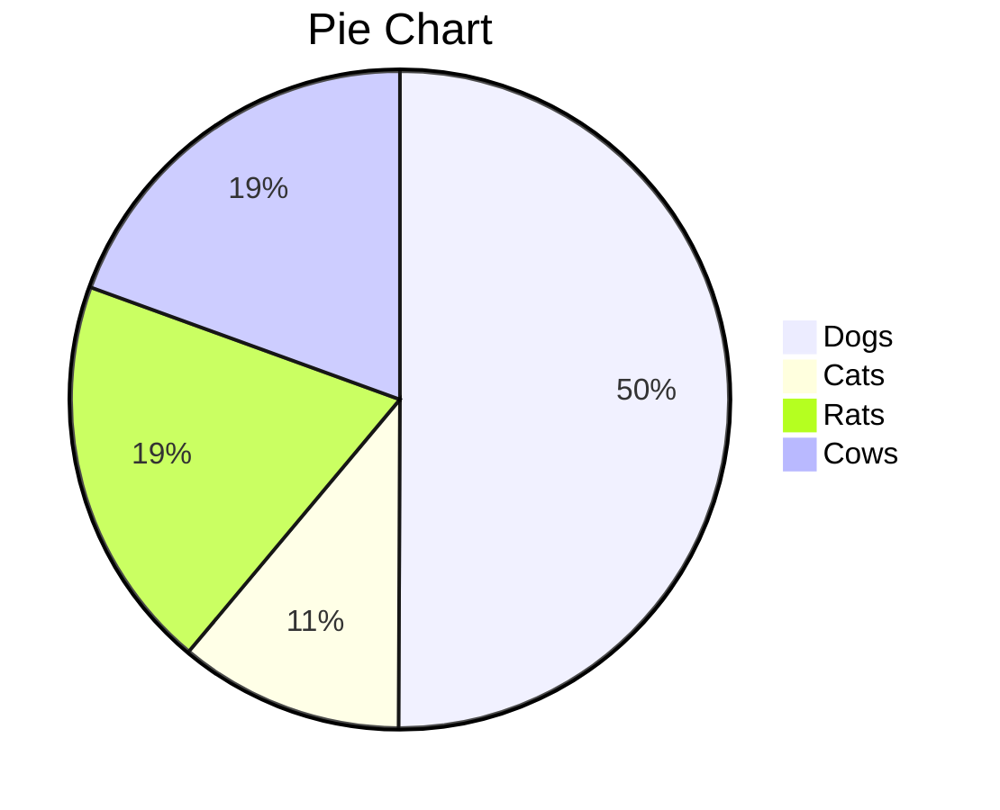
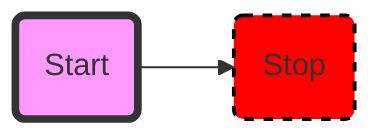
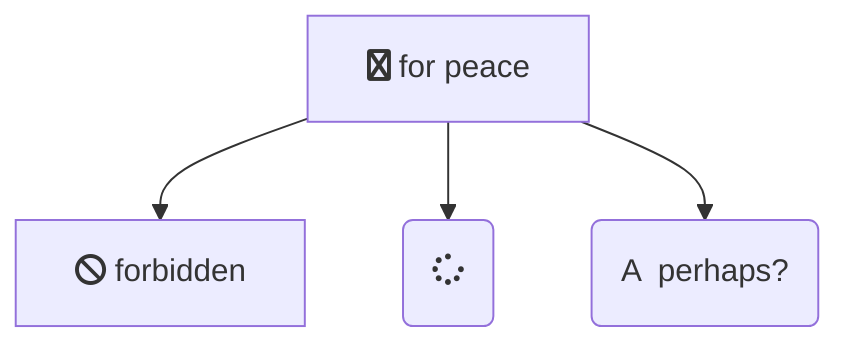
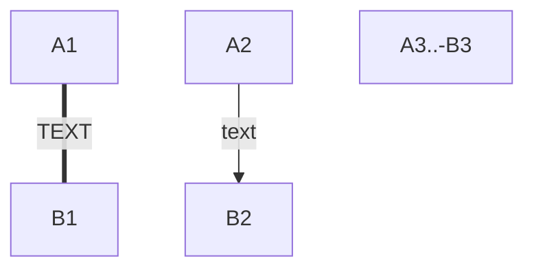
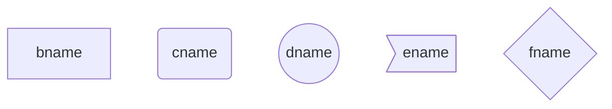

> Markdown作为自媒体人非常方便的一个工具，可以再各大自媒体网站通用，实现一篇多发的效果。其语法简单，几乎可以抛弃鼠标，生成一切样式。
>

<!-- more -->

# 符号

符号(英文输入状态下，开头输入“:”+英文字母有提示)


## Markdown箭头的输入方法汇总

### 普通箭头

|     箭头形状      | MarkDown           |
| :---------------: | ------------------ |
|    $\uparrow$     | \$\uparrow$        |
|    $\Uparrow$     | \$\Uparrow$        |
|   $\downarrow$    | \$\downarrow$      |
|   $\Downarrow$    | \$\Downarrow$      |
|   $\leftarrow$    | \$\leftarrow$      |
|   $\Leftarrow$    | \$\Leftarrow$      |
|   $\rightarrow$   | \$\rightarrow$     |
|   $\Rightarrow$   | \$\Rightarrow$     |
|  $\updownarrow$   | \$\updownarrow$    |
|  $\Updownarrow$   | \$\Updownarrow$    |
| $\leftrightarrow$ | \$\leftrightarrow$ |
| $\Leftrightarrow$ | \$\Leftrightarrow$ |
---
### 长箭头

|       箭头形状        | MarkDown               |
| :-------------------: | ---------------------- |
|   $\longleftarrow$    | \$\longleftarrow$      |
|   $\Longleftarrow$    | \$\Longleftarrow$      |
|   $\longrightarrow$   | \$\longrightarrow$     |
|   $\Longrightarrow$   | \$\Longrightarrow$     |
| $\longleftrightarrow$ | \$\longleftrightarrow$ |
| $\Longleftrightarrow$ | \$\Longleftrightarrow$ |
---
### 其他箭头

|        箭头形状        | MarkDown                |
| :--------------------: | ----------------------- |
|  $\twoheadrightarrow$  | \$\twoheadrightarrow$   |
|   $\rightarrowtail$    | \$\rightarrowtail$      |
|   $\looparrowright$    | \$\looparrowright$      |
|   $\curvearrowright$   | \$\curvearrowright$     |
|  $\circlearrowright$   | \$\circlearrowright$    |
|         $\Rsh$         | \$\Rsh$                 |
|      $\multimap$       | \$\multimap$            |
| $\leftrightsquigarrow$ | \$\leftrightsquigarrow$ |
|   $\rightsquigarrow$   | \$\rightsquigarrow$     |
|       $\leadsto$       | \$\leadsto$             |
|       $\nearrow$       | \$\nearrow$             |
|       $\searrow$       | \$\searrow$             |
|       $\swarrow$       | \$\swarrow$             |
|       $\nwarrow$       | \$\nwarrow$             |
|     $\nleftarrow$      | \$\nleftarrow$          |
|     $\nLeftarrow$      | \$\nLeftarrow$          |
|     $\nrightarrow$     | \$\nrightarrow$         |
|     $\nRightarrow$     | \$\nRightarrow$         |
|   $\nleftrightarrow$   | \$\nleftrightarrow$     |
|   $\nLeftrightarrow$   | \$\nLeftrightarrow$     |
|   $\dashrightarrow$    | \$\dashrightarrow$      |
|    $\dashleftarrow$    | \$\dashleftarrow$       |
|   $\leftleftarrows$    | \$\leftleftarrows$      |
|   $\leftrightarrows$   | \$\leftrightarrows$     |
|     $\Lleftarrow$      | \$\Lleftarrow$          |
|  $\twoheadleftarrow$   | \$\twoheadleftarrow$    |
|    $\leftarrowtail$    | \$\leftarrowtail$       |
|    $\looparrowleft$    | \$\looparrowleft$       |
|   $\curvearrowleft$    | \$\curvearrowleft$      |
---
|       箭头形状       | MarkDown              |
| :------------------: | --------------------- |
|  $\circlearrowleft$  | \$\circlearrowleft$   |
|        $\Lsh$        | \$\Lsh$               |
|      $\mapsto$       | \$\mapsto$            |
|   $\hookleftarrow$   | \$\hookleftarrow$     |
|  $\hookrightarrow$   | \$\hookrightarrow$    |
|  $\upharpoonright$   | \$\upharpoonright$    |
|   $\upharpoonleft$   | \$\upharpoonleft$     |
| $\downharpoonright$  | \$\downharpoonright$  |
|  $\downharpoonleft$  | \$\downharpoonleft$   |
|   $\leftharpoonup$   | \$\leftharpoonup$     |
|  $\rightharpoonup$   | \$\rightharpoonup$    |
| $\rightharpoondown$  | \$\rightharpoondown$  |
|  $\leftharpoondown$  | \$\leftharpoondown$   |
|    $\upuparrows$     | \$\upuparrows$        |
|  $\downdownarrows$   | \$\downdownarrows$    |
| $\rightrightarrows$  | \$\rightrightarrows$  |
|  $\rightleftarrows$  | \$\rightleftarrows$   |
|  $\leftleftarrows$   | \$\leftleftarrows$    |
|  $\leftrightarrows$  | \$\leftrightarrows$   |
| $\rightleftharpoons$ | \$\rightleftharpoons$ |
| $\leftrightharpoons$ | \$\leftrightharpoons$ |

分割线

***

---

----

[LaTeX符号](https://blog.csdn.net/garfielder007/article/details/51646604)

语法：$\clubsuit$  $\triangleright$


# 格式
```
&emsp;首行缩进
~~删除线~~
~缩小~
`代码`  
---  分割线
\<font color=red>字体颜色\</font>
+空格[空格]空格  勾选框
[内容文字](#标题)  页内跳转
[内容文字](跳转目标文件的相对路径)
下划线 html 方法：\<span style="border-bottom:2px dashed yellow;">文字\</span>
下划线 typory 方法（ctrl+u）： \<u>awdw\</u>
```

# 图

## 图片（hexo）

### 图

### \+ 横竖图


### \+ 横图4


### \+ 竖图5


## 导图

<!-- 
- Fengx
	- 任何方向
		- 编程语言
			- Java
		- SQL
		- Linux
		- Git
	- 技术
		- Java Web
		- 数据库
		- Docker
		- svn
		- 消息队列(MQ)
		- mycat
		- 大数据
			- Hadoop
			- HBase
	- 内功
		- 计算机基础
			- 计算机网络
			- 计算机操作系统
			- 编译原理
			- 计算机组成原理
		- 数据结构与算法
		- 设计模式
		- 性能优化
		- 架构设计
		- 软件工程
	- 其他
		- 英语
		- 博客
		 -->

## 状态转移图

```mermaid
stateDiagram
  %% 单程生命周期起点是实心圆，终点是同心圆，内圆为实心。
  %%这个例子包含是3个状态Still, Moving 和 Crash. 从Still状态可以转移到Moving，从Moving可以转移到Still 或者 Crash。不能从Still转移到Crash
    [*] --> Still 
    Still --> [*]
    Still --> Moving: A transition
    note right of Moving
            Moving可以转移到Still或者Crash
    end note
    Moving --> Still 
    Moving --> Crash
    Crash --> [*]
```





## 类图

```mermaid
classDiagram
class Duck{
          -String beakColor
          - double weight
          +swim()
          +quack()
          #count()
          +getPrice(count) double
          +someAbstractMethod() *
          -someStaticMethod() $
      }
class Shape{
%% This whole line is a comment classDiagram class Shape \<\<interface>>
    \<\<interface>>
    noOfVertices
    draw()
}
class Color{
    \<\<enumeration>>
    RED
    BLUE
    GREEN
    WHITE
    BLACK
}
class Relation{
    \<\<\<\<abstract>>>>
}

classK ..> classL : 依赖关系
classA --|> classB : 继承关系（泛化）
classM ..|> classN : 实现关系
classG --> classH : 关联关系
classE --o classF : 聚合关系
classC --* classD : 组合关系

    Customer "1" --> "*" Ticket
    Student "1" --> "1..*" Course
    Galaxy --> "many" Star : Contains
    Sky "1"--> "1" Sun
    Parent "1" -- "0..2" Children
    Person "1" -- "2" Eyes
```




## 饼图





## 渲染效果




## 基础fontawesome支持




## 连线




## 节点形状




## 甘特图

关键词说明：
title—标题
dateFormat—日期格式
section—模块
Completed—已经完成
Active—当前正在进行
Future—后续待处理
crit—关键阶段

```mermaid
gantt
　　　dateFormat　YYYY-MM-DD
　　　title Adding GANTT diagram functionality to mermaid
　　　section A section
　　　Completed task　　:done, des1, 2014-01-06,2014-01-08
　　　Active task 　　　　:active, des2, 2014-01-09, 3d
　　　future task 　　　　:　　　  des3, after des2, 5d
　　　future task2　　　　:　　　  des4, after des3, 5d
　　　section Critical tasks
　　　Completed task in the critical line　:crit, done, 2014-01-06,24h
　　　Implement parser and json　　　　　　:crit, done, after des1, 2d
　　　Create tests for parser　　　　　　　:crit, active, 3d
　　　Future task in critical line　　　　　:crit, 5d
　　　Create tests for renderer　　　　　　:2d
　　　Add to ,mermaid　　　　　　　　　　　:1d
```


## 流程图

```flow

flowchat
st=>start: Start|past:>http://www.google.com[blank]
e=>end: End:>http://www.google.com
op1=>operation: My Operation|past
op2=>operation: Stuff|current
sub1=>subroutine: My Subroutine|invalid
cond=>condition: Yes
or No?|approved:>http://www.google.com
c2=>condition: Good idea|rejected
io=>inputoutput: catch something…|request
st->op1(right)->cond
cond(yes, right)->c2
cond(no)->sub1(left)->op1
c2(yes)->io->e
c2(no)->op2->e
```




```mermaid
graph TD

A[方形] -->B(圆角)

  B --> C{条件a}

  C -->|a=1| D[结果1]

  C -->|a=2| E[结果2]

  F[竖向流程图]
```

## 时序图示例

```sequence
Title:时序图示例
客户端->服务端: 我想找你拿下数据 SYN
服务端-->客户端: 我收到你的请求啦 ACK+SYN
客户端->>服务端: 我收到你的确认啦，我们开始通信吧 ACK
Note right of 服务端: 我是一个服务端
Note left of 客户端: 我是一个客户端
Note over 服务端,客户端: TCP 三次握手
participant 观察者

```

# 公式

$$
\mathbf{V}_1 \times \mathbf{V}_2 =  \begin{vmatrix} 
\mathbf{i} & \mathbf{j} & \mathbf{k} \\
\frac{\partial X}{\partial u} &  \frac{\partial Y}{\partial u} & 0 \\
\frac{\partial X}{\partial v} &  \frac{\partial Y}{\partial v} & 0 \\
\end{vmatrix}
${$tep1}{\style{visibility:hidden}{(x+1)(x+1)}}
$$

# 表格

ctl+回车新增行

| 左对齐 | 右对齐 | 居中对齐 |
| :-----| ----: | :----: |
| 单元格 | 单元格 | 单元格 |
| 单元格 | 单元格 | 单元格 |
|  |  |  |

# 代码
```java
hello!
```
Hexo可折叠

```java main.java >folded
可折叠代码块
```


# 脚注

文字内容 [^1]

# todo列表

+空格[空格]空格  **勾选框**+ [ ] 

+ [ ] 

+ [ ] 

>+ [ ] 读书
>>+ [ ] 《》
>+ [ ] 专业
>>+ [ ] （设计模式代码Demo，
>>+ [ ] 网络，
>>+ [ ] JVM，
>>+ [ ] VUE项目，
>>+ [ ] Linux）
>+ [ ] 音乐
>>+ [ ] 吉他谱扒谱学习
>+ [ ] 运动
>+ [ ] 画画

# Typory

## 自定义元素样式（修改CSS）


## 快捷键


# 其他

### [emoji](https://emojipedia.org/microsoft/)【外可访】，Typora 快捷键WIN+。
🎈🎈
🤲

😎

++inserted++ => \<ins>inserted\</ins>

29^th^ => 29\<sup>th\</sup>
H~2~0 => H\<sub>2\</sub>O

basic footnote[^1]
here is an inline footnote[^2](inline footnote)
and another one[^3]
and another one[^4]

[^1]: basic footnote content
[^3]: paragraph

footnote
content

[^4]: footnote content with some [markdown](https://en.wikipedia.org/wiki/Markdown)


*[HTML]: Hyper Text Markup Language
*[W3C]:  World Wide Web Consortium

The HTML specification
is maintained by the W3C.

