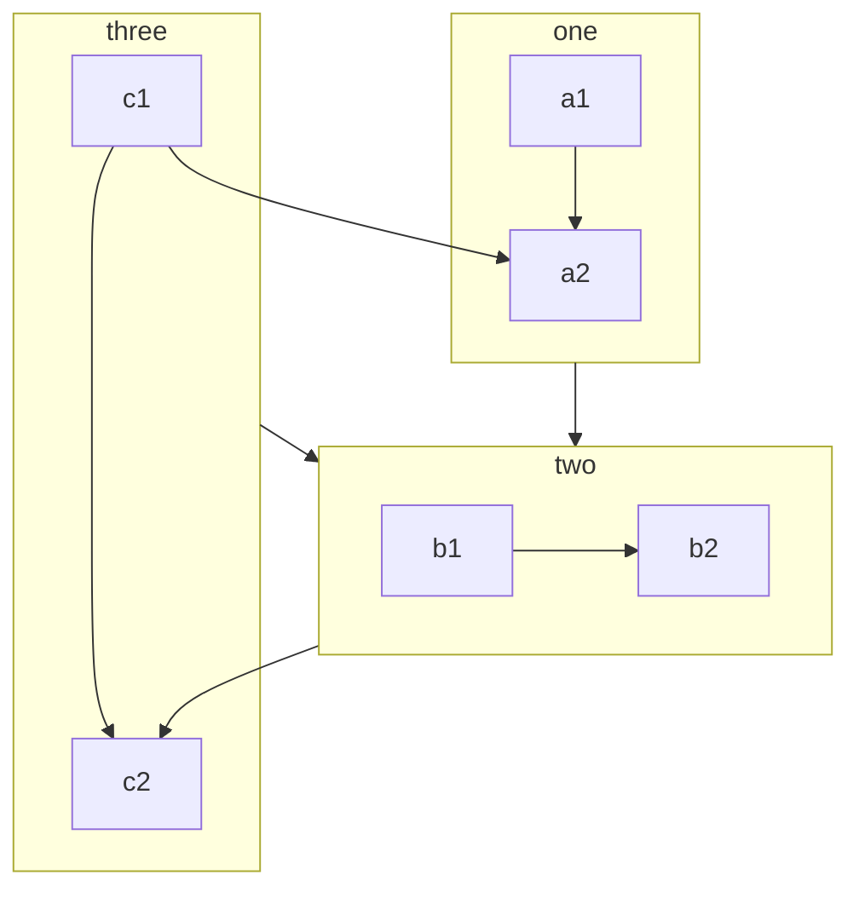
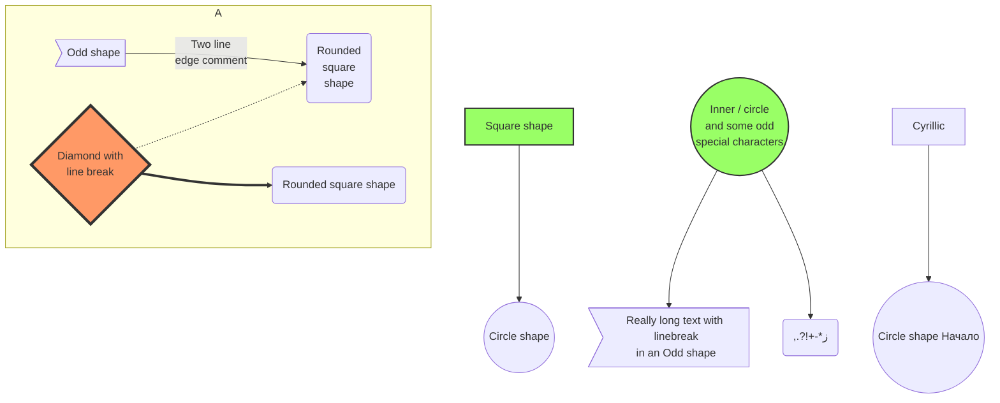

> VUEPress使用例子

<!-- more -->

# 代码行

## 部分行高亮

```java {1,3-4}
system.out.println("Hello GISFSDE!")
system.out.println("Hello GISFSDE!")    
system.out.println("Hello GISFSDE!")    
system.out.println("Hello GISFSDE!")    
```

## 去掉行号

```java :no-line-numbers
system.out.println("Hello GISFSDE!")  
```

## 代码行中的 VUE 编译

```md 
<!-- 默认情况下，这里会被保持原样 --> 
1 + 2 + 3 = {{ 1 + 2 + 3 }}
```

```md:no-v-pre
<!-- 这里会被 Vue 编译 --> 
1 + 2 + 3 = {{ 1 + 2 + 3 }} 
```

``` js:no-v-pre 
// 由于 JS 代码高亮，这里不会被正确编译 
const onePlusTwoPlusThree = {{ 1 + 2 + 3 }}
```

## 代码块导入

```markdown
导入 "../foo.js" 文件的第 3 行至第 10 行
指定语言为 "js"
对导入代码的第 3 行进行高亮
即 "../foo.js" 文件的第 5 行
禁用行号
@[code{3-10} js{3}:no-line-numbers](../foo.js)
```

#  组件

## Badge

- <Badge text="tip" type="tip" vertical="middle" />
- <Badge text="warning" type="warning" vertical="middle" />
- <Badge text="danger" type="danger" vertical="middle" />
- <Badge text="info" type="info" vertical="middle" />
- <Badge text="note" type="note" vertical="middle" />

## CodePen

<CodePen
  link="https://codepen.io/kowlor/pen/ZYYQoy"
  title="Solar System animation - Pure CSS"
  :default-tab="['css','result']"
  :theme="$isDarkMode? 'dark': 'light'"
/>

<CodePen
  link="https://codepen.io/kowlor/pen/ZYYQoy"
  title="Envelope w/ Hearts"
  status="clicktorun"
  :theme="$isDarkMode? 'dark': 'light'"
/>

<CodePen
  user="kowlor"
  slug-hash="ZYYQoy"
  title="Solar System animation - Pure CSS"
  :default-tab="['css','result']"
  :theme="$isDarkMode? 'dark': 'light'"
/>

## FontIcon

- 主页图标: <FontIcon icon="home" />

- 一个大红 Markdown 图标: <FontIcon icon="markdown" color="red" size="32" />

## PDF

可设置禁用工具栏与初始页面

<PDF url="https://hzghydt.hzsgis.com:8086/profile/upload/2022/05/27/3640bcccb37ba5aca8a796e93aebbfbd.pdf" :toolbar="false" :page="2"/>

## StackBlitz

<StackBlitz id="vuepress-theme-hope" />

<StackBlitz id="vuepress-theme-hope" hideExplorer hideNavigation hidedevtools />

# 幻灯片

@slidestart

## 幻灯片 1

一个有文字和 [链接](https://mrhope.site) 的段落

---

## 幻灯片 2

- 项目 1
- 项目 2

---

## 幻灯片 3.1

```js
const a = 1;
```

--

## 幻灯片 3.2

$$
J(\theta_0,\theta_1) = \sum_{i=0}
$$

@slideend

# 图表

## Chart

 ::: chart 一个块状图案例

```json
{
  "type": "bar",
  "data": {
    "labels": ["红色", "蓝色", "黄色", "绿色", "紫色", "橙色"],
    "datasets": [
      {
        "label": "投票数",
        "data": [12, 19, 3, 5, 2, 3],
        "backgroundColor": [
          "rgba(255, 99, 132, 0.2)",
          "rgba(54, 162, 235, 0.2)",
          "rgba(255, 206, 86, 0.2)",
          "rgba(75, 192, 192, 0.2)",
          "rgba(153, 102, 255, 0.2)",
          "rgba(255, 159, 64, 0.2)"
        ],
        "borderColor": [
          "rgba(255, 99, 132, 1)",
          "rgba(54, 162, 235, 1)",
          "rgba(255, 206, 86, 1)",
          "rgba(75, 192, 192, 1)",
          "rgba(153, 102, 255, 1)",
          "rgba(255, 159, 64, 1)"
        ],
        "borderWidth": 1
      }
    ]
  },
  "options": {
    "scales": {
      "y": {
        "beginAtZero": true
      }
    }
  }
}
```

 :::

 ::: chart 一个气泡图案例

```json
{
  "type": "bubble",
  "data": {
    "datasets": [
      {
        "label": "第一个数据集",
        "data": [
          { "x": 20, "y": 30, "r": 15 },
          { "x": 40, "y": 10, "r": 10 }
        ],
        "backgroundColor": "rgb(255, 99, 132)"
      }
    ]
  }
}
```

 :::

 ::: chart 一个线状图案例

```json
{
  "type": "line",
  "data": {
    "labels": ["一月", "二月", "三月", "四月", "五月", "六月", "七月"],
    "datasets": [
      {
        "label": "我的第一个数据集",
        "data": [65, 59, 80, 81, 56, 55, 40],
        "fill": false,
        "borderColor": "rgb(75, 192, 192)",
        "tension": 0.1
      }
    ]
  }
}
```

 :::

 ::: chart 一个玫瑰图案例

```json
{
  "type": "polarArea",
  "data": {
    "labels": ["红色", "绿色", "黄色", "灰色", "蓝色"],
    "datasets": [
      {
        "label": "My First Dataset",
        "data": [11, 16, 7, 3, 14],
        "backgroundColor": [
          "rgb(255, 99, 132)",
          "rgb(75, 192, 192)",
          "rgb(255, 205, 86)",
          "rgb(201, 203, 207)",
          "rgb(54, 162, 235)"
        ]
      }
    ]
  }
}
```

:::

::: chart 一个雷达图案例

```json
{
  "type": "radar",
  "data": {
    "labels": ["吃饭", "喝水", "睡觉", "设计", "编程", "骑车", "跑步"],
    "datasets": [
      {
        "label": "我的第一个数据集",
        "data": [65, 59, 90, 81, 56, 55, 40],
        "fill": true,
        "backgroundColor": "rgba(255, 99, 132, 0.2)",
        "borderColor": "rgb(255, 99, 132)",
        "pointBackgroundColor": "rgb(255, 99, 132)",
        "pointBorderColor": "#fff",
        "pointHoverBackgroundColor": "#fff",
        "pointHoverBorderColor": "rgb(255, 99, 132)"
      },
      {
        "label": "我的第二个数据集",
        "data": [28, 48, 40, 19, 96, 27, 100],
        "fill": true,
        "backgroundColor": "rgba(54, 162, 235, 0.2)",
        "borderColor": "rgb(54, 162, 235)",
        "pointBackgroundColor": "rgb(54, 162, 235)",
        "pointBorderColor": "#fff",
        "pointHoverBackgroundColor": "#fff",
        "pointHoverBorderColor": "rgb(54, 162, 235)"
      }
    ]
  },
  "options": {
    "elements": {
      "line": {
        "borderWidth": 3
      }
    }
  }
}
```

:::

 ::: chart 一个散点图案例

```json
{
  "type": "scatter",
  "data": {
    "datasets": [
      {
        "label": "散点数据集",
        "data": [
          { "x": -10, "y": 0 },
          { "x": 0, "y": 10 },
          { "x": 10, "y": 5 },
          { "x": 0.5, "y": 5.5 }
        ],
        "backgroundColor": "rgb(255, 99, 132)"
      }
    ]
  },
  "options": {
    "scales": {
      "x": {
        "type": "linear",
        "position": "bottom"
      }
    }
  }
}
```

 :::

## ECcharts

 ::: echarts 一个折线图案例

```json
{
  "xAxis": {
    "type": "category",
    "data": ["Mon", "Tue", "Wed", "Thu", "Fri", "Sat", "Sun"]
  },
  "yAxis": {
    "type": "value"
  },
  "series": [
    {
      "data": [150, 230, 224, 218, 135, 147, 260],
      "type": "line"
    }
  ]
}
```

 :::

 ::: echarts 一个柱状图案例

```json
{
  "xAxis": {
    "type": "category",
    "data": ["Mon", "Tue", "Wed", "Thu", "Fri", "Sat", "Sun"]
  },
  "yAxis": {
    "type": "value"
  },
  "series": [
    {
      "data": [120, 200, 150, 80, 70, 110, 130],
      "type": "bar",
      "showBackground": true,
      "backgroundStyle": {
        "color": "rgba(180, 180, 180, 0.2)"
      }
    }
  ]
}
```

 :::

 ::: echarts 一个基础南丁格尔玫瑰图案例

```json
{
  "legend": {
    "top": "bottom"
  },
  "toolbox": {
    "show": true,
    "feature": {
      "mark": {
        "show": true
      },
      "dataView": {
        "show": true,
        "readOnly": false
      },
      "restore": {
        "show": true
      },
      "saveAsImage": {
        "show": true
      }
    }
  },
  "series": [
    {
      "name": "Nightingale Chart",
      "type": "pie",
      "radius": [20, 100],
      "center": ["50%", "50%"],
      "roseType": "area",
      "itemStyle": {
        "borderRadius": 8
      },
      "data": [
        {
          "value": 40,
          "name": "rose 1"
        },
        {
          "value": 38,
          "name": "rose 2"
        },
        {
          "value": 32,
          "name": "rose 3"
        },
        {
          "value": 30,
          "name": "rose 4"
        },
        {
          "value": 28,
          "name": "rose 5"
        },
        {
          "value": 26,
          "name": "rose 6"
        },
        {
          "value": 22,
          "name": "rose 7"
        },
        {
          "value": 18,
          "name": "rose 8"
        }
      ]
    }
  ]
}
```

 :::

 ::: echarts 一个散点图案例

```json
{
  "xAxis": {},
  "yAxis": {},
  "series": [
    {
      "symbolSize": 20,
      "data": [
        [10.0, 8.04],
        [8.07, 6.95],
        [13.0, 7.58],
        [9.05, 8.81],
        [11.0, 8.33],
        [14.0, 7.66],
        [13.4, 6.81],
        [10.0, 6.33],
        [14.0, 8.96],
        [12.5, 6.82],
        [9.15, 7.2],
        [11.5, 7.2],
        [3.03, 4.23],
        [12.2, 7.83],
        [2.02, 4.47],
        [1.05, 3.33],
        [4.05, 4.96],
        [6.03, 7.24],
        [12.0, 6.26],
        [12.0, 8.84],
        [7.08, 5.82],
        [5.02, 5.68]
      ],
      "type": "scatter"
    }
  ]
}
```

:::

## Mermaid
流程图


循环图

```sequence
Alice ->> Bob: Hello Bob, how are you?
Bob-->>John: How about you John?
Bob--x Alice: I am good thanks!
Bob-x John: I am good thanks!
Note right of John: Bob thinks a long<br/>long time, so long<br/>that the text does<br/>not fit on a row.

Bob-->Alice: Checking with John...
Alice->John: Yes... John, how are you?
```
类图

```class
class Square~Shape~{
    int id
    List~int~ position
    setPoints(List~int~ points)
    getPoints() List~int~
}

Square : -List~string~ messages
Square : +setMessages(List~string~ messages)
Square : +getMessages() List~string~
```
状态图

```state
[*] --> Active

state Active {
    [*] --> NumLockOff
    NumLockOff --> NumLockOn : EvNumLockPressed
    NumLockOn --> NumLockOff : EvNumLockPressed
    --
    [*] --> CapsLockOff
    CapsLockOff --> CapsLockOn : EvCapsLockPressed
    CapsLockOn --> CapsLockOff : EvCapsLockPressed
    --
    [*] --> ScrollLockOff
    ScrollLockOff --> ScrollLockOn : EvScrollLockPressed
    ScrollLockOn --> ScrollLockOff : EvScrollLockPressed
}
```
关系图

```er
CAR ||--o{ NAMED-DRIVER : allows
CAR {
    string registrationNumber
    string make
    string model
}
PERSON ||--o{ NAMED-DRIVER : is
PERSON {
    string firstName
    string lastName
    int age
}
```
用户日记图

```journey
title My working day
section Go to work
  Make tea: 5: Me
  Go upstairs: 3: Me
  Do work: 1: Me, Cat
section Go home
  Go downstairs: 5: Me
  Sit down: 5: Me
```
甘特图

```gantt
dateFormat  YYYY-MM-DD
title       Adding GANTT diagram functionality to mermaid
excludes    weekends
%% (`excludes` accepts specific dates in YYYY-MM-DD format, days of the week ("sunday") or "weekends", but not the word "weekdays".)

section A section
Completed task            :done,    des1, 2014-01-06,2014-01-08
Active task               :active,  des2, 2014-01-09, 3d
Future task               :         des3, after des2, 5d
Future task2              :         des4, after des3, 5d

section Critical tasks
Completed task in the critical line :crit, done, 2014-01-06,24h
Implement parser and jison          :crit, done, after des1, 2d
Create tests for parser             :crit, active, 3d
Future task in critical line        :crit, 5d
Create tests for renderer           :2d
Add to mermaid                      :1d

section Documentation
Describe gantt syntax               :active, a1, after des1, 3d
Add gantt diagram to demo page      :after a1  , 20h
Add another diagram to demo page    :doc1, after a1  , 48h

section Last section
Describe gantt syntax               :after doc1, 3d
Add gantt diagram to demo page      :20h
Add another diagram to demo page    :48h
```
饼图

```pie
title What Voldemort doesn’t have?
  "FRIENDS" : 2
  "FAMILY" : 3
  "NOSE" : 45
```
案例



# 容器

 ::: info 信息容器。

 ::: 

 ::: note 注释容器。

 :::

 ::: tip 提示容器

 ::: 

 ::: warning 警告容器

 ::: 

 ::: danger 危险容器 

 :::

 ::: details 详情容器 

 ::: 

 ::: info 自定义标题 一个有`代码` 和 [链接](#markdown) 的信息容器。 

```js 
const a = 1; 
```

 ::: 

 ::: note 自定义标题 一个有`代码` 和 [链接](#markdown) 的注释容器。 

```js 
const a = 1; 
```

 ::: 

 ::: tip 自定义标题 一个有`代码` 和 [链接](#markdown) 的提示容器。 

```js 
const a = 1; 
```

 ::: 

 ::: warning 自定义标题 一个有`代码` 和 [链接](#markdown) 的警告容器。 

```js 
const a = 1; 
```

 ::: 

 ::: danger 自定义标题 一个有`代码` 和 [链接](#markdown) 的危险容器。 

```js 
const a = 1;
```

 ::: 

 ::: details 自定义标题 一个有`代码` 和 [链接](#markdown) 的详情容器。

```js 
 const a = 1; 
```

 :::

 ::: info 自定义信息 

 ::: 

 ::: note 自定义注释 

 :::

 ::: tip 自定义提示 

 :::

 ::: warning 自定义警告

 ::: 

::: danger 自定义危险

 :::

# [Emoji](https://vuepress-theme-hope.gitee.io/v2/zh/cookbook/markdown/emoji/people.html)
# 选项卡

## 多选项卡之间可通过 ID 绑定

::: tabs#fruit

@tab apple#apple

Apple

@tab banana#banana

Banana

:::

::: tabs#fruit

@tab apple

Apple

@tab banana

Banana

@tab orange

Orange

:::

::: tabs

@tab apple

Apple

@tab banana

Banana

@tab orange

Orange

:::

## 代码选项卡

::: code-tabs#shell

@tab pnpm 

```bash
pnpm add -D vuepress-theme-hope@next 
```

@tab yarn 

```bash 
yarn add -D vuepress-theme-hope@next
```

@tab:active npm 

```bash 
npm i -D vuepress-theme-hope@next 
```

:::

::: code-tabs#shell

@tab pnpm 

```bash 
pnpm add -D vuepress-plugin-md-enhance@next 
```

@tab yarn 

```bash 
yarn add -D vuepress-plugin-md-enhance@next
```

@tab:active npm 

```bash 
npm i -D vuepress-plugin-md-enhance@next 
```

:::

# 脚注

脚注 1 链接[^first]. 

脚注 2 链接[^second]. 

行内的脚注^[Text of inline footnote] 定义. 

重复的页脚定义[^second]. 

[^first]: 脚注**可以包含特殊标记**   

 也可以由多个段落组成

[^second]: 脚注文字。

# 任务列表

- [ ] Plan A
- [x] Plan B

# 自动对齐

 :::: danger W.I.P 

vuepress-theme-hope v2 仍在制作中，API 可能会有 

 ::: center 

重大的变动。

 ::: 

如果你在使用过程中遇到了 bug，可以

 ::: right 

[提一个 issue](https://github.com/vuepress-theme-hope/vuepress-theme-hope/issues)。 

 ::: 

 ::::

# 上下角标

- 19^th^
- H~2~O

# 标记

是 ==标记== 两边有空格!

# 图片

GFM 支持通过 ID 标记图片，使得图片只在特定的模式显示。我们同时支持 GitHub 的标记与简易标记`#light` 和`#dark`。`=widthxheight` 指定图像大小


# [公式](https://vuepress-theme-hope.gitee.io/v2/zh/guide/markdown/tex.html#%E5%A4%9A%E8%A1%8C%E5%85%AC%E5%BC%8F)

# [导入文件](https://vuepress-theme-hope.github.io/v2/zh/guide/markdown/include.html#%E9%AB%98%E7%BA%A7%E7%94%A8%E6%B3%95)